# 第十四章：使用流行扩展

在*第十三章*，“在 Visual Studio 中使用扩展”，我们学习了如何通过安装由 Visual Studio 社区和第三方供应商发布的扩展来扩展实用工具和功能。我们可以使用 Visual Studio 中的扩展管理器安装这些扩展，然后重新启动 Visual Studio 以查看用户界面的更改。

在本章中，我们将分析一些免费且有用的扩展，以提高生产力和改善我们使用 Visual Studio 的体验。我们将在以下部分安装和审查这些扩展：

+   添加 HTML 代码片段包

+   使用 CodeMaid 清理代码

+   使用 Web 编译器编译网络库

+   使用缩进引导识别空白

我们将从 HTML 代码片段包开始，这是一个帮助我们当编写 HTML 文件时在 Visual Studio 中包含一些额外代码片段的扩展。

# 技术要求

要在 Visual Studio 2022 中安装扩展，您必须已经安装了带有 Web 开发工作负载的 Visual Studio 2022，如*第一章*，“开始使用 Visual Studio 2022”中所示。在*第四章*，“创建项目和模板”中创建 SPA 项目也很重要。

您可以通过以下链接查看本章中项目所做的更改：[`github.com/PacktPublishing/Hands-On-Visual-Studio-2022/tree/main/Chapter14`](https://github.com/PacktPublishing/Hands-On-Visual-Studio-2022/tree/main/Chapter14)。

# 添加 HTML 代码片段包

在*第六章*，“添加代码片段”，我们回顾了代码片段如何在我们编码时提高我们的生产力。我们还学习了如何使用代码片段管理器创建、导入和删除代码片段。

在 Visual Studio 的扩展市场中，我们可以通过导航到 [`marketplace.visualstudio.com/`](https://marketplace.visualstudio.com/) 并在搜索栏中输入 `snippet` 来找到许多扩展，这些扩展为不同的技术添加代码片段（见图 14.1）：

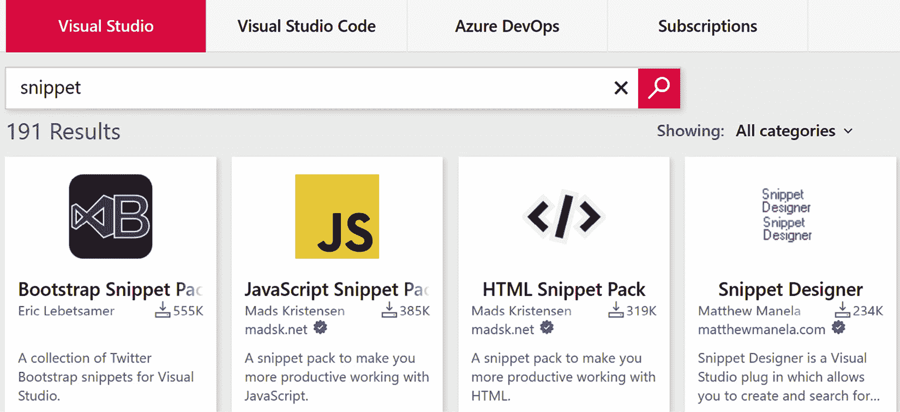


图 14.1 – 与 Visual Studio Marketplace 中的代码片段相关的扩展

对于网页开发者来说，最受欢迎的代码片段包之一是**HTML 代码片段包**。使用此扩展，你可以更快地编写 HTML 代码，在编辑器中输入一些字符后，创建代码片段和 HTML 元素。让我们安装这个扩展，看看我们如何使用代码片段轻松创建 HTML 元素。

## 下载和安装 HTML 代码片段包

在 Visual Studio 中，在搜索栏中导航到 `HTML 代码片段`。然后，选择 **HTML 代码片段包** 并点击 **下载**（见图 14.2）：


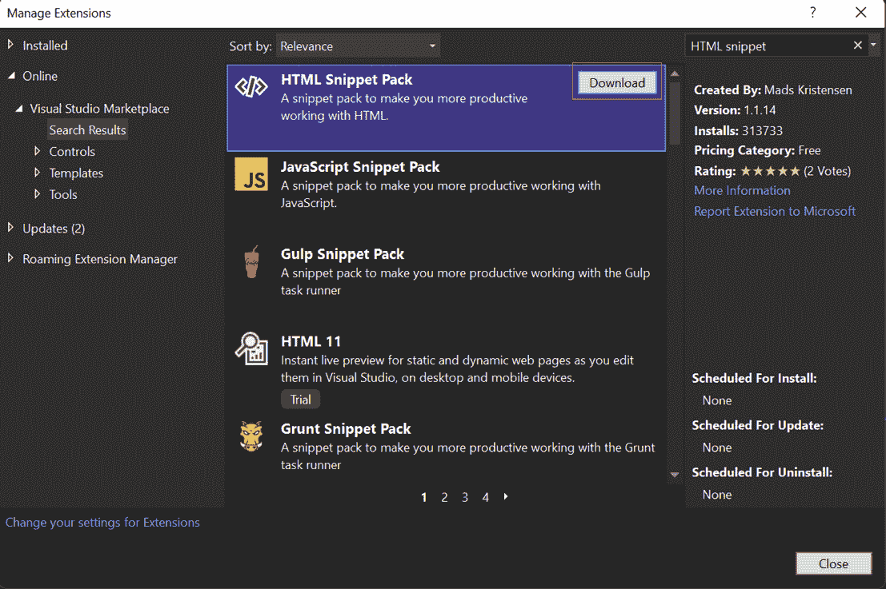

图 14.2 – 管理扩展工具中的 HTML 片段包

我们将收到通知，这意味着我们需要关闭并重新打开（重启）Visual Studio 以完成安装。再次打开 Visual Studio 后，它将要求确认安装扩展。点击 **修改**（见 *图 14.3*）：

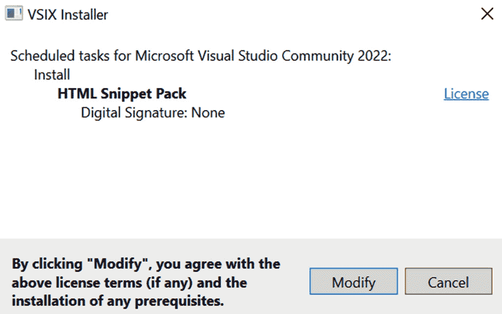

图 14.3 – 安装 HTML 片段包

然后，我们将看到一个进度条，指示安装正在进行。最后，我们将看到一个成功消息：

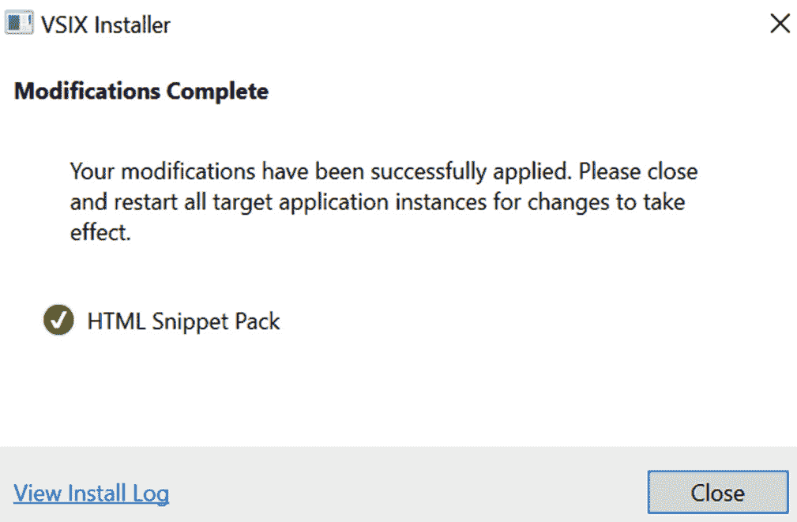

图 14.4 – HTML 片段包扩展安装完成

点击 **关闭** 并继续使用 Visual Studio。

## 使用 HTML 片段包

我们需要导航到一个 HTML 文件来使用 HTML 片段包扩展，所以让我们转到 `index.html`。

在此文件中，我们可以在 body 元素中写下单词 `article`（见 *图 14.5*）：


图 14.5 – 在 index.html 中输入 article

在键入单词 `article` 后，按键盘上的 *tab* 键可以轻松生成此部分代码中的文章 HTML 元素。在 *图 14.6* 中，我们可以看到自动生成的文章元素：

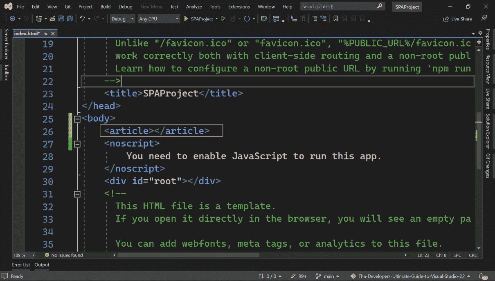

图 14.6 – 使用代码片段生成的文章

正如我们生成了 `article` 元素一样，我们可以轻松地创建 `li`、`ul`、`img`、`input` 以及 HTML 标准中几乎所有的现有元素。

您可以在官方网站和仓库 [`github.com/madskristensen/HtmlSnippetPack`](https://github.com/madskristensen/HtmlSnippetPack) 上阅读有关 HTML 片段包的更多信息。

现在我们来回顾一个不同的扩展来分析我们的代码。

# 使用 CodeMaid 清理代码

CodeMaid 是一个惊人的扩展，帮助我们简化并清理代码。它是免费的，并且与 C#、C++、F#、VB、PHP、PowerShell、R、JSON、XAML、XML、ASP、HTML、CSS、LESS、SCSS、JavaScript 和 TypeScript 兼容。

您可以在官方网站 [`www.codemaid.net/`](https://www.codemaid.net/) 上阅读有关 CodeMaid 的更多信息。

让我们安装 CodeMaid 并看看我们如何使用它。

## 在 Visual Studio 2022 中安装 CodeMaid

要安装 CodeMaid，在搜索栏中导航到 `codemaid`，然后选择 **CodeMaid VS2022**（见 *图 14.7*）：

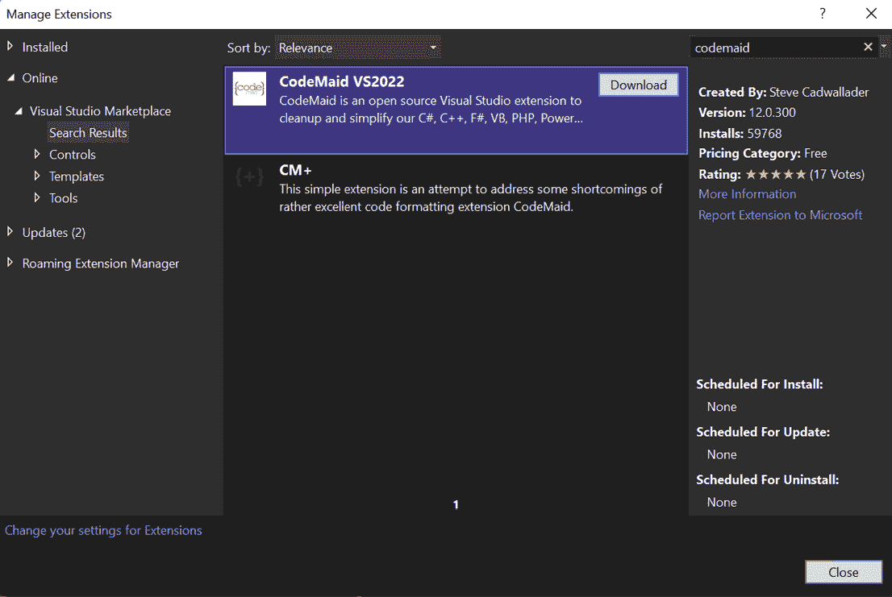

图 14.7 – 从管理扩展工具安装 CodeMaid

在搜索 `codemaid` 后，再次点击 `SPAProject`。您可以点击 **修改** 并等待安装完成：

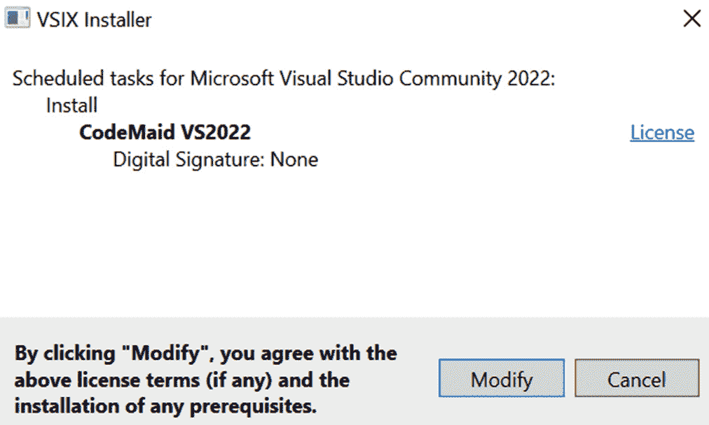

图 14.8 – Visual Studio 2022 中的 CodeMaid 扩展安装程序

现在，您将在**扩展**菜单中看到一个新选项，其中包含与 CodeMaid 相关的所有功能性和配置（见*图 14.9*）：

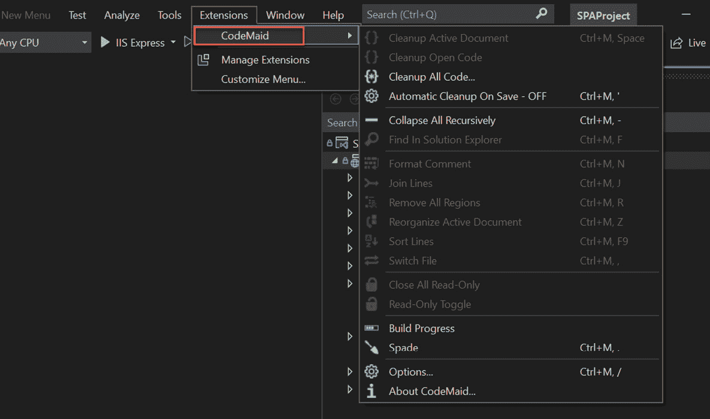

图 14.9 – 扩展菜单中的新 CodeMaid 选项

## 使用 CodeMaid

在这种情况下，没有活动文档，因此许多选项被禁用，但我们可以使用**清理所有代码…**选项来对整个项目进行清理，使用 CodeMaid 中的默认设置。在开始过程之前，我们会收到一个确认消息。点击**是**以继续（见*图 14.10*）：

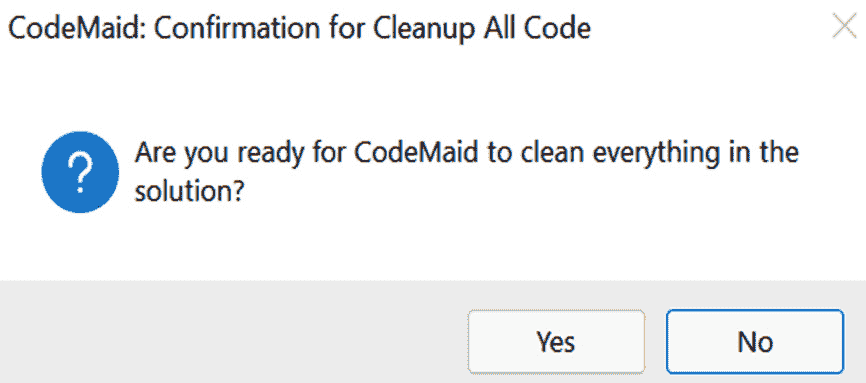

图 14.10 – 使用 CodeMaid 清理项目的确认

确认后，CodeMaid 将逐个分析每个文件，查找空白空间和空行，并对行进行排序等。您将看到一个进度条和当前正在处理的文件（见*图 14.11*）：

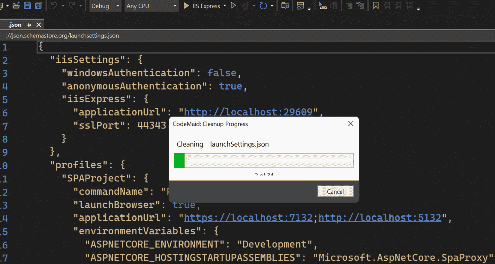

图 14.11 – 使用 CodeMaid 进行清理过程

在清理完成后，所有文件都将被保存。我们可以打开一个文件来查看更改，但使用 Visual Studio 中的 Git 集成，我们可以轻松地看到差异。这仅适用于您已经将项目连接到 Git 仓库的情况。您可以去查看 `Program.cs` 文件中的更改。更改的示例显示在*图 14.12*中：

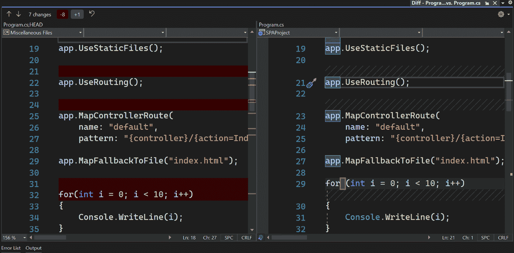

图 14.12 – 使用 CodeMaid 进行清理过程

在 `Program.cs` 中，我们可以看到 CodeMaid 移除的 `if` 语句中的一些带有空格的行。

重要提示

减少代码中的行数意味着减少文件的大小。空白行和空白空间会使代码难以阅读，并在发布时增加项目大小。

CodeMaid 有一些我们可以根据需要打开或关闭的选项。导航到**扩展** | **CodeMaid** | **选项**并选择**移除**部分，以选择 CodeMaid 可以移除代码的场景（见*图 14.13*）：

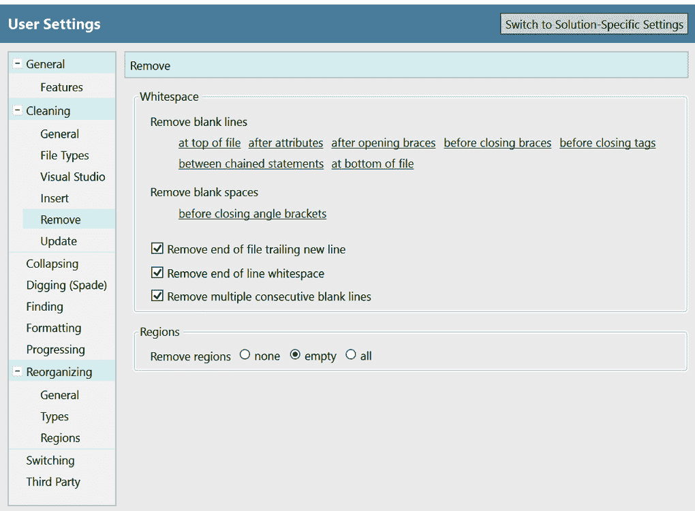

图 14.13 – CodeMaid 的用户设置

CodeMaid 还有许多与删除空白行和空白空间相关的选项。默认情况下，所有选项都启用，但您可以选择禁用某些选项，以根据项目指南设置 CodeMaid。

您可以在官方网站上了解更多关于 CodeMaid 的信息：[`www.codemaid.net/`](https://www.codemaid.net/).

现在您已经了解了 CodeMaid 的工作原理，并可以使用它来清理您的项目，让我们回顾下一个扩展，用于在 Visual Studio 中编译网络文件。

# 使用 Web 编译器编译网络库

如果你在一个项目中使用 TypeScript、LESS 或 Sass，你需要预编译代码以获取你 Web 项目的生产版本，这样浏览器就可以读取每一行代码。请注意，浏览器只能读取 CSS、HTML 和 JavaScript。在 Visual Studio 中使用 Web 编译器，你可以轻松完成此操作并直接查看预编译的代码。

既然我们已经知道了 Web 编译器是什么，那么让我们来安装它，并学习如何利用这个工具。

## 安装 Web 编译器

要安装 Web 编译器，请在搜索栏中转到 `web compiler`（见 *图 14.14*）：

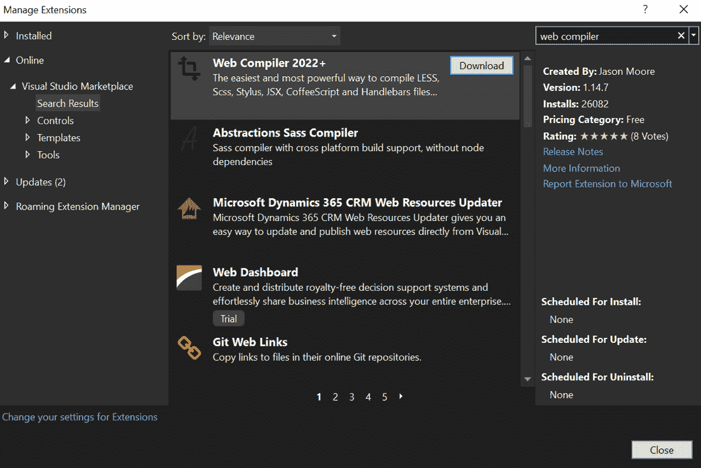

图 14.14 – 在管理扩展中搜索 Web 编译器

现在，我们可以遵循与 *添加 HTML 片段包* 部分中相同的步骤来完成安装。关闭并重新打开 Visual Studio 后，您将看到新扩展的安装已完成。现在，我们将在我们的 `SPAProject` 中使用它。

## 使用 Web 编译器

要使用 Web 编译器，我们可以导航并选择项目中的任何 JavaScript 文件，右键单击后将在菜单中看到一个新选项。例如，让我们选择 `aspnetcore-react.js`（见 *图 14.15*）：

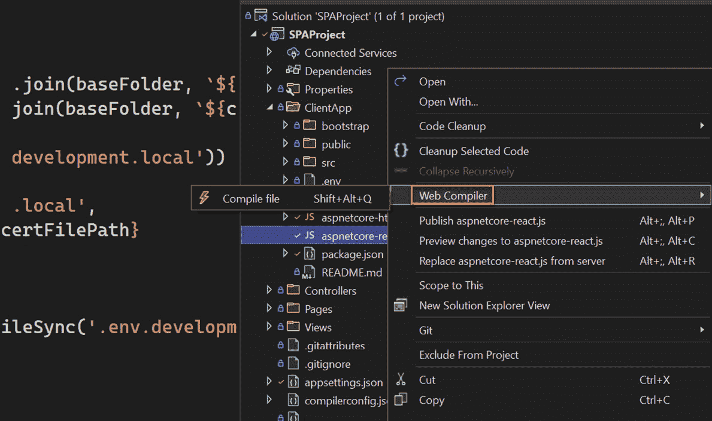


图 14.15 – 在项目中编译文件的 Web 编译器选项

使用 **Web 编译器** | **编译文件** 选项，我们可以编译文件并使用 **ECMAScript 2009** (**ES5**) 生成一个新的版本，这是一个允许我们支持旧版浏览器的 JavaScript 规范。请参见 *图 14.16* 中生成的文件：

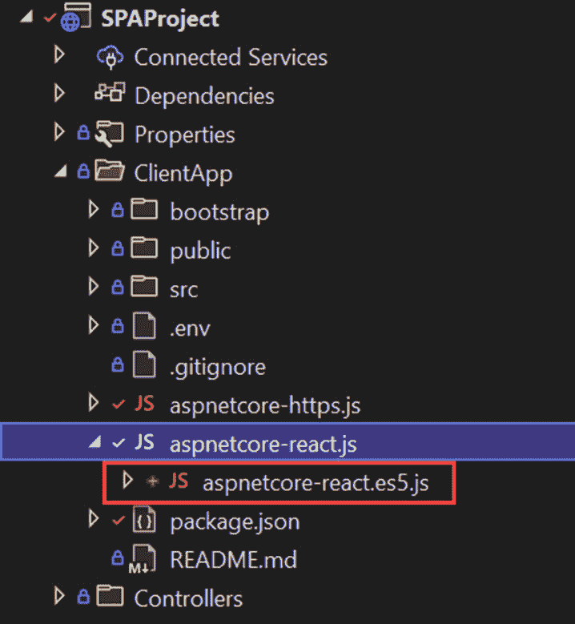


图 14.16 – 由 Web 编译器生成的 aspnetcore-react.es5.js

`aspnetcore-react.es5.js` 文件包含与 `aspnetcore-react.js` 相同的逻辑，但使用不同的语法。

以下代码表示 `aspnetcore-react.js` 文件的前 20 行：

```cs
// This script configures the .env.development.local file with additional environment variables to configure HTTPS using the ASP.NET Core
```

```cs
// development certificate in the webpack development proxy.
```

```cs
const fs = require('fs');
```

```cs
const path = require('path');
```

```cs
const baseFolder =
```

```cs
    process.env.APPDATA !== undefined && process.env.APPDATA !== ''
```

```cs
        ? `${process.env.APPDATA}/ASP.NET/https`
```

```cs
        : `${process.env.HOME}/.aspnet/https`;
```

```cs
const certificateArg = process.argv.map(arg => arg.match(/--name=(?<value>.+)/i)).filter(Boolean)[0];
```

```cs
const certificateName = certificateArg ? certificateArg.groups.value : process.env.npm_package_name;
```

```cs
if (!certificateName) {
```

```cs
    console.error('Invalid certificate name. Run this script in the context of an npm/yarn script or pass --name=<<app>> explicitly.')
```

```cs
    process.exit(-1);
```

```cs
}
```

```cs
const certFilePath = path.join(baseFolder, `${certificateName}.pem`);
```

`aspnetcore-react.js` 文件包含一些与后端 `asp.net` 应用程序和 React 应用程序之间交互相关的逻辑。此文件使用 JavaScript 的最新功能，因此 Web 编译器需要将代码编译到旧版本以支持旧浏览器并提高与其他库的兼容性。

以下代码表示 `aspnetcore-react.es5.js` 文件的前 20 行：

```cs
// This script configures the .env.development.local file with additional environment variables to configure HTTPS using the ASP.NET Core
```

```cs
// development certificate in the webpack development proxy.
```

```cs
'use strict';
```

```cs
var fs = require('fs');
```

```cs
var path = require('path');
```

```cs
var baseFolder = process.env.APPDATA !== undefined && process.env.APPDATA !== '' ? process.env.APPDATA + '/ASP.NET/https' : process.env.HOME + '/.aspnet/https';
```

```cs
var certificateArg = process.argv.map(function (arg) {
```

```cs
    return arg.match(/--name=(?<value>.+)/i);
```

```cs
}).filter(Boolean)[0];
```

```cs
var certificateName = certificateArg ? certificateArg.groups.value : process.env.npm_package_name;
```

```cs
if (!certificateName) {
```

```cs
    console.error('Invalid certificate name. Run this script in the context of an npm/yarn script or pass --name=<<app>> explicitly.');
```

```cs
    process.exit(-1);
```

```cs
}
```

添加到 Web 编译器中的每个文件都将包含在一个名为 `compilerconfig.json` 的文件中。此文件与 Visual Studio 的编译过程相关联。这意味着我们可以正常构建和发布项目，相关文件将自动生成。

这是使用 `aspnetcore-react.js` 文件后 `compilerconfig.json` 文件的示例：

```cs
[
```

```cs
  {
```

```cs
    "outputFile": "ClientApp/aspnetcore-https.es5.js",
```

```cs
    "inputFile": "ClientApp/aspnetcore-https.js"
```

```cs
  },
```

```cs
  {
```

```cs
    "outputFile": "ClientApp/aspnetcore-react.es5.js",
```

```cs
    "inputFile": "ClientApp/aspnetcore-react.js"
```

```cs
  }
```

```cs
] 
```

每个配置都是一个包含两个属性的 JSON 对象 – `inputFile` 是要编译的源文件的位置，而 `outputFile` 是 Web Compiler 生成的文件的位置。

重要提示

您可以使用 *Shift* + *Alt* + *Y* 编译 `compilerconfig.json` 中包含的所有文件。

更多信息，您可以在 GitHub 上的文档中阅读：[`github.com/failwyn/WebCompiler`](https://github.com/failwyn/WebCompiler)。

现在您已经了解了如何使用 Web Compiler 以及如何将 JavaScript 文件转换为使用 ES5。让我们看看另一个扩展，它扩展了我们的编辑器的功能，并允许我们查看一些指南，轻松区分空白和空白空间。

# 使用缩进指南识别空白

在*第十三章*“Visual Studio 中的扩展”，我们回顾了一些 Visual Studio 中的扩展，包括颜色预览。使用这些扩展，我们学习了如何扩展 Visual Studio 中的文本编辑器以提升我们的体验并提供更多针对某些技术和场景的工具。缩进指南就是这类扩展的另一个例子，它扩展了 Visual Studio 中的文本编辑器。

缩进指南是一个简单但实用的扩展，帮助我们识别代码结构中的额外空白和缩进。

## 安装缩进指南

要安装缩进指南，请在搜索栏中的`缩进指南`处进行操作（见*图 14.17*）：

![图 14.17 – 管理扩展中的缩进指南

![img/Figure_14.17_B17873.jpg]

图 14.17 – 管理扩展中的缩进指南

点击`index.html`文件，查看在文本编辑器中显示的新的指南，这些指南展示了文本和文本编辑器中的元素之间的空白和制表符（见*图 14.18*）：

![图 14.18 – Visual Studio 文本编辑器中的指南

![img/Figure_14.18_B17873.jpg]

图 14.18 – Visual Studio 文本编辑器中的指南

此工具对于改善我们文件的格式非常出色，并且与 Visual Studio 支持的所有编程语言兼容。还有一些额外的选项我们可以调整以适应我们的偏好。导航到**工具** | **选项** | **缩进指南**。在那里，我们将找到许多选项来更改外观、行为和突出显示，并设置快速启动或默认配置。

# 摘要

Visual Studio 有一个市场，其中包含许多我们可以通过使用 Visual Studio **管理扩展**选项访问的扩展。在 Studio 市场中，我们可以找到许多与代码片段相关的扩展，并使用 HTML Snippet Pack 来提高我们在 HTML 文件中编码时的生产力。

你现在已经知道了如何使用 CodeMaid 来清理代码并提高项目中的代码质量。你可以轻松地删除空行和空白，并为项目中的所有文件创建自定义验证格式。你还学习了如何安装 Web Compiler 来编译和转换网页文件，例如 JavaScript 文件或库，如 LESS 和 Sass，将其转换为浏览器可以轻松读取的通用代码。最后，你探索了 Indent Guides 扩展，它显示了代码中的空白和空白字符，帮助我们识别如何改进文件的格式和结构。

在*第十五章*“学习键盘快捷键”中，你将回顾 Visual Studio 默认包含的最重要快捷键。有了这些知识，你将使用一些键盘键的组合在 Visual Studio 中执行常见操作。
