# 第五章。模型

数据是每个应用程序的核心。用户将数据输入到应用程序中，编辑输入的数据，并搜索数据。我们甚至可以说，我们构建的应用程序只是我们对应用程序数据进行操作的一个接口。因此，任何框架都绝对有必要提供一个机制来简化并更易于管理数据操作。ASP.NET MVC 中的模型用于表示业务领域数据。

在本章中，你将学习以下主题：

+   模型和它们的目的

+   在 ASP.NET MVC 应用程序的控制器和视图中创建一个简单的模型并使用它

+   创建特定于视图模型的模型

+   在模型和 `ViewModels` 的上下文中，ASP.NET MVC 应用程序中的数据流

+   Entity Framework 的目的及其特性和优势

+   使用 Entity Framework 添加、更新和删除数据

+   在 ASP.NET MVC 应用程序中使用 Entity Framework

# 模型

模型是简单的 **POCO** ( **Plain Old C# Objects** ) 类，代表你的业务领域数据。对于一个电子商务业务，模型类会是 `Product`、`Order` 和 `Inventory`。如果你正在为大学构建应用程序，模型类会是 `Student`、`Teacher` 和 `Subject`。模型代表应用程序中的业务领域数据，并且它们不了解应用程序中使用的底层数据库。实际上，你甚至不需要数据库就可以与模型一起工作。

它们可以表示存储在 XML 文件、CSV 文件或其他应用程序中的数据。话虽如此，这些模型可以用来与数据库交互（在大多数情况下），但它们对数据库没有依赖。

以下步骤描述了如何创建一个使用模型的 ASP.NET Core 应用程序：

1.  确保创建一个带有空模板的 ASP.NET 5 应用程序。安装 ASP.NET Core 的 `NuGet` 包，并按照前面章节中讨论的进行配置。

1.  创建一个 `Controllers` 文件夹，并创建一个具有单个 `Index` 动作方法的 `HomeController`。

1.  为 `Views` 模型创建以下文件夹/文件：

    +   `Views` : 此文件夹位于你的项目中。

    +   `Views_ViewStart.cshtml` : 此文件标识了 `Layout` 文件的名称。

    +   `Views\Shared` 文件夹：此文件夹包含你的应用程序的所有共享视图组件。

    +   `Shared_Layout.cshtml` : 此文件定义了你的 Web 应用程序结构应如何看起来。

    +   `Views\Home` 文件夹：此文件夹包含你的 `HomeController` 的所有视图。

    +   `Views\Home\Index.cshtml` : 这是与 `HomeController` 的 `Index` 动作方法相对应的视图。

现在，我们已经创建了一个包含控制器和视图的 ASP.NET Core 应用程序。

让我们在应用程序中创建一个 `Models` 文件夹；这个文件夹将包含所有你的模型文件。在实际应用中，这个文件夹和相应的模型文件将位于不同的项目中。为了简化，我们将 `Models` 文件夹及其文件保留在同一个项目中。

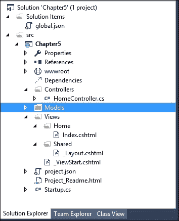

让我们在 `Models` 文件夹中创建一个简单的模型类 `Product` 模型：

```cs
public class Product { 
  public int ProductId { get; set; } 
  public string Name { get; set; } 
  public decimal Price { get; set; } 
} 

```

这个 `Product` 模型类与其他任何 C# 类没有区别，并包含一些关于产品的属性。

更新 `HomeController` 中的 `Index` 动作方法，使用 `Product` 模型，如下面的代码片段所示。我们正在构建模型数据并将模型数据传递给视图，以便将其显示给用户。然而，**不推荐**在控制器动作方法中构建模型数据，因为这违反了关注点分离原则。为了简化起见，我们在这里的动作方法中构建模型数据。

```cs
public IActionResult Index() { 
  /* Build the products model. It is NOT RECOMMENDED to build    models in Controller action methods  like this. In real world appication, these models and the    respective Data Access Layer(DAL) would  be in separate projects. We are creating it here to make things    simpler to explain */ 
  List<Product> Products = new List<Product> { 
    new Product { 
      Name = "Mobile Phone", 
      Price = 300 
    }, 
    new Product { 
      Name = "Laptop", 
      Price = 1000 
    }, 
    new Product { 
      Name = "Tablet", 
      Price = 600 
    } 
  }; 
  return View(Products); 
} 

```

更新相应的 `Index` 视图方法，使其使用模型数据循环遍历每个产品，并以无序列表项的形式显示。第一行的 `@model` 表示模型元数据；传递给视图的数据类型。在 `for…each` 循环中的模型表示实际数据本身，在我们的例子中是一个产品列表：

```cs
@model List<Chapter5.Models.Product> 

<ul> 
  @foreach (var Product in Model) { 
    <li>@Product.Name</li> 
  } 
</ul> 

```

当你运行应用程序时，你会得到以下输出：

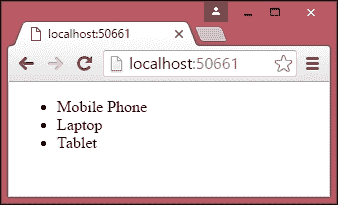

我们已成功创建了一个模型，并在我们的控制器和视图中使用了它。

让我们创建一个相对复杂的模型类，`Order`（位于 `Models` 文件夹中的 `Order.cs`），它包含产品列表及其总金额：

```cs
public class Order { 
  public int OrderId { get; set; } 
  public List<Product> Products { get; set; } 
  public decimal Total { get; set; } 
} 

```

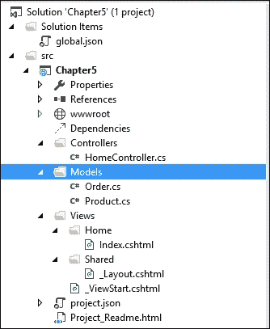

现在，我们必须更新 `Index` 动作方法以使用 `Order` 模型。一旦我们构建了产品列表，我们就将产品列表分配给 `Order` 属性并计算订单的总成本。这些计算通常作为业务层的一部分来完成。同样，为了简化，我们在这里的动作中构建数据模型和计算；在现实世界中，这种情况不应发生。

突出的粗体代码是我们对操作方法所做的更改：

```cs
public IActionResult Index() { 
  /* Build the products model. It is NOT RECOMMENDED to build    models in Controller action methods  like this. In real world appication, these models and the    respective Data Access Layer(DAL) would  be in separate projects. We are creating it here to make things    simpler to explain   */ 
  List<Product> Products = new List<Product> { 
    new Product { 
      Name = "Mobile Phone", 
      Price = 300 
    }, 
    new Product { 
      Name = "Laptop", 
      Price = 1000 
    }, 
    new Product { 
      Name = "Tablet", 
      Price = 600 
    } 
  }; 

 Order order = new Order(); 
  order.Products = Products; 
  order.Total = Products.Sum(product => product.Price); 

  return View(order);

} 

```

视图已更新以适应模型的变化。模型元数据（`@model`）已更改，以指示将订单信息传递给视图，而不是产品列表。

然后，我们以表格格式显示产品列表。请注意，所有模型数据（在这种情况下为 `Order` 对象及其属性）都可以通过模型访问。例如，可以通过 `Model.Products` 访问 `Products` 类，并通过 `Model.Total` 获取 `Total` 的值：

```cs
@model Chapter5.Models.Order 

<table border="1"> 

  <tr> 
    <th>Product Name</th> 
    <th>Price</th> 
  </tr> 

  @foreach (var Product in Model.Products){ 
    <tr> 
      <td>@Product.Name</td> 
      <td>@Product.Price</td> 
    </tr> 
  } 
  <tr> 
    <td><b>Total</b></td> 
    <td><b>@Model.Total</b></td> 
  </tr> 
</table> 

```

当你运行应用程序时，你会看到以下输出：


## 视图组件特定的模型

有一些场景，您可能只想更新大型模型中的几个属性，或者您可能想基于几个模型创建一个新的模型。在这种情况下，创建一个针对视图的新模型会更好。

例如，让我们假设我们正在构建一个屏幕，您可以在其中更新产品的价格。这个简单的屏幕可能只包含三个属性——产品 ID、产品名称和产品价格。但是，产品的模型可能包含超过 30 个属性来存储产品的所有详细信息，如制造商、颜色、尺寸和其他属性。我们不必发送包含所有属性的完整模型，而是可以创建一个针对此视图的新模型，只包含几个属性——ID、名称和价格。

## 关于 ViewModel 的说明

ViewModels 是实体，当您更新模型时，您的视图会自动更新，反之亦然。在许多在线文章甚至一些书中，当它们实际上试图指代“针对视图的模型”时，它们在提到*ViewModels*。

在 ViewModel 中，绑定是双向的——当您更新模型或视图时，另一个会自动更新。让我们考虑一个简单的例子；您有一个带有左侧各种字段和右侧打印预览的表单。在这种情况下，您在表单中实时输入的内容将立即反映在右侧。在这种情况下，当您输入时，您可以使用纯 ViewModel，您的 ViewModel 会更新，并且该`ViewModel`会在右侧的打印预览中被消费。这些纯 ViewModel 正在被用于像**Knockout**或**AngularJS**这样的高级 JavaScript 框架中。

在*针对视图的模型*中，我们只从模型到视图进行单向绑定。在这里，我们发送一个针对视图的特定模型，而不是通用的模型（它代表一个业务域类）。

然而，在这本书中，我们将为了简洁起见将*针对视图的模型*称为`ViewModel`。除非另有说明，您应该将所有 ViewModel 视为*针对视图的模型*。因此，我在这里犯了其他作者犯过的同样的错误 。

## 与模型相关的数据流

下面的块图显示了 ASP.NET MVC 应用程序中的数据流：

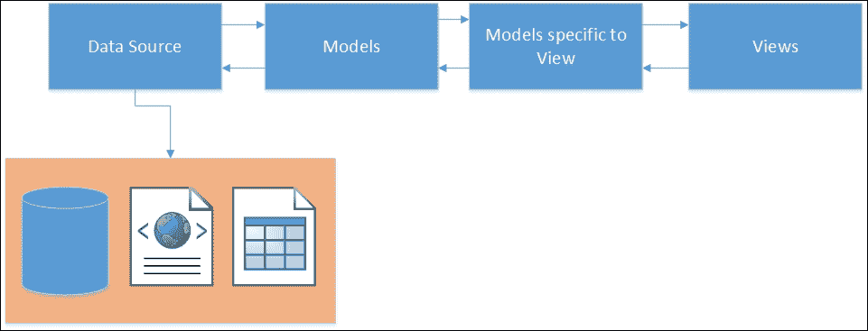

**数据源**代表您的应用程序数据。应用程序数据可以存储在任何地方——从完整的 RDBMS（如 SQL 服务器）到简单的 Excel 电子表格，或者两者之间的任何地方。

**模型**代表您应用程序的业务域数据，并且与所使用的数据源无关。相同的模型可以与不同的数据源一起使用。

我们可以在我们的视图中**直接使用模型**来获取数据或展示数据。但在某些视图中，你可能不需要模型的所有属性。因此，我们不是将整个模型发送到视图，而是创建特定于视图的模型并使用它们在我们的视图中。这使得事情变得更简单。

当你在 ASP.NET Core 中使用模型存储或检索记录时，以下是一个高级事件序列：

1.  用户在应用程序中通过表单（使用视图创建）输入数据。表单中的字段不需要代表完整的模型，因为我们只需要模型中的几个属性。

1.  输入的数据被传递到控制器，在那里发生模型绑定。模型绑定是将视图中的输入数据映射到模型或 ViewModel 的过程。

1.  如果数据是在 ViewModel 中接收的，那么我们将把 ViewModel 转换为 Model。

1.  最后，模型数据存储在数据源中。

到目前为止，我们一直在我们的应用程序中处理内存中的数据。在几乎所有的实际应用中，都会使用某种形式的数据库来存储、访问和检索数据。在下一节中，我们将讨论 Entity Framework（对象关系映射框架），它使得从 .NET 应用程序中进行数据访问变得更加简单。

# 模型绑定

**模型绑定**是将来自视图的模型数据映射到控制器动作方法的 ViewModel 参数的过程。

让我们考虑一个简单的表单，其中包含几个表单字段——`Name` 和 `EmailID`。在表单提交时，这些值将被映射到控制器动作方法的 `ViewModel` 对象。模型绑定负责这个映射。模型绑定器会在表单字段、查询字符串和请求参数中寻找匹配项。

在前面的例子中，任何具有这些属性的类都会被 ModelBinder 无任何问题地选中。

由于以下 `Person` 类包含 `Name` 和 `EmailID` 属性，模型绑定器不会对使用此模型来映射表单中输入的值提出任何异议：

```cs
public class Person { 
  public string Name { get; set; } 
  public string EmailID { get; set; } 
} 

```

以下代码片段展示了如何在动作方法中使用 `Person` 类：

```cs
public ActionResult Add(Person p) { 
  return View(); 
} 

```

# Entity Framework

Entity Framework 是 **对象关系映射 (ORM)** 框架，它使开发者能够直接在域特定对象上工作以进行数据访问，而不是在数据库查询上工作。这大大减少了应用程序数据访问层中的代码复杂性。

在讨论 Entity Framework 和其功能之前，让我们暂停一下，思考一下当我们尝试使用 ADO.NET 将一些信息保存到数据库时我们遵循的步骤：

1.  构造业务域对象。

1.  创建到你的数据库的连接。

1.  打开连接。

1.  创建一个命令对象以及命令类型。

1.  将你的业务域对象的属性添加到命令对象的参数中。

1.  执行将数据保存到数据库中的命令。

我们必须遵循之前提到的六个步骤来进行常见操作，例如将数据保存到数据库中。

如果你使用 ORM 框架，例如 Entity Framework，你只需要三个步骤：

1.  构建业务域对象。

1.  为你的业务域对象创建`DbContext`类。`DbContext`类的实例代表了与数据库的会话。

1.  使用`DBContext`类的实例将数据保存到数据库中。

你可能会想知道这是如何实现的。

实际上，在后台，Entity Framework 会创建与数据库的连接并执行查询，将业务域对象保存到数据库中。为了简化，Entity Framework 为你编写所有数据访问代码，这样你就可以专注于实现应用程序的业务功能，而不是编写数据库层代码。

## Entity Framework 独立于 ASP.NET MVC

如前所述，Entity Framework 是一个用于访问数据的 ORM 框架，并且与 ASP.NET MVC 独立。Entity Framework 可以用于**Windows Communication Foundation** ( **WCF** )服务、Web API 服务和甚至控制台应用程序。你可以在任何类型的应用程序中使用 Entity Framework，并利用它使用对象来访问数据。无论你使用哪种类型的应用程序，Entity Framework 的概念和功能都保持不变。

现在，我们将使用控制台应用程序与 Entity Framework 结合使用。这使我们能够专注于手头的任务，并展示 Entity Framework 的功能，而不是编写 ASP.NET Core 应用程序的样板代码。在本章的后续部分，我们将集成 Entity Framework 与 ASP.NET Core 应用程序。

SQL Server 的 Entity Framework 最新版本是 7.0.0，在撰写本书时仍处于测试版。与之前的版本（Entity Framework 6）相比，EF7（Entity Framework 7）带来了重大变化。然而，EF7 是构建 ASP.NET 5 应用程序时的推荐版本，因此我们将在这本书中使用这个版本。

### 注意

我们需要一个数据库来解释 Entity Framework 的许多功能。请在继续之前在你的 PC 上安装 SQL Server 2014 Express。安装 SQL Server 2014 Express 和 SQL Server Management Studio 的逐步说明在*附录 A*中给出。

## 使用 Entity Framework 创建控制台应用程序

按照以下步骤创建一个简单的控制台应用程序：

1.  选择**文件** | **新建项目**，然后选择**控制台应用程序**。

1.  为项目命名并点击**确定**。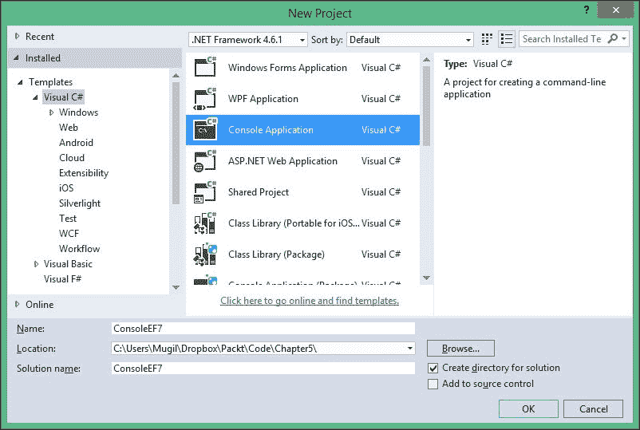

## 安装 Entity Framework 7 NuGet 包

在你的应用程序中安装任何`NuGet`包有两种方式：

+   使用`NuGet`包管理器

+   使用包管理器控制台

### 使用 NuGet 包管理器

喜欢图形界面的用户可以使用此选项：

1.  右键单击控制台项目，从上下文菜单中选择 **管理 NuGet 包**：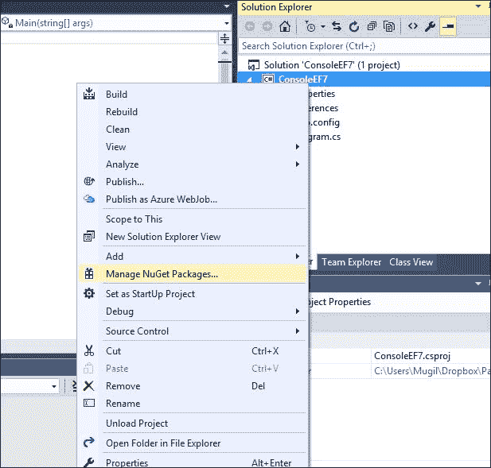

1.  在 `NuGet` 包中搜索 `EntityFramework.MicrosoftSqlServer` 并确保已勾选 **包含预发布版** 复选框。选择 **EntityFramework.MicrosoftSqlServer** 并点击 **安装**，然后选择 **最新预发布版 7.0.0-rc1-final**（本书编写时）。您可以选择 Entity Framework 7 的任何最新版本：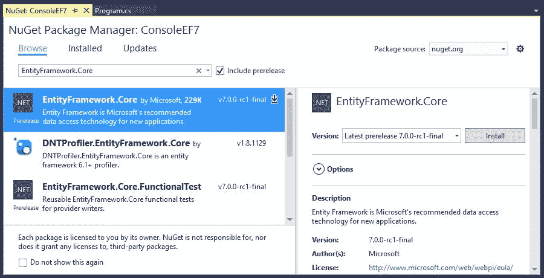

1.  点击 **安装** 后，`NuGet` 包管理器将要求您审查更改。点击 **确定**：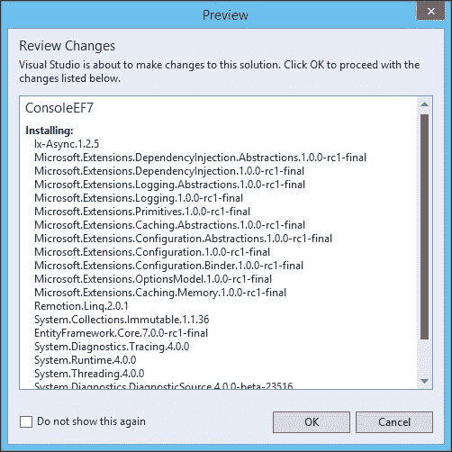

1.  在 **许可接受** 窗口中点击 **我接受**：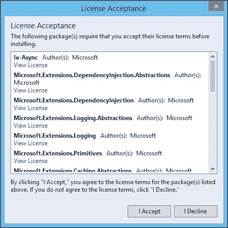

1.  点击 **我接受** 后，它将安装包含所有依赖项的 Entity Framework。在 **输出** 窗口中，安装完成后将显示 **完成** 消息：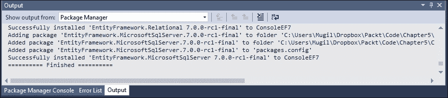

### 使用包管理器控制台

要使用包管理器控制台安装 `NuGet` 包，请按照以下步骤操作：

1.  通过选择菜单选项 **查看** | **其他窗口** | **包管理器控制台** 打开 **包管理器控制台** 窗口。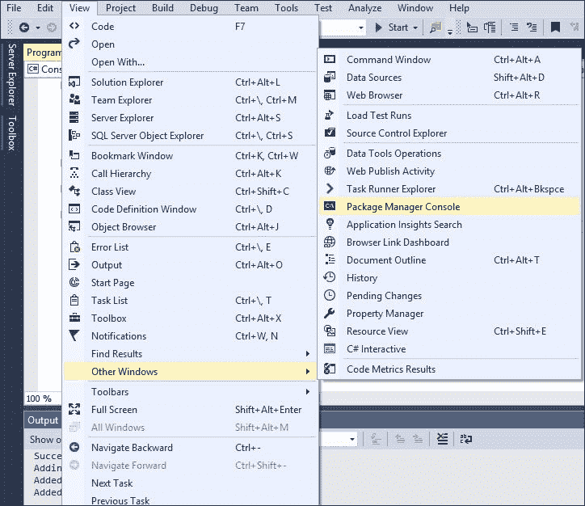

1.  在 **包管理器控制台** 窗口中输入 `Install-Package EntityFramework.MicrosoftSqlServer - Pre`，如图所示：

1.  安装完成后，将显示一条消息，**成功安装 'EntityFramework.MicrosoftSqlServer 7.0.0-rc1-final'**：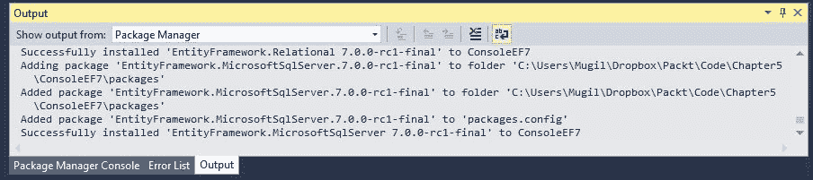

## 安装 Entity Framework 命令

我们需要安装 Entity Framework 命令包以便执行迁移活动。迁移包括创建数据库及其相关表。任何架构更改也将由迁移处理：

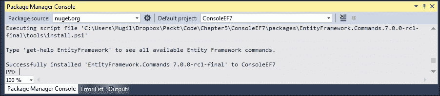

如前所述，当我们使用 Entity Framework 与数据库交互时，需要遵循三个步骤：

1.  创建 `Model` 类。

1.  为您的业务域对象创建 `DbContext` 类。`DbContext` 类的实例代表与数据库的会话。

1.  使用 `DBContext` 类的实例构建业务域对象并将其保存到数据库。

让我们详细讨论前面的每个步骤，并尝试将对象保存到数据库。

### 创建 Model 类

`Model` 类是简单的 POCO 对象，可以与 Entity Framework 一起使用。

让我们为我们的业务域对象创建一个 POCO 类，在我们的例子中是 `Employee` 类。我在控制台应用程序中创建了一个名为 `Employee.cs` 的新文件，其内容如下。这个 `Employee` 类包含了一些员工属性，并且没有特殊属性或字段使其与 Entity Framework 一起工作。

让我们看一下以下代码片段：

```cs
public class Employee { 
  public int EmployeeId { get; set; } 
  public string Name { get; set; } 
  public decimal Salary { get; set; } 
  public string Designation { get; set; } 
} 

```

按照惯例，如果属性名为 `Id` 或 `ClassName+Id`，Entity Framework 在创建数据库表时会将其视为主键。

字符串数据类型的属性将被创建为 `nvarchar(max)` 类型的字段。然而，我们可以通过使用注解来覆盖这种行为，我们将在稍后讨论。

### 创建 DbContext 类

`DbContext` 类的实例代表数据库会话，并且这个 `DbContext` 类为您的应用程序的数据访问做了大部分繁重的工作。

通过命名 `EmployeeDbContext` 创建一个新的类，其内容如下：

```cs
using Microsoft.Data.Entity; 
using System.Configuration; 

namespace ConsoleEF7 { 
  public class EmployeeDbContext : DbContext{ 
    public DbSet<Employee> Employees {get; set;} 

    protected override void OnConfiguring(DbContextOptionsBuilder      optionsBuilder) {string connectionString =        ConfigurationManager.ConnectionStrings       ["SqlServerExpress"].ConnectionString; 
      optionsBuilder.UseSqlServer(connectionString); 
      base.OnConfiguring(optionsBuilder); 
    } 
  } 
} 

```

使用 `App.Config` 配置它：

```cs
<?xml version="1.0" encoding="utf-8" ?> 
<configuration> 
  <startup> 
    <supportedRuntime version="v4.0"  
    sku=".NETFramework,Version=v4.6.1" /> 
  </startup> 
  <connectionStrings> 
    <add name="SqlServerExpress" connectionString="Data Source=     MUGIL-PC\SQLEXPRESS;Initial Catalog=EF7Console;Integrated      Security=True"/> 
  </connectionStrings> 
</configuration> 

```

在前面的代码片段中有几点需要注意：

+   包含 `Microsoft.Data.Entity` 命名空间，因为该命名空间中提供了 `DbContext` 类。我们的连接字符串在 `App.Config` 文件中可用。为了读取 `App.Config` 文件的内容，我们在 `System.Configuration` 中包含了 `ConfigurationManager` 类。

+   为了使用 `DbContext` API，必须创建一个继承自 `DbContext` 类的类，这样我们才能访问 `DbContext` API 的方法。我们已经创建了继承自 `DbContext` 类的 `EmployeeDbContext` 类。

+   `DbSet` 是一个类，它允许对给定实体类型执行 Entity Framework 操作。我们需要为我们在应用程序中使用的每个实体类型创建 `DbSet` 对象。在这个例子中，我们只使用一个 `DbSet` 对象，因为我们正在处理 `Employee` 类。

## 创建迁移

**迁移**是记录数据库所有更改的过程。`Add-Migration` 是 Entity Framework 添加迁移的命令：

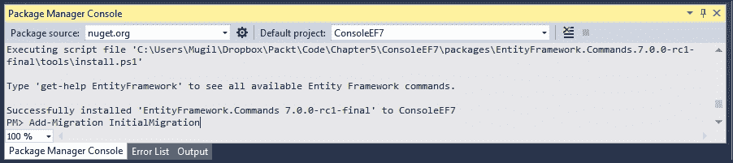

1.  一旦添加了迁移，您可以通过执行 `Remove-Migration` Entity Framework 命令撤销更改。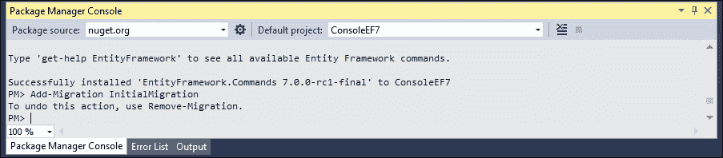

    +   这是迁移目录的外观：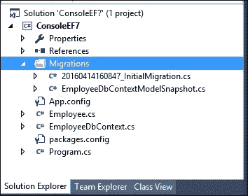

1.  通过执行 Entity Framework 命令 `Update-Database` 更新数据库，该命令根据迁移中可用的信息更新数据库表。由于我们之前已安装了 `EntityFramework.Commands` 包，因此这些命令将可用于应用程序：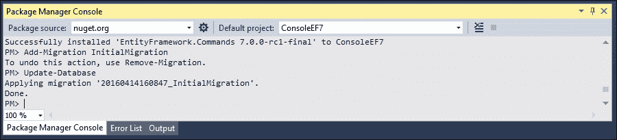

1.  更新数据库后，您可以通过连接到 SQL Server Management Studio 来查看数据库中的更改：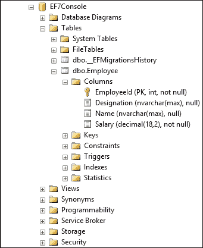

1.  执行数据库操作以将业务领域对象保存到数据库中。你可以手动创建数据库，或者如果数据库不可用，它将为你创建一个。

`Main`方法被以下代码更新：

```cs
class Program { 
  static void Main(string[] args) { 
    AddEmployee(); 
  } 

  static void AddEmployee() { 
    using (var db = new EmployeeDbContext()) { 
      Employee employee= new Employee { 
        Designation = "Software Engineer", 
        Name = "Scott", 
        Salary = 5600 
      }; 

      db.Employees.Add(employee); 
      int recordsInserted = db.SaveChanges(); 
      Console.WriteLine("Number of records inserted:" +        recordsInserted); 
      Console.ReadLine();
    } 
  } 
} 

```

首先，我们正在构建业务领域对象。然后，我们将构建的`Employee`对象添加到`DbContext`类的`Employee`的`DbSet`中。最后，我们调用`DbContext` API 的`SaveChanges`方法，该方法将所有挂起的更改保存到数据库中。

你可能想知道我们没有提供连接字符串时，它是如何将其保存到数据库中的。

让我们讨论一下当我们运行程序时幕后发生了什么：

+   当你对`DbSet`集合中的任何内容进行更改时，Entity Framework 会检查数据库是否存在。如果不存在，它将使用模式`<DbContextName 的命名空间>`创建一个新的数据库。在我们的例子中，一个名为`EF6.EmployeeDbContext`的数据库将被创建。

+   然后，它为在`DbSet`中声明的实体创建数据库表。按照惯例，Entity Framework 使用实体的复数形式作为表名。由于我们为`Employee`实体声明了`DbSet`，Entity Framework 创建`Employee`的复数形式，并创建名为`Employees`的表。

数据库和表的创建发生在以下代码执行时：

```cs
db.Employees.Add(employee); 

```

当`SaveChanges`方法执行时，`Employee`对象中的数据将被保存到数据库中，并返回受影响的记录数。在前面的例子中，它返回`1`。

当你再次运行应用程序时，前面提到的前两个步骤将被跳过，因为数据库和表已经创建。

当你查询数据库时，你可以看到新插入的记录：

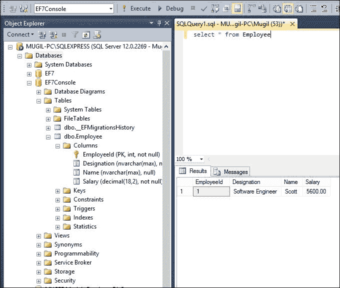

## `SaveChanges`方法的工作原理

当我们进行更改时，Entity Framework 跟踪每个对象的每个状态，并在调用`SaveChanges`方法时执行适当的查询。

例如，当我们向员工集合（`DbSet`）添加一个`Employee`对象时，该对象在`Added`状态下被`Entity Framework`跟踪。当调用`SaveChanges`时，Entity Framework 为该对象创建一个`insert`查询并执行它。更新和删除对象的情况也是一样。Entity Framework 将相应对象的`Entity`状态设置为`Modified`和`Deleted`。当调用`SaveChanges`时，它创建并执行`Update`和`Delete`查询。


前面的图示解释了对于不同类型的更改，`SaveChanges` 方法是如何在高级别上工作的。我们有两个 POCO 对象（**对象 1** 和 **对象 2**），它们已经被添加到员工的 `DbSet` 对象中。让我们假设 **对象 3** 和 **对象 4** 已经被修改，而对象 **对象 5** 和 **对象 6** 处于 `Deleted` 状态。当你调用 `SaveChanges` 方法时，它会创建三组查询。第一组查询用于添加对象，这将导致对数据库执行 `insert` 查询。在第二组查询中，为状态已修改的对象创建并执行 `Update` 查询。最后，为所有处于 `Deleted` 状态的对象执行 `Delete` 查询。

## 更新记录

让我们尝试使用 Entity Framework 更新已插入的员工记录的薪水：

```cs
static void UpdateSalary() { 
  using (var db = new EmployeeDbContext()){ 
    Employee employee = db.Employees.Where(emp => emp.EmployeeId      == 1).FirstOrDefault(); 
    if(employee!=null){
      employee.Salary = 6500; 
      int recordsUpdated = db.SaveChanges(); 
      Console.WriteLine("Records updated:" + recordsUpdated); 
      Console.ReadLine(); 
    }
  } 
} 

```

在前面的方法中，我们找到 `EmployeeId = 1` 的员工。然后，我们将员工的薪水更新为 `6500` 并将 `employee` 对象保存到数据库中。请注意，在前面所述的方法中，我们与数据库交互了两次——一次是为了找到正确的员工记录（`read` 操作），另一次是为了更新记录（`update` 操作）。

```cs
static void Main(string[] args){
  UpdateSalary(); 
} 

```

`Main` 方法被更新为调用 `UpdateSalary` 方法。当你查询数据库时，你应该看到带有更新信息的记录：

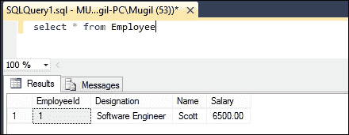

## 删除记录

删除记录稍微有些棘手，因为它涉及到直接设置状态。在以下方法中，首先我们获取对象并设置对象的状态为 `Deleted`。然后调用 `SaveChanges` 方法将为该对象生成 `delete` 查询并执行它，这将最终删除数据库中的记录：

```cs
static void DeleteEmployee() { 
  using (var db = new EmployeeDbContext()) { 
    Employee employeeToBeDeleted = db.Employees.Where(emp =>      emp.EmployeeId == 1).FirstOrDefault(); 
    if (employeeToBeDeleted != null) { 
      db.Entry(employeeToBeDeleted).State =        Microsoft.Data.Entity.EntityState.Deleted; 
      int recordsDeleted = db.SaveChanges(); 
      Console.WriteLine("Number of records deleted:" +        recordsDeleted); 
      Console.ReadLine(); 
    } 
  } 
} 

static void Main(string[] args) { 
  DeleteEmployee(); 
} 

```

# 在 ASP.NET MVC 应用程序中使用 Entity Framework

在控制台应用程序和 ASP.NET MVC 应用程序中使用 Entity Framework 之间没有太大的区别。现在，我们将构建一个简单的应用程序，它只有一个屏幕，如图所示。在这个屏幕上，我们将有一个表单，用户将输入有关员工的信息；一旦用户提交表单，信息将被保存到数据库中，并在以下屏幕截图中反映出来：

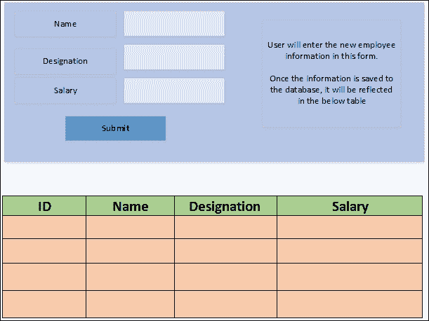

我们可以创建一个简单的员工模型。我们需要为这个视图构建一个 ViewModel，因为我们需要从用户那里获取员工信息，同时我们还需要在同一个屏幕上显示员工列表。

让我们创建一个 ASP.NET Core 应用程序，添加员工并显示员工列表。以下是为实现上述目标创建应用程序的逐步说明：

1.  通过在 Visual Studio 中选择一个空的 ASP.NET 5 应用程序来创建一个 ASP.NET Core 项目。

1.  安装 ASP.NET Core `NuGet` 包。

1.  按照本章前面所述，安装 Entity Framework 7 的 `NuGet` 包和 `**ef**` EntityFramework 命令（用于数据库迁移）。

1.  将 `config.json` 添加到声明数据库连接字符串：

    ```cs
    { 
      "Data": { 
        "DefaultConnection": { 
          "ConnectionString": "Data Source=MUGIL-PC\\SQLEXPRESS;Initial Catalog=Validation;Integrated Security=True" 
        } 
      } 
    } 

    ```

1.  更新 `project.json` 以包括 EntityFramework 7 和 EntityFramework 命令。变更以粗体标出：

    ```cs
    { 
      "version": "1.0.0-*", 
      "compilationOptions":{ 
        "emitEntryPoint": true 
      }, 

      "dependencies": { 
        "Microsoft.AspNet.IISPlatformHandler":      "1.0.0-rc1-final", 
        "Microsoft.AspNet.Mvc": "6.0.0-rc1-final", 
        "Microsoft.AspNet.Server.Kestrel": "1.0.0-rc1-final", 

    "EntityFramework.MicrosoftSqlServer":      "7.0.0-rc1-final", 
        "EntityFramework.Commands": "7.0.0-rc1-final"

      }, 

      "commands": { 
        "web": "Microsoft.AspNet.Server.Kestrel", 

    "ef": "EntityFramework.Commands"

      }, 

      "frameworks": { 
        "dnx451": { }, 
        "dnxcore50": { } 
      }, 

      "exclude": [ 
        "wwwroot", 
        "node_modules" 
      ], 
      "publishExclude": [ 
        "**.user", 
        "**.vspscc" 
      ] 
    } 

    ```

1.  在 `Startup` 类 (`Startup.cs`）中配置 MVC：

    +   在构造函数中，我们通过读取 `config.json` 文件构建配置。

    +   在 `ConfigureServices` 方法中将 MVC 服务和 Entity Framework 服务添加到服务中

    +   在 `Configure` 方法中配置 MVC 路由：

        ```cs
        using Microsoft.AspNet.Builder;
        using Microsoft.AspNet.Hosting;
        using Microsoft.AspNet.Http;
        using Microsoft.Extensions.DependencyInjection;
        using Microsoft.Extensions.Configuration;
        using Validation.Models;
        using Microsoft.Data.Entity;
        using Microsoft.Extensions.PlatformAbstractions;

        namespace Validation {
         public class Startup {
         public IConfigurationRoot Configuration { get; set; }

        public Startup(IHostingEnvironment env, IApplicationEnvironment appEnv) {
         var builder = new ConfigurationBuilder()
         .AddJsonFile("config.json")
         .AddEnvironmentVariables();
         Configuration = builder.Build();
         }

        // This method gets called by the runtime. Use this method to add services to the container. 
        // For more information on how to configure your application, visit http
        ://go.microsoft.com/fwlink/?LinkID=398940 

        public void ConfigureServices(IServiceCollection services) {
        services.AddEntityFramework()
         .AddSqlServer()
         .AddDbContext<EmployeeDbContext>(options => {
         options.UseSqlServer(Configuration.Get<string> ("Data:DefaultConnection:ConnectionString"));
         });
         services.AddMvc();
         }
        // This method gets called by the runtime. Use this method to configure the HTTP request pipeline.

        public void Configure(IApplicationBuilder app) {
         app.UseIISPlatformHandler();
         app.UseMvc(routes => {
         routes.MapRoute(
         name: "default",
         template: "{controller=Employee}/ {action=Index}/{id?}");
         });
         }
        // Entry point for the application.
         public static void Main(string[] args) => WebApplication.Run<Startup>(args);
         }
         }
        ```

1.  创建 `Models` 和 `DbContext` 类。

1.  创建 `Models` 文件夹并添加 `Employee` 模型类和 `EmployeeDbContext` 类。

1.  在 `Models` 文件夹中创建 `Employee` 模型类 (`Employee.cs`）：

    ```cs
    public class Employee { 
      public int EmployeeId { get; set; } 
      public string Name { get; set; } 
      public string Designation { get; set; } 
      public decimal Salary { get; set; } 
    } 

    ```

1.  在 `Models` 文件夹中创建 `EmployeeDbContext` (`EmployeeDbContext.cs`）：

    ```cs
    using Microsoft.Data.Entity; 
    using Microsoft.Extensions.Configuration; 

    namespace Validation.Models { 
      public class EmployeeDbContext : DbContext { 

        public IConfigurationRoot Configuration { get; set; } 

        public DbSet<Employee> Employees { get; set; } 

        public EmployeeDbContext() { 
          var builder = new ConfigurationBuilder() 
          .AddJsonFile("config.json") 
          .AddEnvironmentVariables(); 
          Configuration = builder.Build(); 
        } 

        protected override void OnConfiguring     (DbContextOptionsBuilder optionsBuilder) {      optionsBuilder.UseSqlServer       (Configuration.Get<string>       ("Data:DefaultConnection:ConnectionString")); 
          base.OnConfiguring(optionsBuilder); 
        } 
      } 
    } 

    ```

1.  创建 `ViewModels`：

    +   由于我们将在同一屏幕上显示员工列表和添加员工的表单，我们将构建一个针对此视图的特定模型。此模型将包含有关员工列表和要添加的员工的信息。

1.  创建 `ViewModels` 文件夹并添加 `EmployeeAddViewModel`：

    ```cs
    using MVCEF7.Models; 

    namespace MVCEF7.ViewModels { 
      public class EmployeeAddViewModel { 
        public List<Employee> EmployeesList { get; set; } 
        public Employee NewEmployee { get; set; } 
      } 
    } 

    ```

    +   这个 `ViewModel` 有几个属性。`EmployeesList` 和 `NewEmployee`。`EmployeesList` 将包含员工列表。这个列表将从数据库中获取。`NewEmployee` 将保存用户输入的员工信息。

1.  创建 `Controllers` 来处理传入的请求：

    +   创建一个 `Controllers` 文件夹并添加 `EmployeeController` 类，包含几个动作方法——一个用于 `GET`，另一个用于 `POST`。当您访问 URL (`http://localhost/Employee/Index`）或运行应用程序时，将调用与 `GET` 动作方法对应的 `Index` 动作方法。当您提交表单时，将调用 `POST Index` 动作方法：

        ```cs
        public IActionResult Index() { 
          EmployeeAddViewModel employeeAddViewModel = new    EmployeeAddViewModel(); 
          using (var db = new EmployeeDbContext()) { 
            employeeAddViewModel.EmployeesList =      db.Employees.ToList(); 
            employeeAddViewModel.NewEmployee = new Employee(); 

          } 
          return View(employeeAddViewModel); 
        } 

        ```

    +   在前面的 `GET Index` 动作方法中，我们创建 `ViewModel` 对象并将其传递到视图中。

    +   以下代码使用 `POST Index` 动作方法：

        ```cs
        [HttpPost] 
        public IActionResult Index(EmployeeAddViewModel  employeeAddViewModel) { 

          using (var db = new EmployeeDbContext()) { 
            db.Employees.Add(employeeAddViewModel.NewEmployee); 
            db.SaveChanges(); 
            //Redirect to get Index GET method 
            return RedirectToAction("Index"); 
          } 

        } 

        ```

    +   我们在 ViewModel 中获取 `NewEmployee` 属性，它包含用户信息。将其保存到数据库中。一旦我们将员工信息保存到数据库中并将控制权重定向到 `GET Index` 动作方法，`GET Index` 动作方法将再次显示输入员工信息的表单和员工列表。

1.  添加 `Views` 文件夹：

    1.  创建 `Views_ViewStart.cshtml` 并包含以下内容：

        ```cs
        @{ 
          Layout = "_Layout"; 
        } 

        ```

    1.  创建 `Views\Shared_Layout.cshtml` 并包含以下内容：

        ```cs
        <!DOCTYPE html> 

        <html> 
          <head> 
            <meta name="viewport" content="width=device-width" /> 
            <title>@ViewBag.Title</title> 
          </head> 
          <body> 
            <div> 
              @RenderBody() 
            </div> 
          </body> 
        </html> 

        ```

    1.  创建 `Views\Employee\Index.cshtml` 并包含以下内容：

        ```cs
        @model MVCEF.ViewModels.EmployeeAddViewModel 
        @* 
        //For more information on enabling MVC for empty projects,  visit http://go.microsoft.com/fwlink/?LinkID=397860 
        *@ 
        @{ 
        } 

        <div> 
          @using (Html.BeginForm("Index", "Employee",    FormMethod.Post)) { 
            <table> 
              <tr> 
                <td>@Html.LabelFor(Model =>          Model.NewEmployee.Name)</td> 
                <td>@Html.TextBoxFor(Model =>          Model.NewEmployee.Name)</td> 
              </tr> 
              <tr> 
                <td>@Html.LabelFor(Model =>          Model.NewEmployee.Designation)</td> 
                <td>@Html.TextBoxFor(Model =>          Model.NewEmployee.Designation)</td> 
              </tr> 
              <tr> 
                <td>@Html.LabelFor(Model =>          Model.NewEmployee.Salary)</td> 
                <td>@Html.TextBoxFor(Model =>          Model.NewEmployee.Salary)</td> 
              </tr> 
              <tr> 
                <td colspan="2"><input type="submit"          value="Submit"/> 
                </td> 
              </tr> 
            </table> 

          } 
        </div> 

        <br/><br/> <br/> 

        <b> List of employees:</b> <br/> 
        <div> 
          <table border="1"> 
            <tr> 
              <th> ID </th> 
              <th> Name </th> 
              <th> Designation </th> 
              <th> Salary </th> 
            </tr> 
            @foreach(var employee in Model.EmployeesList) { 
              <tr> 
                <td>@employee.EmployeeId</td> 
                <td>@employee.Name</td> 
                <td>@employee.Designation</td> 
                <td>@employee.Salary</td> 
              </tr> 
            } 
          </table> 
        </div> 

        ```

在前面的 `Index` 视图中，我们创建了一个表单，从用户在顶部 `div` 中获取员工信息。在下一个 `div` 中，我们以表格格式显示员工列表。

一旦我们创建了所有文件夹和文件，项目结构应该看起来如下所示：


# 数据库迁移

我们已创建业务实体——`Employee`类。现在，我们可以进行迁移。迁移是一个两步过程：在第一步中，我们创建迁移文件。这可以通过从项目上下文在命令提示符中执行以下命令来完成：

```cs

dnx ef migrations add InitialMigration

```

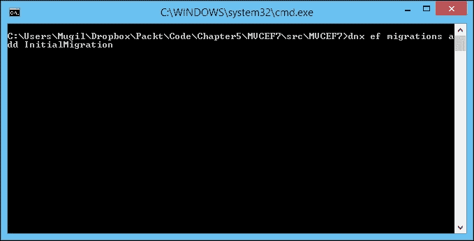

此命令将在您的项目中创建迁移文件，如下截图所示：

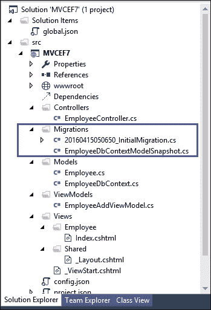

然后执行以下命令以创建数据库：

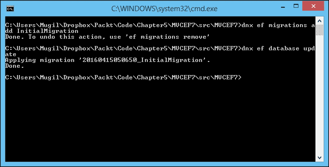

此命令将读取上一阶段创建的迁移文件，并创建数据库以及相关的表：

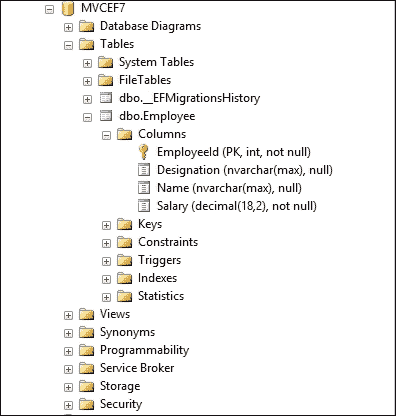

运行应用程序。您将看到以下屏幕，用户可以在表单中输入员工信息。由于我们在视图中使用强类型模型，它为所有属性取默认值。`Name`和`Designation`是`string`类型的属性，这些字段的默认值是空字符串，`Salary`是`decimal`类型，`decimal`的默认值是`0`，因此当表单加载时，`Salary`字段显示`0`。

由于没有记录，我们在“员工列表”表中显示`0`条记录：

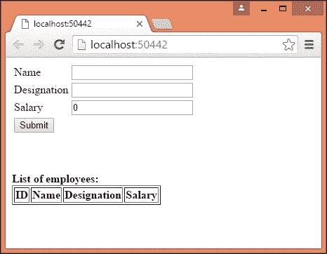

当您在表单中输入信息并提交时，信息将被保存到数据库中，并且`Employees`表中的所有数据库记录将如下所示：

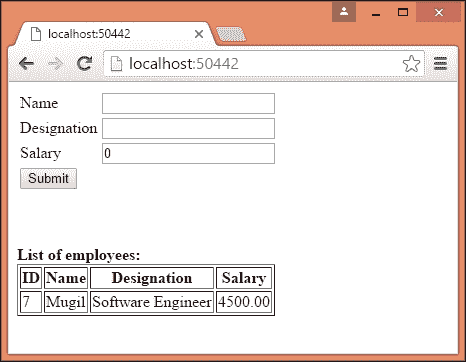

# 摘要

在本章中，我们学习了什么是模型以及它在 ASP.NET MVC 应用程序中的适用性。然后，我们创建了一个简单的模型，在控制器中构建模型数据，将模型传递给视图，并使用视图显示数据。我们学习了与视图相关的特定模型，并讨论了与模型相关的数据流。我们学习了微软的 ORM 框架 Entity Framework，以及它是如何简化从您的 .NET 应用程序访问数据库的。我们创建了一个简单的控制台应用程序，在其中我们插入了、更新了和删除了记录。最后，我们构建了一个使用模型、视图模型和 Entity Framework 的 ASP.NET Core 应用程序。
