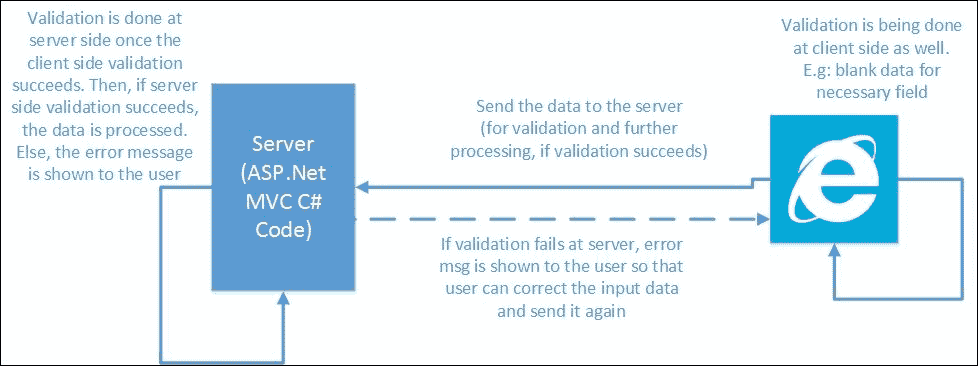
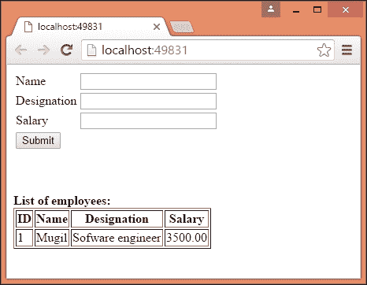
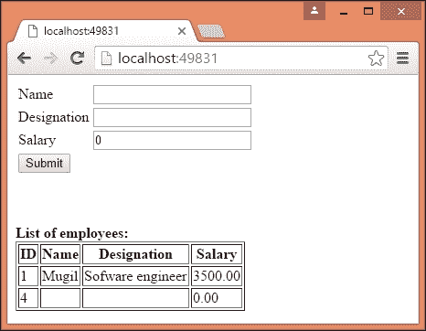
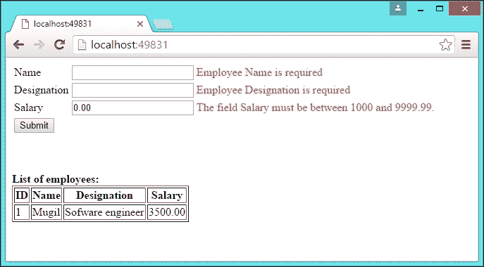
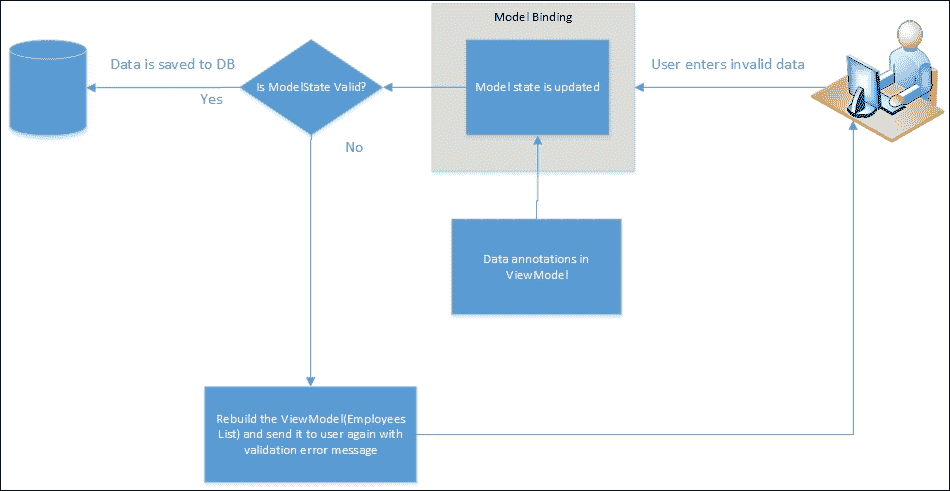
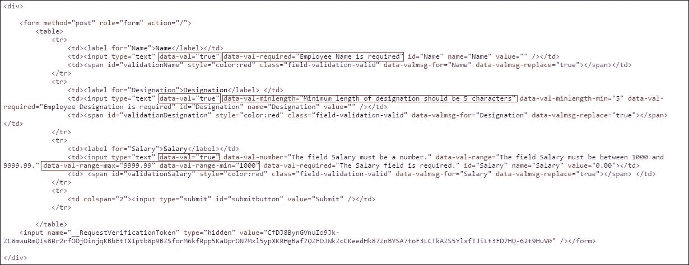

# 第六章：验证

我们永远不能依赖用户输入的数据。有时他们可能对应用程序一无所知，因此他们可能无意中输入了错误的数据。在其他时候，一些恶意用户可能希望通过在应用程序中输入不适当的数据来破坏应用程序。在任何情况下，我们都需要在存储数据以供进一步处理之前验证输入数据。

在本章中，您将学习以下主题：

+   不同类型的验证

+   带有示例的服务器端验证

+   带有示例的客户端验证

+   使用 jQuery 无障碍库进行无障碍 JavaScript 验证，其中我们不需要为验证编写单独的代码

在理想情况下，用户会在您的应用程序中以适当的格式输入有效数据。但，如您所意识到的那样，现实世界并不那么理想。用户会在您的应用程序中输入错误的数据。作为开发者，验证我们应用程序中的用户输入是我们的责任。如果输入的数据无效，您需要通知用户发生了什么错误，以便用户可以纠正输入数据并再次提交表单。

验证可以在客户端、服务器端或两端进行。如果在发送数据到服务器之前进行验证，则称为客户端验证。例如，如果用户在必填字段中没有输入任何数据，我们可以在客户端本身验证表单（通过找到未输入的数据）。没有必要将表单数据发送到服务器。JavaScript 是用于客户端验证最常用的语言。


如果验证是在服务器端进行的（将表单数据发送到服务器），则称为服务器端验证。例如，您可能想验证用户输入的数据与数据库中的数据是否一致。在这种情况下，进行服务器端验证是首选的，因为我们不能在客户端拥有数据库中的所有数据。


# 客户端和服务器端验证

在现实世界中，并不是只有服务器端或客户端验证的情况。我们可以在同一时间同时进行这两种类型的验证。实际上，建议在两端验证数据，以避免不必要的处理。



前面的图示显示了验证在客户端和服务器端同时进行。如果数据没有输入到所需的字段中，我们可以在客户端本身捕捉到这个问题。没有必要将数据发送到服务器，最终发现没有输入数据。一旦所有必需的数据都输入完毕，数据就会发送回服务器，根据某些业务逻辑验证输入的数据。如果验证失败，表单数据会再次发送到浏览器，并带有错误信息，以便用户可以再次发送数据。

我们已经讨论了关于验证的必要性以及应用程序中通常使用的验证类型的理论。让我们通过向上一章构建的应用程序添加验证来实际操作。

下面的截图是我们上一章构建的表单。这个表单没有太多花哨的地方——只有三个字段。当用户在表单中输入数据时，数据将存储在数据库中，并将整个员工信息以表格格式检索并显示出来。



在我们构建的现有应用程序中，即使用户在所有字段中都没有输入任何信息并提交，我们也不会向用户显示任何消息。相反，我们静默地存储字段的默认值（字符串类型的空值和十进制类型的 0.00），如下面的截图所示：



但情况不应该是这样的。我们应该通知用户输入的数据无效，并要求用户更正输入数据。

# 服务器端验证

让我们继续上章构建的应用程序。要进行服务器端验证，我们需要做以下操作：

1.  将数据注释属性添加到`ViewModels`模型类中。输入数据将与此元数据进行验证，并且模型状态将自动更新。

1.  更新`view`方法以显示每个字段的验证消息。将使用带有`asp-validation-for`属性的`span`标签助手来显示验证错误消息。

1.  更新控制器操作方法以验证模型状态。如果模型状态有效，我们将数据插入数据库。否则，视图模型将被更新，并且`view`方法将再次渲染，带有验证错误消息，以便用户可以使用有效的输入数据更新并再次提交表单。

## 使用数据注释属性更新视图模型

数据注释属性定义了`Model`/`ViewModel`属性的验证规则。如果输入数据与模型中的属性定义不匹配，验证将失败，这反过来又使得相关的模型状态无效。

有几个数据注释属性可用于验证数据。以下是最常用的数据注释属性：

+   **Required**：此属性表示属性是必需的。

+   **Range**：此属性定义了最小和最大约束。

+   **MinLength**：这定义了属性必须具有的最小长度，以便验证成功。

+   **MaxLength**：正如其名所示，此属性定义了属性的长度上限。如果属性值的长度超过最大长度，验证将失败。

+   **正则表达式**：如果我们使用此属性，我们可以使用正则表达式进行数据验证。

由于数据注释属性位于`System.ComponentModel.DataAnnotations`命名空间中，我们需要包含此命名空间。以下是更新后的视图模型代码：

```cs
using System; 
using System.Collections.Generic; 
using System.ComponentModel.DataAnnotations; 
using System.Linq; 
using System.Threading.Tasks; 
using Validation.Models;

namespace Validation.ViewModels 
{ 
    public class EmployeeAddViewModel 
    { 
        public List<Employee> EmployeesList { get; set; } 
        [Required(ErrorMessage ="Employee Name is required")] 
        public string Name { get; set; } 

        [Required(ErrorMessage ="Employee Designation is required")] 
        [MinLength(5, ErrorMessage = "Minimum length of designation should be 5 characters")] 
        public string Designation { get; set; } 

        [Required] 
        [Range(1000,9999.99)] 
        public decimal Salary { get; set; } 
    } 
} 

```

我们为所有三个属性——`Name`、`Designation`和`Salary`——添加了数据注释属性。

`ErrorMessage`属性显示在验证失败时显示的消息。如果验证失败且没有指定`ErrorMessage`，则将显示默认错误消息。

## 更新视图模型以显示验证错误消息

对于每个字段，我们添加了一个`span`标签，当验证失败时，错误消息将以红色显示。当验证成功时，将不会显示错误消息。`asp-validation-for`属性的值表示需要显示验证错误消息的字段名称。例如，我们使用了带有`asp-validation-for`属性和值`Name`的`span`标签，这告诉 ASP.NET MVC 显示`Name`字段的验证错误消息：

```cs
<form asp-controller="Employee" asp-action="Index"> 
        <table> 
            <tr> 
                <td><label asp-for="Name"></label></td> 
                <td><input asp-for="Name" /></td> 
                <td><span asp-validation-for="Name" style="color:red"></span></td> 
            </tr> 
            <tr> 
                <td><label asp-for="Designation"></label> </td> 
                <td><input asp-for="Designation" /></td> 
                <td><span asp-validation-for="Designation" style="color:red"></span> </td> 
            </tr> 
            <tr> 
                <td><label asp-for="Salary"></label></td> 
                <td><input asp-for="Salary"></td> 
                <td> <span asp-validation-for="Salary" style="color:red"></span> </td> 
            </tr> 
            <tr> 
                <td colspan="2"><input type="submit" id="submitbutton" value="Submit" /></td> 
            </tr> 
        </table> 
    </form> 

```

## 更新控制器操作方法以验证模型状态

模型状态会根据我们在视图模型上指定的数据注释属性和输入数据自动更新。我们在以下`Index`方法中验证模型状态是否有效，这是一个`POST`操作方法。如果模型状态有效（验证成功），我们将保存输入的数据到数据库。如果验证失败，则`ModelState`会自动设置为`invalid`。然后，我们会用输入的数据填充`ViewModel`并再次渲染`View`方法，以便用户可以纠正输入数据并重新提交数据：

```cs
[HttpPost] 
    public IActionResult Index(EmployeeAddViewModel employeeAddViewModel) 
{ 
        if (ModelState.IsValid) 
        { 
            using (var db = new EmployeeDbContext()) 
            { 
                Employee newEmployee = new Employee 
                { 
                    Name = employeeAddViewModel.Name, 
                    Designation = employeeAddViewModel.Designation, 
                    Salary = employeeAddViewModel.Salary 
                }; 
                db.Employees.Add(newEmployee); 
                db.SaveChanges(); 
                //Redirect to get Index GET method 
                return RedirectToAction("Index"); 
            } 
        } 
        using (var db = new EmployeeDbContext()) 
        { 
            employeeAddViewModel.EmployeesList = db.Employees.ToList(); 
        } 
        return View(employeeAddViewModel); 
} 

```

在对应用程序进行上述更改后运行应用程序并提交表单而不输入值时，将显示与字段旁边的错误消息，如下面的截图所示。请注意，即使在验证错误的情况下，我们也会在以下表格中显示员工数据，这是通过使用前一个代码片段中的代码块实现的。



在之前的验证及其错误消息中，有一些需要注意的事项：

+   如果验证失败，将显示预期的错误消息。

+   如果一个字段有多个验证，它将一次显示一个错误消息。例如，我们对`Designation`字段有几个验证——`Required`和`MinLength`属性。如果没有为该字段输入数据，则只会显示必填字段错误消息。只有当必填字段错误得到解决（在字段中输入一些字符）时，第二个验证错误消息才会显示。

+   如果没有错误消息可用且验证失败，将显示默认错误消息。我们没有为**薪资**字段提供任何错误消息。因此，当该字段的验证失败时，ASP.NET MVC 将根据字段名称和验证失败类型显示基于字段的默认错误消息。

前面的图示展示了服务器端验证的高级事件序列，具体描述如下：

1.  用户输入了无效数据。

1.  根据视图模型中的数据注释属性，模型状态会自动更新。这发生在模型绑定过程中，其中`view`方法中的数据映射到模型或视图模型中的数据。

1.  在控制器的操作方法中，我们正在验证模型状态。

1.  如果模型状态有效，我们将保存输入的数据到数据库。

1.  如果模型状态无效，我们将再次渲染带有验证错误消息的视图模型，以便用户可以更正输入数据，并使用有效输入数据再次提交表单。

# 客户端验证

有一些场景中我们不需要去服务器验证输入数据。在前面的服务器端验证示例中，我们不需要去服务器验证用户是否为**姓名**字段输入了数据。我们可以在客户端本身进行验证。这防止了往返服务器，并减少了服务器负载。

我们将使用 JavaScript 从客户端验证数据。JavaScript 是一种高级、解释型语言，主要用于客户端编程。

### 注意

这些天，JavaScript 也被用作 Node.js 的一部分在服务器端。

我们将在我们的视图模型（`Index.cshtml`文件）中进行一些更改，以在客户端验证表单：

1.  表单中的更改：将`id`属性添加到所有`span`标签中，以便我们可以访问此 HTML 元素来显示 HTML 错误消息。在表单提交时，调用一个 JavaScript 函数来验证输入数据。

1.  添加脚本 HTML 元素并创建一个 JavaScript 函数来验证输入数据。

在以下代码中，我们在表单提交时调用`validateForm` JavaScript 函数。如果`validateForm`函数返回`true`，则数据将被发送到服务器。否则，数据将不会发送。我们已为所有`span`标签添加了`id`属性，以便我们可以识别`span`标签并在那里显示验证错误消息：

```cs
<form asp-controller="Employee" asp-action="Index" onsubmit="return validateForm()"> 
        <table> 
            <tr> 
                <td><label asp-for="Name"></label></td> 
                <td><input asp-for="Name" /></td> 
                <td><span id="validationName" asp-validation-for="Name" style="color:red"></span></td> 
            </tr> 
            <tr> 
                <td><label asp-for="Designation"></label> </td> 
                <td><input asp-for="Designation" /></td> 
                <td><span id="validationDesignation" asp-validation-for="Designation" style="color:red"></span> </td> 
            </tr> 
            <tr> 
                <td><label asp-for="Salary"></label></td> 
                <td><input asp-for="Salary"></td> 
                <td> <span id="validationSalary" asp-validation-for="Salary" style="color:red"></span> </td> 
            </tr> 
            <tr> 
                <td colspan="2"><input type="submit" id="submitbutton" value="Submit" /></td> 
            </tr> 
        </table> 
</form> 

```

我们已添加 JavaScript 函数来验证所有三个字段。我们获取所有三个字段的值并将它们存储在单独的变量中。然后我们验证每个变量的值是否为 null 或空。如果值为空，我们获取相应字段的`span`元素并设置文本上下文为验证错误消息：

```cs
<script type="text/javascript"> 
        function validateForm() { 
            var isValidForm = true; 
            var nameValue = document.getElementById("Name").value; 
            var designationValue = document.getElementById("Designation").value; 
            var salaryValue = document.getElementById("Salary").value; 

            //Validate the name field 
            if (nameValue == null || nameValue == "") { 
                document.getElementById("validationName").textContent = "Employee Name is required - from client side"; 
                isValidForm = false; 
            } 

            //validate the designation field 
            if (designationValue == null || designationValue == "") { 
                document.getElementById("validationDesignation").textContent = "Employee Designation is required - from client side"; 
                isValidForm = false; 
            } 

            //validate the salary field - if it is empty 
            if (salaryValue == null || salaryValue == "") { 
                document.getElementById("validationSalary").textContent = "Employee Salary is required - from client side"; 
                isValidForm = false; 
            }else if (Number(salaryValue) == NaN || Number(salaryValue)<=0.0) { 
                document.getElementById("validationSalary").textContent = "Please enter valid number for salary field - from client side"; 
                isValidForm = false; 
            } 

            return isValidForm; 

        } 

</script> 

```

当你运行应用程序并提交表单而没有输入数据时，你会收到客户端本身生成的错误消息，而无需访问服务器。


在现实世界的应用程序中，我们不会手动在 JavaScript 中编写验证代码。相反，大多数应用程序使用无侵入验证，我们不需要为每个字段编写 JavaScript 代码。只需添加相应的 JavaScript 库即可。

你可能会想知道字段是如何在没有编写代码的情况下进行验证的。这个魔法在于根据数据注释属性添加到输入 HTML 元素中的 `data-` 属性。这个 jQuery 无侵入库获取到添加了 `data-` 属性的字段列表，并进行验证。

运行应用程序并按 *Ctrl* + *U* 键查看源代码。源代码看起来可能如下所示：



不同的属性将被添加到不同类型的数据注释属性中。对于需要验证的字段，`data-val` 属性将被设置为 `true`。对于在视图模型中标记为必填的属性，`data-val-required` 属性将具有相关属性的错误消息值。

# 实现

将有一个布局文件 (`_Layout.cshtml` ) 来定义你的 Web 应用程序的布局结构。由于所有页面都将使用 JavaScript 库，这是添加诸如无侵入验证等常见功能的好地方。只需将 JavaScript 库（粗体显示）添加到布局文件 (`_Layout.cshtml` ) 中，这样它们就会对所有 `View` 文件可用：

```cs
<!DOCTYPE html> 
<html> 
<head> 
    <meta name="viewport" content="width=device-width" /> 
    <title>@ViewBag.Title</title> 
</head> 
<body> 
    <div> 
        @RenderBody() 
    </div> 

<script src="img/jquery-2.2.3.js"></script> 
    <script src="img/jquery.validate.min.js"></script> 
    <script src="img/jquery.validate.unobtrusive.min.js"></script>

</body> 
</html> 

```

除了移除我们之前编写的用于验证字段的 JavaScript 函数外，视图模型没有发生变化。视图的完整代码如下：

```cs
@model Validation.ViewModels.EmployeeAddViewModel 

<div> 

    <form asp-controller="Employee" asp-action="Index" method="post" role="form"> 
        <table> 
            <tr> 
                <td><label asp-for="Name"></label></td> 
                <td><input asp-for="Name" /></td> 
                <td><span id="validationName" asp-validation-for="Name" style="color:red"></span></td> 
            </tr> 
            <tr> 
                <td><label asp-for="Designation"></label> </td> 
                <td><input asp-for="Designation" /></td> 
                <td><span id="validationDesignation" asp-validation-for="Designation" style="color:red"></span> </td> 
            </tr> 
            <tr> 
                <td><label asp-for="Salary"></label></td> 
                <td><input asp-for="Salary"></td> 
                <td> <span id="validationSalary" asp-validation-for="Salary" style="color:red"></span> </td> 
            </tr> 
            <tr> 
                <td colspan="2"><input type="submit" id="submitbutton" value="Submit" /></td> 
            </tr> 

        </table> 
    </form> 

</div> 

<br /><br /> <br /> 

<b> List of employees:</b> <br /> 
<div> 
    <table border="1"> 
        <tr> 
            <th> ID </th> 
            <th> Name </th> 
            <th> Designation </th> 
            <th> Salary </th> 
        </tr> 
        @foreach (var employee in Model.EmployeesList) 
        { 
            <tr> 
                <td>@employee.EmployeeId</td> 
                <td>@employee.Name</td> 
                <td>@employee.Designation</td> 
                <td>@employee.Salary</td> 
            </tr> 
        } 
    </table> 

</div> 

```


上述图解展示了无侵入客户端验证过程：

1.  在 `Model` /`ViewModels` 中添加了数据注释。

1.  视图接受 `Model` /`ViewModels` 并生成 HTML。

1.  视图模型生成的 HTML 包含 `data-*` 属性：

    +   对于设置了 `Required` 属性的字段，将创建 `data-val-required` 属性，其值为错误消息。

    +   对于具有 `MinLength` 数据注释属性的字段，`data-val-minlength` 属性设置为错误消息的值。

    +   对于范围数据注释，`data-val-range` 属性设置为错误消息的值。`data-val-range-max` 表示范围的最大值，而 `data-val-range-min` 属性表示范围的最小值。

1.  jQuery 无障碍验证库通过`data-*`属性读取这些元素并执行客户端验证。这允许开发者不必使用 JavaScript 编写分离的验证代码，因为所有内容都由配置本身解决。

# 摘要

在本章中，我们学习了验证的需求以及可用的不同类型的验证。我们还讨论了客户端和服务器端验证的工作原理，以及每种类型验证的优缺点。随后，我们对代码进行了更改，以在服务器端验证输入数据。然后我们使用 JavaScript 在客户端本身验证输入数据。最后，我们使用 jQuery 无障碍库在客户端进行验证，而无需编写任何用于在客户端验证输入数据的 JavaScript 代码。

在下一章中，我们将讨论路由原理以及如何自定义它。在早期章节中，我们看到了 ASP.NET 5 应用程序中路由的基础。现在我们将深入探讨这个主题。

# 看累了记得休息一会哦~

**公众号：古德猫宁李**

+   电子书搜索下载

+   书单分享

+   书友学习交流

**网站：**[沉金书屋 https://www.chenjin5.com](https://www.chenjin5.com)

+   电子书搜索下载

+   电子书打包资源分享

+   学习资源分享
