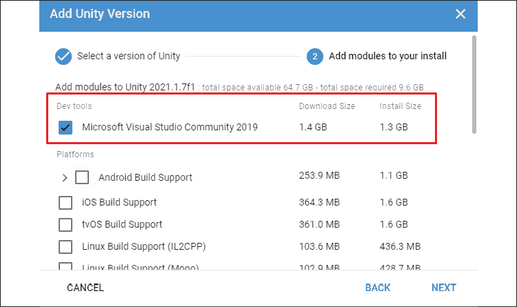

# 1

# 了解你的环境

流行文化常常将计算机程序员描绘成局外人、孤独的狼或古怪的黑客。这些人拥有非凡的算法思维天赋，社交智商较低，并且有着奇特的无政府主义倾向。虽然情况并非如此，但学习编码从根本上改变你看世界的方式这一观点是有一定道理的。好消息是，你天生的好奇心已经想要在世界中看到这些类型的模式，你甚至可能会喜欢这种新的思维方式。

从你早上睁开眼睛的那一刻起，到你睡觉前最后一眼看到你的吊扇，你都在无意识地使用分析技能，这些技能可以转化为编程——你只是缺少正确的语言和语法来将这些生活技能映射到代码中。你知道你的年龄，对吧？那是一个变量。当你过马路时，我猜你在离开人行道之前会像我们其他人一样，在两个方向上看看路。那是在评估不同的条件，在编程术语中被称为控制流。当你看一个汽水瓶时，你会本能地识别出它具有某些属性，如形状、重量和内容。那是一个类对象！你明白了。

在你的指尖拥有所有这些现实世界的经验后，你已经准备好进入编程领域。为了开始你的旅程，你需要知道如何设置你的开发环境，与相关的应用程序一起工作，并且当你需要帮助时，确切知道去哪里。

为了达到这些目的，我们将从深入研究以下 C#主题开始：

+   开始使用 Unity 2021

+   使用 C#与 Unity

+   探索文档

让我们开始吧！

# 技术要求

有时候，从一件事情不是什么，而不是它是什么开始，可能更容易。本书的**目的**不是教你关于 Unity 游戏引擎或游戏开发的所有知识。根据需要，我们将在旅程的开始阶段对这些主题进行基本介绍，并在**第六章**“用 Unity 动手实践”中进行更详细的介绍。然而，这些主题的加入是为了提供一种有趣、易于理解的方式来从头学习 C#编程语言。

由于本书面向编程的初学者，如果你对 C#或 Unity 没有任何先前的经验，那么你就在正确的位置！如果你对 Unity 编辑器有一些经验，但对编程没有，猜猜看？这个地方仍然是你的选择。即使你在 C#和 Unity 的混合中有所涉猎，但想要探索更多中级或高级主题，本书的后续章节可以为你提供你所寻找的内容。

如果你是在其他语言中经验丰富的程序员，你可以自由地跳过初学者理论，直接进入你感兴趣的部分，或者留下来巩固你的基础知识。

除了运行 Unity 2021 之外，你还将使用 C# 8.0 和 Visual Studio 来编写你的游戏代码。

# 开始使用 Unity 2021

如果您尚未安装 Unity 或正在运行早期版本，请按照以下步骤设置您的环境：

1.  访问 [`www.unity.com/`](https://www.unity.com/)。

1.  选择 **开始**（如图所示）：

    图 1.1：Unity 主页

    这将带您到 Unity 商店页面。不要感到不知所措——您可以完全免费获取 Unity！

    如果您看到的 Unity 主页与 *图 1.1* 中的不同，您可以直接访问 [`store.unity.com`](https://store.unity.com)。

1.  选择 **个人** 选项。其他付费选项提供更高级的功能和服务，但您可以自己检查这些选项：

    图 1.2：Unity 计划和定价

1.  在选择 **个人** 计划后，您将被询问您是首次用户还是回程用户。在 **首次用户** 下选择 **从这里开始**：

    图 1.3：使用 Unity 站点开始创建

1.  选择 **同意并下载** 以获取您的 Unity Hub 版本！

图 1.4：Unity 条款和条件

下载完成后，按照以下步骤操作：

1.  打开安装程序（通过双击）

1.  接受用户协议

1.  按照安装说明操作

当您收到绿灯时，请启动 Unity Hub 应用程序！

当您首次打开应用程序时，最新版本的 Unity Hub 将提供安装向导。如果您想跟随它，请随意。

以下步骤显示了如何在不依赖应用程序的情况下启动新项目：

1.  在左下角选择 **跳过安装向导**，然后确认 **跳过向导**：

    图 1.5：安装向导

1.  从左侧菜单切换到 **安装** 选项卡，并选择 **添加** 以选择您的 Unity 版本：

    图 1.6：Unity Hub 安装面板

1.  选择您想要的 Unity 版本，然后点击 **下一步**。在撰写本文时，Unity 2021 仍在预发布中，但您应该能够在阅读本文时从 **官方发布** 列表中选择一个 2021 版本：

    图 1.7：添加 Unity 版本弹出窗口

1.  您将可以选择添加各种模块到您的安装中。请确保已选择 Visual Studio 模块，然后点击 **下一步**：

图 1.8：添加安装模块

如果您以后想添加任何模块，您可以在 **安装** 窗口的任何版本右上角点击 **更多** 按钮（三个点图标）。

安装完成后，您将在 **安装** 面板中看到一个新版本，如下所示：


图 1.9：带有 Unity 版本的安装选项卡

您可以在 [`docs.unity3d.com/Manual/GettingStartedInstallingHub.html`](https://docs.unity3d.com/Manual/GettingStartedInstallingHub.html) 找到有关 Unity Hub 应用程序的更多信息。

总是有出错的可能性，所以如果你使用的是 OS Catalina 或更新的 macOS，它可能会出现问题，请确保查看以下部分。

## 使用 macOS

如果你使用的是 OS Catalina 或更新的 Mac 操作系统，使用某些版本的 Unity Hub 安装 Unity 时会出现已知问题。如果你遇到这种情况，深呼吸，前往**Unity 下载存档**，并获取你需要的 2021 版本（[`unity3d.com/get-unity/download/archive`](https://unity3d.com/get-unity/download/archive)）。请记住使用**下载（Mac）**选项而不是 Unity Hub 下载：


图 1.10：Unity 下载存档

如果你使用 Windows 并遇到类似的安装问题，下载 Unity 的存档副本也会工作得很好。

下载是一个正常的应用程序安装程序，因为它是一个`.dmg`文件。打开它，按照说明操作，你很快就可以开始了！


图 1.11：下载管理器中成功的 Unity 安装

本书的所有示例和截图都是使用 Unity 2021.1.0b8 创建和捕获的。如果你使用的是更新的版本，Unity 编辑器中的某些内容可能会有所不同，但这不应该影响你跟随教程。

现在 Unity Hub 和 Unity 2021 都已安装，是时候创建一个新项目了！

## 创建新项目

启动 Unity Hub 应用程序以开始新项目。如果你有 Unity 账户，请继续登录；如果没有，你可以创建一个或点击屏幕底部的**跳过**。

现在，让我们通过选择右上角**新建**按钮旁边的箭头图标来设置一个新的项目：


图 1.12：Unity Hub 项目面板

选择你的 2021 版本并设置以下字段：

+   **模板**：项目将默认为**3D**

+   **项目名称**：我将我的命名为“英雄降世”

+   **位置**：你希望项目保存的位置

一旦设置完成，点击**创建**：


图 1.13：Unity Hub 带有新项目配置弹出窗口

项目创建完成后，你就可以探索 Unity 界面了！你可以在 Unity Hub 的**项目**面板中随时重新打开你的项目。

## 编辑器导航

当新项目初始化完成后，你会看到辉煌的 Unity 编辑器！我在以下屏幕截图中标记了重要的标签页（或如果你更喜欢，面板）：


图 1.14：Unity 界面

这需要吸收很多信息，所以我们将更详细地查看这些面板：

1.  **工具栏**面板是 Unity 编辑器的最顶部。从这里，你可以操作对象（最左侧的按钮组）和播放/暂停游戏（中间的按钮）。最右侧的按钮组包含 Unity 服务、**层遮罩**和布局方案功能，在这本书中我们不会使用它们，因为它们与学习 C#无关。

1.  **层次结构** 窗口显示了当前游戏中 **场景** 中的每个项目。在入门项目中，这仅仅是默认的摄像机和方向光，但当我们创建我们的原型环境时，这个窗口将开始填充。

1.  **游戏** 和 **场景** 窗口是编辑器中最直观的部分。将 **场景** 窗口视为你的舞台，你可以在这里移动和排列 2D 和 3D 对象。当你按下 **播放** 按钮时，**游戏** 窗口将接管，渲染 **场景** 视图和任何编程交互。

1.  **检查器** 窗口是查看和编辑场景中对象属性的单一窗口。如果你在 **层次结构** 中选择 **主摄像机** **游戏对象**，你会看到几个部分（Unity 称之为组件）被显示出来——所有这些都可以从这里访问。

1.  **项目** 窗口包含了项目中当前所有的资源。将这视为你项目文件夹和文件的代表。

1.  **控制台** 窗口是我们希望脚本打印输出的地方。从现在开始，如果我们谈论控制台或调试输出，这个面板就是它们将显示的地方。

如果不小心关闭了这些窗口中的任何一个，你可以随时从 **Unity** | **窗口** | **通用** 中重新打开它们。你可以在 Unity 文档中找到每个窗口功能的更深入分析，网址为 [`docs.unity3d.com/Manual/UsingTheEditor.html`](https://docs.unity3d.com/Manual/UsingTheEditor.html)。

在继续之前，确保 Visual Studio 已设置为项目的脚本编辑器。转到 **Unity 菜单** | **首选项** | **外部工具**，并确认 **外部脚本编辑器** 设置为 Visual Studio for Mac 或 Windows：


图 1.15：将外部脚本编辑器更改为 Visual Studio

作为最后的提示，如果你想切换亮色和暗色模式，请转到 **Unity 菜单** | **首选项** | **通用** 并更改 **编辑器主题**：


图 1.16：Unity 通用首选项面板

我知道如果你是 Unity 新手，这可能会让你感到很多信息需要处理，但请放心，接下来的任何说明都将始终引用必要的步骤。我不会让你困惑于要按哪个按钮。现在我们已经解决了这个问题，让我们开始创建一些实际的 C# 脚本。

# 在 Unity 中使用 C#

今后，将 Unity 和 C# 视为共生实体是很重要的。Unity 是你创建脚本和游戏对象的引擎，但实际的编程是在另一个名为 Visual Studio 的程序中进行的。现在不用担心这个——我们稍后会提到。

## 使用 C# 脚本

尽管我们还没有介绍任何基本编程概念，但它们在没有学会如何在 Unity 中创建实际的 C# 脚本之前将无处安放。C# 脚本是一种特殊的 C# 文件，在其中您将编写 C# 代码。这些脚本可以在 Unity 中执行几乎任何操作，从响应玩家输入到创建游戏机制。

从编辑器创建 C# 脚本有几种方法：

+   选择 **Assets** | **创建** | **C# 脚本**

+   在 **项目** 选项卡下方，选择 **+** 图标并选择 **C# 脚本**

+   在 **项目** 选项卡中右键单击 **Assets** 文件夹，并从弹出菜单中选择 **创建** | **C# 脚本**

+   在 **层次结构** 窗口中选择任何 GameObject，然后点击 **添加组件** | **新脚本**

从现在开始，每当您被指示创建 C# 脚本时，请使用您喜欢的任何方法。

除了 C# 脚本之外，您可以使用前面提到的方法在编辑器中创建资源和对象。我不会每次创建新内容时都指出这些变体，所以只需将这些选项记在心里即可。

为了组织起见，我们将把各种资源和脚本存储在各自的标记文件夹中。这不仅仅是一个与 Unity 相关的任务——这是一件您应该始终做的事情，您的同事会感谢您的（我保证）：

1.  从 **项目** 选项卡，选择 **+** | **文件夹**（或您最喜欢的任何方法——在图 1.17 中我们选择了 **Assets** | **创建** | **文件夹**）并将其命名为 `Scripts`：

    图 1.17：创建 C# 脚本

1.  双击 **Scripts** 文件夹，创建一个新的 C# 脚本。默认情况下，脚本将被命名为 `NewBehaviourScript`，但您会看到文件名被突出显示，因此您可以选择立即重命名它。输入 `LearningCurve` 并按 `Enter` 键：

图 1.18：选择脚本文件夹的项目窗口

您可以使用 **项目** 选项卡右下角的小滑块来更改文件显示方式。

因此，您已经创建了一个名为 `Scripts` 的子文件夹，如前面的截图所示。在该父文件夹内部，您创建了一个名为 `LearningCurve.cs` 的 C# 脚本（`.cs` 文件类型代表 C-Sharp，以防您想知道），现在它作为我们 *Hero Born* 项目资源的一部分保存。接下来要做的就是将其在 Visual Studio 中打开！

## 介绍 Visual Studio 编辑器

虽然 Unity 可以创建和存储 C# 脚本，但它们需要使用 Visual Studio 进行编辑。Unity 预装了 Visual Studio 的副本，当您在编辑器中双击任何 C# 脚本时，它将自动打开。

### 打开 C# 文件

当您第一次打开文件时，Unity 将与 Visual Studio 同步。最简单的方法是从 **项目** 选项卡中选择脚本。

双击 `LearningCurve.cs`，这将打开 Visual Studio 中的 C# 文件：


图 1.19：Visual Studio 中的 LearningCurve C# 脚本

你可以随时从**Visual Studio** | **视图** | **布局**更改 Visual Studio 选项卡。本书的其余部分我将使用**设计**布局，这样我们就可以在编辑器的左侧看到我们的项目文件。

你会在界面的左侧看到文件夹结构，它反映了 Unity 中的结构，你可以像访问任何其他文件夹一样访问它。右侧是实际的代码编辑器，在这里发生魔法。Visual Studio 应用程序有更多功能，但我们只需要这些来开始。

Visual Studio 界面在 Windows 和 Mac 环境中不同，但本书中我们将使用的代码在两者上都能同样良好地工作。本书中的所有截图都是在 Mac 环境中拍摄的，所以如果你的电脑上看起来不同，你不需要担心。

### 谨防命名不匹配

新程序员常见的陷阱之一是文件命名——更具体地说，是命名不匹配——我们可以使用 Visual Studio 中 C#文件的*图 1.19*的第 5 行来展示这一点：

```cs
public class LearningCurve : MonoBehaviour 
```

`LearningCurve`类名与`LearningCurve.cs`文件名相同。**这是一个基本要求**。如果你现在还不知道类是什么，没关系。重要的是要记住，在 Unity 中，文件名和类名需要相同。如果你在 Unity 之外使用 C#，文件名和类名不需要匹配。

当你在 Unity 中创建一个 C#脚本文件时，**项目**选项卡中的文件名已经处于**编辑**模式，准备好被重命名。立即重命名它是一个好习惯。如果你稍后重命名脚本，文件名和类名将不会匹配。

如果你稍后重命名文件，文件名会改变，但第 5 行将如下所示：

```cs
public class NewBehaviourScript : MonoBehaviour 
```

如果你意外地这样做，这并不是世界末日。你只需要进入 Visual Studio，将`NewBehaviourScript`更改为你的 C#脚本名称，以及你桌面上`.meta`文件的名称。你可以在项目文件夹下的**Assets** | **Scripts**中找到`.meta`文件：


图 1.20：找到 META 文件

## 同步 C#文件

作为他们共生关系的一部分，Unity 和 Visual Studio 相互通信以同步他们的内容。这意味着如果你在一个应用程序中添加、删除或更改脚本文件，另一个应用程序将自动看到这些更改。

那么，当墨菲定律，即“*任何可能出错的事情都会出错*”发生，同步似乎根本不起作用时，会发生什么？如果你遇到这种情况，深呼吸，在 Unity 中选择有问题的脚本，右键单击，并选择**刷新**。

你现在已经掌握了脚本创建的基础，所以是时候讨论如何找到并高效使用有用的资源了。

# 探索文档

在我们第一次探索 Unity 和 C#脚本的过程中，我们将讨论的最后一个主题是文档。我知道这可能不是那么吸引人，但处理新的编程语言或开发环境时，早期养成良好的习惯是很重要的。

## 访问 Unity 的文档

一旦你开始认真编写脚本，你将经常使用 Unity 的文档，因此了解如何早期访问它是有益的。*参考手册*将为你提供一个组件或主题的概述，而具体的编程示例可以在*脚本参考*中找到。

场景中的每个游戏对象（**层次结构**窗口中的项目）都有一个**变换**组件，它控制其**位置**、**旋转**和**缩放**。为了保持简单，我们只需在参考手册中查找摄像机的**变换**组件：

1.  在**层次结构**选项卡中，选择**主摄像机**游戏对象

1.  切换到**检查器**选项卡，点击**变换**组件右上角的信息图标（问号）！

图 1.21：在检查器中选中的主摄像机游戏对象

您将在参考手册的**变换**页面打开一个网页浏览器：


图 1.22：Unity 参考手册

Unity 中的所有组件都具有此功能，所以如果你想知道某物是如何工作的，你知道该怎么做。

因此，我们已经打开了参考手册，但如果我们想找到与**变换**组件相关的具体编码示例怎么办？这很简单——我们只需要询问脚本参考。

点击组件或类名下方的**切换到脚本**链接（在本例中为**变换**）：


图 1.23：突出显示 SWITCH TO SCRIPTING 按钮的 Unity 参考手册

通过这样做，参考手册将自动切换到脚本参考：


图 1.24：突出显示 SWITCH TO MANUAL 的 Unity 脚本文档

如您所见，除了编码帮助外，如果需要，还可以切换回参考手册。

脚本参考是一个大文档，因为它是必需的。然而，这并不意味着你必须记住它，甚至不需要熟悉它的所有信息就可以开始编写脚本。正如其名所示，它是一个参考，而不是考试。

如果你在文档中迷失方向，或者只是不知道该往哪里看，你还可以在以下 Unity 丰富的开发社区中找到解决方案：

+   Unity 论坛：[`forum.unity.com/`](https://forum.unity.com/)

+   Unity 问答：[`answers.unity.com/index.html`](https://answers.unity.com/index.html)

+   Unity Discord：[`discord.com/invite/unity`](https://discord.com/invite/unity)

在另一方面，你需要知道在哪里找到任何 C#问题的资源，我们将在下一节中介绍。

## 定位 C#资源

现在我们已经处理好了 Unity 资源，让我们来看看微软的一些 C#资源。首先，在[`docs.microsoft.com/en-us/dotnet/csharp`](https://docs.microsoft.com/en-us/dotnet/csharp)的 Microsoft Learn 文档中有大量的优秀教程、快速入门指南和如何操作的文章。你还可以在[`docs.microsoft.com/en-us/dotnet/csharp/programming-guide/index`](https://docs.microsoft.com/en-us/dotnet/csharp/programming-guide/index)找到关于单个 C#主题的精彩概述。

然而，如果你想了解特定 C#语言特性的详细信息，参考指南是你要去的地方。这些参考指南是任何 C#程序员的宝贵资源，但由于它们并不总是容易导航，让我们花几分钟时间学习如何找到我们想要的内容。

让我们加载编程指南链接并查找 C#的`String`类。你可以执行以下任一操作：

+   在网页左上角的搜索栏中输入`Strings`

+   滚动到**语言部分**并直接点击**字符串**链接！


你应该会看到以下类似的内容，用于类描述页面：


图 1.26：微软的字符串（C#编程指南）页面

与 Unity 的文档不同，C#参考和脚本信息都打包在一起，但它的优点是右侧的子主题列表。好好利用它！当你遇到困难或有问题时，知道在哪里找到帮助非常重要，所以每次遇到障碍时，一定要回到这个部分。

# 摘要

在本章中，我们涵盖了大量的后勤信息，所以如果你迫不及待地想写一些代码，我可以理解。开始新项目、创建文件夹和脚本、访问文档都是在新冒险的兴奋中容易忘记的话题。只需记住，本章包含了许多你可能在后续页面中需要的资源，所以不要害怕回来再次访问。像程序员一样思考是一种肌肉：你越锻炼它，它就越强壮。

在下一章中，我们将开始介绍你需要为编程大脑预热的理论、词汇和主要概念。尽管材料是概念性的，我们仍然会在`LearningCurve`脚本中写下我们的第一行代码。准备好吧！

# 小测验 - 处理脚本

1.  Unity 和 Visual Studio 之间有什么类型的关系？

1.  脚本参考提供了关于使用特定 Unity 组件或特性的示例代码。你可以在哪里找到更多关于 Unity 组件的详细（非代码相关）信息？

1.  脚本参考是一个大文档。在尝试编写脚本之前，你需要记住其中多少内容？

1.  何时是给 C#脚本命名的最佳时机？

# 加入我们的 Discord！

与其他用户、Unity/C# 专家以及哈里森·费罗内一起阅读此书。提问、为其他读者提供解决方案、通过*问我任何问题*环节与作者聊天，以及更多。

立即加入！

[`packt.link/csharpunity2021`](https://packt.link/csharpunity2021)


