# 3

# 深入变量、类型和方法

任何编程语言的入门步骤都受到一个基本问题的困扰——你可以理解所输入的单词，但无法理解它们的含义。通常，这会导致悖论，但编程是一个特殊情况。

C# 不是一个自己的语言；它是用英语编写的。你每天使用的单词与 Visual Studio 中的代码之间的差异来自于缺少上下文，这是必须再次学习的东西。你知道如何说和拼写 C# 中使用的单词，但你不知道的是它们在哪里、何时、为什么，最重要的是，它们如何构成语言的语法。

本章标志着我们从编程理论转向实际编码的开始。我们将讨论接受的格式、调试技术，以及组合更复杂的变量和方法示例。有很多内容要覆盖，但当你到达最后一个测验时，你将能够舒适地掌握以下高级主题：

+   正确编写 C#

+   调试你的代码

+   理解变量

+   介绍运算符

+   定义方法

让我们开始吧！

# 正确编写 C#

代码行就像句子一样，意味着它们需要某种分隔或结束字符。每一行 C# 代码，称为语句，*必须*以分号结尾，以便代码编译器能够处理。

然而，有一个你必须注意的陷阱。与我们都熟悉的书面文字不同，C# 语句在技术上不必在单行上；空白符和新行被代码编译器忽略。例如，一个简单的变量可以写成这样：

```cs
public int FirstName = "Harrison"; 
```

或者，它也可以写成如下形式：

```cs
public
int
FirstName
= 
"Harrison"; 
```

这两个代码片段在 Visual Studio 中都是完全可以接受的，但第二个选项在软件社区中是高度不建议的，因为它使得代码变得极其难以阅读。理念是尽可能高效和清晰地编写你的程序。

有时会有一行语句太长，无法合理地放在单行上，但这些情况很少。只需确保格式化方式能让其他人理解，并且不要忘记分号。

你需要深入到你的编码肌肉记忆中的第二个格式化规则是使用花括号或大括号：`{}`。方法、类和接口在其声明之后都需要一组花括号。我们稍后会深入讨论这些内容，但重要的是要尽早在你的脑海中形成标准格式。

在 C# 中的传统做法是将每个括号放在新的一行上，如下所示的方法：

```cs
public void MethodName() 
{
} 
```

然而，你可能会在野外看到第一个花括号与声明位于同一行的。这完全取决于个人喜好：

```cs
public void MethodName() {
} 
```

虽然这并不是什么值得让你抓狂的事情，但重要的是要保持一致性。在这本书中，我们将坚持使用“纯”C#代码，这总是将每个括号放在新的一行上，而与 Unity 和游戏开发相关的 C#示例通常会遵循第二个示例。

在开始编程时，良好的、一致的格式化风格至关重要，但能够看到你工作的成果也同样重要。在下一节中，我们将讨论如何将变量和信息直接打印到 Unity 控制台。

# 调试你的代码

当我们在实际示例中工作时，我们需要一种方法来将信息和反馈打印到 Unity 编辑器中的**控制台**窗口。这种程序性的术语是调试，C#和 Unity 都提供了辅助方法来简化开发者的这一过程。你已经从上一章中调试了你的代码，但我们没有深入探讨它实际上是如何工作的。让我们来解决这个问题。

每当我让你调试或打印某些内容时，请使用以下方法之一：

+   对于简单的文本或单个变量，请使用标准的`Debug.Log()`方法。文本需要放在一组括号内，变量可以直接使用，无需添加任何字符；例如：

    ```cs
    Debug.Log("Text goes here.");
    Debug.Log(CurrentAge); 
    ```

    这将在**控制台**面板中产生以下结果：

    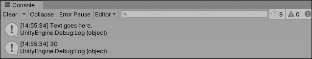

图 3.1：观察 Debug.Log 输出

+   对于更复杂的调试，请使用`Debug.LogFormat()`。这将允许你通过使用占位符在打印的文本中放置变量。这些占位符由一对大括号标记，每个大括号包含一个索引。索引是一个常规数字，从 0 开始，按顺序递增 1。在以下示例中，`{0}`占位符被`CurrentAge`值替换，`{1}`被`FirstName`替换，依此类推：

    ```cs
    Debug.LogFormat("Text goes here, add {0} and {1} as variable
       placeholders", CurrentAge, FirstName); 
    ```

    这将在**控制台**面板中产生以下结果：

    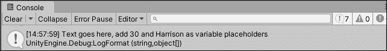

    图 3.2：观察 Debug.LogFormat 输出

你可能已经注意到我们在调试技术中使用了**点符号**，你说得对！Debug 是我们使用的类，而`Log()`和`LogFormat()`是我们可以从该类中使用的不同方法。更多内容将在本章末尾介绍。

在掌握了调试的技巧之后，我们可以安全地继续深入探讨变量的声明方式以及语法如何以不同的方式发挥作用。

# 理解变量

在上一章中，我们看到了如何编写变量以及它们提供的高级功能。然而，我们仍然缺少使所有这些成为可能的语言语法。

## 声明变量

变量不仅仅出现在 C#脚本的最顶部；它们必须根据某些规则和要求进行声明。在最基本层面上，一个变量声明需要满足以下要求：

+   需要指定变量将存储的数据类型

+   变量必须有一个唯一的名称

+   如果有指定的值，它必须与指定的类型匹配

+   变量声明需要以分号结束

遵循这些规则的结果是以下语法：

```cs
dataType UniqueName = value; 
```

变量需要唯一的名称以避免与 C# 已经占用的单词冲突，这些单词被称为关键字。你可以在 [`docs.microsoft.com/en-us/dotnet/csharp/language-reference/keywords/index`](https://docs.microsoft.com/en-us/dotnet/csharp/language-reference/keywords/index) 找到受保护关键字的完整列表。

这很简单、整洁且高效。然而，如果编程语言只有一种创建像变量这样普遍的东西的方法，那么从长远来看，它将没有用处。复杂的应用程序和游戏有不同的用例和场景，所有这些都有独特的 C# 语法。

### 类型和价值声明

创建变量的最常见场景是在声明时提供所有必要信息。例如，如果我们知道一个玩家的年龄，存储它就像做以下事情一样简单：

```cs
int CurrentAge = 32; 
```

这里，所有基本要求都已满足：

+   指定了一个数据类型，即 `int`（代表整数）

+   使用一个唯一的名称，即 `CurrentAge`

+   `32` 是一个整数，与指定的数据类型匹配

+   语句以分号结束

然而，将会有一些场景，你想要声明一个变量，但一开始不知道它的值。我们将在下一节讨论这个话题。

### 仅类型声明

考虑另一种场景——你知道一个变量要存储的数据类型及其名称，但不知道其值。值将在其他地方计算并分配，但你仍然需要在脚本顶部声明这个变量。这种情况非常适合仅类型声明：

```cs
int CurrentAge; 
```

仅定义了类型（`int`）和唯一名称（`CurrentAge`），但语句仍然有效，因为我们遵循了规则。没有赋值的情况下，将根据变量的类型分配默认值。在这种情况下，`CurrentAge` 将被设置为 `0`，这与 `int` 类型相匹配。一旦变量的实际值可用，就可以通过引用变量名称并为其赋值来轻松地在单独的语句中设置它：

```cs
CurrentAge = 32; 
```

你可以在 [`docs.microsoft.com/en-us/dotnet/csharp/language-reference/builtin-types/default-values`](https://docs.microsoft.com/en-us/dotnet/csharp/language-reference/builtin-types/default-values) 找到所有 C# 类型及其默认值的完整列表。

到目前为止，你可能想知道为什么我们的变量还没有包括 `public` 关键字，这被称为 *访问修饰符*，我们在早期的脚本示例中见过。答案是，我们没有必要的知识基础来清晰地讨论它们。现在我们有了这个基础，是时候详细回顾它们了。

## 使用访问修饰符

现在基本语法不再是谜团，让我们深入了解变量语句的细节。由于我们是从左到右阅读代码，因此从传统上首先出现的关键字——访问修饰符——开始我们的变量深入研究是有意义的。

快速回顾一下前一章在`LearningCurve`中使用的变量，你会发现它们在语句的开头有一个额外的关键字：`public`。这是变量的访问修饰符。把它想象成一个安全设置，决定了谁和什么可以访问变量的信息。

任何未标记为`public`的变量默认为`private`，并且不会在 Unity 检查器面板中显示。

如果你包含一个修饰符，我们在本章开头整理的更新语法食谱将看起来像这样：

```cs
accessModifier dataType UniqueName = value; 
```

当声明变量时，虽然显式访问修饰符不是必需的，但作为一个新程序员养成这个习惯是好的。这个词的额外作用对于代码的可读性和专业性来说意义重大。

C#中有四种主要的访问修饰符可用，但作为初学者，你将最常使用以下两个：

+   **公共**：这可以无限制地提供给任何脚本。

+   **私有**：这仅在它们被创建的类中可用（称为包含类）。任何没有访问修饰符的变量默认为私有。

两个高级修饰符有以下特点：

+   **受保护的**：可以从它们的包含类或从它派生的类型中访问

+   **内部**：仅在当前程序集内可用

每个这些修饰符都有特定的使用场景，但直到我们到达高级章节，不用担心**受保护的**和**内部的**。

还存在两种组合修饰符，但在这本书中我们不会使用它们。你可以在[`docs.microsoft.com/en-us/dotnet/csharp/language-reference/keywords/access-modifiers`](https://docs.microsoft.com/en-us/dotnet/csharp/language-reference/keywords/access-modifiers)找到更多关于它们的信息。

让我们尝试一些自己的访问修饰符！就像现实生活中的信息一样，一些数据需要被保护或与特定的人共享。如果一个变量不需要在**检查器**窗口中更改或从其他脚本中访问，它是一个很好的私有访问修饰符的候选者。

执行以下步骤以更新`LearningCurve`：

1.  将`CurrentAge`前面的访问修饰符从`public`更改为`private`并保存文件。

1.  返回 Unity，选择主摄像机，查看`LearningCurve`部分发生了什么变化！

图 3.3：附加到主摄像机的 LearningCurve 脚本组件

由于`CurrentAge`现在是私有的，它不再在**检查器**窗口中可见，只能在代码中的`LearningCurve`脚本中访问。如果我们点击播放，脚本仍然会像以前一样工作。

这是我们变量之旅的良好开端，但我们仍然需要了解它们可以存储哪些类型的数据。这正是数据类型发挥作用的地方，我们将在下一节中探讨。

## 与类型一起工作

为变量指定特定类型是一个重要的选择，这个选择会渗透到变量在其整个生命周期中的每一次交互中。由于 C#被称为*强类型*或*类型安全*的语言，每个变量都必须有一个数据类型，没有例外。这意味着在执行某些类型的操作时有一些特定的规则，以及将给定变量类型转换为另一种类型时的规定。

### 常用内置类型

C#中的所有数据类型都源自一个共同的祖先：`System.Object`。这个被称为**公共类型系统**（**CTS**）的层次结构意味着不同类型有很多共享的功能。以下表格列出了一些最常见的数据类型选项及其存储的值：

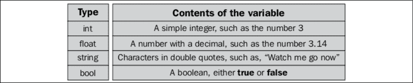

图 3.4：变量的常见数据类型

除了指定变量可以存储的值的类型外，类型还包含有关自身的一些附加信息，包括以下内容：

+   所需存储空间

+   最小和最大值

+   允许的操作

+   内存中的位置

+   可访问的方法

+   基础（派生）类型

如果这看起来令人不知所措，请深呼吸。处理 C#提供的所有类型是使用文档而不是记忆的完美例子。很快，使用甚至最复杂的自定义类型将感觉像第二本能。

您可以在[`docs.microsoft.com/en-us/dotnet/csharp/programming-guide/types/index`](https://docs.microsoft.com/en-us/dotnet/csharp/programming-guide/types/index)找到所有 C#内置类型及其详细说明的完整列表。

在类型列表成为难题之前，最好是尝试使用它们。毕竟，学习新事物的最佳方式是使用它，破坏它，然后学会修复它。

请打开`LearningCurve`并从*常用内置类型*部分为前表中每种类型添加一个新变量。您使用的名称和值由您决定；只需确保它们被标记为 public，这样我们就可以在检查器窗口中看到它们。如果您需要灵感，请查看我的代码：

```cs
public class LearningCurve : MonoBehaviour
{
    private int CurrentAge = 30;
    public int AddedAge = 1;

**public****float** **Pi =** **3.14f****;**
**public****string** **FirstName =** **"Harrison"****;**
**public****bool** **IsAuthor =** **true****;**

    // Start is called before the first frame update
    void Start()
    {
        ComputeAge(); 
    }

    /// <summary>
    /// Time for action - adding comments
    /// Computes a modified age integer
    /// </summary>
    void ComputeAge()
    {
        Debug.Log(CurrentAge + AddedAge);
    }
} 
```

当处理字符串类型时，实际文本值需要放在一对双引号内，而浮点值需要以小写`f`结尾，例如`FirstName`和`Pi`所示。

我们的所有不同变量类型现在都可见。请注意 Unity 显示为复选框的`bool`变量（true 被选中，false 未被选中）。


图 3.5：包含常见变量类型的 LearningCurve 脚本组件

记住，任何你声明为私有的变量都不会出现在检查器窗口中。在我们继续讨论转换之前，我们需要提及字符串数据类型的一个常见且强大的应用；即创建任意位置插入变量的字符串。

虽然数字类型的表现符合你从小学数学中学到的预期，但字符串则另当别论。可以通过在文本中直接插入变量和字面量值，并在开头使用一个 `$` 字符来实现字符串插值，这被称为字符串插值。你已经在 `LogFormat()` 调试中使用了插值字符串；添加 `$` 字符让你可以在任何地方使用它们！

让我们在 `LearningCurve` 中创建一个简单的插值字符串，以观察其作用。在调用 `ComputeAge()` 之后直接在 `Start()` 方法中打印出插值字符串：

```cs
void Start()
{
    ComputeAge();
    **Debug.Log(****$"A string can have variables like** **{FirstName}** **inserted directly!"****);**
} 
```

多亏了 `$` 字符和大括号，`FirstName` 的值被当作值处理，并在插值字符串中打印出来。如果没有这种特殊格式，字符串将只包含 `FirstName` 作为文本，而不是变量值。

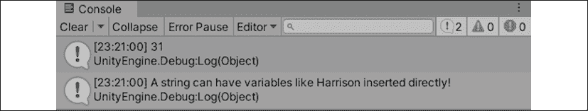

图 3.6：显示调试日志输出的控制台

还可以使用 `+` 运算符创建插值字符串，我们将在 *介绍运算符* 部分讨论这一点。

### 类型转换

我们已经看到变量只能持有其声明类型的值，但会有需要组合不同类型变量值的情况。在编程术语中，这些被称为转换，并且主要有两种类型：

+   **隐式**转换会自动进行，通常是在一个较小的值可以无任何舍入地放入另一个变量类型时。例如，任何整数都可以隐式地转换为 `double` 或 `float` 值，而无需额外的代码：

    ```cs
    int MyInteger = 3;
    float MyFloat = MyInteger;

    Debug.Log(MyInteger);
    Debug.Log(MyFloat); 
    ```

    **控制台**面板中的输出可以在以下屏幕截图中看到：

    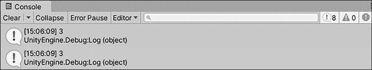

图 3.7：隐式类型转换调试日志输出

+   当转换过程中有丢失变量信息的风险时，需要使用**显式**转换。例如，如果我们想将 `double` 类型的值转换为 `int` 类型的值，我们必须通过在要转换的值之前添加括号内的目标类型来显式地转换（转换）它。

+   这告诉编译器我们意识到数据（或精度）可能会在转换过程中丢失：

    ```cs
    int ExplicitConversion = (int)3.14; 
    ```

    在这种显式转换中，`3.14` 将被舍入到 `3`，丢失小数部分：

    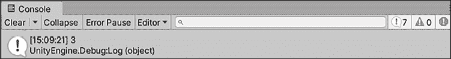

图 3.8：显式类型转换调试日志输出

C# 提供了内置方法来显式地将值转换为常见类型。例如，任何类型都可以使用 `ToString()` 方法转换为字符串值，而 `Convert` 类可以处理更复杂的转换。您可以在 [`docs.microsoft.com/en-us/dotnet/api/system.convert?view=netframework-4.7.2`](https://docs.microsoft.com/en-us/dotnet/api/system.convert?view=netframework-4.7.2) 的 *方法* 部分找到更多关于这些功能的信息。

到目前为止，我们已经了解到类型在它们的交互、操作和转换方面有一些规则，但当我们需要存储未知类型的变量时，我们该如何处理这种情况呢？这听起来可能有些疯狂，但想想数据下载的场景——你知道信息正在进入你的游戏，但你不确定它将以什么形式出现。我们将在下一节中讨论如何处理这种情况。

### 推断声明

幸运的是，C# 可以从其分配的值中 *推断* 变量的类型。例如，`var` 关键字可以让程序知道数据类型 `CurrentAge` 需要根据其值 `32`（一个整数）来确定：

```cs
**var** CurrentAge = 32; 
```

虽然这在某些情况下很有用，但不要陷入使用推断变量声明来处理所有事情的懒惰编程习惯。这会给你的代码增加很多猜测，而它应该是清晰明了的。

在我们结束对数据类型和转换的讨论之前，我们确实需要简要地提及创建自定义类型的概念，我们将在下一部分进行。

### 自定义类型

当我们谈论数据类型时，重要的是从一开始就理解，数字和单词（称为 *字面值*）并不是变量可以存储的唯一类型的值。例如，类、结构体或枚举可以作为变量存储。我们将在 *第五章*，*使用类、结构体和面向对象编程* 中介绍这些主题，并在 *第十章*，*重新审视类型、方法和类* 中更详细地探讨它们。

类型很复杂，唯一能够熟悉它们的方法就是使用它们。然而，以下是一些需要记住的重要事项：

+   所有变量都需要指定一个类型（无论是显式还是推断）

+   变量只能持有其分配类型的值（一个 `string` 值不能分配给 `int` 变量）

+   如果一个变量需要与不同类型的变量赋值或组合，则需要执行转换（无论是隐式还是显式）

+   C# 编译器可以使用 `var` 关键字从变量的值中推断其类型，但只有在创建时类型未知的情况下才应使用

我们刚刚在几个部分中详细介绍了许多细节，但我们还没有完成。我们仍然需要了解 C# 中的命名约定是如何工作的，以及变量在我们的脚本中的位置。

## 变量命名

在学习了访问修饰符和类型之后，为变量命名可能看起来像是事后考虑的事情，但它不应该是一个简单的选择。代码中的清晰和一致的命名约定不仅会使代码更易读，而且还能确保你的团队成员在不需要询问的情况下就能理解你的意图。

命名变量的第一个规则是，你给它起的名字应该是具有意义的；第二个规则是使用 Pascal 风格。让我们以游戏中的一个常见例子为例，声明一个变量来存储玩家的生命值：

```cs
public int Health = 100; 
```

如果你发现自己声明变量是这样的，你应该在脑海中响起警钟。谁的健康？它是存储最大值还是最小值？当这个值改变时，哪些其他代码会受到什么影响？这些都是应该通过有意义的变量名轻松回答的问题；你不想在一周或一个月后发现自己被自己的代码搞糊涂。

话虽如此，让我们尝试使用 Pascal 风格的命名来使它变得更好：

```cs
public int MaxPlayerHealth = 100; 
```

记住，Pascal 风格的命名在每个单词的开头字母都要大写。

这样就更好了。经过一番思考，我们用意义和上下文更新了变量名。由于在变量名长度方面没有技术限制，你可能会发现自己写出了过于详细的名字，这会给你带来和简短、不具描述性的名字一样的问题。

作为一般规则，使变量名尽可能具有描述性——既不过多也不过少。找到你的风格并坚持下去。

## 理解变量作用域

我们即将结束对变量的深入研究，但还有一个更重要的话题需要讨论：作用域。与确定哪些外部类可以获取变量信息的访问修饰符类似，变量作用域是用来描述给定变量在其包含类中存在的地方及其访问点的术语。

C# 中变量作用域主要有三个级别：

+   **全局**作用域指的是可以被整个程序访问的变量；在这种情况下，是一个游戏。C# 不直接支持全局变量，但在某些情况下，这个概念是有用的，我们将在 *第十章*，*重新审视类型、方法和类* 中讨论。

+   **类**或**成员**作用域指的是在其包含类中任何地方都可以访问的变量。

+   **局部**作用域指的是只在其创建的特定代码块内可以访问的变量。

看看下面的截图。如果你不想将其放入 `LearningCurve`，那就不用了；目前这只是为了可视化目的：

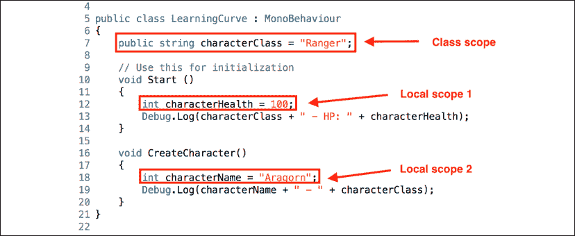

图 3.9：LearningCurve 脚本中不同作用域的示意图

当我们谈论代码块时，我们指的是任何一组花括号内的区域。这些括号在编程中充当一种视觉层次结构；它们越向右缩进，就越深地嵌套在类中。

让我们分析一下前面截图中的类和局部作用域变量：

+   `CharacterClass` 在类的最顶部声明，这意味着我们可以在 `LearningCurve` 的任何地方通过名称引用它。你可能听说过这个概念被称为变量可见性，这是一个很好的思考方式。

+   `CharacterHealth` 在 `Start()` 方法中声明，这意味着它只在该代码块内部可见。我们仍然可以从 `Start()` 中无问题地访问 `CharacterClass`，但如果尝试从 `Start()` 之外的地方访问 `CharacterHealth`，就会得到错误。

+   `CharacterName` 和 `CharacterHealth` 处于同一境地；它只能从 `CreateCharacter()` 方法中访问。这只是为了说明在单个类中可以有多个，甚至是嵌套的局部作用域。

如果你经常和程序员在一起，你会听到关于最佳变量声明位置的讨论（或者根据时间可能是争论）。答案比你想象的要简单：变量应该根据其用途来声明。如果你有一个需要在整个类中访问的变量，就将其声明为类变量。如果你只需要在代码的特定部分使用变量，就将其声明为局部变量。

注意，只有类变量可以在检查器窗口中查看，而局部或全局变量则没有这个选项。

在我们的工具箱中有了命名和作用域之后，让我们回到中学的数学课堂，重新学习算术运算是如何工作的！

# 介绍运算符

编程语言中的运算符符号代表类型可以执行的计算、赋值、关系和逻辑功能。算术运算符代表基本的数学函数，而赋值运算符则在给定的值上同时执行数学和赋值功能。关系和逻辑运算符评估多个值之间的条件，例如大于、小于和等于。

C# 还提供了位运算和杂项运算符，但直到你开始创建更复杂的应用程序，这些运算符才对你有用。

到目前为止，只介绍算术和赋值运算符是有意义的，但当我们进入下一章并变得相关时，我们会讨论关系和逻辑功能。

## 算术和赋值

你已经熟悉了从学校学到的算术运算符符号：

+   `+` 表示加法

+   `-` 表示减法

+   `/` 表示除法

+   `*` 表示乘法

C# 操作符遵循传统的运算顺序，即首先评估括号，然后是指数，然后是乘法，然后是除法，然后是加法，最后是减法。例如，以下等式将提供不同的结果，即使它们包含相同的值和操作符：

```cs
5 + 4 - 3 / 2 * 1 = 8
5 + (4 - 3) / 2 * 1 = 5 
```

操作符在应用于变量时与应用于字面值时的行为相同。

可以使用任何算术和等于符号的组合，将赋值操作符用作任何数学运算的简写替换。例如，如果我们想乘以一个变量，可以使用以下代码：

```cs
int CurrentAge = 32;
CurrentAge = CurrentAge * 2; 
```

完成此操作的第二种、替代方法如下所示：

```cs
int CurrentAge = 32;
CurrentAge *= 2; 
```

在 C# 中，等于符号也被视为赋值操作符。其他赋值符号遵循我们之前的乘法示例中的相同语法模式：`+=`、`-=` 和 `/=` 分别用于加和赋值、减和赋值以及除和赋值。

当涉及到操作符时，字符串是一个特殊情况，因为它们可以使用加号来创建拼贴文本，如下所示：

```cs
string FullName = "Harrison " + "Ferrone"; 
```

当在 **控制台** 面板中记录时，这将产生以下结果：

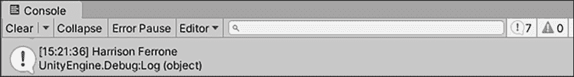

图 3.10：在字符串上使用操作符

这种方法往往会产生笨拙的代码，因此在大多数情况下，字符串插值是组合不同文本片段的首选方法。

注意，算术操作符并不适用于所有数据类型。例如，`*` 和 `/` 操作符不适用于字符串值，而且这些操作符都不适用于布尔值。了解了类型有规则来规范它们可以进行的操作和交互后，让我们在下一节中尝试一下实践操作。

让我们做一个小实验：我们将尝试将我们的 `string` 和 `float` 变量相乘，就像我们之前对数字所做的那样：

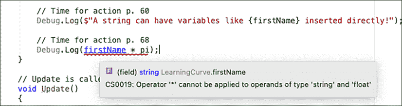

图 3.11：Visual Studio 错误类型操作错误信息

看看 Visual Studio，你会看到一个错误信息，告诉我们 `string` 类型和一个 `float` 类型不能相乘。这个错误也会在 Unity **控制台** 中显示，并且不允许项目构建。

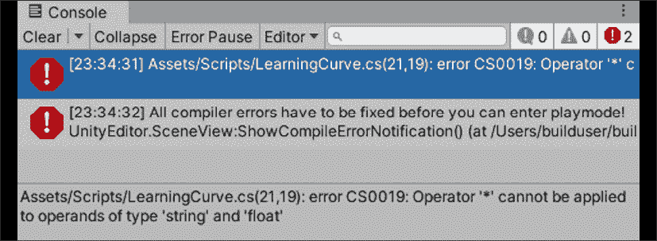

图 3.12：控制台显示不兼容数据类型上的操作符错误

每当你看到这种类型的错误时，请返回并检查你的变量类型是否存在不兼容性。

我们必须清理这个例子，因为编译器不允许我们在这一点上运行我们的游戏。在 `Debug.Log(FirstName*Pi)` 行的开始选择一对反斜杠（`//`），或者完全删除它。

至此，我们关于变量和类型的讨论就到这里。在继续之前，务必在章节测验中测试自己！

# 定义方法

在上一章中，我们简要介绍了方法在我们程序中的作用；即它们存储和执行指令，就像变量存储值一样。现在，我们需要了解方法声明的语法以及它们如何在我们的类中驱动动作和行为。

与变量一样，方法声明也有其基本要求，如下所示：

+   方法将返回的数据类型

+   一个独特的名称，以大写字母开头

+   方法名称后跟一对括号

+   一对大括号标记方法体（其中存储指令）

将所有这些规则放在一起，我们得到一个简单的方法蓝图：

```cs
returnType UniqueName() 
{ 
    method body 
} 
```

让我们以`LearningCurve`中的默认`Start()`方法作为一个实际例子来分解：

```cs
void Start() 
{
} 
```

在前面的输出中，我们可以看到以下内容：

+   方法以`void`关键字开头，如果方法不返回任何数据，则用作方法的返回类型。

+   方法在类中有唯一的名称。你可以在不同的类中使用相同的名称，但你应该始终努力使你的名称独特，无论什么情况。

+   该方法名称后有一对括号，用于包含任何潜在的参数。

+   方法体由一组大括号定义。

通常情况下，如果你有一个方法体为空的方法，删除它是一个好的实践。你总是希望修剪掉脚本中未使用的代码。

与变量一样，方法也可以有安全级别。然而，它们也可以有输入参数，这两个问题我们将在下一节讨论！

## 声明方法

方法也可以有与变量相同的四种访问修饰符，以及输入参数。参数是变量占位符，可以传递到方法中并在其中访问。你可以使用的输入参数数量没有限制，但每个参数都需要用逗号分隔，显示其数据类型，并且具有唯一名称。

将方法参数想象成变量占位符，其值可以在方法体中使用。

如果我们应用这些选项，我们的更新蓝图将看起来像这样：

```cs
**accessModifier** returnType UniqueName(**parameterType parameterName**) 
{ 
    method body 
} 
```

如果没有明确的访问修饰符，则方法默认为私有。私有方法，就像私有变量一样，不能从其他脚本中调用。

要调用一个方法（即运行或执行其指令），我们只需使用其名称，然后跟上一对括号，其中可以包含或不包含参数，并以分号结尾：

```cs
// Without parameters
UniqueName();
// With parameters
UniqueName(parameterVariable); 
```

与变量一样，每个方法都有一个指纹，描述其访问级别、返回类型和参数。这被称为其方法签名。本质上，方法签名将方法标记为对编译器是唯一的，这样 Visual Studio 就知道如何处理它。

现在我们已经了解了方法的构成，让我们自己创建一个。

上一章中的“方法也是占位符”部分让你盲目地将名为`ComputeAge()`的方法复制到`LearningCurve`中，而你并不知道你将面临什么。这次，让我们有目的地创建一个方法：

1.  声明一个名为`GenerateCharacter()`的`public`方法，返回类型为`void`：

    ```cs
    public void GenerateCharacter() 
    {
    } 
    ```

1.  在新方法中添加一个简单的`Debug.Log()`并打印出你喜欢的游戏或电影中的角色名称：

    ```cs
    Debug.Log("Character: Spike"); 
    ```

1.  在`Start()`方法中调用`GenerateCharacter()`并播放：

    ```cs
    void Start()
    {
        **GenerateCharacter();**
    } 
    ```

    当游戏启动时，Unity 会自动调用`Start()`，这反过来又调用我们的`GenerateCharacter()`方法并将结果打印到控制台窗口。

如果你阅读了足够的文档，你会看到与方法相关的一些不同术语。在这本书的其余部分，当创建或声明一个方法时，我会将其称为**定义**方法。同样，我会将运行或执行一个方法称为**调用**该方法。

命名的力量对于整个编程领域至关重要，因此在我们继续前进之前回顾命名规范对于方法来说并不令人惊讶。

## 命名规范

和变量一样，方法需要独特、有意义的名称来在代码中区分它们。方法驱动动作，因此考虑到这一点命名它们是一个好习惯。例如，`GenerateCharacter()`听起来像是一个命令，当你在一个脚本中调用它时，读起来很好，而像`Summary()`这样的名字平淡无奇，并不能清楚地描绘出该方法将完成什么。

## 方法作为逻辑绕行

我们已经看到代码行是按照它们书写的顺序顺序执行的，但是将方法引入画面引入了一个独特的情况。调用一个方法告诉程序进入方法指令，逐个运行它们，然后从方法被调用处继续顺序执行。

看看下面的截图，看看你是否能弄清楚调试日志将按什么顺序打印到控制台：

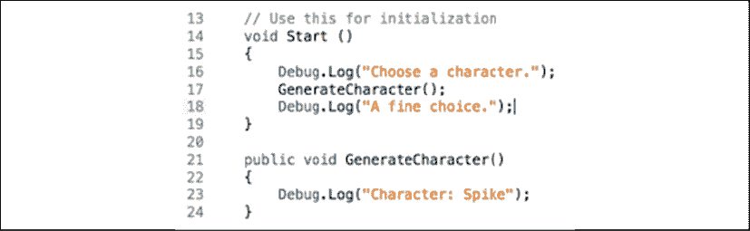

图 3.13：考虑调试日志的顺序

这些是发生的步骤：

1.  `选择一个字符`首先打印出来，因为它是最先的代码行。

1.  当调用`GenerateCharacter()`时，程序跳转到第 23 行，打印出`Character: Spike`，然后从第 17 行继续执行。

1.  `A fine choice`在所有`GenerateCharacter()`中的行执行完毕后最后打印出来。

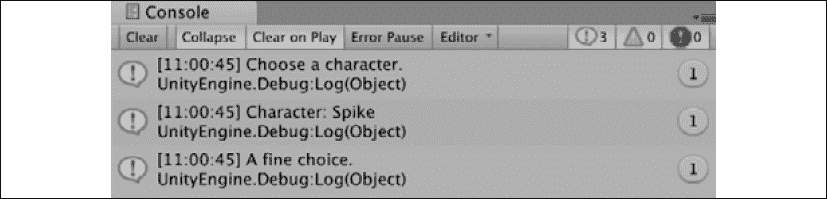

图 3.14：显示角色构建代码输出的控制台

现在，如果我们不能向方法中添加参数值，那么方法本身将不会在简单示例之外非常有用，这正是我们接下来要做的。

## 指定参数

很可能你的方法不会总是像 `GenerateCharacter()` 那么简单。为了传递更多信息，我们需要定义方法可以接受和处理参数。每个方法参数都是一个指令，并且需要有两个东西：

+   显式类型

+   唯一的名字

这听起来熟悉吗？方法参数本质上是被简化的变量声明，并执行相同的功能。每个参数就像一个局部变量，只能在它们特定的方法内部访问。

你可以定义任意数量的参数。无论是编写自定义方法还是使用内置方法，定义的参数就是方法执行指定任务所需的内容。

如果参数是方法可以接受的值的类型的蓝图，那么参数就是这些值本身。为了进一步解释，考虑以下内容：

+   传递给方法的参数需要与参数类型匹配，就像变量类型和它的值一样

+   参数可以是字面值（例如，数字 2）或类中其他地方声明的变量

参数名和参数名不需要匹配即可编译。

现在，让我们继续前进，添加一些方法参数，使 `GenerateCharacter()` 方法变得更加有趣。

让我们更新 `GenerateCharacter()` 方法，使其能够接受两个参数：

1.  添加两个方法参数：一个用于角色的 `string` 类型名称，另一个用于角色的 `int` 类型等级：

    ```cs
    public void GenerateCharacter(string name, int level) 
    ```

1.  更新 `Debug.Log()` 以使用这些新参数：

    ```cs
    Debug.LogFormat("Character: {0} - Level: {1}", name, level); 
    ```

1.  在 `Start()` 中更新 `GenerateCharacter()` 方法的调用，使用你的参数，这些参数可以是字面值或类中其他地方声明的变量：

    ```cs
    int CharacterLevel = 32;
    GenerateCharacter("Spike", CharacterLevel); 
    ```

    你的代码应该看起来像以下这样：

    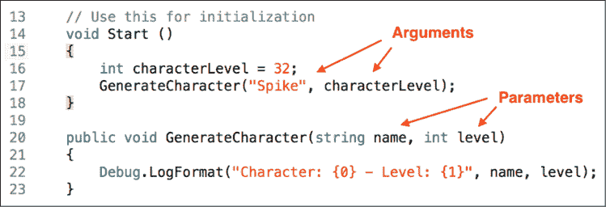

    图 3.15：更新 GenerateCharacter() 方法

在这里，我们定义了两个参数，`name`（字符串类型）和 `level`（整型），并在 `GenerateCharacter()` 方法内部使用它们，就像局部变量一样。当我们调用 `Start()` 方法内部的该方法时，我们为每个参数添加了相应的类型和参数值。在先前的屏幕截图中，你可以看到使用引号中的字面字符串值和使用 `characterLevel` 产生了相同的结果。

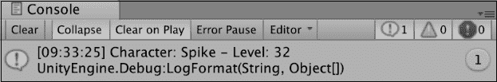

图 3.16：控制台显示方法参数的输出

在方法中进一步使用方法，你可能想知道我们如何从方法内部传递值并返回。这引出了我们下一个关于返回值的章节。

## 指定返回值

除了接受参数外，方法还可以返回任何 C# 类型的值。我们之前的所有示例都使用了 `void` 类型，它不返回任何内容，但能够编写指令并返回计算结果正是方法的优势所在。

根据我们的蓝图，方法返回类型在访问修饰符之后指定。除了类型之外，方法还需要包含 `return` 关键字，后面跟着返回值。返回值可以是变量、字面值，甚至是表达式，只要它与声明的返回类型匹配。

返回类型为 `void` 的方法仍然可以使用 `return` 关键字，而不需要分配任何值或表达式。一旦达到带有 `return` 关键字的行，方法将停止执行。这在需要避免某些行为或防止程序崩溃的情况下很有用。

接下来，向 `GenerateCharacter()` 添加返回类型，并学习如何将其捕获到变量中。让我们更新 `GenerateCharacter()` 方法，使其返回一个整数：

1.  将方法声明中的返回类型从 `void` 更改为 `int`，并使用 `return` 关键字将返回值设置为 `level += 5`：

    ```cs
    public **int** GenerateCharacter(string name, int level)
    {
            Debug.LogFormat("Character: {0} - Level: {1}", name, level);

            **return** **level +=** **5****;**
    } 
    ```

    `GenerateCharacter()` 现在将返回一个整数。这是通过将 `5` 添加到级别参数来计算的。我们没有指定如何或是否要使用这个返回值，这意味着现在脚本不会做任何新的操作。

现在，问题变成了：我们如何捕获和使用新添加的返回值？嗯，我们将在下一节中讨论这个话题。

## 使用返回值

当涉及到使用返回值时，有两种方法可供选择：

+   创建一个局部变量来捕获（存储）返回值。

+   将调用方法本身用作返回值的替身，就像使用变量一样使用它。调用方法是实际触发指令的实际代码行，在我们的例子中，将是 `GenerateCharacter("Spike", CharacterLevel)`。如果需要，你甚至可以将调用方法作为参数传递给另一个方法。

在大多数编程领域，首选第一种方法，因为它易于阅读。将方法调用作为变量随意使用会很快变得混乱，尤其是在我们将它们用作其他方法的参数时。

让我们在代码中尝试通过捕获和调试 `GenerateCharacter()` 返回的返回值来验证这一点。

我们将使用两种捕获和使用返回变量的方式，通过两个简单的调试日志：

1.  在 `Start` 方法中创建一个新的局部变量，类型为 `int`，名为 `NextSkillLevel`，并将其赋值给现有的 `GenerateCharacter()` 方法调用返回值：

    ```cs
    int NextSkillLevel = GenerateCharacter("Spike", CharacterLevel); 
    ```

1.  添加两个调试日志，第一个打印出 `NextSkillLevel`，第二个打印出你选择的参数值的新调用方法：

    ```cs
    Debug.Log(NextSkillLevel);
    Debug.Log(GenerateCharacter("Faye", CharacterLevel)); 
    ```

1.  使用两个反斜杠 (`//`) 注释掉 `GenerateCharacter()` 中的调试日志，以使控制台输出更简洁。你的代码应该看起来像以下这样：

    ```cs
    //  Start is called before the first frame update
    void Start()
    {
        int CharacterLevel = 32;
        int NextSkillLevel = GenerateCharacter("Spike", CharacterLevel);
        Debug.Log(NextSkillLevel);
        Debug.Log(GenerateCharacter("Faye", CharacterLevel));
    }
    public int GenerateCharacter(string name, int level)
    {
        // Debug.LogFormat("Character: {0} – Level: {1}", name, level);
        return level += 5;
    } 
    ```

1.  保存文件并在 Unity 中播放。对于编译器来说，`NextSkillLevel` 变量和 `GenerateCharacter()` 方法的调用者代表相同的信息，即一个整数，这就是为什么两个日志都显示了数字 `37`：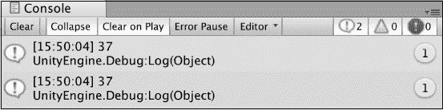

    图 3.17：角色生成代码的控制台输出

这需要吸收很多内容，尤其是考虑到具有参数和返回值的方法的指数级可能性。然而，在这里我们先放慢速度，考虑一下 Unity 中一些最常见的方法，以便我们能够稍微喘口气。

但首先，看看你是否能应对接下来的 *英雄试炼* 中的挑战！

### 英雄试炼 – 方法作为论据

如果您感到勇敢，为什么不尝试创建一个新的方法，该方法接受一个 `int` 参数，并将其简单地打印到控制台上？不需要返回类型。当您完成这个任务后，在 `Start` 中调用该方法，将其作为参数传递 `GenerateCharacter` 方法调用，并查看输出。

## 分析常见的 Unity 方法

我们现在可以现实地讨论任何新的 Unity C# 脚本附带的最常见的默认方法：`Start()` 和 `Update()`。与我们自己定义的方法不同，属于 `MonoBehaviour` 类的方法是由 Unity 引擎根据其各自的规则自动调用的。在大多数情况下，在脚本中至少有一个 `MonoBehaviour` 方法来启动您的代码是很重要的。

您可以在 [`docs.unity3d.com/ScriptReference/MonoBehaviour.html`](https://docs.unity3d.com/ScriptReference/MonoBehaviour.html) 找到所有可用的 MonoBehaviour 方法及其描述的完整列表。您还可以在 [`docs.unity3d.com/Manual/ExecutionOrder.html`](https://docs.unity3d.com/Manual/ExecutionOrder.html) 找到每个方法执行的顺序。

就像故事一样，从开始的地方开始总是个好主意。因此，我们自然应该查看每个 Unity 脚本的第一默认方法——`Start()`。

### Start 方法

Unity 在脚本首次启用时，会在第一帧调用 `Start()` 方法。由于 `MonoBehaviour` 脚本几乎总是附加到场景中的 *GameObjects* 上，因此当您按下播放时，它们附加的脚本会在加载时同时启用。在我们的项目中，`LearningCurve` 附加到 **主摄像机** *GameObject* 上，这意味着当主摄像机被加载到场景中时，它的 `Start()` 方法就会运行。`Start()` 主要用于设置变量或执行需要在 `Update()` 首次运行之前发生的逻辑。

我们到目前为止所做的工作示例都使用了 `Start()`，即使它们没有执行设置操作，这通常不是它的常规用法。然而，它只触发一次，这使得它成为在控制台上显示一次性信息的绝佳工具。

除了 `Start()` 之外，还有一个主要的 Unity 方法，您会默认遇到：`Update()`。在我们完成本章之前，让我们熟悉一下它在以下部分是如何工作的。

### Update 方法

如果你花足够的时间查看 Unity 脚本参考中的示例代码（[`docs.unity3d.com/ScriptReference/`](https://docs.unity3d.com/ScriptReference/))，你会注意到大部分代码都是使用 `Update()` 方法执行的。当你的游戏运行时，场景窗口每秒显示多次，这被称为帧率或 **每秒帧数**（**FPS**）。

在每个帧显示后，Unity 会调用 `Update()` 方法，这使得它成为你游戏中执行次数最多的方法之一。这使得它非常适合检测鼠标和键盘输入或运行游戏逻辑。

如果你想了解你机器上的 FPS 评分，在 Unity 中播放并点击 **游戏** 视图右上角的 **统计** 选项卡：

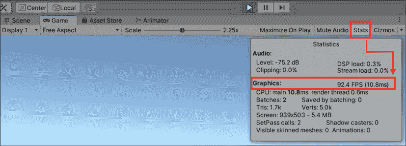

图 3.18：Unity 编辑器显示带有图形 FPS 计数的统计面板

你将在大部分初始的 C# 脚本中使用 `Start()` 和 `Update()` 方法，所以熟悉它们。话虽如此，你已经带着一袋 C# 编程最基础的构建块结束了这一章。

# 摘要

本章从编程的基本理论和其构建块快速下降到真实代码和 C# 语法层面。我们看到了代码格式的优劣，学习了如何在 Unity 控制台中调试信息，并创建了我们的第一个变量。

C# 类型、访问修饰符和变量作用域也紧随其后，因为我们开始在检查器窗口中处理成员变量，并开始探索方法和动作的领域。

方法帮助我们理解代码中的书面指令，但更重要的是，如何正确地利用它们的威力来实现有用的行为。输入参数、返回类型和方法签名都是重要的话题，但它们真正提供的礼物是执行新类型动作的潜力。

你现在已经拥有了编程的两个基本构建块；从现在开始，你几乎所做的一切都将是对这两个概念的扩展或应用。

在下一章中，我们将探讨 C# 类型的一个特殊子集，称为集合，它可以存储相关数据组，并学习如何编写基于决策的代码。

# 突击测验 - 变量和方法

1.  在 C# 中如何正确地编写变量名？

1.  你如何在 Unity 的检查器窗口中使变量可见？

1.  C# 中有四种访问修饰符可用吗？

1.  在什么情况下需要在类型之间进行显式转换？

1.  定义方法的最小要求是什么？

1.  方法名末尾的括号有什么作用？

1.  方法定义中 `void` 返回类型意味着什么？

1.  Unity 多频繁地调用 `Update()` 方法？

# 加入我们的 Discord！

与其他用户、Unity/C# 专家和哈里森·费罗尼一起阅读这本书。提问，为其他读者提供解决方案，通过 *Ask Me Anything* 会话与作者聊天等等。

立即加入！

[`packt.link/csharpunity2021`](https://packt.link/csharpunity2021)


