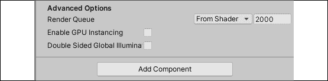

# 在 Unity 中亲自动手

创建一个游戏不仅仅是代码中模拟动作。设计、故事、环境、灯光和动画都在为玩家的舞台设置中扮演着重要角色。游戏首先是一种体验，仅靠代码是无法实现的。

Unity 在过去十年中将自己置于游戏开发的前沿，为程序员和非程序员 alike 提供了先进工具。动画和效果、音频、环境设计等等，都可以直接从 Unity 编辑器中获取，无需一行代码。我们将随着定义游戏的要求、环境和游戏机制来讨论这些主题。然而，首先，我们需要一个关于游戏设计的主题介绍。

游戏设计理论是一个庞大的研究领域，学习其所有秘密可能需要消耗整个职业生涯。然而，我们只会接触到基础部分；其余的一切都由你自己去探索！本章将为我们整本书的其余部分打下基础，并涵盖以下主题：

+   游戏设计入门

+   构建关卡

+   灯光基础

+   在 Unity 中动画制作

# 游戏设计入门

在开始任何游戏项目之前，有一个你想要构建的蓝图非常重要。有时，想法在你脑海中会非常清晰，但当你开始创建角色类别或环境时，事情似乎会偏离你的初衷。这就是游戏设计允许你规划以下触点的地方：

+   **概念**：游戏的大纲想法和设计，包括其类型和玩法风格。

+   **核心机制**：角色在游戏中可以采取的可玩功能或交互。常见的游戏机制包括跳跃、射击、解谜或驾驶。

+   **控制方案**：一张按钮和/或键的图，它赋予玩家控制其角色、环境交互和其他可执行动作的能力。

+   **故事**：推动游戏的潜在叙事，在玩家和他们在其中玩耍的游戏世界中建立同理心和联系。

+   **艺术风格**：游戏的整体外观和感觉，从角色和菜单艺术到关卡和环境都保持一致。

+   **胜负条件**：规定游戏如何获胜或失败的规定，通常包括具有潜在失败重量的目标或目标。

这些主题绝不是设计游戏所需内容的详尽列表。然而，它们是开始充实一个称为游戏设计文档的好地方，这是你的下一个任务！

## 游戏设计文档

在 Google 上搜索游戏设计文档会导致大量模板、格式规则和内容指南的涌现，这可能会让一个新程序员准备好放弃一切。事实是，设计文档是根据创建它们的团队或公司定制的，这使得它们比互联网上所认为的要容易起草得多。

通常，设计文档有三种类型，如下所示：

+   **游戏设计文档**（**GDD**）：GDD 包含了从游戏玩法到氛围、故事以及它试图创造的经验的所有内容。根据游戏的不同，这份文档可能只有几页，也可能有几百页。

+   **技术设计文档**（**TDD**）：这份文档侧重于游戏的所有技术方面，从它将运行的硬件到类和程序架构的构建方式。就像游戏设计文档（GDD）一样，其长度将根据项目而变化。

+   **单页文档**：通常用于市场营销或推广场合，单页文档本质上是你游戏的快照。正如其名所示，它应该只占用一页纸。

格式化 GDD 没有正确或错误的方式，所以这是一个让你发挥创造力的好地方。加入一些激发你灵感的参考资料图片；在布局上发挥创意——这是你定义愿景的地方。

我们将在本书的剩余部分工作的游戏相对简单，不需要像 GDD 或 TDD 那样详细。相反，我们将创建一个单页文档来跟踪我们的项目目标和一些背景信息。

## 《英雄降生》的单页文档

为了确保我们继续沿着正确的轨道前进，我已经准备了一份简单的文档，概述了游戏原型的基本内容。在继续阅读之前，请仔细阅读，并尝试想象一下我们迄今为止所学的一些编程概念是如何被应用到实践中的：


图 6.1：《英雄降生》单页文档

现在你已经对我们的游戏框架有了高层次的认识，你就可以开始构建一个原型关卡来容纳游戏体验了。

# 构建关卡

在构建你的游戏关卡时，尝试从玩家的角度看待事物总是一个好主意。你希望他们如何看待环境，如何与之互动，以及在其中行走时的感受？你实际上正在构建游戏存在的世界，所以要保持一致性。

使用 Unity，你可以选择使用地形工具创建户外环境，用基本的形状和几何形状勾勒出室内场景，或者两者的混合。你甚至可以从 Blender 等其他程序导入 3D 模型，用作场景中的对象。

Unity 在 [`docs.unity3d.com/Manual/script-Terrain.html`](https://docs.unity3d.com/Manual/script-Terrain.html) 提供了关于地形工具的优秀介绍。如果你选择这条路线，Unity 资产商店中还有一个名为 Terrain Toolkit 2017 的免费资源，可在 [`assetstore.unity.com/packages/tools/terrain/terrain-toolkit-2017-83490`](https://assetstore.unity.com/packages/tools/terrain/terrain-toolkit-2017-83490) 找到。你还可以使用 Blender 等工具创建游戏资源，这些资源可以在 [`www.blender.org/features/modeling/`](https://www.blender.org/features/modeling/) 找到。

对于*英雄降生*，我们将坚持使用简单的室内竞技场式设置，易于四处走动，但有几个角落可以藏身。你将使用**原语**——Unity 中提供的基对象形状——将这些拼凑在一起，因为它们在场景中创建、缩放和定位非常容易。

## 创建原语

看看你可能经常玩的游戏，你可能会想知道你将如何创建看起来如此逼真的模型和对象，以至于你似乎可以穿过屏幕抓住它们。幸运的是，Unity 提供了一套你可以从中选择的原始 GameObject 来快速原型设计。这些可能不会非常复杂或高分辨率，但当你学习如何操作或你的开发团队没有 3D 艺术家时，它们是救命稻草。

如果你打开 Unity，你可以进入**层次**面板，点击**+** | **3D 对象**，你会看到所有可用的选项，但其中只有大约一半是原语或常见形状，如下面的截图所示，用红色突出显示：


图 6.2：Unity 层次窗口，已选择创建选项

其他 3D 对象选项，如**地形**、**风区**和**树**，对于我们需要的来说有点过于高级，但如果你感兴趣，可以随意尝试。

你可以在[`docs.unity3d.com/Manual/CreatingEnvironments.html`](https://docs.unity3d.com/Manual/CreatingEnvironments.html)了解更多关于构建 Unity 环境的信息。

在我们跳得太远之前，当你脚下有地板时，通常更容易四处走动，所以让我们首先使用以下步骤为我们的竞技场创建一个地面平面：

1.  在**层次**面板中，点击**+** | **3D 对象** | **平面**

1.  确保在**层次**选项卡中选中新对象，在**检查器**选项卡中将 GameObject 重命名为`Ground`

1.  在**变换**下拉菜单中，将**缩放**在**X**、**Y**和**Z**轴上的值更改为`3`:

    图 6.3：Unity 编辑器，带有地面平面

1.  如果你的场景中的光照看起来比前面的截图暗或不同，请在**层次**面板中选择**方向光**，并将**方向光**组件的**强度**值设置为 1:

图 6.4：在检查器面板中选中的方向光对象

我们创建了一个平面 GameObject，并将其大小增加以为未来的角色提供更多行走空间。这个平面将像受现实生活物理约束的 3D 对象一样起作用，这意味着其他对象不能随意穿过。我们将在*第七章*、*移动、相机控制和碰撞*中更多地讨论 Unity 物理系统及其工作原理。现在，我们需要开始考虑 3D。

## 3D 思考

现在我们已经在场景中有了第一个对象，我们可以谈论三维空间了——具体来说，是对象在三维空间中的位置、旋转和缩放行为。如果你回想起高中几何学，一个带有 *x* 和 *y* 坐标系的图表应该是熟悉的。要在图表上放置一个点，你需要一个 *x* 值和一个 *y* 值。

Unity 支持二维和三维游戏开发，如果我们正在制作二维游戏，我们可以在那里结束解释。然而，当在 Unity 编辑器中处理三维空间时，我们有一个额外的轴，称为 *z* 轴。*z* 轴映射深度或透视，为我们的空间以及其中的对象赋予三维质感。

这可能一开始会让人感到困惑，但 Unity 有一些不错的视觉辅助工具来帮助你理清思路。在 **Scene** 面板的右上角，你会看到一个几何形状的图标，上面用红色、绿色和蓝色分别标记了 *x*、*y* 和 *z* 轴。当在 **Hierarchy** 窗口中选中场景中的所有 GameObject 时，它们都会显示其轴箭头：


图 6.5：突出显示方向辅助工具的场景视图

这将始终显示场景的当前方向以及放置其中的对象。点击这些彩色轴中的任意一个，将切换场景方向到所选轴。自己试一试，以熟悉切换视角。

如果你查看 **Inspector** 窗格中 **Ground** 对象的 **Transform** 组件，你会看到位置、旋转和缩放都是由这三个轴决定的。

位置确定对象在场景中的位置，旋转控制其角度，缩放负责其大小。这些值可以在 **Inspector** 窗格或 C# 脚本中随时更改：


图 6.6：在 Hierarchy 中选中的地面对象

目前，地面看起来有点无聊。让我们用材质来改变一下。

## 材质

我们的地平面现在并不很有趣，但我们可以使用 **材质** 为这个关卡注入一点生命力。材质控制 GameObject 在场景中的渲染方式，这由材质的 Shader 决定。将 **Shader** 想象为负责将光照和纹理数据组合成材质外观的表示。

每个 GameObject 都有一个默认的 **Material** 和 **Shader**（如图所示来自 **Inspector** 窗格），将其颜色设置为标准白色：


图 6.7：对象上的默认材质

要改变一个物体的颜色，我们需要创建一个材质并将其拖动到我们想要修改的物体上。记住，在 Unity 中，一切都是对象——材质也不例外。材质可以在所需的任何 GameObject 上重复使用，但任何对材质的更改也会影响到任何附着该材质的物体。如果我们场景中有几个带有将它们全部设置为红色的材质的敌人对象，并且我们将该基本材质颜色更改为蓝色，那么所有敌人都会变成蓝色。

蓝色引人注目；让我们将地面平面的颜色改为与之匹配，并创建一个新的材质，将地面平面从单调的白色变为深邃且鲜艳的蓝色：

1.  在**项目**面板中创建一个新的文件夹，并将其命名为`Materials`。

1.  在**材质**文件夹中，右键单击**+** | **材质**，并将其命名为`Ground_Mat`。

1.  点击**Albedo**属性旁边的颜色框，从弹出的颜色选择器窗口中选择你的颜色，然后关闭它。

1.  从**项目**面板中拖动`Ground_Mat`对象，并将其拖放到**层次**面板中的`Ground`GameObject 上：![img/B17573_06_08.png]

图 6.8：材质颜色选择器

你创建的新材质现在是一个项目资产。将`Ground_Mat`拖放到`Ground`GameObject 中会改变平面的颜色，这意味着对`Ground_Mat`的任何更改都会反映在`Ground`上：

![img/B17573_06_09.png]

图 6.9：更新了颜色材质的地面平面

地面是我们的画布；然而，在 3D 空间中，它可以在其表面上支持其他 3D 对象。将取决于你，用有趣和有趣的障碍物填充它，为你的未来玩家。

## 白盒设计

白盒设计是使用占位符布局想法的设计术语，通常目的是在稍后用成品资产替换它们。在关卡设计中，白盒设计的实践是用原始 GameObject 填充环境，以获得你想要的外观的感觉。这是一个很好的开始方式，尤其是在你游戏的原型设计阶段。

在深入 Unity 之前，我想先画一个简单的草图，展示我关卡的基本布局和位置。这给我们提供了一些方向，并有助于更快地布置我们的环境。

在下面的图中，你将能够看到我心中的竞技场，中间有一个可以通过斜坡进入的平台，每个角落都配有小型炮塔：

![img/B17573_06_10.png]

图 6.10：英雄诞生关卡竞技场草图

不要担心你不是艺术家——我也不是。重要的是将你的想法落实到纸上，以巩固你的想法，并在 Unity 忙碌之前解决任何问题。

在你全力以赴将这个草图投入生产之前，你需要熟悉一些 Unity 编辑器快捷键，以使白盒设计更容易。

### 编辑器工具

当我们在 *第一章*，*了解您的环境* 中讨论 Unity 界面时，我们简要地介绍了工具栏的一些功能，我们需要重新审视这些功能，以便我们知道如何高效地操作 GameObject。您可以在 Unity 编辑器的左上角找到这些功能：


图 6.11：Unity 编辑器工具栏

让我们分析一下前一个截图中的工具栏中可用的不同工具：

1.  **手**：这允许您通过点击和拖动鼠标在场景中平移并改变您的位置。

1.  **移动**：这允许您通过拖动相应的箭头将对象沿 *x*、*y* 和 *z* 轴移动。

1.  **旋转**：这允许您通过旋转或拖动相应的标记来调整对象的旋转。

1.  **缩放**：这允许您通过将其拖动到特定轴来修改对象的缩放。

1.  **矩形变换**：这把移动、旋转和缩放工具功能结合到一个包中。

1.  **变换**：这使您能够一次性访问对象的位置、旋转和缩放。

1.  **自定义编辑器工具**：这允许您访问为编辑器构建的任何自定义工具。不用担心这一点，因为它超出了我们的范围。如果您想了解更多信息，请参阅[`docs.unity3d.com/2020.1/Documentation/ScriptReference/EditorTools.EditorTool.html`](https://docs.unity3d.com/2020.1/Documentation/ScriptReference/EditorTools.EditorTool.html)中的文档。

您可以在[`docs.unity3d.com/Manual/PositioningGameObjects.html`](https://docs.unity3d.com/Manual/PositioningGameObjects.html)中找到有关在 **场景** 面板中导航和定位 GameObject 的更多信息。还值得注意的是，您可以使用我们之前在章节中讨论的 **Transform** 组件来移动、定位和缩放对象。

平移和导航场景可以使用类似工具完成，尽管不是直接从 Unity 编辑器本身进行：

+   要环顾四周，请按住鼠标右键并拖动以在相机周围平移。

+   在使用相机移动时，请继续按住鼠标右键，并使用 *W*、*A*、*S* 和 *D* 键分别向前、向后、向左和向右移动。

+   按下 *F* 键可以放大并聚焦于在 **层次** 面板中选定的 GameObject。

这种场景导航通常被称为飞行模式，所以当我要您聚焦或导航到特定的对象或视点时，请使用这些功能的组合。

在某些时候，在场景视图中移动本身可能是一项任务，但所有这些都归结为反复练习。有关场景导航功能的更详细列表，请访问[`docs.unity3d.com/Manual/SceneViewNavigation.html`](https://docs.unity3d.com/Manual/SceneViewNavigation.html)。

尽管地面平面不会让我们的角色穿过它，但我们现在可以走下边缘。您的任务是围住竞技场，以便玩家有一个受限的移动区域。

### 英雄的考验——安装干墙

使用原始立方体和工具栏，使用**移动**、**旋转**和**缩放**工具在水平面周围放置四面墙，以划分主要竞技场：

1.  在**层次结构**面板中，选择**+** | **3D 对象** | **立方体**来创建第一个墙并命名为`Wall_01`。

1.  将其缩放值设置为 30（x 轴），1.5（y 轴）和 0.2（z 轴）。

    注意，平面在比对象大 10 倍的比例下操作——因此，长度为 3 的平面与长度为 30 的对象长度相同。

1.  在**层次结构**面板中选择`Wall_01`对象，切换到左上角的位置工具，并使用红色、绿色和蓝色箭头将墙放置在地平面边缘。

1.  重复*步骤 1-3*，直到你周围有四面墙：

    图 6.12：带有四面墙和地面平面的水平面竞技场

从本章开始，我将给出一些关于墙位置、旋转和缩放的基本值，但请随意发挥创意。我希望你通过实验 Unity 编辑器工具来更快地熟悉它们。

这只是一点建设性的工作，但竞技场开始成形了！在我们继续添加障碍物和平台之前，你想要养成清理对象层次结构的习惯。我们将在下一节中讨论这是如何工作的。

### 保持层次结构整洁

通常，我会在章节末尾添加这样的建议，但确保你的项目层次结构尽可能有序非常重要，因此需要单独的小节。理想情况下，你希望所有相关的 GameObject 都位于一个**父对象**下。目前，这并不构成风险，因为我们场景中只有几个对象；然而，当在一个大型项目中达到数百个对象时，你将会感到困难。

保持层次结构整洁的最简单方法是存储相关对象在父对象中，就像你在桌面上的文件夹中存储文件一样。我们的水平面有几个对象需要组织，Unity 通过允许我们创建空 GameObject 来简化这一点。空对象是一个完美的容器（或文件夹），用于存放相关的对象组，因为它没有附带任何组件——它只是一个外壳。

让我们把地面平面和四面墙组合成一个共同的空 GameObject：

1.  在**层次结构**面板中选择**+** | **创建空对象**并命名新对象为`Environment`

1.  将地面平面和四面墙拖放到**环境**中，使它们成为子对象

1.  选择**环境**空对象，并确保其**X**、**Y**和**Z**位置都设置为 0！

图 6.13：显示空 GameObject 父对象的层次结构面板

环境作为父对象存在于**层次结构**标签中，竞技场对象作为其子对象。现在我们可以通过箭头图标展开或关闭**环境**对象下拉列表，使**层次结构**面板不那么杂乱。

将**环境**对象的**X**、**Y**和**Z**位置设置为 0 很重要，因为子对象的位置现在是相对于父位置。这引出了一个有趣的问题：我们设置的这些位置、旋转和缩放的原点是什么？答案是，它们取决于我们使用的相对空间，在 Unity 中，这要么是**世界**空间，要么是**本地**空间：

+   **世界空间**使用场景中的一个固定原点作为所有 GameObject 的常量参考。在 Unity 中，这个原点是(0, 0, 0)，或者*x*、*y*和*z*轴上的 0。

+   **本地空间**使用对象的父`Transform`组件作为其原点，本质上改变了场景的视角。Unity 也将这个本地原点设置为(0, 0, 0)。将父变换视为宇宙的中心，其他所有东西都相对于它旋转。

这两种方向在不同的场景中都很有用，但现在是时候在这里重置它们，让每个人都站在同一起跑线上。

### 与预制体一起工作

预制体是你在 Unity 中遇到的最强大的组件之一。它们不仅在关卡构建中很有用，在脚本编写中也很实用。将预制体想象成可以保存并重复使用，且每个子对象、组件、C#脚本和属性设置都完整的 GameObject。一旦创建，预制体就像是一个类蓝图；场景中使用的每个副本都是该预制体的一个单独实例。因此，对基础预制体的任何更改也将更改场景中所有活动的实例。

这个竞技场看起来有点太简单，完全开放，因此是测试创建和编辑预制体的完美场所。由于我们想在竞技场的每个角落放置四个相同的炮塔，它们是预制体的完美案例，我们可以通过以下步骤创建：

再次强调，我没有包括任何精确的障碍物位置、旋转或缩放值，因为我想让你亲自熟悉 Unity 编辑器的工具。

从现在开始，当你面前有一个不包含具体位置、旋转或缩放值的任务时，我期望你通过实践来学习。

1.  在**环境**父对象内部创建一个空白的父对象，通过选择**+** | **创建空对象**并命名为`Barrier_01`。

1.  通过选择**+** | **3D 对象** | **立方体**创建两个立方体，并将它们定位和缩放成一个 V 形底座。

1.  创建两个额外的立方体原形，并将它们放置在炮塔底座的末端！

    图 6.14：由立方体组成的炮塔截图

1.  在**资产**下的**项目**面板中创建一个新的文件夹，并将其命名为`预制件`。然后，将**层次**面板中的**Barrier_01**GameObject 拖动到项目视图中的**预制件**文件夹中：

图 6.15：预制件文件夹中的障碍物预制件

**Barrier_01**及其所有子对象现在都是预制件，这意味着我们可以通过从`预制件`文件夹拖动副本或复制场景中的副本来重用它。**Barrier_01**在**层次**选项卡中变为蓝色，以表示其状态变化，并在其名称下方**检查器**选项卡中添加了一行预制件功能按钮：


图 6.16：在检查器面板中突出显示的**Barrier_01**预制件

对原始预制件对象**Barrier_01**的任何编辑现在都将影响场景中的任何副本。由于我们需要第五个立方体来完成障碍物，让我们更新并保存预制件以查看此操作。

现在我们的炮塔中间有一个巨大的缺口，这不利于覆盖我们的角色，所以让我们通过添加另一个立方体并应用更改来更新**Barrier_01**预制件：

1.  创建一个**立方体**原体并将其放置在炮塔底部的交点处。

1.  新的**立方体**原体会以灰色显示，并在其名称旁边有一个小的**+**图标，在**层次**选项卡中。这意味着它还不是预制件的一部分！

    图 6.17：在层次窗口中标记的新预制件更新

1.  在**层次**面板中的新立方体原体上右键单击，并选择**添加** **GameObject** | **应用到预制件'Barrier_01'**：

图 6.18：将预制件更改应用到基础预制件的选择

**Barrier_01**预制件现在已更新以包含新的立方体，整个预制件层次结构应再次变为蓝色。您现在有一个看起来像前面的截图或如果您愿意，更有创意的炮塔预制件。然而，我们希望它们位于竞技场的每个角落。这将由您来添加它们！

现在我们已经得到了一个可重用的障碍物预制件，让我们构建剩余的水平，以匹配本节开头我们拥有的粗略草图：

1.  将**Barrier_01**预制件复制三次，并将每个副本放置在竞技场的不同角落。您可以通过从**预制件**文件夹拖动多个**Barrier_01**对象到场景中，或在**层次**中的**Barrier_01**上右键单击并选择复制来完成此操作。

1.  在**环境**父对象内部创建一个新的空 GameObject，并将其命名为`Raised_Platform`。

1.  创建一个**立方体**并将其缩放成如图 6.19 所示的平台。

1.  创建一个**平面**并将其缩放成斜坡：

    +   提示：围绕*x*或*y*轴旋转平面以创建斜面。

    +   然后，将其定位以便连接平台和地面

1.  在 Mac 上使用`Cmd` + `D`或在 Windows 上使用`Ctrl` + `D`复制斜面对象。然后，重复旋转和定位步骤。

1.  重复之前的步骤两次，直到您有四个总共通向平台的斜坡：

图 6.19：提升平台父 GameObject

您现在已经成功地白盒化（即完全了解）了您的第一个游戏关卡！不过，现在不要过于沉迷其中，我们只是刚刚开始。所有好的游戏都有玩家可以拾取或与之交互的物品。在接下来的挑战中，您的任务是创建一个健康物品并将其制作成 Prefab。

#### 英雄的考验——创建健康拾取

将本章到目前为止所学的所有内容整合起来可能需要您几分钟的时间，但这绝对是值得的。按照以下步骤创建拾取物品：

1.  通过选择 **+** | **3D Object** | **Capsule** 创建一个 **Capsule** GameObject，并将其命名为 `Health_Pickup`。

1.  将比例设置为 0.3，对于*x*、*y*和*z*轴，然后切换到 **Move** 工具并将其放置在您的障碍物附近。

1.  为 **Health_Pickup** 对象创建并附加一个新的黄色 **Material**。

1.  将 **Health_Pickup** 对象从 **Hierarchy** 面板拖动到 **Prefab** 文件夹中。

参考以下截图，了解最终产品应该看起来像什么：


图 6.20：场景中的拾取物品和障碍物 Prefab

到此为止，我们关于关卡设计和布局的工作就告一段落了。接下来，您将接受 Unity 中光照的快速课程，我们将在本章的后面学习如何对物品进行动画处理。

# 照明基础

Unity 中的照明是一个广泛的话题，但可以归结为两类：实时和预计算。这两种类型的灯光都会考虑诸如光线的颜色和强度以及它在场景中的方向等属性，所有这些都可以在 **Inspector** 面板中进行配置。区别在于 Unity 引擎如何计算灯光的行为。

*实时光照* 每帧都会进行计算，这意味着任何在其路径上的对象都会投射出逼真的阴影，并且通常表现得像现实世界中的光源。然而，这可能会显著减慢您的游戏速度，并消耗指数级数量的计算能力，具体取决于场景中灯光的数量。另一方面，*预计算光照* 将场景的光照存储在一个称为 **lightmap** 的纹理中，然后将其应用到场景中，或者烘焙到场景中。虽然这可以节省计算能力，但烘焙光照是静态的。这意味着它不会在场景中的物体移动时做出真实的反应或改变。

还有一种混合类型的照明称为预计算实时全局照明，它弥合了实时和预计算过程之间的差距。这是一个 Unity 特定的高级主题，所以我们不会在本书中介绍它，但您可以自由地查看[`docs.unity3d.com/Manual/GIIntro.html`](https://docs.unity3d.com/Manual/GIIntro.html)上的文档。

现在我们来看看如何在 Unity 场景本身中创建灯光对象。

## 创建灯光

默认情况下，每个场景都附带一个方向光组件，作为主要照明源，但灯光可以在层次结构中创建，就像任何其他 GameObject 一样。尽管控制光源的想法可能对你来说很新，但它们是 Unity 中的对象，这意味着它们可以被定位、缩放和旋转以适应你的需求：


图 6.21：照明创建菜单选项

让我们看看一些实时灯光对象及其性能的示例：

+   **方向光**非常适合模拟自然光，如阳光。它们在场景中没有实际的位置，但光线击中一切，就像它们始终指向同一方向一样。

+   **点光源**基本上是漂浮的球体，从中心点向所有方向发射光线。这些在场景中具有定义的位置和强度。

+   **聚光灯**向特定方向发射光线，但它们被角度锁定，并聚焦于场景的特定区域。将这些想象成现实世界中的聚光灯或泛光灯。

+   **面光源**的形状像矩形，从矩形的单侧表面发出光线。

    **反射探针**和**光照探针组**对于《英雄降世》来说超出了我们的需求；然而，如果你感兴趣，可以在[`docs.unity3d.com/Manual/ReflectionProbes.html`](https://docs.unity3d.com/Manual/ReflectionProbes.html)和[`docs.unity3d.com/Manual/LightProbes.html`](https://docs.unity3d.com/Manual/LightProbes.html)了解更多信息。

与 Unity 中的所有 GameObject 一样，灯光具有可调整的属性，可以用来为场景提供特定的氛围或主题。

## 灯光组件属性

以下截图显示了场景中方向光上的 **灯光** 组件。所有这些属性都可以配置以创建沉浸式环境，但我们需要了解的基本属性是 **颜色**、**模式**和**强度**。这些属性决定了光的色调、实时或计算效果以及一般强度：


图 6.22：检查器窗口中的光线组件

与其他 Unity 组件一样，这些属性可以通过脚本和 `Light` 类来访问，该类可以在[`docs.unity3d.com/ScriptReference/Light.html`](https://docs.unity3d.com/ScriptReference/Light.html)找到。

通过选择 **+** | **灯光** | **点光源** 来亲自尝试，看看它如何影响区域照明。在调整设置后，通过在 **层次** 面板中右键单击点光源并选择 **删除** 来删除点光源。

现在我们对在游戏场景中照明所涉及的内容有了更多的了解，让我们将注意力转向添加一些动画！

# 在 Unity 中进行动画制作

在 Unity 中对对象进行动画制作可以从简单的旋转效果到复杂的角色动作和动作。你可以通过代码或使用动画和动画师窗口来创建动画：

+   **动画**窗口是创建和管理动画片段（称为剪辑）的地方，这些片段通过时间轴进行。对象属性沿着这个时间轴记录，然后播放以创建动画效果。

+   **动画控制器**窗口使用称为动画控制器的对象来管理这些剪辑及其过渡。

你可以在[`docs.unity3d.com/Manual/AnimatorControllers.html`](https://docs.unity3d.com/Manual/AnimatorControllers.html)找到有关动画控制器窗口及其控制器的更多信息。

在剪辑中创建和操作目标对象将使你的游戏迅速移动。对于我们简短的 Unity 动画之旅，我们将通过代码和动画控制器创建相同的旋转效果。

## 在代码中创建动画

首先，我们将通过代码创建一个旋转我们的健康物品拾取的动画。由于所有 GameObject 都有`Transform`组件，我们可以获取我们的物品的`Transform`组件并无限旋转它。

要在代码中创建动画，你需要执行以下步骤：

1.  在`Scripts`文件夹中创建一个新的脚本，命名为`ItemRotation`，并在 Visual Studio Code 中打开它。

1.  在新脚本顶部和类内部，添加一个名为`RotationSpeed`的`int`变量，其值为`100`，以及一个名为`ItemTransform`的`Transform`变量：

    ```cs
    public int RotationSpeed = 100;
    Transform ItemTransform; 
    ```

1.  在`Start()`方法体内部，获取 GameObject 的`Transform`组件并将其分配给`ItemTransform`：

    ```cs
    ItemTransform = this.GetComponent<Transform>(); 
    ```

1.  在`Update()`方法体内部，调用`ItemTransform.Rotate`。这个`Transform`类方法接受三个轴，一个用于你想要执行的*x*、*y*和*z*旋转。由于我们想要物品端到端旋转，我们将使用*x*轴并将其他设置为`0`：

    ```cs
    ItemTransform.Rotate(RotationSpeed * Time.deltaTime, 0, 0); 
    ```

    你会注意到我们正在将`RotationSpeed`乘以一个称为`Time.deltaTime`的东西。这是在 Unity 中标准化运动效果的标准方式，无论玩家的电脑运行得多快或多慢，它们看起来都很平滑。一般来说，你应该始终将你的移动或旋转速度乘以`Time.deltaTime`。

1.  回到 Unity 中，在**项目**面板中选择`Prefabs`文件夹中的`Health_Pickup`对象，并滚动到**检查器**窗口的底部。点击**添加组件**，搜索`ItemRotation`脚本，然后按`Enter`键：

    图 6.23：检查器面板中的“添加组件”按钮

1.  现在我们已经更新了 Prefab，移动**主相机**以便可以看到`Health_Pickup`对象，并点击播放：

图 6.24：聚焦于健康物品的相机截图

如你所见，健康拾取现在在其*x*轴上以连续和平滑的动画旋转！现在你已经通过代码动画化了物品，我们将使用 Unity 内置的动画系统复制我们的动画。

## 在 Unity 动画窗口中创建动画

任何你想应用动画片段的游戏对象都需要附加到一个设置了**动画控制器**的 Animator 组件上。如果在创建新片段时项目中没有控制器，Unity 将创建一个并将其保存在项目面板中，你可以使用它来管理你的片段。你的下一个挑战是为拾取物品创建一个新的动画片段。

我们将通过创建一个新的动画片段来开始动画`Health_Pickup`预制件，该片段将以无限循环的方式旋转对象。要创建一个新的动画片段，我们需要执行以下步骤：

1.  导航到**窗口** | **动画** | **动画**以打开**动画**面板，并将**动画**标签拖放到**控制台**旁边。

1.  确保在**层次结构**中选择了`Health_Pickup`物品，然后在**动画**面板中的**创建**上点击:

    图 6.25：Unity 动画窗口截图

1.  从以下下拉列表中创建一个新的文件夹，命名为`Animations`，然后命名新的片段为`Pickup_Spin`:

    图 6.26：创建新动画窗口截图

1.  确保新片段显示在**动画**面板中:

    图 6.27：选择动画窗口截图

1.  由于我们没有**Animator**控制器，Unity 在`Animation`文件夹中为我们创建了一个名为**Health_Pickup**的控制器。选择**Health_Pickup**后，注意在**检查器**面板中，当我们创建片段时，一个**Animator**组件也被添加到了预制件中，但尚未使用**Health_Pickup**控制器正式保存到预制件中。

1.  注意到**+**图标显示在**Animator**组件的左上角，这意味着它尚未成为**Health_Pickup**预制件的一部分:

    图 6.28：检查器面板中的 Animator 组件

1.  在右上角选择三个垂直点图标，然后选择**添加组件** | **应用到预制件 'Health_Pickup'**:

    图 6.29：将新组件应用到预制件的截图

现在你已经为**Health_Pickup**预制件创建并添加了 Animator 组件，是时候开始记录一些动画帧了。当你想到运动片段，就像在电影中一样，你可能想到帧。当片段通过其帧时，动画会前进，产生运动效果。在 Unity 中也是如此；我们需要在不同的帧中记录目标对象的不同位置，以便 Unity 可以播放片段。

## 记录关键帧

现在我们有了可以工作的剪辑，你会在**动画**窗口中看到一个空白的时间轴。基本上，当我们修改**Health_Pickup**预制件的**z**旋转或任何其他可以动画化的属性时，时间轴会记录这些更改作为关键帧。然后 Unity 将这些关键帧组装成完整的动画，类似于模拟电影上的单个帧一起播放成动态画面。

看看下面的截图，记住记录按钮和时间轴的位置：


图 6.30：动画窗口和关键帧时间轴的截图

现在，让我们让我们的物品开始旋转。对于旋转动画，我们希望**Health_Pickup**预制件每秒在其**z**轴上完成 360 度的完整旋转，这可以通过设置三个关键帧并让 Unity 处理其余部分来实现：

1.  在**层次**窗口中选择**Health_Pickup**对象，选择**添加属性** | **变换**，然后点击**旋转**旁边的**+**符号：

    图 6.31：为动画添加变换属性的截图

1.  点击记录按钮开始动画：

    +   将光标放在时间轴的**0:00**处，但保持**Health_Pickup**预制件的**z**旋转为 0

    +   将光标放在时间轴的**0:30**处，并将**z**旋转设置为**180**

    +   将光标放在时间轴的**1:00**处，并将**z**旋转设置为**360**！img/B17573_06_32.png

    图 6.32：记录动画关键帧的截图

1.  点击记录按钮完成动画

1.  点击记录按钮右侧的播放按钮以查看动画循环

你会注意到我们的**Animator**动画覆盖了之前在代码中编写的动画。不用担心，这是预期行为。你可以点击**检查器**面板中任何组件右侧的小复选框来激活或停用它。如果你停用**Animator**组件，**Health_Pickup**将再次使用我们的代码绕**x**轴旋转。

**Health_Pickup**对象现在每秒在 0、180 和 360 度之间沿**z**轴旋转，创建循环旋转动画。如果你现在玩游戏，动画将无限期运行，直到游戏停止：


图 6.33：动画窗口中播放的动画截图

所有动画都有曲线，它们决定了动画执行的具体属性。我们不会对这些做太多，但了解基础知识很重要。我们将在下一节中详细介绍。

## 曲线和切线

除了动画化对象属性外，Unity 还允许我们管理动画随时间播放的方式，使用动画曲线。到目前为止，我们一直处于**Dopesheet**模式，你可以在动画窗口底部更改它。如果你点击**曲线**视图（以下截图所示），你会看到一个不同的图表，其中用突出点代替了我们记录的关键帧。

我们希望旋转动画是平滑的——我们称之为线性的——所以我们将保持一切不变。然而，加快、减慢或在其运行过程中的任何点改变动画可以通过拖动或调整曲线图上的点在任何方向上完成：


图 6.34：动画窗口中曲线时间线的截图

使用动画曲线处理属性随时间的变化，我们仍然需要一种方法来解决每次**Health_Pickup**动画重复时出现的卡顿。为此，我们需要更改动画的切线，它管理关键帧如何从一个融合到另一个。

这些选项可以通过在**Dopesheet**模式下的时间线上右键单击任何关键帧来访问，这里可以看到：


图 6.35：关键帧平滑选项的截图

曲线和切线都是中级/高级的，所以我们不会深入探讨它们。如果你感兴趣，可以查看有关动画曲线和切线选项的文档，请访问[`docs.unity3d.com/Manual/animeditor-AnimationCurves.html`](https://docs.unity3d.com/Manual/animeditor-AnimationCurves.html)。

如果你现在播放旋转动画，当项目完成整个旋转并开始新的旋转时，会有轻微的暂停。你的任务是使其平滑，这是下一个挑战的主题。

让我们调整动画的第一帧和最后一帧的切线，以便旋转动画在重复时能够无缝融合：

1.  在动画时间线上右键单击第一个和最后一个关键帧的菱形图标，并选择**自动**：

    图 6.36：更改关键帧平滑选项

1.  如果你还没有这样做，请移动**主摄像机**以便可以看到`Health_Pickup`对象，并点击播放：

图 6.37：最终平滑动画的截图

将第一个和最后一个关键帧的切线设置为**自动**告诉 Unity 使它们的过渡平滑，这消除了动画循环时的突然停止/开始运动。

这本书所需的动画就这些了，但我鼓励你们去查看 Unity 在这一领域提供的完整工具箱。你们的游戏将更加吸引人，玩家们也会感谢你们！

# 摘要

我们已经到达了这一章节的结尾，这一章节包含了很多动态部分，特别是对于那些刚开始接触 Unity 的你们来说可能很多。

尽管这本书专注于 C#语言及其在 Unity 中的实现，我们仍然需要花时间了解游戏开发、文档和引擎的非脚本功能。虽然我们没有时间深入探讨光照和动画，但如果你们打算继续创建 Unity 项目，了解它们是值得的。

在下一章中，我们将把重点转回编程 *Hero Born* 的核心机制，从设置可移动玩家对象、控制摄像头以及理解 Unity 的物理系统如何管理游戏世界开始。

# 突击测验 - 基础 Unity 功能

1.  立方体、胶囊和球体是哪种 GameObject 的例子？

1.  Unity 使用哪个轴来表示深度，从而给场景带来 3D 外观？

1.  你如何将一个 GameObject 转换为可重用的 Prefab？

1.  Unity 动画系统使用哪种度量单位来记录对象动画？

# 在 Discord 上加入我们！

与其他用户、Unity/C# 专家和哈里森·费罗内一起阅读这本书。提问，为其他读者提供解决方案，通过 *Ask Me Anything 会话* 与作者聊天等等。

立即加入！

[`packt.link/csharpunity2021`](https://packt.link/csharpunity2021)


