# 7

# 移动、摄像机控制和碰撞

玩家在开始新游戏时做的第一件事通常是尝试角色移动（如果游戏中有可移动的角色）和摄像机控制。这不仅令人兴奋，而且可以让你的玩家知道他们可以期待什么样的游戏玩法。"英雄降世"中的角色将是一个胶囊对象，可以使用`W`、`A`、`S`、`D`键或箭头键分别进行移动和旋转。

我们将首先学习如何操作玩家对象的`Transform`组件，然后使用施加的力来复制相同的玩家控制方案。这会产生更逼真的移动效果。当我们移动玩家时，摄像机将从稍微在玩家后面和上面的位置跟随，这使得在实现射击机制时瞄准更容易。最后，我们将通过使用我们的物品拾取 Prefab 来探索 Unity 的物理系统如何处理碰撞和物理交互。

所有这些都将汇集在一个可玩级别上，尽管目前还没有任何射击机制。这还将让我们第一次尝到使用 C#编程游戏功能的滋味，通过结合以下主题：

+   管理玩家移动

+   使用`Transform`组件移动玩家

+   编写摄像机行为脚本

+   使用 Unity 物理系统

# 管理玩家移动

当你决定如何最好地在你的虚拟世界中移动玩家角色时，考虑什么看起来最逼真，并且不会因为昂贵的计算而让你的游戏陷入困境。这在大多数情况下是一种权衡，Unity 也不例外。

移动`GameObject`的三个最常见方法及其结果如下：

+   **选项 A**：使用`GameObject`的`Transform`组件进行移动和旋转。这是最简单的解决方案，也是我们将首先使用的方案。

+   **选项 B**：通过将**Rigidbody**组件附加到`GameObject`并应用代码中的力来使用现实世界的物理。`Rigidbody`组件为它们附加到的任何`GameObject`添加了模拟的现实世界物理。这种解决方案依赖于 Unity 的物理系统来完成繁重的工作，从而产生更逼真的效果。我们将在本章后面更新我们的代码以使用这种方法，以便了解两种方法。

    Unity 建议在移动或旋转`GameObject`时保持一致的方法；要么操作一个对象的`Transform`或`Rigidbody`组件，但不要同时操作两者。

+   **选项 C**：附加一个现成的 Unity 组件或 Prefab，例如 Character Controller 或 First Person Controller。这可以省去样板代码，同时仍然提供逼真的效果，并加快原型设计的时间。

你可以在[`docs.unity3d.com/ScriptReference/CharacterController.html`](https://docs.unity3d.com/ScriptReference/CharacterController.html)上找到有关 Character Controller 组件及其用途的更多信息。

第一人称控制器 Prefab 可以从标准资产包中获取，您可以从[`assetstore.unity.com/packages/essentials/asset-packs/standard-assets-32351`](https://assetstore.unity.com/packages/essentials/asset-packs/standard-assets-32351)下载。

由于你刚开始在 Unity 中使用玩家移动，你将在下一节中使用玩家 Transform 组件，然后在章节的后面部分学习`Rigidbody`物理。

# 使用 Transform 组件移动玩家

我们希望为*英雄降生*设置一个第三人称冒险场景，所以我们将从一个可以通过键盘输入控制的胶囊开始，并设置一个跟随胶囊移动的摄像头。尽管这两个 GameObject 将在游戏中协同工作，但我们将保持它们及其脚本的分离，以便更好地控制。

在我们进行任何脚本编写之前，你需要将玩家胶囊添加到场景中，这是你的下一个任务。

我们可以仅通过几个步骤就创建一个不错的玩家胶囊：

1.  在**Hierarchy**面板中点击**+** | **3D Object** | **Capsule**，并将其命名为`Player`。

1.  选择`Player`GameObject，然后在**Inspector**标签页底部点击**Add Component**。搜索**Rigidbody**并按`Enter`键添加它。我们将在稍后使用此组件，但最好从一开始就正确设置好。

1.  展开**Rigidbody**组件底部的**Constraints**属性：

    +   在**X**、**Y**和**Z**轴上勾选**Freeze Rotation**的复选框，这样玩家就不能通过我们稍后编写的代码以外的任何方式旋转：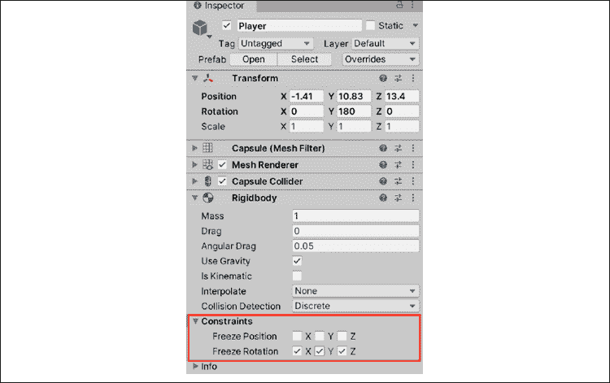

    图 7.1：Rigidbody 组件

1.  在**Project**面板中选择`Materials`文件夹，然后点击**Create** | **Material**。将其命名为`Player_Mat`。

1.  在**Hierarchy**面板中选择`Player_Mat`，然后在**Inspector**面板中将**Albedo**属性更改为明亮的绿色，并将材质拖动到**Hierarchy**面板中的**Player**对象上：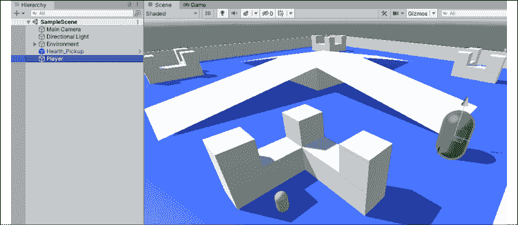

图 7.2：胶囊上的玩家材质

你已经使用胶囊原形、Rigidbody 组件和一种新的明亮的绿色材质创建了一个**玩家**对象。现在不必担心 Rigidbody 组件是什么——你只需要知道它允许我们的胶囊与物理系统交互。我们将在本章末尾讨论 Unity 的物理系统工作原理时详细介绍。在我们到达那里之前，我们需要讨论 3D 空间中的一个非常重要的话题：向量。

## 理解向量

现在我们已经设置好了玩家胶囊和摄像头，我们可以开始探讨如何使用其`Transform`组件来移动和旋转 GameObject。`Translate`和`Rotate`方法是 Unity 提供的`Transform`类的一部分，每个方法都需要一个向量参数来执行其特定的功能。

在 Unity 中，向量用于在 2D 和 3D 空间中保存位置和方向数据，这就是为什么它们有两种类型——`Vector2`和`Vector3`。它们可以像我们见过的任何其他变量类型一样使用；它们只是保存不同的信息。由于我们的游戏是 3D 的，我们将使用`Vector3`对象，这意味着我们需要使用*x*、*y*和*z*值来构建它们。

对于 2D 向量，只需要*x*和*y*位置。记住，您 3D 场景中最新的方向将在我们之前章节中讨论的右上角图形中显示，即*第六章*，*用 Unity 动手实践*：

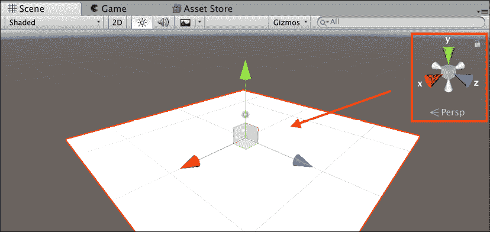

图 7.3：Unity 编辑器中的向量图示

如果您想了解更多关于 Unity 中向量的信息，请参考[`docs.unity3d.com/ScriptReference/Vector3.html`](https://docs.unity3d.com/ScriptReference/Vector3.html)的文档和脚本参考。

例如，如果我们想创建一个新的向量来保存场景的原点位置，我们可以使用以下代码：

```cs
Vector3 Origin = new Vector(0f, 0f, 0f); 
```

在这里，我们只是创建了一个新的`Vector3`变量，并按顺序用`0`初始化其*x*位置、*y*位置和*z*位置。这将在游戏竞技场的原点生成玩家。浮点值可以带小数点或不带小数点，但它们总是需要以小写`f`结尾。

我们也可以通过使用`Vector2`或`Vector3`类的属性来创建方向向量：

```cs
Vector3 ForwardDirection = Vector3.forward; 
```

与保持位置不同，`ForwardDirection`引用了我们场景中沿 3D 空间中的*z*轴的前进方向。使用 Vector3 方向的一个好处是，无论我们让玩家朝哪个方向看，我们的代码总是会知道哪个方向是前进的。我们将在本章后面讨论如何使用向量，但现在只需习惯于用*x*、*y*和*z*位置和方向来思考 3D 移动。

如果向量的概念对您来说是新的，请不要担心——这是一个复杂的话题。Unity 的向量食谱是一个很好的起点：[`docs.unity3d.com/Manual/VectorCookbook.html`](https://docs.unity3d.com/Manual/VectorCookbook.html)。

现在您对向量有了更多的了解，您就可以开始实现移动玩家胶囊的基本功能了。为此，您需要从键盘收集玩家输入，这是下一节的主题。

## 获取玩家输入

位置和方向本身很有用，但如果没有玩家的输入，它们不能产生移动。这就是`Input`类发挥作用的地方，它处理从按键和鼠标位置到加速度和陀螺仪数据的所有事情。

在《英雄降生》中，我们将使用`W`、`A`、`S`、`D`和箭头键进行移动，并配合一个允许相机跟随玩家鼠标指向的脚本。为此，我们需要了解输入轴的工作原理。

首先，转到 **Edit** | **Project Settings** | **Input Manager** 以打开以下截图所示的 **Input Manager** 选项卡：

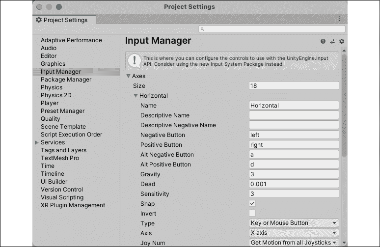

图 7.4：输入管理器窗口

Unity 2021 引入了一个新的输入系统，该系统减少了大量的编码工作，使得在编辑器中设置输入作为动作变得更加容易。由于这是一本编程书籍，我们将从头开始。然而，如果你想了解新输入系统的工作原理，请查看这个优秀的教程：[`learn.unity.com/project/using-the-input-system-in-unity`](https://learn.unity.com/project/using-the-input-system-in-unity)。

你将看到一个 Unity 默认输入的长列表，已经配置好了，但让我们以 **Horizontal** 轴为例。你可以看到 **Horizontal** 输入轴的 **Positive** 和 **Negative** 按钮设置为 `left` 和 `right`，而 **Alt Negative** 和 **Alt Positive** 按钮设置为 `a` 和 `d` 键。

代码查询任何输入轴时，其值将在 -1 和 1 之间。例如，当按下左箭头或 `A` 键时，水平轴注册 -1 值。当这些键释放时，值返回 0。同样，当使用右箭头或 `D` 键时，水平轴注册 1 的值。这允许我们仅用一行代码捕获单个轴的四个不同输入，而不是为每个输入编写一个长的 `if-else` 语句链。

捕获输入轴就像调用 `Input.GetAxis()` 并通过名称指定我们想要的轴一样简单，这就是我们在下一节中将要做的 `Horizontal` 和 `Vertical` 输入。作为额外的好处，Unity 应用了一个平滑滤波器，这使得输入帧率独立。

默认输入可以根据需要修改，但你也可以通过在输入管理器中增加 `Size` 属性并重命名为你创建的副本来创建自定义轴。你必须增加 `Size` 属性才能添加自定义输入。

让我们开始使用 Unity 的输入系统和我们自己的自定义移动脚本来让玩家移动。

## 移动玩家

在你让玩家移动之前，你需要将脚本附加到玩家胶囊上：

1.  在 `Scripts` 文件夹中创建一个新的 C# 脚本，命名为 `PlayerBehavior`，并将其拖放到 **Hierarchy** 面板中的 **Player** 胶囊上。

1.  添加以下代码并保存：

    ```cs
    using System.Collections;
    using System.Collections.Generic;
    using UnityEngine; 
    public class PlayerBehavior : MonoBehaviour 
    {
        **// 1**
        public float MoveSpeed = 10f;
        public float RotateSpeed = 75f;
        **// 2**
        private float _vInput;
        private float _hInput;
        void Update()
        {
            **// 3**
            _vInput = Input.GetAxis("Vertical") * MoveSpeed;
            **// 4**
            _hInput = Input.GetAxis("Horizontal") * RotateSpeed;
            **// 5**
            this.transform.Translate(Vector3.forward * _vInput * 
            Time.deltaTime);
            **// 6**
            this.transform.Rotate(Vector3.up * _hInput * 
            Time.deltaTime);
        }
    } 
    ```

使用 `this` 关键字是可选的。Visual Studio 2019 可能建议你移除它以简化代码，但我更喜欢保留它以提高清晰度。当你有空的 `Start` 方法等空方法时，通常为了清晰起见会删除它们。

以下是前面代码的分解：

1.  声明两个公共变量作为乘数：

    +   `MoveSpeed` 用于设置玩家前后移动的速度

    +   `RotateSpeed` 用于设置玩家左右旋转的速度

1.  声明两个私有变量来保存玩家的输入；最初设置为无值：

    +   `_vInput` 将存储垂直轴输入。

    +   `_hInput` 将存储水平轴输入。

1.  `Input.GetAxis("Vertical")` 检测向上箭头、向下箭头、`W` 或 `S` 键是否被按下，并将该值乘以 `MoveSpeed`：

    +   向上箭头和 `W` 键返回值为 1，这将使玩家向前（正方向）移动。

    +   向下箭头和 `S` 键返回 -1，使玩家向负方向后退。

1.  `Input.GetAxis("Horizontal")` 检测左箭头、右箭头、`A` 和 `D` 键是否被按下，并将该值乘以 `RotateSpeed`：

    +   右箭头和 `D` 键返回值为 1，这将使胶囊向右旋转。

    +   左箭头和 `A` 键返回 -1，使胶囊向左旋转。

        如果你想知道是否可以在一行内完成所有移动计算，简单的回答是肯定的。然而，即使只有你自己阅读代码，将代码拆分也是更好的做法。

1.  使用 `Translate` 方法，该方法接受一个 `Vector3` 参数，来移动胶囊的 Transform 组件：

    +   记住，`this` 关键字指定了当前脚本附加的 GameObject，在这个例子中，是玩家胶囊。

    +   `Vector3.forward` 乘以 `_vInput` 和 `Time.deltaTime` 提供了胶囊在 *z* 轴上前进或后退的方向和速度，这是我们计算出的速度。

    +   `Time.deltaTime` 总是返回自游戏上一帧执行以来经过的秒数。它通常用于平滑在 `Update` 方法中捕获或运行的值，而不是让它由设备的帧率决定。

1.  使用 `Rotate` 方法来旋转胶囊的 Transform 组件相对于我们传递的参数向量：

    +   `Vector3.up` 乘以 `_hInput` 和 `Time.deltaTime` 给我们想要的左右旋转轴。

    +   我们在这里使用 `this` 关键字和 `Time.deltaTime` 的原因相同。

如我们之前讨论的，在 `Translate` 和 `Rotate` 函数中使用方向向量是处理此问题的方法之一。我们同样可以创建新的 Vector3 变量从我们的轴输入，并将它们作为参数使用。

当你点击播放时，你可以使用上下箭头键和 `W`/`S` 键来前后移动胶囊，同时使用左右箭头键和 `A`/`D` 键进行旋转或转向。

通过这几行代码，你已经设置了两个独立的、与帧率无关且易于修改的控制。然而，我们的相机并没有跟随胶囊移动，所以让我们在下一节中修复这个问题。

# 脚本控制相机行为

要使一个 GameObject 跟随另一个 GameObject，最简单的方法是将其中一个设置为另一个的子对象。当一个对象是另一个对象的子对象时，子对象的位置和旋转相对于父对象。这意味着任何子对象都会随着父对象移动和旋转。

然而，这种方法意味着任何发生在玩家胶囊上的移动或旋转也会影响摄像机，而这并不是我们一定想要的。我们始终希望摄像机位于玩家后方一定的距离，并且始终旋转以面向它，无论发生什么。幸运的是，我们可以通过`Transform`类的方法轻松设置摄像机相对于胶囊的位置和旋转。在下一个挑战中，你的任务是编写摄像机的逻辑脚本。

由于我们希望摄像机的行为完全独立于玩家的移动方式，我们将通过**Inspector**选项卡设置一个可以设置的目标来控制摄像机的位置：

1.  在`Scripts`文件夹中创建一个新的 C#脚本，命名为`CameraBehavior`，并将其拖放到**Hierarchy**面板中的**Main Camera**。

1.  添加以下代码并保存：

    ```cs
    using System.Collections;
    using System.Collections.Generic;
    using UnityEngine; 
    public class CameraBehavior : MonoBehaviour 
    {
        **// 1**
        public Vector3 CamOffset= new Vector3(0f, 1.2f, -2.6f);
        **// 2**
        private Transform _target;
        void Start()
        {
            **// 3**
            _target = GameObject.Find("Player").transform;
        }
        **// 4**
        void LateUpdate()
        {
            **// 5**
            this.transform.position = _target.TransformPoint(CamOffset);
            **// 6**
            this.transform.LookAt(_target);
        } 
    } 
    ```

以下是前述代码的分解：

1.  声明一个`Vector3`变量来存储我们想要在**主摄像机**和**玩家**胶囊之间的距离：

    +   由于它是`public`的，我们可以在**Inspector**中手动设置摄像机偏移的*x*、*y*和*z*位置。

    +   这些默认值是我认为看起来最好的，但请随意实验。

1.  创建一个变量来保存玩家胶囊的 Transform 信息：

    +   这将使我们能够访问其位置、旋转和缩放。

    +   我们不希望其他脚本能够更改摄像机的目标，这就是为什么它是`private`的。

1.  使用`GameObject.Find`通过名称定位胶囊并从场景中检索其 Transform 属性：

    +   这意味着胶囊的*x*、*y*和*z*位置在每一帧都会更新并存储在`_target`变量中。

    +   在场景中查找对象是一个计算密集型任务，因此，在`Start`方法中只执行一次并存储引用是一个好习惯。永远不要在`Update`方法中使用`GameObject.Find`，因为这会尝试不断查找你正在寻找的对象，并可能导致游戏崩溃。

1.  `LateUpdate`是一个`MonoBehavior`方法，类似于`Start`或`Update`，它在`Update`之后执行：

    +   由于我们的`PlayerBehavior`脚本在`Update`方法中移动胶囊，我们希望在移动发生后运行`CameraBehavior`中的代码；这保证了`_target`有最新的位置可以参考。

1.  每一帧将摄像机的位置设置为`_target.TransformPoint(CamOffset)`，从而产生以下效果：

    +   `TransformPoint`方法计算并返回世界空间中的相对位置。

    +   在这种情况下，它返回`target`（我们的胶囊）在*x*轴上偏移`0`，在*y*轴上（将摄像机置于胶囊上方）偏移`1.2`，在*z*轴上偏移`-2.6`（将摄像机稍微置于胶囊后方）的位置。

1.  `LookAt`方法在每一帧更新胶囊的旋转，聚焦于我们传递的 Transform 参数，在这种情况下，是`_target`：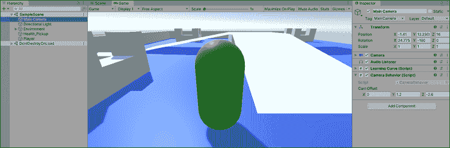

    图 7.5：播放模式下的胶囊和跟随摄像机

这需要吸收很多信息，但如果将其分解为按时间顺序排列的步骤，则更容易处理：

1.  我们为相机创建了一个偏移位置。

1.  我们找到了并存储了玩家胶囊的位置。

1.  我们手动更新了每一帧的位置和旋转，以确保它始终以固定距离跟随并朝向玩家。

当使用提供平台特定功能的方法时，请始终记得将其分解为最基本的步骤。这将帮助你在新的编程环境中保持清醒。

虽然你编写的用于管理玩家运动代码完全有效，但你可能已经注意到它在某些地方有点不流畅。为了创建更平滑、更逼真的运动效果，你需要了解 Unity 物理系统的基本知识，你将在下一节中深入了解。

# 与 Unity 物理系统一起工作

到目前为止，我们还没有讨论过 Unity 引擎的工作原理，或者它是如何管理在虚拟空间中创建逼真的交互和运动的。我们将在本章的剩余部分学习 Unity 物理系统的基本知识。

驱动 Unity 的 NVIDIA PhysX 引擎的两个主要组件如下：

+   **Rigidbody** 组件，允许 GameObject 受重力影响并添加如 **质量** 和 **阻力** 等属性。如果 Rigidbody 组件附加了 Collider 组件，它还可以受到施加的力的作用，从而产生更逼真的运动：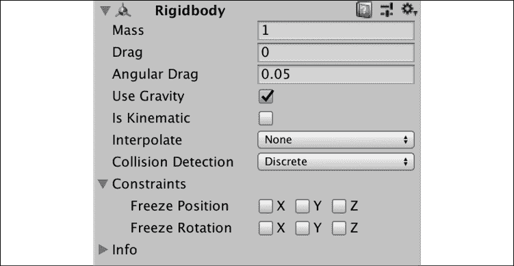

图 7.6：检查器面板中的 Rigidbody 组件

+   **Collider** 组件，确定 GameObject 如何以及何时进入和退出彼此的物理空间，或者简单地碰撞并弹开。虽然应该只有一个 Rigidbody 组件附加到特定的 GameObject，但如果需要不同的形状或交互，则可以有多个 Collider 组件。这通常被称为复合 Collider 设置：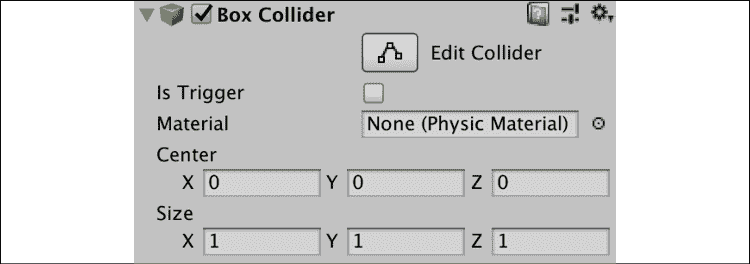

图 7.7：检查器面板中的盒子碰撞器组件

当两个 Collider 组件相互作用时，Rigidbody 属性决定了产生的交互。例如，如果一个 GameObject 的质量高于另一个，较轻的 GameObject 将以更大的力量弹开，就像现实生活中一样。这两个组件负责 Unity 中所有物理交互和模拟运动。

使用这些组件有一些注意事项，最好在 Unity 允许的运动类型方面理解：

+   *运动学*运动发生在 Rigidbody 组件附加到 GameObject 上时，但它不会在场景的物理系统中注册。换句话说，运动学对象具有物理交互，但不会对其做出反应，就像现实生活中的墙壁一样。这仅在特定情况下使用，可以通过检查 Rigidbody 组件的 **Is Kinematic** 属性来启用。由于我们想让我们的胶囊与物理系统交互，我们不会使用这种运动方式。

+   *非动力学* 移动是指通过施加力而不是手动更改 GameObject 的 Transform 属性来移动或旋转 Rigidbody 组件。本节的目标是更新 `PlayerBehavior` 脚本来实现这种类型的运动。

我们现在的设置，即在使用 Rigidbody 组件与物理系统交互的同时操作胶囊的 Transform 组件，旨在让你思考在 3D 空间中的移动和旋转。然而，这并不是为了生产使用，Unity 建议在代码中避免混合使用动力学和非动力学移动。

你的下一个任务是使用施加的力将当前的移动系统转换为更真实的移动体验。

## 正在运动的 Rigidbody 组件

由于我们的玩家附加了 Rigidbody 组件，我们应该让物理引擎控制我们的移动，而不是手动平移和旋转 Transform。在施加力方面有两个选择：

+   你可以直接使用 Rigidbody 类方法，如 `AddForce` 和 `AddTorque` 来移动和旋转对象，分别。这种方法有其缺点，通常需要额外的代码来补偿意外的物理行为，如碰撞期间的不想要的扭矩或施加的力。

+   或者，你可以使用其他 Rigidbody 类方法，如 `MovePosition` 和 `MoveRotation`，这些方法仍然使用施加的力。

在下一节中，我们将选择第二条路线，让 Unity 为我们处理施加的物理，但如果你对手动施加力和扭矩到你的 GameObject 感兴趣，那么从这里开始：[`docs.unity3d.com/ScriptReference/Rigidbody.AddForce.html`](https://docs.unity3d.com/ScriptReference/Rigidbody.AddForce.html)。

这两种方法都会让玩家有更真实的感觉，并允许我们在 *第八章*，*脚本游戏机制* 中添加跳跃和冲刺机制。

如果你好奇当一个没有 Rigidbody 组件的移动物体与装备了该组件的环境部件交互时会发生什么，请从玩家身上移除组件并在竞技场周围跑动。恭喜你——你现在是一个幽灵，可以穿过墙壁！不过，别忘了将 Rigidbody 组件重新添加回去！

玩家胶囊已经附加了 Rigidbody 组件，这意味着你可以访问和修改其属性。不过，首先你需要找到并存储该组件，这是你的下一个挑战。

在修改之前，你需要访问并存储我们玩家胶囊上的 Rigidbody 组件。使用以下更改更新 `PlayerBehavior`：

```cs
using System.Collections;
using System.Collections.Generic;
using UnityEngine;
public class PlayerBehavior : MonoBehaviour 
{
    public float MoveSpeed = 10f;
    public float RotateSpeed = 75f;
    private float _vInput;
    private float _hInput;
    **// 1**
    **private** **Rigidbody _rb;**
    **// 2**
    **void****Start****()**
    **{**
        **// 3**
        **_rb = GetComponent<Rigidbody>();**
    **}**
    void Update()
    {
      _vInput = Input.GetAxis("Vertical") * MoveSpeed;
      _hInput = Input.GetAxis("Horizontal") * RotateSpeed;
      **/***
      this.transform.Translate(Vector3.forward * _vInput * 
      Time.deltaTime);
      this.transform.Rotate(Vector3.up * _hInput * Time.deltaTime);
      ***/**
    }
} 
```

下面是对前面代码的分解：

1.  添加一个私有变量，类型为 `Rigidbody`，它将包含对胶囊的 Rigidbody 组件的引用。

1.  `Start` 方法在脚本在场景中初始化时触发，这发生在你点击播放时，并且应该在类开始时设置任何变量时使用。

1.  `GetComponent`方法检查我们正在寻找的组件类型（在本例中为`Rigidbody`）是否存在于脚本附加的 GameObject 上，并返回它：

    +   如果组件未附加到 GameObject，则该方法将返回`null`，但由于我们知道玩家上有一个，所以我们现在不必担心错误检查。

1.  在`Update`函数中注释掉`Transform`和`Rotate`方法调用，这样我们就不会运行两种不同的玩家控制：

    +   我们希望保留捕获玩家输入的代码，以便我们以后还能使用它。

您已经初始化并存储了玩家胶囊上的刚体组件，并注释掉了过时的`Transform`代码，为基于物理的运动做好了准备。现在角色已经准备好迎接下一个挑战，即添加力。

使用以下步骤来移动和旋转刚体组件。在`Update`方法下方添加以下代码到`PlayerBehavior`中，然后保存文件：

```cs
// 1
void FixedUpdate()
{
    // 2
    Vector3 rotation = Vector3.up * _hInput;
    // 3
    Quaternion angleRot = Quaternion.Euler(rotation *
        Time.fixedDeltaTime);
    // 4
    _rb.MovePosition(this.transform.position +
        this.transform.forward * _vInput * Time.fixedDeltaTime);
     // 5
     _rb.MoveRotation(_rb.rotation * angleRot);
} 
```

以下是前面代码的分解：

1.  任何与物理或刚体相关的代码都应该放在`FixedUpdate`方法内部，而不是`Update`或其他`MonoBehavior`方法中：

    +   `FixedUpdate`与帧率无关，用于所有物理代码。

1.  创建一个新的`Vector3`变量来存储我们的左右旋转：

    +   `Vector3.up * _hInput`是我们之前在示例中使用`Rotate`方法的相同旋转向量。

1.  `Quaternion.Euler`接受一个`Vector3`参数并返回一个欧拉角度的旋转值：

    +   我们需要`Quaternion`值而不是`Vector3`参数来使用`MoveRotation`方法。这只是将旋转类型转换为 Unity 更喜欢的类型。

    +   我们乘以`Time.fixedDeltaTime`的原因与我们在`Update`中使用`Time.deltaTime`的原因相同。

1.  在我们的`_rb`组件上调用`MovePosition`，它接受一个`Vector3`参数并相应地应用力：

    +   使用的向量可以分解如下：胶囊的`Transform`位置在前进方向上，乘以垂直输入和`Time.fixedDeltaTime`。

    +   刚体组件负责应用运动力以满足我们的向量参数。

1.  在`_rb`组件上调用`MoveRotation`方法，它也接受一个`Vector3`参数并在幕后应用相应的力：

    +   `angleRot`已经包含了来自键盘的水平输入，所以我们只需要将当前的刚体旋转乘以`angleRot`以获得相同的左右旋转。

注意，`MovePosition`和`MoveRotation`对于非刚体游戏对象的工作方式不同。您可以在 Rigidbody 脚本参考中找到更多信息，链接为[`docs.unity3d.com/ScriptReference/Rigidbody.html`](https://docs.unity3d.com/ScriptReference/Rigidbody.html)。

如果您现在点击播放，您将能够朝您所看的方向前后移动，以及围绕*y*轴旋转。

应用力产生的效果比平移和旋转变换组件更强，因此你可能需要在**检查器**面板中微调`MoveSpeed`和`RotateSpeed`变量。你现在已经重新创建了之前相同类型的运动方案，只是加入了更真实的物理效果。

如果你跑上斜坡或从中央平台掉落，你可能会看到玩家被弹射到空中，或者缓慢地落到地上。尽管刚体组件被设置为使用重力，但它相当弱。我们将在下一章中处理将我们的重力应用到玩家上，当时我们将实现跳跃机制。现在，你的任务是熟悉碰撞组件在 Unity 中处理碰撞的方式。

## 碰撞和碰撞

碰撞组件不仅允许游戏对象被 Unity 的物理系统识别，而且它们还使得交互和碰撞成为可能。将碰撞组件想象成围绕游戏对象的不可见力场；根据它们的设置，它们可以被穿过或碰撞，并且它们包含一系列在交互过程中执行的方法。

Unity 的物理系统对于 2D 和 3D 游戏的工作方式不同，因此本书中我们只会涵盖 3D 主题。如果你对制作 2D 游戏感兴趣，请参考[`docs.unity3d.com/Manual/class-Rigidbody2D.html`](https://docs.unity3d.com/Manual/class-Rigidbody2D.html)中的`Rigidbody2D`组件和可用的 2D 碰撞组件列表[`docs.unity3d.com/Manual/Collider2D.html`](https://docs.unity3d.com/Manual/Collider2D.html)。

看一下**Health_Pickup**对象中**胶囊**的以下截图。如果你想更好地看到**胶囊碰撞组件**，请增加**半径**属性：

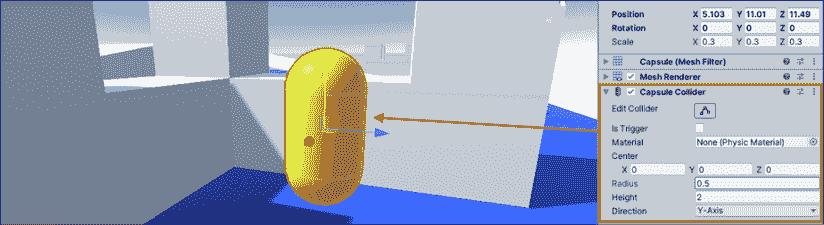

图 7.8：附加到拾取物品的胶囊碰撞组件

物体周围的绿色形状是**胶囊碰撞组件**，可以使用**中心**、**半径**和**高度**属性来移动和缩放。

当创建一个原形时，碰撞组件默认匹配原形的形状；由于我们创建了一个胶囊原形，因此它自带胶囊碰撞组件。

碰撞组件还有**盒形**、**球形**和**网格**形状，可以从**组件** | **物理**菜单或从**检查器**中的**添加组件**按钮手动添加。

当碰撞组件接触到其他组件时，它会发出所谓的消息或广播。任何添加了一个或多个这些方法的脚本都会在碰撞组件发出消息时收到通知。这被称为**事件**，这是我们将在第十四章“旅程继续”中更详细讨论的主题。

例如，当两个具有碰撞器的 GameObject 相互接触时，两个对象都会注册一个 `OnCollisionEnter` 事件，并附带它们所碰撞的对象的引用。将事件想象成发送出去的消息——如果你选择监听它，当在这个情况下发生碰撞时，你会收到通知。这些信息可以用来跟踪各种交互事件，但最简单的一个是拾取物品。对于想要对象能够穿过其他对象的情况，你可以使用碰撞触发器，我们将在下一节中讨论。

Collider 通知的完整列表可以在 [`docs.unity3d.com/ScriptReference/Collider.html`](https://docs.unity3d.com/ScriptReference/Collider.html) 的 **Messages** 标题下找到。

只有当碰撞对象属于特定的 Collider、Trigger 和 RigidBody 组件以及运动学或非运动学运动的组合时，才会发出碰撞和触发事件。你可以在 [`docs.unity3d.com/Manual/CollidersOverview.html`](https://docs.unity3d.com/Manual/CollidersOverview.html) 的 **Collision action matrix** 部分找到详细信息。

你之前创建的健康物品是测试碰撞工作原理的完美场所。你将在下一个挑战中处理这个问题。

### 拾取物品

要使用碰撞逻辑更新 `Health_Pickup` 对象，你需要执行以下操作：

1.  在 `Scripts` 文件夹中创建一个新的 C# 脚本，命名为 `ItemBehavior`，然后将它拖放到 **Hierarchy** 面板中的 `Health_Pickup` 对象上：

    +   任何使用碰撞检测的脚本 *必须* 附带一个具有 Collider 组件的 GameObject，即使它是预制体的子对象。

1.  在 **Hierarchy 面板** 中选择 `Health_Pickup`，点击 **Inspector** 中 **Item Behavior (Script)** 组件右侧的三个垂直点图标，然后选择 **Added Component** | **Apply to Prefab 'Health_Pickup'**: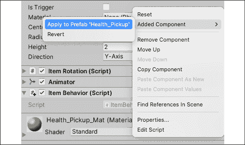

    图 7.9：应用预制体更改以拾取物品

1.  将 `ItemBehavior` 中的默认代码替换为以下内容，然后保存：

    ```cs
    using System.Collections;
    using System.Collections.Generic;
    using UnityEngine;
    public class ItemBehavior : MonoBehaviour 
    {
        **// 1**
        void OnCollisionEnter(Collision collision)
        {
            **// 2**
            if(collision.gameObject.name == "Player")
            {
                **// 3**
                Destroy(this.transform.gameObject);
                **// 4**
                Debug.Log("Item collected!");
            }
        }
    } 
    ```

1.  点击播放，并将玩家移动到胶囊上以拾取它！

以下是前述代码的分解：

1.  当另一个对象撞到 `Item` 预制体时，Unity 会自动调用 `OnCollisionEnter` 方法：

    +   `OnCollisionEnter` 方法附带一个参数，用于存储与之发生碰撞的 Collider 引用。

    +   注意，这里的碰撞类型是 `Collision`，而不是 `Collider`。

1.  `Collision` 类有一个名为 `gameObject` 的属性，它包含对碰撞 GameObject 的 Collider 的引用：

    +   我们可以使用这个属性来获取 GameObject 的名称，并使用 `if` 语句检查碰撞对象是否是玩家。

1.  如果碰撞对象是玩家，我们将调用 `Destroy()` 方法，该方法接受一个 GameObject 参数，并将对象从场景中移除。

1.  然后它会在控制台打印出一个简单的日志，表示我们已经收集了一个物品: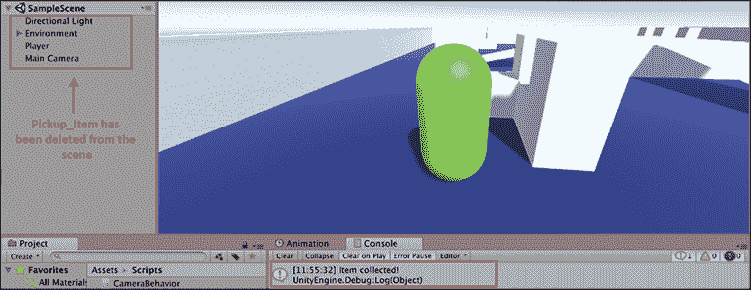

    图 7.10：场景中游戏对象被删除的示例

我们已经设置了`ItemBehavior`来监听与`Health_Pickup`对象 Prefab 的任何碰撞。每当发生碰撞时，`ItemBehavior`使用`OnCollisionEnter()`并检查碰撞对象是否是玩家，如果是，则销毁（或收集）物品。

如果你感到困惑，想想我们编写的碰撞代码作为从`Health_Pickup`接收通知的接收器；每次被击中时，代码都会触发。

重要的是要理解，我们也可以创建一个具有`OnCollisionEnter()`方法的类似脚本，将其附加到玩家上，然后检查碰撞对象是否是`Health_Pickup` Prefab。碰撞逻辑取决于被碰撞对象的视角。

现在的问题是，你将如何设置碰撞，而不会阻止碰撞对象相互穿过？我们将在下一节中解决这个问题。

## 使用碰撞触发器

默认情况下，碰撞体使用`isTrigger`属性未勾选，这意味着物理系统将它们视为固体对象，并在碰撞时引发碰撞事件。然而，在某些情况下，你可能希望能够在不停止你的 GameObject 的情况下穿过碰撞体组件。这就是触发器的作用所在。勾选`isTrigger`后，GameObject 可以穿过它，但碰撞体会发送出`OnTriggerEnter`、`OnTriggerExit`和`OnTriggerStay`通知。

触发器在需要检测 GameObject 进入某个区域或通过某个点时最有用。我们将使用它来设置敌人周围的区域；如果玩家进入触发区域，敌人将会警觉，并在稍后攻击玩家。现在，你将专注于以下挑战中的敌人逻辑。

### 创建一个敌人

使用以下步骤创建一个敌人：

1.  在**层次**面板中使用**+** | **3D 对象** | **胶囊**创建一个新的原形，并将其命名为`Enemy`。

1.  在**材质**文件夹中，使用**+** | **材质**，将其命名为`Enemy_Mat`，并将其**Albedo**属性设置为明亮的红色：

    +   将`Enemy_Mat`拖放到`Enemy`GameObject 中。

1.  选择`Enemy`后，点击**添加组件**，搜索**球体碰撞体**，然后按**Enter**键添加：

    +   勾选**isTrigger**属性框，并将**半径**更改为`8`：![img/B17573_07_11.png]

    图 7.11：附加到敌人对象上的球体碰撞组件

我们新的**Enemy**原形现在被一个 8 个单位的触发半径包围，形状像一个球体。每当另一个对象进入、停留在该区域内或退出该区域时，Unity 都会发送出我们可以捕获的通知，就像我们处理碰撞一样。你的下一个挑战将是捕获那个通知并在代码中对其做出反应。

要捕获触发事件，你需要按照以下步骤创建一个新的脚本：

1.  在`Scripts`文件夹中创建一个新的 C#脚本，命名为`EnemyBehavior`，然后将它拖放到**Enemy**上。

1.  添加以下代码并保存文件：

    ```cs
    using System.Collections;
    using System.Collections.Generic;
    using UnityEngine;

    public class EnemyBehavior : MonoBehaviour 
    {
        **// 1**
        void OnTriggerEnter(Collider other)
        {
            **//2** 
            if(other.name == "Player")
            {
                Debug.Log("Player detected - attack!");
            }
        }
        **// 3**
        void OnTriggerExit(Collider other)
        {
            **// 4**
            if(other.name == "Player")
            {
                Debug.Log("Player out of range, resume patrol");
            }
        }
    } 
    ```

1.  点击播放并走到敌人那里触发第一个通知，然后走开触发第二个通知。

下面是对前面代码的分解：

1.  `OnTriggerEnter()`在对象进入敌人 Sphere Collider 半径时触发：

    +   与`OnCollisionEnter()`类似，`OnTriggerEnter()`存储了对违规对象 Collider 组件的引用。

    +   注意，`other`是`Collider`类型，而不是`Collision`。

1.  我们可以使用`other`来访问碰撞 GameObject 的名称，并使用`if`语句检查它是否是`Player`。如果是，控制台会打印出日志，说明`Player`处于危险区域。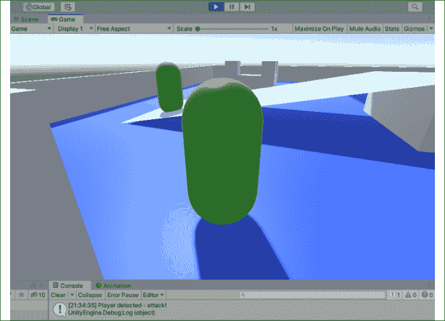

    图 7.12：玩家和敌人对象之间的碰撞检测

1.  当对象离开敌人 Sphere Collider 半径时，会触发`OnTriggerExit()`。

    +   此方法还有一个对碰撞对象的 Collider 组件的引用：

1.  我们使用另一个`if`语句通过名称检查离开 Sphere Collider 半径的对象：

    +   如果是`Player`，我们在控制台打印出另一条日志，说明他们安全了！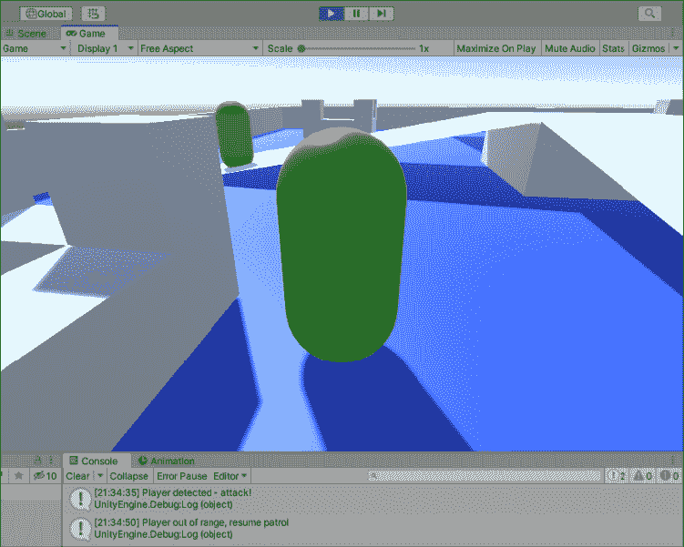

    图 7.13：碰撞触发器的示例

我们敌人的 Sphere Collider 在区域被侵犯时发送通知，`EnemyBehavior`脚本捕获了其中两个事件。每当玩家进入或退出碰撞半径时，控制台都会出现一个调试日志，让我们知道代码正在工作。我们将在*第九章*，*基本 AI 和敌人行为*中继续构建这个内容。

Unity 使用了一种称为组件设计模式的东西。不深入细节，这是一个复杂的方式来说明对象（以及通过扩展，它们的类）应该对其行为负责，而不是将所有代码放在一个巨大的文件中。这就是为什么我们在拾取物品和敌人上放置单独的碰撞脚本，而不是有一个单独的类来处理所有事情。我们将在*第十四章*，*旅程继续*中进一步讨论这一点。

由于这本书的目的是尽可能灌输尽可能多的良好编程习惯，所以本章的最后一个任务是确保所有核心对象都转换为预制体。

### 英雄的考验——所有预制体！

为了为下一章做好准备，请将`Player`和`Enemy`对象拖到**预制体**文件夹中。记住，从现在开始，你总是需要在**层次结构**面板中右键单击预制体，然后选择**添加组件**|**应用到预制体**来巩固对这些 GameObject 所做的任何更改。

完成这些后，继续到*物理总结*部分，确保你理解了我们之前覆盖的所有主要主题，然后再继续。

## 物理总结

在我们结束本章之前，这里有一些高级概念来巩固我们迄今为止学到的内容：

+   Rigidbody 组件为它们附加的 GameObject 添加了模拟的真实世界物理。

+   碰撞体组件通过 Rigidbody 组件相互交互，以及与对象交互：

    +   如果一个碰撞体组件不是触发器，则它充当一个固体对象。

    +   如果一个碰撞体组件是触发器，则可以穿过它。

+   如果一个对象使用 Rigidbody 组件并且勾选了**“是运动学”**，则该对象是*运动学*的，告诉物理系统忽略它。

+   如果一个对象使用 Rigidbody 组件并施加力或扭矩来驱动其运动和旋转，则该对象是*非运动学*的。

+   碰撞体根据其交互发送通知。这些通知取决于碰撞体组件是否设置为触发。通知可以从任一碰撞方接收，并且它们带有引用变量，这些变量包含对象的碰撞信息。

记住，像 Unity 物理系统这样广泛且复杂的主题不是一天就能学会的。利用您在这里学到的知识作为跳板，将自己投入到更复杂的话题中！

# 摘要

这标志着您创建独立游戏行为并将其整合成一个连贯、尽管简单，的游戏原型的第一次体验。您已经使用了向量和基本的向量数学来确定 3D 空间中的位置和角度，并且您熟悉玩家输入以及移动和旋转 GameObject 的两种主要方法。您甚至深入 Unity 物理系统，熟悉 Rigidbody 物理、碰撞、触发和事件通知。总的来说，*英雄降生*已经取得了良好的开端。

在下一章中，我们将开始处理更多的游戏机制，包括跳跃、冲刺、发射弹丸以及与环境部分交互。这将为您使用 Rigidbody 组件的力、收集玩家输入以及根据所需场景执行逻辑提供更多实际经验。

# 快速问答 - 玩家控制和物理

1.  您会使用什么数据类型来存储 3D 运动和旋转信息？

1.  哪个内置 Unity 组件允许您跟踪和修改玩家控制？

1.  哪个组件为 GameObject 添加真实世界的物理效果？

1.  Unity 建议使用哪种方法在 GameObject 上执行与物理相关的代码？

# 加入我们的 Discord！

与其他用户、Unity/C#专家和哈里森·费罗内一起阅读这本书。提问，为其他读者提供解决方案，通过*问我任何问题*会议与作者聊天等等。

现在加入！

[`packt.link/csharpunity2021`](https://packt.link/csharpunity2021)


