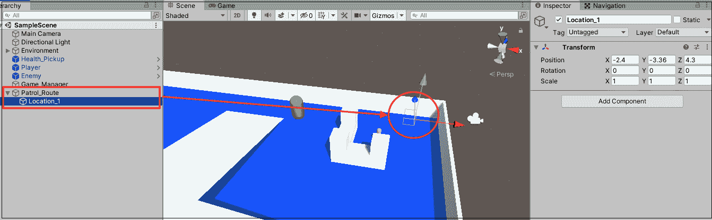

# 9

# 基本 AI 和敌人行为

虚拟场景需要冲突、后果和潜在奖励才能感觉真实。没有这三样东西，玩家就没有理由关心他们在游戏中的角色会发生什么，更不用说继续玩游戏了。虽然有很多游戏机制能够满足一个或多个这些条件，但没有什么能比得上一个会主动寻找你并试图结束你游戏会话的敌人。

编程一个智能敌人并不容易，这通常与长时间的工作和挫败感相伴。然而，Unity 内置了功能、组件和类，我们可以使用它们以更用户友好的方式设计和实现 AI 系统。这些工具将推动*英雄诞生*的第一个可玩迭代冲过终点线，并为更高级的 C#主题提供一个跳板。

在本章中，我们将重点关注以下主题：

+   Unity 导航系统

+   静态对象和导航网格

+   导航代理

+   程序化编程和逻辑

+   接受和处理伤害

+   添加失败条件

+   重构并保持 DRY（不要重复自己）

让我们开始吧！

# 在 Unity 中导航 3D 空间

当我们谈论现实生活中的导航时，这通常是一段关于如何从 A 点到 B 点的对话。在虚拟 3D 空间中的导航在很大程度上是相同的，但我们如何解释自我们第一次开始爬行以来我们所积累的经验知识呢？从在平坦表面上行走到爬楼梯和跳下人行道，这些都是我们通过实践学习到的技能；我们怎么可能在不发疯的情况下将这些全部编程到游戏中呢？

在你能够回答这些问题之前，你需要了解 Unity 提供了哪些导航组件。

## 导航组件

简短的答案是，Unity 花费了大量时间来完善其导航系统，并提供了我们可以用来控制可玩和非可玩角色如何移动的组件。以下每个组件都是 Unity 的标准组件，并已经内置了复杂的功能：

+   **NavMesh**基本上是给定关卡中可通行表面的地图；NavMesh 组件本身是通过称为烘焙的过程从关卡几何形状中创建的。将 NavMesh 烘焙到你的关卡中会创建一个独特的项目资产，该资产包含导航数据。

+   如果**NavMesh**是关卡地图，那么**NavMeshAgent**就是棋盘上的移动棋子。任何附加了 NavMeshAgent 组件的对象都会自动避开它接触到的其他代理或障碍物。

+   导航系统需要了解关卡中任何移动或静止的对象，这些对象可能会使 NavMeshAgent 改变它们的路线。将这些对象添加 NavMeshObstacle 组件可以让系统知道它们需要被避开。

尽管对 Unity 导航系统的描述远未完整，但这足以让我们继续前进，实现敌人的行为。对于本章，我们将专注于在我们的关卡中添加 NavMesh，设置敌人预制件为 NavMeshAgent，并让敌人预制件以看似智能的方式沿着预定义的路线移动。

本章我们只使用 NavMesh 和 NavMeshAgent 组件，但如果你想让你的关卡更加生动，可以查看如何创建障碍物：[`docs.unity3d.com/Manual/nav-CreateNavMeshObstacle.html`](https://docs.unity3d.com/Manual/nav-CreateNavMeshObstacle.html)。

在设置“智能”敌人时，你的第一个任务是创建覆盖竞技场可通行区域的 NavMesh。让我们设置并配置我们关卡中的 NavMesh：

1.  选择**环境**GameObject，在**检查器**窗口中点击**静态**旁边的箭头图标，并选择**导航静态**:

    图 9.1：将对象设置为导航静态

1.  当弹出对话框时，点击**是，更改子对象**，将所有**环境**子对象设置为**导航静态**:

    图 9.2：更改所有子对象

1.  前往**窗口** | **AI** | **导航**，并选择**烘焙**选项卡。保持所有设置为默认值，然后点击**烘焙**。一旦烘焙完成，你将在**场景**文件夹内看到一个新文件夹，其中包含光照、导航网格和反射探针数据:

图 9.3：烘焙导航网格

我们关卡中的每个对象现在都被标记为**导航静态**，这意味着我们新烘焙的 NavMesh 已经根据其默认 NavMeshAgent 设置评估了它们的可访问性。在前面的截图中所见到的任何地方都可以看到浅蓝色叠加，这是任何带有 NavMeshAgent 组件的对象的可通行表面，这是你的下一个任务。

## 设置敌人代理

让我们将敌人预制件注册为 NavMeshAgent：

1.  在**预制件**文件夹中选择敌人预制件，在**检查器**窗口中点击**添加组件**，并搜索**NavMesh Agent**:

    图 9.4：添加 NavMeshAgent 组件

1.  从**层次结构**窗口中点击**+** **|** **创建空对象**，并将 GameObject 命名为`Patrol_Route`:

    +   选择`Patrol_Route`，点击**+** **|** **创建空对象**以添加子 GameObject，并将其命名为`Location_1`。将`Location_1`放置在关卡的一个角落中:

    图 9.5：创建空巡逻路线对象

1.  在`Patrol_Route`中创建另外三个空子对象，分别命名为`Location_2`、`Location_3`和`Location_4`，并将它们放置在关卡剩余的角落中形成一个正方形:

    图 9.6：创建所有空巡逻路线对象

将 NavMeshAgent 组件添加到敌人中，告诉 NavMesh 组件注意并将其注册为具有访问其自主导航功能的对象。在每个角落创建四个空的游戏对象，规划出我们希望敌人最终巡逻的简单路线；将它们组合在一个空父对象中，使得在代码中引用它们更容易，并且使 **Hierarchy** 窗口更加有序。剩下的只是编写让敌人沿着巡逻路线行走的代码，你将在下一节中添加它。

# 移动敌人代理

我们的巡逻位置已设置，敌人预制体有一个 NavMeshAgent 组件，但现在我们需要弄清楚如何引用这些位置并让敌人自动移动。为此，我们首先需要讨论软件开发领域中的一个重要概念：过程式编程。

## 过程式编程

即使这个名字里包含了，直到你真正理解了它，过程式编程背后的想法也可能难以捉摸；一旦你明白了，你就再也不会以同样的方式看待代码挑战了。

任何在单个或多个连续对象上执行相同逻辑的任务都是过程式编程的完美候选者。当你使用 `for` 和 `foreach` 循环调试数组、列表和字典时，你已经进行了一点点过程式编程。每次这些循环语句执行时，你都会对 `Debug.Log()` 执行相同的调用，按顺序遍历每个项目。现在的想法是利用这项技能来获得更有用的结果。

过程式编程最常见的一种用途是将一个集合中的项目添加到另一个集合中，通常在过程中修改它们。这对于我们的目的来说非常适用，因为我们想引用 `Patrol_Route` 父对象中的每个子对象并将它们存储在列表中。

## 引用巡逻位置

现在我们已经了解了过程式编程的基础，是时候获取我们的巡逻位置并将它们分配给一个可用的列表了：

1.  将以下代码添加到 `EnemyBehavior`：

    ```cs
    public class EnemyBehavior : MonoBehaviour
    { 
        **// 1** 
        **public** **Transform PatrolRoute;**
        **// 2** 
        **public** **List<Transform> Locations;**
        **void****Start****()** 
        **{** 
            **// 3** 
            **InitializePatrolRoute();**
        **}** 
              **// 4** 
        **void****InitializePatrolRoute****()** 
        **{** 
            **// 5** 
            **foreach****(Transform child** **in** **PatrolRoute)** 
            **{** 
                **// 6** 
                **Locations.Add(child);**
            **}** 
        **}**
        void OnTriggerEnter(Collider other) 
        { 
            // ... No changes needed ... 
        } 
        void OnTriggerExit(Collider other) 
        { 
            // ... No changes needed ... 
        } 
    } 
    ```

1.  选择 `Enemy`，并将 **Hierarchy** 窗口中的 `Patrol_Route` 对象拖动到 `EnemyBehavior` 中的 **Patrol Route** 变量上：

    图 9.7：将 Patrol_Route 拖动到敌人脚本中

1.  点击 **Inspector** 窗口中 **Locations** 变量旁边的箭头图标，并运行游戏以查看列表填充：

    图 9.8：测试过程式编程

让我们分解一下代码：

1.  首先，它声明了一个用于存储 `PatrolRoute` 空父 GameObject 的变量。

1.  然后，它声明了一个 `List` 变量来存储 `PatrolRoute` 中的所有子 `Transform` 组件。

1.  之后，它使用 `Start()` 在游戏开始时调用 `InitializePatrolRoute()` 方法。

1.  接下来，它创建了一个名为 `InitializePatrolRoute()` 的私有实用方法，以过程式地填充 `Locations` 中的 `Transform` 值：

    +   记住，如果不包含访问修饰符，变量和方法默认为 `private`。

1.  然后，我们使用`foreach`语句遍历`PatrolRoute`中的每个子 GameObject 并引用其 Transform 组件：

    +   每个 Transform 组件都被捕获在`foreach`循环中声明的局部`child`变量中。

1.  最后，我们在遍历`PatrolRoute`中的子对象时，使用`Add()`方法将每个连续的`child` `Transform`组件添加到位置列表中：

    +   这样，无论我们在**Hierarchy**窗口中做出什么更改，`Locations`都将始终填充`PatrolRoute`父对象下的所有`child`对象。

虽然我们可以通过直接从**Hierarchy**窗口拖放每个位置 GameObject 到**Inspector**窗口来将每个位置 GameObject 分配给`Locations`，但很容易丢失或破坏这些连接；更改位置对象名称、对象添加或删除，或项目更新都可能破坏一个类的初始化。在`Start()`方法中程序化填充 GameObject 列表或数组要安全得多，也更易于阅读。

由于这个原因，我也倾向于在`Start()`方法中使用`GetComponent()`来查找并存储附加到给定类的组件引用，而不是在**Inspector**窗口中分配它们。

现在，我们需要让敌人对象跟随我们设定的巡逻路线，这是你的下一个任务。

## 移动敌人

在`Start()`方法中初始化巡逻位置列表后，我们可以获取敌人的 NavMeshAgent 组件并设置其第一个目的地。

使用以下代码更新`EnemyBehavior`并播放：

```cs
**// 1** 
**using** **UnityEngine.AI;** 
public class EnemyBehavior : MonoBehaviour  
{ 
    public Transform PatrolRoute;
    public List<Transform> Locations;
    **// 2** 
    **private****int** **_locationIndex =** **0****;** 
    **// 3** 
    **private** **NavMeshAgent _agent;** 
    void Start() 
    { 
        **// 4** 
        **_agent = GetComponent<NavMeshAgent>();** 
        InitializePatrolRoute(); 
        **// 5** 
        **MoveToNextPatrolLocation();** 
    }
    void InitializePatrolRoute()  
    { 
         // ... No changes needed ... 
    } 
    **void****MoveToNextPatrolLocation****()** 
    **{** 
        **// 6** 
        **_agent.destination = Locations[_locationIndex].position;** 
    **}** 
    void OnTriggerEnter(Collider other) 
    { 
        // ... No changes needed ... 
    } 
    void OnTriggerExit(Collider other) 
    { 
        // ... No changes needed ... 
    }
} 
```

让我们分解一下代码：

1.  首先，它添加了`UnityEngine.AI` `using`指令，这样`EnemyBehavior`就可以访问 Unity 的导航类，在这种情况下是`NavMeshAgent`。

1.  然后，它声明一个变量来跟踪敌人当前正在走向哪个巡逻位置。由于`List`项是零索引的，我们可以让敌人预制体按`Locations`中存储的顺序在巡逻点之间移动。

1.  接下来，它声明一个变量来存储附加到 Enemy GameObject 的 NavMeshAgent 组件。这是`private`的，因为其他类不应该能够访问或修改它。

1.  之后，它使用`GetComponent()`来查找并返回附加到代理的 NavMeshAgent 组件。

1.  然后，它在`Start()`上调用`MoveToNextPatrolLocation()`方法。

1.  最后，它声明`MoveToNextPatrolLocation()`为一个私有方法并设置`_agent.destinat``ion`：

    +   `destination`是 3D 空间中的`Vector3`位置。

    +   `Locations[_locationIndex]`在`Locations`中获取给定索引的 Transform 项。

    +   添加`.position`引用 Transform 组件的`Vector3`位置。

现在，当我们的场景开始时，位置被巡逻点填充，并调用`MoveToNextPatrolLocation()`来设置 NavMeshAgent 组件的目标位置为位置列表中第一个项目`_locationIndex 0`。下一步是让敌人对象按顺序从第一个巡逻位置移动到所有其他位置。

我们敌人的敌人移动到第一个巡逻点没有问题，但然后它就停了下来。我们想要的它是在每个连续位置之间不断移动，这需要在`Update()`和`MoveToNextPatrolLocation()`中添加额外的逻辑。让我们创建这种行为。

将以下代码添加到`EnemyBehavior`中并播放：

```cs
public class EnemyBehavior : MonoBehaviour  
{ 
    // ... No changes needed ... 
    **void****Update****()** 
    **{** 
        **// 1** 
        **if****(_agent.remainingDistance <** **0.2f** **&& !_agent.pathPending)** 
        **{** 
            **// 2** 
            **MoveToNextPatrolLocation();**
        **}**
    **}**
    void MoveToNextPatrolLocation() 
    { 
        **// 3** 
        **if** **(Locations.Count ==** **0****)** 
            **return****;** 

        _agent.destination = Locations[_locationIndex].position;
        **// 4** 
        **_locationIndex = (_locationIndex +** **1****) % Locations.Count;**
    }
    // ... No other changes needed ... 
} 
```

让我们分解一下代码：

1.  首先，它声明了`Update()`方法并添加了一个`if`语句来检查两个不同的条件是否为真：

    +   `remainingDistance`返回 NavMeshAgent 组件当前距离其设定目的地的距离，所以我们在检查它是否小于 0.2。

    +   `pathPending`返回一个`true`或`false`布尔值，具体取决于 Unity 是否正在为 NavMeshAgent 组件计算路径。

1.  如果`_agent`非常接近其目的地，并且没有其他路径正在计算，则`if`语句返回`true`并调用`MoveToNextPatrolLocation()`。

1.  在这里，我们添加了一个`if`语句，以确保在执行`MoveToNextPatrolLocation()`中的其余代码之前，`Locations`不为空：

    +   如果`Locations`为空，我们使用`return`关键字退出方法而不继续执行。

        这被称为防御性编程，并且，与重构相结合，这是你在向更高级的 C#主题迈进时必须具备的一项基本技能。我们将在本章末尾考虑重构。

1.  然后，我们将`_locationIndex`设置为它的当前值，`+1`，然后是`Locations.Count`的取模（`%`）：

    +   这将使索引从 0 增加到 4，然后重新开始从 0 开始，这样我们的敌人预制体就可以在连续的路径上移动。

    +   取模运算符返回两个值相除的余数——当结果为整数时，2 除以 4 的余数为 2，所以 2 % 4 = 2。同样，4 除以 4 没有余数，所以 4 % 4 = 0。

将索引除以集合中最大项目数是一种快速找到下一个项目的方法。如果你对取模运算符不太熟悉，请回顾*第二章*，*编程的基石*。

我们现在需要检查敌人是否在每一帧的`Update()`中向其设定的巡逻位置移动；当它接近时，`MoveToNextPatrolLocation()`被触发，这将增加`_locationIndex`并将下一个巡逻点设置为目的地。

如果你将**场景**视图拖到**控制台**窗口旁边，如图下所示，并播放，你可以看到敌人预制体在关卡角落处连续循环行走：


图 9.9：测试敌人巡逻路线

敌人现在沿着地图外部的巡逻路线移动，但它不会在预设范围内寻找玩家并攻击。你将在下一节中使用 NavAgent 组件来完成这个动作。

# 敌人游戏机制

现在我们敌人的巡逻路线是连续的，是时候给它一些自己的交互机制了；如果我们让它无动于衷地四处走动，那么风险和回报都不会很大。

## 寻找并摧毁：改变代理的目标

在本节中，我们将关注当玩家太近时切换敌人 NavMeshAgent 组件的目标，并在发生碰撞时造成伤害。当敌人成功降低玩家的生命值时，它将返回到其巡逻路线，直到下一次与玩家的遭遇。

然而，我们不会让我们的玩家无助；我们还会添加代码来跟踪敌人生命值，检测当敌人被玩家的子弹成功击中时，以及当敌人需要被摧毁时。

现在敌人预制件正在巡逻移动，我们需要获取玩家的位置引用并更改 NavMeshAgent 的目标，如果它太近的话。

1.  将以下代码添加到`EnemyBehavior`中：

    ```cs
    public class EnemyBehavior : MonoBehaviour  
    { 
        **// 1** 
        **public** **Transform Player;**
        public Transform PatrolRoute;
        public List<Transform> Locations;
        private int _locationIndex = 0;
        private NavMeshAgent _agent;
        void Start() 
        { 
            _agent = GetComponent<NavMeshAgent>();
            **// 2** 
            **Player = GameObject.Find(****"Player"****).transform;** 
            // ... No other changes needed ... 
        } 
        /* ... No changes to Update,  
               InitializePatrolRoute, or  
               MoveToNextPatrolLocation ... */ 
        void OnTriggerEnter(Collider other) 
        { 
            if(other.name == "Player") 
            { 
                **// 3** 
                **_agent.destination = Player.position;**
                Debug.Log("Enemy detected!");
            } 
        } 
        void OnTriggerExit(Collider other)
        { 
            // .... No changes needed ... 
        }
    } 
    ```

让我们分解一下代码：

1.  首先，它声明了一个`public`变量来保存`Player`胶囊的`Transform`值。

1.  然后，我们使用`GameObject.Find("Player")`来返回场景中玩家对象的引用：

    +   在同一行中添加`.transform`直接引用对象的`Transform`值。

1.  最后，在`OnTriggerEnter()`中，我们将`_agent.destination`设置为玩家的`Vector3`位置，每当玩家进入我们之前使用 Collider 组件设置的敌人攻击区域时。

如果你现在玩游戏并且离巡逻的敌人太近，你会看到它从其路径上断开并直接向你冲来。一旦它到达玩家，`Update()`方法中的代码就会接管，敌人预制件继续巡逻。

我们仍然需要敌人能够以某种方式伤害玩家，我们将在下一节中学习如何做到这一点。

## 降低玩家生命值

虽然我们的敌人机制已经取得了很大的进步，但当敌人预制件与玩家预制件碰撞时没有任何事情发生仍然令人失望。为了解决这个问题，我们将新的敌人机制与游戏管理器联系起来。

使用以下代码更新`PlayerBehavior`并播放：

```cs
public class PlayerBehavior : MonoBehaviour  
{ 
    // ... No changes to public variables needed ... 
    **// 1** 
    **private** **GameBehavior _gameManager;**
    void Start() 
    { 
        _rb = GetComponent<Rigidbody>();
        _col = GetComponent<CapsuleCollider>();
        **// 2** 
        **_gameManager = GameObject.Find(****"Game_Manager"****).GetComponent<GameBehavior>();**
    **}** 
    /* ... No changes to Update,  
           FixedUpdate, or  
           IsGrounded ... */ 
    **// 3** 
    **void****OnCollisionEnter****(****Collision collision****)**
    **{**
        **// 4** 
        **if****(collision.gameObject.name ==** **"Enemy"****)**
        **{**
            **// 5** 
            **_gameManager.HP -=** **1****;**
        **}**
    **}**
} 
```

让我们分解一下代码：

1.  首先，它声明了一个`private`变量来保存场景中`GameBehavior`实例的引用。

1.  然后，它找到并返回场景中`Game Manager`对象附加的`GameBehavior`脚本：

    +   在`GameObject.Find()`的同一行上使用`GetComponent()`是一种常见的减少不必要的代码行数的方法。

1.  由于我们的玩家是被碰撞的对象，因此在`PlayerBehavior`中声明`OnCollisionEnter()`是有意义的。

1.  接下来，我们检查碰撞对象的名称；如果是敌人预制件，我们执行`if`语句的主体。

1.  最后，我们使用`_gameManager`实例从公共`HP`变量中减去`1`。

当前的敌人现在跟踪并碰撞到玩家时，游戏管理器将触发 HP 的设置属性。UI 将更新为玩家健康的新值，这意味着我们有机会在稍后添加一些额外的逻辑来处理损失条件。

## 检测子弹碰撞

现在我们有了失败条件，是时候添加一种让我们的玩家能够反击并生存下来对抗敌人攻击的方法了。

打开`EnemyBehavior`并使用以下代码进行修改：

```cs
public class EnemyBehavior : MonoBehaviour  
{ 
    //... No other variable changes needed ... 
    **// 1** 
    **private****int** **_lives =** **3****;** 
    **public****int** **EnemyLives** 
    **{** 
        **// 2** 
        **get** **{** **return** **_lives; }**
        **// 3** 
        **private****set** 
        **{** 
            **_lives =** **value****;** 
            **// 4** 
            **if** **(_lives <=** **0****)** 
            **{** 
                **Destroy(****this****.gameObject);** 
                **Debug.Log(****"Enemy down."****);** 
            **}**
        **}**
    **}**
    /* ... No changes to Start,  
           Update,  
           InitializePatrolRoute,  
           MoveToNextPatrolLocation,  
           OnTriggerEnter, or  
           OnTriggerExit ... */ 
    **void****OnCollisionEnter****(****Collision collision****)** 
    **{** 
        **// 5** 
        **if****(collision.gameObject.name ==** **"Bullet(Clone)"****)** 
        **{** 
            **// 6** 
            **EnemyLives -=** **1****;**
            **Debug.Log(****"Critical hit!"****);**
        **}**
    **}**
} 
```

让我们分解一下代码：

1.  首先，它声明了一个名为`_lives`的`private int`变量，以及一个名为`EnemyLives`的`public`辅助变量。这将使我们能够控制如何引用和设置`EnemyLives`，就像在`GameBehavior`中一样。

1.  然后，我们将`get`属性设置为始终返回`_lives`。

1.  接下来，我们使用`private set`将`EnemyLives`的新值分配给`_lives`，以保持它们同步。

    我们之前没有见过`private get`或`set`，但它们可以有它们的访问修饰符，就像任何其他可执行代码一样。将`get`或`set`声明为`private`意味着只有父类可以访问它们的功能。

1.  然后，我们添加一个`if`语句来检查`_lives`是否小于或等于 0，这意味着敌人应该死了：

    +   当这种情况发生时，我们销毁`Enemy` GameObject 并在控制台打印出一条消息。

1.  由于`Enemy`是子弹击中的对象，因此在`EnemyBehavior`中包含`OnCollisionEnter()`检查这些碰撞是有意义的。

1.  最后，如果碰撞对象的名称与子弹克隆对象匹配，我们将`EnemyLives`减`1`并打印出另一条消息。

注意，我们正在检查的名称是`Bullet(Clone)`，尽管我们的子弹 Prefab 命名为`Bullet`。这是因为 Unity 会将`(Clone)`后缀添加到使用`Instantiate()`方法创建的任何对象上，这是我们射击逻辑中创建它们的方式。

你也可以检查 GameObject 的标签，但由于这是一个 Unity 特定的功能，我们将保持代码不变，并使用纯 C#进行操作。

现在，当敌人试图夺走玩家的一条生命时，玩家可以通过射击敌人三次并摧毁它来进行反击。再次，我们使用`get`和`set`属性来处理附加逻辑，这证明是一个灵活且可扩展的解决方案。完成这些后，你的最终任务是更新游戏管理器以包含失败条件。

## 更新游戏管理器

要完全实现失败条件，我们需要更新管理器类：

1.  打开`GameBehavior`并添加以下代码：

    ```cs
    public class GameBehavior : MonoBehaviour  
    { 
        // ... No other variable changes... 
        **// 1** 
        **public** **Button LossButton;** 
        private int _itemsCollected = 0; 
        public int Items 
        { 
            // ... No changes needed ... 
        } 
        private int _playerHP = 10; 
        public int HP 
        { 
            get { return _playerHP; } 
            set {  
                _playerHP = value; 
                    HealthText.text = "Player Health: " + HP; 
                **// 2** 
                **if****(_playerHP <=** **0****)** 
                **{** 
                    **ProgressText.text=** **"You want another life with** **that?"****;**
        **LossButton.gameObject.SetActive(****true****);** 
                    **Time.timeScale =** **0****;** 
                **}** 
                **else** 
                **{** 
                    **ProgressText.text =** **"Ouch... that's got hurt."****;** 
                **}**
            }
        }
    } 
    ```

1.  在**层次结构**窗口中，右键单击**胜利条件**，选择**复制**，并将其命名为**失败条件**：

    +   点击**失败条件**左侧的箭头以展开它，选择**文本**对象，并将其文本更改为**你输了...**

1.  在**层次结构**窗口中选择**Game_Manager**，并将**失败条件**拖放到**游戏行为（脚本）**组件中的**失败按钮**槽位中！![img/B17573_09_11.png]

    图 9.10：在检查器面板中完成文本和按钮变量后的游戏行为脚本

让我们分解一下代码：

1.  首先，我们声明一个新按钮，当玩家输掉游戏时我们将显示它。

1.  然后，我们添加一个`if`语句来检查`_playerHP`是否低于`0`：

    +   如果它是`true`，则`ProgessText`和`Time.timeScale`会更新，并且损失按钮会被激活。

    +   如果玩家在遭遇敌人碰撞后仍然存活，`ProgessText`会显示不同的信息：“哎哟……这肯定很疼。”。

现在，在`GameBehavior.cs`中将`_playerHP`改为 1，并让敌人预制体与你发生碰撞，观察会发生什么。

就这样！你已经成功添加了一个“智能”敌人，它可以伤害玩家并反过来被伤害，以及通过游戏管理器实现的损失屏幕。在我们完成这一章之前，还有一个更重要的话题需要讨论，那就是如何避免重复代码。

重复的代码是所有程序员的噩梦，因此你很早就学会如何避免它在你的项目中出现是有意义的！

# 重构和保持 DRY

**DRY**（不要重复自己）这个缩写是软件开发者的良心：它告诉你何时你可能会做出错误或可疑的决定，并在工作完成后给你一种满足感。

在实践中，重复的代码是编程生活的一部分。试图通过不断思考来避免它，会在你的项目中设置许多障碍，以至于继续下去似乎不值得。处理重复代码的一个更有效且理智的方法是快速识别它何时何地发生，然后寻找最佳方法来移除它。这项任务被称为重构，而我们的`GameBehavior`类现在正需要一点它的魔力。

你可能已经注意到我们在两个不同的地方设置了进度文本和时间范围，但我们可以轻松地为自己创建一个工具方法，在单个地方完成这项工作。

要重构现有代码，你需要按照以下方式更新`GameBehavior.cs`：

```cs
public class GameBehavior: MonoBehaviour
{
    **// 1**
    **public****void****UpdateScene****(****string** **updatedText****)**
    **{**
        **ProgressText.text = updatedText;**
        **Time.timeScale =** **0f****;**
    **}**
    private int _itemsCollected = 0;
    public int Items
    {
        get { return _itemsCollected; }
        set
        {
            _itemsCollected = value;
            ItemText.text = "Items Collected: " + Items;
            if (_itemsCollected >= MaxItems)
            {
                WinButton.gameObject.SetActive(true);
                **// 2**
                **UpdateScene(****"You've found all the items!"****);**
            }
            else
            {
                ProgressText.text = "Item found, only " + (MaxItems - _itemsCollected) + " more to go!";
            }
        }
    }
    private int _playerHP = 10;
    public int HP
    {
        get { return _playerHP; }
        set
        {
            _playerHP = value;
            HealthText.text = "Player Health: " + HP;
            if (_playerHP <= 0)
            {
                LossButton.gameObject.SetActive(true);
                **// 3**
                **UpdateScene(****"You want another life with that?"****);**
            }
            else
            {
                ProgressText.text = "Ouch... that's got hurt.";
            }
            Debug.LogFormat("Lives: {0}", _playerHP);
        }
    }
} 
```

让我们分解一下代码：

1.  我们声明了一个名为`UpdateScene`的新方法，它接受一个字符串参数，我们希望将其分配给`ProgressText`，并将`Time.timeScale`设置为`0`。

1.  我们删除了第一个重复代码的实例，并使用我们的新方法在游戏胜利时更新场景。

1.  我们删除了第二个重复代码的实例，并在游戏失败时更新场景。

如果你找对了地方，总还有更多可以重构的地方。

# 摘要

到此为止，我们的敌人和玩家交互已经完成。我们可以造成伤害，也可以承受伤害，失去生命，并反击，同时更新屏幕上的 GUI。我们的敌人使用 Unity 的导航系统在竞技场周围行走，并在达到玩家指定范围内时切换到攻击模式。每个 GameObject 负责其行为、内部逻辑和对象碰撞，而游戏管理器则跟踪控制游戏状态的变量。最后，我们学习了简单的过程式编程以及当重复指令被抽象到方法中时代码可以多么简洁。

到目前为止，你应该感到一种成就感，尤其是如果你是作为一个完全的初学者开始这本书的。在构建一个可工作的游戏的同时掌握一门新的编程语言并非易事。在下一章中，你将接触到 C# 的一些中级主题，包括新的类型修饰符、方法重载、接口和类扩展。

# 突击测验 - 人工智能与导航

1.  在 Unity 场景中如何创建 NavMesh 组件？

1.  哪个组件将 GameObject 识别为 NavMesh？

1.  在一个或多个连续对象上执行相同的逻辑是哪种编程技术的例子？

1.  DRY 这个缩写代表什么？

# 加入我们的 Discord！

与其他用户、Unity/C# 专家和哈里森·费罗尼一起阅读这本书。提问，为其他读者提供解决方案，通过 *问我任何问题* 会话与作者聊天等等。

现在加入我们！

[`packt.link/csharpunity2021`](https://packt.link/csharpunity2021)


