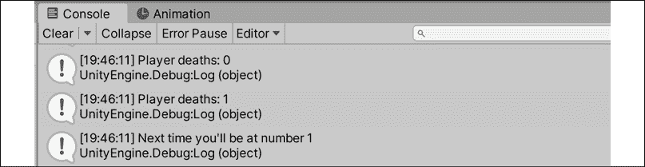
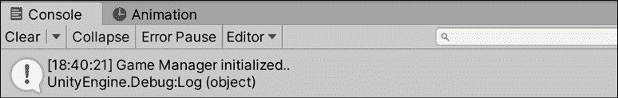
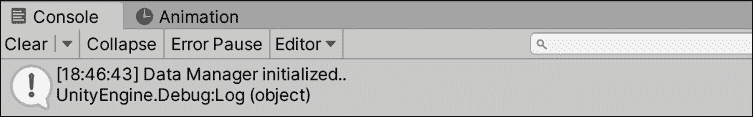

# 10

# 回顾类型、方法和类

现在您已经用 Unity 内置类编程了游戏机制和交互，是时候扩展我们的核心 C#知识，并专注于我们已奠定基础的中级应用。我们将回顾老朋友——变量、类型、方法和类，但我们将针对它们的深入应用和相关用例。我们将讨论的许多主题在当前状态下的*英雄降世*中不适用，因此一些示例将是独立的，而不是直接应用于游戏原型。

我将向您提供大量新信息，所以如果您在任何时候感到不知所措，请不要犹豫，回到前几章以巩固这些基础。我们还将利用本章摆脱游戏机制和 Unity 特有的功能，专注于以下主题：

+   中级修饰符

+   方法重载

+   使用`out`和`ref`参数

+   与接口一起工作

+   抽象类和重写

+   扩展类功能

+   命名空间冲突

+   类型别名

让我们开始吧！

# 访问修饰符

尽管我们已经习惯了将公共和私有访问修饰符与我们的变量声明配对，就像我们在玩家健康和收集到的物品上所做的那样，但仍然有一长串的修饰符关键字我们没有见过。我们无法在本章中详细介绍每一个，但我们将关注的五个将有助于您进一步理解 C#语言，并提升您的编程技能。

本节将介绍以下列表中的前三个修饰符，而剩下的两个将在*中级 OOP*部分稍后讨论：

+   `const`

+   `readonly`

+   `static`

+   `abstract`

+   `override`

您可以在[`docs.microsoft.com/en-us/dotnet/csharp/language-reference/keywords/modifiers`](https://docs.microsoft.com/en-us/dotnet/csharp/language-reference/keywords/modifiers)找到可用的修饰符完整列表。

让我们从前面列表中提供的第一个三个访问修饰符开始。

## 常量和只读属性

有时候您需要创建存储常量、不变值的变量。在变量的访问修饰符后添加`const`关键字就可以做到这一点，但仅限于内置的 C#类型。例如，您不能将我们的`Character`类的实例标记为常量。`GameBehavior`类中的`MaxItems`是一个很好的常量值候选：

```cs
public **const** int MaxItems = 4; 
```

上述代码将基本上锁定`MaxItems`的值为`4`，使其不可更改。您在使用常量变量时可能会遇到的问题是，它们只能在声明时赋值，这意味着我们不能不指定初始值就留下`MaxItems`。作为替代方案，我们可以使用`readonly`，这意味着您不能写入变量，因此它不能被更改：

```cs
public **readonly** int MaxItems; 
```

使用`readonly`关键字声明一个变量将给我们一个与常量相同的不可修改的值，同时仍然允许我们在任何时间分配其初始值。一个好的地方是在我们脚本中的`Start()`或`Awake()`方法中。

## 使用静态关键字

我们已经讨论过如何从类蓝图创建对象或实例，以及所有属性和方法都属于特定的实例，就像我们在第一个`Character`类实例中所做的那样。虽然这对于面向对象的功能来说很棒，但并非所有类都需要实例化，并非所有属性都需要属于特定的实例。然而，静态类是密封的，这意味着它们不能用于类继承。

工具方法正是这种情况的一个好例子，在这种情况下，我们不一定关心实例化特定的`Utility`类实例，因为它的所有方法都不会依赖于特定的对象。你的任务是创建这样一个工具方法在一个新的脚本中。

让我们创建一个新的类来保存我们未来的一些方法，这些方法涉及原始计算或与游戏玩法无关的重复逻辑：

1.  在`Scripts`文件夹中创建一个新的 C#脚本，并将其命名为`Utilities`。

1.  打开它并添加以下代码：

    ```cs
    using System.Collections; 
    using System.Collections.Generic; 
    using UnityEngine; 

    // 1 
    using UnityEngine.SceneManagement; 

    // 2 
    public static class Utilities  
    { 
        // 3 
        public static int PlayerDeaths = 0; 

        // 4 
        public static void RestartLevel() 
        { 
            SceneManager.LoadScene(0); 
            Time.timeScale = 1.0f; 
        } 
    } 
    ```

1.  从`GameBehavior`中的`RestartLevel()`删除代码，而是用以下代码调用新的`utility`方法：

    ```cs
    // 5
    public void RestartScene()
    {
        Utilities.RestartLevel();
    } 
    ```

让我们分解一下代码：

1.  首先，它添加了`using SceneManagement`指令，以便我们可以访问`LoadScene()`方法。

1.  然后，它将`Utilities`声明为一个公共的`static`类，它不继承自`MonoBehavior`，因为我们不需要它在游戏场景中。

1.  接下来，它创建了一个公共的`static`变量来保存玩家死亡并重新开始游戏的次数。

1.  然后，它声明了一个公共的`static`方法来保存我们的关卡重启逻辑，这个逻辑目前硬编码在`GameBehavior`中。

1.  最后，我们的`GameBehavior`更新在按下胜利或失败按钮时从静态的`Utilities`类调用`RestartLevel()`。注意，我们不需要`Utilities`类的实例来调用该方法，因为它本身就是静态的——它只是点符号。

我们现在已经将重启逻辑从`GameBehavior`中提取出来，并将其放入其静态类中，这使得它在代码库中更容易重用。将其标记为`static`也将确保我们在使用其类成员之前永远不需要创建或管理`Utilities`类的实例。

非静态类可以拥有静态和非静态的属性和方法。然而，如果一个类被标记为静态，那么所有的属性和方法都必须遵循同样的规则。

这就结束了我们对变量和类型的第二次访问，这将使你能够在管理更大、更复杂的项目时构建自己的工具集。现在，是时候继续到方法和它们的中间能力了，这包括方法重载和`ref`和`out`参数。

# 回顾方法

自从我们在*第三章*，*深入变量、类型和方法*中学习了如何使用方法以来，方法一直是我们的代码的重要组成部分，但我们还没有涵盖两个中间使用案例：方法重载和使用`ref`和`out`参数关键字。

## 方法重载

**方法重载**这个术语指的是创建多个具有相同名称但具有不同签名的函数。方法的签名由其名称和参数组成，这是 C#编译器识别它的方式。以下是一个方法的例子：

```cs
public bool AttackEnemy(int damage) {} 
```

`AttackEnemy()`方法的签名如下所示：

```cs
AttackEnemy(int) 
```

现在我们知道了`AttackEnemy()`函数的签名，可以通过改变参数数量或参数类型本身来对其进行重载，同时保持其名称不变。这在你需要为特定操作提供多个选项时提供了额外的灵活性。

`Utilities`中的`RestartLevel()`方法是一个很好的例子，说明了方法重载如何派上用场。目前，`RestartLevel()`只重新启动当前关卡，但如果我们扩展游戏使其包含多个场景会发生什么？我们可以重构`RestartLevel()`以接受参数，但这通常会导致代码膨胀且难以理解。

`RestartLevel()`方法再次是一个测试我们新知识的良好候选者。你的任务是重载它以接受不同的参数。

让我们添加一个`RestartLevel()`的重载版本：

1.  打开`Utilities`并添加以下代码：

    ```cs
    public static class Utilities  
    {
        public static int PlayerDeaths = 0;
        public static void RestartLevel()
        {
            SceneManager.LoadScene(0);
            Time.timeScale = 1.0f;
        }
        **// 1** 
        **public****static****bool****RestartLevel****(****int** **sceneIndex****)**
        **{** 
            **// 2** 
            **SceneManager.LoadScene(sceneIndex);**
            **Time.timeScale =** **1.0f****;**
            **// 3** 
            **return****true****;**
        **}** 
    } 
    ```

1.  打开`GameBehavior`并更新对`Utilities.RestartLevel()`方法的调用，如下所示：

    ```cs
    // 4
    public void RestartScene()
    {
        Utilities.RestartLevel(0);
    } 
    ```

让我们分析一下代码：

1.  首先，它声明了一个重载版本的`RestartLevel()`方法，该方法接受一个`int`类型的参数并返回一个`bool`类型的值。

1.  然后，它调用`LoadScene()`并传入`sceneIndex`参数，而不是手动硬编码该值。

1.  然后，在新场景加载并重置`timeScale`属性后，它返回`true`。

1.  最后，我们的`GameBehavior`更新调用重载的`RestartLevel()`方法，并将`0`作为`sceneIndex`传入。重载方法会被 Visual Studio 自动检测并以数字形式显示，如下所示：

    图 10.1：Visual Studio 中的多个方法重载

`RestartLevel()`方法的功能现在可以更加定制化，并可以应对你可能以后需要的额外情况。在这种情况下，它是从我们选择的任何场景重新启动游戏。

方法重载不仅限于静态方法——这只是为了与前面的例子保持一致。任何方法都可以重载，只要其签名与原始签名不同。

接下来，我们将介绍两个可以让你将方法游戏提升到全新水平的话题——`ref`和`out`参数。

## `ref`参数

当我们在*第五章*中讨论类和结构体时，*使用类、结构体和面向对象编程*，我们发现并不是所有对象都是通过相同的方式传递的：值类型是通过复制传递的，而引用类型是通过引用传递的。然而，我们没有讨论当对象或值作为参数传递给方法时是如何使用的。

默认情况下，所有参数都是通过值传递的，这意味着传递给方法的变量将不会受到方法体内对其值所做的任何更改的影响。这保护我们在使用它们作为方法参数时不会对现有变量做出不希望的改变。虽然这适用于大多数情况，但也有一些情况下，你希望通过引用传递方法参数，以便它可以被更新，并且这些更改会在原始变量中得到反映。在参数声明前加上`ref`或`out`关键字将标记该参数为引用。

在使用`ref`关键字时，以下是一些需要记住的关键点：

+   参数在传递给方法之前必须进行初始化。

+   你不需要在方法结束时初始化或分配引用参数的值。

+   具有获取或设置访问器的属性不能用作`ref`或`out`参数。

让我们通过添加一些逻辑来跟踪玩家重启游戏次数来尝试一下。

让我们创建一个方法来更新`PlayerDeaths`，以查看正在传递的引用参数的实际方法参数。

打开`Utilities`并添加以下代码：

```cs
public static class Utilities  
{ 
    public static int PlayerDeaths = 0; 
    **// 1** 
    **public****static****string****UpdateDeathCount****(****ref****int** **countReference****)** 
    **{** 
        **// 2** 
        **countReference +=** **1****;** 
        **return****"Next time you'll be at number "** **+ countReference;**
    **}**
    public static void RestartLevel()
    { 
       // ... No changes needed ...   
    } 
    public static bool RestartLevel(int sceneIndex)
    { 
        **// 3** 
        **Debug.Log(****"Player deaths: "** **+ PlayerDeaths);** 
        **string** **message = UpdateDeathCount(****ref** **PlayerDeaths);**
        **Debug.Log(****"Player deaths: "** **+ PlayerDeaths);**
        **Debug.Log(message);**
        SceneManager.LoadScene(sceneIndex);
        Time.timeScale = 1.0f;
        return true;
    }
} 
```

让我们分解一下代码：

1.  首先，它声明了一个新的`static`方法，该方法返回一个`string`并接受一个通过引用传递的`int`。

1.  然后，它直接更新引用参数，将其值增加`1`，并返回一个包含新值的字符串。

1.  最后，它在将`PlayerDeaths`变量传递给`UpdateDeathCount()`之前和之后，在`RestartLevel(int sceneIndex)`中对其进行调试。我们还把从`UpdateDeathCount()`返回的字符串值存储在`message`变量中，并将其打印出来。

如果你玩游戏并输了，调试日志将显示在`UpdateDeathCount()`函数中`PlayerDeaths`增加了 1，因为它是通过引用传递而不是通过值传递：



图 10.2：引用参数的示例输出

为了清晰起见，我们可以在没有`ref`参数的情况下更新玩家死亡计数，因为`UpdateDeathCount()`和`PlayerDeaths`在同一个脚本中。然而，如果不是这种情况，并且你想要相同的功能，`ref`参数非常有用。

我们在这个例子中使用`ref`关键字是为了说明，但我们也可以在`UpdateDeathCount()`内部直接更新`PlayerDeaths`，或者添加逻辑到`RestartLevel()`中，以便仅在重启是由于失败时才触发`UpdateDeathCount()`。

现在我们知道了如何在项目中使用`ref`参数，让我们来看看`out`参数以及它如何服务于稍微不同的目的。

## 输出参数

`out`关键字与`ref`关键字执行相同的工作，但有不同的规则，这意味着它们是类似工具，但它们不是可互换的——每个都有自己的用例：

+   参数在传递到方法之前不需要初始化。

+   在返回之前，引用参数值需要在调用方法中初始化或分配。

例如，我们可以在`UpdateDeathCount()`中将`ref`替换为`out`，只要我们在从方法返回之前初始化或分配了`countReference`参数：

```cs
public static string UpdateDeathCount(**out** int countReference) 
{ 
     countReference = 1;
     return "Next time you'll be at number " + countReference;
} 
```

使用`out`关键字的函数更适合需要从单个函数返回多个值的情况，而`ref`关键字在只需要修改引用值时效果最佳。它也比`ref`关键字更灵活，因为初始参数值在使用方法之前不需要设置。如果需要在更改之前初始化参数值，`out`关键字特别有用。尽管这些关键字有点晦涩，但它们对于 C#工具箱中的特殊用例来说非常重要。

在掌握了这些新的方法特性之后，是时候回顾一下最重要的一个：**面向对象编程（OOP**）。这个话题内容丰富，不可能在一章或两章中涵盖所有内容，但有一些关键工具将在你的开发生涯早期派上用场。OOP 是那些你完成这本书后鼓励继续跟进的话题之一。

# 中级面向对象编程（OOP）

面向对象的心态对于创建有意义的应用程序和理解 C#语言背后的工作原理至关重要。棘手的部分在于，就 OOP 和设计你的对象而言，类和结构体本身并不是终点。它们始终是代码的构建块，但类限于单继承，这意味着它们只能有一个父类或超类，而结构体则不能继承。所以，你现在应该问自己的问题是简单的：*"我如何从相同的蓝图创建对象，并根据特定场景让它们执行不同的操作？"*

为了回答这个问题，我们将学习接口、抽象类和类扩展。

## 接口

将功能组合在一起的一种方法是通过接口。像类一样，接口是数据和行为的蓝图，但有一个重要的区别：它们不能有任何实际的实现逻辑或存储值。相反，它们包含实现蓝图，而填充接口中概述的值和方法的责任则由采用类或结构体承担。你可以使用接口与类和结构体一起使用，并且单个类或结构体可以采用的接口数量没有上限。

记住，一个类只能有一个父类，结构体根本不能进行子类化。将功能分解到接口中让你可以像积木一样构建类，选择你希望它们如何表现，就像从菜单中选择食物一样。这将大大提高你的代码库的效率，摆脱长而混乱的子类化层次结构。

例如，如果我们想让我们的敌人在我们玩家近距离时能够射击回来怎么办？我们可以创建一个父类，玩家和敌人都可以从中派生出来，这样它们就会基于相同的蓝图。然而，这种方法的问题在于，敌人和玩家不一定会有相同的行为和数据。

处理这个问题的更有效的方法是定义一个接口，其中包含可射击对象需要执行的操作的蓝图，然后让敌人和玩家都采用它。这样，它们就有自由独立并表现出不同的行为，同时仍然共享共同的功能。

将射击机制重构为接口是一个挑战，我将留给你们去完成，但我们仍然需要知道如何在代码中创建和采用接口。对于这个例子，我们将创建一个接口，所有管理脚本可能都需要实现以共享一个共同的结构。

在`Scripts`文件夹中创建一个新的 C#脚本，命名为`IManager`，并按照以下方式更新其代码：

```cs
using System.Collections;
using System.Collections.Generic;
using UnityEngine; 
// 1 
public interface IManager  
{ 
    // 2 
    string State { get; set; } 
    // 3 
    void Initialize();
} 
```

让我们分解一下代码：

1.  首先，它使用`interface`关键字声明了一个名为`IManager`的公共接口。

1.  然后，它向`IManager`添加了一个名为`State`的`string`变量，并提供了`get`和`set`访问器来保存采用类的当前状态。

    所有接口属性至少需要一个 get 访问器才能编译，但如果需要，也可以同时有 get 和 set 访问器。

1.  最后，它定义了一个名为`Initialize()`的方法，没有返回类型，供采用类实现。然而，你完全可以为接口内的方法指定返回类型；没有这样的规则。

你现在已经为所有管理脚本创建了一个蓝图，这意味着采用这个界面的每个管理脚本都需要有一个状态属性和一个初始化方法。你的下一个任务是使用`IManager`接口，这意味着它需要被另一个类采用。

为了保持简单，让我们让游戏管理器采用我们新的接口并实现其蓝图。

使用以下代码更新`GameBehavior`：

```cs
**// 1** 
public class GameBehavior : MonoBehaviour, **IManager** 
{ 
    **// 2** 
    **private****string** **_state;** 
    **// 3** 
    **public****string** **State**  
    **{** 
        **get** **{** **return** **_state; }** 
        **set** **{ _state =** **value****; }** 
    **}**
    // ... No other changes needed ... 
    **// 4** 
    **void****Start****()** 
    **{** 
        **Initialize();** 
    **}**
    **// 5** 
    **public****void****Initialize****()**  
    **{** 
        **_state =** **"Game Manager initialized.."****;**
        **Debug.Log(_state);**
    **}**
} 
```

让我们分解一下代码：

1.  首先，它声明`GameBehavior`采用`IManager`接口，使用逗号和其名称，就像在子类化中一样。

1.  然后，它添加了一个私有变量，我们将使用它来支持从`IManager`中实现的公共`State`值。

1.  接下来，它添加了在`IManager`中声明的公共`State`变量，并使用`_state`作为其私有后置变量。

1.  之后，它声明了`Start()`方法并调用了`Initialize()`方法。

1.  最后，它声明了`IManager`中声明的`Initialize()`方法，其实现将设置并打印出公共`State`变量。

有了这个，我们指定了`GameBehavior`采用`IManager`接口并实现了其`State`和`Initialize()`成员，如下所示：



图 10.3：接口的示例输出

最好的部分是，实现是针对`GameBehavior`特定的；如果我们有另一个管理器类，我们可以做同样的事情，但使用不同的逻辑。为了好玩，让我们设置一个新的管理器脚本来测试这一点：

1.  在**项目**中，在**脚本**文件夹内右键单击，然后选择**创建** | **C# 脚本**，然后将其命名为`DataManager`。

1.  使用以下代码更新新脚本并采用`IManager`接口：

    ```cs
    using System.Collections;
    using System.Collections.Generic;
    using UnityEngine;
    public class DataManager : MonoBehaviour, IManager
    {
        private string _state;
        public string State
        {
            get { return _state; }
            set { _state = value; }
        }
        void Start()
        {
            Initialize();
        }
        public void Initialize()
        {
            _state = "Data Manager initialized..";
            Debug.Log(_state);
        }
    } 
    ```

1.  将新脚本拖放到**层次**面板中的**Game_Manager**对象上！[](img/B17573_10_04.png)

    图 10.4：附加到 GameObject 的数据管理器脚本

1.  然后点击播放：

    图 10.5：数据管理器初始化的输出

尽管我们可以通过子类化来完成所有这些，但我们会被限制在所有管理器的一个父类上。相反，如果我们选择，我们可以添加新的接口。我们将在*第十二章*，*保存、加载和序列化数据*中重新访问这个新的管理器脚本。这为构建类打开了一个全新的世界，其中之一是一个新的面向对象概念，称为抽象类。

## 抽象类

另一种将常见蓝图分离并在对象之间共享的方法是抽象类。与接口一样，抽象类不能为其方法包含任何实现逻辑；然而，它们可以存储变量值。这是与接口的一个关键区别——在可能需要设置初始值的情况下，抽象类将是最佳选择。

从抽象类派生的任何类都必须完全实现所有标记有`abstract`关键字的变量和方法。它们在您想要使用类继承而不必编写基类的默认实现的情况下特别有用。

例如，让我们拿我们刚刚编写的`IManager`接口功能来看看它作为一个抽象基类会是什么样子。*不要更改我们项目中任何实际的代码*，因为我们仍然希望保持事物按原样工作：

```cs
// 1 
public abstract class BaseManager  
{ 
    // 2 
    protected string _state = "Manager is not initialized...";
    public abstract string State { get; set; }
    // 3 
    public abstract void Initialize();
} 
```

让我们分解一下代码：

1.  首先，它使用`abstract`关键字声明了一个名为`BaseManager`的新类。

1.  然后，它创建了两个变量：一个名为`_state`的受保护字符串，只能由继承自`BaseManager`的类访问。我们还为`_state`设置了一个初始值，这是我们在接口中无法做到的。

    +   我们还有一个名为`State`的抽象字符串，它具有`get`和`set`访问器，由子类实现。

1.  最后，它添加了一个`abstract`方法`Initialize()`，也需要在子类中实现。

通过这样做，我们创建了一个与接口做同样事情的抽象类。在这个设置中，`BaseManager`与`IManager`有相同的蓝图，允许任何子类使用`override`关键字定义它们对`state`和`Initialize()`的实现：

```cs
// 1 
public class CombatManager: BaseManager  
{ 
    // 2 
    public override string State 
    { 
        get { return _state; } 
        set { _state = value; } 
    }
    // 3 
    public override void Initialize() 
    { 
        _state = "Combat Manager initialized..";
        Debug.Log(_state);
    }
} 
```

如果我们分解前面的代码，我们可以看到以下内容：

1.  首先，它声明了一个名为`CombatManager`的新类，该类继承自`BaseManager`抽象类。

1.  然后，它使用`override`关键字添加了`State`变量实现。

1.  最后，它再次使用`override`关键字添加了`Initialize()`方法实现，并设置了受保护的`_state`变量。

即使这只是接口和抽象类的一小部分，它们的可能性也应该在你的编程大脑中跳跃。接口将允许你在无关对象之间传播和共享功能片段，当涉及到你的代码时，就像积木一样进行组装。

另一方面，抽象类将允许你保持面向对象编程的单继承结构，同时将类的实现与其蓝图分离。这些方法甚至可以混合使用，因为抽象类可以像非抽象类一样采用接口。

就像处理复杂主题时一样，你的第一步应该是查看文档。请查看[`docs.microsoft.com/en-us/dotnet/csharp/language-reference/keywords/abstract`](https://docs.microsoft.com/en-us/dotnet/csharp/language-reference/keywords/abstract)和[`docs.microsoft.com/en-us/dotnet/csharp/language-reference/keywords/interface`](https://docs.microsoft.com/en-us/dotnet/csharp/language-reference/keywords/interface)。

你并不总是需要从头开始构建一个新类。有时，只需将你想要的功能或逻辑添加到现有类中就足够了，这被称为类扩展。

## 类扩展

让我们暂时离开自定义对象，谈谈我们如何扩展现有类，以便它们符合我们的需求。类扩展背后的想法很简单：取一个现有的内置 C#类，并添加任何你需要的功能。由于我们没有访问 C#构建在之上的底层代码，这是从语言已有的对象中获得自定义行为的唯一方法。

类只能通过方法进行修改——不允许变量或其他实体。尽管这种限制可能很严格，但它使语法保持一致：

```cs
public **static** returnType MethodName(**this** **ExtendingClass** localVal) {} 
```

扩展方法使用与普通方法相同的语法声明，但有一些注意事项：

+   所有扩展方法都需要标记为 `static`。

+   第一个参数需要是 `this` 关键字，后跟我们要扩展的类的名称和局部变量名：

    +   这个特殊参数让编译器能够识别方法为扩展方法，并为我们提供了对现有类的局部引用。

    +   任何类方法和属性都可以通过局部变量访问。

+   将扩展方法存储在静态类中是很常见的，该静态类又存储在其命名空间中。这允许您控制其他脚本对您的自定义功能的访问权限。

您接下来的任务是通过对内置的 C# `String` 类添加一个新方法来将类扩展应用到实践中。

让我们通过向 `String` 类添加一个自定义方法来实际查看扩展方法。在 `Scripts` 文件夹中创建一个新的 C# 脚本，命名为 `CustomExtensions`，并添加以下代码：

```cs
using System.Collections; 
using System.Collections.Generic;
using UnityEngine;  
// 1 
namespace CustomExtensions  
{ 
    // 2 
    public static class StringExtensions 
    { 
        // 3 
        public static void FancyDebug(this string str)
        { 
            // 4 
            Debug.LogFormat("This string contains {0} characters.", str.Length);
        }
    }
} 
```

让我们分解一下代码：

1.  首先，它声明了一个名为 `CustomExtensions` 的命名空间来存放所有的扩展类和方法。

1.  然后，它为了组织目的声明了一个名为 `StringExtensions` 的 `static` 类；每个类扩展组都应该遵循这种设置。

1.  接下来，它在 `StringExtensions` 类中添加了一个名为 `FancyDebug` 的 `static` 方法：

    +   第一个参数，`this string str`，将方法标记为扩展方法。

    +   `str` 参数将保留对 `FancyDebug()` 被调用时的实际文本值的引用；我们可以在方法体内部操作 `str` 作为所有字符串字面量的替身。

1.  最后，每当执行 `FancyDebug` 时，它都会打印出一个调试消息，使用 `str.Length` 来引用被方法调用的字符串变量。

实际上，这将允许您向现有的 C# 类或您自己的自定义类添加任何自定义功能。现在，扩展方法已成为 `String` 类的一部分，让我们来测试一下。要使用我们新的自定义字符串方法，我们需要将其包含在我们想要访问它的任何类中。

打开 `GameBehavior` 并使用以下代码更新类：

```cs
using System.Collections; 
using System.Collections.Generic; 
using UnityEngine; 
**// 1** 
**using** **CustomExtensions;** 

public class GameBehavior : MonoBehaviour, IManager 
{ 
    // ... No changes needed ... 
    void Start() 
    { 
        // ... No changes needed ... 
    } 
    public void Initialize()  
    { 
        _state = "Game Manager initialized..";
        **// 2** 
        **_state.FancyDebug();**
        Debug.Log(_state);
    }
} 
```

让我们分解一下代码：

1.  首先，它在文件顶部添加了 `CustomExtensions` 命名空间和一个 `using` 指令。

1.  然后，它在 `Initialize()` 方法中使用点符号在 `_state` 字符串变量上调用 `FancyDebug`，以打印出其值中单个字符的数量。

使用 `FancyDebug()` 扩展整个 `string` 类意味着任何字符串变量都可以访问它。由于第一个扩展方法参数有一个对 `FancyDebug()` 被调用时的 `string` 值的引用，其长度将正确打印出来，如下所示：


图 10.6：自定义扩展的示例输出

使用相同的语法，自定义类也可以被扩展，但如果您控制该类，通常更常见的是直接在类中添加额外的功能。

在本章中，我们将探讨最后一个主题，即命名空间，我们之前在书中简要介绍过。在下一节中，你将了解命名空间在 C#中扮演的更大角色以及如何创建你的类型别名。

# 命名空间冲突和类型别名

随着你的应用程序变得更加复杂，你将开始将代码分成命名空间，确保你能够控制其访问的位置和时间。你还将使用第三方软件工具和插件来节省时间，实现别人已经提供的功能。这两种情况都表明你在编程知识方面正在进步，但它们也可能导致命名空间冲突。

**命名空间冲突**发生在有两个或更多具有相同名称的类或类型时，这种情况比你想的要多。

良好的命名习惯往往会产生相似的结果，在你意识到之前，你可能会处理多个名为`Error`或`Extension`的类，而 Visual Studio 会抛出错误。幸运的是，C#对这些情况有一个简单的解决方案：**类型别名**。

定义类型别名让你可以明确选择在给定类中要使用哪个冲突的类型，或者为冗长的现有类型创建一个更用户友好的名称。类型别名通过在类文件顶部添加一个`using`指令，然后是别名名称和分配的类型来添加：

```cs
using AliasName = type; 
```

例如，如果我们想创建一个类型别名来引用现有的`Int64`类型，我们可以这样写：

```cs
using CustomInt = System.Int64; 
```

现在，由于`CustomInt`是`System.Int64`类型的类型别名，编译器会将其视为`Int64`，让我们可以像使用任何其他类型一样使用它：

```cs
public CustomInt PlayerHealth = 100; 
```

你可以使用类型别名与你的自定义类型一起使用，或者使用具有相同语法的现有类型，只要它们在脚本文件顶部与`using`指令一起声明。

有关`using`关键字和类型别名的更多信息，请查看 C#文档中的[`docs.microsoft.com/en-us/dotnet/csharp/language-reference/keywords/using-directive`](https://docs.microsoft.com/en-us/dotnet/csharp/language-reference/keywords/using-directive)。

# 摘要

在掌握了新的修饰符、方法重载、类扩展和面向对象技能之后，我们离 C#之旅的终点只有一步之遥。记住，这些中级主题旨在让你思考你在本书中收集到的知识的更复杂应用；不要认为你在这章中学到的就是这些概念的全部。把它当作一个起点，并从这里继续前进。

在下一章中，我们将讨论泛型编程的基础，获得一些关于委托和事件的实践经验，并以异常处理的概述结束。

# 突击测验 – 提升等级

1.  哪个关键字会将变量标记为不可修改但需要初始值？

1.  你会如何创建一个重载的基类方法？

1.  类和接口之间主要的区别是什么？

1.  你会如何解决你其中一个类中的命名空间冲突？

# 加入我们的 Discord 社群！

与其他用户、Unity/C# 专家以及哈里森·费罗内一起阅读这本书。提问，为其他读者提供解决方案，通过 *问我任何问题* 会话与作者聊天，以及更多。

立即加入！

[`packt.link/csharpunity2021`](https://packt.link/csharpunity2021)


