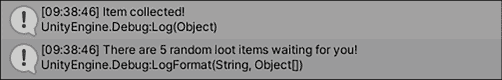
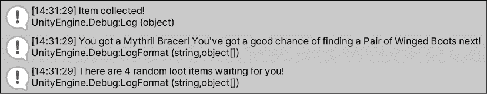

# 第十一章：介绍栈、队列和 HashSet

在上一章中，我们回顾了变量、类型和类，看看它们在本书开头介绍的基本功能之外还能提供什么。在本章中，我们将更深入地研究新的集合类型，并了解它们的中级功能。记住，成为一名优秀的程序员并不仅仅是记住代码，而是选择适合工作的正确工具。

本章中介绍的新集合类型各有其特定用途。对于大多数需要数据集合的场景，列表或数组就足够了。然而，当你需要临时存储或控制集合元素的顺序，或者更具体地说，访问它们的顺序时，可以考虑使用栈和队列。当你需要执行依赖于集合中每个元素都是唯一的操作时，即不重复，可以考虑使用 HashSet。

在你开始下一节中的代码之前，让我们列出你将要学习的内容：

+   介绍栈

+   查看和弹出元素

+   使用队列

+   添加、删除和查看元素

+   使用 HashSet

+   执行操作

# 介绍栈

在最基本层面上，栈是由相同指定类型的元素组成的集合。栈的长度是可变的，这意味着它可以根据包含的元素数量而变化。栈与列表或数组之间的重要区别在于元素是如何存储的。虽然列表或数组通过索引存储元素，但栈遵循**后进先出**（LIFO）模型，这意味着栈中的最后一个元素是第一个可访问的元素。当你想以相反的顺序访问元素时，这很有用。你应该注意，它们可以存储`null`和重复值。一个有用的类比是盘子堆——你最后放在盘子堆上的盘子是第一个你可以轻松取到的。一旦它被移除，下一个即将移除的盘子就变得可访问，以此类推。

本章中所有集合类型都是`System.Collections.Generic`命名空间的一部分，这意味着你需要将以下代码添加到任何你想要使用它们的文件的顶部：

```cs
using System.Collections.Generic; 
```

现在你已经知道了你将要处理的内容，让我们看看声明栈的基本语法。

栈变量声明需要满足以下要求：

+   `Stack`关键字，其元素类型在左右箭头字符之间，以及一个独特的名称

+   使用`new`关键字在内存中初始化栈，后跟`Stack`关键字和箭头字符之间的元素类型

+   一对括号，以分号结尾

在蓝图形式上，它看起来是这样的：

```cs
Stack<elementType> name = new Stack<elementType>(); 
```

与你使用过的其他集合类型不同，栈在创建时不能初始化元素。相反，所有元素都必须在栈创建后添加。

C# 支持非泛型版本的栈类型，不需要你定义栈中元素的类型：

```cs
Stack myStack = new Stack(); 
```

然而，这比使用前面的泛型版本更不安全且成本更高，因此建议使用上面的泛型版本。你可以在 [`github.com/dotnet/platform-compat/blob/master/docs/DE0006.md`](https://github.com/dotnet/platform-compat/blob/master/docs/DE0006.md) 上了解更多关于微软的建议。

你的下一个任务是创建自己的栈，并亲身体验使用其类方法进行操作。

为了测试这一点，你将修改 *英雄降生* 中现有的物品收集逻辑，使用栈来存储可以收集的可能战利品。在这里，栈工作得很好，因为我们不需要担心为获取战利品项提供索引，我们只需每次获取最后添加的一个：

1.  打开 `GameBehavior.cs` 并添加一个名为 `LootStack` 的新栈变量：

    ```cs
    **// 1**
    public Stack<string> LootStack = new Stack<string>(); 
    ```

1.  使用以下代码更新 `Initialize` 方法以向栈中添加新项目：

    ```cs
    public void Initialize() 
    {
        _state = "Game Manager initialized..";
        _state.FancyDebug();
        Debug.Log(_state);
        **// 2**
        **LootStack.Push(****"Sword of Doom"****);**
        **LootStack.Push(****"HP Boost"****);**
        **LootStack.Push(****"Golden Key"****);**
        **LootStack.Push(****"Pair of Winged Boots"****);**
        **LootStack.Push(****"Mythril Bracer"****);**
    } 
    ```

1.  在脚本底部添加一个新方法以打印出栈信息：

    ```cs
    **// 3**
    public void PrintLootReport()
    {
        Debug.LogFormat("There are {0} random loot items waiting 
           for you!", LootStack.Count);
    } 
    ```

1.  打开 `ItemBehavior.cs` 并从 `GameManager` 实例调用 `PrintLootReport`：

    ```cs
    void OnCollisionEnter(Collision collision)
    {
        if(collision.gameObject.name == "Player")
        {
            Destroy(this.transform.parent.gameObject);
            Debug.Log("Item collected!");
            GameManager.Items += 1;

            **// 4**
            **GameManager.PrintLootReport();**
        }
    } 
    ```

拆解它，它执行以下操作：

1.  创建一个空的栈，其元素类型为字符串，以存储我们将添加的战利品项

1.  使用 `Push` 方法向栈中添加字符串元素（即战利品项名称），每次增加其大小

1.  每次调用 `PrintLootReport` 方法时打印出栈计数

1.  每当玩家收集到一个物品时，在 `OnCollisionEnter` 中调用 `PrintLootReport`，这是我们之前章节中通过 Collider 组件设置的

在 Unity 中播放，收集一个物品预制体，并查看打印出的新战利品报告。



图 11.1：使用栈的输出

现在你有一个包含所有游戏战利品的可工作的栈，你就可以通过使用栈类的 `Pop` 和 `Peek` 方法来实验如何访问物品了。

## 弹出和查看

我们已经讨论了栈如何使用 LIFO 方法存储元素。现在，我们需要看看如何在熟悉但不同的集合类型中访问元素——通过查看和弹出：

+   `Peek` 方法返回栈上的下一个项目，但不移除它，让你“查看”它而不做任何改变

+   `Pop` 方法返回并移除栈上的下一个项目，本质上是从栈上“弹出”并交给你

这两种方法都可以单独使用或根据需要结合使用。在接下来的部分，你将亲身体验这两种方法。

你的下一个任务是获取 `LootStack` 中最后添加的物品。在我们的例子中，最后一个元素是在 `Initialize` 方法中程序化确定的，但你也可以在 `Initialize` 中程序化随机化添加到栈中的战利品项的顺序。无论如何，使用以下代码更新 `GameBehavior` 中的 `PrintLootReport()`：

```cs
public void PrintLootReport()
{
    **// 1**
    **var** **currentItem = LootStack.Pop();**
    **// 2**
    **var** **nextItem = LootStack.Peek();**
    **// 3**
    **Debug.LogFormat(****"You got a {0}! You've got a good chance of finding a {1} next!"****, currentItem, nextItem);**
    Debug.LogFormat("There are {0} random loot items waiting for you!", LootStack.Count);
} 
```

下面是发生的事情：

1.  在`LootStack`上调用`Pop`方法，移除栈中的下一个元素并将其存储。记住，栈元素按照 LIFO 模型排序。

1.  在`LootStack`上调用`Peek`方法，并存储栈中的下一个元素而不移除它。

1.  添加一个新的调试日志以打印出被弹出的物品和栈中的下一个物品。

您可以从控制台看到，最后添加到栈中的物品**Mythril Bracer**首先被弹出，接着是**一对翼靴**，它被查看但没有被移除。您还可以看到`LootStack`还剩下四个元素可以访问：



图 11.2：对栈进行弹出和查看的输出

我们的玩家现在可以以它们被添加到栈中的相反顺序拾取战利品物品。例如，第一个拾取的物品将始终是**Mythril Bracer**，接着是**一对翼靴**，然后是**金钥匙**，依此类推。

现在您已经知道了如何创建、添加和查询栈中的元素，我们可以继续讨论一些您可以通过栈类访问的常见方法。

## 常见方法

本节中的每个方法仅用于示例目的，它们不包括在我们的游戏中，因为我们不需要这些功能。

首先，您可以使用`Clear`方法清空或删除栈的全部内容：

```cs
// Empty the stack and reverting the count to 0
LootStack**.Clear();** 
```

如果您想知道元素是否存在于您的栈中，请使用`Contains`方法并指定您要查找的元素：

```cs
// Returns true for "Golden Key" item
var itemFound = LootStack**.Contains(****"Golden Key"****);** 
```

如果您需要将栈的元素复制到数组中，`CopyTo`方法将允许您指定复制操作的目的地和起始索引。这个特性在您需要在数组中的特定位置插入栈元素时非常有用。请注意，您想要复制栈元素到的数组必须已经存在：

```cs
// Creates a new array of the same length as LootStack
string[] CopiedLoot = new string[5]; 
/* 
Copies the LootStack elements into the new CopiedLoot array at index 0\. The index parameter can be set to any index where you want the copied elements to be stored
*/
LootStack**.CopyTo(copiedLoot,** **0****);** 
```

如果您需要将栈转换为数组，只需使用`ToArray()`方法。这种转换会从您的栈中创建一个新的数组，这与`CopyTo()`方法不同，后者将栈元素复制到现有的数组中：

```cs
// Copies an existing stack to a new array
LootStack.ToArray(); 
```

您可以在 C#文档中找到栈的所有方法列表，请参阅[`docs.microsoft.com/dotnet/api/system.collections.generic.stack-1?view=netcore-3.1`](https://docs.microsoft.com/dotnet/api/system.collections.generic.stack-1?view=netcore-3.1)。

这就完成了我们对栈的介绍，但在下一节中，我们将讨论它的表亲——队列。

# 处理队列

与栈类似，队列是由相同类型元素或对象组成的集合。任何队列的长度都是可变的，就像栈一样，这意味着其大小随着元素的添加或移除而改变。然而，队列遵循**先进先出**（FIFO）模型，这意味着队列中的第一个元素是第一个可访问的元素。您应该注意，队列可以存储`null`和重复值，但创建时不能初始化元素。本节中的代码仅用于示例目的，不包括在我们的游戏中。

队列变量的声明需要包含以下内容：

+   `Queue` 关键字，其元素类型位于左右箭头字符之间，以及一个唯一的名称

+   使用 `new` 关键字在内存中初始化队列，后跟 `Queue` 关键字和位于箭头字符之间的元素类型

+   一对括号，以分号结尾

在蓝图形式中，队列看起来如下所示：

```cs
Queue<elementType> name = new Queue<elementType>(); 
```

C# 支持非泛型队列类型，不需要你定义它存储的元素类型：

```cs
Queue myQueue = new Queue(); 
```

然而，这比使用前面的泛型版本更不安全且成本更高。你可以在 [`github.com/dotnet/platform-compat/blob/master/docs/DE0006.md`](https://github.com/dotnet/platform-compat/blob/master/docs/DE0006.md) 上了解更多关于微软推荐的内容。

一个空队列本身并没有什么用处；你希望能够在需要的时候随时添加、删除和查看其元素，这正是下一节的主题。

## 添加、删除和查看

由于前几节中的 `LootStack` 变量很容易就是一个队列，所以为了效率，我们将以下代码保留在我们的游戏脚本之外。然而，你可以自由探索这些类在你自己的代码中的差异或相似之处。

要创建一个字符串元素的队列，请使用以下方法：

```cs
// Creates a new Queue of string values.
Queue<string> activePlayers = new Queue<string>(); 
```

要向队列中添加元素，请使用 `Enqueue` 方法调用你想要添加的元素：

```cs
// Adds string values to the end of the Queue.
activePlayers**.Enqueue(****"Harrison"****);**
activePlayers**.Enqueue(****"Alex"****);**
activePlayers**.Enqueue(****"Haley"****);** 
```

要在不删除它的情况下查看队列中的第一个元素，请使用 `Peek` 方法：

```cs
// Returns the first element in the Queue without removing it.
var firstPlayer = activePlayers**.Peek();** 
```

要返回并删除队列中的第一个元素，请使用 `Dequeue` 方法：

```cs
// Returns and removes the first element in the Queue.
var firstPlayer = activePlayers**.Dequeue();** 
```

现在你已经了解了如何使用队列的基本功能，可以自由探索队列类提供的更中级和高级方法。

## 常见方法

队列和栈几乎具有完全相同的特性，所以我们不会再次详细说明。你可以在 C# 文档中找到完整的方法和属性列表，网址为 [`docs.microsoft.com/dotnet/api/system.collections.generic.queue-1?view=netcore-3.1`](https://docs.microsoft.com/dotnet/api/system.collections.generic.queue-1?view=netcore-3.1)。

在结束本章之前，让我们来看看 HashSet 集合类型以及它特别适合的数学运算。

# 使用 HashSets

在本章中，我们将要接触到的最后一个集合类型是 HashSet。这种集合与我们遇到的其他任何集合类型都大不相同：它不能存储重复值，并且未排序，这意味着其元素没有按任何顺序排列。将 HashSet 视为只有键而没有键值对的字典。

它们可以非常快速地执行集合操作和元素查找，我们将在本节末尾探讨，并且最适合元素顺序和唯一性是首要任务的情况。

HashSet 变量的声明需要满足以下要求：

+   `HashSet` 关键字，其元素类型位于左右箭头字符之间，以及一个唯一的名称

+   使用 `new` 关键字在内存中初始化 HashSet，然后是 `HashSet` 关键字和箭头字符之间的元素类型

+   一对括号，以分号结尾

在蓝图形式中，它看起来如下所示：

```cs
HashSet<elementType> name = new HashSet<elementType>(); 
```

与栈和队列不同，您可以在声明变量时使用默认值来初始化 HashSet：

```cs
HashSet<string> people = new HashSet<string>();
// OR
HashSet<string> people = new HashSet<string>() { "Joe", "Joan", "Hank"}; 
```

要添加元素，请使用 `Add` 方法并指定新元素：

```cs
people**.Add(****"Walter"****);**
people**.Add(****"Evelyn"****);** 
```

要删除元素，请调用 `Remove` 并指定要从 HashSet 中删除的元素：

```cs
people**.Remove(****"Joe"****);** 
```

这就是简单操作的全部内容，在您的编程旅程的这个阶段，这应该开始感觉非常熟悉了。集合操作是 HashSet 集合真正发光的地方，这也是下一节的主题。

## 执行操作

集合操作需要两个东西：一个调用集合对象和一个传入的集合对象。

调用集合对象是您想要根据所使用的操作进行修改的 HashSet，而传入的集合对象用于集合操作的比较。我们将在下面的代码中更详细地介绍这一点，但首先，让我们回顾一下在编程场景中最常见的三个主要集合操作。

在以下定义中，`currentSet` 指的是调用操作方法的 HashSet，而 `specifiedSet` 指的是传入的 HashSet 方法参数。修改后的 HashSet 总是当前集合：

```cs
currentSet.Operation(specifiedSet); 
```

在本节剩余部分，我们将处理三个主要操作：

+   `UnionWith` 将当前集合和指定集合的元素合并在一起

+   `IntersectWith` 仅存储当前集合和指定集合中都存在的元素

+   `ExceptWith` 从当前集合中减去指定集合的元素

还有两组处理子集和超集计算的集合操作，但这些操作针对的是超出本章范围的特定用例。您可以在[`docs.microsoft.com/dotnet/api/system.collections.generic.hashset-1?view=netcore-3.1`](https://docs.microsoft.com/dotnet/api/system.collections.generic.hashset-1?view=netcore-3.1)找到这些方法的所有相关信息。

假设我们有两组玩家名称——一组用于活跃玩家，另一组用于非活跃玩家：

```cs
HashSet<string> activePlayers = new HashSet<string>() { "Harrison", "Alex", "Haley"};
HashSet<string> inactivePlayers = new HashSet<string>() { "Kelsey", "Basel"}; 
```

我们将使用 `UnionWith()` 操作来修改一个集合，使其包含两个集合中的所有元素：

```cs
activePlayers.UnionWith(inactivePlayers);
/* activePlayers now stores "Harrison", "Alex", "Haley", "Kelsey", "Basel"*/ 
```

现在，假设我们有两个不同的集合——一个用于活跃玩家，另一个用于高级玩家：

```cs
HashSet<string> activePlayers = new HashSet<string>() { "Harrison", "Alex", "Haley"};
HashSet<string> premiumPlayers = new HashSet<string>() { "Haley", "Basel"}; 
```

我们将使用 `IntersectWith()` 操作来查找任何既是活跃玩家又是高级会员的玩家：

```cs
activePlayers.IntersectWith(premiumPlayers);
// activePlayers now stores only "Haley" 
```

如果我们想找到所有不是高级会员的活跃玩家呢？我们将通过调用 `ExceptWith` 来做与 `IntersectWith()` 操作相反的事情：

```cs
HashSet<string> activePlayers = new HashSet<string>() { "Harrison", "Alex", "Haley"};
HashSet<string> premiumPlayers = new HashSet<string>() { "Haley",
  "Basel"};
activePlayers.ExceptWith(premiumPlayers);
// activePlayers now stores "Harrison" and "Alex" but removed "Haley" 
```

注意，我在每个操作中使用了两个示例集合的新实例，因为每次操作执行后当前集合都会被修改。如果您在整个过程中一直使用相同的集合，您将得到不同的结果。

现在你已经学会了如何使用 HashSet 进行快速数学运算，是时候结束本章，巩固我们所学的内容了。

# 中级集合汇总

在你继续到摘要和下一章之前，让我们巩固一下我们刚刚学到的关键点。那些与实际游戏原型没有 1 对 1 关系的话题有时需要一些额外的关注。

在这个阶段，你肯定在问自己一个问题：为什么要在可以使用列表的情况下使用这些其他的集合类型？这是一个非常合理的问题。简单的答案是，当在正确的情况下使用时，栈、队列和 HashSet 比列表提供更好的性能。例如，当你需要以特定顺序存储项目并以特定顺序访问它们时，栈会比列表更有效率。

更复杂的答案是，使用不同的集合类型强制了你的代码如何与它们及其元素交互。这是良好代码设计的标志，因为它消除了你对如何使用集合的任何歧义。当你在不知道要执行什么函数时，列表无处不在，事情会变得混乱。

就像我们在本书中学到的所有内容一样，始终最好使用适合当前任务的正确工具。更重要的是，你需要有不同类型的工具可供选择。

# 摘要

恭喜你，你几乎到达了终点！在本章中，你学习了三种新的集合类型，以及它们在不同情况下的使用方法。

如果你想要以它们被添加的相反顺序访问你的集合元素，栈是不错的选择；如果你想要以顺序访问你的元素，队列是你的选择；两者都是临时存储的理想选择。这些集合类型与列表或数组之间的重要区别在于它们可以通过弹出和查看操作进行访问。最后，你学习了强大的 HashSet 及其基于性能的数学集合操作。在需要处理唯一值并在大型集合上执行添加、比较或减法操作的情况下，这些是关键。

在下一章中，随着你接近本书的结尾，你将更深入地了解 C#的中级世界，包括委托、泛型等。即使你已经学到了所有这些，最后一页仍然是另一段旅程的开始。

# 突击测验 - 中级集合

1.  哪种集合类型使用 LIFO 模型存储其元素？

1.  哪种方法让你能够在不删除它的情况下查询栈中的下一个元素？

1.  栈和队列可以存储`null`值吗？

1.  你会如何从一个 HashSet 中减去另一个 HashSet？

# 加入我们的 Discord！

与其他用户、Unity/C#专家和哈里森·费罗尼一起阅读这本书。提出问题，为其他读者提供解决方案，通过*问我任何问题*会议与作者聊天等等。

立即加入！

[`packt.link/csharpunity2021`](https://packt.link/csharpunity2021)


