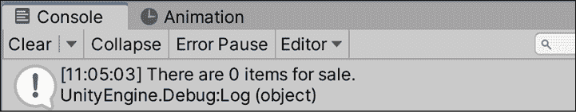
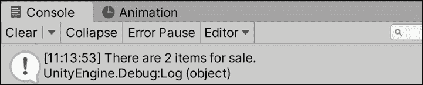
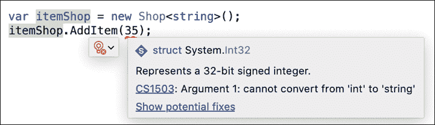
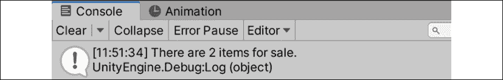
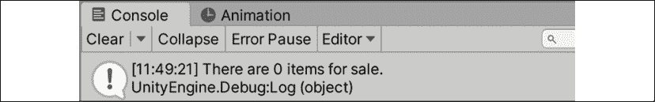
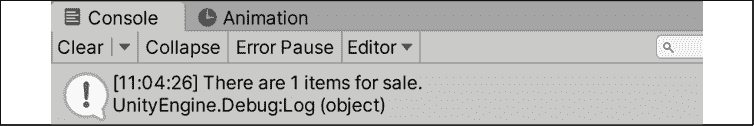
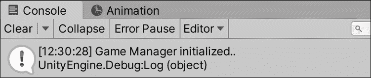
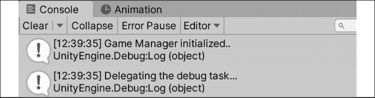
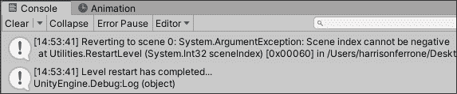

# 第十三章：探索泛型、委托以及更多

你编程的时间越长，你就越开始思考系统。如何结构化类和对象之间的交互、通信和数据交换是我们迄今为止所处理的一些系统；现在的问题是，如何使它们更安全、更高效。

由于这将本书的最后一章，我们将讨论泛型编程概念、委托、事件创建和错误处理的例子。每个主题本身都是一个庞大的研究领域，所以请将这里学到的知识应用到你的项目中。完成我们的实际编码后，我们将简要概述设计模式及其在你未来编程旅程中的作用。

在本章中，我们将涵盖以下主题：

+   泛型编程

+   使用委托

+   创建事件和订阅

+   抛出和处理错误

+   理解设计模式

# 介绍泛型

我们迄今为止的所有代码在定义和使用类型方面都非常具体。然而，会有一些情况，你需要一个类或方法以相同的方式处理其实体，而不管其类型如何，同时仍然保持类型安全。泛型编程允许我们使用占位符而不是具体类型来创建可重用的类、方法和变量。

当在编译时创建泛型类实例或使用方法时，将分配一个具体类型，但代码本身将其视为泛型类型。当你需要以相同的方式处理不同的对象类型时，能够编写泛型代码是一个巨大的好处，例如，需要能够对元素执行相同操作的定制集合类型，或者需要相同底层功能的类。虽然你可能想知道为什么我们不直接使用子类或接口，但你将在我们的例子中看到泛型以不同的方式帮助我们。

我们已经通过 `List` 类型看到了这一点，它是一个泛型类型。我们可以访问它的所有添加、删除和修改功能，无论它存储的是整数、字符串还是单个字符。

## 泛型对象

创建泛型类与创建非泛型类的工作方式相同，但有一个重要的区别：它的泛型类型参数。让我们看看一个我们可能想要创建的泛型集合类的例子，以更清楚地了解它是如何工作的：

```cs
public class SomeGenericCollection**<****T****>** {} 
```

我们已经声明了一个名为 `SomeGenericCollection` 的泛型集合类，并指定其类型参数将被命名为 `T`。现在，`T` 将代表泛型列表将存储的元素类型，并且可以在泛型类内部像任何其他类型一样使用。

每当我们创建一个 `SomeGenericCollection` 的实例时，我们需要指定它可以存储的值的类型：

```cs
SomeGenericCollection**<****int****>** highScores = new SomeGenericCollection<int>(); 
```

在这种情况下，`highScores`存储整数值，而`T`代表`int`类型，但`SomeGenericCollection`类将对待任何元素类型相同。

你可以完全控制泛型类型参数的命名，但在许多编程语言中，行业标准是使用大写`T`。如果你打算以不同的方式命名你的类型参数，请考虑以大写`T`开头，以保持一致性和可读性。

接下来，让我们通过以下步骤创建一个更专注于游戏的示例，使用泛型`Shop`类来存储一些虚构的库存项目：

1.  在`Scripts`文件夹中创建一个新的 C#脚本，命名为`Shop`，并更新其代码如下：

    ```cs
    using System.Collections;
    using System.Collections.Generic;
    using UnityEngine;

    // 1
    public class Shop<T>
    {
        // 2
        public List<T> inventory = new List<T>();
    } 
    ```

1.  在`GameBehavior`中创建一个新的`Shop`实例：

    ```cs
    public class GameBehavior : MonoBehaviour, IManager
    {
        // ... No other changes needed ...

        public void Initialize()
        {
            // 3
            var itemShop = new Shop<string>();
            // 4
            Debug.Log("There are " + itemShop.inventory.Count + " items for sale.");
        }
    } 
    ```

让我们分解一下代码：

1.  声明一个新的名为`IShop`的泛型类，具有类型参数`T`

1.  添加一个类型为`T`的库存`List<T>`来存储我们初始化泛型类时使用的任何项目类型

1.  在`GameBehavior`中创建一个新的`Shop<string>`实例，并指定字符串值作为泛型类型

1.  输出带有库存数量的调试信息：

    图 13.1：泛型类的控制台输出

在功能方面，这里还没有发生任何新的事情，但 Visual Studio 由于泛型类型参数`T`，将`Shop`识别为泛型类。这使我们能够包含额外的泛型操作，如添加库存项目或查找每种项目的可用数量。

值得注意的是，Unity 序列化器默认不支持泛型。如果你想要序列化泛型类，就像我们在上一章中自定义类那样，你需要在类顶部添加`Serializable`属性，就像我们在`Weapon`类中做的那样。更多信息可以在[`docs.unity3d.com/ScriptReference/SerializeReference.html`](https://docs.unity3d.com/ScriptReference/SerializeReference.html)找到。

## 泛型方法

一个独立的泛型方法可以有一个占位符类型参数，就像泛型类一样，这允许它根据需要包含在泛型或非泛型类中：

```cs
public void GenericMethod**<****T****>**(**T** genericParameter) {} 
```

`T`类型可以在方法体中使用，并在调用方法时定义：

```cs
GenericMethod**<****string****>(****"Hello World!"****)**; 
```

如果你想在泛型类中声明一个泛型方法，你不需要指定一个新的`T`类型：

```cs
public class SomeGenericCollection<T> 
{
    public void NonGenericMethod(**T** genericParameter) {}
} 
```

当你调用一个使用泛型类型参数的非泛型方法时，没有问题，因为泛型类已经处理了分配具体类型：

```cs
SomeGenericCollection**<****int****>** highScores = new SomeGenericCollection
<int> ();
highScores.NonGenericMethod(**35**); 
```

泛型方法可以重载并标记为静态，就像非泛型方法一样。如果你想知道那些情况下的特定语法，请查看[`docs.microsoft.com/en-us/dotnet/csharp/programming-guide/generics/generic-methods`](https://docs.microsoft.com/en-us/dotnet/csharp/programming-guide/generics/generic-methods)。

你的下一个任务是创建一个方法，用于向库存中添加新的泛型项目，并在`GameBehavior`脚本中使用它。

由于我们已经有了一个具有定义类型参数的泛型类，让我们添加一个非泛型方法来看看它们是如何一起工作的：

1.  打开 `Shop` 并按照以下方式更新代码：

    ```cs
    public class Shop<T>
    {
        public List<T> inventory = new List<T>();
        **// 1**
        **public****void****AddItem****(****T newItem****)**
        **{**

            **inventory.Add(newItem);**
        **}**
    } 
    ```

1.  进入 `GameBehavior` 并向 `itemShop` 添加一个物品：

    ```cs
    public class GameBehavior : MonoBehaviour, IManager
    {
        // ... No other changes needed ...

         public void Initialize()
        {
            var itemShop = new Shop<string>();
            **// 2**
            itemShop**.AddItem(****"Potion"****);**
            itemShop**.AddItem(****"Antidote"****);**
           Debug.Log("There are " + itemShop.inventory.Count + " items for sale.");
        }
    } 
    ```

让我们分解一下代码：

1.  声明一个用于向库存添加 `newItems` 类型 `T` 的方法

1.  使用 `AddItem()` 向 `itemShop` 添加两个字符串项并打印出调试日志：

    图 13.2：向泛型类添加物品后的控制台输出

我们编写了 `AddItem()` 方法来接受与我们的泛型 `Shop` 实例相同类型的参数。由于 `itemShop` 是用来存储字符串值的，所以我们添加 `"Potion"` 和 `"Antidote"` 字符串值时没有任何问题。

然而，如果你尝试添加一个整数，例如，你会得到一个错误，说 `itemShop` 的泛型类型不匹配：



图 13.3：通用类中的转换错误

现在你已经编写了一个泛型方法，你需要知道如何在单个类中使用多个泛型类型。例如，如果我们想在 `Shop` 类中添加一个方法来找出给定物品在库存中有多少，我们不能再次使用类型 `T`，因为它已经在类定义中定义了。那么我们该怎么办？

将以下方法添加到 `Shop` 类的底部：

```cs
// 1
public int GetStockCount<U>()
{
    // 2
    var stock = 0;
    // 3
    foreach (var item in inventory)
    {
        if (item is U)
        {
            stock++;
        }
    }
    // 4
    return stock;
} 
```

让我们分解我们的新方法：

1.  声明一个返回库存中找到的匹配类型 `U` 的物品数量的 int 值的方法

    +   泛型类型参数的命名完全取决于你，就像命名变量一样。传统上，它们从 `T` 开始，并从那里按字母顺序继续。

1.  创建一个变量来保存我们找到的匹配库存物品的数量，并最终从库存中返回

1.  使用 `foreach` 循环遍历库存列表，每次找到匹配项时增加库存值

1.  返回匹配库存物品的数量

这里的问题是我们将字符串值存储在我们的商店中，如果我们尝试查找有多少字符串类型的物品，我们将得到完整的库存：

```cs
Debug.Log("There are " + itemShop.GetStockCount<string>() + " items for sale."); 
```

这将在控制台打印出类似以下内容：



图 13.4：使用多个泛型字符串类型的控制台输出

另一方面，如果我们尝试在我们的库存中查找整数类型，我们将得到没有结果，因为我们只存储字符串：

```cs
Debug.Log("There are " + itemShop.GetStockCount<int>() + " items for sale."); 
```

这将在控制台打印出类似以下内容：



图 13.5：使用多个不匹配的泛型类型的控制台输出

由于我们无法确保我们的商店库存既能存储又能搜索相同类型的物品，因此这两种情况都不是理想的。但正是在这里，泛型真正发光——我们可以为我们的泛型类和方法添加规则，以强制执行我们想要的行为，这将在下一节中介绍。

## 约束类型参数

泛型的一个优点是它们的类型参数可以被限制。这可能与到目前为止我们所学的泛型知识相矛盾，但仅仅因为一个类 *可以* 包含任何类型，并不意味着它应该被允许这样做。

要约束泛型类型参数，我们需要一个新的关键字和之前未见过语法：

```cs
public class SomeGenericCollection<T> where T: ConstraintType {} 
```

`where` 关键字定义了 `T` 必须满足的规则，才能作为泛型类型参数使用。它本质上表示 `SomeGenericClass` 可以接受任何符合约束类型的 `T` 类型。约束规则并不是什么神秘或可怕的东西；它们是我们已经讨论过的概念：

+   添加 `class` 关键字将限制 `T` 只能是类类型

+   添加 `struct` 关键字将限制 `T` 只能是结构体类型

+   将接口，例如 `IManager`，作为类型添加将限制 `T` 只能是采用该接口的类型

+   添加一个自定义类，例如 `Character`，将限制 `T` 只能是该类类型

如果你需要一个更灵活的方法来处理具有子类的类，你可以使用 `where T : U`，这指定了泛型 `T` 类型必须是 `U` 类型或从 `U` 类型派生的。这对于我们的需求来说有点高级，但你可以在 [`docs.microsoft.com/en-us/dotnet/csharp/programming-guide/generics/constraints-on-type-parameters`](https://docs.microsoft.com/en-us/dotnet/csharp/programming-guide/generics/constraints-on-type-parameters) 找到更多详细信息。

为了好玩，让我们将 `Shop` 限制为只能接受一个名为 `Collectable` 的新类型：

1.  在 `Scripts` 文件夹中创建一个新的脚本，命名为 `Collectable`，并添加以下代码：

    ```cs
    using System.Collections;
    using System.Collections.Generic;
    using UnityEngine;

    public class Collectable
    {
        public string name;
    }

    public class Potion : Collectable
    {
        public Potion()
        {
            this.name = "Potion";
        }
    }

    public class Antidote : Collectable
    {
        public Antidote()
        {
            this.name = "Antidote";
        }
    } 
    ```

    我们在这里所做的一切只是声明了一个名为 `Collectable` 的新类，具有一个名称属性，并为药水和解药创建了子类。有了这种结构，我们可以强制 `Shop` 只接受 `Collectable` 类型，并且我们的库存查找方法也只接受 `Collectable` 类型，这样我们就可以进行比较并找到匹配项。

1.  打开 `Shop` 并更新类声明：

    ```cs
    public class Shop<T> **where****T** **:** **Collectable** 
    ```

1.  更新 `GetStockCount()` 方法以约束 `U` 等于初始泛型 `T` 类型：

    ```cs
    public int GetStockCount<U>() **where** **U : T**
    {
        var stock = 0;
        foreach (var item in inventory)
        {
            if (item is U)
            {
                stock++;
            }
        }
        return stock;
    } 
    ```

1.  在 `GameBehavior` 中，更新 `itemShop` 实例到以下代码：

    ```cs
    var itemShop = new Shop<**Collectable**>();
    itemShop.AddItem(**new** **Potion()**);
    itemShop.AddItem(**new** **Antidote()**);
    Debug.Log("There are " + itemShop.GetStockCount<**Potion**>() + " items for sale."); 
    ```

    这将导致以下输出：

    

    图 13.6：更新后的 GameBehavior 脚本输出

在我们的示例中，我们可以确保我们的商店中只允许收集类型。如果我们不小心在代码中尝试添加非收集类型，Visual Studio 将会提醒我们正在尝试破坏自己的规则！

## 将泛型添加到 Unity 对象中

泛型也可以与 Unity 脚本和 GameObject 一起使用。例如，我们可以轻松地创建一个泛型可销毁类，用于从场景中删除我们想要删除的任何 `MonoBehaviour` 或对象 `Component`。如果这听起来很熟悉，这就是我们的 `BulletBehavior` 为我们做的事情，但它不适用于除该脚本之外的任何东西。为了使这个功能更具可扩展性，让我们使任何从 `MonoBehaviour` 继承的脚本都成为可销毁的。

1.  在 `Scripts` 文件夹中创建一个新的脚本，命名为 `Destroyable`，并添加以下代码：

    ```cs
    using System.Collections;
    using System.Collections.Generic;
    using UnityEngine;

    public class Destroyable<T> : MonoBehaviour where T : MonoBehaviour
    {
        public int OnscreenDelay;

        void Start()
        {
            Destroy(this.gameObject, OnscreenDelay);
        }
    } 
    ```

1.  删除 `BulletBehavior` 中的所有代码，并从新的泛型类继承：

    ```cs
    public class BulletBehavior : **Destroyable****<****BulletBehavior****>**
    {
    } 
    ```

现在，我们已经将 `BulletBehavior` 脚本转换成了一个泛型可销毁对象。子弹预制体没有变化，但我们可以通过从泛型 `Destroyable` 类继承来使任何其他对象可销毁。在我们的例子中，如果我们创建了多个弹道预制体并希望它们都能在特定时间被销毁，这将提高代码的效率和可重用性。

泛型编程是我们工具箱中的强大工具，但在掌握了基础知识之后，随着你在编程旅程中的进步，现在是时候讨论一个同样重要的主题了——委托！

# 委托动作

有时候，你需要将方法从文件 A 传递到文件 B，或者委托执行。在 C# 中，这可以通过委托类型来实现，它存储对方法的引用，可以像任何其他变量一样处理。唯一的限制是，委托本身和任何分配的方法需要具有相同的签名——就像整数变量只能持有整数，字符串只能持有文本一样。

创建委托是编写函数和声明变量之间的混合：

```cs
public **delegate** returnType DelegateName(int param1, string param2); 
```

你从一个访问修饰符开始，后面跟着 `delegate` 关键字，它将编译器识别为 `delegate` 类型。`delegate` 类型可以有一个返回类型和名称，就像常规函数一样，如果需要还可以有参数。然而，这个语法只声明了 `delegate` 类型本身；要使用它，你需要创建一个实例，就像我们处理类一样：

```cs
public **DelegateName** someDelegate; 
```

声明了一个 `delegate` 类型变量后，很容易分配一个与委托签名匹配的方法：

```cs
public DelegateName someDelegate = **MatchingMethod**;
public void **MatchingMethod****(****int** **param1,** **string** **param2****)** 
{
    // ... Executing code here ...
} 
```

注意，在将 `MatchingMethod` 分配给 `someDelegate` 变量时，你不需要包括括号，因为此时并没有调用方法。它所做的只是将 `MatchingMethod` 的调用责任委托给 `someDelegate`，这意味着我们可以像这样调用函数：

```cs
someDelegate(); 
```

在这个阶段，你的 C# 技能发展可能觉得有些繁琐，但我向你保证，能够将方法和执行存储为变量将在以后派上用场。

## 创建调试委托

让我们创建一个简单的委托类型来定义一个接受字符串的方法，并最终使用分配的方法将其打印出来。打开 `GameBehavior` 并添加以下代码：

```cs
public class GameBehavior : MonoBehaviour, IManager
{
    // ... No other changes needed ...

    **// 1**
    **public****delegate****void****DebugDelegate****(****string** **newText****)****;**

    **// 2**
    **public** **DebugDelegate debug = Print;**

    public void Initialize() 
    {
        _state = "Game Manager initialized..";
        _state.FancyDebug();
        **// 3**
        **debug(_state);**
   // ... No changes needed ...
    }
    **// 4**
    **public****static****void****Print****(****string** **newText****)**
    **{**
        **Debug.Log(newText);**
    **}**
} 
```

让我们分解一下代码：

1.  声明一个名为`DebugDelegate`的`public delegate`类型，用于存储接受一个`string`参数并返回`void`的方法

1.  创建一个新的名为`debug`的`DebugDelegate`实例，并将其分配给一个具有匹配签名的名为`Print()`的方法

1.  将`Initialize()`中的`Debug.Log(_state)`代码替换为对`debug`委托实例的调用

1.  将`Print()`声明为接受一个`string`参数并将其记录到控制台中的`static`方法：

    图 13.7：委托动作的控制台输出

控制台中的内容没有变化，但在`Initialize()`中直接调用`Debug.Log()`的操作已经委托给了`debug`委托实例。虽然这是一个简单的例子，但在你需要存储、传递和执行方法时，委托是一个强大的工具。

在 Unity 中，我们已经通过使用`OnCollisionEnter()`和`OnCollisionExit()`方法来处理委托的示例，这些方法是通过委托调用的。在现实世界中，自定义委托与事件结合使用时最为有用，我们将在本章的后续部分看到这一点。

## 作为参数类型的委托

由于我们已经看到了如何创建用于存储方法的委托类型，因此一个委托类型也可以用作方法参数本身。这并不比我们之前所做的工作远，但了解这一点是个好主意。

让我们看看如何将委托类型用作方法参数。用以下代码更新`GameBehavior`：

```cs
public class GameBehavior : MonoBehaviour, IManager
{
    // ... No changes needed ...
    public void Initialize() 
    {
        _state = "Game Manager initialized..";
        _state.FancyDebug();
        debug(_state);
        **// 1**
        **LogWithDelegate(debug);**
    }
    **// 2**
    **public****void****LogWithDelegate****(****DebugDelegate del****)**
    **{**
        **// 3**
        **del(****"Delegating the debug task..."****);**
    **}**
} 
```

让我们分解一下代码：

1.  调用`LogWithDelegate()`并传入我们的`debug`变量作为其类型参数

1.  声明一个新的方法，它接受一个`DebugDelegate`类型的参数

1.  调用委托参数的函数，并传入一个要打印的字符串字面量：

    图 13.8：作为参数类型的委托的控制台输出

我们创建了一个接受`DebugDelegate`类型参数的方法，这意味着实际传入的参数将代表一个方法，可以将其视为一个方法。将这个例子想象成一个委托链，其中`LogWithDelegate()`距离实际执行调试的方法`Print()`有两个步骤。在游戏或应用场景中，创建这样的委托链并不总是常见的解决方案，但当你需要控制委托级别时，了解相关的语法就很重要了。这在你的委托链分布在多个脚本或类中的场景中尤其如此。

如果错过了一个重要的心理联系，委托就很容易迷失方向，所以请回顾本节开头的代码，并查看[`docs.microsoft.com/en-us/dotnet/csharp/programming-guide/delegates/`](https://docs.microsoft.com/en-us/dotnet/csharp/programming-guide/delegates/)上的文档。

现在你已经知道了如何使用基本委托，是时候讨论如何使用事件在多个脚本之间高效地传递信息了。说实话，委托的最佳用途是与事件配对，我们将在下一节中深入探讨。

# 触发事件

C#事件允许你基于游戏或应用程序中的动作创建一个基于动作的订阅系统。例如，如果你想发送一个事件，每当收集到物品或玩家按下空格键时，你可以这样做。然而，当事件触发时，它不会自动有一个订阅者或接收者来处理事件动作之后需要执行的任何代码。

任何类都可以通过调用触发事件的类来订阅或取消订阅事件；就像在 Facebook 上分享新帖子时在手机上注册接收通知一样，事件形成了一种分布式信息高速公路，用于在应用程序中共享动作和数据。

声明事件与声明委托类似，因为事件具有特定的方法签名。我们将使用委托来指定事件应具有的方法签名，然后使用`delegate`类型和`event`关键字创建事件：

```cs
public delegate void EventDelegate(int param1, string param2);
public **event** EventDelegate eventInstance; 
```

这种设置使我们能够将`eventInstance`视为一个方法，因为它是一个委托类型，这意味着我们可以通过调用它来在任何时候发送它：

```cs
eventInstance(35, "John Doe"); 
```

你的下一个任务是创建一个自己的事件，并在`PlayerBehavior`内部适当的位置触发它。

## 创建和调用事件

让我们创建一个事件，每当我们的玩家跳跃时触发。打开`PlayerBehavior`并添加以下更改：

```cs
public class PlayerBehavior : MonoBehaviour 
{
    // ... No other variable changes needed ...
    **// 1**
    **public****delegate****void****JumpingEvent****()****;**
    **// 2**
    **public****event** **JumpingEvent playerJump;**
    void Start()
    {
        // ... No changes needed ...
    }
    void Update() 
    {
        // ... No changes needed ...
;
    }
    void FixedUpdate()
    {
        if(IsGrounded() &&  _isJumping)
        {
            _rb.AddForce(Vector3.up * jumpVelocity,
               ForceMode.Impulse);
            **// 3**
            **playerJump();**
        }
    }
    // ... No changes needed in IsGrounded or OnCollisionEnter
} 
```

让我们分解一下代码：

1.  声明一个新的返回`void`且不接受任何参数的`delegate`类型

1.  创建一个名为`playerJump`的`JumpingEvent`类型事件，它可以被视为一个与前面委托的`void`返回值和没有参数签名匹配的方法

1.  在`Update()`中应用力后调用`playerJump`

我们已经成功创建了一个不接受任何参数且不返回任何内容的简单委托类型，以及一个每当玩家跳跃时执行的事件类型。每次玩家跳跃时，`playerJump`事件都会发送给所有订阅者，以通知他们该动作。

事件触发后，处理它并执行任何附加操作的责任就交给了其订阅者；我们将在下一节“处理事件订阅”中看到这一点。

## 处理事件订阅

目前，我们的`playerJump`事件没有订阅者，但改变这一点很简单，并且与我们在上一节中为委托类型分配方法引用的方式非常相似：

```cs
someClass.eventInstance += EventHandler; 
```

由于事件是它们声明的类中的变量，而订阅者是其他类，因此订阅需要事件包含类的引用。使用 `+=` 操作符分配一个在事件执行时触发的方法，就像设置自动回复邮件一样。像分配委托一样，事件处理方法的方法签名必须与事件类型匹配。在我们的先前的语法示例中，这意味着 `EventHandler` 需要是以下形式：

```cs
public void EventHandler(int param1, string param2) {} 
```

在需要取消订阅事件的情况下，你只需使用 `-=` 操作符执行赋值的逆操作：

```cs
someClass.eventInstance -= EventHandler; 
```

事件订阅通常在类初始化或销毁时处理，这使得管理多个事件而无需编写混乱的代码实现变得容易。

现在你已经知道了订阅和取消订阅事件的语法，现在是时候在 `GameBehavior` 脚本中将这些应用到实践中了。

现在我们的事件在玩家跳跃时每次都会触发，我们需要一种方法来捕捉这个动作：

1.  返回到 `GameBehavior` 并更新以下代码：

    ```cs
    public class GameBehavior : MonoBehaviour, IManager
    {
        // 1
        public PlayerBehavior playerBehavior;

        // 2
        void OnEnable()
        {
            // 3
            GameObject player = GameObject.Find("Player");
            // 4
            playerBehavior = player.GetComponent<PlayerBehavior>();
            // 5
            playerBehavior.playerJump += HandlePlayerJump;
            debug("Jump event subscribed...");
        }

        // 6
        public void HandlePlayerJump()
        {
             debug("Player has jumped...");
        **}**
        // ... No other changes ...
    } 
    ```

让我们分解一下代码：

1.  创建一个类型为 `PlayerBehavior` 的公共变量

1.  声明 `OnEnable()` 方法，该方法在脚本附加的对象在场景中变为活动状态时被调用

    `OnEnable` 是 `MonoBehaviour` 类中的一个方法，因此所有 Unity 脚本都可以访问它。这是一个放置事件订阅的好地方，而不是使用 `Awake`，因为它只在对象活动时执行，而不是在加载过程中。

1.  在场景中找到 `Player` 对象，并将它的 `GameObject` 存储在一个局部变量中

1.  使用 `GetComponent()` 获取附加到 `Player` 的 `PlayerBehavior` 类的引用，并将其存储在 `playerBehavior` 变量中

1.  使用 `+=` 操作符订阅 `PlayerBehavior` 中声明的 `playerJump` 事件，并使用名为 `HandlePlayerJump` 的方法

1.  声明 `HandlePlayerJump()` 方法，其签名与事件类型匹配，并在每次接收到事件时使用调试委托记录成功消息！:

    图 13.9：委托事件订阅的控制台输出

为了在 `GameBehavior` 中正确订阅并接收事件，我们必须获取附加到玩家上的 `PlayerBehavior` 类的引用。我们本可以一行完成这个操作，但将其拆分会使代码更易读。然后我们为 `playerJump` 事件分配了一个方法，该方法在接收到事件时执行，并完成订阅过程。

现在每次你跳跃时，你都会看到一个包含事件消息的调试信息：


图 13.10：委托事件触发的控制台输出

由于事件订阅是在脚本中配置的，而脚本附加到 Unity 对象上，我们的工作还没有完成。我们还需要处理当对象被销毁或从场景中移除时如何清理订阅，这将在下一节中介绍。

## 清理事件订阅

尽管在我们的原型中玩家永远不会被销毁，但在游戏中失败时这是一个常见的功能。始终重要的是要清理事件订阅，因为它们会占用分配的资源，正如我们在*第十二章*，*保存、加载和序列化数据*中讨论的那样。

我们不希望订阅的对象被销毁后还有任何订阅存在，所以让我们清理我们的跳跃事件。在`OnEnable`方法之后向`GameBehavior`添加以下代码：

```cs
// 1
private void OnDisable()
{
    // 2
    playerBehavior.playerJump -= HandlePlayerJump;
    debug("Jump event unsubscribed...");
} 
```

让我们分解一下我们的新代码添加部分：

1.  声明`OnDisable()`方法，它属于`MonoBehavior`类，是之前使用的`OnEnable()`方法的配套方法

    +   你需要编写的任何清理代码通常都应该放在这个方法中，因为它在脚本附加的对象不活动时执行

1.  使用`-=`运算符从`HandlePlayerJump`取消订阅`playerJump`事件，并打印出控制台消息

现在我们的脚本在 GameObject 启用和禁用时正确地订阅和取消订阅事件，在我们的游戏场景中不留任何未使用的资源。

这就结束了我们对事件的讨论。现在你可以从单个脚本中广播事件到游戏的每个角落，并应对玩家生命值减少、收集物品或更新 UI 等场景。然而，我们仍然需要讨论一个非常重要的主题，没有这个主题任何程序都无法成功，那就是错误处理。

# 异常处理

高效地将错误和异常集成到你的代码中，是你编程旅程中专业和个人基准的一部分。在你开始大喊“我花了这么多时间试图避免错误，为什么要添加错误？！”之前，你应该知道，我的意思并不是添加错误来破坏你现有的代码。恰恰相反——包括错误或异常，并在功能部件使用不当时适当地处理它们，会使你的代码库更强大，更不容易崩溃，而不是更弱。

## 抛出异常

当我们谈论添加错误时，我们将其过程称为*异常抛出*，这是一个恰当的视觉类比。抛出异常是防御性编程的一部分，本质上意味着你积极地、有意识地保护你的代码免受不正确或不计划的操作。为了标记这些情况，你从一个方法中抛出一个异常，然后由调用代码处理。

让我们举一个例子：假设我们有一个`if`语句，在允许玩家注册之前检查玩家的电子邮件地址是否有效。如果输入的电子邮件地址无效，我们希望我们的代码抛出异常：

```cs
public void ValidateEmail(string email)
{
    if(!email.Contains("@"))
    {
        **throw****new** **System.ArgumentException(****"Email is invalid"****);**
    }
} 
```

我们使用`throw`关键字来抛出异常，该异常是通过在`new`关键字后跟指定的异常来创建的。默认情况下，`System.ArgumentException()`会记录异常执行的位置和时间信息，但也可以接受一个自定义字符串，如果你想要更具体的话。

`ArgumentException`是`Exception`类的子类，并且可以通过之前显示的`System`类访问。C#提供了许多内置的异常类型，包括用于检查空值、出界或范围集合值以及无效操作的子类。异常是正确使用工具的绝佳例子。我们的例子只需要基本的`ArgumentException`，但你可以找到完整的描述性列表在[`docs.microsoft.com/en-us/dotnet/api/system.exception#Standard`](https://docs.microsoft.com/en-us/dotnet/api/system.exception#Standard)。

在我们第一次尝试异常处理时，让我们保持简单，并确保只有当我们提供一个正的场景索引数字时，我们的级别才会重新启动：

1.  打开`Utilities`，并将以下代码添加到`RestartLevel(int)`的重载版本中：

    ```cs
    public static class Utilities 
    {
        // ... No changes needed ...
        public static bool RestartLevel(int sceneIndex) 
        {
            **// 1**
            **if****(sceneIndex <** **0****)**
            **{**
                **// 2**
                **throw****new** **System.ArgumentException(****"Scene index cannot be negative"****);**
             **}**

            Debug.Log("Player deaths: " + PlayerDeaths);
            string message = UpdateDeathCount(ref PlayerDeaths);
            Debug.Log("Player deaths: " + PlayerDeaths);
            Debug.Log(message);

            SceneManager.LoadScene(sceneIndex);
            Time.timeScale = 1.0f;

            return true;
        }
    } 
    ```

1.  将`GameBehavior`中的`RestartLevel()`修改为接受负的场景索引并输掉游戏：

    ```cs
    // 3
    public void RestartScene()
    {
        Utilities.RestartLevel(**-1**);
    } 
    ```

让我们分解一下代码：

1.  声明一个`if`语句来检查`sceneIndex`是否不小于 0 或负数

1.  如果传入的参数是负的场景索引，则抛出一个带有自定义信息的`ArgumentException`

1.  使用场景索引`-1`调用`RestartLevel()`：

    图 13.11：抛出异常时的控制台输出

现在我们输掉游戏时，会调用`RestartLevel()`，但由于我们使用`-1`作为场景索引参数，我们的异常在执行任何场景管理逻辑之前就被触发了。目前我们游戏中没有配置其他场景，但这段防御性代码充当了一个保护措施，防止我们执行可能导致游戏崩溃的操作（Unity 不支持在加载场景时使用负索引）。

现在你已经成功抛出了一个错误，你需要知道如何处理这个错误带来的后果，这引出了我们接下来的部分和`try-catch`语句。

## 使用`try-catch`

现在我们已经抛出了一个错误，我们的任务是安全地处理调用`RestartLevel()`可能产生的可能结果，因为在这个点上，这还没有得到适当的处理。要做到这一点，我们需要使用一种新的语句，称为`try-catch`：

```cs
try
{
    // Call a method that might throw an exception
}
catch (ExceptionType localVariable)
{
    // Catch all exception cases individually
} 
```

`try-catch`语句由连续的代码块组成，这些代码块在不同的条件下执行；它就像一个专门的`if`/`else`语句。我们在`try`块中调用可能抛出异常的方法——如果没有抛出异常，代码会继续执行而不会中断。如果抛出了异常，代码会跳转到匹配抛出异常的`catch`语句，就像`switch`语句与它们的 case 一样。`catch`语句需要定义它们所处理的异常，并指定一个在`catch`块内部代表它的局部变量名。

你可以在`try`块后面链式地添加任意多的`catch`语句，以处理单个方法抛出的多个异常，前提是它们捕获不同的异常。例如：

```cs
try
{
    // Call a method that might throw an exception
}
catch (ArgumentException argException)
{
    // Catch argument exceptions here
}
catch (FileNotFoundException fileException)
{
    // Catch exceptions for files not found here
} 
```

还有一个可选的`finally`块，可以在任何`catch`语句之后声明，它将在`try-catch`语句的末尾执行，无论是否抛出异常：

```cs
finally
{
    // Executes at the end of the try-catch no matter what
} 
```

你的下一个任务是使用`try-catch`语句来处理从重新启动关卡失败中抛出的任何错误。现在我们已经有一个在输掉游戏时抛出的异常，让我们安全地处理它。更新`GameBehavior`如下代码，并再次输掉游戏：

```cs
public class GameBehavior : MonoBehaviour, IManager
{
    // ... No variable changes needed ...
    public void RestartScene()
    {
        // 1 
        try
        {
            Utilities.RestartLevel(-1);
            debug("Level successfully restarted...");
        }
        // 2
        catch (System.ArgumentException exception)
        {
            // 3
            Utilities.RestartLevel(0);
            debug("Reverting to scene 0: " + exception.ToString());
        }
        // 4
        finally
        {
            debug("Level restart has completed...");
        }
    }
} 
```

让我们分解代码：

1.  声明`try`块，并使用`debug`命令将`RestartLevel()`的调用移至其中，以打印出重启是否完成且没有任何异常。

1.  声明`catch`块，并定义`System.ArgumentException`为它将处理的异常类型，并将`exception`作为局部变量名。

1.  如果抛出异常，则在默认场景索引处重新启动游戏：

    +   使用`debug`代理打印自定义消息，以及异常信息，这些信息可以通过`exception`访问，并使用`ToString()`方法转换为字符串。

    由于`exception`是`ArgumentException`类型，与`Exception`类相关联的属性和方法有几个，你可以访问。这些在需要有关特定异常的详细信息时通常很有用。

1.  添加一个带有调试信息的`finally`块，以表示异常处理代码的结束：

    图 13.12：完整的 try-catch 语句的控制台输出

当现在调用`RestartLevel()`时，我们的`try`块安全地允许它执行，如果抛出错误，它将在`catch`块中被捕获。`catch`块在默认场景索引处重新启动关卡，然后代码继续到`finally`块，该块只是为我们记录一条消息。

理解如何处理异常很重要，但你不应养成在代码中到处放置异常的习惯。这会导致类膨胀，并可能影响游戏的处理时间。相反，你希望在使用它们最需要的地方使用异常——无效化或数据处理，而不是游戏机制。

C#允许你创建自己的异常类型以满足代码可能需要的任何特定需求，但这超出了本书的范围。记住这一点对将来是有好处的：[`docs.microsoft.com/en-us/dotnet/standard/exceptions/how-to-create-user-defined-exceptions`](https://docs.microsoft.com/en-us/dotnet/standard/exceptions/how-to-create-user-defined-exceptions)。

# 摘要

虽然这一章将我们带入 C#和 Unity 2020 的实践冒险之旅的终点，但我希望你的游戏编程和软件开发之旅才刚刚开始。你已经从创建变量、方法、类对象到编写游戏机制、敌人行为等一切知识。

本章所涉及的主题比本书大部分内容所涉及的内容要高一个层次，这是有充分理由的。你已经知道，你的编程大脑就像一块肌肉，在达到下一个平台之前，你需要先锻炼它。泛型、事件和设计模式就是这样：只是编程阶梯上的下一个台阶。

在下一章中，我将为你提供资源、进一步阅读以及大量关于 Unity 社区和整个软件开发行业的其他有用（甚至可以说酷）机会和信息。

开心编码！

# 突击测验 - 中级 C#

1.  泛型类和非泛型类之间的区别是什么？

1.  在将值赋给委托类型时，需要匹配什么？

1.  你会如何从事件中取消订阅？

1.  你会使用哪个 C# 关键字在代码中抛出异常？

# 加入我们的 Discord 社群！

与其他用户、Unity/C# 专家以及哈里森·费罗内一起阅读这本书。提问，为其他读者提供解决方案，通过“问我任何问题”的环节与作者聊天，以及更多。

立即加入！

[`packt.link/csharpunity2021`](https://packt.link/csharpunity2021)


