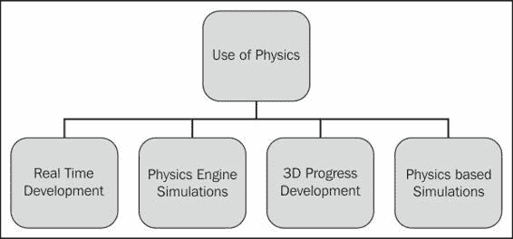
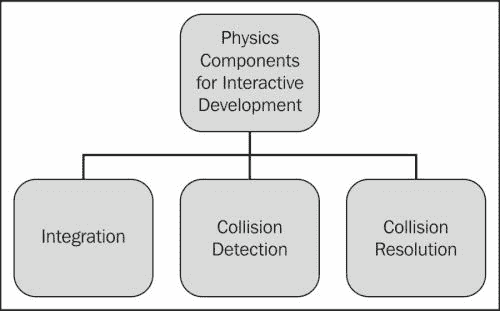
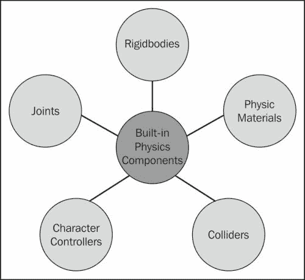
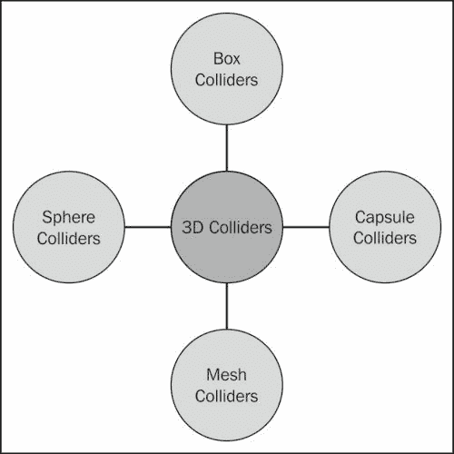
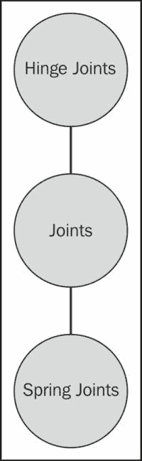
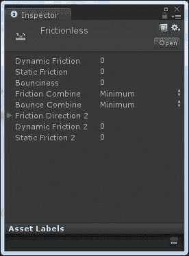

# 第一章. Unity3D 中物理学的介绍

物理在科学、研究和软件等不同领域已经使用了很长时间。物理在交互式开发和软件中的应用并不新鲜，但近年来其应用受到了特别的关注。

初看物理，给人一种都是关于长篇的网状方程和计算的感觉。然而，物理的贡献是巨大的，它让开发者的生活变得容易。游戏的想法之所以可能，仅仅是因为物理。我们都记得我们童年的游戏，它们都是通过物理的使用来实现的；例如，乒乓球游戏。物理对我们生活的影响如此之大，我们无法摆脱其影响，这不是很令人惊讶吗？有许多游戏具有原始的物理，用于计算弹跳球的运动和轨迹。如果你深入研究用于最早游戏之一 Pong 的物理结构，你会对物理在这些游戏中的应用有一个简要的了解。游戏行为、运动轨迹和挡板运动都是由原始物理处理的。

在本章中，我们将学习以下主题：

+   物理在交互式开发中的应用

+   交互式开发中物理的基本组件

+   Unity 中的物理模拟

在今天的交互式世界中，物理的使用每天都在变化。近年来，物理在游戏、软件和交互式开发中的应用急剧增加。现在，我们能够以不同的方式使用物理来制作游戏和其他应用程序。在现代社会，游戏内物理和交互式开发的重要性日益增加。

如果你回顾一下物理在较老交互式应用程序或游戏中的应用方式，你会发现它们都是基于某些特定场景的。物理代码是根据交互式开发的场景编写的。例如，如果物理代码是为一个球处理其轨迹运动而编写的，它只处理轨迹运动而不处理其他任何事情；这意味着每次开发者都必须为新的效果编写新的代码。随着时间的推移，如果需要更新，开发者必须修改甚至重写代码。基于这些案例，开发变得非常复杂和耗时。当场景数量增加时，情况变得更糟。如前所述，物理的使用方式每天都在变化，并且需要在各个领域中使用。让我们看看物理现在广泛应用的领域：

物理在以下交互式开发领域很有用：

+   需要电子学知识（与物理密切相关）的实时编程

+   用于图形软件或游戏且物理应用广泛的物理引擎

+   为各种软件和游戏引擎创建 3D 程序

+   基于物理的模拟

# 交互式开发中使用的最常见物理组件

**刚体动力学**是交互式开发中最常用的组件。对于基于物理的模拟开发，我们使用刚体动力学的算法。刚体动力学基于牛顿运动和质量的原理。

现在，这里出现的问题是什么是刚体？一个理想化的固体，其大小和形状固定，当施加某些外部力时保持不变，并在牛顿力学中用于模拟真实物体，被称为刚体。例如，盒子、墙壁等。

在交互式开发中使用精确的物理是不切实际的，因为它有其固有的自然限制。在交互式开发中，由于标准的帧率限制，我们无法使用精确的物理，但模拟的物理精度只需要看起来可信。

## 模拟和帧率中的物理使用

为了在交互式开发中使用物理，有许多事情需要考虑。物理模拟与帧率相关。帧率可以描述为每秒显示的帧数。这与动画相关，其中许多图像快速显示以产生运动感。大多数 PC 和游戏机的标准帧率为 60 fps。

移动物体及其轨迹的间隔称为物理模拟。几乎每个物理模拟方程都涉及时间，而解决这个方程所需的时间由交互式开发决定。

# 交互式开发中物理的基本组件

有一些基本组件可以用于交互式开发。让我们逐一看看它们：

## 整合

在讨论物理学的整合时，需要考虑多个因素。如何追踪参与模拟的对象在这方面至关重要。

要在交互式开发中实现物理，我们通常在一个数据结构中跟踪所有正在模拟的对象。

要为每个对象实现物理，我们需要了解一些重要信息，例如对象的物理属性，即质量、当前速度、当前位置、方向、作用在对象上的外部力以及对象未来的时间。

### 注意

**什么是未来时间？**

未来时间 = 当前时间 + 帧的时间片

## 碰撞检测

如果只有一个物体在真空中移动，则没有碰撞检测。然而，大多数交互式开发涉及多个对象，这些对象在环境中移动。因此，出现两个物体朝彼此移动的情况。

如果不采取任何行动会发生什么？这些对象将只是穿过彼此。然而，在大多数交互式开发中，我们并不希望对象穿过彼此。

为了处理发生碰撞的场景，交互式开发需要知道两个对象正在碰撞。物理最重要的任务之一就是识别这些场景。

碰撞检测代码必须确定所有这样的重叠对象对，收集一些额外的数据，例如它们重叠的距离和方向，并将这些数据提供给交互式开发以供进一步处理。

在后面的章节中，我们将看到如何在 Unity3D 中处理碰撞检测。

## 碰撞解决

碰撞后会发生什么？让我们看看这样一个场景，其中两个或多个对象重叠，看看在这种情况下我们能做什么。在许多情况下，会添加一些特定的规则到交互式开发中。

例如，在一个射击游戏中，当子弹击中玩家的飞船时，游戏可能会决定显示一个爆炸动画。在此之后，在移除玩家的飞船之前，游戏可能会重新开始关卡并减少玩家的生命值。这些碰撞效果是由游戏本身驱动的，而不是物理，因为它们非常特定于游戏。

然而，在某些情况下，游戏不必涉及。

我们已经涵盖了所有物理组件的基础知识。每个适合交互式开发的模拟都将包含这些组件。除了已涵盖的主题外，还有许多其他功能需要包括，例如关节、布料模拟、基于物理的动画等等。

# Unity 中的物理模拟

我们现在将探讨物理中已有的物理模拟以及 Unity 如何使用它们。本节还将为您概述 Unity3D 中内置的物理组件。让我们看看 Unity 中的物理模拟：

+   Unity 是一个强大的工具。它能够处理交互式物理模拟中涉及到的许多问题。它集成了名为 PhysX 的顶尖物理引擎。

+   Rigidbody 主要针对刚体对象。

使用 Unity，我们可以根据对象的参数值进行物理近似。

## Unity3D 内置的物理

如我之前提到的，Unity 是一个强大的引擎，它包含了许多内置的物理组件。它处理物理模拟。通过调整一些参数设置，我们可以创建一个以现实方式行为的对象。

通过从脚本中控制物理，我们可以给对象赋予车辆、机器、布料等的动力学。内置组件在快速开发中非常有用。在大多数交互式开发中，这些模拟是必需的。通过将物理作为内置组件，Unity3D 使开发者的生活变得更加容易。

### 注意

Unity 有两个独立的物理引擎：一个用于 3D 物理，一个用于 2D 物理。

因此，3D 物理有一个单独的 Rigidbody 组件，而 2D 物理有一个类似的 Rigidbody2D 组件。

现在，让我们探索 Unity3D 中的内置组件。

## Unity3D 内置的物理组件

以下图示展示了 Unity3D 中基本的内置物理组件，这些组件有助于我们在交互式开发中：

### 刚体

我们已经讨论过，在模拟或交互式开发中，最重要的组件是刚体。它使物体的物理行为成为可能。附加了刚体的物体可以响应重力。如果我们想创建一个球体并使其响应重力，我们需要在对象上添加刚体组件，重力将默认启用。

刚体组件会接受它所附加的物体的运动；因此，我们不应尝试通过改变位置和旋转来使用脚本移动它。相反，我们可以施加力来推动物体，并让物理引擎计算结果。

### 运动学运动和刚体

有时，我们希望刚体对象的运动不由物理引擎控制，而是由脚本代码控制。从脚本中产生的这种运动称为运动学运动。

**是否运动学**是刚体的一个属性，它将使物体从物理引擎的控制中移除，并允许使用脚本移动它。我们可以通过脚本和检查器来更改 Is Kinematic 的值，以在对象上打开和关闭此属性。

### 注意

Is Kinematic 很有用，但我们应该记住，启用它会影响性能。如果启用，物体将不会由物理引擎驱动，只能通过其变换来操作，这会更消耗性能。

### 碰撞体

这是 Unity3D 中最重要的一些内置组件之一。碰撞体组件用于定义物理碰撞的形状。我们根据对象的形状使用不同的碰撞体。一个不可见的碰撞体不需要与对象网格的形状完全匹配。

在后面的章节中，我们将看到如何使用不同的碰撞体。

在 3D 中，以下是一些基本碰撞体：

+   箱体碰撞体

+   球形碰撞体

+   胶囊碰撞体

+   网格碰撞体

请查看以下图示：

3D 碰撞体和 2D 碰撞体之间存在差异。在 2D 中，以下是一些基本碰撞体：

+   2D 箱体碰撞体

+   2D 圆形碰撞体

+   2D 多边形碰撞体

请查看以下图示：

除了上述核心碰撞体之外，还有一些关于碰撞体的重要术语，你需要了解。

#### 静态碰撞体

可以向没有刚体组件的对象添加碰撞体，以创建地板、墙壁等。这些被称为静态碰撞体。通过改变变换位置来重新定位静态碰撞体会严重影响物理引擎的性能。

### 注意

为了提高性能，我们不应通过改变变换位置来重新定位静态碰撞体。

#### 动态碰撞体

连接到 Rigidbody 对象的碰撞体被称为动态碰撞体。静态碰撞体不会对动态碰撞体的任何运动做出响应。在后面的章节中，我们将学习上述碰撞体以及如何详细实现这些碰撞体。

#### 物理材料

不同的物体使用不同的材料。当碰撞体相互作用时，它们的表面需要模拟它们所代表材料的属性。我们可以使用物理材料来配置摩擦和弹跳。

再次强调，2D 和 3D 的物理材料是不同的；它们分别称为物理材料 3D 和物理材料 2D。

### 触发器

在脚本编写中，我们可以检测碰撞何时发生，然后我们可以使用 `OnCollisionEnter` 函数来启动采取行动。我们可以配置一个不作为固体对象行为的碰撞体，使用 Unity3D 的 `Is Trigger` 属性将其作为触发器，然后我们将简单地允许其他碰撞体通过。当发生碰撞时，触发器将调用触发对象脚本上的 `OnTriggerEnter` 函数。使用这些函数，我们可以处理需要碰撞后采取行动的多种场景。

### 注意

以下要点将为您提供更多关于此特定主题的详细信息来源：

+   `Collider.OnCollisionEnter(Collision)` 在 [`docs.unity3d.com/ScriptReference/Collider.OnCollisionEnter.html`](http://docs.unity3d.com/ScriptReference/Collider.OnCollisionEnter.html)

+   `Collider.OnCollisionStay(Collision)` 在 [`docs.unity3d.com/ScriptReference/Collider.OnCollisionStay.html`](http://docs.unity3d.com/ScriptReference/Collider.OnCollisionStay.html)

+   `Collider.OnCollisionExit(Collision)` 在 [`docs.unity3d.com/ScriptReference/Collider.OnCollisionExit.html`](http://docs.unity3d.com/ScriptReference/Collider.OnCollisionExit.html)

+   `Collider.OnTriggerEnter(Collider)` 在 [`docs.unity3d.com/ScriptReference/Collider.OnTriggerEnter.html`](http://docs.unity3d.com/ScriptReference/Collider.OnTriggerEnter.html)

+   `Collider.OnTriggerStay(Collider)` 在 [`docs.unity3d.com/ScriptReference/Collider.OnTriggerStay.html`](http://docs.unity3d.com/ScriptReference/Collider.OnTriggerStay.html)

+   `Collider.OnTriggerExit(Collider)` 在 [`docs.unity3d.com/ScriptReference/Collider.OnTriggerExit.html`](http://docs.unity3d.com/ScriptReference/Collider.OnTriggerExit.html)

### 关节

通常，一个 Rigidbody 对象会通过关节连接到另一个对象。Unity 提供了不同的关节来帮助我们处理不同的场景。我们可以使用关节组件将一个 Rigidbody 对象连接到另一个对象或空间中的固定点。如果我们希望关节允许至少一些运动自由度等，那么 Unity 提供了不同的关节组件，它们施加不同的限制。

以下图展示了关节的类型：

关节还有其他选项，可以启用特定效果；例如，我们可以设置一个关节，当施加在其上的力超过设定的限制时，该关节会断裂。

在后面的章节中，我们将学习更多关于关节的内容。

### 角色控制器

在游戏开发中，通常需要一个角色，为此，需要一个控制器。在第一人称或第三人称游戏中，角色通常会需要一些基于碰撞的物理，这样角色就不会掉到地板上或穿过墙壁。

Unity3D 提供了一个用于创建这种行为的组件，该组件被称为 **CharacterController**。此组件使用胶囊碰撞体。控制器具有设置对象速度和方向的功能。

### 注意

你可以在 [`docs.unity3d.com/ScriptReference/CharacterController.html`](http://docs.unity3d.com/ScriptReference/CharacterController.html) 找到更多详细信息。

### 基于碰撞的脚本

让我们看看我们如何通过脚本处理碰撞和碰撞后的效果。脚本附加到对象上，以便在碰撞时调用某些函数。我们可以在这些函数中编写任何代码来响应碰撞事件。例如，当球撞击障碍物时，我们可能会播放音效。

+   `OnCollisionEnter`：此函数表示在第一次更新中检测到碰撞

+   `OnCollisionStay`：此函数表示在更新期间保持接触

+   `OnCollisionExit`：此函数表示接触已被断开

类似地，对于触发碰撞体，这些函数分别称为 `OnTriggerEnter`、`OnTriggerStay` 和 `OnTriggerExit`。

### 注意

对于 2D 物理学，有以 2D 结尾的等效函数；例如，`OnCollisionEnter2D`。

在正常非触发碰撞中，有一个额外要求，即至少有一个参与的对象必须具有非运动刚体。要创建非运动刚体，我们必须将“是运动学”设置为“关闭”。

### 无摩擦物理材料

有时，在开发过程中，我们需要无摩擦物理材料。让我们尝试创建一个无摩擦材料。在 Unity3D 中，要创建一个完全无摩擦的材料，我们需要在 **项目** 视图中创建一个新的物理材料资产，并设置其属性如下：

在前面的图像中，我们可以看到各种参数，使用这些参数我们可以满足我们的无摩擦游戏需求。

# 概述

本章是 Unity3D 中物理学的快速介绍。在本章中，我们学习了在交互式世界中使用物理，Unity3D 的内置组件，以及无摩擦材料。在下一章中，我们将学习碰撞体及其类型，并举例说明。本章还将教我们如何使用不同的碰撞体进行交互。
