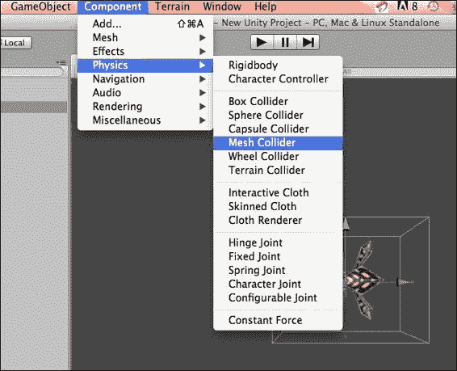

# 第二章 使用不同碰撞体进行交互

如前一章所述，碰撞体是 Unity3D 中的主要组件之一。使用碰撞体，我们为对象定义一个形状，有助于碰撞检测。在本章中，我们将学习有关碰撞体的内容。我们将学习以下主题：

+   原始碰撞体及其实现

+   非原始碰撞体及其实现

+   Trigger 碰撞体的用途

+   编辑 Polygon Collider 2D

让我们详细看看原始和非原始碰撞体。

# 原始碰撞体

原始碰撞体是基本碰撞体，或者换句话说，我们可以这样说，这些碰撞体是这一类碰撞体中的最早形式。Unity3D 中有三种原始碰撞体，除了这三种碰撞体之外，Unity 还提供了 Mesh Collider，这有助于我们在需要为复杂形状提供碰撞形状时使用。

## 原始碰撞体的类型

如以下图所示，有三个原始碰撞体：Box Collider、Sphere Collider 和 Capsule Collider。


我们将通过示例详细学习原始碰撞体的用途和类型。

### Box Collider 3D

Box Collider 包含立方体形状，可以为类似立方体形状的游戏对象（如盒子、墙壁和门）实现，这些对象具有立方体的形状。

#### 示例 – Box Collider 的实现

在这里，我们将通过以下步骤在以下场景中实现 Box Collider：

1.  让我们创建一个新的场景，如下截图所示：

1.  通过以下截图所示的导航到**GameObject** | **Create Other**选择**Cube**选项，然后打开**Inspector**面板：

1.  在以下截图，您将在 **Inspector** 面板中看到 **Box Collider** 复选框；请确保它被勾选：

1.  在 **Inspector** 面板中，选择 **Is Trigger** 复选框以使其触发碰撞体并触发触发事件。

1.  我们可以使用这里的尺寸来决定其形状和大小；它应该与游戏对象变换和大小相关。

    ### 注意

    **材质**

    Box Collider 具有 Material 属性，该属性决定了游戏对象的摩擦力和弹性，但如果选择 Trigger Collider，则无关紧要。

在前面的例子中，我们学习了如何为立方体形状的对象实现 Box Collider。

### Box Collider 2D

对于 2D 游戏对象，Unity 提供了 Box Collider 2D 来处理碰撞。这个碰撞体是矩形形状，可以在具有给定尺寸和坐标的精灵上实现。与 3D Box Collider 类似，这个碰撞体也具有 Is Trigger 和 Material 属性，以及 Size 和 Center 属性。

### Sphere Collider 3D

对于形状为球体的游戏对象，我们使用 Unity3D 的 Sphere Collider。

#### 示例 – 球体碰撞体的实现

在这里，我们将看到如何使用以下步骤在场景中实现球体碰撞体：

1.  创建一个新的场景。

1.  如以下截图所示，转到**游戏对象**并选择**创建其他**，您将得到一个下拉列表；现在，选择一个**球体**游戏对象并打开**检查器**面板：

1.  在**检查器**面板内部，您将看到**球体碰撞体**；请确保**球体碰撞体**被勾选：

1.  在**检查器**面板中，勾选**触发器**以使其触发碰撞体并触发触发事件。

1.  我们可以通过尺寸和半径来决定其形状和大小；在这里，它应该与游戏对象变换和大小相关。

### 2D 圆形碰撞体

对于 2D 对象，我们使用圆形碰撞体而不是球体碰撞体来实现给定尺寸和坐标的圆形游戏对象。它具有球体碰撞体中所有的属性，如触发器和半径。

### 3D 胶囊碰撞体

胶囊碰撞体用于胶囊形状的游戏对象。这通常用于创建角色游戏对象。

#### 示例 – 胶囊碰撞体的实现

在这里，我们将看到如何使用以下步骤在场景中实现胶囊碰撞体：

1.  创建一个新的场景。

1.  如以下截图所示，选择**胶囊**游戏对象然后打开**检查器**面板：

1.  在**检查器**面板内部，您将看到**胶囊碰撞体**；请确保它被勾选。

1.  在**检查器**面板中，勾选**触发器**以使游戏对象触发碰撞体并触发触发事件。

    我们胶囊对象的外观将如以下截图所示：

    

1.  如以下截图所示，我们可以通过尺寸和半径来决定其形状和大小；在这里，它应该与游戏对象变换和大小相关：

1.  选择**高度**作为胶囊身体的长度。

1.  如以下截图所示，相对于游戏对象给出一个方向：

    通过选择**X 轴**、**Y 轴**或**Z 轴**，我们为游戏对象提供一个方向。

### 网格碰撞体

使用网格，网格碰撞体定义了碰撞的形状。尽管我们用它来为碰撞提供精确的形状定义，但在性能方面这是昂贵的。我们应该避免使用网格碰撞体，并在可能的情况下使用原始碰撞体（盒形、球体等）。

### 注意

应尽可能避免使用复杂的碰撞体来使用网格碰撞体，以优化性能。

#### 示例 – 网格碰撞体的实现

在这里，我们将看到如何使用以下步骤在场景中实现网格碰撞体：

1.  创建一个新的场景。

1.  下载或使用你已有的任何资产。我从 Unity3D 的资产商店下载了一个免费的蜘蛛资产。

1.  将资产导入场景；你将看到它们出现在场景中。如图所示，你可以看到你的蜘蛛：

1.  现在，如图所示，我们将应用网格碰撞器。导航到**组件** | **物理** | **网格碰撞器**：

1.  如截图所示，选择我们需要实现网格碰撞器的网格：

1.  如下截图所示，在**检查器**面板中，你会看到一个未勾选的**Is Trigger**复选框。勾选**Is Trigger**以使其触发碰撞器并触发触发事件：

1.  如果我们想让这个游戏对象与另一个网格碰撞器发生碰撞，我们可以将**Convex**标记为真。

1.  给游戏对象一个相对方向：

如前图所示，通过选择游戏对象，我们打开**检查器**面板，并可以给出一个方向。

### 2D 多边形碰撞器

对于游戏对象形状不规则的 2D 对象，使用多边形碰撞器 2D。要编辑碰撞器形状，将精灵资产拖动到**检查器**面板中的多边形碰撞器 2D 组件上，按住**shift**键并尝试编辑顶点或边。

#### 示例 – 实现多边形碰撞器 2D

以下步骤将指导你实现多边形碰撞器 2D：

1.  创建一个新的场景并将其命名为`Polygon Collider 2D 示例`。

1.  在**层次**面板中，点击**创建**并从下拉列表中选择**精灵**以创建一个空精灵渲染器。在**检查器**窗口中将此精灵渲染器命名为`Rock`。

1.  默认情况下，它将表示为一个不合适的盒子，因此我们将创建一个多边形碰撞器。

1.  选择**精灵集合**并点击**打开编辑器**。

1.  在**精灵集合**编辑器中选择**Rock Sprite**选项。

1.  选择**碰撞器类型**为**多边形**。

1.  将**精灵视图**选项切换到碰撞器编辑模式。

1.  双击边以添加控制点。点击并拖动以定位它。

    ### 注意

    我们可以直接通过在**场景**视图中移动鼠标并按住**shift**键来编辑多边形的形状。当鼠标悬停在顶点上时，可以通过 shift-drag 来移动现有的顶点。如果鼠标悬停在边上时 shift-drag，将在指针位置创建一个新的顶点。可以通过按住**control**/*command*键并点击它来删除顶点。

1.  编辑碰撞器，直到得到你想要的结果。

### 2D 边缘碰撞器

这种 2D 碰撞体用于需要精度的 2D 游戏对象的碰撞形状。使用这个碰撞体，形状由线段组成。使用*shift*和*control*键，我们可以编辑碰撞体的形状。我们可以像前一个部分中展示的 Polygon Collider 2D 一样编辑 Edge Collider 2D。

# 非原始碰撞体

非原始碰撞体是从原始碰撞体派生出来的。特别是对于车辆，Unity 提供了轮子碰撞体，对于地形，有一个地形碰撞体组件。通过组合各种原始碰撞体，我们创建了复合碰撞体。

## 非原始碰撞体的类型

如以下图所示，非原始碰撞体是针对轮子对象和地形的。使用轮子碰撞体，我们可以轻松地为车辆提供碰撞形状。同样，使用不同形状的地形碰撞体实现变得容易。


### 轮子碰撞体

这是一个用于车辆轮子的非原始碰撞体。轮子碰撞体具有 motorTorque、brakeTorque、radius 和 steerAngle 属性。使用摩擦模型，轮子碰撞体能够提供逼真的效果。

#### 示例 – 轮子碰撞体的实现

这里，我们将看到如何使用以下步骤在场景中实现复合碰撞体：

1.  创建一个新的场景。

1.  在**层次结构**面板中，点击**创建**并选择**圆柱体**游戏对象。打开**检查器**面板。

1.  从**组件**中添加**轮子碰撞体**，如图所示：

1.  通过调整属性来获得逼真的效果。

让我们打开**检查器**面板。我们会看到一些不同的属性；在这里，使用**质量**，我们决定轮子游戏对象的质量，它必须大于 0。在这个例子中，我使用了`1`。我们可以通过使用定义轮子半径的**半径**属性来设置半径，该半径以局部空间为单位。请看下面的截图：


如前一张截图所示，还有其他属性也被用来实现逼真的轮子效果；例如，轮子的碰撞检测是通过从中心发射一条射线到局部 *y* 轴来进行的，我们使用中心属性。我们可以通过`suspensionDistance`（[`docs.unity3d.com/ScriptReference/WheelCollider-suspensionDistance.html`](http://docs.unity3d.com/ScriptReference/WheelCollider-suspensionDistance.html)）的值向下扩展轮子的半径。通过根据轮子撞击的材料改变`forwardFriction`（[`docs.unity3d.com/ScriptReference/WheelCollider-forwardFriction.html`](http://docs.unity3d.com/ScriptReference/WheelCollider-forwardFriction.html)）和`sidewaysFriction`（[`docs.unity3d.com/ScriptReference/WheelCollider-sidewaysFriction.html`](http://docs.unity3d.com/ScriptReference/WheelCollider-sidewaysFriction.html)），我们模拟不同的路面材料。

### 静态碰撞体

静态碰撞体用于不需要碰撞移动的场景。静态碰撞体包含一个没有 Rigidbody 的非触发碰撞体。这种没有 Rigidbody 的游戏对象不会受到物理的影响。静态碰撞体通常用于创建边界或障碍。

### Rigidbody 碰撞体

Rigidbody 碰撞体与静态碰撞体正好相反；它是一个带有 Rigidbody 组件的碰撞体。Rigidbody 碰撞体会与静态碰撞体发生碰撞以创建碰撞事件，并且会受到物理的影响。

### 运动学 Rigidbody 碰撞体

运动学 Rigidbody 碰撞体是一个具有 **Is Kinematic** 标志 `true` 的碰撞体。通常，它用于需要动画的场景。此外，运动学 Rigidbody 碰撞体不受脚本的影响。

### 触发器碰撞体

触发器碰撞体是一个不可见的碰撞体，在没有任何物理交互的情况下触发事件。我们可以定义非物理区域，当与游戏对象交互时，触发器碰撞体会触发事件。

### 注意

触发器应该用于需要快速响应的场景。对于像 *塔防* 这样的游戏，其中需要快速响应，触发器碰撞体非常有用。

以下事件会被调用：

+   `OnTriggerEnter`: 当对象刚刚进入时调用此事件

+   `OnTriggerStay`: 当对象在触发器内部时调用此事件

+   `OnTriggerExit`: 当对象离开触发器时调用此事件

我们在何时使用触发器碰撞体？如图所示，主要在以下两种场景中使用触发器碰撞体：


#### 距离触发器的示例

在开发我的游戏之一时，我必须创建一个游戏玩法，当玩家到达门口时，门应该打开。在这种情况下，我需要在门口前放置一个触发碰撞体。当玩家到达门口时，它触发 `OnTriggerEnter` 事件，我在那里相应地执行游戏逻辑：

```cs
    var  isInRange:Boolean = false;

function OnTriggerEnter(col:Collider)
{
  if(col.CompareTag("Player"))
  {
      // Write here logic for open the door.
   }
}
```

同样，我们可以使用 `OnTriggerStay` 和 `OnTriggerExit`：

```cs
function OnTriggerStay(col:Collider)
{

  if(col.CompareTag("Player"))
  {
isInRange = true;
   }
}
function OnTriggerExit(col:Collider)
{
  if(col.CompareTag("Player"))
  {
isInRange = false;
   }
}
```

#### 半径触发器的示例

在一些游戏，如 *塔防* 中，我们需要在范围内生成部队或射击敌人；因此，我们创建一个半径。当游戏对象进入定义的半径内时，`OnTriggerEnter` 事件被触发：

```cs
    var  isInRange:Boolean = false;
function OnTriggerEnter(col:Collider)
{
  var spawn:SpawnPoint = col.GetComponent(SpawnPoint);
  if(spawn){
    spawn.shootBullets();
  }
}
```

同样，我们可以使用 `OnTriggerStay` 和 `OnTriggerExit`：

```cs
function OnTriggerStay(col:Collider)
{
  isInRang = true;
}
function OnTriggerExit(col:Collider)
{
   isInRang = false;
}
```

### 注意

**警告**

触发碰撞体对射线投射有响应。确保你的触发器设置为忽略射线投射层。

# 复合碰撞体

除了使用网格碰撞体，有时使用组合的原始碰撞体更好。为此，我们创建一个碰撞体的父子层次结构。让我们在以下示例中看看。

## 示例 – 复合碰撞体的实现

在此，我们将看到如何在以下场景中实现复合碰撞体：

1.  创建一个新的场景。

1.  如下截图所示，选择**胶囊**和**球体**游戏对象并创建一个角色形状：

1.  在 **检查器** 面板中，你会看到 **球体碰撞体** 和 **胶囊碰撞体**。为两者都勾选 **是触发器** 选项，使其触发碰撞体并触发触发事件。

在本节中，我们学习了如何为复杂游戏对象使用原始碰撞体。在后面的章节中，我们将了解更多关于动画和复合碰撞体的内容。

# 摘要

我们学习了不同类型的碰撞体及其实现方式，如何实现原始和非原始碰撞体，以及它们的应用。我们还学习了触发碰撞体的使用。在下一章中，我们将学习碰撞体的碰撞矩阵。我们将通过非脚本和基于脚本的示例来了解如何实现碰撞矩阵。我们还将学习基于层的碰撞。
