# 第三章：碰撞矩阵概述

在本章中，你将学习 Unity3D 中不同碰撞体的类型，它们定义了场景中对象的碰撞形状及其碰撞矩阵。

你将详细了解以下主题：

+   碰撞矩阵

+   触发矩阵

+   基于层的碰撞矩阵

到本章结束时，你将了解碰撞体矩阵及其类型的知识。通过两个碰撞游戏对象的矩阵配置，我们将看到我们如何定义不同的动作。

在使用 Unity3D 进行开发期间，你将遇到以下术语：

+   **碰撞矩阵**：这表示一个矩阵，它显示了哪种碰撞类型将显示碰撞

+   **触发矩阵**：这表示一个矩阵，它显示了哪种碰撞类型将触发触发事件

+   **基于层的碰撞矩阵**：这表示一个矩阵，它显示了基于层的碰撞

以下图表将向您展示不同类型的矩阵：

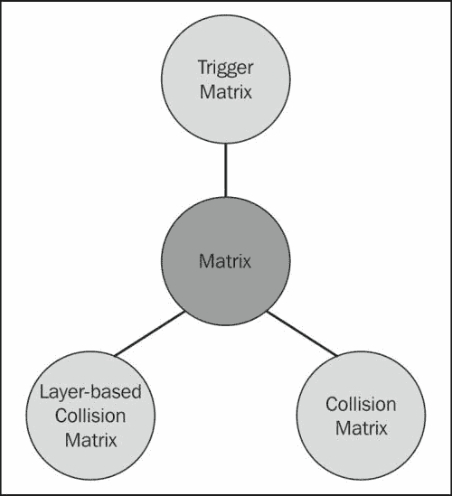

让我们详细看看它们。

# 碰撞矩阵 3D

你将学习关于 3D 开发的碰撞矩阵；这个矩阵将定义哪种碰撞类型将显示碰撞。我们可以通过配置两个碰撞游戏对象来定义不同的动作。以下表格定义了基于附加组件的两个碰撞游戏对象的碰撞状态。要应用物理，游戏对象必须附加刚体。在这里，碰撞矩阵表示一个矩阵，它显示了哪种碰撞类型将显示碰撞。

在碰撞时，将生成以下事件（有关描述，请参阅上一章）：

+   `OnCollsionEnter()`

+   `OnCollisionStay()`

+   `OnCollisionExit()`

    ### 注意

    只有具有刚体的碰撞体在碰撞时才会产生反应。

以下图表显示了 3D 对象的碰撞矩阵表格：

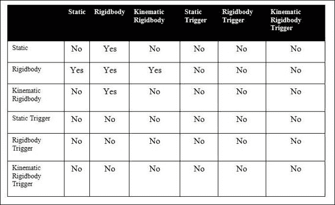

让我们通过一些例子来看看如何读取前面的表格：

+   一个静态碰撞体将检测与刚体的碰撞

+   一个刚体碰撞体将检测与静态、刚体和运动学刚体碰撞体的碰撞

+   一个运动学刚体将在与刚体碰撞时产生反应

+   在其他条件下，不会检测到碰撞

# 触发矩阵

在这里，触发矩阵表示一个矩阵，它显示了哪种碰撞类型将触发触发事件。在触发时，将生成以下事件（有关描述，请参阅上一章）：

+   `OnTiggerEnter()`

+   `OnTriggerStay()`

+   `OnTriggerExit()`

    ### 注意

    只有触发碰撞体才会触发触发事件。

以下图表显示了 3D 对象的触发矩阵表格：

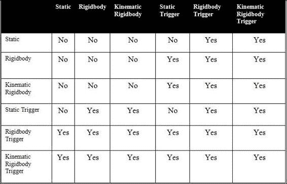

让我们通过以下例子来看看如何读取前面的表格：

+   静态碰撞体在与刚体触发碰撞体和运动学刚体碰撞体碰撞时将触发触发事件

+   刚体碰撞体将与静态触发碰撞体、刚体触发碰撞体和运动学触发碰撞体触发触发事件

+   运动学刚体碰撞体将与静态触发碰撞体、刚体触发碰撞体和运动学触发碰撞体碰撞时触发触发事件

+   静态触发碰撞体在与刚体碰撞体、运动学刚体碰撞体、刚体触发和运动学触发碰撞体碰撞时将触发触发事件

## 2D 对象的矩阵

虽然在 Unity3D 中，2D 对象和 3D 对象的物理非常相似，但在碰撞过程中发送消息时有一些差异。

在下面的表格中，我们将看到一些重要的差异。这个表格中的矩阵是基于我们使用碰撞体和刚体的 2D 变体的假设。

表格基于发生碰撞检测并发送 Collision2D 消息的实例。

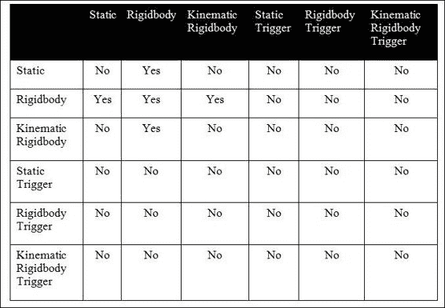

让我们看看以下示例，如何阅读前面的表格：

+   静态碰撞体仅在与刚体碰撞时触发碰撞事件

+   刚体将与静态碰撞体、刚体和运动学刚体碰撞体显示碰撞

+   运动学刚体将与刚体触发碰撞

下面的图示显示了在碰撞时发送 Trigger2D 消息的实例：

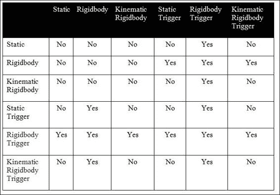

让我们看看以下示例，如何阅读前面的表格：

+   静态碰撞体仅在与刚体碰撞时触发触发事件

+   刚体将与静态触发和刚体触发显示碰撞

+   运动学刚体将与刚体触发触发碰撞事件

# 层和碰撞矩阵

默认情况下，如果多个游戏对象位于默认层上，它们将相互碰撞。在这种情况下，我们可以这样说，一切都会与一切碰撞。在游戏开发中，我们经常需要决定哪个对象将与哪个对象碰撞。为此，我们需要定义游戏对象层特定的划分。我们将每种类型的对象放在不同的层中。在碰撞矩阵中，对于每个新层，都会添加一个新的列和行。矩阵定义了层之间的交互。默认情况下，新层将与所有其他层碰撞。开发者需要设置层之间的交互。使用正确的设置，我们可以避免不必要的碰撞。

## 基于层的碰撞矩阵的例子

让我们来看一个设置层碰撞矩阵的例子：

1.  创建一个新的场景，并将其命名为“层碰撞”。

1.  创建一个盒子容器游戏对象，如下面的截图所示：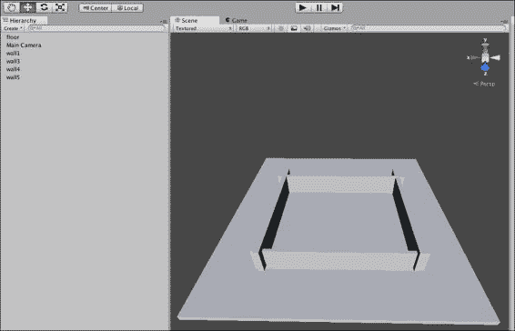

    默认情况下，所有对象都将出现在默认层上，如下面的截图所示：

    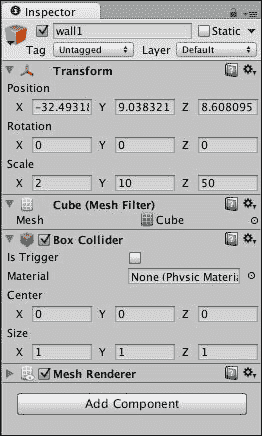

1.  为地板和墙壁游戏对象添加并设置盒子层。如以下截图所示，通过点击**层**，我们将看到一个现有层的下拉列表。我们可以通过点击**添加层**来添加一个新层。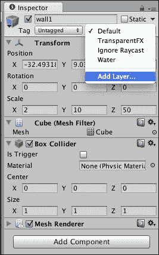

1.  如以下截图所示，我们已经创建了一个新的层**盒子**。通过选择**盒子**，我们可以指定所有盒子游戏对象所在的层。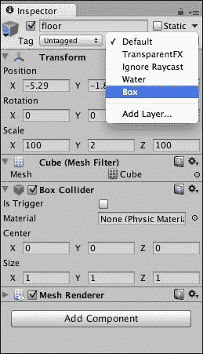

1.  在盒子容器内添加一个红色球、绿色球和蓝色球。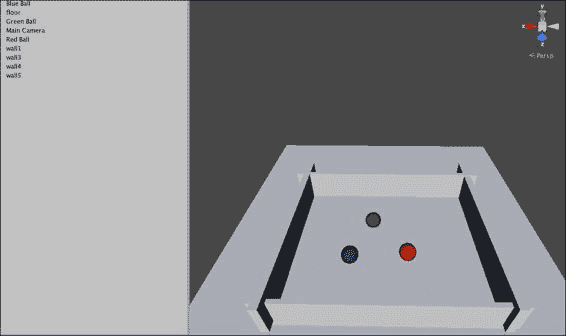

1.  与步骤 3 类似，我们为球添加并设置不同的层。如以下截图所示，我们为红色球、绿色球和蓝色球创建了层：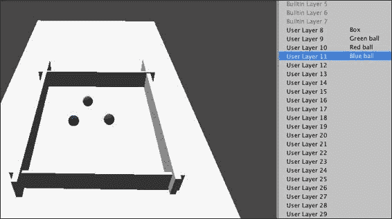

1.  要为游戏对象设置碰撞规则，让我们打开**矩阵**。如以下截图所示，导航到**编辑** | **项目设置**并选择**物理**：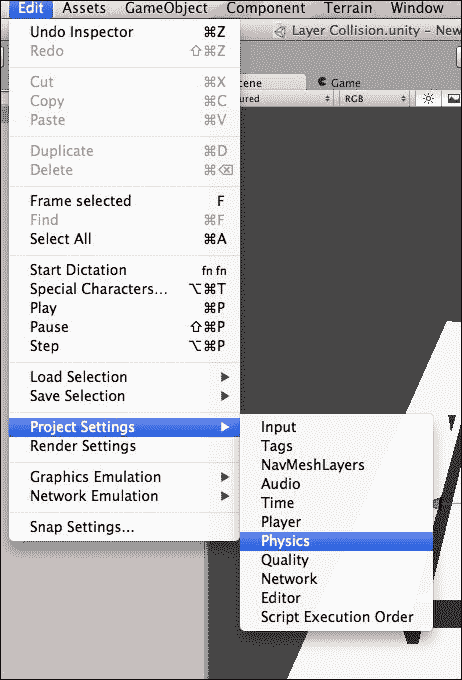

1.  如以下截图所示，将在**检查器**面板中显示一个碰撞表。默认情况下，每个对象都会与另一个对象发生碰撞。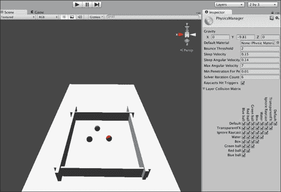

1.  检查和取消检查矩阵中的复选框以设置规则，如以下截图所示。我们已经为绿色球、红色球、蓝色球和盒子设置了碰撞矩阵。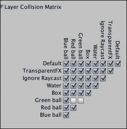

使用前面的步骤，我们可以设置基于层的碰撞矩阵。

创建一个新的 JavaScript 脚本并将其附加到主相机上，然后运行测试。

在此 JavaScript 文件中编写以下代码：

```cs
  #pragma strict
  function Start () {
  }
  function Update () {
  }

function OnCollisionEnter(Collision collisionInfo)
{
  Debug.Log("Detected collision between " + gameObject.name + " and " + collisionInfo.collider.name);

}

function OnCollisionStay(Collision collisionInfo)
{
  Debug.Log(gameObject.name + " and " + collisionInfo.collider.name + " are still colliding");
}

function OnCollisionExit(Collision collisionInfo)
{
  Debug.Log(gameObject.name + " and " + collisionInfo.collider.name + " are no longer colliding");
}
```

使用前面的脚本，你可以检查哪些对象正在相互碰撞以及持续了多长时间。

## 碰撞矩阵和脚本

让我们看看如何使用脚本忽略特定对象的碰撞。在交互式开发中，我们通常需要设置对象之间的碰撞规则。例如，我们需要设置一个规则，使弹射物不会与发射它们的对象发生碰撞。尽管使用基于自定义层的 GUI 碰撞，我们可以定义基于层的游戏对象碰撞规则，但我们也可以使用脚本处理它。我们可以使用 Unity3D 的`IgnoreCollision`物理功能来创建碰撞矩阵。

### 注意

**忽略碰撞的限制**

碰撞矩阵在保存场景时不会存储状态，我们只能应用于活动游戏对象。

### 基于脚本的碰撞矩阵示例

以下是基于脚本的碰撞矩阵的示例：

1.  创建一个新的场景并将其命名为`Script-Collision-Matrix`。

1.  使用**平面**创建一个墙壁。

1.  创建一个**子弹**游戏对象。

1.  创建一个射击对象。现在，我们需要设置一个规则，使子弹不应与射击对象发生碰撞。

1.  创建一个脚本并将其附加到主摄像机对象上。将以下代码添加到脚本中：

    ```cs
    var bulletPrefab : Transform;
    function Start () {
        var bullet = Instantiate(bulletPrefab) as Transform;
        Physics.IgnoreCollision(bullet.collider, collider);
    }
    ```

运行并测试脚本，你会看到子弹正在忽略与射击对象的碰撞。

# 摘要

在本章中，你学习了关于 2D 和 3D 游戏对象的不同的碰撞矩阵和触发矩阵。你还学习了我们如何设置基于层的碰撞矩阵，以及我们如何通过脚本处理它。在下一章中，你将学习关于刚体及其行为的内容。下一章将作为详细描述，并会向你介绍 Unity3D 中不同刚体的用途和类型，这将涵盖如物理刚体、运动学刚体以及刚体的属性等主题。
