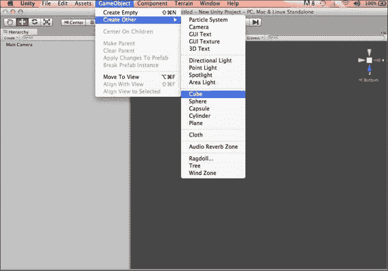
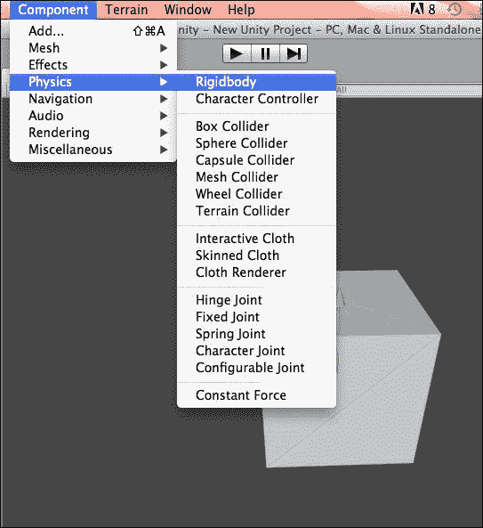
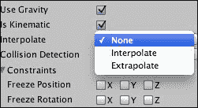
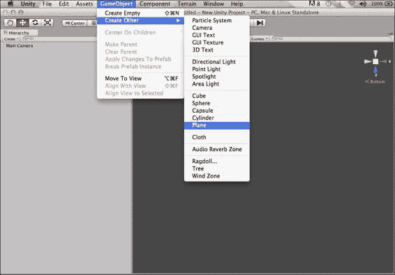
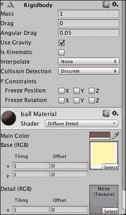
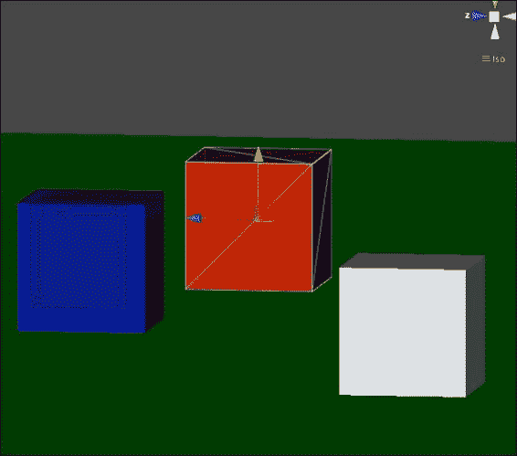
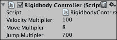

# 第四章。Rigidbody 类型及其属性

在本章中，我们将学习 Rigidbody 组件的类型及其属性。为了检测碰撞、添加重力以及实现其他物理功能，游戏对象必须具有 Rigidbody 组件。

在本章中，我们将涵盖以下主题：

+   Rigidbody 组件的类型

+   Rigidbody 组件的属性

+   使用 Rigidbody 组件的示例

我们可以使用脚本以及手动应用线性和角速度来处理 Rigidbody 组件。

### 注意

为了进行准确的物理计算，Rigidbody 组件需要一个碰撞器组件。

# Rigidbody 组件的类型

我们通过使用 Rigidbody 使我们的游戏对象在物理控制下行动。在这里，我们将学习如何使用和处理 Rigidbody 组件。Rigidbody 可以通过两种方式处理：

+   物理 Rigidbody

+   动力学 Rigidbody

## 物理 Rigidbody

要通过重力或力影响游戏对象，游戏对象必须具有 Rigidbody。当一个 Rigidbody 完全由引擎控制时，它被称为物理 Rigidbody。我们可以手动应用力矩来处理游戏对象的线性和角速度。手动实现力和扭矩可以让你获得所需的效果。让我们看看一个 Rigidbody 的示例。

### 创建物理 Rigidbody 的示例

使用以下步骤应用物理 Rigidbody：

1.  我们将首先创建一个新的场景并将其保存为`Physics Rigidbody`。

1.  创建一个**立方体**游戏对象，如图所示：

1.  为了使我们的游戏对象在物理控制下行动，我们使用 Rigidbody。将**Rigidbody**组件添加到立方体游戏对象中，如图所示：

1.  在**检查器**面板中，确保**Is Kinematic**属性未被勾选。如果我们启用**Is Kinematic**，则对象只能通过其 Transform 属性进行操作。通常，我们使用此属性来移动平台或当我们想要动画化一个连接了 HingeJoint 的 Rigidbody 时。

如前所述的步骤所示，我们可以使用不同的属性来获得所需的效果。

## 动力学 Rigidbody

当我们检查 Rigidbody 的**Is Kinematic**属性时，它被称为动力学 Rigidbody。我们不能手动对动力学 Rigidbody 应用力或扭矩。我们可以通过改变 GameObject 的 Transform 组件的值来移动动力学 Rigidbody。这对于移动平台或动画化的 HingeJoint GameObjects 很有用，在这些情况下，引擎不会直接处理对象，并且我们可以根据需要操作其 Transform 属性。


我们可以通过在**检查器**面板中勾选它来使用此属性，如图中所示的前一个截图。现在，我们将学习 Rigidbody 的属性及其实现。

# Rigidbody 组件的性质

让我们熟悉一下 Rigidbody 的性质：

+   **质量**：如果我们查看 Rigidbody 组件的**检查器**面板，我们会看到**质量**作为列出的属性之一。Rigidbody 的这个属性定义了基于附着到其上的对象的相对大小和密度的质量。Rigidbody 的质量定义了移动 Rigidbody 所需的力量大小。我们可以使用牛顿运动定律如下计算力：

    *F=ma*，即力 = 质量 x 加速度

+   **阻力**：这个属性定义了由于空气阻力产生的线性速度。例如，如果我们需要向游戏对象添加外太空行为，我们将此值设置为`0`。质量为`1`的对象应该有一个**阻力**值为`998`以抵抗重力。

+   **角阻力**：这个属性定义了由于空气阻力产生的角速度。例如，如果我们需要在游戏对象上添加一个无限旋转除非使用外部力的行为，我们将此值设置为`0`。

+   **使用重力**：如果我们想让我们的游戏对象受到重力的影响，我们使用此行为。

+   **是运动学**：为了添加运动学行为，我们将此设置为 true。通过将其行为设置为 true，我们可以直接使用其变换属性更改 Rigidbody 的位置和方向。

+   **插值**：使用此属性，我们使 Rigidbody 平滑移动。我们可以通过**None**、**Interpolate**和**Extrapolate**调整**插值**方法，如以下截图所示：

    使用**None**，不应用插值；使用**Interpolate**，我们根据其前一帧平滑地转换；在**Extrapolate**中，我们根据其估计的下一帧平滑地转换。

+   **碰撞检测**：使用此属性，我们可以确定 Rigidbody 将如何与其他 Rigidbody 执行碰撞检测。此属性包括以下子属性：

    +   **离散**：通过设置此属性，我们使用最简单的碰撞检测形式。在每一帧，进行一次交点测试。此属性的缺点是，小型快速移动的对象会直接穿过固体对象。

    +   **连续**：通过设置此属性，Rigidbody 对所有其他静态碰撞器执行连续碰撞检测。

    +   **连续动态**：通过设置此属性，Rigidbody 可以检测与快速移动对象的碰撞。

+   **约束**：此属性用于物理 Rigidbody。使用此属性，我们可以约束 Rigidbody 的位置和方向。此属性包括以下子属性：

    +   **冻结位置**：通过设置此属性，Rigidbody 约束线性运动

    +   **冻结旋转**：通过设置此属性，防止 Rigidbody 旋转

# 使用 Rigidbody 的示例

假设在我们的游戏中，我们需要一个立方体作为我们的角色。在这种情况下，我们不会使用角色控制器。让我们按照以下步骤进行：

1.  创建一个新的场景并将其保存为`Rigidbody example`。

1.  如以下截图所示，创建一个**平面**游戏对象，并将其属性设置为位置`0`（所有轴），旋转`0`（所有轴），以及*x*、*y*、*z*轴的缩放分别为`20`、`1`、`20`：

1.  添加一个**立方体**游戏对象和一个 Rigidbody 碰撞体。将其放置在平面上方。

1.  如以下截图所示，向红色立方体添加材质：

1.  创建另一个**立方体**游戏对象。我使用了一个没有 Rigidbody 的白色立方体。

1.  创建另一个没有 Rigidbody 的**立方体**对象。我使用了一个蓝色立方体，如图所示，并将**触发器**属性设置为 true：

    在前面的截图中，我们在蓝色立方体中设置了**触发器**属性。

1.  创建一个新的脚本并将其保存为`TriggerController.js`；将其添加到**触发器碰撞体**游戏对象中，并在其中放入以下代码：

    ```cs
    functionOnTriggerEnter( other : Collider )
    {
      Debug.Log("OnTrigger Event");
    }

    functionOnTriggerExit( other : Collider )
    {
      Debug.Log("OnTriggerExit Event");
    }
    ```

    上述代码将在控制台窗口中显示登录事件：**OnTriggerEnter**和**OnTriggerExit**。

1.  让我们进入下一步。创建一个新的脚本并将其保存为`RigidbodyController.js`。如以下截图所示，将其添加到**红色立方体**游戏对象中：

将以下代码添加到`RigidbodyController.js`脚本文件中：

```cs
#pragma strict
@scriptRequireComponent(Rigidbody) 
/******* RequirementComponent ensure there should be a Rigid body as it asks for Rigidbody as required component/ 
privatevaronPlane = false; 
// Multiply the velocity when using the velocity.
varvelocityMultiplier = 100.0f;
// Multiply the move distance.
varmoveMultiplier= 8.0f;
// Multiply the force to make the cube jump.
varjumpMultiplier= 700.0f;

functionFixedUpdate(){
// Calculate the velocity/move direction based on the user input.
  varmoveDirection = Vector3( Input.GetAxis("Horizontal"), 0, Input.GetAxis("Vertical") ) * Time.deltaTime;
moveDirection = Camera.main.transform.TransformDirection( moveDirection );
// Here TransformDirection transforms direction from local space
// to world space.

  if ( rigidbody != null && !rigidbody.isKinematic )
    {
    rigidbody.MovePosition( rigidbody.position + ( moveDirection * moveMultiplier ) );
rigidbody.velocity = Vector3( 0, rigidbody.velocity.y, 0 );

  }

if ( Input.GetButtonDown("Jump") &&onPlane )
  {

    rigidbody.AddForce( Vector3.up * jumpMultiplier );
     }

}

functionOnCollisionStay(collisionInfo : Collision)
{
  onPlane = true;
}

functionOnCollisionExit( collisionInfo : Collision )
{
onPlane = false;

}
```

运行项目，通过点击**跳跃**按钮，你将看到红色立方体上的 Rigidbody 动作。

在前面的示例中，我们学习了如何使用脚本在 Rigidbody 上应用动作。

# 摘要

在本章中，我们学习了 Rigidbody 的类型及其属性。我们看到了物理 Rigidbody 和是运动学 Rigidbody 的属性和用途。我们学习了如何使用脚本在它们上实现动作。在下一章中，我们将学习关节的类型及其属性。我们还将看到如何通过不同的示例在游戏对象上实现关节。
