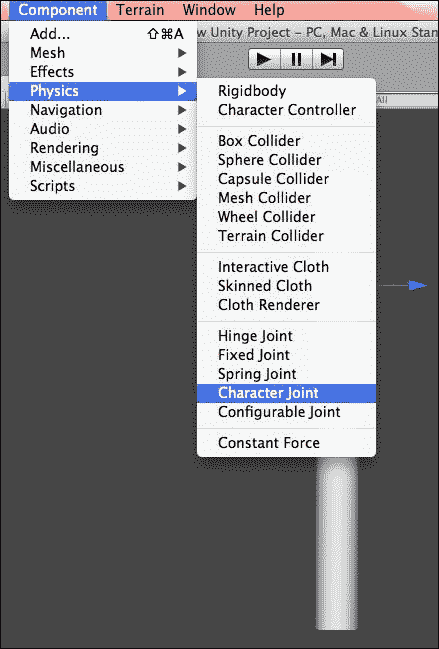

# 第五章：联结类型及其属性

在本章中，我们将学习关于关节组件类型及其属性的内容。关节是 Unity3D 的重要组件，提供了不同类型的关节。我们将通过有趣的示例学习所有这些关节，即通过创建带有铰链关节的门动画、使用弹簧关节的球的弹簧运动以及使用角色关节的骨骼运动。

在本章中，我们将学习以下关节的更多内容：

+   关节类型

+   可配置关节

+   处理可配置关节的运动和运动

现在，我们将学习不同类型的关节。

# 关节类型

关节是 Unity3D 中最重要组件之一。在本章中，我们将学习更多关于关节的内容。

除了前面图中提到的关节外，还有一个可配置的关节，允许您使用不同的关节创建复杂的关节配置。让我们通过示例来看看不同类型的关节。

## 固定关节

固定关节用于将两个刚体在其绑定位置上组合在一起。我们使用固定关节将对象添加到层次结构中。通过使用此关节，我们可以锁定游戏对象在世界中的位置。在本例中，我们将学习如何实现固定关节。让我们开始吧：

1.  创建一个新的场景并将其保存为`Fixed Joint Example`。

1.  如下截图所示，创建一个**球体**游戏对象并将其分配一个**刚体**组件。

1.  如下截图所示，为球体游戏对象应用**绿色球体材质**选项和**使用重力**选项，来自**刚体**。

1.  要应用如下截图所示的固定关节，点击**组件**并选择**物理**。从**物理**菜单中选择**固定关节**。

1.  在应用**固定关节**后，查看**检查器**面板；您将看到与组件相关的选项，如下截图所示：

1.  **连接体**指的是依赖于**固定关节**的另一个刚体。现在我们需要为它创建一个连接器。让我们创建一个**圆柱体**游戏对象，它将作为连接器连接到球体。如下截图所示，点击**游戏对象**然后选择**创建其他**来创建**圆柱体**游戏对象：

1.  现在，将**圆柱体**拖到**连接体**上。这将创建**球体**游戏对象的连接器。其他选项**断裂力**和**断裂扭矩**是能够破坏关节的力和扭矩的大小。目前，我们将其设置为**无穷大**以使其不可破坏。

1.  运行项目，您将看到球体随着圆柱体下落，因为它固定在圆柱体上。

在前面的例子中，我们学习了如何在开发中实现固定关节。

## 弹簧关节

让我们转到下一个关节，即弹簧关节。弹簧关节使刚体像弹簧一样移动。由于这个关节，应用的游戏对象会被拉向特定的位置。弹簧关节，正如其名称所暗示的，基于弹簧的原理工作，其中指定的游戏对象试图达到我们在场景视图中设置的目标位置，而附加的刚体则会将其拉离目标位置。如下面的图所示，如果我们在一个球体上应用弹簧关节，它将表现出弹簧的行为并试图移动到特定的位置。在这里，**最小距离**将是球体的中心，而半径的末端将作为**最大距离**。我们可以根据我们的需求修改最小和最大距离的值。该关节的工作原理如下所示：

在以下示例中，我们将创建一个具有弹簧关节的球体：

1.  如以下截图所示，让我们创建一个具有刚体和**弹簧关节**的球体：

1.  如以下截图所示，我们可以设置一个**锚点**值。球体上方的橙色正方形代表锚点。让我们重置**Y**值并运行项目。你会看到球体随着弹簧的运动。

1.  我们可以通过设置**弹簧**选项的值来设置弹簧的数量。我们将其设置为`50`以增加弹性。与其他关节类似，**断开力**和**断开扭矩**是断开关节所需的力和扭矩。

在前面的例子中，我们可以看到弹簧关节的不同属性及其用途。

## 铰链关节

我们已经了解了固定关节和弹簧关节。现在，让我们学习铰链关节。

通常，铰链关节用于创建旋转的门和破坏球。铰链关节沿着轴线移动，如下面的图所示。如果我们在一个门上应用铰链关节，它将沿着轴线移动。

让我们学习如何将铰链关节应用到游戏对象上，并看看与铰链关节相关的哪些属性：

1.  创建一个新的场景并将其保存为`Hinge Joint`。

1.  创建一个**立方体**游戏对象并将其附加一个刚体组件。将其缩放以使其具有门的形状。

1.  现在按照以下截图应用**铰链关节**：

1.  在应用材质后，给它上色，旋转它，然后运行并测试门的运动。

铰链关节具有多个属性选项。我们可以根据需要使用**铰链关节**的属性。在这里，**连接体**指的是与关节相关的另一个刚体。**锚点**指的是连接体可以旋转的点。**轴**定义了旋转轴。为了将弹簧力应用于目标角度，我们应用**弹簧**。为了减缓弹簧回弹，我们设置**阻尼**值；**电机**应用于电机力；**限制**用于指定角限制。

## 角色关节

角色关节基于球窝运动原理，带有限制，通常用于拉杆效果。这包括处理效果或运动的变量。

### 注意

拉杆物理是一种常用于视频游戏和动画电影的程序化动画类型。您可以在[`docs.unity3d.com/Manual/wizard-RagdollWizard.html`](http://docs.unity3d.com/Manual/wizard-RagdollWizard.html)找到使用 Unity3D 拉杆巫师详细的说明。

我们将创建一个用于手臂的角色关节。正如前图所示，有两种类型的运动。我们将这个手臂分为两部分——一是**上臂**，二是**下臂**。我们会看到在这种情况下有两种类型的运动——一种是沿轴的运动，另一种是角度或摆动运动。

让我们使用 Unity 物理角色关节来处理手臂动画：

1.  创建一个场景并命名为`Character Joint example`。

1.  现在创建一个空的游戏对象并命名为`Arm`：

1.  现在，创建一个**圆柱体**对象并将其应用**刚体**组件。命名为`Upper Arm`。

1.  点击**组件**并应用**角色关节**组件。

1.  现在，创建另一个**圆柱体**对象并再次应用**刚体**组件。命名为`Lower arm`：

1.  点击**组件**然后应用**角色关节**组件：

1.  现在让我们调整角色关节的属性以获得所需的效果：

1.  默认情况下，**连接体**连接到世界。它代表依赖于该关节的刚体。让我们将**上臂**的刚体拖动到**下臂**的连接体选项中。

    在下面的屏幕截图中，**上臂**是**连接体**，与下臂相连：

    

    **锚点**是关节旋转的起点。**轴**包括扭转轴和摆动轴；使用扭转轴处理扭转，使用摆动轴处理摆动。**低扭转限制**是关节的下限，同样地，**高扭转限制**是关节的上限。再次，**摆动 1 限制**是围绕摆动轴的下限，**摆动 2 限制**是围绕摆动轴的上限。

    ### 注意

    **低扭转限制**的值为-30，而**高扭转限制**的值为 60。

    **Swing 1Limit**限制旋转在-30 到 30 度之间。

    **Swing 2Limit**将限制该轴的旋转在-40 到 40 度之间。

1.  旋转**臂**游戏对象并测试场景。

在前面的例子中，我们学习了如何使用角色关节。

## 可配置关节

可配置关节具有所有关节的特性。它基于两个主要功能工作，即运动/旋转限制和运动/旋转加速。我们可以看到在可配置关节中有多个相互依赖的属性。为了获得所需的效果，我们需要调整其不同属性的值。

让我们看看我们所说的运动/旋转限制是什么意思。为此，请执行以下步骤：

1.  创建一个新的场景并将其命名为`Configurable Joints Example`。

1.  如以下截图所示，创建一个**立方体**游戏对象并应用**可配置关节**：

1.  在**检查器**面板中，我们将看到以下属性：

使用之前显示的不同属性，我们可以实现项目所需的效果。现在，让我们看看我们如何处理项目中不同属性的运动和旋转。

### 处理运动/旋转限制

我们可以根据轴来限制运动。**XMotion**、**YMotion**和**ZMotion**允许你这样做，而使用**Angular XMotion**、**Angular YMotion**和**Angular ZMotion**，我们可以定义旋转。这些属性可以设置为**自由**，这意味着无限制，**限制**，这意味着基于限制进行限制，或者**锁定**，这意味着限制为零运动。

#### 限制运动

我们可以使用**限制属性**来限制运动。使用**线性限制**，我们可以定义从原点点的最大距离。使用**弹性系数**、**弹簧**和**阻尼器**，我们可以定义物体在达到任何限制运动轴的极限时的行为。为了停止物体在边界的运动，我们将所有这些值设置为`0`。使用弹性系数，我们可以将物体从边界反弹的行为设置为类似。**弹簧**和**阻尼器**将创建弹簧力以应用弹簧效果边界。

#### 限制旋转

我们可以使用**限制属性**来限制旋转。限制旋转几乎与限制运动相同，但区别在于**角限制**属性。我们可以通过定义**线性限制**属性来限制沿所有三个轴的平移，并且我们还可以通过为每个轴定义**角限制**属性来限制沿每个轴的旋转。

使用**角 X 运动**限制，我们可以定义**低角 X 限制**和**高角 X 限制**。对于*y*和*z*轴，低和高旋转限制将相同，我们使用**角 Y 限制**或**角 Z 限制**的**限制**属性来设置。

### 处理移动/旋转加速度

使用驱动属性，我们通过定义**目标**值来定义加速度。为了以将对象移动到特定位置或旋转的方式指定对象运动或旋转，我们需要定义要移动到的**目标**值，并使用驱动来提供将对象移动到该目标的加速度。

#### 处理平移加速度

使用**X 驱动**、**Y 驱动**和**Z 驱动**属性，我们定义沿该轴的运动。**弹簧**值定义了对象向**目标**位置的运动。同样，如果我们使用速度模式，其最大力值定义了向速度的加速度。

#### 处理旋转加速度

旋转加速度属性包含与平移**驱动**类似的**角 X 驱动**、**角 YZ 驱动**和**Slerp 驱动**函数。有一个小差异。**Slerp 驱动**的行为不同。它的功能与**角驱动**功能不同，因此我们不能同时使用它们。

# 概述

在本章中，我们学习了关节及其属性。我们学习了如何将固定关节应用于将两个刚体固定在一起，弹簧关节用于弹簧行为，铰链关节用于创建门动画，以及角色关节用于娃娃效果。

在下一章中，我们将学习动画和 Unity3D 物理。它将侧重于不同的动画，例如绳索动画、使用添加力和添加扭矩以及恒定力。
