# 第六章。动画和 Unity3D 物理

在本章中，你将学习如何在动画制作中使用物理。我们将看到有几个动画可以很容易地由 Unity3D 的物理系统处理。在开发过程中，你会了解到在 Unity3D 中处理动画和物理是很容易的。你会发现物理和动画的结合非常有趣。

我们将要涵盖以下主题：

+   插值和外推

+   布料组件及其在动画中的应用

+   ConstantForce

+   AddForce

+   AddTorque

+   使用不同关节创建绳索动画的示例

# 开发简单和复杂的动画

如前所述，你将学习如何使用物理处理和创建简单和复杂的动画，例如创建绳索动画和悬挂球。让我们从刚体组件的物理属性开始，这些属性有助于同步动画。

## 插值和外推

Unity3D 提供了一种方法，使其刚体组件可以帮助同步动画。使用插值和外推属性，我们同步动画。

### 注意

插值不仅用于动画，它还与刚体一起工作。

让我们详细看看插值和外推是如何工作的：

1.  创建一个新的场景并保存。

1.  创建一个**立方体**游戏对象，并对其应用**刚体**。

1.  查看以下截图所示的**检查器**面板。点击**插值**，会出现一个包含三个选项的下拉列表，分别是**无**、**插值**和**外推**。详情请参考上一章。通过选择其中之一，我们可以应用该功能。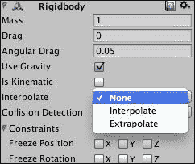

在插值中，通过当前更新时间计算物体的位置，将其向后移动一个物理更新 delta time。

### 注意

**Delta time** 或 **delta timing** 是程序员在涉及帧率和时间时使用的一个概念。更多详情，请查看[`docs.unity3d.com/ScriptReference/Time-deltaTime.html`](http://docs.unity3d.com/ScriptReference/Time-deltaTime.html)。

如果你仔细观察，你会注意到至少有两个物理更新，如下所示：

+   在选择的时间之前

+   在选择的时间之后

Unity 在这两个更新之间进行插值，以获得更新位置的位置。因此，我们可以这样说，插值实际上落后于一个物理更新。

第二个选项是**外推**，用于外推。在这种情况下，Unity 预测物体的未来位置。尽管这不会显示任何延迟，但有时错误的预测会导致视觉上的抖动。

另一个广泛用于动画布料的非常重要的组件是**布料组件**。在这里，你将了解其属性以及如何使用它。

## 布料组件

为了使动画更容易，Unity 提供了一个名为**Cloth**的交互式组件。在**GameObject**菜单中，您可以直接创建**Cloth**游戏对象。请看以下屏幕截图：

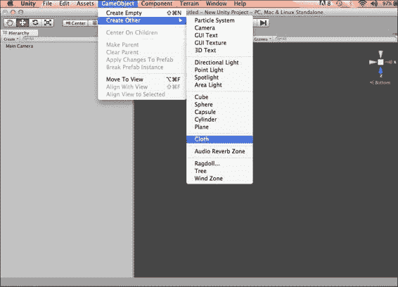

Unity 在其物理部分也提供了布料组件。为了应用它，让我们看看一个例子：

1.  创建一个新的场景并保存它。

1.  创建一个**平面**游戏对象。（我们也可以创建一个**布料**游戏对象。）

1.  导航到**组件** | **物理**并选择**InteractiveCloth**。

    如以下屏幕截图所示，您将在**Inspector**面板中看到以下属性：

    

让我们逐一查看属性。**混合刚度**和**拉伸刚度**定义了布料的混合和拉伸刚度，而**阻尼**定义了布料的阻尼运动。使用**厚度**属性，我们决定布料的厚度，其范围从 0.001 到 10,000。如果我们启用**使用重力**属性，它将影响布料模拟。同样，如果我们启用**自碰撞**，它允许布料与自身碰撞。对于恒定或随机加速度，我们分别应用**外部加速度**和**随机加速度**属性。

**世界速度缩放**决定角色在世界中的运动，这将影响布料顶点。值越高，角色的运动影响就越大。**世界加速度**的作用类似。**Interactive Cloth**组件依赖于**Cloth Renderer**组件。游戏中布料组件过多会降低游戏性能。为了在角色中模拟服装，我们使用**Skinned Cloth**组件。

### 使用布料组件时的要点

在使用布料组件时，以下是一些重要要点：

+   布料模拟不会生成切线。因此，如果您正在使用依赖于切线的着色器，那么从其初始位置移动的布料组件的照明看起来会不正确。

+   我们不能直接改变移动布料游戏对象的变换。这是不支持的。

+   在更改变换之前禁用布料是支持的。

+   **SkinnedCloth**组件与**SkinnedMeshRenderer**一起工作，以模拟角色上的服装。如图所示，我们可以应用**Skinned Cloth**：

如您在以下屏幕截图中所见，我们有不同的属性可以用来获得期望的效果：

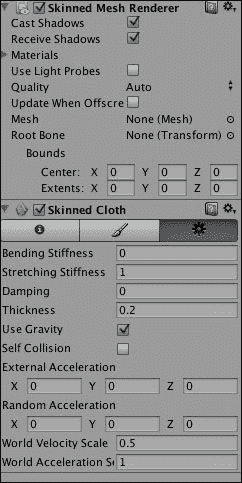

我们可以在任何时候禁用或启用**Skinned Cloth**组件来打开或关闭它。

## ConstantForce

当一个力持续作用于游戏对象时，我们称之为恒力。我们使用`ConstantForce`物理实用类来对游戏对象施加恒力。`AddForce`只在单帧对刚体施加力，而`ConstantForce`则在每个帧施加力，直到我们改变力或扭矩到一个新值。

我们使用这个来处理一次性对象，如火箭。

### 使用 ConstantForce 的动画示例

我们将通过以下步骤查看使用 ConstantForce 的动画示例：

1.  创建一个新的场景并将其保存为`Constant Force Example`。

1.  创建一个**立方体**游戏对象。

1.  如以下截图所示，对其应用**恒力**：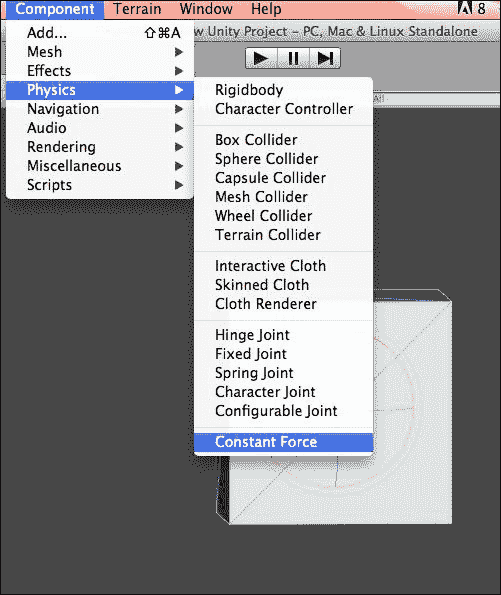

1.  要使立方体向前加速，我们将**相对力**设置为沿正*z*轴。

1.  然后，使用刚体的**Drag**属性设置最大速度并关闭重力，这样游戏对象将始终保持在它的路径上。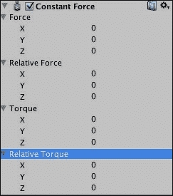

1.  运行场景，你会看到立方体游戏对象持续移动。

到目前为止，你已经学习了不同的物理组件。现在，你将学习如何在脚本中使用物理。在本章中，我们将学习`AddForce`和`AddTorque`。通过在刚体上应用`AddForce`，我们可以使其移动，而`AddTorque`则向刚体添加扭矩，使其绕扭矩轴旋转。

### 使用 AddForce 的动画示例

`AddForce`向刚体添加力。

### 注意

在物理中，**力**是任何倾向于改变物体运动的相互作用。换句话说，力可以使具有质量的物体改变其速度（包括从静止状态开始移动），即加速。力也可以用直观的概念来描述，如推或拉。

在这个示例中，我们将使用`AddForce`物理创建抛射：

1.  创建一个新的场景并将其保存为`addForce example`。

1.  使用**平面**游戏对象创建地面。

1.  在它上面应用绿色材质。

1.  创建一个**胶囊**对象，并如图所示将其**刚体**应用于它。现在，将其命名为`bullet`。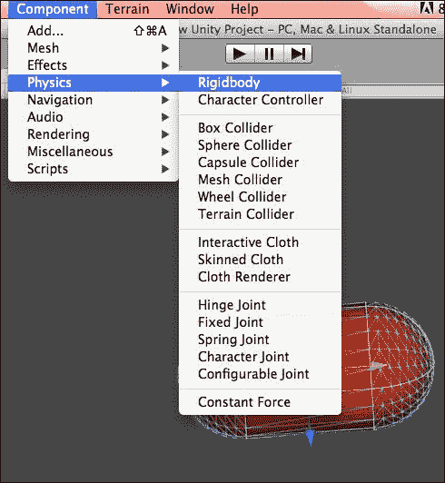

1.  创建一个新的 JavaScript 或 UnityScript，并将其命名为`projectile`。在其内部编写以下代码：

    ```cs
    var speed:int=10000;
    var bulletObject: GameObject;
    private var hitPoint:Vector3;
    private var hit : RaycastHit;
    function Update ()
    {
      var ray = Camera.main.ScreenPointToRay (Input.mousePosition);
      if (Input.GetMouseButtonDown (0))
      {
        if (Physics.Raycast (ray, hit, 300.0f))
        {
          if (hit.collider.tag == "ground")
          {
    // Add "ground " tag to the plane game object.
            var bullet = Instantiate(bulletObject, Vector3(0,1.5,-12), transform.rotation);
            bullet.rigidbody.AddForce( Vector3(0,0.5,0.5) * speed);
          }
        }
      }
    }
    ```

1.  如以下截图所示，你需要指定**子弹对象**：

1.  将**子弹**游戏对象拖动并放入如图所示的**子弹对象**部分：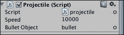

1.  现在，测试场景，你会看到点击时子弹被发射，并以抛射的方式移动。

在这个示例中，我们看到了如何使用`AddForce`创建抛射动画。同样，在下一个示例中，我们将看到如何使用`AddTorque`创建动画。

### 使用 AddTorque 的动画示例

`AddTorque`向 Rigidbody 添加扭矩。

### 注意

扭矩是衡量螺栓或飞轮等物体上旋转力的度量。例如，推动或拉动与螺母或螺栓连接的扳手的把手会产生扭矩（旋转力），从而松开或拧紧螺母或螺栓。

在这个示例中，我们将使用`AddTorque`来创建动画：

1.  创建一个新的场景并将其保存为`AddTorque example`。

1.  创建一个**Cube**游戏对象并将其命名为`box`。

1.  在**Box**游戏对象上添加**Rigidbody**。

1.  创建一个新的 JavaScript 并使用以下代码：

    ```cs
    // Spins the rigidbody around the global y-axis
      var box:GameObject;
      var speed:int=10;
      function FixedUpdate () {
        box.rigidbody.AddTorque (Vector3.up * speed);
      }
    ```

1.  将脚本文件添加到**Main Camera**并将游戏对象 box 拖到 box 变量中。

1.  运行场景，你会看到盒子的旋转运动。

在另一个示例中，我们将创建一个使用不同关节的动画。在上一章中，你学习了不同的关节，包括用于 Ragdoll 效果的字符关节。现在，我们将使用**Fixed Joint**和**Hinge Joint**创建一个绳索动画。

### 使用不同关节的绳索动画示例

在以下示例中，我们将使用不同关节创建一个绳索。关节有助于创建灵活的动画，这就是我们为什么要为绳索动画使用关节。

1.  创建一个新的场景并将其保存为`Rope Animation example`。

1.  创建一个**Sphere**游戏对象并应用一个材质使其变得多彩。

1.  现在，按照以下截图所示，将其应用**Rigidbody**和**Fixed Joint**：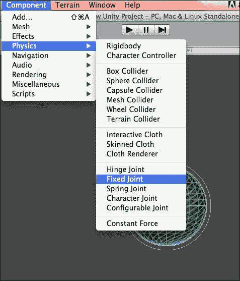

1.  创建一个**Cylinder**游戏对象并将其命名为`Chain 1`。

1.  现在，将其应用**Rigidbody**和**Hinge Joint**。如图所示，你会看到**Connected Body**属性：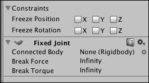

1.  在**Sphere**游戏对象的**Connected Body**属性中，将**Chain 1**游戏对象拖动。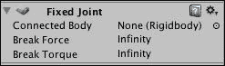

1.  现在，运行场景；你会看到球体随着**Cylinder**游戏对象一起下落，如下面的截图所示：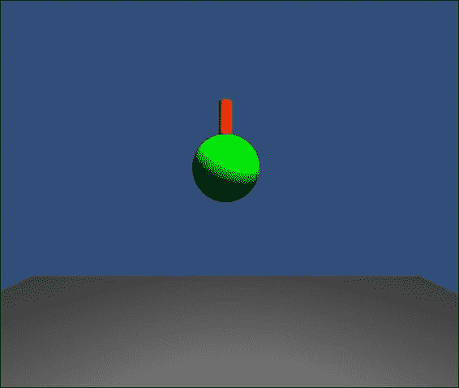

1.  如以下截图所示，现在创建`Chain 2`游戏对象并应用**Rigidbody**和**Hinge Joint**。指定其位置在**Chain 1**上方，并将**Chain 2**作为**Chain 1**的连接体拖动。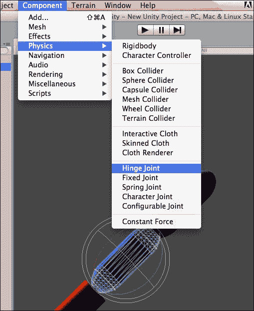

1.  同样，创建**Chain 3**和**Chain 4**。现在，将所有游戏对象旋转，如下面的截图所示：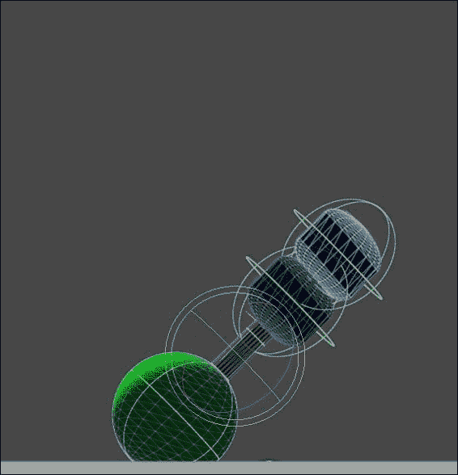

1.  测试这个应用程序；你会看到一个球体悬挂在绳索上：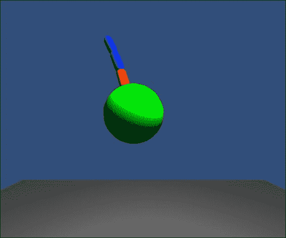

在前面的步骤中，你学习了如何使用不同的关节创建动画。

# 摘要

在本章中，你学习了 Unity 中不同的物理组件，通过这些组件我们可以创建不同类型的动画。你学习了如何使用布料组件和`AddForce`来创建子弹的抛射动画。你还学习了如何使用不同的关节来创建球的破坏动画。在下一章中，你将学习如何使用不同的物理组件来创建平滑的游戏玩法，以及我们如何处理游戏性能。
