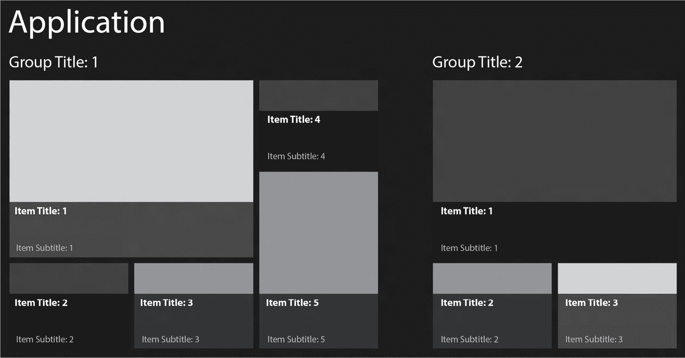
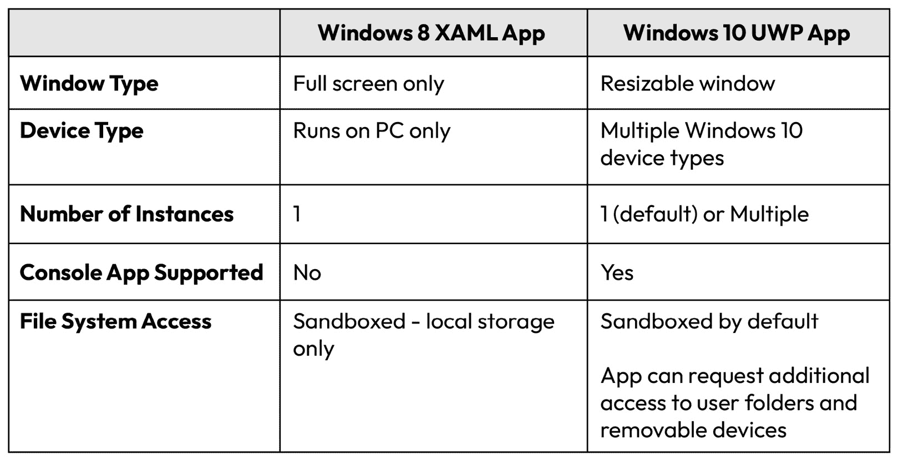
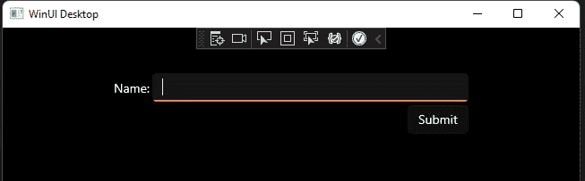
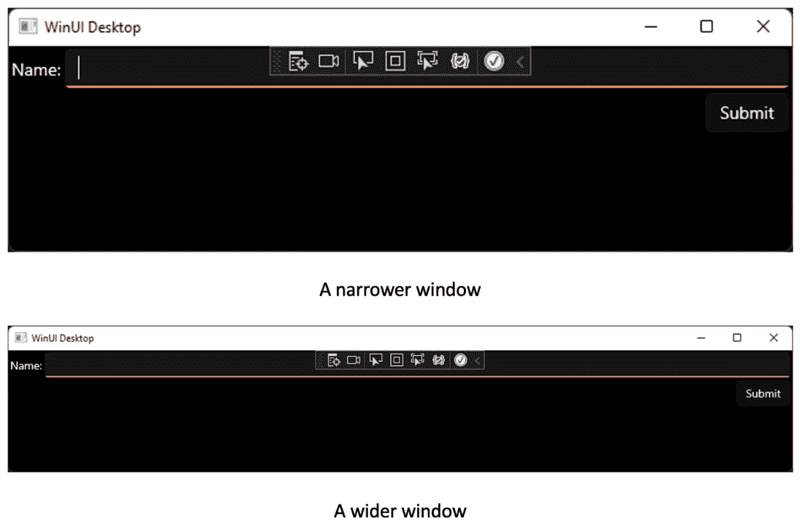
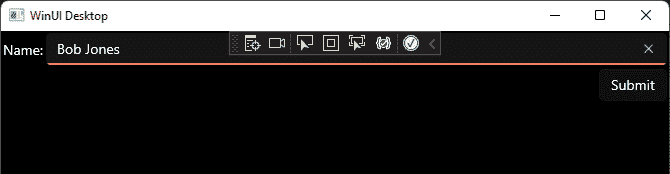
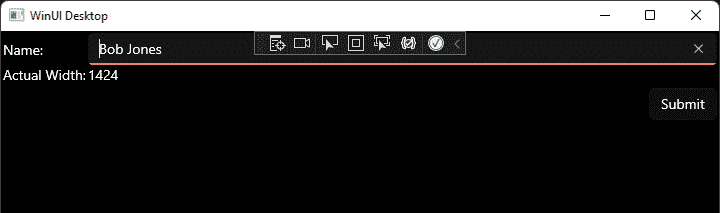
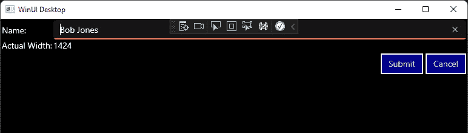
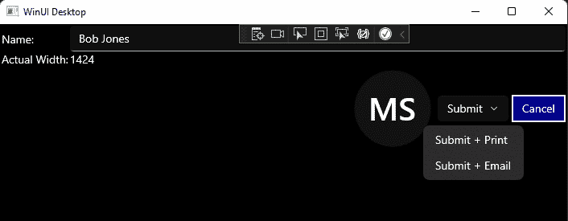

# 第一章：WinUI 简介

**WinUI 3**是一套**用户界面**（**UI**）控件和库，Windows 开发者可以在他们的桌面应用程序中使用。它是 Windows App SDK 的 UI 部分，之前被称为**Project Reunion**。UWP 开发者使用**Windows 软件开发工具包**（**Windows SDK**）来构建他们的应用程序，并在项目属性中必须选择一个目标 SDK 版本。通过从 Windows SDK 中提取 UWP 控件和 UI 组件，为.NET 使用重写它们，并以 WinUI 的名称在**Windows App SDK**中作为一系列库发布，微软能够以比 Windows 本身更快的节奏发布版本（因为 Windows SDK 版本与 Windows 版本相关联）。这种分离还使得控件可以在较旧的 Windows 10 版本上使用。虽然使用 WinUI 构建桌面应用程序是当前的建议，但了解 WinUI 和 Windows App SDK 在更大的 Windows 开发领域中的位置是很重要的。

在这本书中，你将学习如何使用 WinUI 3 库为 Windows 构建应用程序。在整个书籍的过程中，我们将使用推荐的 Windows 应用程序开发模式和最佳实践构建一个真实世界的应用程序。

在我们开始构建 WinUI 应用程序之前，了解 Windows 客户端开发、不同类型的**可扩展应用程序标记语言**（**XAML**）UI 标记以及 WinUI 与其他 Windows 桌面开发框架的比较是很重要的。因此，在本章的第一部分，你将开始学习有关 UWP 和 WinUI 的一些背景知识。

在本章中，我们将学习以下主题：

+   UWP 是什么以及为什么微软又创建了一个新的应用程序框架

+   如何利用 XAML 在多种设备和设备系列上创建出色的 UI

+   为什么创建 WinUI 以及它与 UWP 的关系

+   WinUI 在 Windows 开发者领域中的位置

+   WinUI 3 带来了什么

别担心！覆盖背景知识不会花费很长时间，这将在你开始构建 WinUI 应用程序时提供一些上下文。在下一章中，当你创建你的第一个 WinUI 项目时，你将有机会接触一些代码。

# 技术要求

要跟随本章中的示例，需要以下软件：

+   Windows 10 版本 1809 或更高版本或 Windows 11。您可以在**设置** | **关于**中找到您的 Windows 版本。

+   需要安装 Visual Studio 2022 版本 17.0 或更高版本，并包含以下工作负载：.NET 桌面开发。在**Visual Studio 安装程序**的**安装详情**选项卡中，确保已选择**Windows App SDK C#模板**。

本章的源代码可在 GitHub 上通过以下网址获取：[`github.com/PacktPublishing/Learn-WinUI-3-Second-Edition/tree/main/Chapter01`](https://github.com/PacktPublishing/Learn-WinUI-3-Second-Edition/tree/main/Chapter01)。

注意

Microsoft Learn 上的 Windows App SDK 网站提供了关于设置 WinUI 3 开发开发工作站的最新指南：[`learn.microsoft.com/windows/apps/windows-app-sdk/set-up-your-development-environment`](https://learn.microsoft.com/windows/apps/windows-app-sdk/set-up-your-development-environment)。

# 在 UWP 之前 – Windows 8 XAML 应用程序

在 2015 年 Windows 10 发布之前，Windows 8 和 8.1 有 XAML 应用程序。XAML 语法以及许多**应用程序编程接口**（**API**）是相同的，并且这是微软实现跨桌面、移动和其他平台（Xbox、混合现实等）通用应用程序开发的下一步。可以为 Windows 8 和 Windows Phone 编写 XAML 应用程序。这些项目会生成可以在 PC 或 Windows Phone 上安装的独立二进制文件集。

这些应用程序还有许多其他限制，而现代 UWP 应用则没有。例如，它们只能全屏运行，如下面的截图所示：



图 1.1 – Windows 8 全屏应用（来源：Stack Overflow；根据 CC BY-SA 4.0 复制 – https://creativecommons.org/licenses/by-sa/4.0/）

在 UWP 应用程序开发中，许多对 Windows 8 应用的早期限制已经减少或完全取消。下述**图 1.2**记录了这些变化：



图 1.2 – Windows 8 和 Windows 10 应用比较表

## Windows 应用程序 UI 设计

术语**Metro 风格**用于定义 Windows 8 应用的设计和布局。Metro 风格应用程序旨在支持触摸输入、鼠标和键盘或触控笔。微软推出首款 Windows Phone 是推动 Metro 风格设计的一个关键因素。随着 Surface 设备的推出，Metro 风格后来演变为现代 UI 设计。Metro 的某些方面至今仍存在于 UWP 应用和 Windows 10 中。

Live Tiles 与 Metro 风格一同诞生。这些在用户 Windows 8 主屏幕和 Windows 10 开始菜单上的瓷砖可以更新以显示实时更新，而无需打开应用程序。大多数微软自己的 Windows 10 应用程序都支持 Live Tiles。天气应用程序可以根据用户的当前位置在瓷砖上显示当前的天气状况更新。在 Windows 11 中，Live Tiles 已不再是操作系统的组成部分。它们已被小部件取代，应用程序开发者也可以创建小部件。我们将在*第五章*“探索 WinUI 控件”中进一步讨论小部件。

## Windows 运行时（WinRT）

另一个根植于 Windows 8 应用程序开发的术语是 **WinRT**。RT 字母引起了很多混淆。WinRT 是 **Windows Runtime** 的缩写，它是 Windows XAML 应用使用的底层 API。还有一个名为 Windows RT 的 Windows 8 版本，它支持 Arm 处理器。第一台 Surface PC 是 Surface RT，它运行 Windows 8 RT 操作系统。

尽管 WinRT 今天仍然可以用来定义 UWP 应用消耗的 WinRT API，但你不会经常看到这个术语。我们也将避免在这本书中使用 WinRT，而是将 API 称为 UWP 或 Windows API。

## 用户反弹和通往 Windows 10 的道路

当微软努力通过现代 UI 设计、新的应用模型、Surface PC 以及 Windows 8 和 8.1 来赢得用户时，全屏、以触摸优先的应用体验和淡化 Windows 桌面的想法从未被客户接受。事实证明，Windows 用户真的很喜欢他们多年来在 Windows XP 和 Windows 7 中使用的开始菜单体验。

Windows 应用程序开发的下一步是一个很大的步骤——实际上，微软决定在版本号中跳过一个数字，直接从 Windows 8.1 跳到 Windows 10。

# Windows 10 和 UWP 应用程序开发

在推出 Windows 10 的同时，微软也融合了之前 Windows 版本中最好的功能。它恢复了开始菜单，但其内容看起来非常像 Windows 8 的主页体验。除了所有已安装应用的字母顺序列表外，还有一个可调整大小的应用磁贴区域。实际上，当在平板模式运行 Windows 时，开始菜单可以转换为 Windows 8 风格的主页体验，以更好地适应触摸屏的使用。

当微软推出 Windows 10 时，它还向 Windows 开发者引入了 UWP 应用。虽然 UWP 应用根植于 Windows 8 的 XAML 应用，但一些关键差异为开发者构建平台应用提供了重大优势。

这些应用的一个关键优势是它们的通用性。微软为不同的设备系列构建了 Windows 10 的版本，如下所示：

+   桌面（PC）

+   Xbox

+   移动（Windows Phone）

+   HoloLens

+   IoT

+   IoT 头部无

+   团队（Surface Hub）

UWP 开发者可以构建应用以针对这些设备中的任何一个。所有这些目标共享一个单一的基础 Windows API 集合，并为一些系列的特定设备 API 提供专门的 SDK，例如，有一个用于 HoloLens 开发的混合现实工具包和 SDK。使用 UWP，可以创建一个单一的项目以针对许多设备系列——例如，你可以创建一个为桌面、Xbox 和团队系列创建应用的项目。

因为用于构建应用程序 UI 的 UWP XAML 是相同的，所以跨设备开发的难度降低，代码重用性非常高。XAML 的本质提供了 UI 灵活性，以适应不同的设备尺寸和宽高比。

## 使用 UWP 开发的语言选择

虽然底层的 UWP API 是用 C++ 编写的，但 UWP 开发者在为 Windows 构建应用程序时可以选择多种编程语言。可以使用以下任何流行语言创建 UWP 项目：

+   **C#**

+   **C++**

+   **F#**

+   **Visual Basic .NET** (**VB.NET**)

+   **JavaScript**

你可能会惊讶地看到 JavaScript 在列表中。在 Windows 8.x 时代，开发者可以使用名为 WinJS 应用的 API 创建 JavaScript 应用程序。今天，Microsoft 为 Windows 开发者创建了一个名为 **React Native for Windows** 的分支，称为 React Native for Windows。这些 JavaScript 客户端应用程序可以完全访问与其他 UWP 应用程序相同的 Windows API，并且可以通过 Windows Store 打包和部署。

注意

React Native for Windows 是一个开源项目，由 Microsoft 在 GitHub 上托管，网址为 [`github.com/Microsoft/react-native-windows`](https://github.com/Microsoft/react-native-windows)。

虽然微软为 Windows 10 和 Windows 11 开发的许多 UWP 应用程序是用 C++ 创建的，但大多数其他开发者选择 C#。在本书的整个过程中，我们也将使用 C# 构建我们的应用程序。

## 提升应用程序限制

如前所述，为 Windows 8 构建的应用程序有几个限制，这些限制已被移除或放宽，使用 UWP。

首先，现代 UWP 应用程序可以在可调整大小的窗口中运行，就像任何其他 Windows 桌面应用程序一样。权衡是开发者现在需要测试并处理应用程序几乎任何大小的调整。XAML 的动态特性可以很好地处理很多调整，但低于一定最小尺寸，将需要使用滚动条。

对于最终用户来说，使用 UWP 应用程序的一个好处是它们提供的固有安全性，这是由于应用程序对 PC 文件系统的访问受限。默认情况下，每个应用程序只能访问其自己的本地存储。在 2018 年，Windows 开发团队宣布为 UWP 开发者推出一项新功能。通过添加一些应用程序配置，声明应用程序需要哪些额外的访问类型，应用程序可以请求访问文件系统的其他部分。其中以下是一些：

+   用户库，包括文档、图片、音乐和视频

+   下载

+   可移动设备

注意

可以请求额外的文件系统权限。有关完整列表，请参阅 Microsoft Learn 文档：[`learn.microsoft.com/windows/uwp/files/file-access-permissions`](https://learn.microsoft.com/windows/uwp/files/file-access-permissions)。

请求的任何附加权限都将声明在 Microsoft Store 中的应用程序列表中。

现在 Windows 上的 UWP 应用可以访问一些不太常见的场景。开发者可以向应用添加一些配置和启动代码，以启用其应用的多个实例启动。虽然许多人认为 UWP 应用的特点是 XAML UI，但也可以创建 UWP 控制台应用。该应用在命令行中运行，并可以访问通用 C 运行时调用。这些现在不再受支持，因为开发者现在可以创建.NET 控制台应用并将它们打包为 MSIX，以在 Windows 中提供包标识。

注意

我们将在*第十四章*，*打包和部署 WinUI 应用*中详细讨论应用打包、MSIX 和包标识。

## UWP 向后兼容性

任何 UWP 应用都与 Windows 10 之前的任何版本不兼容。除此之外，每个 UWP 应用都必须声明与其兼容的**目标版本**和**最低版本**的 Windows。目标版本是您推荐版本，它将启用应用的所有特性和功能。最低版本是，不出所料，用户必须拥有的最低 Windows 版本，才能从 Microsoft Store 安装应用。

在创建新的 UWP 项目时，Visual Studio 将提示您选择这些版本。如果两者相同，则会使事情变得简单。您将拥有该 SDK 版本的所有 API 可用。如果目标版本高于最低版本，则需要添加一些条件代码来启用高于最低版本的任何版本的特性。应用必须对运行最低版本的用户仍然有用；否则，建议提高最低版本。如果任何新的 API 或控件对应用至关重要，也建议将最低版本提高到这些 API 或控件可用的版本。

注意

有关编写条件或版本自适应代码的更多信息，请参阅以下 Microsoft Learn 文档：[`learn.microsoft.com/windows/uwp/debug-test-perf/version-adaptive-code`](https://learn.microsoft.com/windows/uwp/debug-test-perf/version-adaptive-code).

如果您正在创建将被您的 UWP 项目引用的.NET 库，并且希望将它们跨平台共享，例如通过.NET MAUI 移动应用，则应针对共享库项目设置.NET Standard 版本。目前最常用的.NET Standard 版本是.NET Standard 2.0。要从 UWP 项目引用.NET Standard 2.0 项目，UWP 项目的目标版本应为 16299 或更高。

与 UWP 相比，WinUI 的主要优势在于它减少了 Windows 应用对特定 Windows 版本的依赖。相反，控件、样式和 API 在 Windows SDK 之外维护。在撰写本文时，WinUI 3 应用所需的最低和目标版本必须设置为 17763 或更高。请查看最新的 WinUI 3 文档以获取当前最低要求。

对于 WinUI 来说，随着项目的成熟，希望将更多的控件和功能带到更多支持的 Windows 版本中。

# XAML 是什么？

**XAML**基于**可扩展标记语言**(**XML**)。这似乎是一件好事，因为 XML 是一种灵活的标记语言，大多数开发者都很熟悉。它确实灵活且强大，但它也有一些缺点。

微软实现 XAML 的主要问题是多年来为不同的开发平台创建了如此多的 XAML 语言变体。目前，WinUI/UWP、**Windows Presentation Foundation** (**WPF**)和.NET MAUI（以前称为 Xamarin.Forms）应用程序都使用 XAML 作为它们的 UI 标记语言，此外还有一些第三方 UI 框架。然而，这些中的每一个都使用不同的 XAML 实现或模式，并且标记无法跨平台共享。在过去，Windows 8、Silverlight 和 Windows Phone 应用程序也有额外的。

如果你以前从未使用过 XAML，你可能准备好查看一些 UI 标记的示例。以下 XAML 是一个片段，定义了包含其他几个基本 WinUI 控件的`Grid`（你可以从这里下载本章的代码：[`github.com/PacktPublishing/-Learn-WinUI-3-second-edition/tree/master/Chapter01`](https://github.com/PacktPublishing/-Learn-WinUI-3-second-edition/tree/master/Chapter01))：

```cs
<Grid Width="400" Height="250" Padding="2"
   HorizontalAlignment="Center"
     VerticalAlignment="Center">
    <Grid.RowDefinitions>
        <RowDefinition Height="Auto"/>
        <RowDefinition Height="*"/>
    </Grid.RowDefinitions>
    <Grid.ColumnDefinitions>
        <ColumnDefinition Width="Auto"/>
        <ColumnDefinition Width="*"/>
    </Grid.ColumnDefinitions>
    <TextBlock Grid.Row="0" Grid.Column="0"
               Text=»Name:»
               Margin=»0,0,2,0»
               VerticalAlignment="Center"/>
    <TextBox Grid.Row="0" Grid.Column="1"
             Text=»»/>
    <Button Grid.Row="1" Grid.Column="1" Margin="0,4,0,0"
            HorizontalAlignment="Right"
            VerticalAlignment="Top"
            Content=»Submit»/>
</Grid>
```

让我们在这里分解 XAML。WinUI 窗口的顶层是`Window`。WinUI 3 应用程序的导航是基于窗口的（与基于页面的 UWP 不同），初始导航发生在项目中的`App.xaml`文件中。你将在*第四章*中了解更多关于导航的内容，*高级 MVVM 概念*。一个`Window`必须只包含一个子元素，并且它将是某种类型的布局面板，如`Grid`或`StackPanel`。默认情况下，会插入一个`StackPanel`作为该子元素。我们将在下一章讨论其他类型的好父容器面板。我对它做了一些修改，并将`StackPanel`替换为`Grid`。

`Height`和`Width`属性为示例提供了静态大小，而`HorizontalAlignment`和`VerticalAlignment`属性将`Grid`在`Window`中居中。在 XAML 的此级别，固定大小并不常见，这限制了布局的灵活性，但它们展示了可用的属性。

`Grid`是一种布局面板，允许开发者定义行和列来排列其元素。行和列可以定义为固定大小、相对于彼此的大小，或者根据其内容自动调整大小。有关更多信息，您可以阅读 Microsoft Learn 文章*使用 XAML 进行响应式布局*：[`learn.microsoft.com/windows/uwp/design/layout/layouts-with-xaml`](https://learn.microsoft.com/windows/uwp/design/layout/layouts-with-xaml)。

`Grid.RowDefinitions`块定义了网格的行数和行为。我们的网格将有两个行。第一个的`Height="Auto"`，这意味着它将根据其内容调整大小，前提是有足够的空间。第二行的`Height="*"`，这意味着网格的剩余垂直空间将分配给这一行。如果有多个行以这种方式定义了高度，它们将平均分配可用空间。我们将在下一章中讨论更多的尺寸选项。

`Grid.ColumnDefinitions`块为网格的列做了`RowDefinitions`为行所做的事情。我们的网格定义了两个列。第一个`ColumnDefinition`的`Height`设置为`Auto`，第二个的`Height="*"`。

`TextBlock`在第一个`Grid.Row`和`Grid.Column`中定义了一个标签。当使用 XAML 时，所有索引都是从`0`开始的。在这种情况下，第一行和列的位置都是`0`。`Text`属性方便地定义了要显示的文本，而在这个例子中，`VerticalAlignment`将文本垂直居中。`TextBlock`的默认`VerticalAlignment`是`Top`。`Margin`属性为控件的外围添加了一些填充。具有所有边相同填充量的边距可以设置为一个单一的数值。在我们的例子中，我们只想在控件的右侧添加几个像素，以将其与`TextBox`分开。输入这些数值的格式是`"<LEFT>,<TOP>,<RIGHT>,<BOTTOM>"`，或者在这里是`"0,0,2,0"`。

`TextBox`是在网格第一行的第二列中定义的文本输入字段。

最后，我们在网格的第二行的第二列中添加了一个`Button`控件。为了将其与上面的控件分开，添加了几像素的上边距。`VerticalAlignment`设置为`Top`（默认是`Center`），`HorizontalAlignment`设置为`Right`（默认是`Center`）。要设置`Button`的文本，你不会像`TextBlock`那样使用`Text`属性，正如你可能认为的那样。实际上，没有`Text`属性。这里使用的是`Button`的`Content`属性。`Content`是一个特殊属性，我们将在下一章中更详细地讨论。现在，只需知道`Content`属性可以包含任何其他控件：文本、`Image`，甚至是一个包含多个其他子控件的`Grid`控件。可能性几乎是无限的。

这里是前面标记生成的 UI：



图 1.3 – WinUI XAML 渲染

这是一个非常简单的例子，让你先尝尝使用 XAML 可以创建什么。随着我们继续前进，你将了解到这种语言是多么强大。

## 为任何设备创建自适应 UI

在前面的例子中，`Grid`有固定的`Height`和`Width`属性。我提到设置固定大小可能会限制 UI 的灵活性。让我们移除固定大小属性，并使用对齐属性来引导 UI 元素以不同的尺寸和宽高比渲染，如下所示：

```cs
<Grid VerticalAlignment="Top" HorizontalAlignment="Stretch" Padding="2">
```

标记的其余部分保持不变。结果是`TextBox`调整大小以适应窗口的宽度，而`Button`在调整大小时保持在窗口的右侧。请看以下几种调整窗口大小的不同方式：



图 1.4 – 调整大小的窗口

如果你在一个较小的 PC 上使用这个应用，比如 Surface Go 笔记本电脑，内容会自动调整大小以适应可用空间。这就是 XAML 自适应特性的力量。在构建 UI 时，你通常会想要选择相对和自适应属性，比如对固定大小和位置的定位。

正是这种自适应布局使得 XAML 在.NET MAUI 的移动设备上工作得如此出色，这也是为什么 WPF 开发者自从 Windows Vista 发布以来就喜欢使用它的原因。

## 强大的数据绑定

另一个原因，为什么基于 XAML 的框架如此受欢迎，就是它们数据绑定功能的简便性和强大。几乎 WinUI 控件上的所有属性都可以进行数据绑定。数据源可以是数据源上的一个对象或对象列表。在大多数情况下，这个源将是一个`ViewModel`类。让我们快速看一下如何使用 WinUI 的`Binding`语法将数据绑定到`ViewModel`类上的一个属性，如下所示：

1.  首先，我们将创建一个简单的`MainViewModel`类，它有一个`Name`属性，如下所示：

    ```cs
    public class MainViewModel : INotifyPropertyChanged
    {
        public event PropertyChangedEventHandler
          PropertyChanged;
        private string _name;
        public MainViewModel()
        {
            _name = "Bob Jones";
        }
        public string Name
        {
            get
            {
                return _name;
            }
            set
            {
                if (_name == value) return;
                _name = value;
                PropertyChanged?.Invoke(this, new
                  PropertyChangedEventArgs(nameof(Name)));
            }
        }
    }
    ```

    `MainViewModel`类实现了一个名为`INotifyPropertyChanged`的接口。这个接口是 UI 在数据绑定属性更改时接收更新的关键。这个接口的实现通常被`ViewModelBase`类包装。现在，我们将直接在`Name`属性的 setter 中调用`PropertyChanged`事件。我们将在*第三章*中了解更多关于`ViewModels`和`INotifyPropertyChanged`接口的信息，*可维护性和可测试性的 MVVM*。

1.  下一步是创建`MainViewModel`类的一个实例，并将其设置为`MainWindow`的`ViewModel`。这发生在页面的代码后文件`MainWindow.xaml.cs`中，如下面的代码片段所示：

    ```cs
    public sealed partial class MainWindow : Window
    {
        public MainWindow()
        {
            this.InitializeComponent();
            ViewModel = new MainViewModel();
        }
        public MainViewModel ViewModel { get; private set; }
    }
    ```

    我们在`MainWindow`中添加了一个`ViewModel`属性，并在构造函数中将其设置为`MainViewModel`类的新实例。

小贴士

任何添加到窗口构造函数中并与任何 UI 元素交互的代码都必须在调用`InitializeComponent()`之后添加。

1.  现在是时候将数据绑定代码添加到`TextBox`的 XAML 标记中，如下所示：

    ```cs
    <TextBox Grid.Row="0" Grid.Column="1" Text="{x:Bind
      Path=ViewModel.Name, Mode=TwoWay}"/>
    ```

    添加了一些标记来使用`x:Bind`标记扩展设置`Text`属性。数据绑定的`Path`设置为`ViewModel`上的`Name`属性，该属性在代码隐藏文件中的*步骤 2*中分配。通过将数据绑定模式设置为`TwoWay`，`ViewModel`中的更新将在 UI 中显示，并且用户在 UI 中的任何更新也将持久保存在`MainViewModel`类的`Name`属性中。现在，运行应用程序将自动填充在`ViewModel`构造函数中设置的名称，如下面的截图所示：



图 1.5 – 数据绑定 TextBox

1.  为了说明将数据绑定到页面上另一个 UI 元素的另一个属性，我们首先修改网格以添加一个名称，如下所示：

    ```cs
    <Grid x:Name="ParentGrid"
          VerticalAlignment="Top"
          HorizontalAlignment="Stretch"
          Padding="2">
    ```

1.  现在向`Grid`添加另一个`RowDefinition`以适应页面上的新 UI 元素：

    ```cs
    <Grid.RowDefinitions>
        <RowDefinition Height="Auto"/>
        <RowDefinition Height="Auto"/>
        <RowDefinition Height="*"/>
    </Grid.RowDefinitions>
    ```

1.  接下来，添加一个`TextBlock`元素，并使用`Binding`标记扩展将其`Text`属性绑定到设置为`ParentGrid`的`ElementName`的`ActualWidth`。我们还添加了一个`TextBlock`来标记它为**实际宽度**：

    ```cs
    <TextBlock Grid.Row="1" Grid.Column="0"
               Text="Actual Width:"
               Margin="0,0,2,0"
               VerticalAlignment="Center"/>
    <TextBlock Grid.Row="1" Grid.Column="1"
               Text="{Binding ElementName=ParentGrid,
                              Path=ActualWidth}"/>
    ```

1.  接下来，更新`Grid.Row` 2。

1.  现在新的`TextBlock`控件在页面加载时显示`ParentGrid`的宽度。请注意，如果你调整窗口大小，它不会更新值。`ActualWidth`属性不会引发属性更改通知。这在`FrameworkElement.ActualWidth`文档中有记录：[`learn.microsoft.com/windows/windows-app-sdk/api/winrt/microsoft.ui.xaml.frameworkelement.actualwidth`](https://learn.microsoft.com/windows/windows-app-sdk/api/winrt/microsoft.ui.xaml.frameworkelement.actualwidth)：



图 1.6 – 将数据绑定到另一个元素

**提交**按钮目前还没有功能。你将在*第五章*“探索 WinUI 控件”中学习如何使用 MVVM 与**事件**和**命令**一起工作。

## 使用 XAML 对 UI 进行样式设计

当使用 XAML 时，可以在几乎任何范围内定义和应用样式，从全局的`App.xaml`应用到当前`Window`中的`Window.Resources`声明，或者在任何级别或嵌套控件上。`Style`元素指定了一个`TargetType`属性，它是要由样式针对的元素的数据类型。它可以可选地定义一个`Key`属性，作为唯一标识符，就像在`Key`属性中可以使用的类标识符一样，可以用来仅将样式应用于该类型的选定元素。与 CSS 类不同，一个元素只能分配一个`Key`属性。

在下一个示例中，我们将修改页面以定义一个用于窗口上所有按钮的`Style`属性，如下所示：

1.  首先，将 `StackPanel` 元素移动。`StackPanel` 元素以水平或垂直方向堆叠所有子元素，其中垂直是默认方向。一些按钮的属性需要移动到 `StackPanel` 元素，因为现在它是 `Grid` 的直接子元素。在 `StackPanel` 元素中添加第二个按钮以充当 `StackPanel` 之后，`StackPanel` 和 `Button` 元素应如下所示：

    ```cs
    <StackPanel Grid.Row="2" Grid.Column="1"
                Margin="0,4,0,0"
                HorizontalAlignment="Right"
                VerticalAlignment="Top"
                Orientation="Horizontal">
        <Button Content="Submit" Margin="0,0,4,0"/>
        <Button Content="Cancel"/>
    </StackPanel>
    ```

    已为第一个按钮添加了一个新的 `Margin` 属性，以在元素之间添加一些空间。

1.  接下来，我们将在 `Grid` 的嵌套 `Grid.Resources` 部分中添加一个 `Style` 块，在所有控件之前对其进行样式化。由于未为 `Style` 块分配 `Key`，它将应用于所有没有在内部作用域中覆盖样式的 `Button` 元素。这被称为 *隐式样式*。此代码如下所示：

    ```cs
    <Grid.Resources>
        <Style TargetType="Button">
            <Setter Property="BorderThickness"
                    Value="2" />
            <Setter Property="Foreground"
                    Value="LightGray" />
            <Setter Property="BorderBrush"
                    Value="GhostWhite"/>
            <Setter Property="Background"
                    Value="DarkBlue" />
        </Style>
    </Grid.Resources>
    ```

1.  现在，当你运行应用程序时，你会看到新的样式已应用于 **提交** 和 **取消** 按钮，而无需直接为每个控件添加任何样式，如下面的截图所示：



图 1.7 – 样式化按钮

如果我们将 `Style` 块移动到 `App.xaml` 中的 `Application.Resources` 部分，则定义的样式将应用于整个应用程序中的每个按钮，除非开发人员已单独覆盖了样式中的某些属性。例如，如果将 `Background` 属性设置为 `DarkGreen`，则只有 **取消** 按钮会显示为深蓝色。

我们将在*第七章*“Windows 应用程序的流畅设计系统”中花费更多的时间来讨论样式和设计。

## 将展示逻辑与业务逻辑分离

在早期关于数据绑定的章节中，我们简要地讨论了 MVVM 模式。MVVM 是 WinUI 应用程序开发中展示逻辑与业务逻辑分离的关键。XAML 元素只需要知道在其数据上下文中某个地方存在一个特定名称的属性。`ViewModel` 类对 `View`（我们的 XAML 文件）没有任何了解。

这种分离提供了几个好处。首先，`ViewModels` 可以独立于 UI 进行测试。如果系统在测试中引用了任何 WinUI 元素，则需要 UI 线程。这将在本地或 CI 服务器上运行时导致测试失败。有关 WinUI 应用程序单元测试的更多信息，请参阅这篇 Microsoft 博客文章：[`devblogs.microsoft.com/ifdef-windows/winui-desktop-unit-tests/`](https://devblogs.microsoft.com/ifdef-windows/winui-desktop-unit-tests/)。

`View`/`ViewModel`分离的下一个好处是，对于拥有专用`ViewModels`的企业来说。当需要同步这两个组件时，开发者可以向 XAML 添加必要的数据绑定属性，或者 UX 设计师和开发者可能已经就共享数据上下文中的属性名称达成一致。Visual Studio 包含另一个针对设计师的工具，称为**Blend for Visual Studio**。Blend 最初由微软在 2006 年作为 Microsoft Expression Blend 发布，作为设计师创建 WPF UI 的工具。后来增加了对其他 XAML 语言的支持，如 Silverlight 和 UWP。当安装 Visual Studio 时，Blend 仍然包含在.NET 桌面开发工作负载中。

我们在这里要讨论的最后一个好处是，在应用程序的任何层之间良好的关注点分离将始终导致更好的可维护性。如果有多个组件参与单个责任，或者逻辑在多个地方重复，这会导致有缺陷的代码和不可靠的应用程序。遵循良好的设计模式，你将节省自己在未来大量的工作。

现在你已经很好地理解了 UWP 应用程序的历史，是时候看看 WinUI 了：它是什么，以及为什么它被创建。

# 什么是 WinUI？

WinUI 库是从 Windows SDK 中提取的一组控件和 UI 组件，并包含在 Windows App SDK 中。在此分离之后，许多控件得到了增强，其他控件也被添加。Windows App SDK 正在公开开发。其问题在 GitHub 上跟踪，并得到微软和 Windows 开发者社区的支持。

因此，如果你这些 WinUI 库是基于 Windows SDK 中的 UWP 库，你可能想知道为什么你应该选择 WinUI 作为你的 UI 框架而不是 UWP。UWP 自 Windows 10 发布以来一直存在，并且非常健壮和稳定。有多个非常好的理由考虑 WinUI。

选择 WinUI 带来了许多**开源软件**（**OSS**）的好处。OSS 通常非常可靠。当软件由活跃的开发者社区在公开环境中开发时，问题会被发现并迅速解决。实际上，如果你发现开源包中的问题，你可以自己修复它，并通过提交拉取请求将修复提供给整个社区。开源项目可以快速迭代，而无需与大型企业中的产品组（如 Windows 团队）保持同步。现在，Windows 定期发布功能更新，但这仍然比典型的控件库要少。尽管 Windows App SDK 和 WinUI 3 还不是开源的，但它仍然是产品路线图的一部分。

使用 WinUI 的最佳理由是其向后兼容性。当使用 UWP 控件时，特定版本的控件中的功能和修复无法部署到较旧版本的 Windows 应用程序中。使用 WinUI，只要你的目标是 WinUI 整体支持的最低 Windows 版本，你就可以在多个 Windows 版本中使用那些新控件和功能。在某个 Windows 版本中，UWP 开发者之前无法使用的控件现在作为 WinUI 控件可用。

例如，微软直到 2017 年秋季发布（版本 16299）才将 Fluent UI 设计引入 Windows。然而，WinUI 控件可以包含在针对最低 Windows 版本为 Windows 10 版本 1809 的应用程序中，即 2019 年秋季发布。WinUI 中的控件支持 Fluent UI 风格。WinUI 添加了 UWP 和 Windows SDK 中完全不可用的控件和其他功能。

## WinUI 的第一个版本

WinUI 的第一个版本于 2018 年 7 月发布，作为 Windows 开发者的预览版。它作为以下两个 NuGet 包发布：

+   `Microsoft.UI.Xaml`：WinUI 控件和 Fluent UI 风格

+   `Microsoft.UI.Xaml.Core.Direct`：中间件开发者访问 `XamlDirect` API 的组件

3 个月后，WinUI 2.0 发布。尽管版本号如此，但它却是 WinUI 的第一个生产版本。该版本包括超过 20 个控件和画笔。一些值得注意的控件包括以下内容：

+   `TreeView`：任何 UI 库的必备品。

+   `ColorPicker`：一个具有颜色光谱的丰富视觉颜色选择器。

+   `DropDownButton`：一个可以打开菜单的按钮。

+   `PersonPicture`：用于显示头像的图像控件。它可以将显示首字母或通用占位符图像。

+   `RatingControl`：允许用户为项目输入星级评分。

注意

WinUI 2.x 版本是 UWP 项目使用的库。WinUI 3 是 Windows App SDK 的一部分，并且是其自己的项目类型，尽管它与 UWP 项目共享相同的 XAML 架构。

让我们在我们的 WinUI 项目中添加一些这些控件，看看它们的外观。将 `StackPanel` 的内容更改为如下所示：

```cs
<StackPanel Grid.Row="1" Grid.Column="1" Margin="0,4,0,0"
            HorizontalAlignment="Right"
            VerticalAlignment="Top"
            Orientation="Horizontal">
    <PersonPicture Initials="MS" Margin="0,0,8,0"/>
    <DropDownButton Content="Submit" Margin="0,0,4,0">
        <DropDownButton.Flyout>
            <MenuFlyout Placement="Bottom">
                <MenuFlyoutItem Text="Submit + Print"/>
                <MenuFlyoutItem Text="Submit + Email"/>
            </MenuFlyout>
        </DropDownButton.Flyout>
    </DropDownButton>
    <Button Content="Cancel"/>
</StackPanel>
```

在 `StackPanel` 的第一个位置添加了一个带有首字母 `MS` 的 `PersonPicture` 控件，两个按钮中的第一个已被 `DropDownButton` 控件替换。`DropDownButton` 控件有一个作为下拉列表的 `FlyoutMenu`，并且有两个 `MenuFlyoutMenuItem` 元素。现在，用户可以简单地点击显示的下拉菜单：



图 1.8 – 添加 PersonPicture 和 DropDownButton 控件

我们只是刚刚触及 WinUI 为 Windows 开发者所能做的事情的表面。不用担心，我们将在接下来的章节中深入探讨。在 WinUI 3 之前，让我们简要看看后续版本中添加了什么。

## WinUI 3 的道路

在 2.0 版本之后，WinUI 还发布了五个额外的次要版本，以及许多增量错误修复和预发布版本。

### WinUI 2.1

WinUI 2.1 版本发布带来了几个新的控件和功能，以下是亮点：

+   `TeachingTip`：将`TeachingTip`视为一个丰富、上下文相关的工具提示。它与页面上的另一个元素相关联，并显示有关目标元素的详细信息，以帮助用户通过非侵入性内容进行引导。

+   `AnimatedVisualPlayer`：这个控件用于托管 Lottie 动画。Lottie 文件是由设计师在**Adobe After Effects**中创建的流行动画格式，被 Windows、网页和移动平台的设计师所使用。现在大多数现代开发框架都有可用的库来托管 Lottie 动画。

注意

在他们的网站上获取有关 Lottie 文件的更多信息：[`airbnb.design/lottie/`](https://airbnb.design/lottie/)，并查看这个 Lottie 动画文件的优秀存储库：[`lottiefiles.com/`](https://lottiefiles.com/)。

+   `CompactDensity`：将此资源字典添加到您的应用程序中可以提供在**紧凑**和**正常**显示模式之间切换的能力。`CompactDensity`将减少页面内和页面之间的间距，为用户提供多达 33%的更多可见内容。这个 Fluent UI 设计概念是在微软 Build 2018 大会上向开发者介绍的。

### WinUI 2.2

本版本对现有功能带来了许多增强。然而，库中添加的唯一新控件是许多 Windows 开发者可能会发现有用的控件。

`TabView`控件在屏幕上创建了一个熟悉的标签式用户体验。每个标签可以托管 WinUI 项目中的一个页面。

#### WinUI 2.2 增强功能

在这里列出了版本 2.2 中一些值得注意的更新控件和库：

+   `NavigationView`控件得到了增强，允许在面板折叠时保持返回按钮可见。其他视觉更新最大化了控件的可视内容。

+   `CornerRadius`、`BorderThickness`、`CheckBox`和`RadioButton`。这些更新使 WinUI 视觉元素更加一致，并与 Fluent UI 设计指南保持一致。

### WinUI 2.3

在 WinUI 2.3 版本中，`ProgressBar`控件进行了一些更新，并添加了几个新的控件到库中。

在 WinUI 应用程序中创建`ProgressBar`元素时，现在有两种可用模式：**确定**和**不确定**。确定进度条有一个已知任务完成量和当前任务状态。不确定控件表示任务正在进行中，但没有已知完成时间。它的目的是像忙碌指示器一样。

#### WinUI 2.3 中的新控件

本更新中包含了一些新的控件：

+   `NumberBox`：`NumberBox`控件是一个输入编辑器，它使得支持数字格式化、上下增减按钮和内联数学计算变得容易。它看似简单但实用且功能强大。

+   `RadioButtons`：你可能认为，“单选按钮一直都有。这怎么算是一个新控件呢？”`RadioButtons` 是一个将一组 `RadioButton`（单数）控件组合在一起的控件，使得作为单个单元处理它们变得更加容易。

### WinUI 2.4

当它在 2020 年 5 月发布时，WinUI 2.4 提供了两个新功能：一个 `RadialGradientBrush` 视觉效果和一个 `ProgressRing` 控件。

该画笔在用法上与 WPF 开发者使用的 `RadialGradientBrush` 类似。它使得向从中心点辐射出的视觉元素添加渐变变得容易。

如其名所示，`ProgressRing` 控件以圆形格式重新创建了进度条功能。在版本 2.4 中，该控件提供了确定状态和不确定状态。不确定的 `ProgressRing` 控件显示重复动画，并且是控件的默认状态。

在版本 2.4 中更新了几个控件。`TabView` 控件得到了更新，以提供更多控制选项来渲染标签页，包括 `TextBox` 控件获得了 *深色模式* 增强，以保持控件内容区域为深色，默认为白色文本。最后，`NavigationView` 控件更新为支持分层导航，包括 `Left`、`Top` 和 `LeftCompact` 模式。

### WinUI 2.5

WinUI 2.5 于 2020 年 12 月发布，并包含了一个新的 `InfoBar` 控件。该版本还包含了多个控件增强和错误修复。

`InfoBar` 控件提供了一种向用户显示重要状态消息的方式。该控件可以显示警报或信息图标、状态消息以及允许用户对消息采取行动的链接或按钮。还有一个选项在消息右侧显示关闭按钮。默认情况下，该控件包括图标、消息和关闭按钮。Microsoft Learn 为此新控件提供了使用指南。这是 WinUI 3 版本控件的文档：[`learn.microsoft.com/windows/windows-app-sdk/api/winrt/microsoft.ui.xaml.controls.infobar`](https://learn.microsoft.com/windows/windows-app-sdk/api/winrt/microsoft.ui.xaml.controls.infobar)。

版本 2.5 中也提供了一些更新。`ProgressRing` 控件在确定状态方面得到了增强。`NavigationView` 控件更新为提供可定制的 `FooterMenuItems`。在 `NavigationView` 控件的先前版本中，页脚区域可以显示或隐藏，但不能进行自定义。

WinUI 2.x 在版本 2.6、2.7 和 2.8 中继续添加控件和功能。有关每个版本中新增功能的完整列表，请参阅以下 Microsoft Learn 上的发布说明页面：

+   WinUI 2.6 发布说明：[`learn.microsoft.com/windows/apps/winui/winui2/release-notes/winui-2.6`](https://learn.microsoft.com/windows/apps/winui/winui2/release-notes/winui-2.6)

)

+   WinUI 2.7 版本说明：[`learn.microsoft.com/windows/apps/winui/winui2/release-notes/winui-2.7`](https://learn.microsoft.com/windows/apps/winui/winui2/release-notes/winui-2.7)

)

+   WinUI 2.8 版本说明：[`learn.microsoft.com/windows/apps/winui/winui2/release-notes/winui-2.8`](https://learn.microsoft.com/windows/apps/winui/winui2/release-notes/winui-2.8)

)

我们已经看到了 WinUI 2 中为 UWP 开发者提供的内容。现在，让我们看看 WinUI 3 和 Windows App SDK 能给你带来什么。

# WinUI 3 的新特性是什么？

与 WinUI 2.0 及其后续的增量版本不同，WinUI 3 是一个重大更新，它不仅提供了更多的新控件和库，用于与 Windows 桌面应用一起使用。实际上，WinUI 3 的主要目标并不是在其当前的 UWP 对应版本之外添加新的控件和功能。Windows App SDK 团队已经将 WinUI 打造成为一个完整的 UI 框架，它可以建立在 Windows 桌面.NET 平台之上。

## 再见，UWP？

那么，UWP 会发生什么变化？我们的 UWP 应用会停止工作吗？

如前所述，UWP UI 库的计划是继续提供重要的安全更新，但它们将不会获得任何新的功能。很可能 WinUI 2.8 将是最终的 2.x 版本。所有新的功能和更新都将为 WinUI 和 Windows App SDK 开发。新应用将使用 WinUI 开发，可以是.NET，用 C#或 VB 编写，或者使用原生 C++。这些客户端将建立在 Win32 平台之上。这一切都是因为 Windows App SDK 完全用 C++开发的。

由于它是用 C++开发的，这使得**Windows 的 React Native 客户端应用**能够与 Windows App SDK 平台进行交互。在 React Native 和 Uno Platform 之间，WinUI 具有很大的跨平台潜力。

开发者将为 Windows PC 和平板设备创建应用提供多条路径。其他 Windows 设备，如 Xbox 和 HoloLens，需要继续开发 UWP 应用并使用 WinUI 2.x 控件。

## WinUI 3 和 Windows App SDK 的新特性

WinUI 3 有哪些新特性？

虽然听起来团队正忙于创建一个用于替换 UWP UI 库的 UI 框架，但他们确实抽出时间添加了一些新功能。WinUI 3 中可用的主要新控件是新的`WebView2`控件。它是一个基于新 Chromium 内核的**Microsoft Edge**浏览器的网页浏览器宿主控件。兼容性也是一个特性。所有在 2019 年春季 Windows SDK 中可用的 XAML 和 Composition 功能都将向后兼容，回溯到 Windows 10 1809 更新及以后版本。

## Windows App SDK 和 WinUI

WinUI 3 正在将桌面应用程序开发者聚集在单一的 UI 库集合中，但这只是开始。在微软的 Build 2020 大会上，Windows 团队宣布了**Project Reunion**，这是一个长期计划，旨在将所有 Windows 开发者聚集在单一平台上。当 WinUI 在 2021 年发布时，Project Reunion 被更名为 Windows App SDK。WinUI 3 专注于 UI 层，而 Windows App SDK 将包括 WinUI 和整个 Windows 开发者平台。2021 年，微软发布了三个版本的 Windows App SDK 和 WinUI 3。

想了解更多关于 Windows App SDK 及其进展，您可以查看团队在 GitHub 上的仓库[`github.com/microsoft/WindowsAppSDK`](https://github.com/microsoft/WindowsAppSDK)。现在，让我们看看 WinUI 与其他 Windows 开发框架相比如何。

# WinUI 3 与其他 Windows 开发框架的比较

WinUI 在微软的 Windows 开发框架的整体格局中处于什么位置？让我们通过一些比较来帮助回答这个问题，从与 WinUI 最相似的那些开始。

## WinUI 与 UWP

这是一个棘手的比较，因为 WinUI 应用程序今天与 UWP 应用程序共享相同的 XAML 架构。事实上，WinUI 2.x 是 UWP 应用程序的控件。它们共享相同的 XAML 架构、基础视觉元素和底层 Windows API。任何指定了相同的最小和目标 Windows 版本的 UWP 应用程序都可以添加 WinUI 2.x 库以利用新的和更新的功能。然而，UWP 将不会收到 WinUI 2.8 之后的任何功能更新。只有作为 2.8x 次要版本的补丁和安全更新将会发布。

使用 WinUI 的应用程序与传统 UWP 应用程序之间的一个关键区别是，无需更新 Windows SDK 即可访问新的和更新的控件以及其他视觉元素。这使得开发者能够将具有相同外观和功能的软件带给更多使用 Windows 10 或 Windows 11 多个版本的用户。这种差异化使得开发者和用户都更加满意。

WinUI 3 也有使用最新.NET 版本和 C#语言特性的优势。随着.NET 新版本的发布，它将继续从中受益。作为真正的.NET 桌面应用程序，它们不受 UWP 沙盒的限制。它们可以完全访问硬件和文件系统，并可以使用大多数 API。WinUI 3 应用程序比 UWP 应用程序对它们的窗口大小和外观有更多的控制。然而，想要针对 HoloLens 或 Xbox 等平台进行开发的开发者必须坚持使用 UWP 开发。

## WinUI 与 WPF

WinUI 和 WPF 有许多相似之处。它们都是应用程序框架，这两种类型的应用程序都依赖于 XAML 来定义 UI 元素。这意味着在实现 MVVM 模式时，它们都提供了相同的 UI 和业务逻辑分离。WPF XAML 具有与 UI 布局相同的样式、资源、数据绑定和自适应的概念。

### WinUI 优势

WinUI 的一个显著性能优势是 XAML 中 `x:Bind` 语法的使用，而不是 `Binding`。

除非您的 WinUI 应用程序使用 `uap10:TrustLevel="appContainer"` 进行 MSIX 打包，否则 WinUI 和 WPF 都可以完全访问用户的文件系统和使用设备。它们的访问仅受 PC 上 **Windows 用户账户控制** (**UAC**) 的配置限制。WinUI 有使用 GPU 加速功能（如 Mica 和 Acrylic 毛刷）的优势，以支持最新的 Windows 风格，例如微软的内置应用程序。这些样式对 WPF 应用程序不可用，使它们感觉不那么现代。

### WPF 优势

WPF 应用程序的主要优势是它们并不直接绑定到 Windows 的最低版本。WPF 应用程序针对 .NET 版本。任何支持目标 .NET 版本的 Windows 版本都可以运行该 WPF 应用程序。这显著增加了 WPF 应用程序的可能用户基础。实际上，WPF 应用程序可以在带有 .NET Framework 的 Windows 7 上部署和运行，这是 UWP 或 WinUI 所无法实现的。

注意

有一个名为 **Uno Platform** 的产品，它使 WinUI XAML 能够在 iOS、Android、macOS、Linux 以及三星 Tizen 手表上运行，还可以在带有 **WebAssembly** 的网络上运行。这些 WinUI 网络应用程序可以在包括 Windows 7 在内的旧版 Windows 版本的浏览器中运行。Uno Platform 的目标和口号是 *WinUI 到处都是*。

在 [`platform.uno/`](https://platform.uno/) 了解更多关于 Uno Platform 的信息。我们将在 *第十三章* “使用 Uno Platform 将您的应用程序跨平台化”中创建一个 Uno Platform 项目。

在 [`webassembly.org/`](https://webassembly.org/) 了解更多关于 WebAssembly 的信息。

新的 WPF 优势随着 .NET Core 3.x 和 .NET 5 以及后续版本的发布而出现。.NET 开发者现在可以使用 .NET Core 创建 WPF 应用程序，将现代 .NET 的性能和部署优势带给 WPF 开发者。例如，针对不同 .NET 版本的应用程序可以在不创建版本冲突的情况下在同一台机器上并行部署。然而，正如之前提到的，WinUI 3 应用程序也利用了最新的 .NET 功能和性能。

关于部署模型的差异，可以争论哪个框架具有优势。部署 WinUI 应用程序最简单的方法是通过 Microsoft Store。使用 .NET 部署 WPF 应用程序的最简单方法是使用安装程序包。WPF 应用程序可以通过添加 Windows MSIX 打包项目通过 Store 进行部署，而 WinUI 应用程序可以使用 MSIX 安装程序或 **Windows 包管理器** 在没有 Store 的情况下进行部署。WinUI 部署将在 *第十四章* “打包和部署 WinUI 应用程序”中详细说明。

## WinUI 与 Windows Forms (WinForms)

WinForms 是随着.NET Framework 1.0 一起引入的.NET UI 框架。开发者可以使用 Visual Studio 中的可视化设计表面轻松创建 WinForms UI，该表面会生成在运行时创建 UI 的 C#或 VB 代码。WPF 的大部分优势和劣势也适用于 WinForms：安全性、部署和.NET——WinForms 应用程序也可以使用.NET Core 3.x 及更高版本创建。

### WinUI 优势

WinUI 与 WPF 之间的相似之处在于它们相对于 WinForms 的主要优势：数据绑定、自适应布局和灵活的样式模型。这些优势都源于对 XAML 用于 UI 布局的使用。XAML 的另一个优势是将渲染处理从**中央处理器**（**CPU**）卸载到**图形处理器**（**GPU**）。WinUI 控件默认继承 Windows 样式，比 WinForms 控件看起来更现代。WinUI 应用程序也很好地处理**每英寸点数**（**DPI**）缩放和触摸输入。WinForms UI 框架在触摸输入和 DPI 缩放成为 Windows 开发者关注的问题之前就已经成熟。本地化和 UI 性能也是 WinUI 3 相对于 WinForms 的巨大优势。

### WinForms 优势

除了 WinForms 与 WinUI 共享的 Windows、.NET 应用程序和 Windows 兼容性等优势之外，WinForms 还因其快速 UI 开发而享有良好的声誉。如果你需要在最短的时间内创建一个简单的 Windows 应用程序，WinForms 的拖放式设计器既简单又直观。WinForms 最近也进行了一些更新，以改进其数据绑定支持，现在它还支持 MVVM 的 ICommand。有关这些改进的更多信息，请参阅这篇.NET 博客文章：[`devblogs.microsoft.com/dotnet/winforms-cross-platform-dotnet-maui-command-binding/`](https://devblogs.microsoft.com/dotnet/winforms-cross-platform-dotnet-maui-command-binding/).

许多经验丰富的 Windows 开发者仍然在需要为.NET 库创建简单的实用程序或 UI 测试框架时默认选择 WinForms。

# 摘要

在本章中，我们介绍了 Windows 应用程序开发的历史。我们了解了 UWP 的起源及其与 Windows 8 应用程序的渊源，并学习了在构建 Windows UI 时 XAML 的优势。我们还体验了一些简单的 WinUI 应用程序代码和 UI 的样貌。最后，我们考察了 WinUI 版本的近期历史，以及 WinUI 3 如何完全替代 UWP UI 库，并成为 WPF 开发者未来可行的选择。

这将为我们在接下来的章节中开始使用 WinUI 构建应用提供一个良好的基础。在下一章中，你将设置你的开发环境，了解我们将贯穿整本书创建的应用程序项目，并创建你的第一个 WinUI 3 项目。当我们到达*第三章*，*可维护性和可测试性的 MVVM*时，我们将重构应用以使用 MVVM 模式。这将为我们提供一个稳固、可维护的设计，以便我们在整本书的其余部分添加和扩展应用。

# 问题

1.  哪个版本的 Windows 首次向开发者引入了 UWP 应用？

1.  WinUI 和其他 XAML 开发者通常使用哪种模式来分离 UI 逻辑和业务逻辑？

1.  WinUI 和 WPF 应用可以共享相同的 XAML。对还是错？

1.  哪个是第一个使用 XAML 来定义 UI 的 Microsoft UI 框架？

1.  首次 WinUI 发布的版本号是多少？

1.  使用 WinUI 而不是 WinForms 进行开发有哪些好处？

1.  WinUI 应用只能使用.NET 语言开发吗？

1.  挑战：创建一个将应用于`Button`元素的样式。
