# 第二章：配置开发环境并创建项目

要开始使用 WinUI 和 Windows App SDK 进行开发，安装和配置 Visual Studio 以进行 Windows 桌面开发非常重要。WinUI 开发者还必须了解使用 **可扩展应用程序标记语言**（**XAML**）和 C# 进行应用程序开发的基础，这些内容我们在 *第一章* *WinUI 简介* 中开始学习。然而，理解开发概念的最佳方式是亲自动手处理一个真实的项目。我们将在本章中这样做。

在设置您的 Visual Studio 开发环境后，您将创建本书其余部分将构建的项目的基础。

本章中，您将学习以下主题：

+   如何为 Windows 桌面应用程序开发设置新的 Visual Studio 安装

+   如何创建新的 WinUI 项目，添加一些控件，并首次运行项目

+   新的 WinUI 项目的结构及其每个部分的重要性

+   如何使用 XAML 构建灵活、高效的 **用户界面**（**UI**）

+   WinUI 如何与 .NET 结合以及每个层在整体应用程序架构中的作用

+   如何使用 WinUI 控件并通过更改 XAML 标记或 C# 代码来自定义它们

+   如何处理一些基本的 UI 事件

如果您是 WinUI 和其他基于 XAML 的开发平台的初学者，到本章结束时，您应该开始感到舒适地使用 WinUI 项目。

# 技术要求

要跟随本章中的示例，需要以下软件：

+   Windows 10 版本 1809（构建 17763）或更高版本或 Windows 11

+   安装 Visual Studio 2022 版本 17.1 或更高版本，并在安装过程中选择 **.NET 桌面开发** 工作负载和 **Windows App SDK C# 模板**

本章的源代码可在 GitHub 上通过此 URL 获取：[`github.com/PacktPublishing/Learn-WinUI-3-Second-Edition/tree/main/Chapter02`](https://github.com/PacktPublishing/Learn-WinUI-3-Second-Edition/tree/main/Chapter02)。

# 安装 Visual Studio 和 Windows 桌面开发工作负载

开始 WinUI 开发时需要遵循的第一个步骤是安装微软的 Visual Studio **集成开发环境**（**IDE**）。您可以从 [`visualstudio.microsoft.com/downloads/`](https://visualstudio.microsoft.com/downloads/) 下载 Visual Studio 2022 的当前版本。Visual Studio 2022 社区版对个人用户免费，并包含您构建 WinUI 应用程序所需的所有功能。

小贴士

如果您想在它们发布之前尝试新的 Visual Studio 功能，您可以从 [`visualstudio.microsoft.com/vs/preview/`](https://visualstudio.microsoft.com/vs/preview/) 安装最新的 Visual Studio 预览版本。预览版本不建议用于生产应用程序的开发，因为一些功能可能不稳定。

在安装过程中，您可以选择创建任何类型应用程序的工作负载。对于 WinUI 开发，您必须首先选择**.NET 桌面开发**工作负载。以下截图显示了**工作负载**部分的概述：

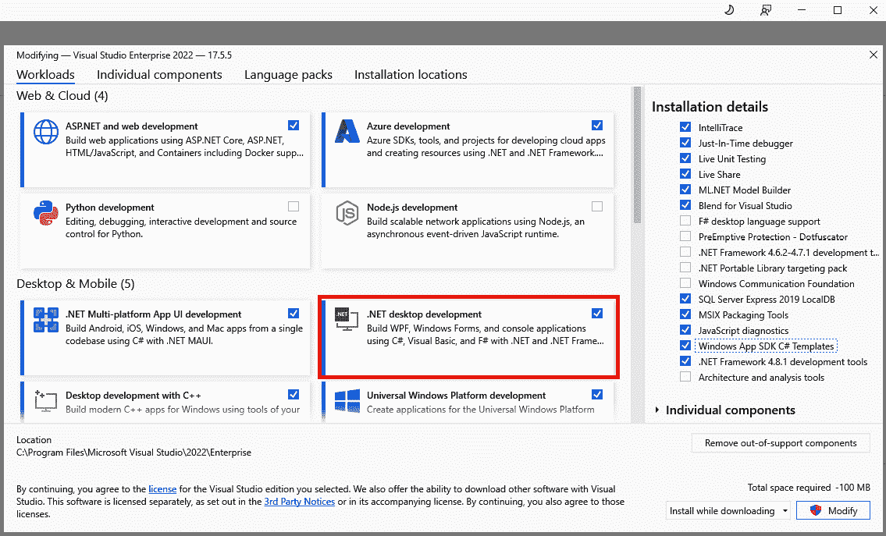

图 2.1 – Visual Studio 安装程序工作负载选择

在选择**.NET 桌面开发**工作负载后，从**安装详情**面板中选择**Windows App SDK C# 模板**组件。这些模板，用于构建 WinUI 应用程序，默认情况下不会与工作负载一起安装。

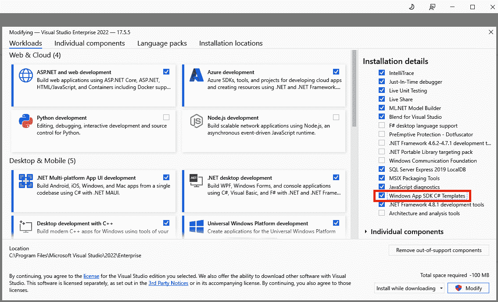

图 2.2 – 选择安装 Windows App SDK C# 模板组件

注意

如果您是 C++开发者并且想使用 C++构建 WinUI 应用程序，您必须选择**使用 C++进行桌面开发**工作负载，并在**使用 C++进行桌面开发**工作负载内选择可选的**Windows App SDK C++ 模板**组件。然而，使用 C++构建 WinUI 应用程序超出了本书的范围。

在继续到下一步时，Visual Studio 安装程序将下载并安装所有选定的工作负载和组件。设置完成后，启动 Visual Studio。第一次运行 Visual Studio 时，您将被提示使用 Microsoft 账户登录。将 Visual Studio 链接到您的账户将使 Visual Studio 能够同步您的设置，链接任何可用的许可证，并在创建后链接您的 Microsoft Store 账户。我们将在*第十四章* *打包和部署* *WinUI 应用程序* 中讨论更多关于 Microsoft Store 和应用程序分发的内容。

现在，是时候开始构建我们的 WinUI 应用程序了。

# 介绍应用程序想法

我们将要构建的应用程序是一个名为**我的媒体收藏**的工具。这是一个简单的实用程序，可以编目您的整个媒体库。由于随着时间的推移，数字媒体变得越来越受欢迎，我们可以设计应用程序以支持包含实体和数字媒体。应用程序将能够编目不同类型的媒体，包括音乐、视频和书籍。我们将添加一些仅对特定媒体类型生效的功能。实体媒体（书籍、DVD 和 CD）通常会被借给朋友。这个应用程序将帮助您记住在最近的家庭聚会上谁借走了您最喜欢的书。

## 检查应用程序功能

在我们深入创建新项目之前，让我们先做好组织工作。了解您将要构建的内容，这样您可以在通过每一章进行时跟踪您的进度。如果您在 GitHub 上跟踪您的开发，您可以为每个功能创建一个**问题**。让我们从对应用程序功能的高级概述开始，如下所示：

+   查看所有媒体

+   根据以下条件过滤媒体库：**媒体类型**（**音乐**、**视频**或**书籍**）、**介质**（根据媒体类型的不同，可用的选项将有所不同，但将包括**CD**、**唱片**、**DVD**、**蓝光**、**精装本**、**平装本**、**数字**）或**位置**（**在收藏中**或**已借出**）

+   添加新的媒体项目

+   编辑媒体项目

+   标记项目为已借出或已归还

+   应用程序登录

+   使用 OneDrive 备份（或还原）集合数据

应用程序将使用**Windows Community Toolkit**的功能，这些功能可以简化诸如 Microsoft 帐户身份验证和 OneDrive 上的文件访问等问题。您可以在 Microsoft Learn 上了解更多关于工具包的信息：[`learn.microsoft.com/dotnet/communitytoolkit/windows/`](https://learn.microsoft.com/dotnet/communitytoolkit/windows/)。应用程序的数据将存储在本地**SQLite**数据库中，允许在线或离线访问媒体集合。您甚至可以发送电子邮件提醒，如果您的朋友在归还您收藏品中的某件物品时花费了太多时间。

## 桌面 WinUI 项目

在本章中，我们将使用**桌面 WinUI**项目模板构建一个 Windows App SDK 应用程序。一个**桌面 WinUI**项目针对 .NET 运行时，同时使用与 UWP 项目相同的 XAML 架构。

**桌面 WinUI**项目还包括一个在新建解决方案中的**Windows 应用程序打包**项目。我们将在*第十四章*“打包和部署 WinUI 应用程序”中了解更多关于打包 WinUI 应用程序的内容。现在，让我们开始我们的第一个项目。

# 创建您的第一个 WinUI 项目

是时候开始构建项目了。为此，请按照以下步骤操作：

1.  启动 Visual Studio，然后从打开屏幕中选择**创建新项目**，如图所示：

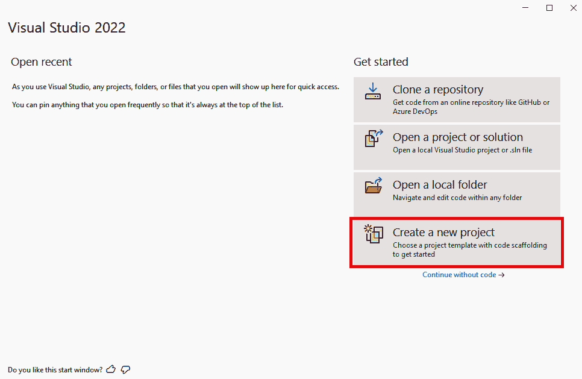

图 2.3 – 初始 Visual Studio 对话框

1.  在**搜索模板**字段中的`winui`，选择**空白应用，打包（桌面 WinUI 3）**C#模板，然后点击**下一步**，如图所示：

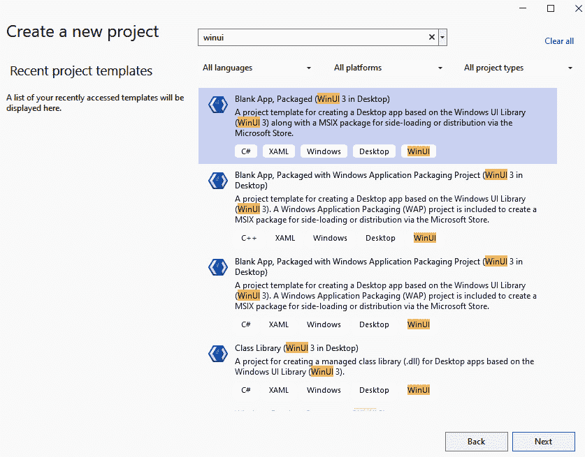

图 2.4 – 选择项目模板

提示

请确保选择**C#**项目模板，而不是**C++**。您可以通过将**语言**过滤器从**所有语言**更改为**C#**来过滤项目类型，以仅显示 C# 项目。

1.  将项目命名为`MyMediaCollection`，其余字段保留默认值，然后点击**创建**。您可能需要选择要针对您的应用程序的 Windows 版本。对于此项目，您可以保留这些设置为默认值。

注意

是否要更改这些版本以适应您的应用程序由您决定，但您将限制可以安装您应用程序的 Windows 版本。如果您使用的是仅在特定 Windows 版本中可用的控件或功能，您必须选择该版本作为**最低版本**。**目标版本**必须等于或高于**最低版本**。如果您不确定选择什么，您应该坚持使用默认值。

1.  现在，项目已创建且 Visual Studio 已加载，始终是一个最佳实践来构建和运行项目。运行应用程序并查看模板为 `MainWindow` 提供了什么。您应该看到一个空窗口托管了一些控件。接下来，我们将看到 Visual Studio 为我们创建的以帮助我们开始的内容。

注意

要在 Windows 上运行和调试 WinUI 应用程序，您必须更新您的 Windows 设置以启用**开发者模式**。为此，请按照以下步骤操作：

1. 从**开始**菜单打开**设置**。

2. 在搜索栏中输入 `Developer` 并从搜索结果中选择**开发者**设置。

3. 在出现的**开发者**页面，如果尚未开启，切换**开发者模式**开关。启用此功能允许开发者侧载、运行和调试未签名的应用程序，并启用一些其他面向开发者的 Windows 设置。您可以在以下链接中获取更多信息：[`learn.microsoft.com/windows/apps/get-started/enable-your-device-for-development`](https://learn.microsoft.com/windows/apps/get-started/enable-your-device-for-development)。

# 桌面项目中 WinUI 的结构

现在，我们已经将一个新的空 WinUI 项目加载到 Visual Studio 中，让我们检查不同的组件。在 `App.xaml` 和 `MainWindow.xaml` 中。我们将首先讨论每个文件的用途。这两个文件可以在以下 **Solution Explorer** 的屏幕截图中看到：

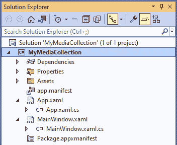

图 2.5 – Solution Explorer 中的新 WinUI 解决方案

## 检查 App.xaml

如其名称所示，`App.xaml` 文件存储了整个应用程序可用的资源。如果您有任何需要在多个窗口中使用的模板或样式，它们应该添加到 `Application` 级别。

新项目的 `App.xaml` 文件将包含一些初始标记，如下面的代码片段所示：

```cs
<Application
    x:Class="MyMediaCollection.App"
    xmlns="http://schemas.microsoft.com/winfx/2006/xaml/
  presentation"
    xmlns:x="http://schemas.microsoft.com/winfx/2006/xaml"
    xmlns:local="using:MyMediaCollection">
    <Application.Resources>
        <ResourceDictionary>
            <ResourceDictionary.MergedDictionaries>
                <XamlControlsResources
                  xmlns="using:Microsoft.UI
                    .Xaml.Controls" />
                <!-- Other merged dictionaries here -->
            </ResourceDictionary.MergedDictionaries>
            <!-- Other app resources here -->
        </ResourceDictionary>
    </Application.Resources>
</Application>
```

在下一节中，我们将介绍一些 XAML 基础知识。目前，你应该知道 `Application.Resources` 部分将包含跨应用程序共享的所有资源。在这个部分中，`ResourceDictionary.MergedDictionaries` 部分包含了对其他 XAML 文件的引用，这些文件中的资源将与整个应用程序共享。这允许开发者将共享内容组织到多个资源文件中，从而使得 XAML 更有组织性和易于维护。这也使得应用程序可以共享第三方资源。例如，此文件合并了来自 `Microsoft.UI.Xaml.Controls` 命名空间的 `XamlControlsResources`。这些是我们将用于构建应用程序的 WinUI 控件的资源。

## 检查 App.xaml.cs 文件

在 `App.xaml` 文件的节点中，你会看到还有一个名为 `App.xaml.cs` 的文件嵌套在其中。这被称为 `Application` 类。如果你打开 C# 文件，你会看到它已经包含了一些代码。这就是你处理任何应用程序级事件的地方。这是默认添加的事件处理程序：`OnLaunched`。如果你需要在应用程序首次启动时执行任何特定逻辑，它应该在这里添加。这也是处理传递给应用程序的任何应用程序参数的地方。

## 审查 MainWindow.xaml

`MainWindow.xaml` 文件包含将在应用程序启动时显示的 `MainWindow` WinUI 窗口。你可以在 `App.xaml.cs` 中的 `OnLaunched` 事件处理程序中看到这一点，如下面的代码片段所示：

```cs
m_window = new MainWindow();
m_window.Activate();
```

在一个新的空白 WinUI 应用程序中，`Window` 将包含一个空的 `StackPanel` 布局控件。尝试用具有 `Text` 属性为 `Media` 的 `TextBlock` 替换 `StackPanel` 的子控件，并用 `Grid` 替换 `StackPanel`。结果应该看起来像这样：

```cs
<Window
    x:Class="MyMediaCollection.MainWindow"
    xmlns="http://schemas.microsoft.com/winfx/2006/xaml/
      presentation"
    xmlns:x="http://schemas.microsoft.com/winfx/2006/xaml"
    xmlns:local="using:MyMediaCollection"
    xmlns:d="http://schemas.microsoft.com/expression/blend/
      2008"
    xmlns:mc="http://schemas.openxmlformats.org/
      markup-compatibility/2006"
    mc:Ignorable="d">
    <Grid>
        <TextBlock Text="Media"/>
    </Grid>
</Page>
```

为了防止运行时出现异常，请从 `MainWindow.xaml.cs` 中移除 `Button.Click` 事件处理程序。现在使用 **调试** | **开始调试** 菜单项或 Visual Studio 工具栏上的 **开始调试** 按钮运行应用程序，你应该会看到如下内容：

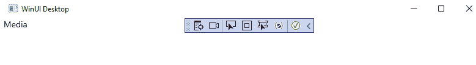

图 2.6 – 添加了 TextBlock 的 MainWindow

在本章的后面部分，我们将使这个窗口功能更强大。现在，让我们完成对项目结构的审查。

## 审查 MainWindow.xaml.cs

`MainWindow.xaml.cs` 窗口的代码后文件现在在构造函数中只包含对 `InitializeComponent()` 的调用，因为我们移除了原始 `Button` 控件的事件处理程序。稍后，我们将在这里添加一些代码来填充一些示例数据并处理页面上的事件。在一个设计良好的 MVVM 应用程序中，你的页面代码后文件将包含非常少的代码。大部分代码将位于 `ViewModel` 类中。

## 审查项目引用

在 **解决方案资源管理器** 的 **依赖项** 下的 **Packages** 文件夹中，你项目的所有引用。你的 WinUI 项目将引用以下 NuGet 包：

+   `Microsoft.WindowsAppSDK`：包括 WinUI 的 Windows App SDK 组件

+   `Microsoft.Windows.SDK.BuildTools`：构建 WinUI 解决方案所需的 Windows SDK 组件

注意

不要修改或删除这些引用。

## 查看项目属性

如果你右键单击 **解决方案资源管理器** 中的项目并从上下文菜单中选择 **属性**，你可以查看和修改项目属性。你不会经常需要在此处进行任何更改。以下是一些你可能需要不时修改的属性：

+   **程序集名称**：你可以更改由项目编译的输出程序集的名称

+   **最小版本** 和 **目标版本**：创建项目时选择的 Windows 版本可以在此修改

新的 UWP 项目和新的 WinUI 3 项目的区别主要在于在 `Windows.UI.Xaml.*` 命名空间中引用的控件和其他对象现在引用了 Windows App SDK 的 `Microsoft.UI.Xaml.*` 命名空间中的控件。另一个区别是，在 UWP 项目的 `App.xaml` 文件中，不需要导入控件的资源。其余的区别主要在项目文件中对应用程序开发者隐藏。

现在你已经熟悉了 WinUI 项目，让我们开始构建 `MainWindow` 的 UI。我们将从一些常见的 XAML 控件和概念开始。

# XAML 基础

是时候开始构建 **My Media Collection** 应用程序的主屏幕了。应用程序的焦点将是集合中的媒体项目。为了显示这个列表，我们需要一些东西，如下所示：

+   一个定义集合中项目的 `Model` 类

+   一些代码用于将项目集合绑定到 UI

+   一个用于显示项目的 XAML 控件

## 构建模型

我们将首先为 **My Media Collection** 应用程序构建模型。一个 **模型** 定义了一个实体及其属性。在本章的早期部分，我们讨论了一些我们希望在 UI 中显示的项目属性。为了显示（最终）持久化这些信息，我们必须创建模型。

我们模型的初始版本将包括一个 `Enums` 文件夹中的两个枚举（`ItemType` 和 `LocationType`），以及一个 `Model` 文件夹中的两个类（`Medium` 和 `MediaItem`），如下面的截图所示：

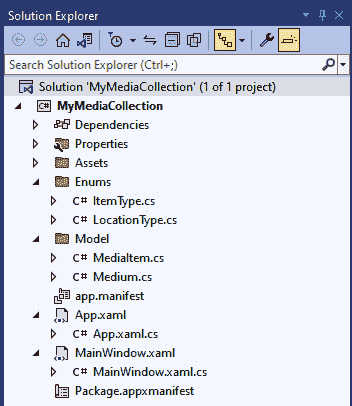

图 2.7 – 解决方案资源管理器显示新的模型和枚举文件

1.  要向项目中添加新文件夹，右键单击 `Enums` 作为文件夹名称，然后按 *Enter*。重复此过程以添加 `Model` 文件夹。

1.  接下来，右键单击项目文件并选择 `ItemType`，然后点击下面的 **添加** 按钮，如下面的截图所示：

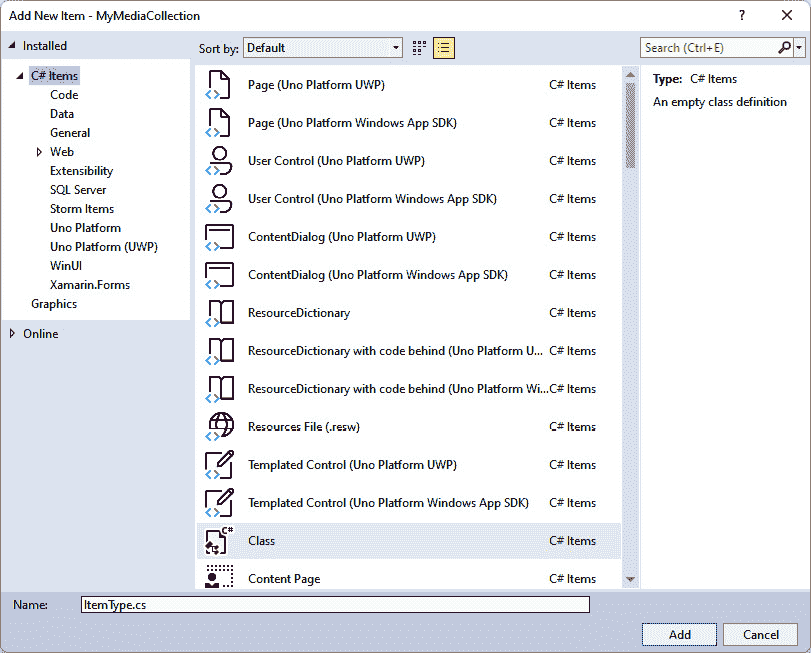

图 2.8 – 添加新项对话框

1.  `ItemType`的代码已创建并显示。将`class`定义更改为`enum`，并将`internal`关键字更改为`public`。`ItemType`枚举包含三个可能值，分别命名为`Music`、`Video`和`Book`。当您完成时，`ItemType`枚举的定义将如下所示：

    ```cs
    public enum ItemType
    {
        Music,
        Video,
        Book
    }
    ```

1.  重复步骤创建一个`LocationType`枚举，定义如下：

    ```cs
    public enum LocationType
    {
        InCollection,
        Loaned
    }
    ```

1.  使用您所学到的知识，在`Model`文件夹中创建两个名为`Medium`和`MediaItem`的类。`Medium`类表示特定的媒体，如*精装本*或*平装本*，而`MediaType`属性将`ItemType`分配给`Medium`类所属的类型。对于这些，有效的`ItemType`将是`Book`。当您完成时，这两个新类将如下所示：

    ```cs
    public class Medium
    {
        public int Id { get; set; }
        public string Name { get; set; }
        public ItemType MediaType { get; set; }
    }
    public class MediaItem
    {
        public int Id { get; set; }
        public string Name { get; set; }
        public ItemType MediaType { get; set; }
        public Medium MediumInfo { get; set; }
        public LocationType Location { get; set; }
    }
    ```

注意

要从两个类中引用`Enums`文件夹中的枚举类型，需要在每个新类的顶部添加一个`using`声明，如下所示：`using MyMediaCollection.Enums;`。

除了本章前面讨论的属性外，`MediaItem`类中已添加一个`Id`属性，用于唯一标识集合中的每个项。这将在我们开始持久化数据时非常有用。

## 创建示例数据

在模型类就绪后，我们准备添加一些代码来创建三个用于在 UI 中显示的媒体项。这将帮助我们在我们开始创建主屏幕上的项目列表时可视化事物。当这一步完成，我们准备继续启用通过应用程序添加项的功能时，此代码将被移除。

现在，我们将在此`MainWindow.xaml.cs`代码隐藏文件中添加此代码。稍后，在*第三章* *可维护性和可测试性的 MVVM* 中，此类代码将添加到`ViewModel`文件中。`MainWindow`将只包含表示逻辑，不会负责创建或获取填充 UI 的数据：

1.  首先，打开`MainWindow.xaml.cs`并创建一个名为`PopulateData`的方法。此方法将包含创建三个`MediaItem`对象（一张 CD、一本书和一张蓝光光盘）并将它们添加到名为`_items`的私有`List`中的代码，如下面的代码片段所示：

    ```cs
    public void PopulateData()
    {
        if (_isLoaded) return;
        _isLoaded = true;
        var cd = new MediaItem
        {
            Id = 1,
            Name = "Classical Favorites",
            MediaType = ItemType.Music,
            MediumInfo = new Medium { Id = 1,
              MediaType = ItemType.Music, Name = "CD" }
        };
        Var book = new MediaItem
        {
            Id = 2,
            Name = "Classic Fairy Tales",
            MediaType = ItemType.Book,
            MediumInfo = new Medium { Id = 2,
              MediaType = ItemType.Book, Name = "Book" }
        };
        var bluRay = new MediaItem
        {
            Id = 3,
            Name = "The Mummy",
            MediaType = ItemType.Video,
            MediumInfo = new Medium { Id = 3,
              MediaType = ItemType.Video, Name = "Blu Ray" }
        };
        _items = new List<MediaItem>
        {
            cd,
            book,
            bluRay
        };
    }
    ```

    您需要将`using`语句添加到`MainWindow`的`MyMediaCollection.Model`和`MyMediaCollection.Enums`命名空间中。

1.  将`_items`定义为`IList`和`isLoaded`定义为`bool`作为私有类成员。我们稍后将更改项目集合为`ObservableCollection`。`ObservableCollection`是一个特殊的集合，当集合中的项目被添加或删除时，它会通知 UI 中的数据绑定项。现在，`IList`将满足我们的需求。代码可以在以下代码片段中看到：

    ```cs
    private IList<MediaItem> _items { get; set; }
    private bool _isLoaded;
    ```

1.  接下来，在 `MainWindow` 构造函数中，在调用 `InitializeComponent` 之后添加一行代码，以调用新的 `PopulateData` 方法。添加到 `Window` 或 `UserControl` 构造函数中的任何代码都必须在此初始化代码之后添加。这是 `MainWindow.xaml` 中所有 XAML 代码初始化的地方。如果在调用 `InitializeComponent` 之前尝试引用这些元素，将导致错误。构造函数现在应如下所示：

    ```cs
    public MainWindow()
    {
        this.InitializeComponent();
        PopulateData();
    }
    ```

在 XAML 文件中创建一些 UI 组件之后，我们将返回此文件以添加一些数据绑定逻辑。让我们现在就去完成这个任务。

## 构建初始用户界面

在本章的早期部分，我们在 `MainWindow.xaml` 文件中添加了一个 `TextBlock`，其 `Text` 属性设置为 `Media`。我们将在现有的 `TextBlock` 下方添加一个 `ListView` 控件。`ListView` 控件是一个强大且灵活的控件，用于在垂直列表中显示项目列表。它类似于基本列表功能（项目选择、多选和自动滚动条）中的 `ListBox` 控件，但每个列表项都可以进行模板化，以几乎任何可想象的方式显示。

注意

关于 `ListView` 类的更多信息，包括示例代码和标记的文档，可在 Microsoft Learn 上找到：[`learn.microsoft.com/windows/windows-app-sdk/api/winrt/microsoft.ui.xaml.controls.listview`](https://learn.microsoft.com/windows/windows-app-sdk/api/winrt/microsoft.ui.xaml.controls.listview)。

1.  首先，在顶级 `Grid` 控件内添加一些标记以创建两行。应在现有的 `TextBlock` 元素之前添加 `RowDefinitions`。`TextBlock` 将保留在第一行，我们将在第二行添加 `ListView` 控件。按照以下代码片段创建 `RowDefinitions`：

    ```cs
    <Grid.RowDefinitions>
        <RowDefinition Height="Auto"/>
        <RowDefinition Height="*"/>
    </Grid.RowDefinitions>
    ```

    如您所见，我们自动将第一 `RowDefinition` 的大小设置为 `TextBlock` 的大小，并通过使用 `"*"` 将 `Grid` 内剩余的空间分配给 `ListView` 控件的 `RowDefinition`。如果您为多个行分配 `"*"`，则这些行将平均分配剩余的可用空间。这是 `Height` 属性的默认值。如果省略 `"*"`，大小将相同，但大多数 XAML 开发者明确包含它以实现完整性和提高可读性。

注意

关于行大小的更多信息，请参阅以下 Microsoft Learn 文档：[`learn.microsoft.com/windows/windows-app-sdk/api/winrt/microsoft.ui.xaml.controls.rowdefinition.height`](https://learn.microsoft.com/windows/windows-app-sdk/api/winrt/microsoft.ui.xaml.controls.rowdefinition.height)。

1.  接下来，将 `ListView` 控件添加到 `Grid` 中，设置 `Grid.Row` 等于 `1`（行编号从 0 开始，即第一行是行 `0`），并将其命名为 `ItemList`。命名您的 XAML 元素不是必需的。这仅在您想要通过 `ElementName` 在 XAML 数据绑定中引用它们或作为代码背后的文件中的变量时才是必需的。命名一个控件会在 `InitializeComponent` 调用中创建一个变量，为了优化性能，您应该只在需要在其他地方引用控件时命名控件。以下代码片段显示了标记：

    ```cs
    <ListView Grid.Row="1" x:Name="ItemList"
      Background="LightGoldenrodYellow"/>
    ```

通过将背景颜色设置为 `LightGoldenrodYellow`，在填充任何数据之前，我们可以看到应用程序主窗口中的 `ListView`。根据您是否使用 *Light* 或 *Dark* Windows 主题，您可以选择最适合您的颜色。运行应用程序，它应该看起来像这样：

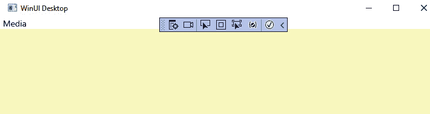

图 2.9 – 已添加到 UI 的 ListView

让我们回到代码背后文件，开始设置数据绑定。

注意

如果您对 XAML 编程中的数据绑定概念不熟悉，Microsoft Learn 在以下网页上为 Windows App SDK 开发者提供了一个关于数据绑定的优秀概述：[`learn.microsoft.com/windows/apps/develop/data-binding/`](https://learn.microsoft.com/windows/apps/develop/data-binding/)。

## 完成数据绑定初始化

返回到 `MainWindow.xaml.cs` 文件，在调用 `PopulateData()` 方法之前添加一行代码，如下所示：

```cs
ItemList.Loaded += ItemList_Loaded;
```

在键入 `+=` 后，Visual Studio `ItemList_Loaded` 事件处理器，如下面的截图所示：

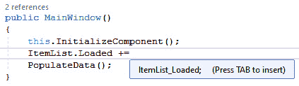

图 2.10 – 插入 ItemList_Loaded 事件处理器

或者，如果您输入整行并按 *Ctrl* +，系统会提示您创建新方法。

为了使 `MainWindow` 构造函数简单，并将我们的数据加载代码放在一起，将 `PopulateData` 调用移动到 `ItemList_Loaded` 方法。然后，将其他两行代码添加到新的事件处理器中，如下所示：

```cs
private void ItemList_Loaded(object sender,
  Microsoft.UI.Xaml.RoutedEventArgs e)
{
    var listView = (ListView)sender;
    PopulateData();
    listView.ItemsSource = _items;
}
```

此代码在 `ItemsList` 控件在 UI 中完成加载后调用。我们从 `sender` 参数获取控件的实例，并将列表的 `ItemsSource` 设置为在 `PopulateData()` 中加载的 `_items` 集合。现在，列表中有数据，但看起来并不完全正确，如下面的截图所示：

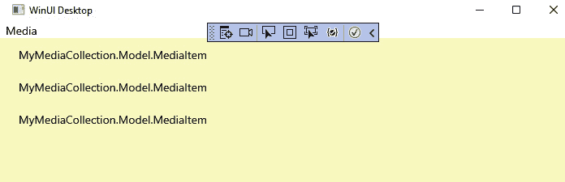

图 2.11 – 包含三行数据的 ListView

`ListView` 正在显示三个行，对应于我们的三个示例数据项，但它显示的是每个项的数据类型而不是数据。这是因为我们没有告诉 `ListView` 它应该显示集合中每个项的哪些属性。默认情况下，列表将显示对象 `ToString()` 方法返回的内容。如果 `ToString()` 没有重写，则返回类的数据类型名称。

## 创建 DataTemplate 并绑定 UI

让我们回到 `MainWindow.xaml` 并告诉 `ListView` 我们想要为列表中的每个项目显示哪些数据。尝试在应用程序仍在运行时进行此更改。多亏了 Visual Studio 的 **XAML 热重载** 功能，你应该会看到 UI 重新加载，而无需重新启动调试会话。

通过在 `ListView.ItemTemplate` 内定义 `DataTemplate` 来自定义每个 `ListView` 项的外观。`DataTemplate` 可以包含我们需要的任何 WinUI 控件来定义每个列表项的布局。让我们保持简单，并添加一个包含两列的 `Grid`。每一列将包含一个 `TextBlock`。现在 `ListView` 应该看起来像这样：

```cs
<ListView Grid.Row="1"
          x:Name="ItemList"
          Background="LightGoldenrodYellow">
    <ListView.ItemTemplate>
        <DataTemplate x:DataType="model:MediaItem">
            <Grid>
                <Grid.ColumnDefinitions>
                    <ColumnDefinition Width="100"/>
                    <ColumnDefinition Width="*"/>
                </Grid.ColumnDefinitions>
                <TextBlock Text="{x:Bind
                  Path=MediumInfo.Name}"/>
                <TextBlock Grid.Column="1"
                   Text="{x:Bind Path=Name}"/>
            </Grid>
        </DataTemplate>
    </ListView.ItemTemplate>
</ListView>
```

我们开始创建一些更复杂的 XAML，并需要考虑格式化以优化其可读性。

注意

要快速重新格式化 XAML，可以使用 *Ctrl* + *K | D* 快捷键。还有一个名为 **XAML Styler** 的扩展程序在 **Visual Studio Marketplace** 上。您可以在 Visual Studio 的 **管理扩展** 对话框中搜索它，或在此处获取更多信息：[`marketplace.visualstudio.com/items?itemName=TeamXavalon.XAMLStyler2022`](https://marketplace.visualstudio.com/items?itemName=TeamXavalon.XAMLStyler2022)。

为了使每个 `TextBlock` 能够绑定到 `MediaItem` 的属性，我们必须在 `DataTemplate` 上设置一个 `x:DataType` 属性。为了解析 `MediaItem`，需要在 `Window` 定义中添加一个命名空间声明，如下所示：

```cs
xmlns:model="using:MyMediaCollection.Model"
```

添加此 `using` 语句的快捷方式是将光标放在 `x:DataType` 上并按 *Ctrl* +. Visual Studio 将建议向文件中添加缺失的命名空间。现在我们可以通过使用 `model` 前缀来访问 `MyMediaCollection.Model` 命名空间中的对象，并且 `x:DataType="model:MediaItem"` 在构建和运行应用程序时将解析 `MediaItem`。

每个 `TextBlock` 的 `Text` 属性都绑定到 `MediaItem` 的一个属性，使用的是 `x:Bind` **标记扩展**。

注意

使用`x:Bind`而不是`Binding`标记扩展来将数据绑定到 UI 的好处是编译时验证和性能提升。之前在 Microsoft Learn 上提到的数据绑定概述深入探讨了这些差异。我更喜欢尽可能使用`x:Bind`。你应该注意`Binding`和`x:Bind`之间的重要区别是，虽然`Binding`默认为`OneWay`模式，但`x:Bind`默认为`OneTime`。这种对默认绑定行为的更改是为了性能考虑。`OneWay`绑定需要在幕后编写更多代码来设置更改检测，以监控源值的更改。你仍然可以显式地将你的`x:Bind`使用更新为`OneWay`或`TwoWay`。有关`x:Bind`的更多信息，请参阅这篇 Microsoft Learn 文章：[`learn.microsoft.com/windows/uwp/xaml-platform/x-bind-markup-extension`](https://learn.microsoft.com/windows/uwp/xaml-platform/x-bind-markup-extension)。

有关 XAML 中标记扩展的更多信息，你可以阅读这篇.NET 文章：[`learn.microsoft.com/dotnet/desktop/xaml-services/markup-extensions-overview`](https://learn.microsoft.com/dotnet/desktop/xaml-services/markup-extensions-overview)。

现在，当你运行应用程序时，你可以在`ListView`中看到每个项目的`MediumType`名称和项目名称，如下面的截图所示：

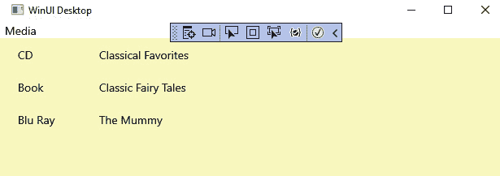

图 2.12 – 带有两列示例数据的 ListView

这已经取得了相当不错的进展！在我们扩展功能之前，让我们简要谈谈 WinUI、Windows App SDK 和.NET 在应用开发过程中的结合方式。

# 理解 WinUI 和 Windows App SDK

让我们回顾一下我们项目中可用的 WinUI 控件，看看它们如何帮助我们构建在**解决方案资源管理器**中看到的`Microsoft.WindowsAppSDK`包。

要查看此包的内容，请从 Visual Studio 的**视图**菜单中打开**对象浏览器**窗口。控件将在此处列出，位于**Microsoft.WinUI**树节点下的几个命名空间中，如下面的截图所示：

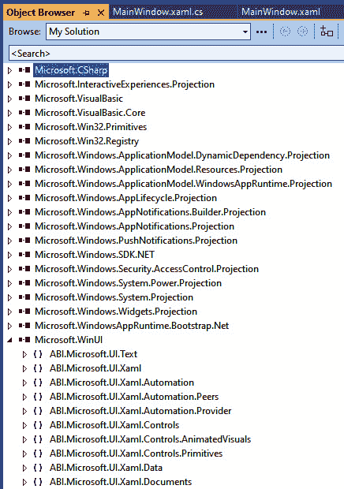

图 2.13 – 对象浏览器中的 WinUI 控件

我们将要使用的 WinUI 控件的大部分都可以在**Microsoft.WinUI**下的**Microsoft.UI.Xaml.Controls**命名空间中找到，以及其他相关类和接口。

到目前为止，我们在应用程序中使用了`Grid`、`TextBlock`和`ListView`控件。打开`ListView`类，展开`ListViewBase`类。这个基类包含了`ListView`可用的方法、属性和事件。`ListViewBase`的成员将在右侧窗格中显示。花些时间审查这些成员，看看你是否能从迄今为止对控件的使用中认出它们。

清除您的搜索 `ListView`，在 `TextBlock` 控件的左侧面板中向下滚动。选择它，在右侧面板中找到并选择 **Text** 属性。右下角的面板显示了属性的详细信息，如图下截图所示：

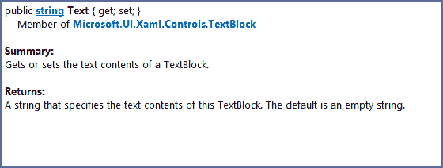

图 2.14 – 对象浏览器中 TextBlock.Text 属性的详细信息

**对象浏览器**窗口在熟悉新库或项目时可以成为一个宝贵的资源。所有引用的项目、NuGet 包和其他引用都将在此处显示。

您在此处审查的控件和其他组件构成了 Windows App SDK 应用程序的 UI 层。Windows App SDK 的底层应用程序框架是 .NET。

## 理解 .NET 应用程序模型

您可能听说过 WinUI 应用的底层应用程序模型可以是 C++ 应用的 Win32 或桌面应用的 .NET。那么，.NET **应用程序模型**究竟是什么呢？

WinUI 应用程序中的 .NET 应用程序模型描述了应用程序的打包和部署方式。它还定义了以下行为和能力：

+   数据存储

+   状态管理

+   生命周期事件（**启动**和**关闭**）

+   多任务处理

+   资源管理

+   应用间通信

WinUI 3 是 Windows App SDK 的一个组件，是 UI 层。尽管 WinUI 控件与 Windows SDK 解耦，但在使用 Windows App SDK 时，底层 .NET 应用程序平台仍然依赖于它。选择目标操作系统和最低版本是这种依赖关系的一个副作用。

现在您已经更好地理解了 WinUI 控件以及它们与 Windows App SDK 和 .NET 应用程序平台的关系，让我们在我们的应用程序中使用更多的一些控件。

# 与 WinUI 控件、属性和事件一起工作

是时候增强应用程序的 UI 了。目前，主页只包含一个位于 `ListView` 上的 `Media` 标签，有媒体类型和媒体项目名称的列。以下是我们将在本节中添加的增强功能：

+   `ListView` 的标题行

+   一个 `ComboBox` 用于根据媒体类型过滤行

+   一个用于向集合添加新项目的 `Button`

我们将首先增强我们的媒体集合的 `ListView`。

## 添加 ListView 标题

在我们创建标题之前，让我们改变 `ListView` 的背景颜色。`Aqua` 颜色很好地突出了控件，但当应用程序被我们的客户使用时可能会分散注意力。我们将讨论 WinUI 主题画笔，并查看 `MainWindow.xaml` 文件中 `ListView` 定义中的 `Background="Aqua"`。

创建媒体集合的标题行相对简单。为了定义每个项目的行，我们创建了一个包含 `DataTemplate` 的 `ListView.ItemTemplate` 块。为了创建标题，我们在 `ListView.HeaderTemplate` 块内做同样的事情。

正如与项目行一样，表头行将包含一个具有两个列的 `Grid`，具有相同的 `Width` 定义。我们再次想在 `Grid` 中使用两个 `TextBlock` 控件，但为了在表头和项目之间添加一些间隔，我们将添加 `Border` 控件。让我们看一下表头的标记，然后更详细地讨论差异。花点时间审查以下标记：

```cs
<ListView.HeaderTemplate>
    <DataTemplate>
        <Grid>
            <Grid.ColumnDefinitions>
                <ColumnDefinition Width="100"/>
                <ColumnDefinition Width="*"/>
            </Grid.ColumnDefinitions>
            <Border BorderBrush="BlueViolet"
                    BorderThickness="0,0,0,1">
                <TextBlock Text="Medium"
                           Margin="5,0,0,0"
                           FontWeight="Bold"/>
            </Border>
            <Border Grid.Column="1"
                    BorderBrush="BlueViolet"
                    BorderThickness="0,0,0,1">
                <TextBlock Text="Title"
                           Margin="5,0,0,0"
                           FontWeight="Bold"/>
            </Border>
        </Grid>
    </DataTemplate>
</ListView.HeaderTemplate>
```

如您所见，每个 `TextBlock` 都嵌套在一个 `Border` 元素中。这将用 `BlueViolet` 颜色的边框包裹文本。然而，通过设置 `BorderThickness="0,0,0,1"`，边框颜色将只出现在表头行项的底部。这是它在应用程序中的样子：

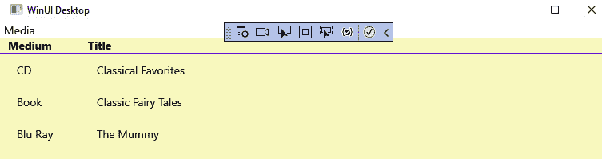

图 2.15 – 添加了表头行的 ListView

注意

通过将整个 `Grid` 嵌套在一个 `Border` 中而不是围绕每个表头项放置一个 `Border`，可以实现相同的底部边框。然而，通过这种方式操作，我们对每个列的边框样式的外观有更多的控制。当我们稍后实现排序时，可以修改边框的颜色以突出显示已应用排序的列。

你可能也注意到了，表头行的文本与网格中的行不同。`HeaderTemplate` 中每个 `TextBlock` 内设置的 `FontWeight="Bold"` 属性有助于突出显示表头行。

## 创建 ComboBox 过滤器

应用程序的一个要求是允许用户过滤集合项的多个属性。让我们从简单开始，只添加对媒体（**Book**、**Music** 或 **Movie**）的过滤。列表还需要一个 **All** 选项，当用户打开应用程序时，它将是默认选择：

1.  首先，向 `MainWindow` 添加一些 XAML 代码，以便在 `Media` 标签的右侧添加一个过滤器。将 `Media` `TextBlock` 替换为以下标记：

    ```cs
    <Grid>
        <Grid.ColumnDefinitions>
            <ColumnDefinition Width="*"/>
            <ColumnDefinition Width="Auto"/>
        </Grid.ColumnDefinitions>
        <TextBlock Text="Media Collection"
                   Margin="4"
                   FontWeight="Bold"
                   VerticalAlignment="Center"/>
        <StackPanel Grid.Column="1"
                    Orientation="Horizontal"
                    HorizontalAlignment="Right">
            <TextBlock Text="Media Type:" Margin="4"
                       FontWeight="Bold"
                       VerticalAlignment="Center"/>
            <ComboBox x:Name="ItemFilter"
                      MinWidth="120" Margin="0,2,6,4"/>
        </StackPanel>
    </Grid>
    ```

    单一的 `TextBlock` 标签已被替换为两列的 `Grid`。第一列包含 `TextBlock`，进行了一些修改。首先，`Text` 属性已更新为 `"Media Collection"`。`FontWeight` 已更改为 `"Bold"`，并添加了一些边距。最后，该元素垂直居中。

    第二列包含一个新的 `StackPanel`（一个水平或垂直堆叠其内容的容器控件）。默认方向是 `Vertical`。在我们的情况下，我们想要一个水平堆叠，这就是为什么将 `Orientation` 属性设置为 `Horizontal` 的原因。

`StackPanel` 包含一个 `TextBlock` 标签和一个用于过滤选择的 `ComboBox`。`ComboBox` 过滤器已被赋予一个 `x:Name`，这样我们就可以从 C# 后台代码文件中引用它以初始化其内容。我们还配置了一个 `MinWidth` 值为 `120`。如果 `ComboBox` 过滤器的内容需要超过 120 **像素**（**px**），它可以变得更大，但它的宽度不能小于此处设置的值。

注意

在 XAML 中引用的像素是有效像素。要了解更多关于使用 XAML 的响应式布局和尺寸信息，请参阅这篇 Microsoft Learn 文章：[`learn.microsoft.com/windows/apps/design/layout/layouts-with-xaml`](https://learn.microsoft.com/windows/apps/design/layout/layouts-with-xaml)。

1.  在 `MainWindow.xaml.cs` 文件中，添加一个新的变量来保存媒体列表，如下所示：

    ```cs
    private IList<string> _mediums { get; set; }
    ```

    这个集合可以是一个 `IList` 而不是 `ObservableCollection`，因为我们不期望在应用程序运行期间其内容发生变化。

1.  在 `PopulateData()` 方法内部，在方法末尾添加一些代码来填充 `_mediums` 列表，如下所示：

    ```cs
    _mediums = new List<string>
    {
        "All",
        nameof(ItemType.Book),
        nameof(ItemType.Music),
        nameof(ItemType.Video)
    };
    ```

    我们为 `ItemType` 枚举中的每个可能值以及默认的 `"All"` 值添加一个项到集合中。

1.  `ComboBox` 过滤器将在加载后绑定到集合，因此请在 `MainWindow` 构造函数中添加一个 `Loaded` 事件处理器，就像我们之前为 `ItemList` 所做的那样，如下所示：

    ```cs
    ItemFilter.Loaded += ItemFilter_Loaded;
    ```

1.  `ItemFilter_Loaded` 事件处理器将与 `ItemList_Loaded` 处理器非常相似。使用以下代码：

    ```cs
    private void ItemFilter_Loaded(object sender,
      Microsoft.UI.Xaml.RoutedEventArgs e)
    {
        var filterCombo = (ComboBox)sender;
        PopulateData();
        filterCombo.ItemsSource = _mediums;
        filterCombo.SelectedIndex = 0;
    }
    ```

代码将发送者转换为 `ComboBox` 数据类型，并将其 `ItemSource` 设置为我们上一步填充的列表。最后，还需要一个额外的步骤来将 `ComboBox` 过滤器默认设置为 `"All"` 项。这是通过将 `SelectedIndex` 设置为 `0` 来实现的。

让我们运行应用程序并看看现在看起来如何。您可以在以下屏幕截图中看到结果：

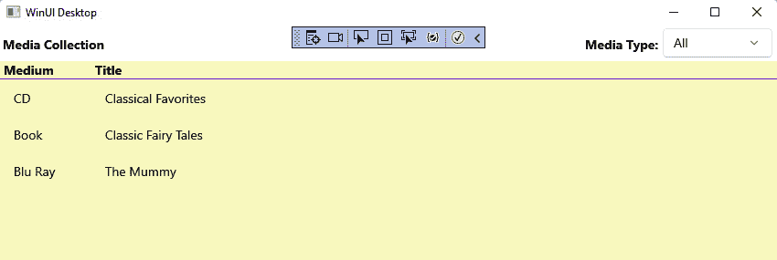

图 2.16 – 添加了媒体类型过滤器的媒体集合

非常锐利！如果您点击 **媒体类型** 过滤器，您可以看到可用的四个选择值，如图所示：

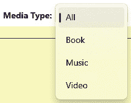

图 2.17 – 媒体类型值

注意到 `ComboBox` 的下拉菜单已经采用了带有一定透明度的 Windows 风格，而无需添加任何额外的代码或标记。选择列表中的其他值并查看会发生什么。什么都没有！这是因为我们没有在过滤器选择变化时添加任何代码来进行过滤。我们可以添加一些额外的代码来修复这个问题，如下所示：

1.  首先，创建一个新的 `_allItems` 集合来存储所有可用的媒体项列表，无论当前过滤器如何，如下所示：

    ```cs
    private IList<MediaItem> _allItems { get; set; }
    ```

1.  接下来，在 `PopulateData()` 方法中，在填充 `_items` 集合之后，添加相同的项到 `_allItems`，如下所示：

    ```cs
    _allItems = new List<MediaItem>
    {
        cd,
        book,
        bluRay
    };
    ```

1.  现在，当过滤器选择变化时，我们需要进行一些过滤。我们想要处理 `ComboBox` 控件上的 `SelectionChanged` 事件，但我们不希望在页面完全加载之前将其连接起来。这将防止在 `ComboBox` 过滤器最初被填充时处理该事件。

1.  在 `ItemFilter_Loaded` 的实现结束时，为 `ComboBox` 控件上的 `SelectionChanged` 事件添加一个事件处理器：

    ```cs
    ItemFilter.SelectionChanged +=
        ItemFilter_SelectionChanged;
    ```

1.  在新的 `ItemFilter_SelectionChanged` 事件处理器中，我们将遍历 `_allItems` 列表，并根据它们的 `MediaType` 属性确定要包含在过滤列表中的项目，如下所示：

    ```cs
    private void ItemFilter_SelectionChanged(
      object sender,Microsoft.UI.Xaml.Controls.
        SelectionChangedEventArgs e)
    {
            var updatedItems =
              (from item in _allItems
              where
                string.IsNullOrWhiteSpace(ItemFilter.
                  SelectedValue.ToString()) ||
                ItemFilter.SelectedValue.ToString() ==
                  "All" ||
                ItemFilter.SelectedValue.ToString() ==
                  item.MediaType.ToString()
              select item).ToList();
           ItemList.ItemsSource = updatedItems;
    }
    ```

如果过滤器值为空或 `MediaType`。否则，我们检查 `MediaType` 是否与 `ItemFilter` `ComboBox` 中的选择匹配。当有匹配时，我们将其添加到 `updatedItems` 列表中。然后，我们将 `updatedItems` 设置为 `ListView` 的 `ItemsSource`。

注意

过滤器永远不应该为空，除非在初始化数据时出现错误。这个条件只是为了防范不可预见的情况。

现在，再次运行应用程序，并在过滤器中选择 **Book**，如图所示：

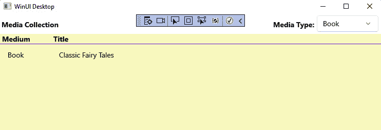

图 2.18 – 仅显示书籍的媒体集合

这样就暂时处理了过滤实现。让我们用 `Button` 完成这部分 UI 设计。

## 添加新项目按钮

我们还没有准备好开始使用多个窗口或导航。你应该对当前页面的 `Button` 有一些了解，并添加一些代码以确保一切连接正确。

打开 `MainWindow.xaml` 文件，并在 `Window` 的顶级 `Grid` 上添加第三个 `RowDefinition`，如下所示：

```cs
<Grid.RowDefinitions>
    <RowDefinition Height="Auto"/>
    <RowDefinition Height="*"/>
<RowDefinition Height="Auto"/>
</Grid.RowDefinitions>
```

新行将具有 `Auto` 高度，以便它根据 `Button` 的大小自动调整。我们仍然希望 `ListView` 占据屏幕的大部分空间。

现在，在 `ListView` 控件的关闭标签之后，添加新的 `Button`，如下所示：

```cs
<Button x:Name="AddButton" Content="Add Item"
  HorizontalAlignment="Right" Grid.Row="2" Margin="8"/>
```

如前一章所述，`Button` 控件没有 `Text` 属性。相反，如果你想只让 `Button` 控件包含文本，你可以将其分配给 `Content` 属性。我们还将 `Button` 控件分配到 `Grid` 的第三行，设置边距，并将其对齐到 `Grid` 的右侧。

让我们看看现在应用程序看起来如何，如下所示：

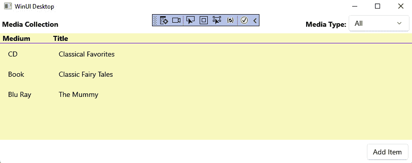

图 2.19 – 带有添加项目按钮的我的媒体集合

按钮目前还没有做任何事情。因为我们还没有准备好向应用程序添加一个额外的窗口来添加项目，让我们打开一个消息弹出窗口来通知用户此功能不可用。

在 `MainWindow.xaml` 中，在 `AddButton` 内部连接一个新的事件处理器。你也可以移除 `x:Name` 属性。我们能够移除这个名称，因为我们不需要在代码-behind 文件中引用它。代码如下所示：

```cs
<Button Content="Add Item"
   HorizontalAlignment="Right"
     Grid.Row="2" Margin="8" Click="AddButton_Click"/>
```

你可以通过将光标放在处理器名称 `AddButton_Click` 上并按 *F12* 来创建事件处理器，这将创建处理器并导航到 `MainWindow.xaml.cs` 文件。在 `AddButton_Click` 事件处理器内部，我们将创建一个新的 `ContentDialog`，并显示我们想要向用户显示的消息。

注意

调用 `dialog.ShowAsync()` 必须等待，所以请记住在事件处理器中添加 `async` 指令，如下所示。

在以下代码片段中，`async` 指令被突出显示，用于新的事件处理器：

```cs
private async void AddButton_Click(object sender,
  RoutedEventArgs e)
{
    var dialog = new ContentDialog
        {
            Title = "My Media Collection",
            Content = "Adding items to the collection is
                not yet supported.",
            CloseButtonText = "OK",
            XamlRoot = Content.XamlRoot
        };
    await dialog.ShowAsync();
}
```

现在，再次运行应用程序并单击如图所示的 **添加项目** 按钮：

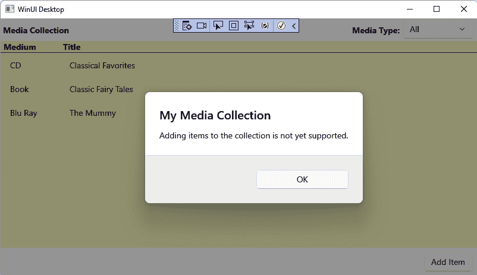

图 2.20 – 显示 ContentDialog 弹出窗口

这就是向 WinUI 页面添加功能 `Button` 的全部内容。正如我们讨论的那样，其中一些代码将在下一章中更改并移动到 `ViewModel` 中，但你现在应该已经很好地了解了如何使用一些基本的 `Button` 属性和事件。

# 摘要

在本章中，我们在 **我的媒体收藏** 应用程序上取得了很大的初步进展。在这个过程中，你学习了如何使用几个常见的 WinUI 控件。你还学习了如何通过使用不同的布局控件和更新 XAML 中的控件属性来更改 WinUI 控件的外观、布局和行为。最后，你看到了如何利用数据绑定和事件来添加和更新显示给用户的数据。

接下来，我们将学习如何将我们在代码隐藏文件中编写的部分逻辑解耦，以构建可测试和可维护的应用程序。

# 问题

1.  你如何向 Visual Studio 添加或删除功能？

1.  创建新的 WinUI 3 项目时，必须针对哪个最低 Windows 版本？

1.  你可以在哪里添加可以被整个应用程序中的组件共享的 XAML 资源？

1.  在新的 WinUI 应用程序中，第一个加载的窗口的默认名称是什么？

1.  哪个 XAML 容器控件允许你定义行和列来布局其内容？

1.  哪个 XAML 容器控件水平或垂直堆叠其内容？

1.  WinUI 应用程序可以使用哪个消息框来向用户显示简单的消息？

1.  挑战：WinUI 中哪种布局面板允许其内容绝对定位？
