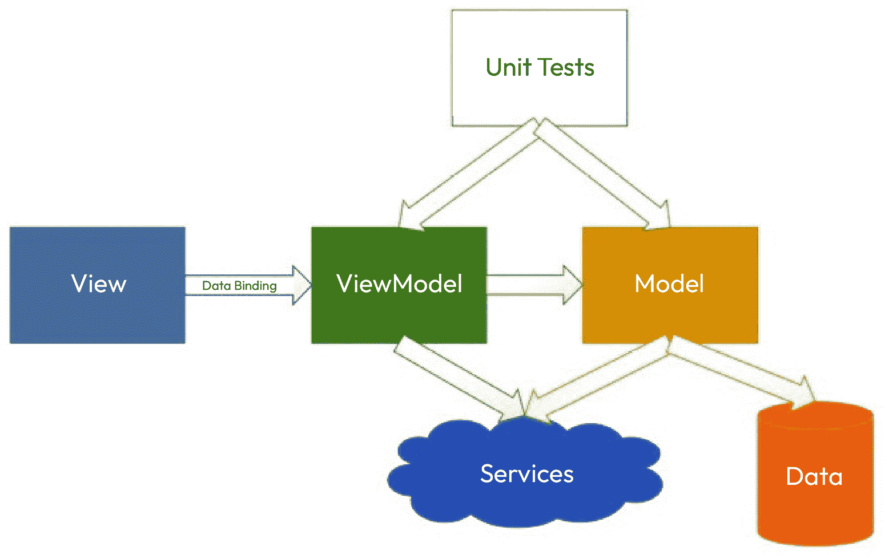
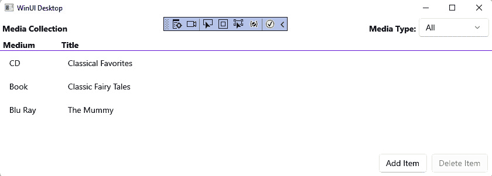

# 第三章：MVVM 的可维护性和可测试性

当构建基于 XAML 的应用程序时，最重要的设计模式之一就是 MVVM 模式。MVVM 通过数据绑定在视图的 XAML 标记和视图模型的 C#代码之间提供清晰的关注点分离。这种分离带来了易于维护和可测试性。视图模型类可以在不依赖于底层**用户界面**（UI）平台的情况下进行测试。对于大型团队来说，这种分离的另一个好处是，更改 XAML 使得 UI 设计师可以独立于专注于编写业务逻辑和应用程序后端的开发者工作。

在本章中，你将学习以下概念：

+   MVVM 设计模式的基础

+   流行的 MVVM 框架

+   在 WinUI 应用程序中实现 MVVM

+   在视图中处理视图模型更改

+   MVVM 中的事件处理

+   使用 MVVM Toolkit 简化视图模型实现

到本章结束时，你将了解 MVVM 设计模式的基础，对一些流行的 MVVM 框架有一些了解，并知道如何在 WinUI 应用程序中实现 MVVM。我们将通过实际操作开源的**MVVM Toolkit**来结束本章。

# 技术要求

要跟随本章中的示例，请参阅*第二章*的*技术要求*部分，*配置开发环境并创建* *项目*。

你可以在这里找到本章的代码文件：[`github.com/PacktPublishing/Learn-WinUI-3-Second-Edition/tree/main/Chapter03`](https://github.com/PacktPublishing/Learn-WinUI-3-Second-Edition/tree/main/Chapter03)

# 理解 MVVM

MVVM 于 2005 年由微软引入，随着**Windows Presentation Foundation**（WPF）和**Silverlight**的发布而受到开发者的欢迎，因为它非常适合构建 XAML 应用程序。它类似于由 Martin Fowler 创建的**展示模型**模式，他是设计模式最有影响力的倡导者之一。

MVVM 模式由以下三个层组成：

+   **模型**：模型层包含应用程序的业务逻辑，应执行所有数据访问操作。视图模型与模型通信以检索和保存应用程序的数据。

+   **视图**：视图层仅负责在应用程序中展示数据。布局或结构在这里定义，以及样式定义。这是负责与用户交互、接收输入事件和数据的那一层。视图通过数据绑定表达式仅了解视图模型。

+   **ViewModel**：视图模型（或 ViewModel）层负责维护视图的数据状态。它有一组属性，通过数据绑定向视图提供数据，以及一组由视图在响应用户输入事件时调用的命令。视图模型类对其对应的视图没有了解。

## MVVM – 整体架构

让我们看看 MVVM 的组件如何适应实现该模式的整体应用程序架构，以下图所示：



图 3.1 – 使用中的 MVVM 模式

在 *图 3.1* 中，你可以看到 MVVM 模式的表示以及应用程序的其他部分：服务、数据和单元测试。图中的箭头表示依赖关系，而不是数据流。你可以想象，数据需要沿着这些路径的大部分双向移动，以创建一个功能性的应用程序。

与许多设计模式一样，MVVM 模式旨在为开发者提供创建可靠、可维护应用程序的指南。然而，并非所有开发者都以相同的方式实现该模式。差异通常在于模型的实现。一些开发者会以 **领域驱动设计** (**DDD**) 风格创建领域模型。这对于具有复杂业务逻辑的大型应用程序是有意义的。对于更简单的应用程序，模型可能只是一个简单的数据访问层，位于客户端或服务层之后。在这些情况中，前图中 **服务** 云会在视图模型和模型层之间移动。

MVVM 的目的是帮助你构建最适合用户的应用程序。随着你对 MVVM 和 WinUI 的经验积累，你将找到适合你应用程序的正确实现方式。一个不错的开始是找到一些使与 MVVM 一起工作变得更简单的框架。

# WinUI 的 MVVM 库

在 WinUI 应用程序中使用 MVVM 时，你必须创建一些基础设施代码来促进视图和视图模型之间的数据绑定。你可以自己编写这些代码，或者选择一个将这种管道代码从你的应用程序中抽象出来的框架。虽然我们将在下一节中编写应用程序的管道代码，但让我们回顾一些流行的 WinUI MVVM 框架。

## MVVM 工具包

我们将通过 Visual Studio 中的 **NuGet 包管理器** 讨论通过 `CommunityToolkit.Mvvm` **NuGet 包**，或者在 NuGet 网站上查看其详细信息，网址为 [`www.nuget.org/packages/CommunityToolkit.Mvvm/`](https://www.nuget.org/packages/CommunityToolkit.Mvvm/)。

该库包括支持 `INotifyPropertyChanged`、`IMessenger` 和 `ICommand` 的基类。它还包括其他消息和 **控制反转** (**IoC**) 辅助类。此外，MVVM Toolkit 的最新版本使用 **Roslyn 源生成器** 来减少开发者需要编写的样板代码量。

注意

如果您不熟悉 Roslyn，它是 **.NET 编译器平台** 的代码名称。它首次与 Visual Studio 2015 一起 **发布到制造**（**RTM**），并且是 C# 和 VB.NET 语言的当前编译器。Roslyn 通过 .NET 编译器平台 SDK 的可扩展性允许开发者创建诸如自定义源生成器和 Visual Studio 的源代码分析器等工具。有关该平台的信息，您可以查看 Microsoft Learn 上的文档：[`learn.microsoft.com/dotnet/csharp/roslyn-sdk/`](https://learn.microsoft.com/dotnet/csharp/roslyn-sdk/)。

在本章的后面部分，在您学习了如何实现自己的 MVVM 基类之后，我们将在我们的示例应用程序中利用 MVVM Toolkit。

## Prism 库

**Prism** 最初是由 Microsoft 创建和维护的库。它是 Microsoft 开发者部门用于维护的 **模式与实践** 指南、参考架构和库的一部分。

注意

以下由 Microsoft 维护的剩余 *模式与实践* 项目可以在 GitHub 上找到：[`github.com/mspnp`](https://github.com/mspnp)。

Microsoft 决定开源 Prism 库并将所有权转让给社区。该项目托管在 GitHub 上，可以在网络上找到：[`prismlibrary.com/`](https://prismlibrary.com/)。Prism 为 WPF、Xamarin、UWP 和 WinUI 项目提供了包。

Prism 不仅仅是一个 MVVM 框架。它还包括用于松散耦合应用程序消息的 `EventAggregator`。Prism 可以通过 NuGet 添加到项目中。Prism 网站上还有一个安装程序，可以添加 Visual Studio 项目和项目模板。

## MVVMCross

**MVVMCross** 是一个最初为 Xamarin 开发者创建的 MVVM 框架。现在它提供了适用于 Xamarin、.NET MAUI、WPF、UWP 和 WinUI 的 NuGet 包。与 Prism 类似，MVVMCross 不仅在 WinUI 应用程序中促进了数据绑定，它还提供了以下方面的辅助工具：

+   数据绑定

+   导航

+   日志和跟踪

+   依赖注入和 IoC

+   单元测试

有一些额外的库，但大多数都是针对 .NET MAUI 应用程序的。MVVMCross 包也可以通过 NuGet 添加到您的项目中。有关在 WinUI 中使用 MVVMCross 的更多信息，请查看他们的网站：[`www.mvvmcross.com/`](https://www.mvvmcross.com/)。

## 选择 WinUI 应用程序的框架

使用第三方框架构建生产 XAML 应用程序是一个很好的选择。这些提供了内置的日志和依赖注入支持。对于本书中的 WinUI 应用程序，我们将在本章末尾使用 MVVM Toolkit 进行数据绑定。然而，首先，我们将从头开始实现 MVVM 模式。这将帮助您了解数据绑定、依赖注入和其他与 MVVM 相关的核心概念的基础机制。

在开始编写代码之前，您应该了解 WinUI 中数据绑定是如何工作的。

# 理解 WinUI 中的数据绑定

在上一章中，你看到了一些使用 `Binding` 和 `x:Bind` 标记扩展的简单数据绑定示例。让我们分析一下允许视图在视图模型数据发生变化时接收更新的组件。

## 什么是标记扩展？

对标记扩展的深入讨论超出了本入门书的范围。简而言之，它们是一个执行一些逻辑并将值返回给 XAML 解析器的类。你可以在 XAML 中通过查找大括号内的某些标记来识别它们的使用。以下是一个 `TextBlock` 的 `Text` 属性中的 `Binding` 示例：

```cs
<TextBlock Text="{Binding Path=Name, Mode=TwoWay}"/>
```

从这个例子中，你可以推断出存在一个名为 `Binding` 的标记扩展类，并且它有两个属性是 `Path` 和 `Mode`。这个标记扩展会获取这些属性，解析一个值，并将其返回给 XAML 解析器，以便在应用程序的视图中显示。

一些 XAML 标记语言允许开发者编写自己的自定义标记扩展。WPF 和 .NET MAUI 有自定义标记扩展，但 WinUI 没有。如果你对标记扩展的实现感兴趣，Microsoft Learn 提供了关于如何为 .NET MAUI 创建一个的文档：[`learn.microsoft.com/dotnet/maui/xaml/markup-extensions/create`](https://learn.microsoft.com/dotnet/maui/xaml/markup-extensions/create)。

现在，让我们更深入地了解 WinUI 中的 `Binding` 标记扩展。

## 标记扩展

正如你简要看到的，`Binding` 标记扩展将绑定源（MVVM 中的视图模型）中的数据映射到绑定目标（视图），并提供给它。这些都是 `Binding` 标记扩展的属性：

+   `Path`：数据绑定源中值的路径。对于我们的应用程序，这将是在视图模型上的属性名称。

+   `Converter`：如果源属性的 数据类型与视图中控件属性的 数据类型不匹配，则使用 `Converter` 属性来定义两者之间的映射。

+   `ConverterLanguage`：如果指定了 `Converter` 属性，可以可选地设置 `ConverterLanguage` 属性以支持国际化。

+   `ConverterParameter`：如果 `Converter` 属性需要一个参数，请使用 `ConverterParameter` 属性来提供它。通常不使用 `ConverterParameter` 属性，它通常是一个 `string` 值。如果你需要向 `Converter` 提供多个值，你可以将它们连接起来，然后在方法内部解析它们。

+   `ElementName`：当绑定到视图中的另一个元素的属性时使用此参数。

+   `FallBackValue`：如果数据绑定因任何原因失败，你可以指定一个 `FallBackValue` 属性在视图中显示。

+   `Mode`：这定义了数据绑定是 `OneTime`（仅在 XAML 首次解析时设置值）、`OneWay`（在检测到更改时从 View Model 获取值）还是 `TwoWay`（值在 View 和 View Model 之间双向流动）。`Binding` 的默认 `Mode` 设置取决于所绑定的控件和属性。如果您不确定默认的 `Mode`，请检查文档。

+   `RelativeSource`：用于定义相对于当前控件的数据绑定源。这通常与通过父元素获取数据的控件模板一起使用。

+   `Source`：指定数据绑定源。这通常在 WinUI 的顶级控件级别定义，作为 View Model。然而，子控件可以设置不同的 `Source`，覆盖从其祖先继承的 `Source`。在 View 的任何级别定义的 `Source` 值将被所有子元素继承，除非设置了新的 `Source`。

+   `TargetNullValue`：指定如果数据绑定源解析但具有 `null` 值时显示的默认值。

+   `UpdateSourceTrigger`：指定更新 `TwoWay` 绑定源的频率。选项有 `PropertyChanged`、`Explicit` 和 `LostFocus`。大多数属性的默认频率是 `PropertyChanged`。

`Path` 是默认属性，在没有给出参数属性名称时假定。例如，前面的 `TextBlock` 示例也可以写成以下形式：

```cs
<TextBlock Text="{Binding Name, Mode=TwoWay}"/>
```

这里，`Name` 假定是提供的 `Path` 参数的值。提供两个参数而不指定参数名称将导致 XAML 解析器错误。

`Binding` 标记扩展在每种 XAML 语言中都能找到。另一种数据绑定选项 `x:Bind` 则不是。它仅是 UWP 和 WinUI 中的一个选项。

## x:Bind 标记扩展

`x:Bind` 是 WinUI 的一个替代标记扩展。它比 `Binding` 更快，使用的内存更少，并且具有更好的调试支持。它通过在编译时生成代码以在运行时进行绑定来实现这种性能提升。相比之下，`Binding` 标记扩展是在运行时由 XAML 解析器执行的，这会产生额外的开销。编译时绑定还会在编译时捕获不正确的数据绑定表达式，而不是在运行时生成数据绑定失败。

`Binding` 和 `x:Bind` 之间的另一个重要区别是 `Binding` 需要设置 `Data`
`Context`。数据绑定到 `DataContext` 内对象的属性。当使用 `x:Bind` 时，您直接绑定到当前 `Window` 或 `UserControl` 上的属性。您还可以使用 `x:Bind` 直接将事件绑定到代码背后的 Window 的事件处理器。

虽然 `x:Bind` 的大多数属性与 `Binding` 相同，但让我们突出以下不同的属性：

+   `ElementName`：在 `x:Bind` 中不可用。您必须使用 `Binding` 来将数据绑定到其他 XAML 元素属性。如果您的应用程序必须绑定到其他元素，可以在同一视图中使用 `x:Bind` 和 `Binding`。

+   `Mode`：这里唯一的区别是 `x:Bind` 的默认 `Mode` 通常为 `OneTime`，而不是 `OneWay`。

+   `RelativeSource`：在 `x:Bind` 中不可用。

+   `Source`：在 `x:Bind` 中不可用。相反，您通常会在每个视图的代码隐藏文件中定义一个 `ViewModel` 属性，其数据类型为相应的 ViewModel 类。您也可以为属性创建一个特定领域的名称，例如，在我们的应用程序中为 `MediaItems`。

+   `BindBack`：这个属性是 `x:Bind` 独有的。它允许在调用反向数据绑定时调用一个自定义函数。这并不常用，我们不会在我们的应用程序中使用它。

`x:Bind` 是一个强大且复杂的标记扩展。有关更多信息，您可以阅读 Microsoft Learn 上的此页面：[`learn.microsoft.com/windows/uwp/xaml-platform/x-bind-markup-extension`](https://learn.microsoft.com/windows/uwp/xaml-platform/x-bind-markup-extension)。

接下来，让我们讨论 `INotifyPropertyChanged`，这个接口使得 ViewModel 中数据绑定属性的变化可以在视图中反映出来。

## 使用 INotifyPropertyChanged 更新视图数据

那么，当 ViewModel 中的数据发生变化时，视图是如何得到通知的呢？这个魔法就隐藏在 `Microsoft.UI.Xaml.Data.INotifyPropertyChanged` 接口中。这个接口只有一个成员，如下所示：

```cs
public interface INotifyPropertyChanged
{
    event PropertyChangedEventHandler PropertyChanged;
}
```

每个 ViewModel 类都必须实现这个接口，并通过触发 `PropertyChanged` 事件来更新视图。通过在 `PropertyChangedEventArgs` 参数中传递其名称来指示哪个属性已更改。为了刷新所有属性，可以将属性名称传递为 `null` 或 `string.Empty`，但请注意这可能会对大型视图的性能产生潜在影响。

## 使用 INotifyCollectionChanged 更新集合数据

`INotifyPropertyChanged` 对于大多数属性都工作得很好，但如果集合中的项目被添加或删除，它将不会更新视图。这就是使用 `Microsoft.UI.Xaml.Interop.INotifyCollectionChanged` 接口的地方。同样，这个接口只有一个成员，如下所示：

```cs
public interface INotifyCollectionChanged
{
    event NotifyCollectionChangedEventHandler
      CollectionChanged;
}
```

在 .NET 中常用的一些集合或集合接口（如 `List<T>`、`IEnumerable<T>` 等）都没有实现这个接口。您可以创建一个从现有列表类型派生的自定义集合，并自行实现 `INotifiedCollectionChanged`，但使用已经对 WinUI 开发者可用的 `ObservableCollection<T>` 列表类型要容易得多。这是一个在添加或删除项目，或内容完全刷新时更新视图的集合。

`ObservableCollection<T>` 的 `Items` 属性是只读的，因此不能直接设置。你可以在创建 `ObservableCollection<T>` 时通过传递一个 `List<T>` 或 `IEnumerable<T>` 到构造函数来添加项目，或者使用它的 `Add` 或 `Insert` 方法（没有 `AddRange` 方法来添加多个项目）。你可以通过将新项目赋值给当前索引来更新集合中的单个值。你可以使用 `Remove`、`RemoveAt`、`ClearItems` 或 `Clear` 方法来删除项目。

在下一节中，当我们自己实现 MVVM 模式时，你将看到这些概念在实际中的应用。

# 在 WinUI 应用程序中实现 MVVM

现在是时候开始将我们的项目转换为使用 MVVM 了。为了彻底理解 MVVM 模式，我们将首先构建自己的 MVVM 基础设施。对于简单的应用程序，它不需要超过一个基类：

1.  首先在项目中添加一个 **ViewModels** 文件夹。如果你正在使用 GitHub 上的代码，你可以继续使用上一章的项目，或者使用该章节文件夹中的 **Start** 项目。

1.  接下来，向 `BindableBase` 添加一个新的类。这将是项目中所有 View Model 类的基类。它将负责通知相应的视图任何属性的变化。这是通过实现 `INotifyPropertyChanged` 接口来完成的。让我们回顾一下 `BindableBase` 类的代码，如下所示：

    ```cs
    public class BindableBase : INotifyPropertyChanged
    {
        public event PropertyChangedEventHandler
          PropertyChanged;
        protected void OnPropertyChanged(
          [CallerMemberName] string propertyName = null)
        {
            PropertyChanged?.Invoke(this, new Property
              ChangedEventArgs(propertyName));
        }
        protected bool SetProperty<T>(ref T originalValue,
          T newValue, [CallerMemberName] string
            propertyName = null)
        {
            if (Equals(originalValue, newValue))
            {
                return false;
            }
            originalValue = newValue;
            OnPropertyChanged(propertyName);
            return true;
        }
    }
    ```

通过将其作为我们 View Models 的基类，它们将有两个新的方法可供使用，如下所示：

+   `OnPropertyChanged`：使用此方法触发 `PropertyChanged` 事件以通知 View 数据的变化

+   `SetProperty`：此方法用于设置属性的值，如果值已更改，则会调用 `OnPropertyChanged`

注意

确保在 `BindableBase` 类文件顶部有这两个 `using` 指令：

`using System.ComponentModel;`

`using System.Runtime.CompilerServices;`

现在我们已经有了基类，让我们将第一个 View Model 添加到项目中。右键单击 `MainViewModel`。这个 View Model 将会替换 `MainWindow` 中的大部分代码。以下代码是修改后的类的一部分。请参考 GitHub 仓库中该章节的 `MainViewModel.txt` ([`github.com/PacktPublishing/Learn-WinUI-3-Second-Edition/tree/main/Chapter03/Complete/MyMediaCollection/ViewModels`](https://github.com/PacktPublishing/Learn-WinUI-3-Second-Edition/tree/main/Chapter03/Complete/MyMediaCollection/ViewModels)) 以获取完整类的当前版本：

```cs
public class MainViewModel : BindableBase
{
    private string selectedMedium;
    private ObservableCollection<MediaItem> items;
    private ObservableCollection<MediaItem> allItems;
    private IList<string> mediums;
    public MainViewModel()
    {
        PopulateData();
    }
    ...
    public IList<string> Mediums
    {
        get
        {
            return mediums;
        }
        set
        {
            SetProperty(ref mediums, value);
        }
    }
    ...
}
```

你可能已经注意到代码已经更新，在每个属性的 `Set` 块中使用新的 `BindableBase.SetProperty` 方法。这确保了当属性值发生变化时，UI 将会收到通知：

1.  现在，我们需要使`MainViewModel`类对`MainWindow`视图可用。由于在整个应用程序生命周期中将使用此视图模型的单个实例，我们将在`App.xaml.cs`文件中添加一个静态只读属性，使其对应用程序可用，如下所示：

    ```cs
    public static MainViewModel ViewModel { get; } = new
    MainViewModel();
    ```

1.  我们现在可以删除`MainViewModel`类中的所有代码。此外，添加一个属性使`App.ViewModel`对`MainWindow`的数据绑定可用，如下所示：

    ```cs
    public sealed partial class MainWindow : Window
    {
        public MainWindow()
        {
            this.InitializeComponent();
            Loaded += MainPage_Loaded;
        }
        public MainViewModel ViewModel => App.ViewModel;
        private async void AddButton_Click(object sender,
          Microsoft.UI.Xaml.RoutedEventArgs e)
        {
            var dialog = new MessageDialog("Adding items
              to the collection is not yet available.",
                "My Media Collection");
            await dialog.ShowAsync();
        }
    }
    ```

    目前我们只需要在代码隐藏文件中保留关于`MainViewModel`的代码。现在只需要对处理新数据源进行两个更改，详细说明如下。

1.  首先，更新`ComboBox`以删除`x:Name`属性，并为`ItemsSource`和`SelectedItem`属性添加`x:Bind`数据绑定。`SelectedItem`绑定需要设置为`TwoWay`。这将确保当用户在 UI 中更改`SelectedMedium`时，`MainViewModel`中的数据会更新。代码可以在以下代码片段中看到：

    ```cs
    <ComboBox ItemsSource="{x:Bind ViewModel.Mediums}"
      SelectedItem="{x:Bind ViewModel.SelectedMedium,
        Mode=TwoWay}" HorizontalAlignment="Right"
          MinWidth="120" Margin="0,2,6,4"/>
    ```

1.  现在，更新`ListView`以删除`x:Name`属性，并添加一个`ItemsSource` `x:Bind`数据绑定，如下所示：

    ```cs
    <ListView Grid.Row="1" ItemsSource="{x:Bind
      ViewModel.Items}">
    ```

    为这些控件分配的名称不再需要，因为我们没有在代码中的任何地方引用它们。

注意

为 XAML 元素分配名称会分配额外的资源。建议仅在元素必须直接从代码隐藏文件或其他视图元素的`ElementName`数据绑定中引用时才命名元素。

1.  现在，运行应用程序并尝试使用`ComboBox`更改`Medium`过滤器。它应该表现得与之前完全一样，但现在我们已经将视图模型数据与 UI 解耦，这使得测试或潜在的重用变得更加容易。

接下来，我们将解决`MainWindow.xaml.cs`文件中仍然存在的按钮`Click`事件。

# 与事件和命令一起工作

是时候更新项目，将事件处理代码移动到`MainViewModel`。在本节结束时，你将删除添加到`ViewModel`属性的所有代码。这将有利于关注点的分离，以及项目的可维护性和可测试性。

我们可以使用与`Click`事件连接并连接到`MainViewModel`类上的方法的相同过程。这种方法有两个问题：

+   视图层和视图模型层变得更加紧密耦合，降低了可维护性

+   UI 关注点被注入到视图模型中，降低了类的可测试性

让我们另辟蹊径。MVVM 模式中的`Command`属性都有一个概念，即它们都期望一个`System.Windows.Input.ICommand`类型的类型。

## 实现`ICommand`

在项目中使用命令，我们首先需要创建一个`ICommand`的实现。

注意

使用像 Prism 或 MVVM Toolkit 这样的 MVVM 框架的优点之一是它们提供了`ICommand`的实现。

在项目中的`ViewModel`文件夹中添加一个新类，并将其命名为`RelayCommand`。这个类将实现`ICommand`接口。`RelayCommand`类将如下所示：

```cs
public class RelayCommand : ICommand
{
    private readonly Action action;
    private readonly Func<bool> canExecute;
    public RelayCommand(Action action)
        : this(action, null)
    {
    }
    public RelayCommand(Action action, Func<bool>
      canExecute)
    {
        if (action == null)
            throw new ArgumentNullException
              (nameof(action));
        this.action = action;
        this.canExecute = canExecute;
    }
    public bool CanExecute(object parameter) => canExecute
      == null || canExecute();
    public void Execute(object parameter) => action();
    public event EventHandler CanExecuteChanged;
    public void RaiseCanExecuteChanged() =>
      CanExecuteChanged?.Invoke(this, EventArgs.Empty);
}
```

`RelayCommand`有两个构造函数，它们都接受一个在命令执行时将被调用的`Action`。其中一个构造函数还接受一个`Func<bool>`。这将允许我们根据`CanExecute`的返回值启用或禁用 UI 操作。我们将使用此功能来启用`ListView`。

## 在视图模型中使用命令

现在，是时候更新`MainViewModel`以处理来自**添加**和**删除**按钮的命令了。在下一章中，我们将增强添加操作，使其能够添加或编辑项目。因此，让我们相应地命名命令和方法：

1.  首先，向`MainViewModel`类中添加两个新的私有变量：

    ```cs
    private MediaItem selectedMediaItem;
    private int additionalItemCount = 1;
    ```

    `additionalItemCount`变量是一个临时变量，我们将用它来跟踪我们添加到列表中的新项目数量。计数器将帮助我们为每个新媒体项目生成唯一的 ID 和名称。"selectedMediaItem"是新的`SelectedMediaItem`属性的备份变量。

1.  接下来，添加`SelectedMediaItem`属性：

    ```cs
    public MediaItem SelectedMediaItem
    {
        get => selectedMediaItem;
        set
        {
            SetProperty(ref selectedMediaItem, value);
            ((RelayCommand)DeleteCommand)
              .RaiseCanExecuteChanged();
        }
    }
    ```

    除了调用`SetProperty`来通知 UI`SelectedMediaItem`已更改外，我们还需要在新的`DeleteCommand`上调用`RaiseCanExecuteChanged`。

1.  接下来，让我们添加`DeleteCommand`和`AddEditCommand`以及它们对应的行为：

    ```cs
    public ICommand AddEditCommand { get; set; }
    public void AddOrEditItem()
    {
        // Note this is temporary until
        // we use a real data source for items.
        const int startingItemCount = 3;
        var newItem = new MediaItem
        {
            Id = startingItemCount + additionalItemCount,
            Location = LocationType.InCollection,
            MediaType = ItemType.Music,
            MediumInfo = new Medium { Id = 1, MediaType =
              ItemType.Music, Name = "CD" },
            Name = $"CD {additionalItemCount}"
        };
        allItems.Add(newItem);
        Items.Add(newItem);
        additionalItemCount++;
    }
    public ICommand DeleteCommand { get; set; }
    private void DeleteItem()
    {
        allItems.Remove(SelectedMediaItem);
        Items.Remove(SelectedMediaItem);
    }
    private bool CanDeleteItem() => selectedMediaItem !=
      null;
    ```

    每个 UI 操作（`AddEditCommand`和`Delete`）都有一个`ICommand`属性，以及每个命令的执行方法（`AddOrEditItem`和`DeleteItem`）。还有一个`CanDeleteItem`方法，它返回一个`bool`值，以指示用户是否已选择媒体项目。

1.  在`MainViewModel`构造函数的末尾，添加两行代码来初始化命令，将它们连接到相应的函数：

    ```cs
    DeleteCommand = new RelayCommand(DeleteItem,
      CanDeleteItem);
    // No CanExecute param is needed for this command
    // because you can always add or edit items.
    AddEditCommand = new RelayCommand(AddOrEditItem);
    ```

上述代码是修改后的`MainViewModel`类的一部分。请参考 GitHub 仓库中的`MainViewModel2.txt`文件以获取完整类的当前版本，该文件位于[`github.com/PacktPublishing/Learn-WinUI-3-Second-Edition/tree/main/Chapter03/Complete/MyMediaCollection/ViewModels`](https://github.com/PacktPublishing/Learn-WinUI-3-Second-Edition/tree/main/Chapter03/Complete/MyMediaCollection/ViewModels)。

我们的视图模型已被更新为使用命令。接下来，我们将更新视图以绑定到它们。

## 更新视图

我们的视图模型已经准备好了。现在可以安全地从`MainWindow`代码中移除所有的事件处理代码。完成时，它应该看起来像这样：

```cs
public sealed partial class MainWindow : Window
{
    public MainWindow()
    {
        this.InitializeComponent();
    }
    public MainViewModel ViewModel => App.ViewModel;
}
```

**MainWindow.xaml**文件需要一些更新，以便**添加项目**和**删除项目**按钮能够与临时测试数据完全功能化。执行以下步骤以完成此操作：

1.  更新`ListView`以将视图模型中的`SelectedItem`属性绑定到`SelectedMediaItem`：

    ```cs
    <ListView Grid.Row="1" ItemsSource="{x:Bind
      ViewModel.Items}" SelectedItem="{x:Bind
    TwoWay data binding is required to allow the UI to update the view model.
    ```

1.  接下来，移动`网格`。然后，创建一个`点击`事件处理程序，并将网格和两个按钮的属性设置为以下代码片段：

    ```cs
    <StackPanel Grid.Row="2"
                HorizontalAlignment="Right"
                Orientation="Horizontal">
        <Button Command="{x:Bind
          ViewModel.AddEditCommand}"
                Content="Add Item"
                Margin="8,8,0,8"/>
        <Button Command="{x:Bind ViewModel.DeleteCommand}"
                Content="Delete Item"
                Margin="8"/>
    </StackPanel>
    ```

    每个按钮的 `Command` 属性将绑定到视图模型中的新 `ICommand` 属性。当用户点击按钮时，将调用按钮的 `Command` 属性。

1.  我们现在已更新项目以使用 MVVM。运行应用程序以查看其工作情况。

1.  当它首次加载时，**删除项目**按钮将被禁用。选择列表中的一个项目，注意按钮会自动启用。如果您点击**删除项目**，所选项目将从列表中删除，按钮再次被禁用。

1.  最后，点击**添加项目**几次，看看新项目是如何创建并添加到列表中的。每个新项目都使用我们在视图模型中创建的计数器具有一个独特的名称，如下面的截图所示：



图 3.2 – 添加和删除一些项目后的我的媒体收藏

`MainWindow` 现在有一个完全与任何 UI 关注点解耦的视图模型。这将允许您在项目中最大化单元测试覆盖率。

在我们结束之前，让我们看看如何通过使用 MVVM 框架（如 MVVM 工具包）来减少项目中代码的数量。

# 利用 MVVM 工具包

我们在本章中简要介绍了 MVVM 工具包。在本节中，我们将更新 `MainViewModel` 以了解我们如何消除对 `BindableBase` 类的需求并减少视图模型本身的代码量：

1.  首先，在**解决方案资源管理器**中右键单击解决方案文件，并选择**解决方案**的**管理 NuGet 包**。

1.  在 NuGet 窗口中，选择 `CommunityToolkit.Mvvm`。

1.  在结果中选择 **CommunityToolkit.Mvvm** 包，并安装最新稳定版本（8.2.0 或更高版本）。

1.  关闭 NuGet 窗口并打开 `MainViewModel` 类。我们需要做的第一件事是使用 MVVM 工具包的源生成器，将 `MainViewModel` 更新为部分类，并使其继承自 `CommunityToolkit.Mvvm.ComponentModel.ObservableObject` 而不是我们自己的 `BindableBase` 类：

    ```cs
    public partial class MainViewModel : ObservableObject
    ```

注意

要了解 MVVM 工具包如何使用 **.NET 源生成器**生成公共属性和命令的更多信息，请查看 Microsoft Learn 上的文档：[`learn.microsoft.com/dotnet/communitytoolkit/mvvm/generators/overview`](https://learn.microsoft.com/dotnet/communitytoolkit/mvvm/generators/overview)。如果您不熟悉 .NET 源生成器，您也可以在 Microsoft Learn 的 .NET 文档中了解它们：[`learn.microsoft.com/dotnet/csharp/roslyn-sdk/source-generators-overview`](https://learn.microsoft.com/dotnet/csharp/roslyn-sdk/source-generators-overview)。

1.  接下来，每个只在其设置器中调用 `SetProperty` 的简单属性将被移除，并且后备变量将被更新以具有 `ObservableProperty` 属性。移除 `Mediums` 和 `Items` 属性，以及私有的 `mediums` 和 `items` 字段现在应如下所示：

    ```cs
    [ObservableProperty]
    private IList<string> mediums;
    [ObservableProperty]
    private ObservableCollection<MediaItem> items;
    ```

    类中剩下两个公共属性。让我们从 `SelectedMedium` 开始。在更新命令后，我们将移除 `SelectedMediaItem`。

1.  `SelectedMedium` 的设置器在调用 `SetProperty` 之后有一些自定义逻辑。创建一个新的部分方法 `OnSelectedMediumChanged` 来包含那段代码：

    ```cs
    partial void OnSelectedMediumChanged(string value)
    {
        Items.Clear();
        foreach (var item in allItems)
        {
            if (string.IsNullOrWhiteSpace(value) ||
                value == "All" ||
                value == item.MediaType.ToString())
            {
                Items.Add(item);
            }
        }
    }
    ```

    注意，我们还更新了 `selectedMedium` 的使用为 `value`。`value` 参数包含新的 `selectedMedium` 值。你可能也注意到了在 Visual Studio 中的 `PopulateData` 方法内的一些绿色波浪线，这表明你应该使用生成的属性而不是直接使用私有的 `ObservableProperty` 成员。你可以通过将每个变量的首字母大写来更新所有这些使用。

1.  接下来，我们将更新两个命令。将 `RelayCommand` 属性添加到 `AddOrEditItem` 和 `DeleteItem` 方法中，并将它们重命名为 `AddEdit` 和 `Delete`，以确保生成的命令具有与旧命令相同的名称。

1.  移除两个命令以及它们在 `MainViewModel` 构造函数中初始化的代码。构造函数的代码和两个命令方法的签名现在应如下所示：

    ```cs
    public MainViewModel()
    {
        PopulateData();
    }
    [RelayCommand]
    public void AddEdit()
    {
    ...
    }
    [RelayCommand(CanExecute = nameof(CanDeleteItem))]
    public void Delete()
    {
    ...
    }
    private bool CanDeleteItem() => SelectedMediaItem !=
      null;
    ```

    `DeleteItem` 的属性还指示应使用 `CanDeleteItem` 来检查命令是否可以调用。

1.  最后，让我们将 `SelectedMediaItem` 属性替换为 MVVM 工具包生成的源属性。现有的公共属性告诉 `DeleteCommand` 应该检查 `CanExecute`。移除该属性，并将私有的 `selectedMediaItem` 变量更新以添加两个属性：

    ```cs
    [ObservableProperty]
    [NotifyCanExecuteChangedFor(nameof(DeleteCommand))]
    private MediaItem selectedMediaItem;
    ```

    除了 `ObservableProperty` 属性之外，我们还添加了一个 `NotifyCanExecuteChangedFor` 属性，提供了由 `DeleteCommand` 生成的 `ICommand` 属性的名称。对我们不可见的生成属性将等同于以下内容：

    ```cs
    public MediaItem SelectedMediaItem
    {
        get => selectedMediaItem;
        set
        {
            if (SetProperty(ref selectedMediaItem, value))
            {
                DeleteCommand.NotifyCanExecuteChanged();
            }
        }
    }
    ```

这就是你需要做的全部。在视图中不需要进行任何更改，应用程序的工作方式与之前完全相同。我们所做的就是从 `MainViewModel` 中移除了一大块代码。

我们将在接下来的章节中继续使用 MVVM 工具包。现在，让我们回顾一下本章学到的内容。

# 概述

在本章中，我们对应用程序已经取得了一些进展。虽然它还没有连接到实时数据源，但我们已经有了在内存中添加和删除媒体集合项的方法。此外，项目已经被重构，使用 `MainWindow` 代码隐藏文件转换为新的 `MainViewModel` 类。新的 `MainViewModel` 类不依赖于 UI。最后，我们看到了如何将 MVVM Toolkit 集成到项目中可以减少我们视图模型中的样板代码。这些良好的软件设计习惯将在我们构建更多功能到项目中的后续章节中为我们服务。

在下一章中，我们将继续学习如何使用 MVVM 模式来编写健壮、可维护的 WinUI 应用程序。我们将涵盖一些更高级的 MVVM 主题，并学习在 WinUI 项目中进行窗口管理的技巧。

# 问题

1.  MVVM 代表什么？

1.  在 MVVM 模式中，哪一层通常定义业务实体？

1.  请列举本章讨论的流行 MVVM 框架之一。

1.  在 MVVM 应用程序中，每个视图模型类必须实现哪个接口？

1.  在 .NET 中，哪种特殊的集合类型通过数据绑定通知 UI 集合的变化？

1.  `ComboBox` 和 `ListView` 控件的哪个属性用于获取或设置控件中当前选中的项？

1.  实现事件绑定的命令的哪个接口被实现？
