# 5

# 探索 WinUI 控件

WinUI 3 和 Windows App SDK 为开发 Windows 桌面应用程序的开发者提供了许多控件和 API。WinUI 控件包括一些之前未提供给 Windows 开发者的控件，以及已在 WinUI 2.x 和 **UWP** 中可用的更新后的控件。使用这些新控件和 WinUI 3 的更新控件，可以在之前不支持此完整组件套件的旧版 Windows 中使用它们。开发者还可以利用 Windows App SDK API 来直接访问 Windows 功能。

本章将涵盖以下主题：

+   深入了解 WinUI 3 中可用的控件

+   探索 Windows 的 **WinUI 3 画廊** 应用程序以了解 WinUI 控件和设计指南

+   其他 Windows App SDK API 如何为 Windows 开发者提供对电源管理、通知等功能的访问

+   如何在您的应用程序中实现 `SplitButton` 和 `TeachingTip` 控件

到本章结束时，你将更深入地了解 WinUI 3 中的控件和库。你还将能够舒适地使用 Windows 的 WinUI 3 画廊应用程序来探索控件并找到演示如何使用它们的示例。

# 技术要求

要跟随本章中的示例，请参考 *第二章* 的 *技术要求* 部分，*配置开发环境和创建* *项目*。

本章的源代码可在 GitHub 上找到：[`github.com/PacktPublishing/Learn-WinUI-3-Second-Edition/tree/master/Chapter05`](https://github.com/PacktPublishing/Learn-WinUI-3-Second-Edition/tree/master/Chapter05).

# 了解 WinUI 为开发者提供了什么

在 *第一章* 中，*WinUI 简介*，你了解了一些关于 WinUI 和 UWP 源起的背景信息。该章节还涵盖了 WinUI 各个版本中可用的一些控件。现在，让我们更详细地探索其中的一些控件。让我们先看看 WinUI 3 中开发者可用的控件列表：

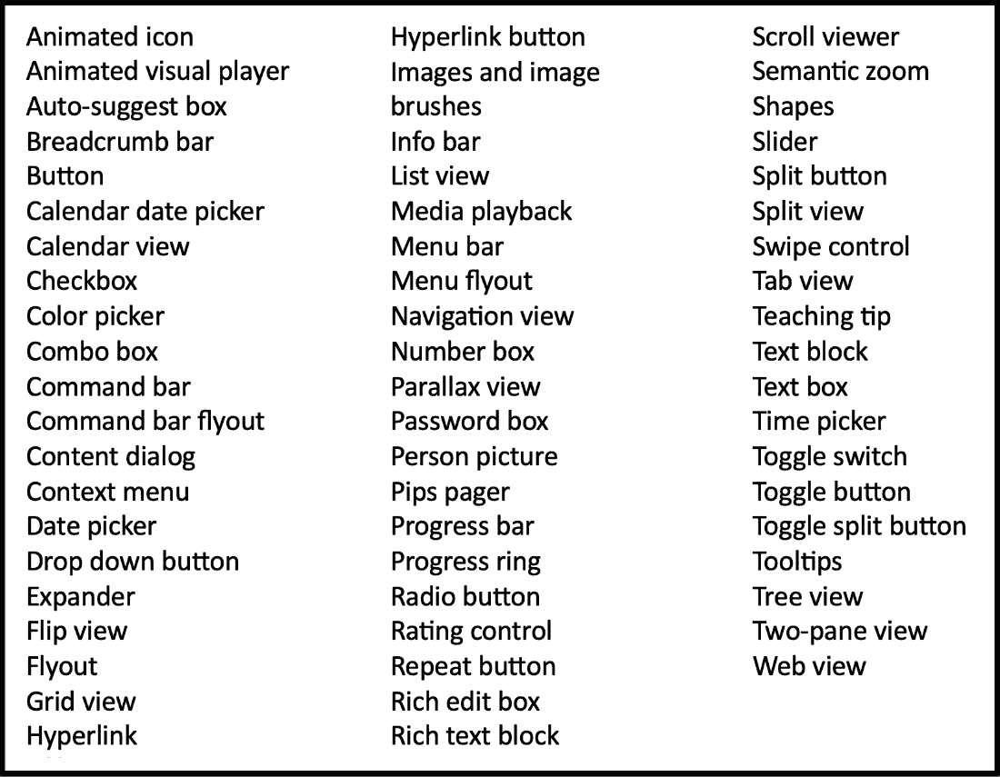

图 5.1 – WinUI 3 控件列表

这是 Windows App SDK 中开发者可用的控件相当广泛的列表。

小贴士

要获取可用控件的最新列表，你可以查看 *Microsoft* *Learn* 上的此页面：[`learn.microsoft.com/windows/apps/design/controls/#alphabetical-index`](https://learn.microsoft.com/windows/apps/design/controls/#alphabetical-index).

如果您之前开发过 Windows 应用程序，那么这些控件名称中的大多数可能对您来说都很熟悉。在接下来的部分中，我们将概述一些您可能之前没有见过的控件。

## 动画视觉播放器（Lottie）

如 *图 5*.2 所示的 `AnimatedVisualPlayer` 控件是一个可以显示 **Lottie 动画** 的 WinUI 控件。Lottie 是一个开源库，可以在 Windows、网页、iOS 和 Android 上解析和显示动画。这些动画由设计师在如 **Adobe After Effects** 等工具中创建，并以 JSON 格式导出。您可以在官方网站 [`airbnb.io/lottie/#/`](http://airbnb.io/lottie/#/) 上了解更多关于 Lottie 动画的信息：

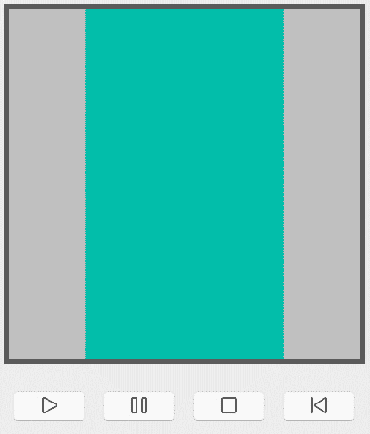

图 5.2 – AnimatedVisualPlayer 控件

## 导航视图

`NavigationView` 提供了一个用户友好的页面导航系统。使用它为用户提供快速访问所有应用程序的最高级页面。`NavigationView` 可以配置为在应用程序顶部显示为一个菜单，每个页面的链接在页面顶部显示为一个标签：

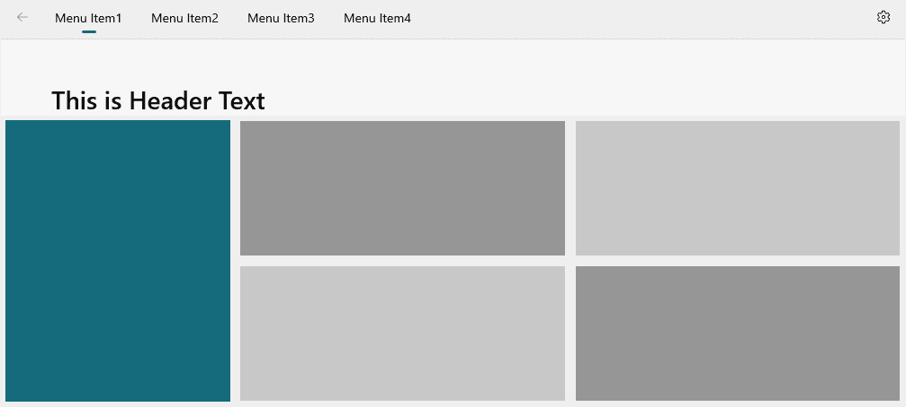

图 5.3 – 在页面顶部配置的 NavigationView

`NavigationView` 还可以配置为出现在页面左侧。这是一个对 Windows 和 Android 用户来说应该很熟悉的视图。这种菜单格式通常被称为 **汉堡菜单**。这是菜单折叠状态下的视图外观：

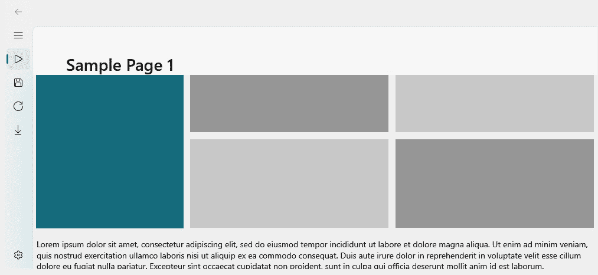

图 5.4 – 折叠的左侧 NavigationView 控件

在任何配置中，`NavigationView` 都可以隐藏或显示一个返回箭头以导航到上一页，并有一个 **设置** 菜单项以显示应用程序的设置页面。如果您的应用程序没有设置页面，则应隐藏此项目。当通过点击返回箭头下方的 *汉堡* 图标展开左侧菜单时，将显示菜单文本以及相应的图标：

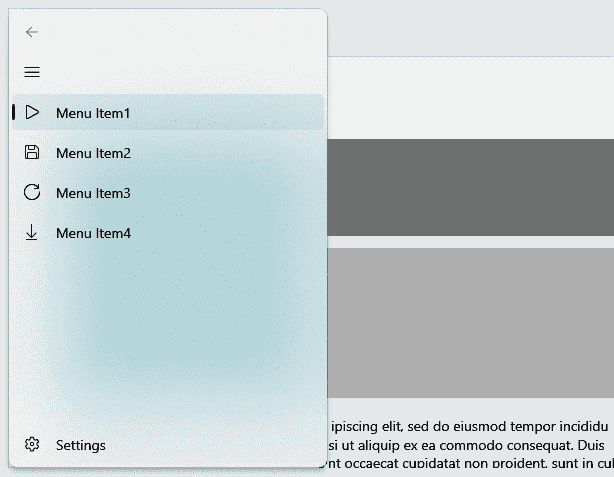

图 5.5 – 展开的左侧 NavigationView 控件

菜单上的所有内容都是可配置的。您可以使用 `NavigationView` 对页面进行分组。

## 垂直视差视图

`ParallaxView` 控件将这一概念引入您的 WinUI 应用程序。您可以将 `ParallaxView` 与 `ListView` 和背景图像链接，当 `ListView` 滚动时，它将提供垂直视差效果。有设置可以控制列表滚动与图像滚动量之间的关系。当不过度使用时，这种效果对用户有很大的影响：

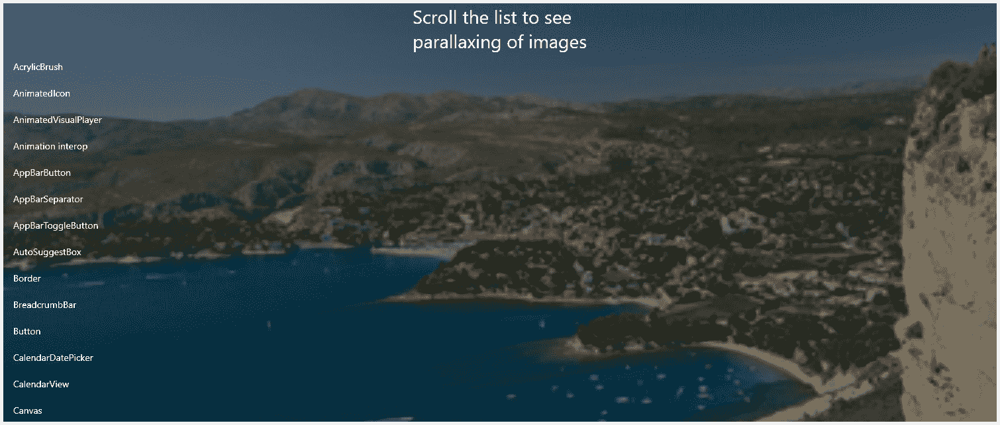

图 5.6 – ParallaxView 控件滚动到列表顶部


图 5.7 – ParallaxView 控件部分滚动通过列表

## 评分控件

每个人都熟悉评分控件。您在购物网站、流媒体应用程序和在线调查中都能看到它们。WinUI 的 `RatingControl` 控件允许用户从 1 到 5 星对应用程序中的项目进行评分：

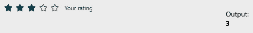

图 5.8 – RatingControl 显示用户的评分

该控件还可以允许您通过在控件上向左滑动来清除评分，并在用户提供自己的评分之前显示一个占位符值。应用程序通常将占位符值用作向用户显示其他用户给出的平均评分的手段。

现在我们已经讨论了一些新增的 WinUI 控件，让我们探索一个 Windows 应用程序，它使您能够自行轻松探索它们。

# 探索 Windows 的 WinUI 3 画廊应用程序

由于有如此多的强大且可配置的 WinUI 控件可用，微软的 WinUI 团队决定创建一个应用程序，允许 Windows 开发者探索甚至尝试这些控件。**WinUI 3 画廊** 是一个了解控件、决定哪些控件适合您的应用程序以及获取一些示例代码和设计指导的绝佳工具。

注意

对于 UWP 开发者，还有一个 **WinUI 2 画廊** 应用程序。这两个应用程序过去是单个应用程序，称为 **XAML 控件画廊**。

要安装 WinUI 3 画廊应用程序，您可以访问其 Microsoft Store 网页（[`apps.microsoft.com/store/detail/winui-3-gallery/9P3JFPWWDZRC`](https://apps.microsoft.com/store/detail/winui-3-gallery/9P3JFPWWDZRC)）或启动 Windows 的 Microsoft Store 应用程序并搜索 `WinUI 3 画廊`。画廊应用程序本身是开源的。您可以在 GitHub 上浏览代码以了解更多信息：[`github.com/microsoft/WinUI-Gallery`](https://github.com/microsoft/WinUI-Gallery)。

安装完成后，启动应用程序：

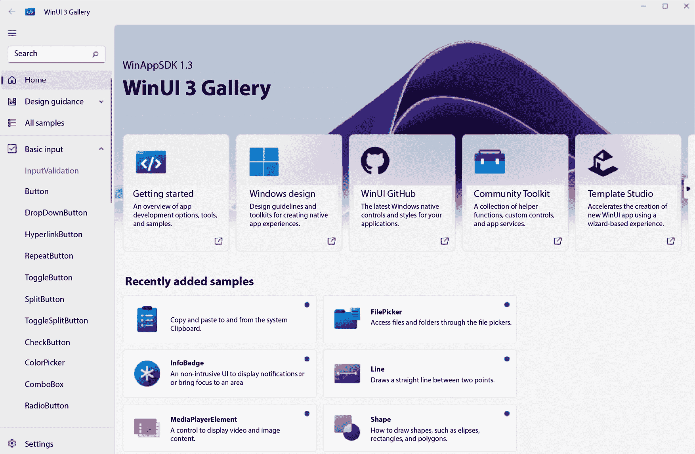

图 5.9 – WinUI 3 画廊应用程序

在 `NavigationView` 控件中，左侧菜单允许快速浏览或搜索画廊中的各种控件。

注意

如果您搜索上一节中显示的控件，您可能会注意到本章中提供的控件截图是从 WinUI 3 画廊应用程序中获取的。

## 了解 ScrollViewer 控件

假设您正在考虑向应用程序中的页面区域添加滚动功能。在画廊应用程序中，您可以点击 `ScrollViewer` 控件：

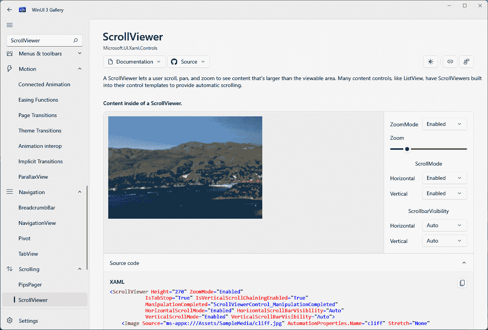

图 5.10 – XAML 控件画廊中的 ScrollViewer 控件详细页面

控件详细信息页面包括几个部分。标题区域提供了对控件及其用途的简要描述。右侧面板提供了有用的链接，指向在线文档、图库中的其他相关控件，以及一个链接，用于对当前图库页面提供反馈。

页面的中间区域本身包含三个部分：一个渲染控件、一个功能控件和一个属性面板。使用属性面板，你可以更新 `ScrollViewer` 的一些属性，并立即看到渲染控件更新。在底部中心，你会找到一个包含渲染控件源代码的面板。源代码面板对于将代码复制到用作你自己的项目起点非常方便。

图库应用程序的设计也很好地响应了调整大小。如果你将窗口的右侧拖动到尽可能窄，你会看到左侧和右侧的面板折叠，中心区域将重新对齐为一个单独的垂直列：

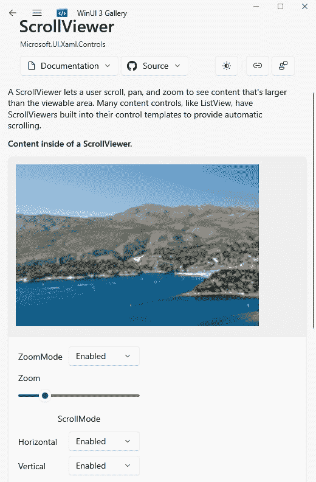

图 5.11 – 图库应用程序水平调整大小

你可以想象这种视图非常适合在 **Microsoft Surface Go 笔记本电脑** 或其他小型 PC 上使用。

花些时间探索图库中的控件。一些代码示例可能相当长。尝试更改一些控件属性，并注意 XAML 代码如何更新以反映新的属性值。这是一种学习 XAML 并熟悉 WinUI 控件的好方法。

现在，让我们来浏览一下 WinUI 3 的新特性。

# 查看 WinUI 3 和 Windows App SDK 的新增功能

虽然 WinUI 3 是一个主要版本，但与 WinUI 2.x 相比，新增功能并不多。这可能会让许多人感到惊讶，但仅仅创建 WinUI 3 和 Windows App SDK 作为独立发布就已经是一项相当大的任务。我们将在以下小节中查看最显著的功能。

## 向后兼容性

为了使 WinUI 应用程序与更多版本的 Windows 兼容（它支持 Windows 10 版本 1809 及以后的版本），WinUI 团队不得不从 Windows SDK 中提取 UWP 控件，并将它们移动到 Windows App SDK 中的新 `Microsoft.UI.*` 库。这项工作的成果不仅为更多版本的 Windows 提供了兼容性，还使开发者无论使用 .NET 还是 Win32 作为底层平台，都可以消费 WinUI。C# 开发者可以使用 WinUI 为桌面项目构建 .NET 应用程序，而 C++ 开发者可以在 Win32 平台上消费 WinUI。

## 流畅的用户界面和现代的外观

维护 **Windows Presentation Foundation** (**WPF**), WinForms 和 **Microsoft Foundation Class** (**MFC**) 应用程序的开发者不容易像在 WinUI 中那样使用 **Fluent UI** 来实现现代的 Windows 风格。我们将在 *第七章* 中深入探讨 Fluent UI，*Windows 应用程序* 的 *流畅设计系统*。

## Visual Studio 工具

Visual Studio 现在可以添加 WinUI 项目模板，而无需从 Visual Studio Marketplace 安装单独的扩展。正如在开篇章节中讨论的，WinUI 支持可以与 Visual Studio 的 **.NET 桌面开发** 工作负载一起添加。在 Visual Studio 中以 WinUI 开始新项目实际上就像去 **文件** | **新建项目** 一样简单。

## WebView2 控件

WinUI 3 中开发者可用的新控件是 `WebView2`。这个 `WebView` 的新版本是基于基于 Chromium 的 Microsoft Edge 网络浏览器构建的。如果你需要将一些网络内容嵌入到你的应用中，`WebView2` 是你应该使用的控件，以确保与现代网络标准的最大兼容性。

这里是 **WebView2** 在 **WinUI 3** **图库** 应用中运行的截图：

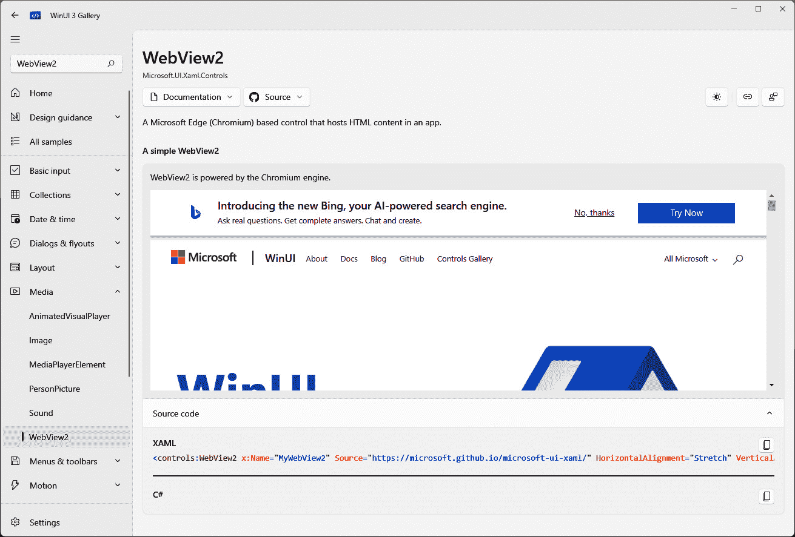

图 5.12 – WebView2 在 WinUI 3 图库应用中运行

网络内容可以从网络或本地网络、本地存储中的文件或嵌入到应用程序的二进制文件中的文件加载到控件中。以下是从每种类型源加载到 `WebView2` 的示例：

```cs
<!-- Load a website. -->
<WebView2 x:Name="WebView_Web"
  Source="https://www.packtpub.com"/>
<!— Load web files from local storage. -->
<WebView2 x:Name="WebView_Local" Source="ms-appdata:
  ///local/site/index.html"/>
<!— Load web files embedded from the app package. -->
<WebView2 x:Name="WebView_Embedded" Source="ms-appx-
  web:///web/index.html"/>
```

如果你有一个为网络编写的现有应用程序，那么 `WebView2` 控件是将其集成到你的新 WinUI 客户端应用程序中的绝佳方式。

让我们暂时转换一下话题，讨论一些 Windows App SDK 中 WinUI 3 控件之外的功能。

## Windows App SDK 中的新功能

到现在为止，你应该知道 WinUI 3 是 Windows App SDK 的一部分。Windows App SDK 有自己的版本，而 WinUI 3 将始终被称为 WinUI 3。在撰写本文时，Windows App SDK 的最新稳定版本是 1.4。在本节中，我们将回顾一些 Windows App SDK 的功能，这些功能位于 WinUI 控件之外。要查看当前 Windows App SDK 功能的完整列表，你可以查看 *Microsoft* *Learn* 上的此页面：[`learn.microsoft.com/windows/apps/windows-app-sdk/#windows-app-sdk-features`](https://learn.microsoft.com/windows/apps/windows-app-sdk/#windows-app-sdk-features)。

### 电源管理

你的应用可以作为 Windows App SDK 应用生命周期 API 的一部分订阅并响应电源管理事件。SDK 中 `PowerManager` 类公开的一些事件包括以下内容：

+   `BatteryStatusChanged`：当系统电池状态发生变化时触发。使用 `BatteryStatus` 属性来获取当前状态。

+   `DisplayStatusChanged`：当运行应用程序的显示状态发生变化时触发。使用`DisplayStatus`属性来获取当前状态。

+   `EffectivePowerModeChanged`：当系统的有效电源模式发生变化时触发。这些也可以被称为电源计划，例如省电模式和性能模式。使用`EffectivePowerMode`属性来获取当前模式。

+   `SystemSuspendStatusChanged`：当系统挂起或恢复时触发。在 UWP 中，这些类型的事件是`App`类内置生命周期的一部分。使用`SystemSuspendStatus`属性来获取当前状态。

+   `UserPresenceStatusChanged`：当系统检测到用户状态变化时触发。使用`UserPresenceStatus`属性来获取当前状态。

可以在 *Microsoft* *Learn* 上查看`PowerManager`事件的完整列表和属性：[`learn.microsoft.com/windows/windows-app-sdk/api/winrt/microsoft.windows.system.power.powermanager`](https://learn.microsoft.com/windows/windows-app-sdk/api/winrt/microsoft.windows.system.power.powermanager)。

对这些事件变化的响应可以帮助你的应用程序在何时以及如何执行资源密集型操作方面变得更加智能。你可能有一些后台处理，这些处理只有在系统连接电源或电池容量高于一定百分比时才应该执行。你也可以选择在用户屏幕变暗或关闭时暂停屏幕动画或仪表板更新，以节省电力。

接下来，让我们讨论 Windows App SDK 中的窗口功能。

### 窗口管理

Windows App SDK 提供了一些有限的窗口管理功能，可以通过使用`AppWindow`类来利用。通过使用一些互操作 API，你的应用程序可以获取当前窗口的`HWND`和`WindowId`值。在 Win32 开发中，可以使用`WindowId`来获取当前`AppWindow`对象的引用：

```cs
var appWindow = Microsoft.UI.Windowing.AppWindow
  .GetFromWindowId(windowId)
```

`AppWindow`上的大多数属性都是只读的。你可以获取有关其大小、位置、可见性和其所有者的`WindowId`值等信息。`AppWindow`的一个可写属性是`Title`。设置`Title`允许你更改当前窗口标题栏中的文本。

### 推送通知和应用程序通知

**推送通知**可以用来在不通知用户的情况下与应用程序交互，或者在 Windows 中显示一个托盘通知。后者被认为是**应用程序通知**，并且对用户来说最为熟悉。在应用程序内部触发的其他原始通知用于唤醒应用程序从非活动状态或用于数据同步等目的。

Windows App SDK 支持两种类型的通知。这些 API 位于 `Microsoft.Windows.PushNotifications` 和 `Microsoft.Windows.AppNotifications` 命名空间中。探索通知超出了本章的范围，但您可以从 *Push notifications overview* 页面上的快速入门部分在 *Microsoft Learn* 上进行探索：[`learn.microsoft.com/windows/apps/windows-app-sdk/notifications/push-notifications/`](https://learn.microsoft.com/windows/apps/windows-app-sdk/notifications/push-notifications/). 我们将在 *第八章* 中向我们的项目添加通知，*向 WinUI 应用程序添加 Windows 通知*。

现在我们已经了解了 WinUI 和 Windows App SDK 的一些新功能，让我们回到我们的项目，并添加几个新的控件。

# 向项目中添加一些新控件

在本节中，我们将使用仅适用于具有 WinUI 的 Windows 应用程序的两个控件。我们将更改 `SplitButton` 以允许用户保存并返回到项目列表，或保存并继续在项目详情页上添加另一个项目。然后，我们将添加一个 `TeachingTip` 控件来通知用户新的保存功能。要跟随这些步骤，您可以使用 GitHub 上的起始项目（[`github.com/PacktPublishing/Learn-WinUI-3-Second-Edition/tree/master/Chapter05/Start`](https://github.com/PacktPublishing/Learn-WinUI-3-Second-Edition/tree/master/Chapter05/Start)）。让我们先更新 **Save** 按钮。

## 使用 SplitButton 控件

按照以下步骤操作：

1.  首先，在 `ItemDetailsViewModel` 中添加一个新的 `SaveItemAndContinue` 方法，并将其绑定到我们新的 `SplitButton` 控件的 `Click` 事件：

    ```cs
    public void SaveItemAndContinue()
    {
        Save();
        _itemId = 0;
        ItemName = string.Empty;
        SelectedMedium = null;
        SelectedLocation = null;
        SelectedItemType = null;
        IsDirty = false;
    }
    ```

    在 `SaveItemAndContinue` 方法中，我们调用 `Save` 并重置所有项目状态数据，以便为新项目输入做好准备。这里的一个问题是 `Save` 当前会导航回上一页。让我们修复这个问题。

1.  要从 `Save` 中移除返回上一页的调用，我们需要为 `SaveItemAndReturn` 创建一个新的方法：

    ```cs
    public void SaveItemAndReturn()
    {
        Save();
        _navigationService.GoBack();
    }
    ```

    在这里，我们调用 `Save` 并然后导航回上一页。现在可以从 `Save` 中移除对 `_navigationService.GoBack` 的调用。

1.  我们目前正在使用 `x:Bind` 直接绑定到保存方法，而不是使用 `ICommand`。因此，您可以从 `Save` 中移除 `RelayCommand` 属性，并从 `ItemDetailsViewModel` 中移除 `CanSaveItem` 方法。您还需要从 `isDirty` 私有成员中移除 `NotifyCanExecuteChangedFor` 属性。

1.  最后，打开 `ItemDetailsPage` 并更新 `SplitButton` 控件：

    ```cs
    <SplitButton x:Name="SaveButton"
                 Content="Save and Return"
                 Margin="8,8,0,8"
                 Click="{x:Bind ViewModel
                   .SaveItemAndReturn}"
                 IsEnabled="{x:Bind ViewModel.IsDirty,
                   Mode=OneWay}">
        <SplitButton.Flyout>
            <Flyout>
              <StackPanel>
                <Button Content="Save and Create New"
                        Click="{x:Bind ViewModel
                          .SaveItemAndContinue}"
                        IsEnabled="{x:Bind
                          ViewModel.IsDirty,
                             Model=OneWay}"
                        Background="Transparent"/>
                <Button Content="Save and Return"
                        Click="{x:Bind ViewModel
                          .SaveItemAndReturn}"
                        IsEnabled="{x:Bind
                          ViewModel.IsDirty, Mode=OneWay}"
                        Background="Transparent"/>
              </StackPanel>
            </Flyout>
        </SplitButton.Flyout>
    </SplitButton>
    ```

    `SplitButton` 的内容已更新为 `Save and Return`。我们还更新了绑定，使用 `Click` 事件来调用操作，以及使用 `IsDirty` 的 `IsEnabled` 属性。还添加了一个新的子 `Flyout` 项目。`Flyout` 包含一个 `StackPanel` 控件，其中包含用于调用 `SaveItemAndContinue` 的 `Click` 事件的 `Button` 控件。

1.  就这些！现在，运行应用程序并尝试这个新功能。当你点击下拉箭头时，新按钮看起来是这样的：

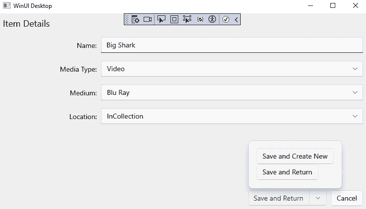

图 5.13 – 使用新的 SplitButton 控件保存项目

## 将 TeachingTip 控件添加到保存按钮

`TeachingTip` 控件是教育用户了解应用程序中功能的一种很好的方式。它是一个带有标题文本和内容文本的小弹出窗口。你可能在使用的某些 Windows 应用程序中见过它们。

`TeachingTip` 可以链接到页面上的控件，或者它可以直接放置在页面上，并使用可选的 `PreferredPlacement` 属性来控制它在页面上的位置。它可以配置为用户通过 **关闭** 按钮或当用户开始与页面交互时自动关闭。

要为我们的 `SplitButton` 控件添加 `TeachingTip` 控件，将其添加到 `ItemDetailsPage` 中的 `Resources` 控件，如下所示：

```cs
<SplitButton x:Name="SaveButton" Content="Save and Return"
 Margin="8,8,0,8" Command="{x:Bind ViewModel.SaveCommand}">
    <SplitButton.Flyout>
        <Flyout>
            <Button Content="Save and Create New"
            Command="{x:Bind ViewModel
               .SaveAndContinueCommand}"
                   Background="Transparent"/>
        </Flyout>
    </SplitButton.Flyout>
    <SplitButton.Resources>
        <TeachingTip x:Name="SavingTip"
                        Target="{x:Bind SaveButton}"
                        Title="Save and create new"
Subtitle="Use the dropdown button
                        option to save your item and create
                        another.">
        </TeachingTip>
    </SplitButton.Resources>
</SplitButton>
```

在 `TeachingTip` 控件内部，我们将 `Target` 绑定到 `SaveButton`，并将 `Title` 和 `Subtitle` 设置为教育用户关于新的 **保存并创建** **新** 功能。

在 `ItemDetailsPage` 构造函数中需要额外的调用才能使提示出现：

```cs
SavingTip.IsOpen = true;
```

如果你现在运行应用程序，`TeachingTip` 将会在用户每次打开 `ItemDetailsPage` 时出现。这可能会迅速让我们的用户感到厌烦。我们可以在 `ItemDetailsPage.xaml.cs` 中添加一些代码，以保存一个用户级设置，表示当前用户已经看到了这个 `TeachingTip` 控件。然后，下次我们加载页面时，我们会检查这个设置，以便应用程序可以跳过显示提示的代码。

我们将利用 Windows 本地存储来保存和加载用户设置：

```cs
Windows.Storage.ApplicationDataContainer localSettings =
  Windows.Storage.ApplicationData.Current.LocalSettings;
// Load the user setting
string haveExplainedSaveSetting = localSettings.Values
  [nameof(SavingTip)] as string;
// If the user has not seen the save tip, display it
if (!bool.TryParse(haveExplainedSaveSetting, out bool
  result) || !result)
{
    SavingTip.IsOpen = true;
    // Save the teaching tip setting
    localSettings.Values[nameof(SavingTip)] = "true";
}
```

现在，用户在第一次加载 `ItemDetailsPage` 时才会看到这个提示。

让我们看看我们的 `TeachingTip` 控件的实际应用。运行应用程序，选择一个项目，并点击 `ItemDetailsPage`：

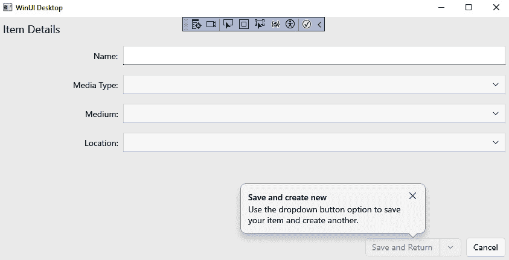

图 5.14 – 使用新的 TeachingTip 控件

现在，应用程序有一个新功能，以及一种很好的方式来告知用户如何使用它。让我们总结一下，并讨论在本章中学到的东西。

# 摘要

在本章中，我们探讨了 WinUI 3 中可用的许多控件。我们了解到，**WinUI 3 Gallery** 应用程序是探索 WinUI 开发者可用控件的一个很好的工具。我们还探讨了 Windows App SDK 中的一些不属于 WinUI 的功能。最后，我们在我们的应用程序中添加了一些新的 WinUI 控件。

在下一章中，我们将学习更多关于服务的内容，并将开始在会话之间持久化我们的媒体项目数据。

# 问题

1.  哪个 WinUI 控件可以显示 Lottie 动画？

1.  哪个 WinUI 控件可以使用基于 Chromium 的 Microsoft Edge 浏览器显示 HTML 内容？

1.  你可以使用 C++ 创建 WinUI 3 应用程序吗？

1.  你会用哪个控件来教育用户关于新功能的信息？

1.  你可以从 Microsoft Store 下载哪个应用来了解所有 WinUI 控件？

1.  哪种控件可以用来在会话之间保存和加载用户设置？

1.  你会用哪个 Windows App SDK 功能来通知用户你的应用有新消息可以查看？
