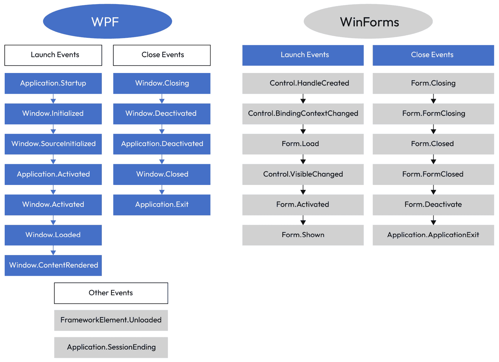
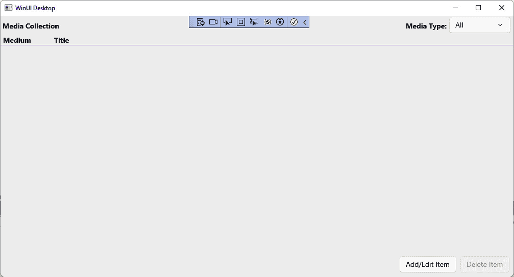
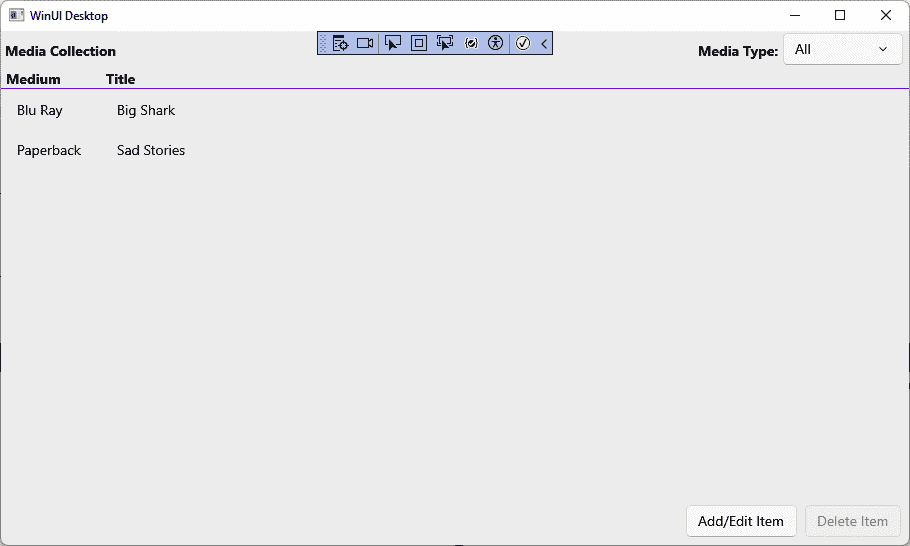

# 6

# 利用数据和服务的优势

管理数据是大多数应用程序操作的核心。学习如何加载、维护和保存这些数据是 WinUI 开发的一个重要方面。数据管理的两个最重要的方面是 **状态管理** 和 **服务定位器模式**。我们将介绍这些概念，并在我们的应用程序中应用其中的一些。

本章我们将涵盖以下主题：

+   理解 WinUI 应用程序生命周期

+   学习使用 **SQLite** 存储应用程序数据

+   学习使用 **对象关系映射器**（**ORM**）**Dapper** 快速映射数据服务中的对象

+   继续探索服务定位器模式，并使用我们的数据服务实现它

到本章结束时，你将具备对 WinUI 应用程序生命周期的实际理解，并知道如何在项目中管理数据和状态。

# 技术要求

要跟随本章中的示例，需要以下软件：

+   Windows 10 版本 1803（版本 17134）或更高版本

+   Visual Studio 2022 或更高版本，已配置 .NET 桌面开发工作负载以进行 Windows App SDK 开发

本章的源代码可在 GitHub 上找到，网址为 [`github.com/PacktPublishing/Learn-WinUI-3-Second-Edition/tree/master/Chapter06`](https://github.com/PacktPublishing/Learn-WinUI-3-Second-Edition/tree/master/Chapter06)。

# 使用应用程序生命周期事件管理应用程序状态

在任何应用程序中处理数据之前，了解目标应用程序平台的应用程序生命周期非常重要。我们简要地提到了这些概念，但现在，是时候更深入地了解桌面应用程序的 WinUI 应用程序生命周期了。

## 探索 Windows 应用程序生命周期事件

与其他桌面 .NET 应用程序相比，桌面应用程序的 WinUI 具有一套不同的生命周期事件。WPF 和 **Windows 表单**（**WinForms**）应用程序要么正在运行，要么没有运行。在启动和关闭 WPF 和 WinForms 应用程序时，会发生几个事件：



图 6.1 – WPF 和 WinForms 应用程序生命周期事件

注意

我们不会在这里详细介绍，因为我们的主要重点是构建 WinUI 3 应用程序。然而，对于在启动和关闭之外的两个 WPF 事件，它们的顺序如下：

1\. `FrameworkElement.Unloaded`: 当一个元素从 WPF 可视树中移除时，此事件被触发。它不会在应用程序关闭时触发。

2\. `Application.SessionEnding`: 当当前 Windows 用户注销或关闭 Windows 时，此事件被触发。在事件处理程序中，你可以通过将 `SessionEndingCancelEventArgs.Cancel` 属性设置为 `true` 来请求 Windows 取消进程。

## WinUI 应用程序的生命周期事件

让我们谈谈 WinUI 的生命周期。生命周期事件在应用程序开始执行时为你提供了初始化任何数据和状态的机会，这允许你在应用程序关闭时清理或保存状态。在 UWP 应用程序中，你也有能力处理由于用户或操作系统操作而使应用程序挂起或恢复时的事件。WinUI，就像其他 .NET 桌面应用程序一样，没有这个能力。

在 `Application` 和 `Window` 类中，只有几个事件可以被处理。每个 `Application` 类都重写了 `OnLaunched` 方法。这个方法将在应用程序被用户或操作系统启动时恰好被调用一次。我们已经在我们的示例应用程序中使用了 `OnLaunched` 方法。这是创建 `MainWindow` 的地方，也是我们添加调用方法来配置我们的 IOC 容器的地方。在一个新的 WinUI 应用程序中，`OnLaunched` 方法看起来是这样的：

```cs
protected override void OnLaunched(Microsoft.UI.Xaml.LaunchActivatedEventArgs args)
{
    m_window = new MainWindow();
    m_window.Activate();
}
```

`Application` 和 `Window` 类只继承自 .NET 的 `Object` 类，因此没有可利用的继承事件。但 `Page` 类的情况并非如此，我们将在稍后讨论。首先，我们将讨论 `Window`，它有几个我们可以在管理应用程序生命周期时利用的事件。

WinUI 中的 `Window` 类没有 `Loaded` 事件，这个事件在 WPF 的 `Window` 类中用来指示窗口及其内容已加载并可供交互。可以使用 `Window.Activated` 事件来代替 `Loaded` 事件，但 `Activated` 事件会在窗口每次获得焦点时触发。如果这是你的唯一选择，你将需要添加一个标志来检查 `Activated` 是否是第一次触发。

`Window` 中的另一个生命周期事件是 `Closed` 事件，当窗口关闭时触发。如果是最后一个剩余的窗口，通常是 `MainWindow`，则在窗口关闭后应用程序将结束。这是你应该保存任何应用程序数据和状态信息的地方。

这就是 `Application` 和 `Window` 类提供的应用程序生命周期事件的全部内容。然而，你可以利用由 `FrameworkElement` 提供的一些其他事件，它是 `Page` 和 WinUI 中所有其他控件的基础类。

## FrameworkElement 对象的附加生命周期事件

WinUI 中的每个控件都继承自 `Control`，而 `Control` 继承自 `FrameworkElement`。即使是添加到 `Control` 中的 `Page` 控件，也是通过从 `UserControl` 继承而来的。

`FrameworkElement` 类提供了三个有用的事件，开发者可以利用这些事件来处理应用程序生命周期：

+   `Loading`：当加载过程开始时，将发生此事件。可以利用此事件开始从服务或其他来源获取和处理数据。你也可以在当前 `Window` 或 `Page` 的构造函数中，甚至在 `Application.OnLoaded` 中更早地开始加载数据。

+   `Loaded`：当当前元素及其所有子元素加载并准备好交互时，将调用 `Loaded` 事件。在它们加载之前不要尝试操作这些元素，否则应用将引发运行时异常。

+   `Unloaded`：当当前元素被卸载并从 `Page` 中移除时，将触发此事件。你可以使用此事件来清理资源或保存页面的任何状态。

注意

到目前为止，我们还没有讨论 WinUI 的视觉树。WinUI 中的树的概念（物理和逻辑）与其他 XAML 框架中的相同。当我们在 *第十一章* 中讨论使用 Visual Studio 调试 WinUI 应用程序时，我们将更详细地讨论物理树和逻辑树。要了解更多信息，请参阅 Microsoft Learn 上的关于树的优秀 WPF 文章：[`learn.microsoft.com/dotnet/desktop/wpf/advanced/trees-in-wpf`](https://learn.microsoft.com/dotnet/desktop/wpf/advanced/trees-in-wpf)。

你可以处理当前视图中任何控件的 `Loaded` 事件，无论是 `Window` 还是 `Page`，但始终要考虑性能。视觉树中最顶层的 `FrameworkElement` 的 `Loaded` 事件将在其所有子元素的 `Loaded` 事件完成之后才会触发。网络和文件系统操作可能很昂贵，因此尽可能最小化和合并加载以呈现视图所需数据的调用。

注意

要了解更多关于处理生命周期事件的信息，请阅读以下 Microsoft Learn 页面：[`learn.microsoft.com/windows/apps/windows-app-sdk/applifecycle/applifecycle`](https://learn.microsoft.com/windows/apps/windows-app-sdk/applifecycle/applifecycle)。

现在你已经对 WinUI 的生命周期有了坚实的理解，让我们开始处理一些需要在用户会话之间持久化的真实数据。

# 创建 SQLite 数据存储

到目前为止，**我的媒体收藏**项目只与存储在内存集合中的数据进行交互。这意味着每次应用程序关闭时，所有用户数据都会丢失。这也意味着每次应用程序启动时，都需要调用一个方法来用硬编码的种子数据填充所有列表。

在上一章中，我们为应用程序创建了一个可维护的数据服务的第一步。通过创建一个实现 `IDataService` 的数据服务类，当我们开始从数据库加载数据时，不需要在 `ViewModel` 类中进行任何更改。本节将重点创建一个新的 `SqliteDataService` 类，以便我们可以使用 **SQLite** 进行数据访问。本章的起始代码可以在 GitHub 上找到，链接为 [`github.com/PacktPublishing/Learn-WinUI-3-Second-Edition/tree/master/Chapter06/Start`](https://github.com/PacktPublishing/Learn-WinUI-3-Second-Edition/tree/master/Chapter06/Start)。

## 什么是 SQLite？

**SQLite**（位于[`sqlite.org/`](https://sqlite.org/)）是一个基于 SQL 的数据库，常被移动应用和简单的桌面应用程序使用。它是一个受欢迎的选择，因为它体积小、速度快，并且包含在一个单独的文件中。几乎每个平台都有 SQLite 库可用。我们将使用 Microsoft 的**Microsoft.Data.Sqlite** ADO.NET 提供程序来处理 SQLite。

注意

关于 Microsoft 的 SQLite 提供程序的更多信息，您可以阅读[`learn.microsoft.com/dotnet/standard/data/sqlite/`](https://learn.microsoft.com/dotnet/standard/data/sqlite/)。要了解更多关于在 WinUI 项目中使用 SQLite 的信息，请查看这篇 Microsoft Learn 文章：[`learn.microsoft.com/windows/apps/develop/data-access/sqlite-data-access`](https://learn.microsoft.com/windows/apps/develop/data-access/sqlite-data-access)。

## 添加 SQLite 作为数据服务

按照以下步骤操作：

1.  首先通过从**视图** | **其他窗口** | **包管理控制台**打开**包管理控制台**，然后运行以下命令，将**Microsoft.Data.Sqlite** NuGet 包添加到**MyMediaCollection**项目中。在运行此命令之前，请确保在**包管理控制台**窗口的项目下拉菜单中选择了**MyMediaCollection**项目：

    ```cs
    Install-Package Microsoft.Data.Sqlite
    ```

    运行此命令相当于从`DataService`类中的`SqliteDataService`查找并添加包作为起点。

1.  现在，将`using`语句添加到文件顶部：

    ```cs
    using Microsoft.Data.Sqlite;
    using System.IO;
    using System.Threading.Tasks;
    using Windows.Storage;
    ```

    当我们初始化 SQLite 数据库文件时，将使用`System.IO`和`Windows.Storage`命名空间，并且我们需要导入`System.Threading.Tasks`命名空间以处理一些`async`任务。

1.  接下来，向类中添加一个新的常量来保存数据库的文件名：

    ```cs
    private const string DbName = "mediaCollectionData.db";
    ```

1.  现在，让我们创建一个私有方法来创建或打开数据库文件，为数据库创建一个`SqliteConnection`类，打开它，并将其返回给调用者。此方法可以在整个类中用于需要新数据库连接的任何时候。数据库文件将创建在用户的`LocalFolder`中，这意味着应用程序的数据将与用户的本地 Windows 配置文件数据一起保存：

    ```cs
    private async Task<SqliteConnection> GetOpenConnectionAsync()
    {
        await ApplicationData.Current.LocalFolder.CreateFileAsync(DbName, CreationCollisionOption.OpenIfExists).AsTask().ConfigureAwait(false);
        string dbPath = Path.Combine(ApplicationData.Current.LocalFolder.Path, DbName);
        var cn = new SqliteConnection($"Filename={dbPath}");
        cn.Open();
        return cn;
    }
    ```

    注意，我们已经将此方法声明为`async`，并且在打开或创建文件时使用`await`关键字。当使用外部资源，如文件、网络连接或数据库时，使用 async/await 是一种良好的实践，以保持应用程序的响应性。

注意

要了解更多关于 C#和.NET 中的 async/await 的信息，Microsoft Learn 有一篇很好的文章可以帮助您入门：[`learn.microsoft.com/dotnet/csharp/asynchronous-programming/`](https://learn.microsoft.com/dotnet/csharp/asynchronous-programming/)。

1.  接下来，创建两个方法来在数据库中创建`MediaItems`和`Mediums`表。这些方法将在每次应用程序启动时被调用，但 SQL 代码只会在表不存在时创建表。`SqliteCommand`对象接受`tableCommand`查询字符串和`SqliteConnection`。它有几个方法可以用来执行命令，具体取决于查询是否预期返回任何数据。在我们的情况下，不期望返回任何值，所以`ExecuteNonQueryAsync`是这两个方法的最佳异步选项：

    ```cs
    private async Task CreateMediumTableAsync(SqliteConnection db)
    {
        string tableCommand = @"CREATE TABLE IF NOT
            EXISTS Mediums (Id INTEGER PRIMARY KEY AUTOINCREMENT NOT NULL,
            Name NVARCHAR(30) NOT NULL,
            MediumType INTEGER NOT NULL)";
        using var createTable = new SqliteCommand(tableCommand, db);
        await createTable.ExecuteNonQueryAsync();
    }
    private async Task CreateMediaItemTableAsync(SqliteConnection db)
    {
        string tableCommand = @"CREATE TABLE IF NOT
            EXISTS MediaItems (Id INTEGER PRIMARY KEY AUTOINCREMENT,
            Name NVARCHAR(1000) NOT NULL,
            ItemType INTEGER NOT NULL,
            MediumId INTEGER NOT NULL,
            LocationType INTEGER,
            CONSTRAINT fk_mediums
            FOREIGN KEY(MediumId)
            REFERENCES Mediums(Id))";
        using var createTable = new SqliteCommand(tableCommand, db);
        await createTable.ExecuteNonQueryAsync();
    }
    ```

1.  现在，为`Mediums`表创建一个方法来插入一行到表中：

    ```cs
    private async Task InsertMediumAsync(SqliteConnection db, Medium medium)
    {
        using var insertCommand = new SqliteCommand
        {
            Connection = db,
            CommandText = "INSERT INTO Mediums VALUES (NULL, @Name, @MediumType);"
        };
        insertCommand.Parameters.AddWithValue("@Name", medium.Name);
        insertCommand.Parameters.AddWithValue("@MediumType", (int)medium.MediaType);
        await insertCommand.ExecuteNonQueryAsync();
    }
    ```

1.  现在，我们需要另一种方法来读取`Mediums`表中的所有行：

    ```cs
    private async Task<IList<Medium>> GetAllMediumsAsync(SqliteConnection db)
    {
        IList<Medium> mediums = new List<Medium>();
        using var selectCommand = new SqliteCommand("SELECT Id, Name, MediumType FROM Mediums", db);
        using SqliteDataReader query = await selectCommand.ExecuteReaderAsync();
        while (query.Read())
        {
            var medium = new Medium
            {
                Id = query.GetInt32(0),
                Name = query.GetString(1),
                MediaType = (ItemType)query.GetInt32(2)
            };
            mediums.Add(medium);
        }
        return mediums;
    }
    ```

这些两个简单的操作需要一些代码。插入方法需要为要保存到表中的每个属性添加参数，而选择方法使用`while`循环将每个表的记录添加到集合中。让我们看看我们是否可以在下一节中简化这一点。

在我们实现剩余的**创建、读取、更新、删除**（**CRUD**）操作的方法之前，必须向项目中添加一个新的库来简化我们将要编写的数据库访问代码。

## 利用微 ORM 简化数据访问

正如你在上一节中看到的，为即使是简单的应用程序编写数据访问代码也可能需要一些时间。

ORM，如**Entity Framework Core**（**EF Core**），可以极大地简化并减少所需的代码，但对于只有几个表的简单应用程序来说可能有些过度。在本章中，我们将探讨**微 ORM**。微 ORM 是轻量级的框架，用于处理对象和数据查询之间的数据映射。

注意

EF Core 是.NET 开发者中流行的 ORM。如果你想了解更多关于如何在项目中使用 EF Core 的信息，你可以观看 Packt 的视频*Entity Framework Core – a Full Tour*，链接为[`www.packtpub.com/product/entity-framework-core-a-full-tour-net-5-and-up-video/9781803242231`](https://www.packtpub.com/product/entity-framework-core-a-full-tour-net-5-and-up-video/9781803242231)。

我们将在项目中用于数据访问的框架，Dapper，是由 Stack Overflow 的开发者创建的开源.NET 微 ORM。你可以在[`dapperlib.github.io/Dapper/`](https://dapperlib.github.io/Dapper/)了解更多关于 Dapper 的信息，并在 NuGet 上获取包：[`www.nuget.org/packages/Dapper`](https://www.nuget.org/packages/Dapper)。

Dapper 在.NET 社区中很受欢迎。虽然它不提供 EF Core 的一些功能，如模型生成或实体变更跟踪，但它确实使得编写快速、精简的数据层变得非常容易。当你将`Dapper.Contrib`库（[`www.nuget.org/packages/Dapper.Contrib`](https://www.nuget.org/packages/Dapper.Contrib)）添加到其中时，编写应用程序所需的 CRUD 方法就更加容易了。

## 将 Dapper 添加到项目中

让我们直接进入正题：

1.  首先，将`Dapper`和`Dapper.Contrib`添加到**MyMediaCollection**项目中。再次打开**包管理器控制台**窗口，并将这两个包添加到项目中：

    ```cs
    Install-Package Dapper
    Install-Package Dapper.Contrib
    ```

1.  现在，重新审视`InsertMediaAsync`方法。如果我们使用 Dapper 提供的`QueryAsync`方法，我们可以将原始方法中的代码减少到如下：

    ```cs
    private async Task InsertMediumAsync(SqliteConnection db, Medium medium)
    {
        var newIds = await db.QueryAsync<long>(
            $@"INSERT INTO Mediums
                ({nameof(medium.Name)}, MediumType)
                VALUES
                (@{nameof(medium.Name)}, @{nameof(medium.MediaType)});
            SELECT last_insert_rowid()", medium);
        medium.Id = (int)newIds.First();
    }
    ```

    我们之前编写的设置查询参数值的代码现在已删除。Dapper 会从传入其`QueryAsync`方法的`medium`对象中为我们映射它们。你必须确保 SQLite 查询中的参数名称与我们的对象上的属性名称匹配，以便 Dapper 的自动映射能够正常工作。

1.  作为额外奖励，我们还可以通过添加以下 SQLite 代码从`QueryAsync`调用中获取生成的 ID，该代码在`INSERT`操作完成后返回它：

    ```cs
    SELECT last_insert_rowid();
    ```

1.  接下来，更新`GetAllMediumsAsync`的代码以使用 Dapper：

    ```cs
    private async Task<IList<Medium>> GetAllMediumsAsync(SqliteConnection db)
    {
        var mediums =
            await db.QueryAsync<Medium>(@"SELECT Id,
                                                 Name,
                                                 MediumType AS MediaType
                                          FROM Mediums");
        return mediums.ToList();
    }
    ```

    我们已经从 14 行代码减少到只有 2 行。注意，在查询的高亮部分，我们如何使用`MediaType`的别名作为`MediumType`字段。这是一个简单地将数据映射到不匹配数据库字段名的对象属性的方法，只需简单地将作为 SQL 选择语句返回的字段重命名即可。Dapper 还帮助我们直接返回我们的`Medium`对象列表，而不是我们不得不使用`while`循环来遍历结果集。

1.  接下来，创建一个查询，以获取所有媒体项以填充主`ListView`控件。这个查询稍微复杂一些，因为我们根据`MediumId`在`MediaItems`和`Mediums`两个表上进行了连接，并将数据返回以映射到两个相应的对象，`item`和`medium`。这些类型由提供给`QueryAsync`方法的前两个泛型类型指示。为了执行此映射，我们给 Dapper 一个 lambda 表达式，指示它将`medium`设置为每个从查询返回的行的`item`的`MediumInfo`属性。返回对象的类型由提供给`QueryAsync`方法的第三个泛型类型定义。其余参数将由 Dapper 根据它们的属性名称自动映射：

    ```cs
    private async Task<List<MediaItem>> GetAllMediaItemsAsync(SqliteConnection db)
    {
        var itemsResult = await db.QueryAsync<MediaItem, Medium, MediaItem>
                (
                    @"SELECT
                        [MediaItems].[Id],
                        [MediaItems].[Name],
                        [MediaItems].[ItemType] AS MediaType,
                        [MediaItems].[LocationType] AS Location,
                        [Mediums].[Id],
                        [Mediums].[Name],
                        [Mediums].[MediumType] AS MediaType
                    FROM
                        [MediaItems]
                    JOIN
                        [Mediums]
                    ON
                        [Mediums].[Id] = [MediaItems].[MediumId]",
                    (item, medium) =>
                    {
                        item.MediumInfo = medium;
                        return item;
                    }
                );
        return itemsResult.ToList();
    }
    ```

1.  接下来，添加创建媒体项的插入和更新方法的代码：

    ```cs
    private async Task<int> InsertMediaItemAsync(SqliteConnection db, MediaItem item)
    {
        var newIds = await db.QueryAsync<long>(
            @"INSERT INTO MediaItems
                (Name, ItemType, MediumId, LocationType)
                VALUES
                (@Name, @MediaType, @MediumId, @Location);
            SELECT last_insert_rowid()", item);
        (int)newIds.First();
    }
    private async Task UpdateMediaItemAsync(SqliteConnection db, MediaItem item)
    {
        await db.QueryAsync(
            @"UPDATE MediaItems
              SET Name = @Name,
                  ItemType = @MediaType,
                  MediumId = @MediumId,
                  LocationType = @Location
              WHERE Id = @Id;", item);
    }
    ```

    `InsertMediaItemAsync`中的代码应该看起来很熟悉。它与我们将数据插入`Mediums`表时所做的操作非常相似。由于 Dapper，更新`MediaItems`表中一行代码现在技术上只有一行。

1.  在我们的模型中，`MediaItem`对象已添加了一个新的只读属性。这个属性允许 Dapper 将`MediumId`映射到`MediaItems`表：

    ```cs
    public int MediumId => MediumInfo.Id;
    ```

1.  现在，将`Computed`属性添加到`MediaItem.MediumInfo`属性。这告诉 Dapper 在我们尝试在数据库中插入或更新行时忽略该属性。我们只需要保存`MediumId`。用户无法更改`Mediums`表中的行：

    ```cs
    [Computed]
    public Medium MediumInfo { get; set; }
    ```

1.  最后，让我们创建一个方法来从 `MediaItems` 表中删除项目。这段代码因 `Dapper.Contrib` 而有所不同。我们不需要在代码中编写任何参数化 SQL，因为 `Dapper.Contrib` 有一个 `DeleteAsync` 方法，可以根据提供的 `MediaItem` 类的 `Id` 属性生成删除 `MediaItems` 的代码：

    ```cs
    private async Task DeleteMediaItemAsync(SqliteConnection db, int id)
    {
        await db.DeleteAsync<MediaItem>(new MediaItem { Id = id });
    }
    ```

    要使这生效，您必须使用 `Key` 属性装饰模型类的主键属性：

    ```cs
    public class MediaItem
    {
        [Key]
        public int Id { get; set; }
        ...
    }
    ```

确保使用 `Dapper.Contrib` 属性的每个模型类都添加一个 `using` 语句为 `Dapper.Contrib.Extensions`。

在我们将 `SqliteDataService` 类的所有公共 CRUD 方法更新为调用这些私有方法之前，我们将完成在应用程序启动时初始化服务的代码。

## 更新数据服务的初始化

让我们开始吧：

1.  首先，在 `SqliteDataService` 中创建 `DataService.PopulateMediums` 方法的版本，将其改为 `async` 并重命名为 `PopulateMediumsAsync`。更新此方法以便从 SQLite 获取数据。如果这是应用程序首次为当前用户启动，该方法还将创建所需的数据：

    ```cs
    private async Task PopulateMediumsAsync(SqliteConnection db)
    {
        _mediums = await GetAllMediumsAsync(db);
        if (_mediums.Count == 0)
        {
            var cd = new Medium { Id = 1, MediaType = ItemType.Music, Name = "CD" };
            var vinyl = new Medium { Id = 2, MediaType = ItemType.Music, Name = "Vinyl" };
            var hardcover = new Medium { Id = 3, MediaType = ItemType.Book, Name = "Hardcover" };
            var paperback = new Medium { Id = 4, MediaType = ItemType.Book, Name = "Paperback" };
            var dvd = new Medium { Id = 5, MediaType = ItemType.Video, Name = "DVD" };
            var bluRay = new Medium { Id = 6, MediaType = ItemType.Video, Name = "Blu Ray" };
            var mediums = new List<Medium>
            {
                cd, vinyl, hardcover, paperback, dvd, bluRay
            };
            foreach (var medium in mediums)
            {
                await InsertMediumAsync(db, medium);
            }
            _mediums = await GetAllMediumsAsync(db);
        }
    }
    ```

1.  其次，从 `SqliteDataService`、`DataService` 和 `IDataService` 中移除 `PopulateItems`。由于我们现在在会话之间持久化所有数据，所以它将不再需要。您还可以移除 `_items` 私有变量。

1.  现在，将 `SqliteDataService` 构造函数中的代码移至一个名为 `InitializeDataAsync` 的新公共方法中，并更新代码以便它使用新的私有初始化方法。别忘了移除填充项目集合的调用。`SqliteConnection` 对象应始终作为 `using` 块的一部分，以确保连接被关闭并且对象被释放：

    ```cs
    public async Task InitializeDataAsync()
    {
        using (var db = await GetOpenConnectionAsync())
        {
            await CreateMediumTableAsync(db);
            await CreateMediaItemTableAsync(db);
            SelectedItemId = -1;
            PopulateItemTypes();
            await PopulateMediumsAsync(db);
            PopulateLocationTypes();
        }
    }
    ```

1.  这个新的初始化方法需要添加到 `IDataService` 中，以便通过我们的 DI 容器解析服务的对象可以使用它。如果您在项目中保留原始的 `DataService` 类，您将需要添加 `InitializeDataAsync` 的实现，以便项目可以编译：

    ```cs
    public interface IDataService
    {
        Task InitializeDataAsync();
        ...
    }
    ```

1.  在更改初始化 `SqliteDataService` 的代码位置后，`App.xaml.cs` 中的 `RegisterComponents` 方法需要更新以使用新的 `SqliteDataService` 并调用 `InitializeDataAsync`。在此过程中，我们将方法重命名为反映其新的异步状态：

    ```cs
    private async Task RegisterComponentsAsync(Frame rootFrame)
    {
        var navigationService = new NavigationService(rootFrame);
        navigationService.Configure(nameof(MainPage), typeof(MainPage));
        navigationService.Configure(nameof(ItemDetailsPage), typeof(ItemDetailsPage));
        var dataService = new SqliteDataService();
        await dataService.InitializeDataAsync();
        HostContainer = Host.CreateDefaultBuilder()
            .ConfigureServices(services =>
            {
                services.AddSingleton<INavigationService>(navigationService);
                services.AddSingleton<IDataService>(dataService);
                services.AddTransient<MainViewModel>();
                services.AddTransient<ItemDetailsViewModel>();
            }).Build();
    }
    ```

不要忘记更新 `OnLaunched` 以使其为 `async` 并等待对重命名的 `RegisterComponentsAsync` 的调用。

现在应用程序在启动时初始化数据服务，是时候更新公共 CRUD 方法，以便它们使用我们创建的从 SQLite 获取数据的异步私有方法了。

# 通过服务检索数据

让我们开始使用我们的服务方法检索和保存 SQLite 数据。只需更新创建、更新和删除操作。所有媒体项目都存储在 `DataService` 中的 `List<MediaItem>` 中，因此用于检索项目的公共方法可以保持与上一章相同。让我们开始吧：

1.  首先，更新 `SqliteDataService.cs` 中媒体项目的创建、更新和删除方法。每个方法都将从 `GetOpenConnectionAsync` 获取数据库的打开连接并异步调用其相应的私有方法：

    ```cs
    public async Task<int> AddItemAsync(MediaItem item)
    {
        using var db = await GetOpenConnectionAsync();
        return await InsertMediaItemAsync(db, item);
    }
    public async Task UpdateItemAsync(MediaItem item)
    {
        using var db = await GetOpenConnectionAsync();
        await UpdateMediaItemAsync(db, item);
    }
    public async Task DeleteItemAsync(MediaItem item)
    {
        using var db = await GetOpenConnectionAsync();
        await DeleteMediaItemAsync(db, item.Id);
    }
    ```

1.  更新获取项目的公共方法，使其变为异步:

    ```cs
    public async Task<MediaItem> GetItemAsync(int id)
    {
        IList<MediaItem> mediaItems;
        using var db = await GetOpenConnectionAsync();
        mediaItems = await GetAllMediaItemsAsync(db);
        // Filter the list to get the item for our Id.
        return mediaItems.FirstOrDefault(i => i.Id == id);
    }
    public async Task<IList<MediaItem>> GetItemsAsync()
    {
        using var db = await GetOpenConnectionAsync();
        return await GetAllMediaItemsAsync(db);
    }
    ```

注意

如果在查询数据时需要进行大量过滤，Entity Framework 是一个更健壮的 ORM，可以提供更广泛的选择。SQLite 最适合简单的应用程序。注意，在前面的代码中，`GetItemAsync` 查询所有项目，然后使用 lambda 表达式过滤到与提供的 ID 匹配的项目。

1.  方法名称已更新为包含 `Async`，已移除 `_items` 集合的所有使用，并且每个方法都已更改为返回 `Task`。因此，更新 `IDataService` 接口成员以反映相同的更改。也可以从项目中移除 `DataService` 或更新其方法以也变为异步。最好在开始时尝试预测数据访问方法需要异步，从而防止接口出现破坏性更改：

    ```cs
    Task<int> AddItemAsync(MediaItem item);
    Task UpdateItemAsync(MediaItem item);
    Task DeleteItemAsync(MediaItem item);
    Task<IList<MediaItem>> GetItemsAsync();
    MainViewModel.cs, the Delete method will be updated to use async/await with its data service call. Don’t forget to rename it DeleteAsync to follow best practices when naming async methods. You will also need to add a using statement to the file for the System.Threading.Tasks namespace:

    ```

    private async Task DeleteAsync()

    {

    await _dataService.DeleteItemAsync(SelectedMediaItem);

    Items.Remove(SelectedMediaItem);

    allItems.Remove(SelectedMediaItem);

    }

    ```cs

    ```

1.  更新 `PopulateData` 方法，将其命名为 `PopulateDataAsync`，并使用获取项目的异步方法：

    ```cs
    public async Task PopulateDataAsync()
    {
        items.Clear();
        foreach(var item in await _dataService.GetItemsAsync())
        {
            items.Add(item);
        }
        allItems = new ObservableCollection<MediaItem>(Items);
        mediums = new ObservableCollection<string>
        {
            AllMediums
        };
        foreach(var itemType in _dataService.GetItemTypes())
        {
            mediums.Add(itemType.ToString());
        }
        selectedMedium = Mediums[0];
    }
    ```

1.  现在，您必须更新 `MainViewModel` 构造函数，在构造函数末尾调用 `PopulateDataAsync`：

    ```cs
    public MainViewModel(INavigationService navigationService, IDataService dataService)
    {
        _navigationService = navigationService;
        _dataService = dataService;
        PopulateDataAsync();
    }
    ```

1.  在 `ItemDetailsViewModel` 中也需要进行一些类似的更改。更新 `Save` 方法，使其变为异步并等待数据服务对 `AddItemAsync`、`GetItemAsync` 和 `UpdateItemAsync` 的调用。别忘了将 `Save` 重命名为 `SaveAsync` 并添加一个 `using` 语句用于 `System.Threading.Tasks` 命名空间:

    ```cs
    private async Task SaveAsync()
    {
        MediaItem item;
        if (_itemId > 0)
        {
            item = await _dataService.GetItemAsync(_itemId);
            item.Name = ItemName;
            item.Location = (LocationType)Enum.Parse(typeof(LocationType), SelectedLocation);
            item.MediaType = (ItemType)Enum.Parse(typeof(ItemType), SelectedItemType);
            item.MediumInfo = _dataService.GetMedium(SelectedMedium);
            await _dataService.UpdateItemAsync(item);
        }
        else
        {
            item = new MediaItem
            {
                Name = ItemName,
                Location = (LocationType)Enum.Parse(typeof(LocationType), SelectedLocation),
                MediaType = (ItemType)Enum.Parse(typeof(ItemType), SelectedItemType),
                MediumInfo = _dataService.GetMedium(SelectedMedium)
            };
            await _dataService.AddItemAsync(item);
        }
    }
    ```

1.  接下来，更新 `SaveItemAndReturn` 和 `SaveAndContinue` 方法，使它们也使用 async/await:

    ```cs
    private async Task SaveItemAndReturnAsync()
    {
        await SaveItemAsync();
        _navigationService.GoBack();
    }
    private async Task SaveItemAndContinueAsync()
    {
        await SaveItemAsync();
        _dataService.SelectedItemId = 0;
        _itemId = 0;
        ItemName = "";
        SelectedMedium = null;
        SelectedLocation = null;
        SelectedItemType = null;
        IsDirty = false;
    }
    ```

1.  最后，更新 `ItemDetailsViewModel.xaml`，以便保存按钮在绑定它们的 `Click` 方法时使用异步方法：

    ```cs
    <SplitButton x:Name="SaveButton"
                 Content="Save and Return"
                 Margin="8,8,0,8"
                 Click="{x:Bind ViewModel.SaveItemAndReturnAsync}"
                 IsEnabled="{x:Bind ViewModel.IsDirty, Mode=OneWay}">
    ...
    <Button Content="Save and Create New"
        Click="{x:Bind ViewModel.SaveItemAndContinueAsync}"
        IsEnabled="{x:Bind ViewModel.IsDirty, Mode=OneWay}"
        Background="Transparent"/>
    <Button Content="Save and Return"
        Click="{x:Bind ViewModel.SaveItemAndReturnAsync}"
        IsEnabled="{x:Bind ViewModel.IsDirty, Mode=OneWay}"
        Background="Transparent"/>
    ```

注意

如果在添加或编辑媒体项目后，主页面上的 `ComboBox` 无法填充，请更新其 `ItemsSource` 数据绑定的 `Mode` 为 `OneWay`。GitHub 上的完整源代码已更新以反映此更改。

就这些了。运行应用程序并查看其工作情况。由于我们不再为媒体项目列表创建任何虚拟数据，当应用程序首次启动时，`ListView` 中的媒体集合将是空的：



图 6.2 – 首次使用数据库启动

尝试添加、更新和删除一些项目。然后，关闭应用程序并再次运行。你应该看到当你关闭它时列表上相同的项：



图 6.3 – 使用保存的数据重新启动

用户现在可以保留他们的保存数据。如果你想在应用程序之外浏览 SQLite 数据，你可以使用一些工具来连接到本地`db`并检查它。其中之一是**DB Browser for SQLite**。本书的范围不包括此工具的介绍，但你可以在[`sqlitebrowser.org/`](https://sqlitebrowser.org/)自行探索。

让我们总结并回顾一下我们在 WinUI 应用程序中处理数据所学到的内容。

# 概述

在本章中，我们涵盖了大量的重要内容。你学习了如何读取和写入本地 SQLite 数据库中的数据。然后，你学习了如何通过利用 Dapper（一个.NET 开发者的 ORM）来简化你的数据访问代码。使用 ORM 将为你节省在 WinUI 项目（或任何其他.NET 项目）的数据访问层中创建样板映射代码的时间。所有这些数据访问代码都被设置为异步，以保持用户界面的响应性。

在下一章中，我们将学习如何使用微软的 Fluent UI 设计原则创建一个美丽的**Fluent UI**。

# 问题

1.  Windows 何时将 WinUI 3 应用程序置于挂起状态？

1.  你应该在什么时候保存应用程序状态，以确保在应用程序关闭时不会丢失？

1.  你可以在`Page`类上处理哪个事件，以便在页面上的每个元素都加载完成后执行一些逻辑？

1.  什么是 Micro ORM？

1.  添加 CRUD 辅助工具（如`Delete`和`DeleteAsync`）的 Dapper 包叫什么名字？

1.  一些功能更全面的 ORM（如 Entity Framework）中哪一个功能非常强大？

1.  有什么工具可以用来检查 SQLite 数据库中的数据？

# 第二部分：扩展 WinUI 和现代化应用程序

在这部分，你将基于你关于 WinUI 应用程序开发的所学知识进行扩展，包括设计概念、平台选项和开源库。WinUI 控件本地的 Fluent 设计系统为 Windows 应用程序用户提供了熟悉的外观和感觉。你还将学习如何将应用通知与 Windows App SDK 集成。然后，你将探索 Windows Community Toolkit 和.NET Community Toolkit，这是一套为 WinUI 开发者提供控件和辅助工具的开源包。最后，Template Studio 将为 WinUI 开发者提供在新项目开始时遵循最佳实践的起点。

本部分包含以下章节：

+   *第七章*，*Windows 应用程序的 Fluent 设计系统*

+   *第八章*，*将 Windows 通知添加到 WinUI 应用程序*

+   *第九章*, *使用 Windows 社区工具包增强应用*

+   *第十章*, *使用模板工作室加速应用开发*
