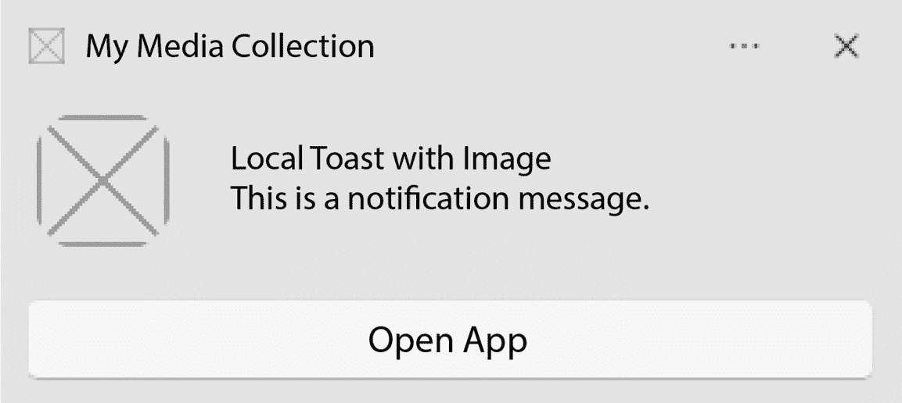
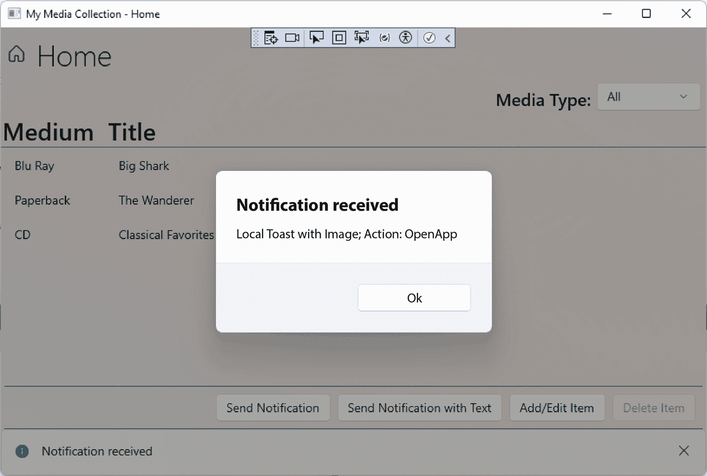
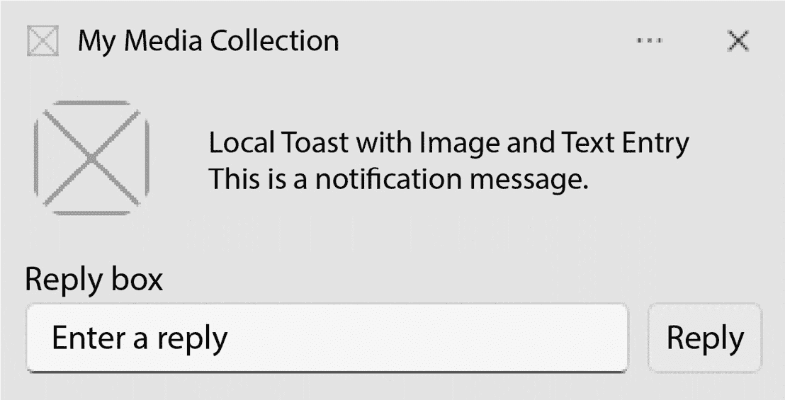
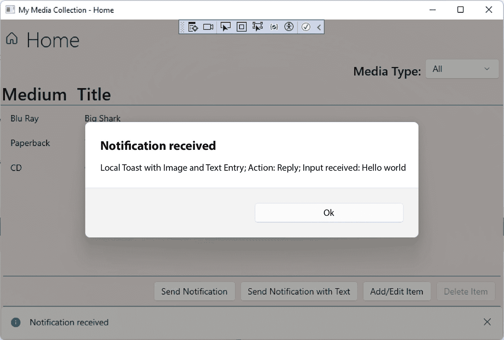

# 第八章：将 Windows 通知添加到 WinUI 应用程序

Windows App SDK 为开发者提供了在 WinUI 应用程序中实现**原始推送通知**和**应用程序通知**的能力。了解每种通知类型的使用案例非常重要。它们有不同的实现方式，每种都有其自身的优点和局限性。推送通知可以显示给用户或由应用程序接收以执行内部操作。另一方面，应用程序通知用于与用户通信。我们将介绍何时使用特定通知类型的示例，并将应用程序通知添加到**我的媒体收藏**示例应用程序中。

在本章中，我们将涵盖以下主题：

+   了解 Windows App SDK 中不同通知类型及其使用案例

+   发现如何在 WinUI 应用程序中利用推送通知

+   探索如何使用 WinUI 中的应用程序通知

到本章结束时，您将了解推送通知与 Windows App SDK 公开的其他应用程序通知之间的区别。您将了解何时选择每种通知类型以及它们在 WinUI 3 项目中是如何处理的。

# 技术要求

要跟随本章中的示例，需要以下软件：

+   Windows 10 版本 1809（构建 17763）或更高版本

+   配置了.NET 桌面开发工作负载的 Visual Studio 2022 或更高版本，用于 Windows App SDK 开发

本章的源代码可在 GitHub 上通过此 URL 获取：[`github.com/PacktPublishing/Learn-WinUI-3-Second-Edition/tree/master/Chapter08`](https://github.com/PacktPublishing/Learn-WinUI-3-Second-Edition/tree/master/Chapter08)。

# Windows App SDK 中推送通知概述

WinUI 应用程序可以利用 Windows App SDK 中的不同类型的通知。通知 API 是在 Windows App SDK 1.3 中添加的，可以根据通知类型选择本地发送或通过云服务发送。我们通常将通知与屏幕角落的小弹出窗口联系起来，这些窗口被称为**托盘通知**，在 Windows 中。然而，并非所有通知都需要视觉指示器。它们也可以用来指示应用程序激活并执行操作或从远程服务同步数据，而不依赖于应用程序中的计时器。

## 原始推送通知

这些内部通知被称为**原始推送通知**。它们不需要用户交互，并且不会通过**托盘通知**向用户发出信号。推送通知利用**Windows 推送通知服务**（**WNS**），这是**Microsoft Store**服务的一部分。要在商店发布应用程序或利用其任何服务，需要一个商店账户，并且您的应用程序必须在商店仪表板中注册。

注意

我们将在*第十四章*“打包和部署 WinUI 应用程序”中讨论将应用发布到 Microsoft Store，*第十四章*。本章不会涵盖商店注册过程，但如果您对此不熟悉，可以跳到*第十四章*查看过程。

来自 WNS 的推送通知可以直接由应用接收，以指示应用执行某些操作。实际上，您的应用不需要处于活动状态即可接收通知。Windows 将激活应用，以便它可以处理通知并执行请求的操作。使用通知可以节省设备资源，并可以减少或消除轮询和计时器的需求。

WNS 的通知也可能通知用户。这是一种应用通知类型。

## 基于云的应用通知

应用通知涉及通知用户某些事件已发生或需要采取行动。应用通知可以是本地的，也可以来自云端。基于云的通知，类似于原始通知，利用 WNS。

创建和发送这些应用通知的过程与创建原始推送通知的过程类似。头部和内容类型将区分应用通知，并通知 Windows 显示一个可见的、短暂的提示。任何未被用户取消或清除的通知都可以在 Windows 设置中的**通知中心**查看。

注意

某些类型的自包含应用或具有管理员权限运行的应用可能不符合接收通知的资格。要查看有关这些限制的更多信息，您可以查看 Microsoft Learn 上推送通知文档的此部分：[`learn.microsoft.com/windows/apps/windows-app-sdk/notifications/push-notifications/#limitations`](https://learn.microsoft.com/windows/apps/windows-app-sdk/notifications/push-notifications/#limitations)。

应用通知也可以是用户 PC 本地的。让我们接下来讨论这种类型的通知。

## 本地应用通知

本地应用通知不涉及云和 WNS，发送通知时不涉及 WNS。它们来自您的应用，显示给用户，并在用户对 toast 通知进行操作时由您的应用处理。用户通过使用 Microsoft 的应用，如 Outlook、Teams，甚至 Microsoft Store 应用，熟悉这些类型的通知。

有时，这些通知是信息性的，例如当商店应用在应用更新后显示消息时。通知还可以提示用户采取行动，例如暂停 Outlook 日历提醒。在这种情况下，通知窗口包含一个下拉控件，允许用户选择暂停的持续时间。

在本章的后面部分，我们将向 **My Media Collection** 应用添加本地应用通知，提示用户将新书添加到他们的收藏中。现在，我们将更深入地探讨原始推送通知的实现以及它们如何被用来静默地接收来自云的通知。

# 在 WinUI 应用中使用原始推送通知

如前所述，未经用户通知由应用处理的推送通知是通过 WNS 和 Azure 生成的。在本节中，我们将简要探讨如何在 WinUI 应用中利用这些通知。要开始，所需的 Azure 配置相对较长且不太有趣。由于 Azure 通知中心对 WNS 的配置已在 Microsoft Learn 上的 Azure 文档中详细说明，您应该在开始之前查看它们：[`learn.microsoft.com/azure/notification-hubs/notification-hubs-windows-store-dotnet-get-started-wns-push-notification`](https://learn.microsoft.com/azure/notification-hubs/notification-hubs-windows-store-dotnet-get-started-wns-push-notification)。了解 Windows 设计文档中 WNS 概述也是一个好主意：[`learn.microsoft.com/windows/apps/design/shell/tiles-and-notifications/windows-push-notification-services--wns--overview`](https://learn.microsoft.com/windows/apps/design/shell/tiles-and-notifications/windows-push-notification-services--wns--overview)。

注意

Azure 文档是为 UWP 应用编写的，但配置说明同样适用于 WinUI 3 应用。

完成 Azure 配置后，在 WinUI 3 应用中使用通知的步骤与 UWP 类似，但并不完全相同。有关从云中处理推送通知的详细示例，您可以阅读这篇 Microsoft Learn 文章：[`learn.microsoft.com/windows/apps/windows-app-sdk/notifications/push-notifications/push-quickstart`](https://learn.microsoft.com/windows/apps/windows-app-sdk/notifications/push-notifications/push-quickstart)。在本章中，我们专注于应用通知，将在下一节中将这些通知添加到我们的示例应用中。您需要完成的概述步骤如下：

1.  将 COM 激活信息添加到您的 `Package.appxmanifest` 文件中。以下是一个示例：

    ```cs
    <Extensions>
      <!--Register COM activator-->
      <com:Extension Category="windows.comServer">
        <com:ComServer>
          <com:ExeServer Executable="MyApp\MyApp.exe" DisplayName="My App" Arguments="----WindowsAppRuntimePushServer:">
            <com:Class Id="[Azure AppId for App]" DisplayName="WinUI Push Notify" />
          </com:ExeServer>
        </com:ComServer>
      </com:Extension>
    </Extensions>
    ```

1.  在 `Microsoft.Windows.PushNotifications` 命名空间中注册 `PushNotificationManager` 并订阅 `PushNotificationChannel` 以接收通知类型。

1.  在 `App` 类中添加代码以检查应用是否因推送通知而从后台启动或激活。

1.  创建一个 WNS 通道并将该通道注册到 WNS 服务。这些是接收要推送到您应用的推送通知数据的 HTTP 端点。

1.  使用像`POST`请求这样的工具，并带上推送通知数据。你需要为请求获取一个包含你的 Azure 租户 ID、应用 ID 和客户端密钥的访问令牌。更多信息请参阅此页面：[`learn.microsoft.com/azure/active-directory/develop/howto-create-service-principal-portal#get-tenant-and-app-id-values-for-signing-in`](https://learn.microsoft.com/azure/active-directory/develop/howto-create-service-principal-portal#get-tenant-and-app-id-values-for-signing-in)。

这些是基本步骤，但还有更多要学习。确保阅读本节中链接的所有文章，以了解在 WinUI 应用程序中使用原始推送通知的细微差别。

现在，让我们更深入地了解应用通知，以及如何将发送和接收功能添加到我们的示例应用中。

# 使用 Windows App SDK 添加 Windows 应用通知

在本节中，我们将向**我的媒体收藏**项目添加一些本地应用通知。我们将添加到项目中的代码基于微软学习团队创建的 Windows App SDK 本地应用通知示例应用。你可以在 GitHub 上下载该项目的代码：[`github.com/microsoft/WindowsAppSDK-Samples/tree/main/Samples/Notifications/App/CsUnpackagedAppNotifications`](https://github.com/microsoft/WindowsAppSDK-Samples/tree/main/Samples/Notifications/App/CsUnpackagedAppNotifications)。

我们在应用的`MainPage`中添加了两个按钮，用于触发两种类型的通知。一个将包含一个图像和一些文本。第二个将添加一个文本输入字段，以展示我们如何从通知托盘中接收用户输入并在我们的应用程序中对其做出反应。

注意

实现通知处理需要大量的配置和代码。如果你想要打开完成的解决方案并跟随操作，代码可以在 GitHub 上找到：[`github.com/PacktPublishing/Learn-WinUI-3-Second-Edition/tree/main/Chapter08/Complete`](https://github.com/PacktPublishing/Learn-WinUI-3-Second-Edition/tree/main/Chapter08/Complete)。

要开始，打开上一章中的**MyMediaCollection**解决方案或 GitHub 上*第八章*的起始解决方案：[`github.com/PacktPublishing/Learn-WinUI-3-Second-Edition/tree/main/Chapter08/Start`](https://github.com/PacktPublishing/Learn-WinUI-3-Second-Edition/tree/main/Chapter08/Start)。

1.  第一步是在`Package.appxmanifest`文件中添加一些配置以启用应用中的通知处理。首先向`Package`元素添加两个命名空间声明：

    ```cs
    xmlns:com="http://schemas.microsoft.com/appx/manifest/com/windows10"
    xmlns:desktop="http://schemas.microsoft.com/appx/manifest/desktop/windows10"
    ```

1.  接下来，在`Application`节点内部添加一个`Extensions`部分，紧接在`uap:VisualElements`部分之后：

    ```cs
    <Extensions>
      <desktop:Extension Category="windows.toastNotificationActivation">
        <desktop:ToastNotificationActivation ToastActivatorCLSID="NEW GUID HERE" />
      </desktop:Extension>
      <com:Extension Category="windows.comServer">
        <com:ComServer>
          <com:ExeServer Executable="MyMediaCollection\MyMediaCollection.exe" DisplayName="My Media Collection" Arguments="----AppNotificationActivated:">
            <com:Class Id="SAME NEW GUID HERE" />
          </com:ExeServer>
        </com:ComServer>
      </com:Extension>
    </Extensions>
    ```

    生成一个新的`Helpers`。

1.  现在在`Helpers`文件夹中创建一个名为`NotificationShared`的新类。首先向这个类添加一个常量和结构体：

    ```cs
    public const string scenarioTag = "scenarioId";
    public struct Notification
    {
        public string Originator;
        public string Action;
        public bool HasInput;
        public string Input;
    };
    ```

    `Notification`结构体将表示应用程序通知中接收到的数据。`scenarioTag`是一个常量，在构建要发送的每个通知时将需要。

1.  接下来，向`NotificationShared`类添加以下静态方法。这些方法将由应用程序用于在发送或接收通知时通知 UI：

    ```cs
    public static void CouldNotSendToast()
    {
        MainPage.Current.NotifyUser("Could not send toast", InfoBarSeverity.Error);
    }
    public static void ToastSentSuccessfully()
    {
        MainPage.Current.NotifyUser("Toast sent successfully!", InfoBarSeverity.Success);
    }
    public static void AppLaunchedFromNotification()
    {
        MainPage.Current.NotifyUser("App launched from notifications", InfoBarSeverity.Informational);
    }
    public static void NotificationReceived()
    {
        MainPage.Current.NotifyUser("Notification received", InfoBarSeverity.Informational);
    }
    public static void UnrecognizedToastOriginator()
    {
        MainPage.Current.NotifyUser("Unrecognized Toast Originator or Unknown Error", InfoBarSeverity.Error);
    }
    ```

    `MainPage`没有`Current`属性，所以这段代码目前还不能编译。我们很快就会解决这个问题。如果 Visual Studio 没有添加必要的`using`语句，请确保在`NotificationShared`中存在这些语句：

    ```cs
    using Microsoft.UI.Xaml.Controls;
    using MyMediaCollection.Views;
    ```

1.  现在我们将创建两个类来表示应用程序将发送和接收的两种类型的通知。首先，创建一个名为`ToastWithAvatar`的新类，并首先向类中添加两个常量：

    ```cs
    using Microsoft.Windows.AppNotifications.Builder;
    using Microsoft.Windows.AppNotifications;
    using MyMediaCollection.Views;
    namespace MyMediaCollection.Helpers
    {
        public class ToastWithAvatar
        {
            public const int ScenarioId = 1;
            public const string ScenarioName = "Local Toast with Image";
        }
    }
    ```

1.  接下来，向类中添加一个名为`SendToast`的方法。这个方法将构建并显示一个包含一些文本、头像图像和显示我们应用程序的按钮的 Windows 通知托盘：

    ```cs
    public static bool SendToast()
    {
        var appNotification = new AppNotificationBuilder()
            .AddArgument("action", "ToastClick")
            .AddArgument(NotificationShared.scenarioTag, ScenarioId.ToString())
            .SetAppLogoOverride(new System.Uri($"file://{App.GetFullPathToAsset(" Square150x150Logo.scale-200.png")}"), AppNotificationImageCrop.Circle)
            .AddText(ScenarioName)
            .AddText("This is a notification message.")
            .AddButton(new AppNotificationButton("Open App")
                .AddArgument("action", "OpenApp")
                .AddArgument(NotificationShared.scenarioTag, ScenarioId.ToString()))
            .BuildNotification();
        AppNotificationManager.Default.Show(appNotification);
        // If notification is sent, it will have an Id. Success.
        return appNotification.Id != 0;
    }
    ```

1.  现在添加一个`NotificationReceived`方法，当我们的应用程序从 Windows 接收到此类通知时，该方法将被调用。这个方法创建一个`Notification`结构体，并在稍后本节中创建的`MainPage`上调用`NotificationReceived`方法。我们还将创建`ToForeground`方法，以便将我们的应用程序带到前台，如果它被其他窗口隐藏或最小化了：

    ```cs
    public static void NotificationReceived(AppNotificationActivatedEventArgs notificationActivatedEventArgs)
    {
        var notification = new NotificationShared.Notification
        {
            Originator = ScenarioName,
            Action = notificationActivatedEventArgs.Arguments["action"]
        };
        MainPage.Current.NotificationReceived(notification);
        App.ToForeground();
    }
    ```

1.  `ToastWithText`类将与`ToastWithAvatar`类似，但它将在`AppNotificationBuilder`中添加对`AddTextBox`的调用以创建 Windows 托盘中的输入字段。它还将用户输入的结果添加到在`NotificationReceived`中创建的`Notification`类中。要查看此类的完整代码，请查看 GitHub 上的完成解决方案：[`github.com/PacktPublishing/Learn-WinUI-3-Second-Edition/tree/main/Chapter08/Complete/MyMediaCollection/Helpers/ToastWithText.cs`](https://github.com/PacktPublishing/Learn-WinUI-3-Second-Edition/tree/main/Chapter08/Complete/MyMediaCollection/Helpers/ToastWithText.cs)。

1.  现在是时候创建`NotificationManager`类了。这个类将正好做到这一点——管理通知。它将初始化和注销通知接收。它将执行实际的通知发送和接收。在`Helpers`文件夹中创建`NotificationManager`类，并首先添加构造函数和析构代码：

    ```cs
    using Microsoft.Windows.AppNotifications;
    using System;
    using System.Collections.Generic;
    namespace MyMediaCollection.Helpers
    {
        internal class NotificationManager
        {
            private bool isRegistered;
            private Dictionary<int, Action<AppNotificationActivatedEventArgs>> notificationHandlers;
            public NotificationManager()
            {
                isRegistered = false;
                notificationHandlers = new Dictionary<int, Action<AppNotificationActivatedEventArgs>>
                {
                    { ToastWithAvatar.ScenarioId, ToastWithAvatar.NotificationReceived },
                    { ToastWithText.ScenarioId, ToastWithText.NotificationReceived }
                };
            }
            ~NotificationManager()
            {
                Unregister();
            }
            public void Unregister()
            {
                if (isRegistered)
                {
                    AppNotificationManager.Default.Unregister();
                    isRegistered = false;
                }
            }
        }
    }
    ```

1.  接下来，添加`Init`方法，我们将从`App`类中调用它：

    ```cs
    public void Init()
    {
        AppNotificationManager notificationManager = AppNotificationManager.Default;
        // Add handler before calling Register.
        notificationManager.NotificationInvoked += OnNotificationInvoked;
        notificationManager.Register();
        isRegistered = true;
    }
    ```

1.  `OnNotificationInvoked`在`Init`方法中被连接。当应用程序接收到通知时，这将触发。它根据通知是否被识别对`NotificationShared`进行不同的调用：

    ```cs
    public void OnNotificationInvoked(object sender, AppNotificationActivatedEventArgs notificationActivatedEventArgs)
    {
        NotificationShared.NotificationReceived();
        if (!DispatchNotification(notificationActivatedEventArgs))
        {
            NotificationShared.UnrecognizedToastOriginator();
        }
    }
    ```

注意

如果你的代码中有处理传入通知的未处理异常，它们也会触发对`NotificationShared.UnrecognizedToastOriginator`的此调用。

1.  最后，在`NotificationManager`中创建`ProcessLaunchActivationArgs`和`DispatchNotification`方法：

    ```cs
    public void ProcessLaunchActivationArgs(AppNotificationActivatedEventArgs notificationActivatedEventArgs)
    {
        DispatchNotification(notificationActivatedEventArgs);
        NotificationShared.AppLaunchedFromNotification();
    }
    private bool DispatchNotification(AppNotificationActivatedEventArgs notificationActivatedEventArgs)
    {
        var scenarioId = notificationActivatedEventArgs.Arguments[NotificationShared.scenarioTag];
        if (scenarioId.Length != 0)
        {
            try
            {
                notificationHandlersint.Parse(scenarioId);
                return true;
            }
            catch
            {
                // No matching handler
                return false;
            }
        }
        else
        {
            // No scenarioId provided
            return false;
        }
    }
    ```

1.  现在我们将向 `App.xaml.cs` 添加代码以初始化 `NotificationManager` 并处理一些常见的调用。让我们首先添加新代码所需的 `using` 语句：

    ```cs
    using Microsoft.Windows.AppLifecycle;
    using Microsoft.Windows.AppNotifications;
    using MyMediaCollection.Helpers;
    using System.Runtime.InteropServices;
    using WinRT.Interop;
    ```

1.  接下来，添加一个私有的 `notificationManager` 对象，添加 `DllImport` 以帮助将窗口带到前台，并使 `m_window` 静态：

    ```cs
    [DllImport("user32.dll", SetLastError = true)]
    static extern void SwitchToThisWindow(IntPtr hWnd, bool turnOn);
    private NotificationManager notificationManager;
    private static Window m_window;
    ```

注意

在选择在生产 WinUI 应用中使用哪些 Win32 API 时要小心。`SwitchToThisWindow` API 被文档标记为“*不适用于通用用途*”，但在我们的示例应用中它适用于我们的目的。还有其他 API 可以探索，包括 `ShowWindow`：[`learn.microsoft.com/windows/win32/api/winuser/nf-winuser-showwindow`](https://learn.microsoft.com/windows/win32/api/winuser/nf-winuser-showwindow)。

1.  接下来，在调用 `m_window.Activate` 之前，向 `OnLaunched` 添加以下代码。这获取传递给应用的 Windows 通知参数：

    ```cs
    var currentInstance = AppInstance.GetCurrent();
    if (currentInstance.IsCurrent)
    {
        AppActivationArguments activationArgs = currentInstance.GetActivatedEventArgs();
        if (activationArgs != null)
        {
            ExtendedActivationKind extendedKind = activationArgs.Kind;
            if (extendedKind == ExtendedActivationKind.AppNotification)
            {
                var notificationActivatedEventArgs = (AppNotificationActivatedEventArgs)activationArgs.Data;
                notificationManager.ProcessLaunchActivationArgs(notificationActivatedEventArgs);
            }
        }
    }
    ```

1.  接下来，在 `App` 构造函数中添加一些代码以初始化 `NotificationManager` 并处理 `AppDomain.CurrentDomain.ProcessExit` 事件，以便在应用关闭时注销管理器：

    ```cs
    public App()
    {
        this.InitializeComponent();
        notificationManager = new NotificationManager();
        notificationManager.Init();
        AppDomain.CurrentDomain.ProcessExit += CurrentDomain_ProcessExit;
    }
    private void CurrentDomain_ProcessExit(object sender, EventArgs e)
    {
        notificationManager.Unregister();
    }
    ```

1.  要添加到 `App` 类中的最后几项是三个静态辅助方法，用于获取一些应用程序相关的路径，以及 `ToForeground` 方法，当应用隐藏或最小化时将应用带到前台：

    ```cs
    public static void ToForeground()
    {
        if (m_window != null)
        {
            IntPtr handle = WindowNative.GetWindowHandle(m_window);
            if (handle != IntPtr.Zero)
            {
                SwitchToThisWindow(handle, true);
            }
        }
    }
    public static string GetFullPathToExe()
    {
        var path = AppDomain.CurrentDomain.BaseDirectory;
        var pos = path.LastIndexOf("\\");
        return path.Substring(0, pos);
    }
    public static string GetFullPathToAsset(string assetName)
    {
        return $"{GetFullPathToExe()}\\Assets\\{assetName}";
    }
    ```

1.  现在我们来处理 `MainPage`。从 `MainPage.xaml` 开始。我们将添加两个按钮来发送通知，以及一个 `InfoBar` 控件，在发送或接收通知时在页面底部显示消息。向最外层的 `Grid` 控件添加另一个 `RowDefinition`：

    ```cs
    <Grid.RowDefinitions>
        <RowDefinition Height="Auto"/>
        <RowDefinition Height="*"/>
        <RowDefinition Height="Auto"/>
        <RowDefinition Height="Auto"/>
    </Grid.RowDefinitions>
    ```

1.  向包含现有 `Button` 控件的 `StackPanel` 的开头添加两个按钮：

    ```cs
    <StackPanel HorizontalAlignment="Right"
                Orientation="Horizontal">
        <Button Command="{x:Bind ViewModel.SendToastCommand}"
                Content="Send Notification"
                Margin="8,8,0,8"/>
        <Button Command="{x:Bind ViewModel.SendToastWithTextCommand}"
                Content="Send Notification with Text"
                Margin="8,8,0,8"/>
    ...
    </StackPanel>
    ```

1.  在最外层 `Grid` 的关闭标签之前添加一个 `InfoBar` 控件：

    ```cs
    <InfoBar x:Name="notifyInfoBar" Grid.Row="3"/>
    ```

1.  接下来，打开 `MainPage.xaml.cs` 文件，我们需要添加一些代码来处理传入的通知。我们首先要做的是添加 `MyMediaCollection.Helpers` 的 `using` 语句。

1.  接下来，添加代码以公开 `MainPage` 的当前实例，以便正确路由通知：

    ```cs
    public static MainPage Current;
    public MainPage()
    {
        ViewModel = App.HostContainer.Services.GetService<MainViewModel>();
        this.InitializeComponent();
        Current = this;
        Loaded += MainPage_Loaded;
    }
    ```

1.  接下来，添加一些代码，在发送或接收通知时更新 `InfoBar`。这是由 `NotificationShared` 类中的方法调用的代码：

    ```cs
    public void NotifyUser(string message, InfoBarSeverity severity, bool isOpen = true)
    {
        if (DispatcherQueue.HasThreadAccess)
        {
            UpdateStatus(message, severity, isOpen);
        }
        else
        {
            DispatcherQueue.TryEnqueue(() =>
            {
                UpdateStatus(message, severity, isOpen);
            });
        }
    }
    private void UpdateStatus(string message, InfoBarSeverity severity, bool isOpen)
    {
        notifyInfoBar.Message = message;
        notifyInfoBar.IsOpen = isOpen;
        notifyInfoBar.Severity = severity;
    }
    ```

    `DispatcherQueue` 方法检查代码是否可以访问 UI 线程。如果不能，则使用 `TryEnqueue` 将工作排队，以便在 UI 线程可用时执行。否则，从后台线程访问 UI 元素时将遇到错误。

1.  创建一个 `NotificationReceived` 方法来处理传入的通知信息。此方法解析传入数据并构建要显示的消息字符串：

    ```cs
    public void NotificationReceived(NotificationShared.Notification notification)
    {
        var text = $"{notification.Originator}; Action: {notification.Action}";
        if (notification.HasInput)
        {
            if (string.IsNullOrWhiteSpace(notification.Input))
                text += "; No input received";
            else
                text += $"; Input received: {notification.Input}";
        }
        if (DispatcherQueue.HasThreadAccess)
            DisplayMessageDialog(text);
        else
        {
            DispatcherQueue.TryEnqueue(() =>
            {
                DisplayMessageDialog(text);
            });
        }
    }
    ```

    要添加到 `MainPage` 的最后一段代码是一个简单的显示 `ContentDialog` 的方法，其中包含通知数据：

    ```cs
    private void DisplayMessageDialog(string message)
    {
        ContentDialog notifyDialog = new()
        {
            XamlRoot = this.XamlRoot,
            Title = "Notification received",
            Content = message,
            CloseButtonText = "Ok"
        };
        notifyDialog.ShowAsync();
    }
    ```

    `MainViewModel` 是需要更新的最后一个类。我们需要为发送应用通知时新按钮调用的两个命令方法创建两个方法：`SendToast` 和 `SendToastWithText`：

    ```cs
    [RelayCommand]
    private void SendToast()
    {
        if (ToastWithAvatar.SendToast())
            NotificationShared.ToastSentSuccessfully();
        else
            NotificationShared.CouldNotSendToast();
    }
    [RelayCommand]
    private void SendToastWithText()
    {
        if (ToastWithText.SendToast())
            NotificationShared.ToastSentSuccessfully();
        else
            NotificationShared.CouldNotSendToast();
    }
    ```

    不要忘记将 `using MyMediaCollection.Helpers;` 添加到 `MainViewModel` 中的 using 语句列表中。

我们已经准备好运行应用程序并测试通知。开始调试并点击 **发送通知** 按钮。你应该在主屏幕的右下角看到 toast 出现：



图 8.1 – Windows toast 通知

将另一个窗口置于 **我的媒体收藏** 前面，然后点击 toast 上的 **打开应用**。应用应该被带到屏幕的前面，**ContentDialog** 将显示有关接收到的通知的信息：



图 8.2 – 接收应用程序通知

注意

如果你点击其中一个按钮多次发送通知而不确认 toast 窗口，toast 不会堆叠。后续的 toast 将直接发送到 Windows 的 **通知中心**。一旦它们到达那里，就无法使用文本框等交互式字段。此外，如果用户已启用 *勿扰* 或 *专注* 模式，所有通知都将被抑制并直接发送到 **通知中心**。

现在点击 **发送带文本的通知** 按钮。当这个 toast 出现时，它将有一个文本框，你可以 **输入** **一个回复**：



图 8.3 – 显示带有文本框的 toast 窗口

输入 `Hello world` 并点击 **回复** 按钮。现在，当 **我的媒体收藏** 显示 **ContentDialog** 时，它将包括在 toast 窗口中输入的回复：



图 8.4 – 在我们的应用程序中显示 toast 窗口的回复文本

现在，你已经准备好开始将通知构建到自己的 WinUI 应用程序中。让我们总结本章内容并讨论我们学到的知识。

# 摘要

在本章中，我们了解了 Windows App SDK 中可供 WinUI 开发者使用的 Windows 通知类型。我们讨论了如何使用通知来节省 Windows 资源、减少对计时器的需求并提示用户采取行动。我们探讨了如何配置原始推送通知，并将本地应用通知添加到 **我的媒体收藏** 示例应用程序中。你现在应该准备好将任何这些类型的通知添加到自己的 WinUI 应用程序中。

在下一章中，我们将探讨 **Windows Community Toolkit**（**WCT**）以及如何通过利用现有的助手、样式和控制来与 .NET Community Toolkit 一起节省开发时间。

# 问题

1.  哪种 Windows 通知类型可以用来从云端启动数据同步？

1.  哪种通知类型不依赖于 WNS？

1.  在 Azure 中配置通知服务之前，您在哪里注册您的应用程序？

1.  哪个 Windows App SDK 命名空间包含用于处理应用通知的对象？

1.  哪个类提供了注册和注销应用程序以处理应用通知的方法？

1.  如果您希望应用程序的通知在系统重启后消失，可以设置哪个属性？

1.  WNS 的通知能否通过托盘通知提示用户？
