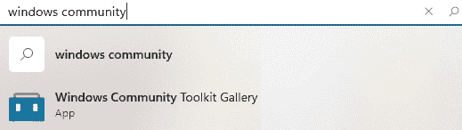
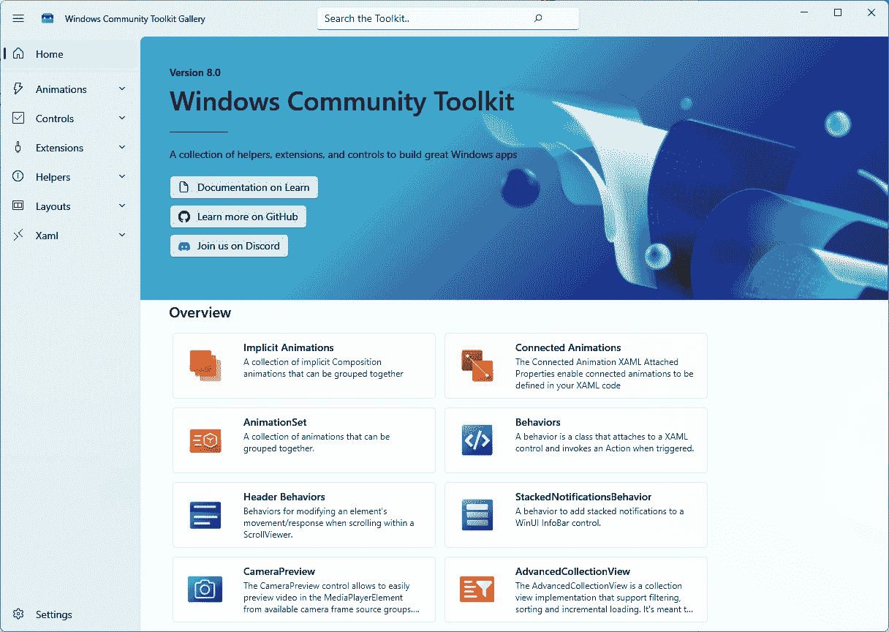
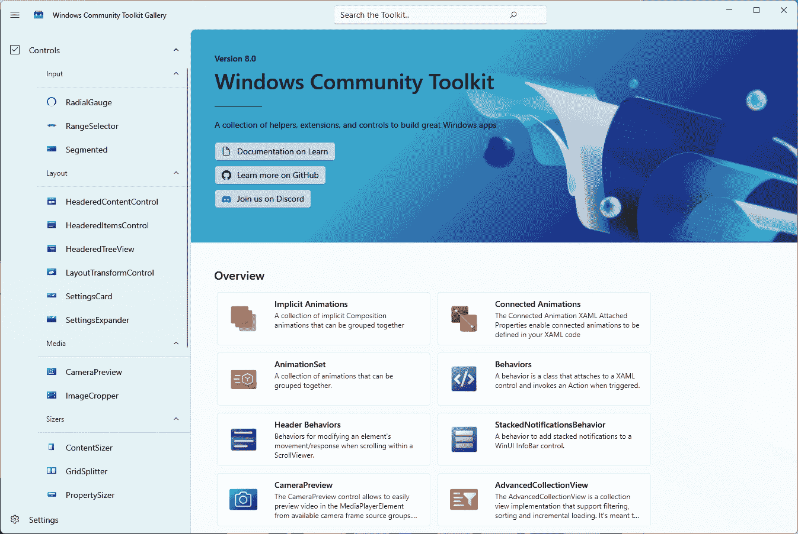
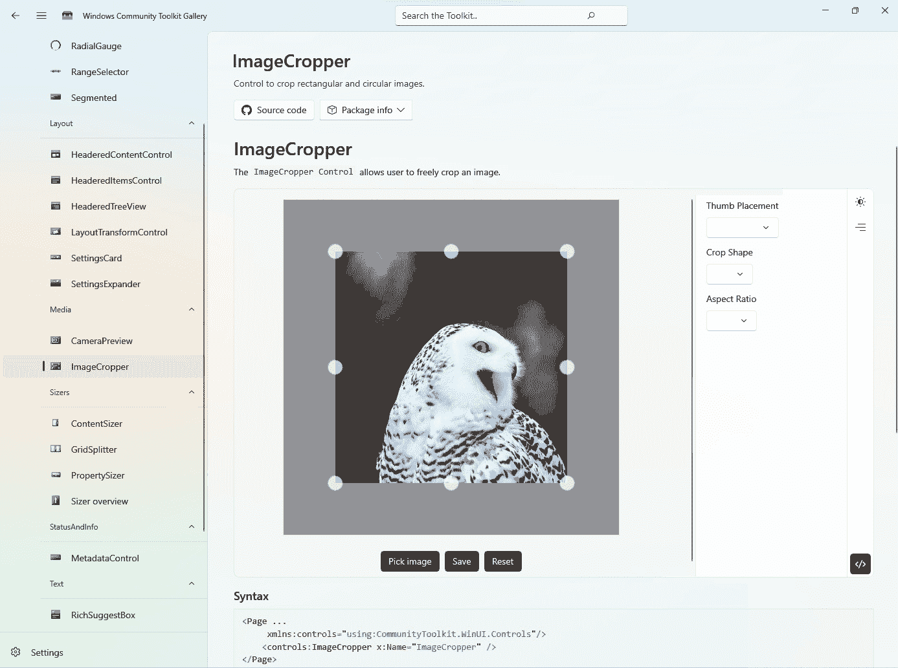
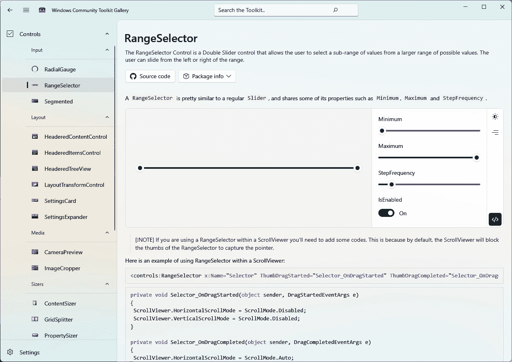
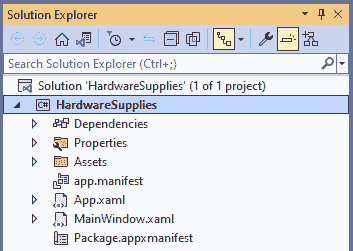
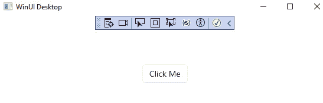
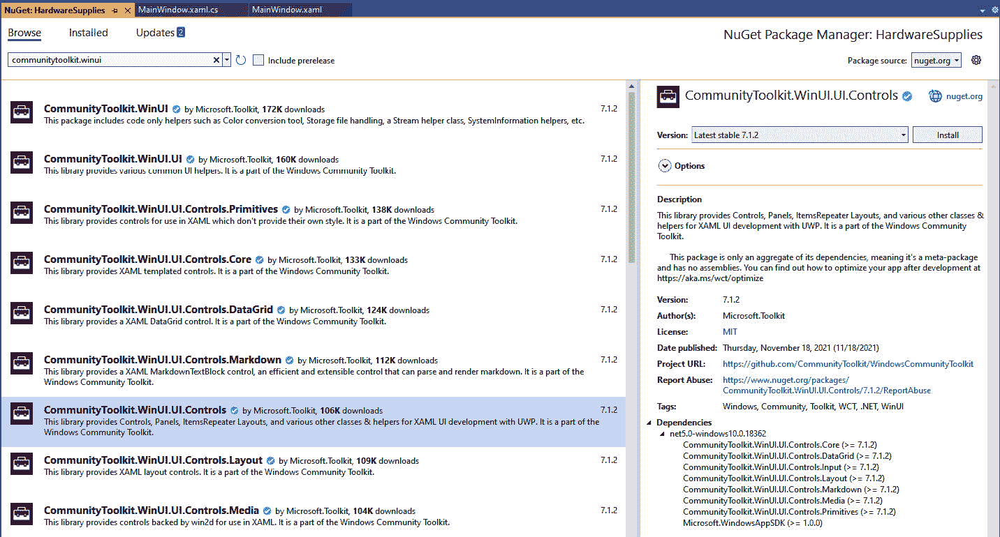
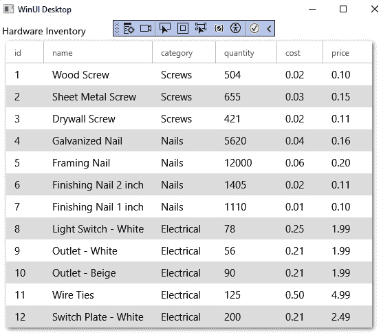

# 9

# 使用社区工具包增强应用程序

**Windows 社区工具包**（**WCT**）和**.NET 社区工具包**是面向 Windows 和.NET 开发者的开源库集合。这些工具包包含可以由**Windows UI 库**（**WinUI**）、**通用 Windows 平台**（**UWP**）、.**NET 多平台应用程序 UI**（**.NET MAUI**）、**Windows 表现基础**（**WPF**）和**Windows 窗体**（**WinForms**）应用程序利用的控件和库。在**Microsoft Store**中，有一个 WCT 的配套示例应用程序，开发者可以安装它来探索控件并学习如何使用它们。

在本章中，我们将涵盖以下主题：

+   了解工具包的背景和目的

+   使用工具包示例应用程序来探索 WCT 中可用的控件

+   在 WinUI 项目中利用工具包控件

+   探索 WCT 中为 Windows 开发者提供的辅助工具、服务和扩展

+   发现.NET 社区工具包为 WinUI 开发者提供了什么

到本章结束时，你将了解 WCT 以及它如何在你构建 Windows 应用程序时提高你的生产力。你还将知道如何将其控件集成到你的 WinUI 应用程序中。

# 技术要求

要跟随本章中的示例，需要以下软件：

+   Windows 10 版本 1809（构建号 17763）或更高版本

+   配置了 Windows App SDK 开发工作负载的 Visual Studio 2022 或更高版本

本章的源代码可在 GitHub 上找到，网址为[`github.com/Packt
Publishing/Learn-WinUI-3-Second-Edition/tree/master/Chapter09`](https://github.com/PacktPublishing/Learn-WinUI-3-Second-Edition/tree/master/Chapter09)。

# 介绍 WCT

WCT 是由微软创建的，作为一个开源的控件和其他辅助工具、服务和库的集合，专为 Windows 开发者设计。它主要被 UWP 开发者使用，但也为 WinUI、WinForms 和 WPF 开发者提供了价值。该工具包以 NuGet 包的形式提供给开发者。在 NuGet 上有超过一打的工具包包可供安装，可以根据项目需求独立安装。我们将在本章中探讨一些这些包。让我们先讨论 WCT 的历史。

工具包从一开始就是开源的。它已经在 GitHub 上长期可用，网址为[`github.com/CommunityToolkit/WindowsCommunityToolkit`](https://github.com/CommunityToolkit/WindowsCommunityToolkit)，但工具包的下一代托管在[`github.com/CommunityToolkit/Windows`](https://github.com/CommunityToolkit/Windows)。这个工具包的新版本旨在帮助 WinUI 2、WinUI 3 和**Uno Platform**开发者，但这个新的工具包还没有任何发布版本。如果你有兴趣帮助推进项目，这个工具包欢迎社区贡献。WCT 的文档可在*Microsoft Learn*上找到，网址为[`learn.microsoft.com/windows/communitytoolkit/`](https://learn.microsoft.com/windows/communitytoolkit/)。

## WCT 的起源

WCT 最初于 2016 年以**UWP 社区工具包**的形式推出。正如其名所示，它最初是一个仅针对 UWP 开发者的工具包。该工具包的创建是为了通过提供 Windows 开发者经常为其自己的常用库创建的控件和辅助工具来简化 UWP 应用开发。为 XAML 开发创建工具包的想法并不是新的。已经有一些其他类似的项目针对其他平台，包括以下内容：

+   **WPF 工具包** ([`github.com/dotnetprojects/wpftoolkit`](https://github.com/dotnetprojects/wpftoolkit)): 一套 WPF 开源控件和其他组件，最初由微软在**CodePlex**上托管。

+   **扩展 WPF 工具包** ([`github.com/xceedsoftware/wpftoolkit`](https://github.com/xceedsoftware/wpftoolkit)): 由**Xceed Software**维护的开源控件集合，旨在补充原始的 WPF 工具包。

+   **Xamarin 社区工具包** ([`github.com/xamarin/Xamarin
CommunityToolkit`](https://github.com/xamarin/XamarinCommunityToolkit)): 一个开源的 Xamarin 控件、动画、行为和效果集合，用于**Xamarin.Forms**。随着 Xamarin 开发者转向**.NET MAUI**，现在也有了一个**.NET MAUI 社区工具包** ([`github.com/CommunityToolkit/Maui`](https://github.com/CommunityToolkit/Maui))。

微软在开源社区的帮助下，定期更新工具包，每年多次添加新的和增强的组件和控件。2018 年春季，在 v3.0 发布前夕，他们宣布了工具包的新名称：*Windows 社区工具包*。这次更名标志着团队意图向前拥抱所有 Windows 开发者。

WCT 3.0 包含了一个基于旧版 Microsoft Edge 的`WebView`控件——不要与稍后在本章中介绍的`WebView2`混淆——用于 WPF 和 WinForms 应用。此次发布还添加了 Visual Basic 的代码示例，这在许多遗留的 Windows 桌面代码库中仍在使用。

工具包的另一个目的是让开发者能够在新控件上工作，希望其中一些控件将来会被集成到 Windows SDK 中（或者作为替代，WinUI 库）。自从工具包推出以来，已经发生了这种情况，包括 `WebView` 控件。

随后的工具包发布继续为 UWP 和桌面开发者增加价值，这些发布是由社区贡献推动的。

## 检查最近的工具包发布

自从 3.0 版本以来，WCT 已经发布了几个主要版本。是 WCT 7.0 首次增加了对 WinUI 3 的支持。

2018 年 8 月，WCT 4.0 添加了 `DataGrid` 控件，这是熟悉在 Silverlight 和 WPF 平台上可用的 `DataGrid` 控件的 UWP 开发者一直渴望的功能。很快，2018 年秋季发布了版本 5。这次发布为工具包带来了两个主要功能，如下所述：

+   `WindowsXamlHost`：这个控件使单个 UWP 控件能够被包装并托管在 WPF 或 WinForms 控件中。后来，`WindowsXamlHost` 控件将被称为 XAML Islands，托管 API 被添加到 Windows SDK 中。还发布了一些 `wrapped controls`，包括 `InkCanvas`、`MapControl` 以及对传统 `WebView` 控件的更新。

+   `TabView`：在 `DataGrid` 之后，一个丰富的 `TabView` 控件可能是 UWP 开发者最希望获得但尚未可用的控件。WCT 的 `TabView` 控件包括自定义、关闭以及拖放标签的支持。`TabView` 也已经升级到 WinUI 2 库，并在 WinUI 2.2 及以后的版本中可用。

一年后，在 2019 年秋季，WCT 6.0 将 XAML Islands 控件引入了所有 WinForms、WPF 和 C++ Win32 开发者，并增加了对 .NET Core 3 客户端的支持。这次发布中的另一项重大改进是增加了 ARM64 开发支持。2020 年 6 月，团队宣布了 WCT 6.1，以及版本 7 和 8 的即将发布的预览版。2020 年发布了 WCT 7.0 的几个预览版，其最终版本于 2021 年 3 月发布。工具包的 7.0 版本包括主要的项目重构以及几个主要功能。最令人兴奋的功能是首次发布了 `ViewModel` 类。

2021 年 9 月发布了 WCT 7.1。它添加了一些用于 Microsoft Graph 和 Microsoft Identity 平台的辅助类，以及一些新的控件、行为、阴影和样式。2021 年 11 月发布了 7.1.2 版本。这被宣布为包含工具包中 .NET 库更新的最终版本，因为这些库都将迁移到 .NET Community Toolkit。所有随后的 7.x 版本都是 UWP 独有的更新。

新发布的 WCT 8.0 支持 WinUI 3。之前，使用 WCT 支持的 .NET 创建 WinUI 3 应用程序仅在新的 WCT 仓库中处于预览状态。尝试这些包需要从源代码构建工具库，因为它们在 GitHub 上没有发布版本。现在，它们作为稳定的 NuGet 包提供，您可以像添加任何其他包一样将它们添加到您的项目中。

现在我们已经介绍了 WCT 的背景和历史，我们将快速查看工具包中的一些控件和组件。

# 探索 WCT 图库应用

如我们本章前面提到的，**WCT 图库应用** 可从 Microsoft Store 获取 ([`apps.microsoft.com/store/detail/windows-community-toolkit-gallery/9NBLGGH4TLCQ`](https://apps.microsoft.com/store/detail/windows-community-toolkit-gallery/9NBLGGH4TLCQ))。它可以在 Windows 10 版本 17763 或更高版本、Windows 11 上安装，甚至可以在您的 Xbox、Surface Hub 或 HoloLens 设备上安装。与我们在 *第五章* 中讨论的 **WinUI 3 图库** 应用一样，工具包示例应用为我们提供了一个轻松导航和探索 WCT 内容的方法。

## 安装和启动应用

让我们开始吧：

1.  在 **搜索** 框中打开 `windows community`：



图 9.1 – 在 Microsoft Store 中查找应用

1.  从搜索结果中选择 **Windows Community Toolkit 图库** 并点击结果页面上的 **安装** 按钮。安装完成后，**安装** 按钮将变为 **打开** 按钮。从那里或从 Windows 开始菜单打开 WCT 应用：



图 9.2 – WCT 图库应用

应用打开到概述页面，其中有一些突出显示的控件、辅助工具和行为。顶部部分还有一些链接到 WCT 文档、GitHub 仓库和他们的 Discord 社区的有用链接。

控件和其他组件在左侧分为七个部分：**动画**、**控件**、**扩展**、**辅助工具**、**布局**、**Xaml** 和应用的 **设置**。由于工具包中有许多控件，我们将探索其中的一些，其余的留给您自己探索。 

## 控件

点击应用左侧的 **控件** 导航项以显示控件列表。这是应用中最大的部分，控件按类别分组，如下所示：

+   **输入**：这些是自定义输入控件（例如，**RadialGuage**）

+   **布局**：布局面板和相关控件（例如，**HeaderedTreeView**）

+   **媒体**：用于处理媒体的控件（例如，**CameraPreview**）

+   **尺寸调整器**：这些是内容尺寸控件（例如，**GridSplitter**）

+   **状态和信息**：用于更新用户进度或状态的控件。在当前版本的 app 中，该部分只包含**MetadataControl**

+   **文本**：这些是文本输入控件类型（例如，**RichSuggestBox**）

你可以在以下屏幕截图中看到一些展开的导航面板中的控件：



图 9.3 – 在 WCT Gallery 应用中展开的控件菜单

选择这些控件之一将打开一个包含几个区域的页面。主面板是一个交互式区域，你可以与所选控件交互。在此面板右侧有一些下拉框，可以更新控件的行为，还有一个按钮，可以切换**浅色**或**深色**主题，这将更新面板中运行的控件。

右侧面板包含几个控件，用于修改当前控件的显示和行为。右侧面板上看到的控件数量将根据所选控件而变化。**查看代码**按钮将展开一个 XAML 编辑器，其中包含在主面板中运行的代码的标记。你可以在这里更改标记，你的更改将在主面板中运行的代码中反映出来。**C#**选项卡将显示控件的 C#代码。在页面的交互式部分下方，显示来自*Microsoft Learn*的控件文档：



图 9.4 – 在 WCT Gallery 应用中查看 ImageCropper 控件

在工具包的**控件**部分花些时间探索**ImageCropper**控件和**MarkdownTextBlock**。按照以下步骤操作：

1.  打开**ImageCropper**控件并尝试使用它。点击**裁剪形状**下拉控件，选择**圆形**，然后观察裁剪区域变为圆形形状。

1.  接下来，在左侧面板中选择**RangeSelector**控件。此控件的页面类似，但在主面板上有一个 RangeSelector 控件，其中两个滑块可以移动以选择范围的最小和最大点。**最小**和**最大**允许的值也可以从面板的右侧控制：



图 9.5 – RangeSelector 在 WCT Gallery 应用中运行

1.  滚动查看控件的一个示例用法。

在这个 app 的部分，你可以探索更多控件。你应该花些时间找出哪些可能在你的下一个项目中有用。

现在我们已经探索了示例应用中的几个控件，让我们尝试在一个 WinUI 项目中使用它们。

# 使用工具包中的控件

在上一节中，我们探索了示例应用中的几个 WCT 控件。现在，是时候在 WinUI 项目中使用它们了。为了演示一些控件的实际应用，我们将创建一个新的**WinUI 3 Desktop**项目。

注意

在撰写本文时，WCT 控件不建议在生产应用中使用，并有一些注意事项。要了解更多关于当前限制的信息，您可以阅读这篇 Microsoft 博客文章：[`devblogs.microsoft.com/ifdef-windows/windows-community-toolkit-for-project-reunion-0-5/`](https://devblogs.microsoft.com/ifdef-windows/windows-community-toolkit-for-project-reunion-0-5/)。

## 创建 WinUI 项目

要开始我们的 WCT 项目，您需要启动 Visual Studio 并按照以下步骤操作：

1.  创建一个新的项目。然后在搜索字段中的 `WinUI in Desktop`。

1.  将显示几个项目类型，但顶部结果之一将是 **Blank App, Packaged (WinUI 3 in Desktop)**。选择您选择的语言的此项目模板并点击 **Next**。

1.  将项目命名为 `HardwareSupplies` 并点击 `App.xaml` 和 `MainWindow.xaml`：



图 9.6 – Visual Studio Solution Explorer 中的 HardwareSupplies 项目

1.  如果您打开 `MainWindow.xaml` 文件，您将看到一些简单的起始标记。有一个 `StackPanel` 控件，其中包含一个名为 `myButton` 的 `Button` 控件，其内容为 `Click Me`。代码如下所示：

    ```cs
    <StackPanel Orientation="Horizontal"
                HorizontalAlignment="Center"
                VerticalAlignment="Center">
        <Button x:Name="myButton"
                Click="myButton_Click">
            Click Me
        </Button>
    </StackPanel>
    ```

1.  `myButton` 控件的 `Click` 事件在 `MainWindow.xaml.cs` 中有一个名为 `myButton_Click` 的事件处理程序，它会将 `myButton` 变量的内容更改为 `Clicked`，如下面的代码片段所示：

    ```cs
    private void myButton_Click(object sender, RoutedEventArgs e)
    {
        myButton.Content = "Clicked";
    }
    ```

1.  在我们进行任何更改之前，运行应用程序并测试按钮以确保一切按预期工作：



图 9.7 – 首次运行 HardwareSupplies 应用

一切都按预期工作。接下来，我们将向项目中添加 WCT 包引用。

## 引用 WCT 包

我们需要为应用程序的主要控件是一个显示硬件项目列表的 `DataGrid` 控件。我们还将添加一个 `HeaderedContentControl` 控件和一个 `DropShadowPanel` 控件，以了解这些控件如何使用。大多数 WCT 控件都是 `communitytoolkit.winui` 的一部分，并将这两个包的最新版本添加到项目中：



图 9.8 – 添加 WCT NuGet 包

安装这两个包后，关闭包管理器窗口并编译项目以确保所有包都已下载。接下来，我们将为 `DataGrid` 控件设置一些数据。

## 向 DataGrid 控件添加数据

任何 `DataGrid` 控件最重要的部分是向用户展示的数据。在我们开始构建 UI 之前，我们将构建一个小型的硬件数据库存以显示。按照以下步骤操作：

1.  首先向 `HardwareSupplies` 项目添加一个名为 `HardwareItem` 的新类。该类将具有六个属性，如下所示：

    ```cs
    public class HardwareItem
    {
        public long id { get; set; }
        public string name { get; set; }
        public string category { get; set; }
        public int quantity { get; set; }
        public decimal cost { get; set; }
        public decimal price { get; set; }
    }
    ```

1.  接下来，打开 `MainWindow.xaml.cs` 文件。创建一个名为 `HardwareItems` 的公共属性，并将其定义为 `HardwareItem` 的数组：

    ```cs
    public HardwareItem[] HardwareItems { get; set; }
    ```

1.  现在，创建一个名为 `PopulateItems` 的新方法。此方法将初始化 `HardwareItems` 数组并用 12 个项目填充它：

    ```cs
    private void PopulateItems()
    {
        HardwareItems = new HardwareItem[]
        {
            new HardwareItem { id = 1, name = "Wood Screw", category = "Screws", cost = 0.02M, price = 0.10M, quantity = 504 },
            new HardwareItem { id = 2, name = "Sheet Metal Screw", category = "Screws", cost = 0.03M, price = 0.15M, quantity = 655 },
            new HardwareItem { id = 3, name = "Drywall Screw", category = "Screws", cost = 0.02M, price = 0.11M, quantity = 421 },
            new HardwareItem { id = 4, name = "Galvanized Nail", category = "Nails", cost = 0.04M, price = 0.16M, quantity = 5620 },
            new HardwareItem { id = 5, name = "Framing Nail", category = "Nails", cost = 0.06M, price = 0.20M, quantity = 12000 },
            new HardwareItem { id = 6, name = "Finishing Nail 2 inch", category = "Nails", cost = 0.02M, price = 0.11M, quantity = 1405 },
            new HardwareItem { id = 7, name = "Finishing Nail 1 inch", category = "Nails", cost = 0.01M, price = 0.10M, quantity = 1110 },
            new HardwareItem { id = 8, name = "Light Switch - White", category = "Electrical", cost = 0.25M, price = 1.99M, quantity = 78 },
            new HardwareItem { id = 9, name = "Outlet - White", category = "Electrical", cost = 0.21M, price = 1.99M, quantity = 56 },
            new HardwareItem { id = 10, name = "Outlet - Beige", category = "Electrical", cost = 0.21M, price = 1.99M, quantity = 90 },
            new HardwareItem { id = 11, name = "Wire Ties", category = "Electrical", cost = 0.50M, price = 4.99M, quantity = 125 },
            new HardwareItem { id = 12, name = "Switch Plate - White", category = "Electrical", cost = 0.21M, price = 2.49M, quantity = 200 }
        };
    }
    ```

    应用程序现在拥有一个不错的螺丝、钉子和电气元件的集合，可以在 `DataGrid` 控件中展示。

1.  删除 `myButton_Click` 事件处理程序，因为它不再需要。

1.  最后，在 `MainWindow` 构造函数的末尾调用 `PopulateItems`：

    ```cs
    public MainWindow()
    {
        this.InitializeComponent();
        PopulateItems();
    }
    ```

数据已经准备好了。让我们继续并定义 `MainWindow` 的 XAML 标记。

## 向 MainWindow 控件添加控件

我们应用程序的 UI 将很简单。我们将使用带有一些标题文本的阴影在 `DataGrid` 控件中显示数据。

注意

`DropShadowPanel` 控件将在未来从工具包中移除。您可以考虑使用 `AttachedDropShadow` 或 `AttachedCardShadow` 控件作为替代方案。有关更多信息，请阅读有关 **附加** **阴影** 的内容：[`learn.microsoft.com/windows/communitytoolkit/helpers/attachedshadows`](https://learn.microsoft.com/windows/communitytoolkit/helpers/attachedshadows)。

按照以下步骤进行：

1.  首先，在 `MainWindow.xaml` 中的 `Grid` 控件内放置一个 `HeaderedContentControl` 控件。将 `Header` 属性设置为 `Hardware Inventory`。这将显示在 `MainWindow` 控件内容的顶部。将 `Margin` 设置为 `6` 以在控件边缘留出一些空间：

    ```cs
    <Grid>
        <wct:HeaderedContentControl Header="Hardware Inventory"
                                    Margin="6">
        </wct:HeaderedContentControl>
    </Grid>
    ```

1.  不要忘记为 WCT 控件添加一个命名空间定义，如下所示：

    ```cs
    <Window
        x:Class="HardwareSupplies.MainWindow"
        xmlns="http://schemas.microsoft.com/winfx/2006/xaml/presentation"
        xmlns:x="http://schemas.microsoft.com/winfx/2006/xaml"
        xmlns:local="using:HardwareSupplies"
        xmlns:wct="using:CommunityToolkit.WinUI.UI.Controls"
        xmlns:d="http://schemas.microsoft.com/expression/blend/2008"
        xmlns:mc="http://schemas.openxmlformats.org/markup-compatibility/2006"
        mc:Ignorable="d">
    ```

1.  接下来，定义一个 `DropShadowPanel` 控件作为 `HeaderedContentControl` 的内容。`BlurRadius` 定义了阴影模糊区域的宽度。`ShadowOpacity` 的值为 `1` 表示阴影最暗的部分将完全不透明。大部分阴影将位于 `DataGrid` 控件后面。`OffsetX` 和 `OffsetY` 的值将使阴影向下和向右移动 `2` 像素。`Color` 属性设置阴影的颜色。将 `IsMasked` 设置为 `True` 会创建一个更精确的阴影，但会降低性能。在我们的情况下，性能不会成为问题。最后，我们将 `Margin` 设置为 `6` 以留出一些空间来查看阴影：

    ```cs
    <wct:HeaderedContentControl Header="Hardware Inventory"
                                Margin="6" x:Name="headerPanel">
        <wct:DropShadowPanel BlurRadius="8"
                             ShadowOpacity="1"
                             OffsetX="2"
                             OffsetY="2"
                             Color="Gray"
                             IsMasked="True"
                             Margin="6">
        </wct:DropShadowPanel>
    </wct:HeaderedContentControl>
    ```

1.  最后，将 `DataGrid` 添加为 `DropShadowPanel` 的子控件。网格将绑定到我们创建的 `HardwareItems` 属性。`AutoGenerateColumns` 属性将使用 `HardwareItem` 对象属性的名称创建列标题。通过将 `Background` 和 `AlternatingRowBackground` 设置为 `ThemeResource` 样式，网格将为使用 `DataGrid` 的 Windows 用户看起来很棒；`DataGrid` 将是透明的，而灰色的阴影将遮挡网格的内容：

    ```cs
    <wct:DropShadowPanel BlurRadius="8"
                         ShadowOpacity="1"
                         OffsetX="2"
                         OffsetY="2"
                         Color="Gray"
                         IsMasked="True"
                         Margin="6">
        <wct:DataGrid ItemsSource="{x:Bind HardwareItems}"
                  AutoGenerateColumns="True"
                  AlternatingRowBackground="{ThemeResource SystemControlBackgroundListLowBrush}"
                  Background="{ThemeResource SystemControlBackgroundAltHighBrush}"/>
    </wct:DropShadowPanel>
    ```

1.  应用程序的代码已经完成。现在是时候构建并运行应用程序，看看一切看起来如何：



图 9.9 – 运行带有数据的 HardwareSupplies 应用程序

在这里，你可以看到，通过一点代码，我们就有了一个相当不错的应用程序来显示一些硬件库存数据。标题文本、阴影和丰富的`DataGrid`控件很好地协同工作，以创建我们的 UI。

让我们通过查看工具包中可用的其他组件来结束对 WCT 的探索。

# 探索工具包的辅助工具、服务和扩展

我们已经讨论了 WCT 中的许多控件，但工具包中包含的不仅仅是 UI 控件。在本节中，我们将回到 WCT 示例应用，探索工具包中的一些其他组件。我们将从一些辅助类开始。

## 辅助工具

在工具包中的控件旁边，**辅助工具**部分包含最多的组件。与控件一样，辅助工具在示例应用中按类别划分，如下所示：

+   **数据**: 这些辅助工具与加载数据和显示数据相关。例如包括**ImageCache**、**ObservableGroup**和**Incremental Loading Collection**。

+   **开发者**: 这些是对于开发者有用的辅助工具，包括用于从后台线程更新 UI 的**DispatcherQueueHelper**。

+   **通知**: 这些辅助工具提供了使用 Windows 通知和开始菜单通知用户的定制方式。包括**LiveTile**、**Toast**和**WeatherLiveTileAndToast**。然而，我们在上一章中已经看到，Windows App SDK 现在在 WinUI 3 应用程序中内置了对通知的支持。这些工具包辅助工具对于 UWP 开发者很有用。

+   使用**Win2D**的`CanvasGeometry`类。

+   **状态触发器**: 工具包中目前有 10 个状态触发辅助工具，包括**IsNullOrEmptyStateTrigger**、**FullScreenModeStateTrigger**和**RegexStateTrigger**。

+   **系统**: 目前包括 14 个系统辅助工具，如**CameraHelper**、**NetworkHelper**、**PrintHelper**和**ThemeListener**。

是时候仔细看看工具包中的一个辅助工具了。让我们看看`SystemInformation`辅助类提供了什么。这是一个静态类，包含有关运行应用程序和用户系统的许多有用信息。以下只是可用属性中的一小部分：

+   `ApplicationName`: 应用程序名称

+   `ApplicationVersion`: 应用程序版本

+   `AvailableMemory`: 可用系统内存

+   `文化`: Windows 中当前设置的文化

+   `DeviceFamily`: 用户设备家族的名称

+   `DeviceModel`: 当前设备的型号

+   `FirstUseTime`: 应用程序首次启动的时间

+   `IsAppUpdated`: 指示这是否是应用程序更新后第一次运行

+   `LaunchCount`: 自系统重置以来应用程序启动的次数

+   `OperatingSystem`: 操作系统名称

+   `OperatingSystemVersion`: 操作系统版本

在示例应用中，你可以探索许多其他辅助工具。我们将通过回顾 WCT 示例应用中的**扩展**区域的一些其他工具来结束本次介绍。

## 扩展

样例应用中的**扩展**菜单包含几个项目，这些项目为 WinUI 控件添加扩展属性，并为其他类添加扩展方法。我们将在此处回顾**FrameworkElementExtensions**（以前称为**鼠标**扩展）和**StringExtensions**。

`FrameworkElement`控件，以便在鼠标移至该元素时设置鼠标光标：

```cs
<Button ui:FrameworkElementExtensions.Cursor="Wait"
        Content="Show Wait Cursor" />
<Button ui:FrameworkElementExtensions.Cursor="Hand"
        Content="Show Hand Cursor" />
<Button ui:FrameworkElementExtensions.Cursor="UniversalNo"
        Content="Show UniversalNo Cursor" />
```

**StringExtensions**包含一些与字符串数据相关的扩展方法，如下所示：

+   `IsEmail`：确定一个字符串是否是有效的电子邮件地址格式

+   `IsDecimal`：确定一个字符串是否是十进制值

+   `IsNumeric`：确定一个字符串是否是数值

+   `IsPhoneNumber`：确定一个字符串是否包含有效的电话号码格式

+   `IsCharacterString`：确定一个字符串是否只包含字母

+   `DecodeHtml`：返回一个字符串，其中任何 HTML 格式、标签、注释、脚本和样式都被移除

+   `FixHtml`：类似于`DecodeHtml`，它返回一个字符串，其中包含所有 HTML 格式、注释、脚本和样式

+   `Truncate`：将字符串截断到指定的长度，可选地添加省略号

`Truncate`扩展包括两个重载。以下代码将截断`name`字符串，使其长度不超过 10 个字符。它将截断`city`字符串到七个字符，并在字符串末尾添加省略号以指示已截断，如下所示：

```cs
string name = "Bobby Joe Johnson";
string city = "San Francisco";
name.Truncate(10); // name will be "Bobby Joe "
city.Truncate(7, true); // city will be "San Fra..."
```

我鼓励您探索这些扩展，以及 WCT 中的所有其他扩展。样例应用是可视化探索工具包并获得将其集成到您自己的项目中的想法的好方法。

在我们结束之前，让我们简要讨论一下.NET 社区工具包。

# .NET 社区工具包功能

.NET 社区工具包可以被所有.NET 开发者利用。在*第三章* *可维护性和可测试性的 MVVM*中，我们使用了 MVVM Toolkit，它是.NET 社区工具包的一部分。此工具包还有其他一些功能，主要针对性能和诊断。

`Guard`和`ThrowHelper`。

`Guard` API 用于验证传递到您的.NET 方法中的参数。它们被设计成快速，对应用程序性能的影响最小。以下是一些它们使用示例：

```cs
public void TestData(decimal[] numbers, int size, string data)
{
    Guard.IsNotNull(numbers);
    Guard.IsInRangeFor(size, numbers);
    Guard.IsNotNullOrWhitespace(data);
}
```

您可以在*Microsoft Learn*文档中查看一组完整的辅助方法：[`learn.microsoft.com/dotnet/api/microsoft.toolkit.diagnostics.guard#methods`](https://learn.microsoft.com/dotnet/api/microsoft.toolkit.diagnostics.guard#methods)。

`ThrowHelper`类是一种高效抛出异常的方法。它旨在与`Guard`辅助器很好地协同工作。语法类似于.NET 中内置的抛出异常的方式。以下代码可以用来从之前显示的`TestData`方法中抛出`ArgumentException`异常：

```cs
ThrowHelper.ThrowArgumentException<int>(nameof(size));
```

**CommunityToolkit.HighPerformance** 包包含针对高性能代码的辅助程序和扩展。同样，该包适用于 .NET 和 .NET Standard 目标。

在 **HighPerformance** 包中可用的以下成员：

+   `Span2D<T>`: 此类型与 `Span<T>` 类型具有相同的功能，但支持 2D 内存。

+   `Memory2D<T>`: 此类型与 `Memory<T>` 类型具有相同的功能，但支持 2D 内存位置。

+   `SpanOwner<T>`: 此类型是一个仅使用堆栈缓冲区的类型，它利用共享内存池来借用仅在同步代码中使用的内存。

+   `MemoryOwner<T>`: 此类型是另一种缓冲区类型。它实现了 `IMemoryOwner<T>`，并且是 `ArrayPool<T>` 的轻量级包装。

+   `StringPool`: 此类型是 `string` 对象的可配置池。当从缓冲区或流中创建大量字符串时，它可以提高性能。

+   `ParallelHelper`: 此辅助类包含一组用于在 .NET 中处理并行代码的 API。它具有以下辅助方法的多个重载：`For`、`For2D` 和 `ForEach`。这些辅助方法中的每一个都创建一个优化的并行循环。

+   `Ref<T>`: 此类型是一个仅使用堆栈的类型，它存储对值的引用。它可以用作 C# 代码中 `ref T` 值的替代，因为它们在其他情况下不受支持。还有一个 `ReadOnlyRef<T>` 类型。

对于这些类型及其使用场景的深入了解，你应该查看 *Microsoft Learn* 上的文档：[`learn.microsoft.com/dotnet/communitytoolkit/high-performance/introduction`](https://learn.microsoft.com/dotnet/communitytoolkit/high-performance/introduction)。.NET Community Toolkit 的源代码可在 GitHub 上找到：[`github.com/CommunityToolkit/dotnet`](https://github.com/CommunityToolkit/dotnet)。

现在，让我们总结并回顾本章所学的内容。

# 摘要

在本章中，你了解了 WinUI 开发者在 WCT 和 .NET Community Toolkit 中可用的控件、辅助程序、服务和其它组件。我们还练习了将一些 WCT 控件添加到 WinUI 3 项目中，利用强大的 `DataGrid` 控件。最后，我们安装并使用了 WCT 示例应用程序来发现工具包中我们可以用于我们应用程序的控件和组件。将 WCT 包添加到你的应用程序中将为你的应用程序提供具有丰富功能性和节省时间的扩展控件。

在下一章中，我们将使用 Visual Studio 的 **Template Studio for WinUI** 扩展来学习如何快速创建一个包含丰富控件和组件的新 WinUI 应用程序。

# 问题

1.  WCT 的原始名称是什么？

1.  哪个 WCT 旧版浏览器控件可用于 WPF 或 WinForms 应用程序？

1.  哪个 WCT 控件可以渲染 Markdown 输出？

1.  WCT 中哪个辅助程序可以管理和将项目分组到可观察集合中？

1.  运行 WinUI 3 应用程序的可视 Studio 项目模板的名称是什么？

1.  这些中哪一个被移动到了 .NET Community Toolkit：`DataGrid` 控件、MVVM Toolkit 还是 `PrintHelper`？

1.  WCT 中的哪个扩展类包含验证字符串的方法，包括 `IsEmail` 和 `IsPhoneNumber`？

1.  哪个 WCT 扩展可以更新控制级别的 Windows 光标？
