# 使用 Template Studio 加速应用开发

从零开始启动新项目可能会令人望而却步。应用架构和项目布局的最佳实践是什么？**Template Studio for WinUI** 是一个开源项目，最初是为 UWP 和 WPF 应用程序开发的 **Windows Template Studio**。Template Studio 的每个版本都是 Visual Studio 的扩展。现在它支持 WinUI，并创建了将生成 **.NET MAUI** 和 **Uno Platform** 项目的变体。

在本章中，我们将涵盖以下主题：

+   了解 Template Studio 是什么以及它如何帮助开发者遵循最佳模式和规范创建新的 WinUI 项目

+   查看 Windows Template Studio 和 UWP 应用程序的历史

+   使用 Template Studio for WinUI 和 MVVM Toolkit 创建一个新项目

+   了解 Template Studio 的其他变体

在本章结束时，您将了解当前 Visual Studio 的 Template Studio 扩展的起源。您还将对 Template Studio for WinUI 有足够的了解，以便在开始您的下一个 WinUI 3 项目时选择它。您还将知道您可以去哪里提出改进建议、提交问题或通过向开源项目提交自己的更改来改进项目。

# 技术要求

要跟随本章中的示例，请参阅 *第二章* 的 *技术要求* 部分，*配置开发环境和创建项目*。

本章的源代码可在 GitHub 上找到：[`github.com/PacktPublishing/Learn-WinUI-3-Second-Edition/tree/master/Chapter10`](https://github.com/PacktPublishing/Learn-WinUI-3-Second-Edition/tree/master/Chapter10)

# Template Studio for WinUI 概述

Template Studio for WinUI 是一个 Visual Studio 的开源扩展，它增强了创建新 WinUI 3 项目的体验。目前，Microsoft 提供了三个版本的 Template Studio 扩展：

+   **Template Studio for WinUI (C#)** – 这是本章我们将使用的扩展。也计划为 Template Studio for WinUI 开发 C++ 版本。

+   **Template Studio for WPF** – Template Studio 的 WPF 版本与 WinUI 扩展类似。它创建一个 .NET WPF 项目。

+   **Template Studio for UWP** – 这个版本是最初命名为 Windows Template Studio 的更新扩展。

Template Studio 项目的代码和文档可在 GitHub 上找到：[`github.com/microsoft/TemplateStudio`](https://github.com/microsoft/TemplateStudio)。团队还在 GitHub 上维护一个发布路线图，您可以进行监控：[`github.com/microsoft/TemplateStudio/blob/main/docs/roadmap.md`](https://github.com/microsoft/TemplateStudio/blob/main/docs/roadmap.md)。

使用 Template Studio 扩展之一创建新项目将启动一个增强的向导式体验，您可以在其中选择要创建的项目类型和要遵循的设计模式（例如 MVVM）。您还可以选择一些预定义的页面和其他要包含在项目中的功能，以及一个单元测试项目。我们将在下一节中逐步介绍整个体验，并讨论选项。

Template Studio for WinUI 的安装方式与其他 Visual Studio 扩展相同。如果您不熟悉这个过程，您可以从 Visual Studio Marketplace 下载**VSIX**包（[`marketplace.visualstudio.com/items?itemName=TemplateStudio.TemplateStudioForWinUICs`](https://marketplace.visualstudio.com/items?itemName=TemplateStudio.TemplateStudioForWinUICs)）或您可以在 Visual Studio 的**管理扩展**对话框中搜索并添加它。

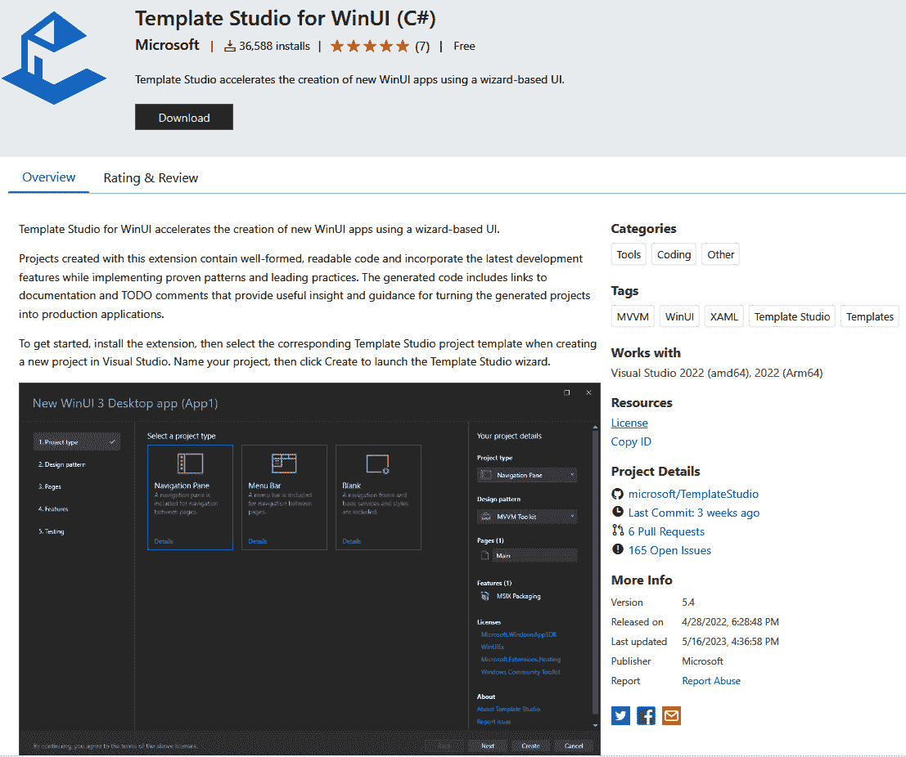

图 10.1 – Visual Studio Marketplace 中的 Template Studio for WinUI

我们将在本章中使用**管理扩展**对话框来安装扩展。有关在 Visual Studio 中管理扩展的详细信息，请参阅 Microsoft Learn 上的此文档：[`learn.microsoft.com/visualstudio/ide/finding-and-using-visual-studio-extensions`](https://learn.microsoft.com/visualstudio/ide/finding-and-using-visual-studio-extensions)。

注意

如果您对 Visual Studio 扩展包或 VSIX 的内部工作原理感兴趣，您可以在 Microsoft Learn 上了解更多信息：[`learn.microsoft.com/visualstudio/extensibility/anatomy-of-a-vsix-package`](https://learn.microsoft.com/visualstudio/extensibility/anatomy-of-a-vsix-package)

扩展生成的代码将继续在您构建新创建的项目时引导您。其中包含带有指导的 *TODO* 注释，说明您在哪里添加自己的代码，以及指向解释代码中使用的概念和控制方式的文档的有用链接。该扩展会频繁更新，以反映最新的 WinUI 功能、实践和针对 Windows 开发者的建议。

对 GitHub 上 Template Studio 项目的贡献都将经过审查，以确保它们遵循良好的编码风格、流畅的设计和全过程的帮助性注释。

现在我们已经回顾了 WinUI Template Studio 的一些基础知识，让我们直接使用扩展创建一个新项目。

# 使用 Template Studio 开始新的 WinUI 项目

在本节中，我们将使用 Template Studio for WinUI 创建一个新的 WinUI 项目。我们将安装扩展，创建具有多个页面和功能的 projek，然后运行项目以探索在添加任何自己的代码之前提供的内容。在下一节中，我们将更深入地研究生成的代码，看看如果我们正在构建一个生产应用程序，我们将从哪里开始扩展和增强项目：

1.  要开始，打开 Visual Studio 并选择 **无代码继续** 以打开 IDE 而不加载解决方案：

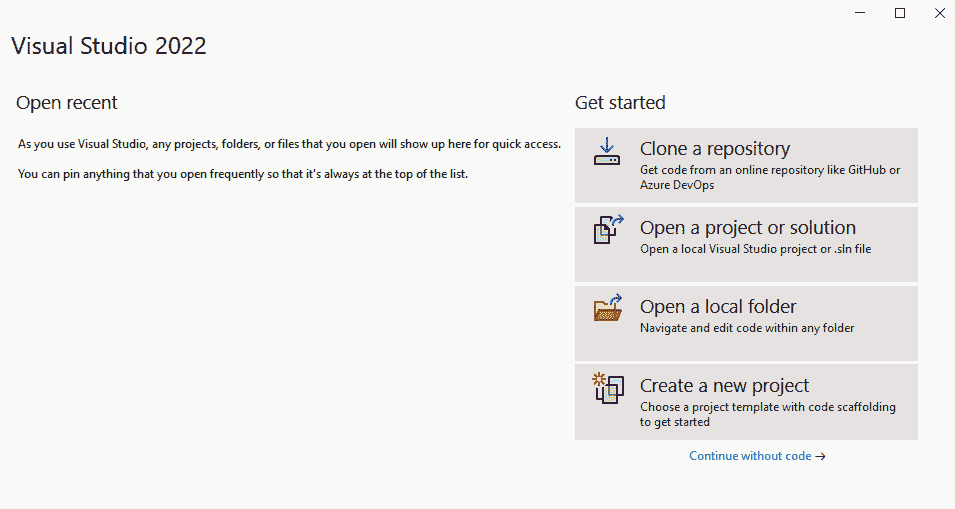

图 10.2 – Visual Studio 2022 启动对话框

1.  在菜单中，选择 **扩展** | **管理扩展** 以打开 **管理扩展** 对话框：

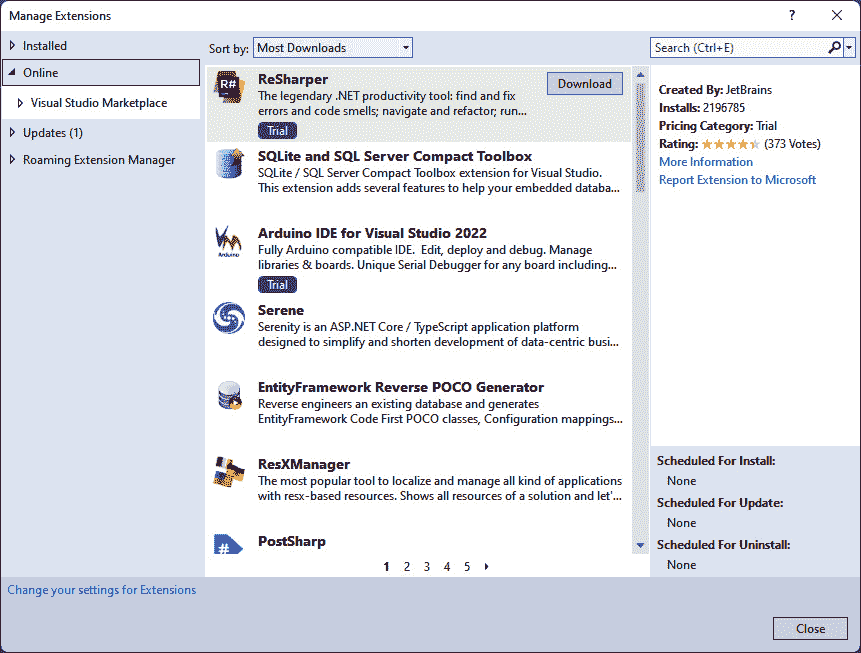

图 10.3 – Visual Studio 中的管理扩展对话框

1.  在 `template studio`。在搜索结果列表中，选择 **下载** **WinUI (C#) 的模板工作室**：

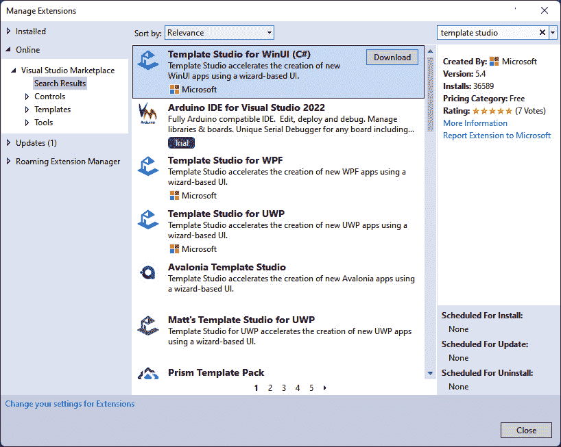

图 10.4 – 从管理扩展安装模板工作室 for WinUI

您需要重新启动 Visual Studio 以完成扩展的安装。

1.  安装完成后，启动 Visual Studio 并选择 **创建新项目**。

1.  在 `template studio`。新项目模板应首先出现在结果列表中：

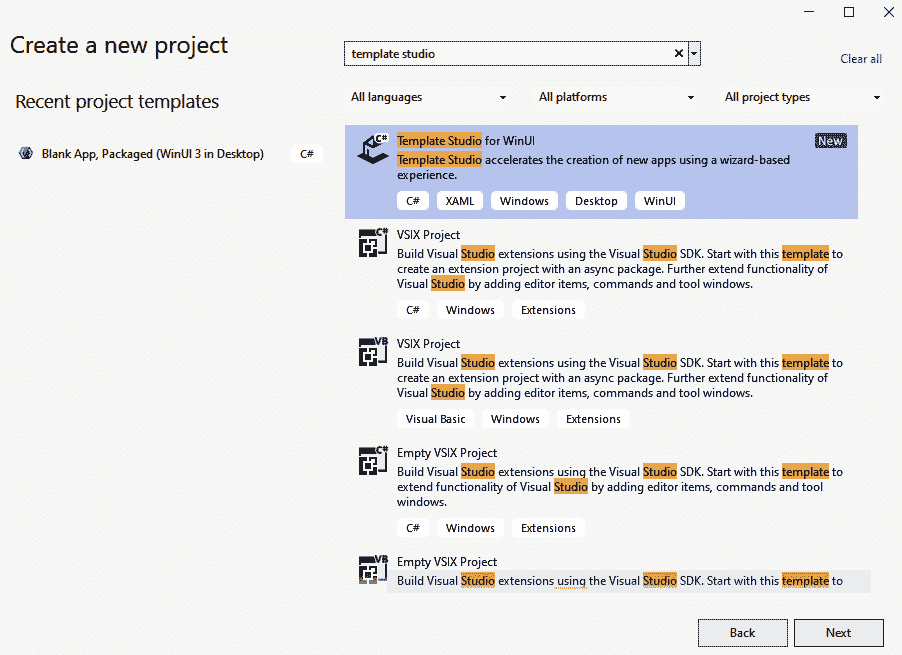

图 10.5 – 选择 WinUI 的模板工作室以创建新项目

1.  选择 `TemplateStudioSampleApp`。

1.  点击 **创建** 继续操作。Visual Studio IDE 不会立即加载，而是会显示模板工作室向导：

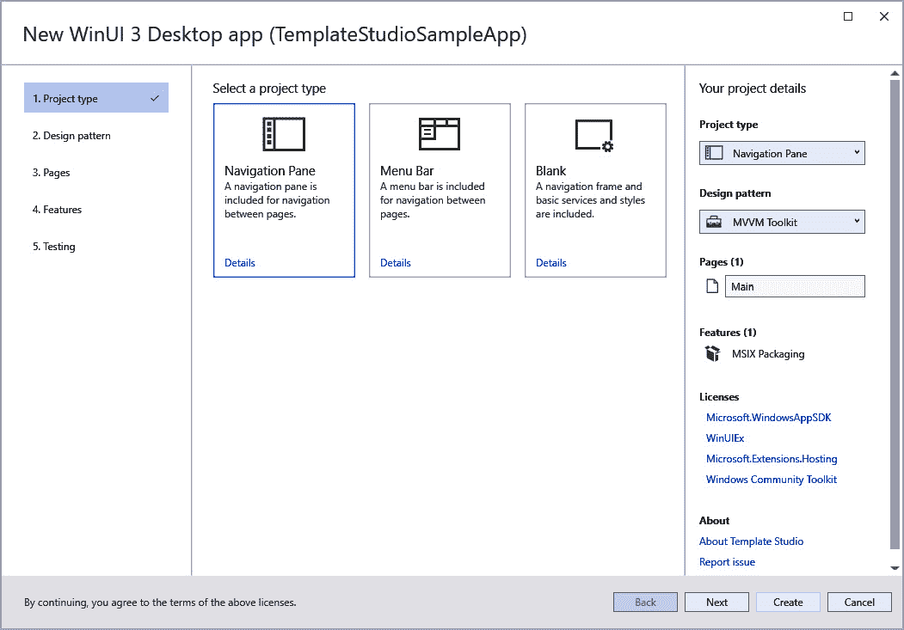

图 10.6 – 模板工作室 for WinUI 的第一页

向导的第一页会提示您选择项目类型。选项包括我们在*第五章*“探索 WinUI 控件”中讨论的 `NavigationView` 控件。它也是 WinUI 3 画廊应用中使用的导航方法。

1.  选择 **下一步** 继续操作。在设计模式屏幕上，唯一可用的选项是 **MVVM Toolkit**。一些版本的模板工作室提供其他 MVVM 框架或 **后置代码** 选项。对于 WinUI 3，我们只有一个选择：

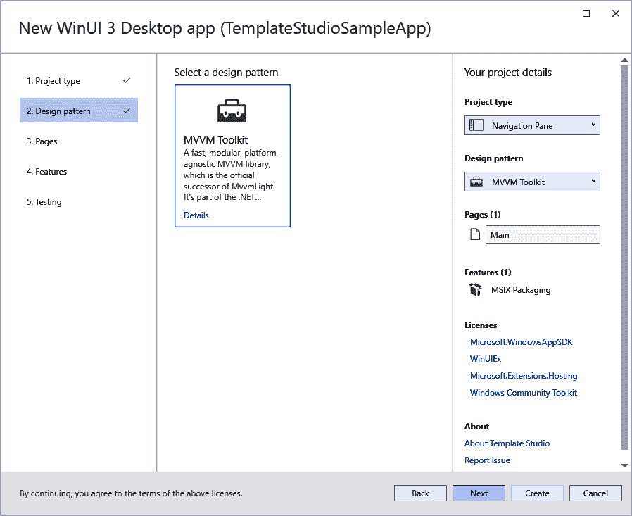

图 10.7 – 设计模式屏幕

您还会注意到右侧面板包含 **您的项目详细信息** 标题以及迄今为止已选择的选项。当您更熟悉模板工作室时，您将能够审查这些选项，并在对默认选择满意的情况下，点击 **创建** 完成向导，而无需访问每个屏幕。

1.  点击 **下一步** 并查看 **页面** 屏幕：

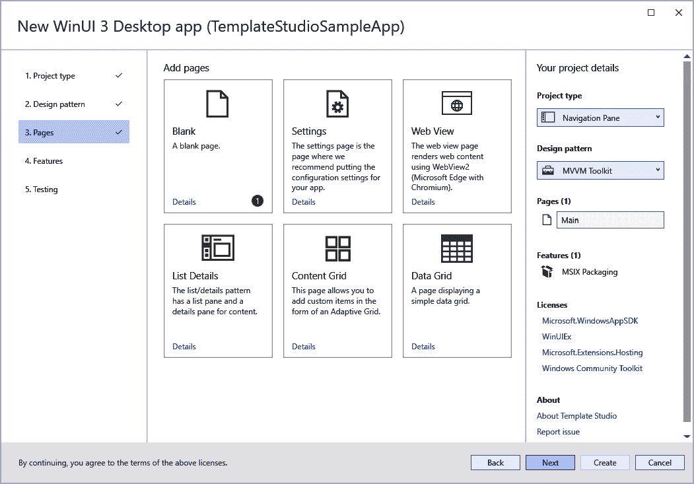

图 10.8 – 模板工作室 for WinUI 的页面屏幕

默认情况下，已选择一个 **空白** 页面。此页面的默认名称为 **Main**。您可以在 **您的项目详细信息** 面板中更改任何页面的名称。

1.  让我们在下一节中选取几个其他页面类型进行审查。选择**数据网格**、**列表详情**、**网页视图**和**设置**。如果您喜欢，还可以选择更多：

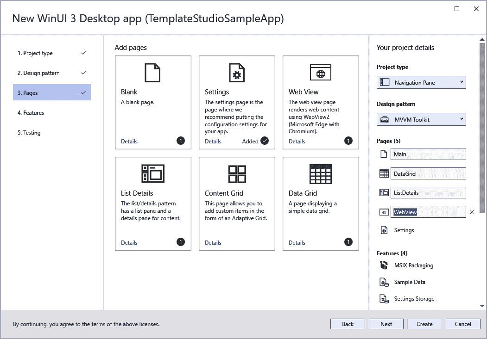

图 10.9 – 为我们的项目选择几个附加页面

除了**设置**之外，任何页面都可以重命名。我们将保留默认名称。

1.  点击**下一步**继续到**功能**屏幕：

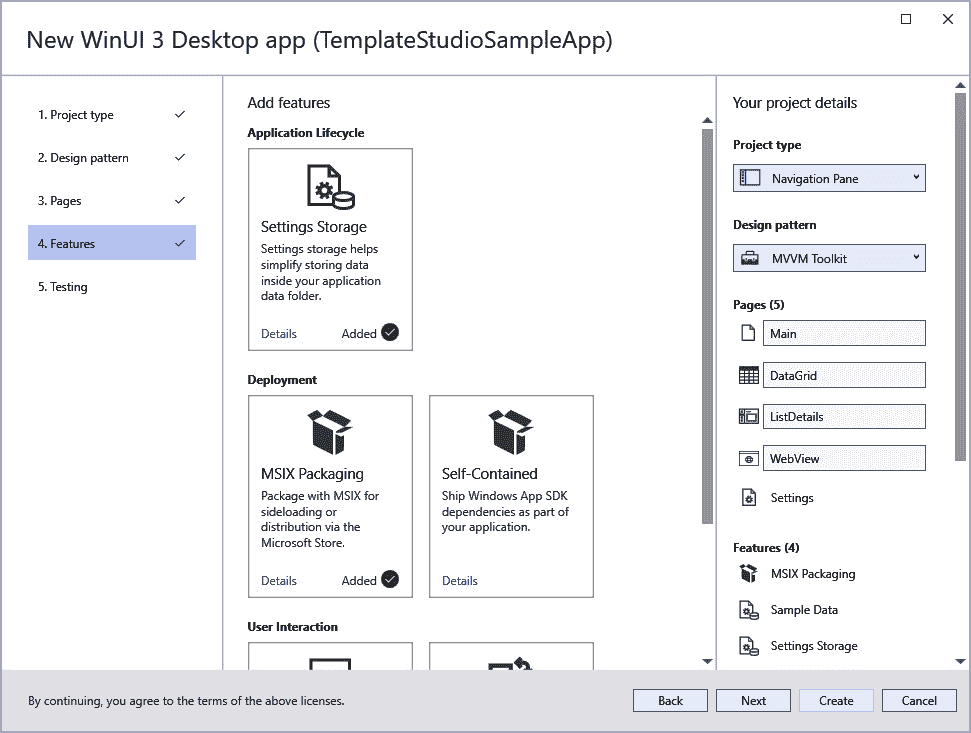

图 10.10 – 探索 WinUI 的 Template Studio 功能屏幕

**功能**屏幕上的默认选择是**设置存储**、**MSIX 打包**和**主题选择**。我们将保留这些默认选择。如果您想将 Windows App SDK 依赖项包含到您的项目中，可以选择**自包含**。如果您打算手动使用**xcopy 部署**分发您的应用程序，这将很有用。我们将在*第十四章*中讨论部署选项，*打包和部署 WinUI 应用程序*。另一个未选择的选项是**应用通知**。我们已经在*第八章*中探讨了通知，*向 WinUI 应用程序添加 Windows 通知*。如果您想了解更多关于任何功能的信息，请选择**详细信息**。

1.  点击**下一步**继续到向导的最终步骤，**测试**：

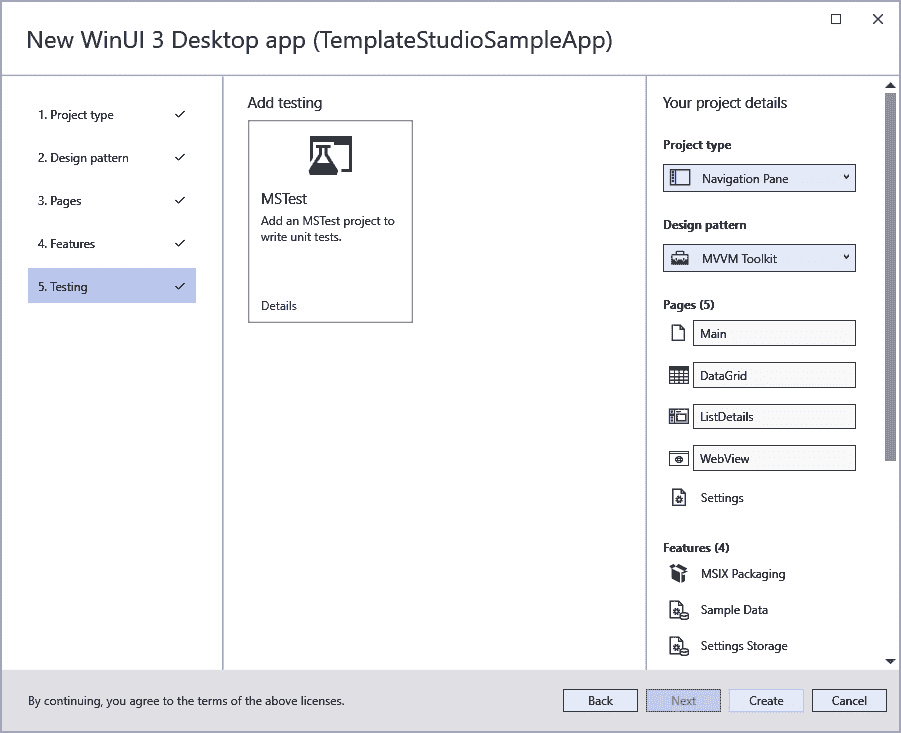

图 10.11 – WinUI 的 Template Studio 向导的测试屏幕

1.  在**测试**屏幕上唯一的选项是**MSTest**。选择它以将单元测试项目添加到您的解决方案中。

1.  我们已经到达了向导的末尾。选择**创建**以创建解决方案并启动 Visual Studio IDE：

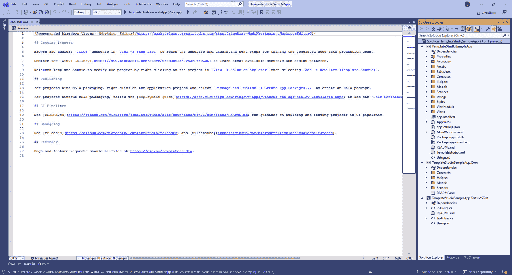

图 10.12 – 加载了我们的新解决方案的 Visual Studio

1.  默认情况下，将打开名为`README.md`的 Markdown 文件。如果您想查看 Markdown 的格式化预览，可以在编辑器窗口的顶部选择**预览**按钮：

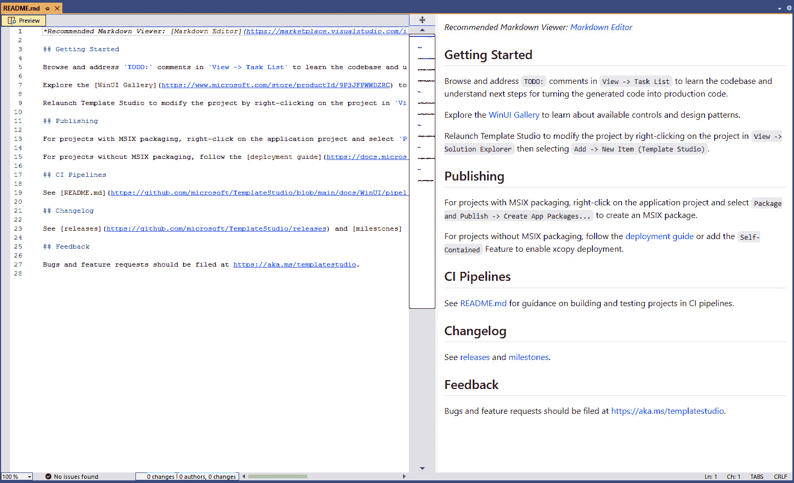

图 10.13 – 查看格式化的 README 文件

该解决方案包含三个项目：**TemplateStudioSampleApp**、**TemplateStudioSampleApp.Core**和**TemplateStudioSampleApp.Tests.MSTest**。我们将在下一节中讨论这些项目的目的和内容：

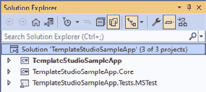

图 10.14 – 在解决方案资源管理器中查看项目

1.  现在是运行应用程序的时候了。开始调试并确保在启动时没有编译时或运行时错误：

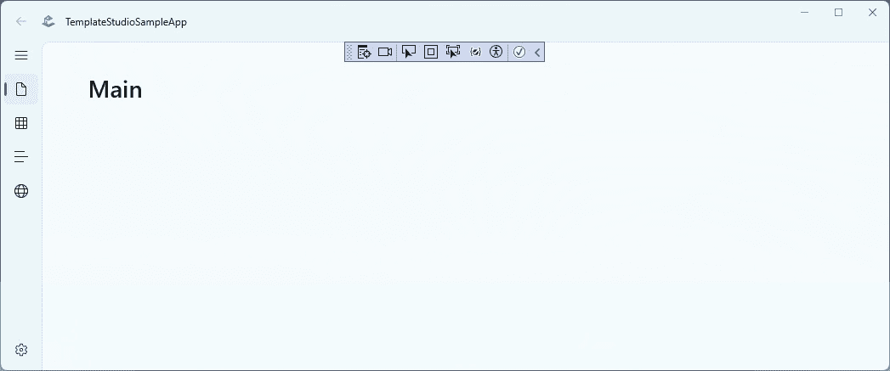

图 10.15 – 运行 TemplateStudioSampleApp 解决方案

所有的内容都应该按预期运行，你可以尝试使用左侧的 `NavigationView` 控件导航到每个页面。**设置**按钮将始终出现在导航栏的底部。

现在我们已经有一个可工作的应用程序，让我们花些时间来了解为我们生成的内容。

# 探索由 Template Studio 生成的代码

是时候回顾新生成的 `README.md` 文件的内容了，其中包括项目概述及其目的。

## 探索核心项目

**TemplateStudioSampleApp.Core** 项目是一个针对 .NET 7 的类库项目。这是放置任何打算在项目间共享的代码的地方。该项目包含四个文件夹：

+   `Contracts`：项目中服务的接口保存在 `Services` 子文件夹中。任何在这个项目中需要的新的接口都应该在这里创建。

+   `Helpers`：这个文件夹包含一个 `Json` 辅助类，其中包含将 **JSON** 字符串和 .NET 对象之间进行转换的方法。将你自己的常用辅助类添加到这个文件夹中。

+   `Models`：这个文件夹中有一些用于在 `DataGridPage` 和 `ListDetailPage` 视图中填充公司和订单数据的示例模型类。

+   `Services`：这个文件夹包含 `FileService` 和 `SampleDataService` 类。`FileService` 类使用 .NET 的 `System.IO` 和 `System.Text` 命名空间中的类读取和写入文件。`SampleDataService` 创建静态数据以填充 UI 的模型类。任何其他共享服务都可以添加到这里。

注意

当这本书出版时，Template Studio 扩展可能已经更新，可以创建 .NET 8 库。

接下来，让我们探索解决方案中最大的项目 **TemplateStudioSampleApp**。

## 探索主要项目

主要项目 **TemplateStudioSampleApp** 是解决方案中三个项目里最大的一个。它包含了所有的用户界面标记和逻辑。在与其他 WinUI 项目合作后，你可能会在项目的根目录中认出这些文件。**App.xaml**、**MainWindow.xaml** 和 **Package.appxmanifest** 都在那里，还有每个 XAML 文件的 C# 代码后文件。

我们在用 Template Studio 向导配置项目时选择的每个页面的 `Page` 和 `ViewModel` 类的内容。还有处理子页面之间导航的 `ShellPage` 和 `ShellViewModel` 类。`NavigationView` 控件是 `MainWindow` 的直接子项。

接下来，让我们浏览剩余文件夹的内容：

+   `Activation`：这个文件夹包含 `ActivationHandler`、`DefaultActivation` 和 `IActivationHandler` 类。它们是使用 `INavigationService` 在 `ShellPage` 内部 `Frame` 中导航到所选页面的辅助类。如果你需要更改默认激活行为，你会创建一个新的继承自 `ActivationHandler` 的处理程序。

+   `Assets`: 这包含项目的图形资产。`Assets` 文件夹存在于每个 WinUI 项目中。

+   `Behaviors`: 此文件夹包含一个名为 `NavigationViewHeaderMode` 的枚举，它指定了导航栏的外观，以及包含实现这些模式的逻辑的 `NavigationViewHeaderBehavior`。行为类从 `Behavior<NavigationView>` 继承。任何其他自定义 WinUI 行为都将添加到这里。

+   `Contracts`: 这是您保存项目接口的地方。两个子文件夹 `Services` 和 `ViewModels` 包含对应项目文件夹中八个现有类的接口。

+   `Helpers`: 任何特定于此项目的辅助类都保存在这里。默认提供的辅助类包括 `NavigationHelper`、`SettingsStorageExtensions` 和 `TitleBarHelper`。`SettingsStorageExtensions` 辅助类利用 `Windows.Storage` 和 `Windows.Storage.Streams` 命名空间中的成员来读取和写入用户设置。

+   `Models`: 示例数据模型保存在 `LocalSettingsOptions` 类中，该类存储设置文件的名称和位置。任何其他与 UI 相关的模型类都将添加到这里。

+   `Services`: `Services` 文件夹中有七个服务类。您可能可以通过其名称确定每个类的用途：`ActivationService`、`LocalSettings` 服务、`NavigationService`、`NavigationViewService`、`PageService`、`ThemeSelectorService` 和 `WebViewService`。您应该花些时间审查这些服务中的代码。

+   `Strings`: 此文件夹包含特定语言的 `Resources.resw` 文件，用于本地化应用程序中显示的任何字符串值。英语语言资源文件可在 `en-us` 文件夹中找到。有关本地化的更多信息，您应该在 Microsoft Learn 上阅读 *本地化您的 WinUI 3 应用程序*：[`learn.microsoft.com/windows/apps/winui/winui3/localize-winui3-app`](https://learn.microsoft.com/windows/apps/winui/winui3/localize-winui3-app)。

+   `Styles`: 此文件夹包含三个包含 XAML `ResourceDictionary` 元素的文件：`FontSizes.xaml`、`TextBlock.xaml` 和 `Thickness.xaml`。以下以 `FontSizes.xaml` 的内容为例：

    ```cs
    <ResourceDictionary
        xmlns="http://schemas.microsoft.com/winfx/
          2006/xaml/presentation"
        xmlns:x="http://schemas.microsoft.com/winfx/
          2006/xaml">
        <x:Double x:Key="LargeFontSize">24</x:Double>
        <x:Double x:Key="MediumFontSize">16</x:Double>
    </ResourceDictionary>
    ```

    通过集中定义应用程序的大或中号字体大小，您可以在以后更改它而无需修改多个 XAML 视图。如果您正在使用 `TextBlock` 或 `RichTextBlock`，字体大小设置的另一种选择是使用在 XAML 主题资源中定义的 **XAML 类型渐变**（在 *第七章*，*Windows 应用程序的流畅设计系统）中讨论过）：[`learn.microsoft.com/windows/apps/design/style/xaml-theme-resources#the-xaml-type-ramp`](https://learn.microsoft.com/windows/apps/design/style/xaml-theme-resources#the-xaml-type-ramp)。

在我们继续探索 `App.xaml.cs` 文件之前。这里的一切都应该对您来说都很熟悉。项目使用 `IHostBuilder.ConfigureServices` 方法添加 `ActivationHandler` 以及所有服务、视图和 ViewModel 类到 DI 容器中。服务和核心服务作为单例对象添加，而所有其他类都使用 `AddTransient` 添加。

`App` 类还有一个方便的辅助方法，可以从 DI 容器中获取实例：

```cs
public static T GetService<T>() T : class
{
    if ((App.Current as App)!.Host.Services.GetService
      (typeof(T)) is not T service)
    {
        throw new ArgumentException($"{typeof(T)} needs to
          be registered in ConfigureServices within
            App.xaml.cs.");
    }
    return service;
}
```

这封装了一些异常处理逻辑，以防请求的类型找不到，从而减少了在整个应用程序中重复此代码的需要。

注意每个类都有有用的注释，其中包含指向 Microsoft Learn 资源的相关 API 或其他主题的链接。`App` 类包含指向 .NET 依赖注入、日志记录和其他学习资源的链接。

让我们通过快速查看由 Template Studio 创建的 **MSTest** 项目来结束本节。

## 探索 MSTest 项目

`TestClass`、一个 `README.md` 文件，以及 `Initialize` 和 `Usings` 类。您应该仔细阅读 `README.md` 文件。它包含有关项目、测试 UI 元素、依赖注入和模拟的信息。其中包含如何利用 DI 和模拟来测试 `SettingsViewModel` 的示例，而无需实际读取或写入文件系统中的任何设置。

`TestClass` 包含了在类和测试级别进行测试初始化和清理的示例，以及两个示例测试方法：`TestMethod` 和 `UITestMethod`：

```cs
[TestMethod]
public void TestMethod()
{
    Assert.IsTrue(true);
}
[UITestMethod]
public void UITestMethod()
{
    Assert.AreEqual(0, new Grid().ActualWidth);
}
```

任何带有 `UITestMethod` 属性装饰的测试方法都会在 UI 线程上运行。生成的代码尚未测试 `TemplateStudioSampleApp` 或 `TemplateStudioSampleApp.Core` 项目中的任何成员。添加您自己的测试方法来执行此操作取决于您。您可以通过阅读 Microsoft Learn 上的 Visual Studio 单元测试文档开始：[`learn.microsoft.com/visualstudio/test/getting-started-with-unit-testing`](https://learn.microsoft.com/visualstudio/test/getting-started-with-unit-testing)。

在下一节中，我们将讨论由 Microsoft 和第三方创建的一些其他 Template Studio 扩展。

# Template Studio 为其他 UI 框架提供的扩展

我们已经深入探讨了 Template Studio for WinUI 扩展，但关于 UI 框架呢？正如我们在本章前面提到的，Microsoft 还维护了 Template Studio for WPF 和 Template Studio for UWP 的扩展。实际上，他们甚至有一个 **Microsoft Web Template Studio** 可用：[`github.com/microsoft/WebTemplateStudio`](https://github.com/microsoft/WebTemplateStudio)。它支持前端使用 **React**、**Angular** 或 **Vue.js**，以及后端框架使用 **Node.js**、**Flask**、**Molecular** 和 **ASP.NET Core**。如果您对 Web 开发感兴趣，您应该去看看。

此外，还有一个名为**MAUI 应用加速器**的扩展（[`marketplace.visualstudio.com/items?itemName=MattLaceyLtd.MauiAppAccelerator`](https://marketplace.visualstudio.com/items?itemName=MattLaceyLtd.MauiAppAccelerator)），这是 Template Studio 的 .NET MAUI 版本。在本章中，我们将继续关注 WinUI 和 WPF 模板。我们将最后审查的两个是 Template Studio for WPF 和与 Visual Studio 的 Uno Platform 扩展一起提供的 Template Studio 风格向导。让我们从 WPF 开始。

## Template Studio for WPF

Template Studio for WPF 扩展（[`marketplace.visualstudio.com/items?itemName=TemplateStudio.TemplateStudioForWPF`](https://marketplace.visualstudio.com/items?itemName=TemplateStudio.TemplateStudioForWPF)）与其 WinUI 对应版本类似。向导中有一个额外的步骤（**服务**），并且在一些页面上有一些不同的选项。WPF 开发者可用的项目类型之一是**功能区**类型。这将在标准菜单控件的位置创建一个带有 Microsoft Office 风格功能区控件的壳。

**设计模式**界面允许您选择**代码后置**或**Prism**，除了**MVVM 工具包**选项。虽然**页面**选项与 WinUI 相同，但**功能**界面有一个可以在单独窗口中显示多个视图的选项。**服务**界面有两个与身份相关的选项：**强制登录**和**可选登录**。最后，**测试**界面有七个不同的选项，而不仅仅是**MSTest**。提供的附加测试框架包括 **NUnit**、**xUnit** 和 **Appium**（用于 UI 测试），并且有为主项目和**核心**库项目添加测试项目的选项。

生成的项目结构与 WinUI 项目相同。以下是一个包含空功能区控件的生成 WPF 项目的示例：

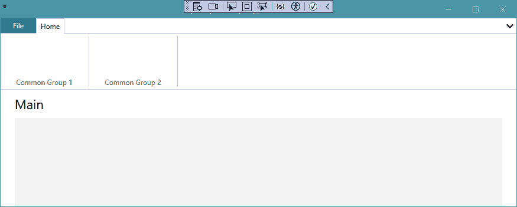

图 10.16 – 由 Template Studio 创建的 WPF 项目

让我们通过查看 Uno Platform 扩展提供的 Template Studio 向导来完成。

## Template Studio for Uno Platform

**Uno Platform** ([`platform.uno/`](https://platform.uno/)) 是一个使用 WinUI XAML 和 .NET 代码的 UI 框架，它可以创建针对今天几乎每个可用设备平台的程序：Windows、iOS、Android、macOS、Tizen、Web（使用 **WebAssembly**），甚至 Linux。Visual Studio 的 Uno Platform 扩展（[`marketplace.visualstudio.com/items?itemName=unoplatform.uno-platform-addin-2022`](https://marketplace.visualstudio.com/items?itemName=unoplatform.uno-platform-addin-2022)）包括一个基于 Template Studio 代码的新项目向导。

如果您在 Visual Studio 中安装扩展并使用 **Uno Platform App** 模板创建新项目，从 **配置您的项目** 屏幕中点击 **创建** 按钮将启动向导：

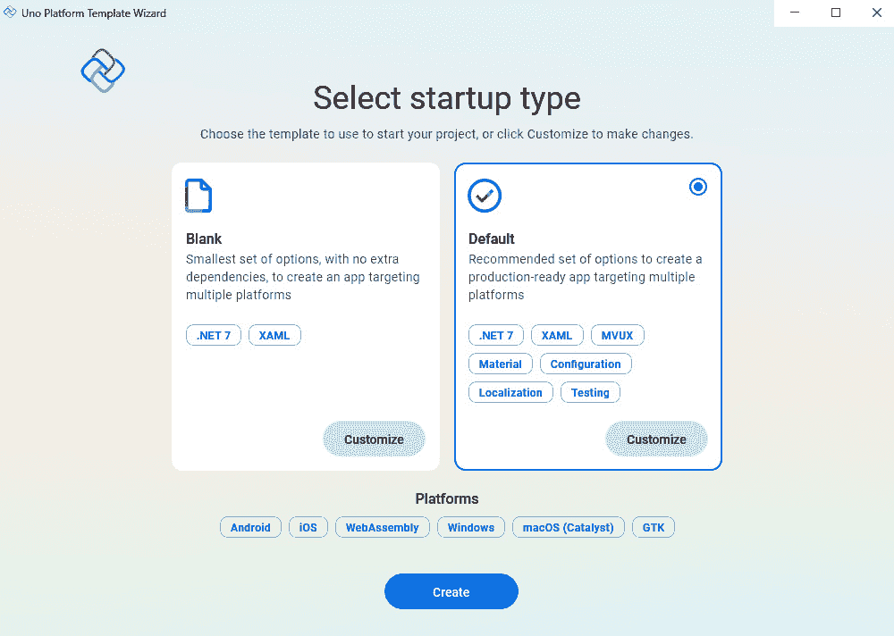

图 10.17 – Uno Platform 新项目屏幕

从这里，您可以简单地选择 **创建** 以接受所有默认设置并生成新解决方案。但是，如果您选择 **默认** 启动类型中的 **自定义** 按钮，您将获得完整的向导体验：

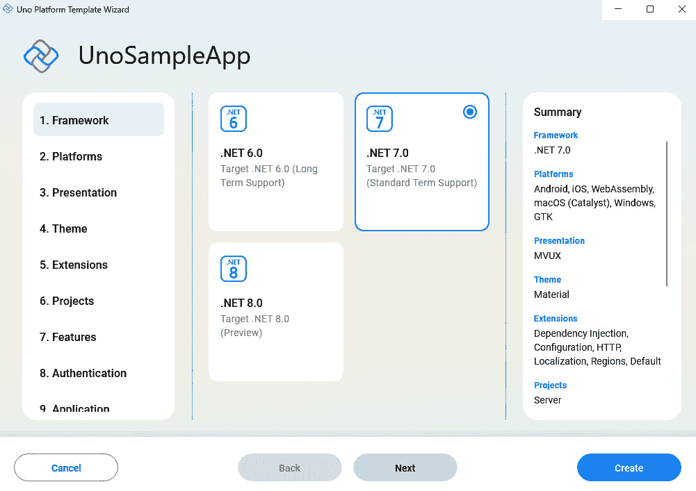

图 10.18 – Uno Platform 新项目向导

从这里，您可以从 10 个不同类别的选项中进行选择。尽管向导的样式略有不同，但您可以看到它与 Template Studio 扩展有相同的起源。当我们在 *第十三章*，*使用 Uno Platform 将您的应用程序跨平台化* 中构建 Uno Platform 应用程序时，我们将详细介绍向导的每个步骤。如果您使用默认设置创建新的 Uno Platform 项目并运行 **UnoApp1.Wasm** 项目，您将看到您的应用程序通过利用 WebAssembly 在浏览器中运行：

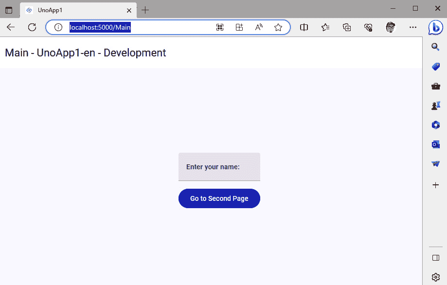

图 10.19 – 在浏览器中运行 Uno Platform 应用程序

这非常酷！现在让我们总结并回顾本章所学的内容。

# 摘要

在本章中，我们学习了 Template Studio for WinUI 扩展如何在新开始 WinUI 项目时节省时间并推广良好的模式和习惯。我们通过向导创建了一个新的 WinUI 项目，并探索了新解决方案中生成的代码。理解解决方案组件的结构和目的将使您更容易将其扩展到自己的项目中。我们通过讨论可用于其他 UI 框架（如 WPF 和 Uno Platform）的 Template Studio 扩展来结束讨论。

在下一章中，*第十一章*，*使用 Visual Studio 调试 WinUI 应用程序*，我们将探讨 Visual Studio 提供的工具和选项，以使 .NET 和 XAML 开发者的生活更加轻松。

# 问题

1.  在 Template Studio for WinUI 中创建测试项目时使用哪种单元测试框架？

1.  Template Studio for WinUI 中哪种项目类型实现了 `NavigationView` 控件？

1.  Template Studio for UWP 的之前名称是什么？

1.  Template Studio for WinUI 在生成项目时使用哪种 MVVM 框架？

1.  Visual Studio 扩展使用哪种文件格式？

1.  如果您需要将 Linux 作为目标平台之一，可以使用哪个 Template Studio 扩展来创建新项目？

1.  哪个文件夹包含由 Template Studio for WinUI 生成的主项目所有接口？

# 第三部分：在 Windows 上构建和部署以及更多

本部分通过探索调试、构建和部署 WinUI 3 应用程序的技术来完善您的 WinUI 知识。您将了解 Visual Studio 为 WinUI 开发者提供的丰富调试工具。然后，您将看到如何利用 Blazor、Visual Studio Code、GitHub Actions 和 WebView2 控件在 WinUI 应用程序内托管 Web 应用程序。我们还将学习如何将 WinUI 项目迁移到 Uno Platform 以在多个平台上运行，包括 Android 和 WebAssembly。最后，您将了解使用 Visual Studio、Microsoft Store 和 Microsoft 的命令行安装程序 Windows Package Manager (WinGet)构建和部署 WinUI 应用程序的选项。

本部分包含以下章节：

+   *第十一章*, *使用 Visual Studio 调试 WinUI 应用程序*

+   *第十二章*, *在 WinUI 中托管 Blazor 应用程序*

+   *第十三章*, *使用 Uno Platform 实现应用程序跨平台*

+   *第十四章*, *打包和部署 WinUI 应用程序*
