# 使用 Visual Studio 调试 WinUI 应用程序

良好的调试技能对于开发者至关重要。虽然.NET 开发者需要了解如何使用包括断点和**输出**以及**立即**窗口在内的功能，但 WinUI 项目调试增加了另一套需要掌握的工具和技术。在 UI 层中可能会出现与数据绑定、布局和资源相关的问题。你将学习如何使用**实时视觉树**和**实时属性探索器**，以及如何使用 Visual Studio 的**XAML 绑定****失败**窗口发现数据绑定错误。

在本章中，我们将涵盖以下主题：

+   如何调试 WinUI 应用程序并与 ViewModel 和服务类中的断点一起工作

+   如何通过利用 Visual Studio 中的**XAML 绑定失败**窗口来调试数据绑定失败，并避免在绑定到集合时遇到常见问题

+   在 Visual Studio 中探索**实时视觉树**窗口以找到你的 XAML 中的布局问题

+   发现并使用**实时属性探索器**在运行时获取和设置你的 XAML 元素中的数据

到本章结束时，你将能够舒适地调试 WinUI 开发者在开发应用程序时通常遇到的常见问题。你将能够在构建其他 XAML 框架（如.NET MAUI、WPF 和 UWP）的应用程序时使用这些技能。

# 技术要求

要跟随本章中的示例，需要以下软件：

+   Windows 10 版本 1809（构建 17763）或更高版本或 Windows 11

+   配置了 Windows App SDK 开发的 Visual Studio 2022 或更高版本

本章的源代码可在以下 GitHub URL 处获取：[`github.com/PacktPublishing/Learn-WinUI-3-Second-Edition/tree/master/Chapter11`](https://github.com/PacktPublishing/Learn-WinUI-3-Second-Edition/tree/master/Chapter11)。

# 在 Visual Studio 中调试

在本节中，我们将涵盖调试 WinUI 应用程序的几个基本领域。其中一些技术适用于调试其他类型的.NET 应用程序，而其他技术则特定于 XAML 和 WinUI 开发。在整个书中，我们使用 Visual Studio 运行我们的项目，这是一个本地调试会话的例子。我们还将探讨其他调试本地应用程序以及远程应用程序的方法。

在编写 XAML 标记时，简单的错误并不总是显而易见，这种问题也不会被编译器检测到。在本节中，我们将看到如何检测和避免 XAML 标记问题，以及如何遵循最佳实践。

让我们从更仔细地查看调试本地应用程序开始。

## 调试本地应用程序

从 GitHub 打开**Ch11-MyMediaCollection**项目并编译它，以确保你已下载所有引用的 NuGet 包。这是我们之前章节中一直在构建的 WinUI 3 项目。运行应用程序以确保一切按预期工作。

注意

如果您有开发和使用 WPF 或 UWP 应用程序的调试经验，您可能熟悉 Visual Studio 中的**XAML 设计器**。目前 WinUI 3 应用程序没有设计器支持。不清楚这个功能是否会添加，以及何时会添加。GitHub 上关于这个话题有一些讨论：[`github.com/microsoft/microsoft-ui-xaml/issues/5917`](https://github.com/microsoft/microsoft-ui-xaml/issues/5917)。问题中的一个评论建议，您可以通过利用 Visual Studio 中的**XAML 热重载**来尝试解决这个问题，以便在调试时更改 XAML 文件。虽然这种方法有一些限制（见[`github.com/microsoft/microsoft-ui-xaml/issues/7043`](https://github.com/microsoft/microsoft-ui-xaml/issues/7043)），但大多数简单的 XAML 更改在保存时都会反映在运行的应用程序中。有关 XAML 热重载的更多信息，请参阅 Microsoft Learn 文档：[`learn.microsoft.com/visualstudio/xaml-tools/xaml-hot-reload`](https://learn.microsoft.com/visualstudio/xaml-tools/xaml-hot-reload)。

在我们的第一次演练中，让我们看看如何调试您 PC 上安装的本地应用程序。

### 调试本地安装的应用程序

我们一直在本书中运行和调试我们的 Visual Studio 解决方案。现在我们将看看您如何调试已安装在 Windows 中的应用程序。

您在阅读本书时已经运行了几个项目。除非您已卸载它们，否则每个项目都应显示为可调试的已安装应用程序包。让我们从以下步骤开始：

1.  在 Visual Studio 中，首先选择**调试** | **其他调试目标** | **调试已安装应用程序包**。将出现**调试已安装应用程序包**窗口：

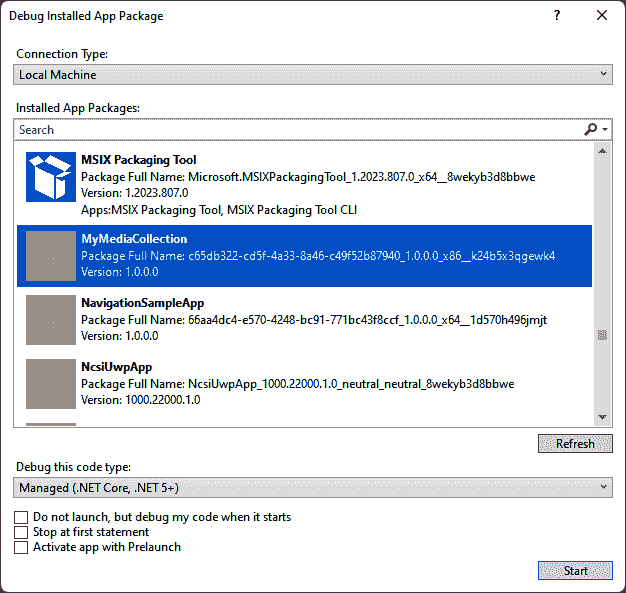

图 11.1 – 调试已安装应用程序包窗口

此窗口将显示您 Windows PC 上安装的所有软件包。一些名称您可能很熟悉，例如**Microsoft.WindowsTerminal**、**Fluent XAML Theme Editor**或**Microsoft Defender**。其他名称可能只以应用程序 ID 列出。您可以选择这些其他应用程序进行调试，但没有调试符号，您将无法设置断点或逐步执行代码。让我们找到我们的一个应用程序。

1.  如果您已经调试了`MyMediaCollection`。**MyMediaCollection**应用程序将出现在搜索结果中。如果您看不到它，请确保您至少从 Visual Studio 运行了该应用程序一次。这一步是必要的，以便将应用程序打包并部署到 Windows。

1.  选择它并点击**开始**。应用程序将运行，Visual Studio 将开始调试。

    如果您不想立即开始调试，您可以选择**不启动，但启动应用程序时调试我的代码**复选框。现在，当您从**开始**菜单或任何其他方法启动应用程序时，Visual Studio 将开始调试。

另一种开始调试已安装的本地应用程序的方法是将它附加到正在运行的应用程序：

1.  首先，从**开始**菜单运行应用程序，然后在 Visual Studio 中转到**调试** | **附加** **到进程**。

1.  在标题与您要调试的应用程序匹配的 `ApplicationFrameHost.exe` 进程中。这是在 Windows 上托管每个打包的 WinUI 和 UWP 应用程序的过程：

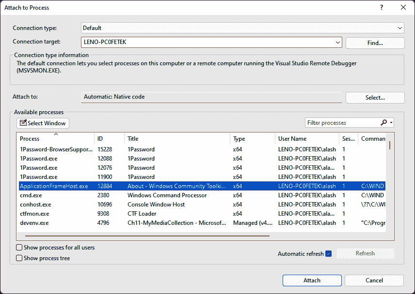

图 11.2 – 附加到正在运行的过程以调试打包的应用程序

1.  点击**附加**并像往常一样开始调试。

这些是启动本地应用程序调试会话的不同方法，但如果你想在另一台机器上调试你的应用程序怎么办？让我们接下来检查那些选项。

## 调试远程应用程序

您可能有很多原因想在远程机器上调试应用程序。有时您只能在某个设备上重现错误。也许存在仅在特定设备类型或屏幕尺寸上出现的问题。如果您正在处理 UWP 项目，有些设备，如 Xbox，您必须使用远程调试。

注意

在开始任何远程调试会话之前，请确保目标设备已启用**开发者模式**。有关激活开发者模式的更多信息，您可以阅读这篇 Microsoft Docs 文章：[`learn.microsoft.com/windows/apps/get-started/enable-your-device-for-development`](https://learn.microsoft.com/windows/apps/get-started/enable-your-device-for-development)。

要调试远程已安装的应用程序，您将再次使用 Visual Studio 的**调试已安装应用程序包**窗口：

1.  从**调试** | **其他调试目标** | **调试已安装** **应用程序包**打开窗口。

1.  将**连接类型**更改为**远程机器**：

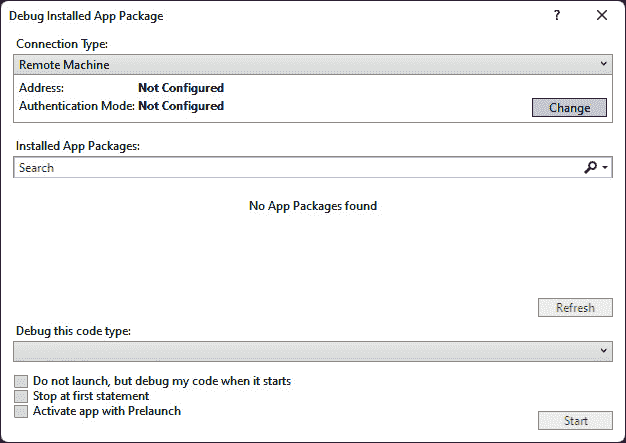

图 11.3 – 在远程机器上调试应用程序包

1.  点击**连接类型**部分的**更改**按钮以打开**远程** **连接**窗口。

1.  Visual Studio 将尝试发现其他 Windows 设备并将它们列在**自动检测**部分。如果您看到您想要的设备，请选择它以继续。如果您要调试的设备没有显示，请在**手动配置**部分的**地址**字段中输入其 IP 地址，然后点击**选择**：

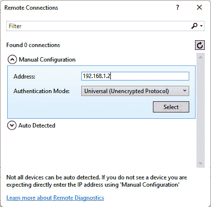

图 11.4 – 为调试手动配置远程连接

1.  当你返回到之前的窗口时，你可以从所选设备上安装的应用程序包列表中选择要调试的应用程序。

1.  点击**开始**以开始调试，就像我们在上一节中在本地安装的应用程序中做的那样。

这些技术将允许您连接到其他 Windows 机器。对于 UWP 应用程序，这包括其他设备类型，例如 Xbox、HoloLens、Surface Hub 和 Windows IoT 设备。您还可以从项目的 **属性** 页面的 **调试** 选项卡访问调试选项和资源。选择 **打开调试启动配置文件 UI** 以打开 **启动** **配置文件** 窗口：

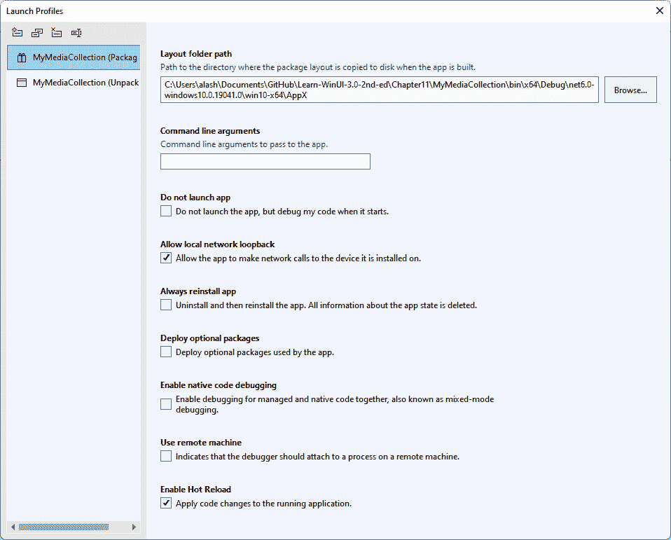

图 11.5 – Visual Studio 中的启动配置文件窗口

让我们转换一下思路，来检查一些可能导致应用程序 UI 出现渲染问题的常见错误。

## 常见的 XAML 布局错误

XAML 开发者在编码 UI 时可能会犯许多种错误。其中一些错误不会被编译器捕获。如果您有语法错误或无效的 `x:Bind` 表达式，这些错误将在编译时失败，但许多其他问题则不会。

我们将要探索的第一个常见 XAML 布局错误的来源是 `Grid` 控件。

### 网格布局问题

一些与 `Grid` 控件相关的错误围绕着其行和列。忘记在子控件上设置 `Grid.Row` 或 `Grid.Column` 会导致运行时重叠或遮挡元素。当设置这些值不正确或处理 `Grid.RowSpan` 和 `Grid.ColumnSpan` 时，也会出现类似的问题。一个不一定立即显而易见的错误是将 `Grid.Row` 或 `Grid.Column` 设置为一个超出定义的行或列数的值。

从包含页面底部按钮控件的 `Border` 控件中打开 `Grid.Row` 属性。如果您运行应用程序，您将看到按钮移动到页面顶部并覆盖标题区域中的控件。

现在恢复 `Grid.Row` 属性，但将值更改为 `5`。如果这是网格中的最后一行，一切看起来都会很好，即使 `Grid` 只有三行。由于 `5` 大于可用的行数，控件被添加到 `Grid` 的最后一行。然而，因为我们有 `InfoBar` 在第四行的按钮下方，所以按钮和 `InfoBar` 发生了重叠。

### 应用样式时的问题

XAML 的 `Style` 资源是另一个常见的无意中导致 UI 变化的来源。在 `Resource` 中创建 `Style` 时，您应该意识到它将如何应用于该 `Resource` 范围内的控件。

打开 `Page.Resources` 部分。这是我们为当前页面创建了三个 `Style` 元素的地方。每个都有不同的 `Target` 类型：`TextBlock`、`TextBox` 和 `ComboBox`。然而，它们不会应用于 `Page` 上这些类型的每个控件，因为我们还给了每个 `Style` 一个 `x:Key`。这意味着只有当 `Style` 属性明确设置为该命名资源时，`Style` 才会应用于该类型的元素。这些被称为 *显式样式*：

```cs
<TextBlock Text="Name:" Style="{StaticResource
  AttributeTitleStyle}"/>
```

如果您从 `Page.Resources` 中的 `Style` 移除 `x:Key`，那么这种 *隐式样式* 将应用于 `Page` 上指定 `Target` 类型的每个控件，除非这些控件已设置了另一个显式 `Style`。在一个具有在不同作用域（`Application`、`Page` 或控件）中声明的样式的应用程序中，有时很难确定应用于控件的样式。我们将在本章后面讨论 Visual Studio 的 **实时属性浏览器** 窗口时看到如何做到这一点。让隐式样式始终继承自显式样式是一种最佳实践。这使开发者能够从默认样式继承，并减少元素间重复的隐式样式属性。

接下来，我们将查看一个第三方扩展，它可以通过 **静态** **代码分析**来帮助找到常见的 XAML 问题。

## 通过静态代码分析改进您的 XAML

有一个免费的、开源的 Visual Studio 扩展，它提供了对 XAML 文件进行静态代码分析的支持。**Rapid XAML Toolkit** ([`rapidxaml.dev/`](https://rapidxaml.dev/)) 提供了针对常见问题的 XAML 分析器和代码修复，并支持添加您自己的自定义 XAML 分析器。

注意

在撰写本文时，Visual Studio 2022 的 Rapid XAML 工具包尚未发布。它正在开发中，并应在您阅读本书时可用。当前示例说明了如何使用目前适用于 Visual Studio 2019 的扩展。

让我们在 Visual Studio 中安装这个工具，看看它能在 WinUI 项目中识别出哪些问题：

1.  在 Visual Studio 中，转到 **扩展** | **管理扩展**。

1.  `rapid xaml`:

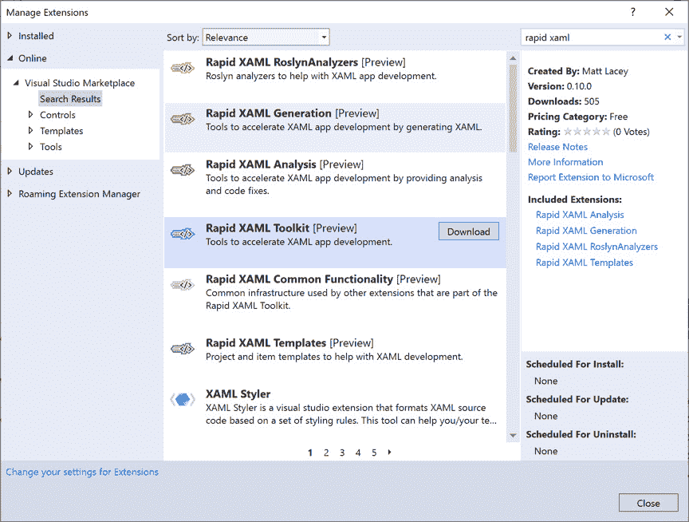

图 11.6 – 安装 Rapid XAML 工具包

1.  点击 **下载** 将扩展排队以进行安装。下载完成后，您可以关闭 **管理扩展** 窗口，重新启动 Visual Studio 以完成安装。

1.  现在，当您在 Visual Studio 中查看 **错误列表** 窗口时，会有一些来自 Rapid XAML 分析器的警告：

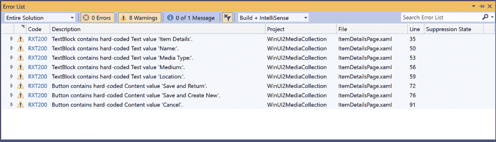

图 11.7 – 查看 Rapid XAML 工具包的新警告

1.  打开 **ItemDetailPage.xaml**，将光标移至由代码分析器创建的绿色波浪线之一，然后点击灯泡图标：

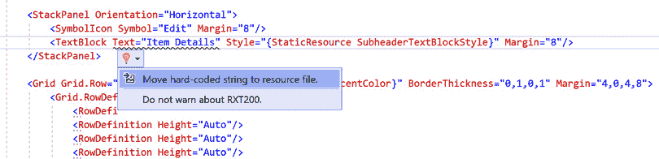

图 11.8 – 查看代码分析器警告的快速修复

或者，您也可以在 XAML 上右键单击，选择 **Rapid XAML** | **将硬编码字符串移动到资源文件**，以修复此类警告的所有问题。

这是工具包提供的其他分析器的列表：

+   `Grid.Row` 值没有对应的 `RowDefinition`

+   `Grid.Column` 值没有对应的 `ColumnDefinition`

+   `Grid.RowSpan` 值没有对应的 `ColumnDefinition`

+   `Grid.ColumnSpan` 值没有对应的 `ColumnDefinition`

+   `TextBox` 没有指定 `InputScope`

+   `SelectedItem` 绑定可能应该是 `TwoWay`

+   **RXT200**：应该是资源的硬编码字符串值

+   `Entry` 没有指定 `Keyboard`

+   指定了 `MaxLength`

+   `Image` 缺乏无障碍考虑

+   `ImageButton` 缺乏无障碍考虑

+   `CheckBox` 的 `Checked` 和 `Unchecked` 事件

+   使用 `MediaPlayerElement` 替代 `MediaElement`

+   `x:Uid` 应该以大写字母开头

+   `Name` 应该以大写字母开头

+   **RXT999**：未知错误 – 解析 XAML 文档时出错

Rapid XAML Toolkit 除了分析器和代码修复之外还有许多其他功能，并且经常添加新功能和分析器。要查看即将推出功能和修复的列表，您可以查看 GitHub 上的问题：[`github.com/mrlacey/Rapid-XAML-Toolkit/issues`](https://github.com/mrlacey/Rapid-XAML-Toolkit/issues)。

注意

像这样的社区驱动项目始终在寻找贡献者。这是开始参与开源社区的一个好方法。

另一个可能成为开发者烦恼来源的相关主题是调试数据绑定。让我们看看在下节中如何避免一些常见的陷阱。

# 精确定位数据绑定失败

虽然在 WinUI 和 UWP 中调试数据绑定问题不像在 WPF 中（如果你使用 `x:Bind` 编译的绑定）那么困难，但仍有一些需要注意的陷阱。在本节中，我们将探讨在视图和 ViewModels 中可能发生的问题，以及如何诊断和修复这些问题。

## 数据绑定中的常见错误

如果你使用 `x:Bind`，编译器将评估你是否绑定到有效的源，并可以让你放心地知道你的视图和 ViewModels 是否正确连接，但仍有许多可能出错的地方。让我们回顾一些最常见错误。

### 选择最佳绑定模式

我们在前面章节中看到，大多数带有 `x:Bind` 的控件默认模式是 `OneTime`，而 `Binding` 的默认模式是 `OneWay`。默认为 `OneTime` 有助于性能，因为许多只读属性仅在视图首次创建时设置。然而，如果你忘记更改绑定到用户与页面交互时数据会变化的控件，你可能不会立即意识到为什么 UI 中的数据没有更新。

当你绑定需要数据双向流动的控件时，请记住将 `Mode` 设置为 `TwoWay`。我们曾在 `ComboBox.SelectedItem` 属性中使用它来按媒体类型筛选集合。

### 触发 PropertyChanged 通知

通过绑定到一个正确实现所有公共属性`INotifyPropertyChanged`的 ViewModel，与`PropertyChanged`相关的问题并不常见。使用 MVVM Toolkit 可以使这个过程更加简单。如果 ViewModel 代码更新了这些属性之外的一个属性值，仍然可能会出现问题。这将更新属性值而不通知视图。如果你使用 MVVM Toolkit，它将在生成隐藏的派生类代码时指出这个问题。你可以通过始终使用`public`属性来更新值来避免这种情况。如果没有直接更新属性的好理由，那么在更新值后应该手动触发该属性的`PropertyChanged`事件。使用 C#中的`nameof`方法是最佳实践，以确保你使用存在的属性名称。拼写错误的属性名称将在编译时被捕获并在编辑器中突出显示。你还可以在.NET 中使用`CallerMemberNameAttribute`：[`learn.microsoft.com/dotnet/api/system.runtime.compilerservices.callermembernameattribute`](https://learn.microsoft.com/dotnet/api/system.runtime.compilerservices.callermembernameattribute)。如果你的应用程序尝试为一个不存在的属性触发属性更改通知，将引发异常。

### 使用`ObservableCollection<T>`

`ObservableCollection<T>`扮演着重要的角色。如果使用正确，视图中的列表将与集合保持同步。在使用可观察集合时有一些做法需要避免。

不要替换可观察集合的整个值。绑定到属性的视图元素仍然绑定到原始集合。对集合的任何后续更改都不会反映在视图中。虽然你可以通过触发`PropertyChanged`通知来解决这个问题，但这在大集合中可能会有性能影响。这也可能对用户造成冲击，因为大多数控件都会将当前视图重置为列表的开头。将使用`ObservableCollection<T>`的 ViewModel 属性设置为只读，以避免意外重置整个集合。唯一的例外是如果你知道集合将被完全重新填充。在列表中逐个删除和重新添加大量项目可能会导致用户体验不佳。

不要使用 LINQ 修改可观察集合。LINQ 表达式不是通过在可观察集合上调用`Add`和`Remove`方法来操作的。它们甚至不返回`ObservableCollection<T>`。如果你使用 LINQ 并将结果转换回`ObservableCollection<T>`，你将回到替换整个集合，这正是刚才讨论过的。

这里是一个使用 LINQ 的示例。这将导致视图停止接收`CollectionChanged`通知，因为 LINQ 不返回`ObservableCollection`：

```cs
_entryList = from entry in _entryList
             where entry.Lastname.StartsWith("J")
             Lastname starting with J. By using the Remove method and not changing the entire collection, the CollectionChanged events are preserved:

```

for (int i = _entryList.Count - 1; i >= 0; i--)

{

Entry entry = _entryList[i];

如果 (!entry.Lastname.StartsWith("J"))

{

_entryList.Remove(entry);

}

}

```cs

			Finally, it’s best not to use observable collections for lists that do not change. The extra overhead they bring is not needed for static data. Bind to an `IList<T>`, `IEnumerable<T>`, or better yet, a traditional array of items instead. Check out this *C# 101* video to learn when to leverage arrays, lists, and collections in .NET: [`learn.microsoft.com/shows/csharp-101/csharp-arrays-list-and-collections`](https://learn.microsoft.com/shows/csharp-101/csharp-arrays-list-and-collections).
			Using the XAML Binding Failures window
			Visual Studio 2019 version 16.7 introduced the new `Binding`, not `x:Bind`, as those issues are checked and caught by the compiler. Clicking the red indicator will take you to the **XAML Binding Failures** window while debugging. Binding failures were always available in the **Output** window while debugging, but they could be difficult to find. The new, dedicated window provides sorting and searching. Similar failures are also grouped to make it easy to address related items together:
			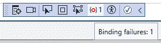

			Figure 11.9 – Checking the in-app toolbar for binding failures
			Let’s give it a try. Open the **XamlDebugging** solution from the GitHub repository for this chapter and follow along with these steps:

				1.  Open `Window` contains a `StackPanel` with two `TextBox` child elements:

    ```

    <StackPanel DataContext="Test" Background="LightGray">

    <TextBox x:Name="Text1"

    Text="{Binding Path=SomeText,

    Mode=TwoWay}"/>

    <TextBox Text="{Binding ElementName=Text1,

    Path=Text, Mode=OneWay}"/>

    </StackPanel>

    ```cs

    `DataContext` does not exist, so what do you think will be reported in the binding failures? Let’s find out!

    				2.  Run the application and look at the in-app toolbar. There is an indication that we have one binding failure.
				3.  Click the red indicator on the toolbar to open the **XAML Binding Failures** window in Visual Studio:

			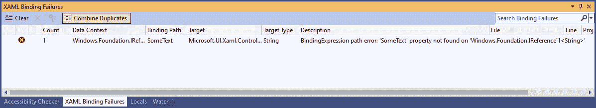

			Figure 11.10 – The XAML Binding Failures window
			The **Description** text in the window tells us **BindingExpression path error: ‘SomeText’ property not found on ‘Windows.Foundation.IReference`1<String>’**. This is useful information. It would be more useful if there was something telling us directly that the data context itself is not valid. However, if you had a dozen controls using this data context, and all the bindings were failing, it would become clear that there is a problem with the data context and not the individual bindings.

				1.  Let’s make sure the other binding is working correctly. Enter some text into the first `TextBox`:

			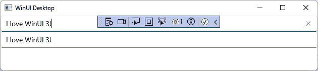

			Figure 11.11 – Binding TextBoxes with ElementName
			The text you enter should be duplicated in the second `TextBox` as your type. Our binding to `ElementName` is working as expected.
			I will leave fixing the data source as an exercise for you. Add a valid data source to the code behind it and see whether the binding error is cleared up.
			Now, let’s explore a few other XAML debugging tools available from the in-app toolbar.
			Debugging live data with Live Visual Tree and Live Property Explorer
			While the **XAML Binding Failures** window is new to Visual Studio, the in-app toolbar has been available to XAML developers since 2015\. The toolbar floats over the active window in your application while you are debugging. There are several parts to the toolbar:

				*   **Go to Live Visual Tree**: Opens the **Live Visual** **Tree** window.
				*   **Show in XAML Live Preview**: This opens the **XAML Live Preview** window in Visual Studio.
				*   **Select Element**: Allows you to select an element in **Live Visual Tree** by clicking on it in the active window.
				*   **Display Layout Adorners**: This will highlight the element in the UI that is currently selected in **Live** **Visual Tree**.
				*   **Track Focused Element**: While the **Live Visual Tree** window is open, toggling this on will indicate in **Live Visual Tree** which element currently has focus on the UI.
				*   **Binding failures**: Indicates the number of current binding failures and opens the **XAML Binding Failures** window when clicked.
				*   **Scan for Accessibility Issues**: This opens the **Accessibility Checker** window and runs an accessibility check on the UI elements currently visible.
				*   **Hot Reload**: Indicates whether **XAML Hot Reload** is currently available. Clicking it will open the documentation on Microsoft Learn.

			Let’s explore a few of the most commonly used debugging tools. If you wish to get more information on the remaining tools, you can visit this page about XAML tools on Microsoft Learn: [`learn.microsoft.com/visualstudio/xaml-tools/`](https://learn.microsoft.com/visualstudio/xaml-tools/). Or, view this *Visual Studio Toolbox* episode about using the XAML tools in Visual Studio: [`learn.microsoft.com/shows/visual-studio-toolbox/new-xaml-features-in-visual-studio`](https://learn.microsoft.com/shows/visual-studio-toolbox/new-xaml-features-in-visual-studio). We’ll start with XAML Hot Reload.
			Coding with XAML Hot Reload
			XAML Hot Reload is a simple but powerful feature. Before Visual Studio 16.2, it was known as **XAML C# Edit & Continue**. Hot reload has been available to web developers for a while longer, and the name change for XAML helps to clear up some confusion for developers familiar with the concept in web development. The idea of hot reload is that you can make changes to your UI and the changes are reflected in the running application without having to stop debugging and recompile. Let’s try it with the **XamlDebugging** solution:

				1.  Start by running the application again. Make sure that the **Hot Reload** indicator in the toolbar shows that it is enabled. It should only be disabled if you are running an unsupported project type.
				2.  Now let’s make a change to `Background` color of `StackPanel` to `LightGray`:

    ```

    <StackPanel DataContext="Test"

    Background="LightGray">

    <TextBox x:Name="Text1"

    Text="{Binding Path=SomeText,

    Mode=TwoWay}"/>

    <TextBox Text="{Binding ElementName=Text1,

    Path=Text, Mode=OneWay}"/>

    </StackPanel>

    ```cs

    				3.  Save the file and look at the running application:

			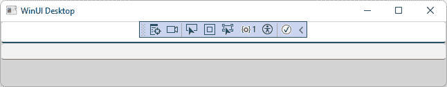

			Figure 11.12 – Changing the UI without restarting the application
			The background of the window is now light gray.
			This is a huge time-saver when building a new UI. For a list of known limitations, see this Microsoft Learn article: [`learn.microsoft.com/troubleshoot/developer/visualstudio/tools-utilities/xaml-hot-reload-troubleshooting#known-limitations`](https://learn.microsoft.com/troubleshoot/developer/visualstudio/tools-utilities/xaml-hot-reload-troubleshooting#known-limitations).
			Now let’s look at another powerful debugging tool, the **Live Visual** **Tree** window.
			Debugging with Live Visual Tree and Live Property Explorer
			The **Live Visual Tree** window allows developers to explore the elements in the current window of an application’s XAML **visual tree**. It is available to UWP and WinUI applications and other XAML frameworks. Let’s step through using **Live Visual Tree** and related XAML debugging tools:

				1.  While debugging the **XAMLDebugging** project, open the **Live Visual Tree** window. The visual tree contains the hierarchy of controls in the window with the **Show Just My XAML** button selected by default in the **Live Visual Tree** window’s toolbar:

			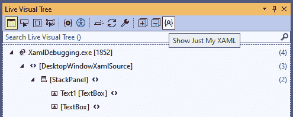

			Figure 11.13 – Viewing Live Visual Tree for the XamlDebugging project (Show Just My XAML selected)

				1.  If you want to view the entire visual tree for your window, de-select **Show Just My XAML** on the toolbar and the tree will refresh:

			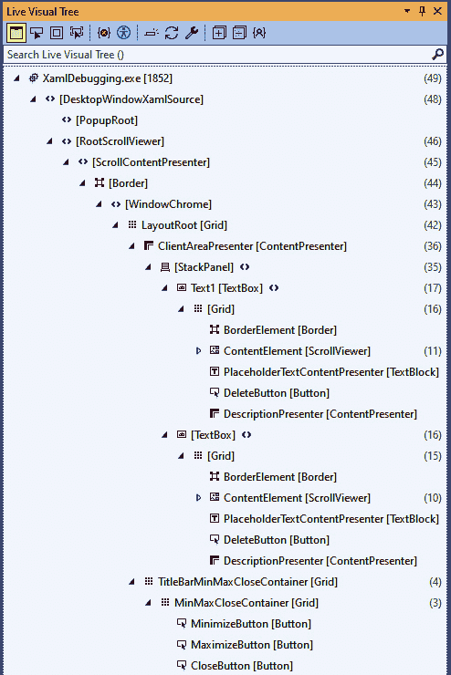

			Figure 11.14 – Viewing Live Visual Tree for the XamlDebugging project (all XAML)
			There’s a lot more going on here. With `TextBox` is made up of 17 child elements with a `Grid` at the root of its template. This is a great way to learn how the controls we use are composed. Working with and modifying these templates is beyond the scope of this chapter, but I encourage you to explore them on your own. *Chapter 7*, *Fluent Design System for Windows Applications*, has additional information on using default styles and theme resources. This Microsoft Learn article on control templates is another great place to start: [`learn.microsoft.com/windows/apps/design/style/xaml-control-templates`](https://learn.microsoft.com/windows/apps/design/style/xaml-control-templates). For now, let’s switch back to the **Show Just My** **XAML** view.

				1.  From **Live Visual Tree**, right-click on a node to navigate to the XAML markup for the selected item by selecting **View Source**.
				2.  Next, right-click a node and select **Show Properties** to show the **Live Property Explorer** window, where you can inspect the current properties of the selected element. You can see how the properties are grouped based on where they have been set. Here, some are set by **Local** changes and others are set based on the **Style** for a **TextBox**. If you had multiple levels of inherited explicit styles and an implicit style, those would all be grouped here:

			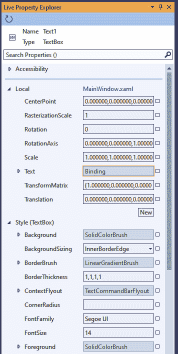

			Figure 11.15 – Viewing the Live Property Explorer window for the Text1 TextBox

				1.  Look at the `Binding` markup extension. Expand the **Text** property node to view the details of the binding:

			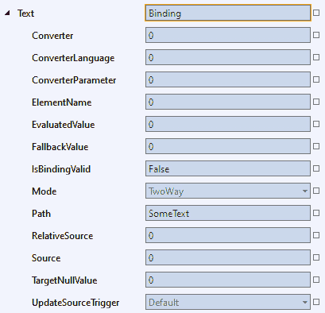

			Figure 11.16 – View the binding details for the Text property of Text1
			There is some very helpful information here. We can see the **Path** and **Mode** that were set in the XAML, the ones we did not set, and yet others that are read-only. **IsBindingValid** is **False** in this project, but it may be **True** if you fixed your data context from the previous section. When the binding is valid, **EvaluatedValue** will contain the current value for the **Text** property.

				1.  Select the second `TextBox` element in the tree and view the **Live Property Explorer** window. You can see that the default value for **Background** is **SolidColorBrush**.
				2.  Expand the **Background** node to view the resource details:

			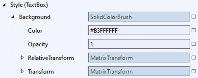

			Figure 11.17 – Viewing the property details of Page.Background

				1.  Try changing the **Color** property to white and see what happens in the XAML code and to the running application. The UI in the app should update, but the XAML file will remain unchanged.
				2.  Next, try adding markup to `MainWindow` to set the `MaxWidth` property of the second `TextBox` to `100`. What happens in `MaxWidth` when you’re finished.
				3.  Returning to `Grid` is more complex than `StackPanel`. `StackPanel` is preferred for layout if you are simply laying out a few elements horizontally or vertically. This unidirectional layout is what `StackPanel` was built to handle. As a rule of thumb, you should use the right control for the job and always keep performance in mind.
				4.  Now select the active node from the tree in your XAML file and enable **Select Element in the Running Application** from the toolbar. The **Track Focused Element** button on the toolbar will highlight the current tree node in the application’s window at runtime. This option is also available from the in-app toolbar.
				5.  To toggle the in-app toolbar on/off, you can use the **Enable in-app Toolbar** button on the **Live Visual** **Tree** toolbar.

			I encourage you to spend some time in these windows the next time you are debugging your application. Use them to help find issues with binding, resources, or custom control templates.
			Now let’s wrap up the chapter and review what we’ve learned.
			Summary
			In this chapter, we have covered some essential tools and techniques for debugging your XAML applications. We learned how to debug installed applications on a local or remote PC. If you are developing WPF or UWP applications, tools such as **Live Visual Tree**, **Live Property Explorer**, and **Rapid XAML Toolkit** will all work for those projects as well. Leveraging these tools will shorten the time you spend debugging and help you deliver higher-quality software.
			In the next chapter, we will explore the `WebView2` browser control. You will learn how to use `WebView2` to embed an ASP.NET Core Blazor **single-page application** (**SPA**) inside a WinUI 3 desktop application.
			Questions

				1.  How can you debug a UWP application that is running on an Xbox?
				2.  How can you debug an application that is currently running on your machine?
				3.  How can you launch an application package installed on a remote machine for debugging?
				4.  What feature in Visual Studio allows you to change XAML properties at runtime and see them reflected in the running application?
				5.  Which window will show a hierarchy of the elements in the current window?
				6.  What is the default binding mode for most control properties with `x:Bind`?
				7.  Where can you view the runtime properties for the control currently selected in **Live** **Visual Tree**?

```
