# 在 WinUI 中托管 Blazor 应用程序

WinUI 3 中的 `WebView2` 控件，Windows 开发者可以在他们的 WinUI 客户端应用程序中运行云托管的 Blazor 应用程序。这些选项在 .NET 8 中随着 **渲染模式** 的引入有所变化。我们将讨论这些新模式及其各自的优点。

在本章中，我们将涵盖以下主题：

+   学习使用 ASP.NET Core 和 Blazor 进行客户端 .NET 开发的一些基础知识

+   使用 **Visual Studio Code** 和 **.NET 命令行界面**（**CLI**）创建新的 Blazor 应用程序

+   将 Blazor 应用程序部署到 **Azure 静态 Web 应用** 服务

+   创建一个 WinUI 应用程序以在 `WebView2` 浏览器控件中托管 Blazor 应用程序

到本章结束时，您将了解如何创建新的 Blazor 应用程序，将其部署到云端，并使用该应用程序作为 `WebView2` 控件。

# 技术要求

要跟随本章中的示例，需要以下软件：

+   Windows 10 版本 1809（构建 17763）或更高版本或 Windows 11。

+   Visual Studio 2022 或更高版本，并已为 Windows App SDK 开发配置了 .NET 桌面开发工作负载。

+   **Visual Studio Code**（**VS Code**）以及以下扩展：C# 开发工具包和 Microsoft Edge 调试器。

+   Windows Terminal（使用 WinUI 构建）或您首选的命令行工具。您还可以使用 VS Code 中的 **终端** 窗口。

+   要创建 Blazor 项目，请安装 .NET 7 SDK 或更高版本。

本章的源代码可在 GitHub 上通过此 URL 获取：[`github.com/PacktPublishing/-Learn-WinUI-3/tree/master/Chapter12`](https://github.com/PacktPublishing/-Learn-WinUI-3/tree/master/Chapter12)。

# 开始使用 ASP.NET Core 和 Blazor

Blazor 是一个 Web 开发框架，为 C# 开发者提供了在构建客户端 Web 应用程序时替代 JavaScript 的选择。Blazor 是 **ASP.NET Core** 的一部分，并首次在 ASP.NET Core 3.0 中引入。让我们先简要了解 **ASP.NET** 和 ASP.NET Core 的历史。

## ASP.NET 和 ASP.NET Core 的简要历史

ASP.NET 是微软基于 .NET 的 Web 开发框架，首次于 2002 年发布。ASP.NET 的早期版本使用了一种名为 **Web Forms** 的客户端开发模型，旨在作为 **Windows Forms**（**WinForms**）客户端应用程序的 Web 等价物。Web Forms 在 .NET Web 开发者中很受欢迎，但并未遵循许多 Web 开发最佳实践和模式。许多开发者对每次服务器请求和响应中通过网络发送的大量 **ViewState** 数据表示批评。

作为对 Web Forms 批评的回应，ASP.NET 团队在 2009 年发布了 ASP.NET MVC。使用 ASP.NET MVC 构建的网络应用遵循 **模型-视图-控制器**（**MVC**）模式。这个新框架受到了 .NET 社区的欢迎，并且至今仍然是网络开发者们的热门选择。ASP.NET 也是最早被微软发布为开源的框架之一。2012 年，ASP.NET MVC 4 在 Apache License 2.0 许可下作为开源发布。

随着 .NET 团队继续拥抱开源软件，他们还决定以一个新的、开源的、跨平台的 .NET 版本开始新的起点，这个版本被称为 **.NET Core**。微软在 2016 年发布了 .NET Core 1.0，提供了适用于 Windows、macOS 和 Linux 的运行时。随着 .NET Core 的发布，出现了一个新的网络框架，称为 **ASP.NET Core**。ASP.NET Core 1.0 包含了用于构建网络应用和 Web API 项目的项目模板。这些网络应用使用 MVC 模式、用于构建丰富 UI 的 **Razor** 语法和 CSS 进行页面样式设计。

在接下来的几年里，ASP.NET 团队继续向 ASP.NET Core 添加更多功能，包括以下内容：

+   **Razor Pages**：Razor Pages 项目是在 ASP.NET Core 中引入的，提供了一个简单的 ASP.NET Core MVC 的替代方案。

+   **SignalR**：一个用于实时网络通信的框架；SignalR 是 Blazor 服务器应用中客户端-服务器通信的关键部分。

+   **身份（之前称为 Identity Core）**：支持 ASP.NET Core 应用中的登录功能，并管理用户、密码、角色、令牌等认证资源。

注意

本书不会提供 ASP.NET Core 开发的详细教程。如果你想要了解更多关于使用 ASP.NET Core 构建网络应用的知识，请参阅 *Andreas Helland, Vincent Maverick Durano, Jeffrey Chilberto 和 Ed Price 著，Packt 出版* 的 *《ASP.NET Core 5 入门》* ([`www.packtpub.com/product/asp-net-core-5-for-beginners/9781800567184`](https://www.packtpub.com/product/asp-net-core-5-for-beginners/9781800567184))。

但 Blazor 在 ASP.NET Core 开发图中处于什么位置？让我们接下来探索这个问题。

## 什么是 Blazor？

Blazor 是一个用于使用 .NET 和 C# 构建网络应用的框架。在 .NET 8 之前，开发者在新建 Blazor 项目时可以从以下三种托管模型中选择：

+   **Blazor 服务器**：随着 ASP.NET Core 3.0 的发布而引入，服务器模型在服务器上执行应用逻辑，并通过 SignalR 连接将 UI 更新推送到客户端。

+   **Blazor WebAssembly**：在 ASP.NET Core 3.2 中推出，这种执行模型仅在客户端运行，沙盒化并在浏览器的 UI 线程上运行，通过 Wasm。

+   **Blazor 混合模式**：这是一种结合了 Web 和原生客户端技术的较新类型的 Blazor 应用程序。在这个模型中，Razor 组件在客户端的 .NET 上运行，并通过互操作性和 WebView 技术将 Web 用户界面渲染到原生客户端，对用户来说无缝衔接。混合应用程序可以与 .NET MAUI、WPF 和 WinForms 客户端一起使用。

在 .NET 8 及以后的版本中，Blazor 团队将这些托管模型发展成了渲染模式。现在，当使用 Blazor 进行开发时，您可以选择以下三种模式：

+   **服务器模式**：与之前版本中服务器托管模型等效。

+   **WebAssembly 模式**：利用 Wasm 的客户端模式。

+   **自动模式**：新的自动模式结合了前两种模式的优势。如果客户端运行时组件可以快速下载，它将在 WebAssembly 模式下运行。否则，它将回退到服务器模式。

那么，您应该为您的下一个 Blazor 应用程序选择哪种模式呢？幸运的是，随着 .NET 8 的推出，您不再需要为整个应用程序选择相同的模式。可以通过设置 `@rendermode` 属性在组件级别选择模式。这个组件级别的决策将取决于您项目的需求，但许多应用程序可能会开始利用自动模式。

注意

在撰写本文时，.NET 8 仍然仅作为开发者预览版提供。我们将使用 .NET 7 和 Blazor WebAssembly 托管模型在本章中构建应用程序。您将能够使用 .NET 8 和 WebAssembly 模式构建相同类型的应用程序。

这里列出了服务器和 Wasm 托管模型的一些优缺点：

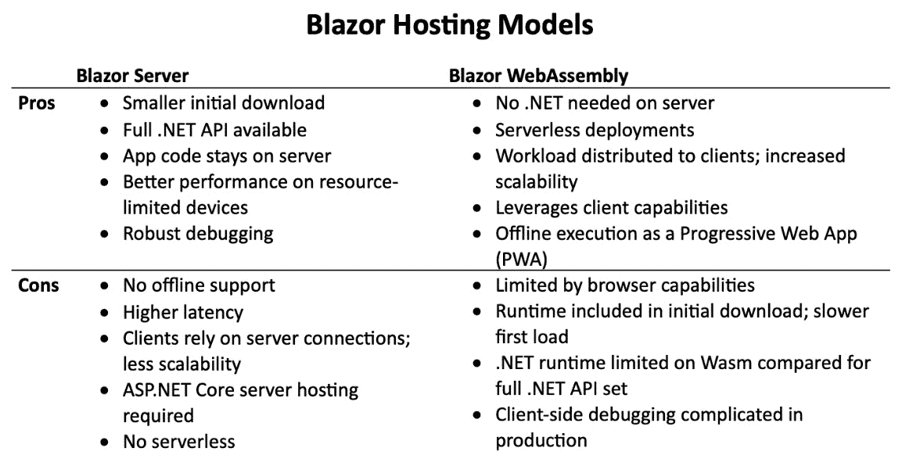

图 12.1 – Blazor 托管模型优缺点

Blazor 服务器托管模型首先发布，拥有最成熟的工具和调试支持。如果您计划在支持 ASP.NET Core 的服务上托管服务器，并且您的用户可能正在使用不支持 Wasm 的浏览器，那么这是一个很好的选择。

在本章中，我们将重点关注客户端 Blazor 应用程序。那么，为什么选择这种模式，它是如何工作的呢？

## WebAssembly 和客户端 .NET 开发

使用 Wasm 的客户端托管模型的主要优势是可选的无服务器部署和客户端离线工作的能力。离线支持意味着您的 Blazor 应用程序可以被配置为**渐进式 Web 应用程序**（**PWA**），并下载到 PC、平板电脑和手机上。您可以从 Mozilla 的开发者文档中了解更多关于 PWAs 的信息：[`developer.mozilla.org/en-US/docs/Web/Progressive_web_apps`](https://developer.mozilla.org/en-US/docs/Web/Progressive_web_apps)。

Blazor 客户端应用程序可以作为 PWA 运行的原因，也是我们想在 WinUI 应用程序中的 `WebView2` 控件中使用它的原因。一旦网络应用程序在浏览器宿主中加载，所有内存执行和交互都可以发生，无论网络连接是否中断。如果你的项目中不关心连接性、可扩展性和服务器托管，那么 Blazor 服务器模型当然可以使用。

简单的 Blazor Wasm 应用程序可以作为 *静态资源* 在 Web 服务器上托管。你还可以在 ASP.NET Core Web 托管解决方案上托管 Blazor Wasm 应用程序。这样做可以让你在服务器上与其他 Web 解决方案共享代码，并支持更高级的路由场景，以支持应用程序内的深度链接。使用 .NET 8，使用具有 ASP.NET Core 支持的主机可以让你利用新的自动模式，或者选择在某些适合离线使用的组件中仅使用 Wasm 模式。

在 Wasm 模型中，当客户端向服务器发出第一个请求时，整个应用程序和 .NET 运行时都会在响应中发送到浏览器，并且整个应用程序在客户端端运行。此模式中没有共享的服务器端代码。然后，运行时和应用程序在 UI 线程上加载到 Wasm 之上：

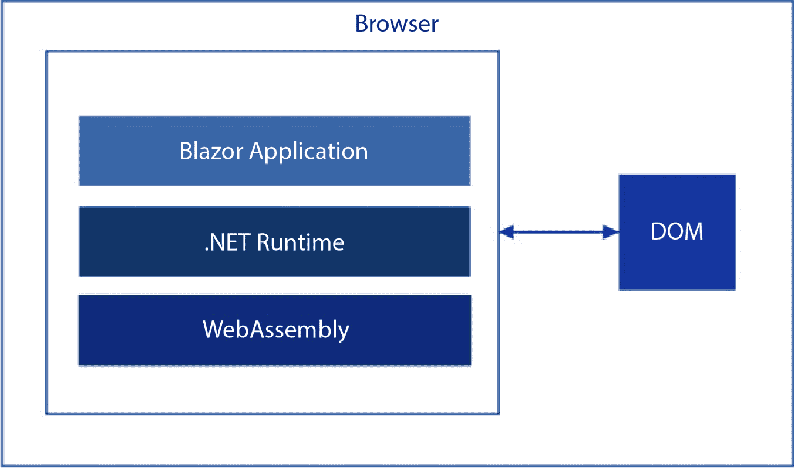

图 12.2 – Blazor Wasm 模型在浏览器中运行

现在你已经对 ASP.NET Core 和 Blazor 应用程序有了些许了解，让我们创建一个 Blazor Wasm 项目，并亲身体验一下这个框架。

# 创建 Blazor Wasm 应用程序

是时候开始构建我们将在 WinUI 应用程序中运行的 Blazor 应用程序了。我们将使用 .NET CLI 和 VS Code 来创建 Blazor 项目。如果你更喜欢全功能的 IDE 体验，也可以使用 Visual Studio 2022：

1.  首先，使用你选择的终端应用程序打开命令提示符。我将使用带有 PowerShell 7.3 的 Windows Terminal（https://apps.microsoft.com/store/detail/windows-terminal/9N0DX20HK701）：

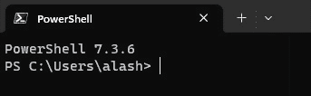

图 12.3 – 在 Windows Terminal 中运行 PowerShell 7.3

1.  使用终端将当前文件夹更改为你保存项目的地方。我的位置将是 `C:\Users\alash\source\repos`。

1.  使用以下命令创建一个名为 `BlazorTasks` 的新 Blazor WebAssembly 项目，并按 *Enter*：`dotnet new blazorwasm -o BlazorTasks`。.NET CLI 将创建新项目，你应该会看到一个消息表明它已成功完成：

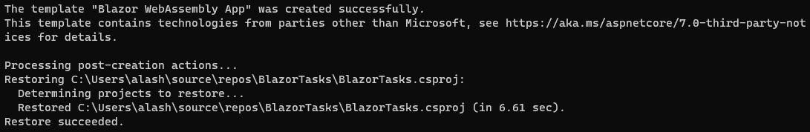

图 12.4 – .NET CLI 成功创建 Blazor WebAssembly 应用程序项目

1.  导航到 .NET 刚创建的 `BlazorTasks` 文件夹。如果你已安装 VS Code ([`code.visualstudio.com/`](https://code.visualstudio.com/))，你可以在命令行中输入 `code .` 以在 VS Code 中打开当前文件夹：

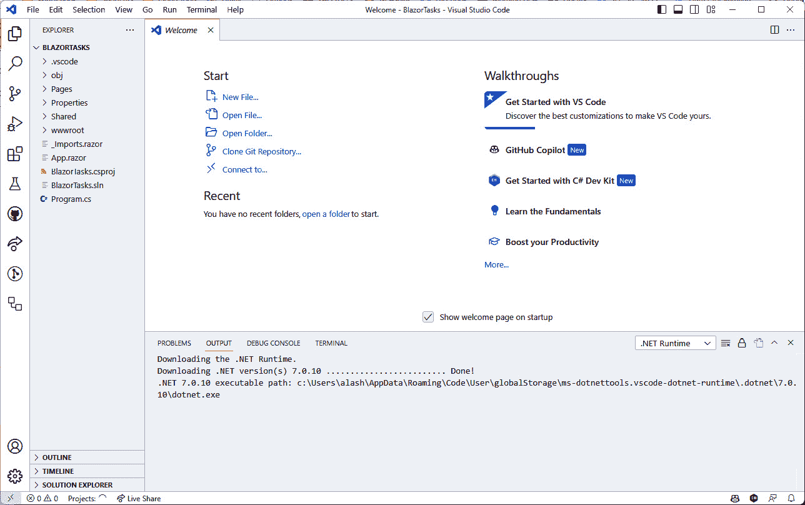

图 12.5 – VS Code 中的 BlazorTasks 项目

你可能会在 **输出** 窗口中看到一些活动，因为 VS Code 正在下载与项目相关的调试和编辑工具。如果你看到一个 **你信任此文件夹中文件的作者吗？** 对话框，请选择 **是的，我信任作者** 按钮，以继续。

1.  切换到 VS Code 中的 **终端** 窗口。如果窗口在编辑器的底部不可见，你可以从菜单中选择 **终端** | **新建终端**。

1.  在终端中输入 `dotnet run`。你还可以使用 *F5* 在 VS Code 中运行，就像你在 Visual Studio 中习惯使用的那样。当编译完成后，你可以在浏览器中导航到 `https://localhost:5240/` 来查看正在运行的 `BlazorTasks` 应用程序（端口号将在 **终端** 窗口中显示）：

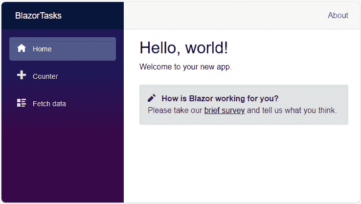

图 12.6 – 首次运行 BlazorTasks 项目

默认项目模板在左侧面板中有三个导航选项：**主页**、**计数器** 和 **获取数据**。当你从一个页面导航到另一个页面时，所有执行逻辑都在浏览器中运行。没有往返到 ASP.NET Core 服务器实例。

1.  你可以通过按 *F12* 在浏览器中打开开发者工具。你将看到，在导航到应用程序中的 **计数器** 选项卡并多次点击 **点击我** 按钮时，开发者工具的 **网络** 选项卡上没有活动：

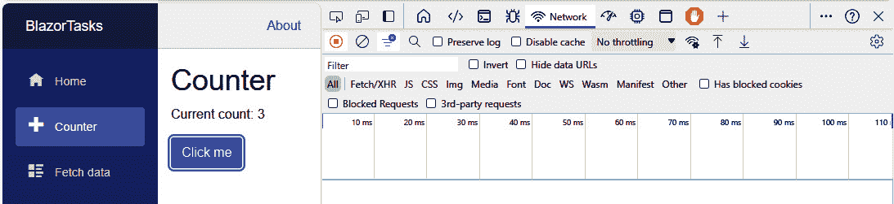

图 12.7 – 在 BlazorTasks 应用程序中查看网络活动

1.  最后，当你完成对应用程序的探索后，你可以关闭浏览器，并在 VS Code 的 **终端** 窗口中按 *Ctrl* + *C* 来停止调试应用程序。

现在我们已经创建并测试了项目，让我们开始为应用程序编写一个新的任务页面。

## 构建一个简单的应用程序以跟踪任务

在本节中，我们将为应用程序创建一个新的任务页面，该页面将出现在左侧导航中的 **获取数据** 项下方。如果你愿意，你可以从项目中删除其他组件。我将保留它们以测试在 WinUI 中部署的应用程序中的导航：

1.  首先向项目中添加一个 `Tasks` 组件。通过在 VS Code 的 `Pages` 文件夹中的 `Tasks` Razor 组件中输入 `dotnet new razorcomponent -n Tasks -o Pages` 来完成此操作。

1.  双击 **资源管理器** 窗口中的 `Pages` 文件夹中的 `Tasks.razor` 以在编辑器中打开它。作为对资源管理器窗口的替代，C# Dev Kit 扩展应该已经将 **解决方案资源管理器** 视图添加到左侧窗格的底部。如果您喜欢，请使用此视图。该文件包含以下代码：

    ```cs
    <h3>Tasks</h3>
    @code {
    }
    ```

    Razor 文件包含 HTML 标记和 C# 代码的组合，HTML 在文件顶部，C# 代码在文件底部的 `@code` 块中。我们将随着我们的进展看到这两个部分如何交互。

1.  将 `@page "/tasks"` 作为 `Tasks.razor` 文件的第一行。这将允许应用程序通过 URL 上的 `/tasks` 路由到该页面。

1.  在我们添加页面内容之前，让我们为它添加一个新的导航项。从 **资源管理器** 中的 `Shared` 文件夹打开 `NavMenu.razor`。

1.  在 `<nav>` 元素内部，在关闭 `</nav>` 标签之前添加一个新的 `<div>`：

    ```cs
    <div class="@NavMenuCssClass nav-scrollable"
      @onclick="ToggleNavMenu">
        <nav class="flex-column">
    ...
            <div class="nav-item px-3">
                <NavLink class="nav-link" href="tasks">
                    <span class="oi oi-list-rich" aria-
                      hidden="true"></span> Tasks
                </NavLink>
            </div>
        </nav>
    </div>
    ```

1.  使用 `dotnet run` 运行应用程序，以确保新的菜单选项出现，并且您可以通过带有 **Tasks** 标题的新页面进行导航：

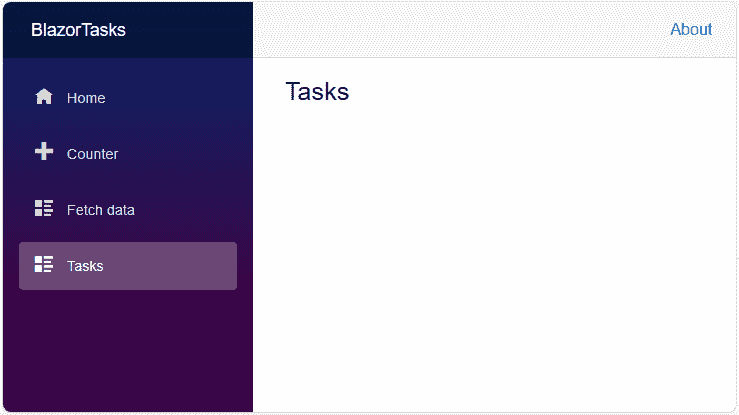

图 12.8 – 导航到新的任务页面

1.  接下来，使用 `TaskItem.cs`。这将作为任务的模型类。向新文件添加以下代码：

    ```cs
    namespace BlazorTasks
    {
        public class TaskItem
        {
            public string? Name { get; set; }
            public bool IsComplete { get; set; }
        }
    }
    ```

1.  打开 `Tasks.razor` 并添加以下代码，通过迭代 `@code` 块中包含的任务列表来创建一个任务的无序列表：

    ```cs
    @page "/tasks"
    <h3>Tasks</h3>
    <ul>
        @foreach (var task in taskList)
        {
            <li>@task.Name</li>
        }
    </ul>
    <input placeholder="Enter new task..." />
    <button>Add task</button>
    @code {
        private IList<TaskItem> taskList = new
          List<TaskItem>();
    }
    ```

    注意到 Razor 文件如何允许您混合 C# 代码和 HTML 标记。我们在 `<ul>` 中有一个 C# `foreach` 循环，并在 `foreach` 循环内部添加 `<li>` 元素，这些元素再次包含获取每个 `task.Name` 的 C# 代码。这是强大功能。我们还添加了一个输入字段来输入新任务和一个按钮来添加任务。我们将在下一个步骤添加一些代码来使 `button` 功能化。

1.  在 `@code` 块中添加一个名为 `AddTask` 的新私有变量和新方法。此方法将向 `taskList` 集合添加一个新任务：

    ```cs
    private string newTask;
    private void AddTask()
    {
        if (!string.IsNullOrWhiteSpace(newTask))
        {
            taskList.Add(new TaskItem { Name = newTask });
            newTask = string.Empty;
        }
    }
    ```

1.  最后，向页面上的 `input` 和 `button` 元素添加一些数据绑定代码。`input` 将绑定到 `newTask` 变量，而 `button` 的 `onclick` 事件将触发 `AddTask` 方法来运行：

    ```cs
    <input placeholder="Enter new task..." @bind="newTask"
     />
    <button @onclick="AddTask">Add task</button>
    ```

1.  现在，运行应用程序并测试控件。您应该能够将一些任务添加到列表中：

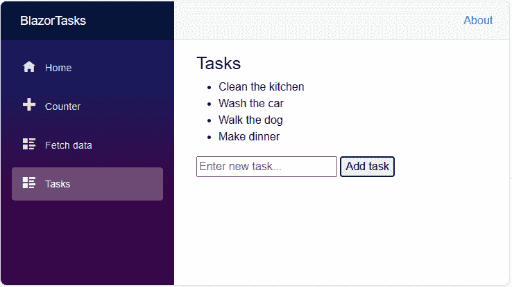

图 12.9 – 在 BlazorTasks 中向任务列表添加一些任务

这效果很好，但现在我们有一些任务要做，我们没有标记它们为完成的方法。让我们在下一步处理这个问题。

1.  第一步是使每个列表项成为用户可以勾选的 `checkbox`，以便在完成任务时进行检查。我们还将 `task.Name` 绑定到一个 `input` 字段，以便用户可以编辑每个任务的名称：

    ```cs
    <ul>
        @foreach (var task in taskList)
        {
            <li>
                <input type="checkbox"
                  @bind="task.IsComplete" />
                <input @bind="task.Name" />
            </li>
        }
    </ul>
    ```

1.  接下来，以防列表过长，让我们使用一些数据绑定来显示作为页面标题的一部分的不完整任务数量：

    ```cs
    <h3>Tasks - (@taskList.Count(task =>
      !task.IsComplete)) Incomplete</h3>
    ```

1.  再次运行应用程序，并开始处理您的任务列表：

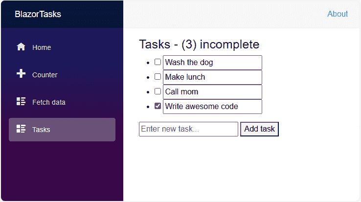

图 12.10 – 在 BlazorTasks 应用程序中添加和完成任务

你可能已经注意到，任务在会话之间不会保存。目前`taskList`是一个内存中的集合。要跨会话持久化它，你需要添加服务调用以将数据保存到服务器端数据存储中。创建此服务超出了本章的范围，我将把它留作你的练习。

注意

如果你更喜欢使用功能齐全的 IDE，所有这些步骤也可以在 Visual Studio 或 Visual Studio for Mac 中完成。Microsoft Learn 文档页面提供了如何在两种工具以及 VS Code 中调试 Blazor Wasm 应用程序的信息：https://learn.microsoft.com/aspnet/core/blazor/debug。

现在我们已经有一个功能齐全的任务跟踪 Web 客户端，我们可以继续下一步。是时候将我们的 Blazor 应用程序部署到云中了。

# 探索 Blazor Wasm 部署选项

在开发解决方案时，在本地运行和调试 Blazor 项目是很好的，但当是时候将你的应用程序与全世界分享时，我们需要将其托管在云中。对于典型的 ASP.NET Core 应用程序，有众多云托管选项，Blazor Wasm 应用程序更是如此。完全在客户端运行的网站可以作为静态文件托管在服务器上，这意味着服务器在收到请求时只需简单地提供文件。不需要服务器端执行。

让我们先回顾一下 Blazor WebAssembly 部署可用的托管选项。

## Blazor Wasm 项目的部署选项

我们的项目有几个托管选项。今天我们将讨论一些最受欢迎的解决方案：**GitHub Pages**、**Azure App Service**、**Azure Static Web Apps**以及**Amazon Web Services**（**AWS**）上的两个选项。关于托管在 ASP.NET Core 或作为静态文件深入探索选项，Microsoft Learn 有一篇很好的文章：https://learn.microsoft.com/aspnet/core/blazor/host-and-deploy/webassembly。

### 亚马逊云服务

使用 AWS，Blazor Wasm 网站可以使用 ASP.NET Core 在**弹性容器服务**（**ECS**）([`aws.amazon.com/ecs/`](https://aws.amazon.com/ecs/))和**Fargate**上托管。ECS 解决方案使用**Docker**创建要托管在云中的容器。然后网站通过 Fargate([`aws.amazon.com/fargate/`](https://aws.amazon.com/fargate/))，AWS 的容器计算引擎，进行服务。要了解更多关于此 ASP.NET Core 项目解决方案的信息，AWS 博客有一篇很好的文章详细说明了步骤：[`aws.amazon.com/blogs/compute/hosting-asp-net-core-applications-in-amazon-ecs-using-aws-fargate/`](https://aws.amazon.com/blogs/compute/hosting-asp-net-core-applications-in-amazon-ecs-using-aws-fargate/)。

对于 AWS 的静态托管选项，可以使用 `wwwroot` 文件夹将其复制到 S3 存储中，CloudFront 负责从 S3 存储桶中提供静态文件。本文详细介绍了如何在 AWS 中创建和部署 Blazor Wasm 应用程序：[`aws.amazon.com/blogs/developer/run-blazor-based-net-web-applications-on-aws-serverless/`](https://aws.amazon.com/blogs/developer/run-blazor-based-net-web-applications-on-aws-serverless/)。

现在，让我们看看如何通过 **GitHub** 提供静态文件。

### GitHub Pages

**GitHub Pages** ([`pages.github.com/`](https://pages.github.com/)) 是直接从 GitHub 仓库提供静态网站的托管服务。您可以在 GitHub 上维护您的站点，并配置 **GitHub Actions** 将站点部署到 GitHub Pages。Microsoft MVP Niels Swimburghe 在他的个人博客上提供了将 Blazor Wasm 项目部署到 GitHub Pages 的分步指南：https://swimburger.net/blog/dotnet/how-to-deploy-aspnet-blazor-webassembly-to-github-pages。GitHub Pages 是免费的，但 *标准* 用户账户只能托管来自 *默认* GitHub 分支的页面。

在下一节中，我们将使用 GitHub Actions 与我们的项目一起部署到 Azure。但在此之前，让我们回顾一下可用的两个 Azure 托管解决方案。

### Azure App Service

**Azure App Service** (https://azure.microsoft.com/products/app-service/) 是如果您希望将 Blazor 应用程序托管在 ASP.NET Core Web 服务器上时的一个很好的选择。App Service 提供了 Windows 和 Linux 服务器，但目前仅支持 Windows 实例用于 Blazor WebAssembly 应用程序。Microsoft Learn 提供了关于将 ASP.NET Core 应用程序部署到 App Service 的详细文档：[`learn.microsoft.com/aspnet/core/host-and-deploy/azure-apps/`](https://learn.microsoft.com/aspnet/core/host-and-deploy/azure-apps/)。

现在，让我们看看另一个 Azure 选项。这个选项专门用于部署静态站点，如 Blazor Wasm。

### Azure Static Web Apps

**Azure Static Web Apps** ([`azure.microsoft.com/products/app-service/static/`](https://azure.microsoft.com/products/app-service/static/)) 是一个用于托管和提供静态 Web 应用程序（如 Blazor Wasm）的服务。它通过 GitHub Actions 提供简单的部署，免费 SSL 证书，自定义域名，以及与 **Azure Functions** 的轻松集成。

关于 Static Web Apps 的完整文档，包括与其他 SPA 网站使用的信息，Microsoft Learn 提供了文档、指南和 **培训** ([`learn.microsoft.com/training/`](https://learn.microsoft.com/training/)) 内容，可在 [`learn.microsoft.com/azure/static-web-apps/`](https://learn.microsoft.com/azure/static-web-apps/) 找到。

我们将使用 Static Web Apps 来托管我们的 Blazor 应用程序。现在让我们来做这件事！

# 将 Blazor 发布到 Azure Static Web Apps 托管

在本节中，我们将通过将源代码推送到 GitHub、创建 Azure 静态 Web 应用应用程序并配置 GitHub Actions 以在主分支每次提交时将应用程序发布到 Azure，来在云中托管我们的`BlazorTasks`应用程序。让我们首先将我们的代码推送到 GitHub。

## 将项目推送到 GitHub

要将代码推送到 GitHub 仓库，你可以使用 Git CLI ([`git-scm.com/downloads`](https://git-scm.com/downloads)) 或**GitHub Desktop** ([`desktop.github.com/`](https://desktop.github.com/))应用程序。在这个例子中，我们将使用 GitHub Desktop：

1.  下载并安装 GitHub Desktop。安装完成后，启动应用程序。

1.  如果你本地项目还不是 Git 仓库的一部分，请选择**文件** | **新建仓库**。如果你已经为你的项目创建了一个本地仓库，你可以跳到下一步：

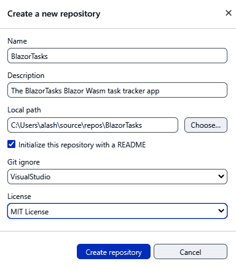

图 12.11 – 为 BlazorTasks 应用程序创建一个新的本地 GitHub 仓库

将仓库命名为类似`BlazorTasksWasm`或`BlazorTasks`的东西，可选地添加一个描述，并浏览到项目的**本地路径**。拥有一个 README、一个**Git 忽略**文件和一个**许可证**是一个好习惯。因此，选择这些选项中的每一个。完成这些后，点击**创建仓库**。完成此步骤后，继续进行*第 4 步*。

1.  如果你在一个本地 Git 仓库中创建了你的 Blazor 项目，你可以选择`BlazorTasks`项目并选择它。如果你那里还没有 Git 仓库，应用程序将提示你创建一个：

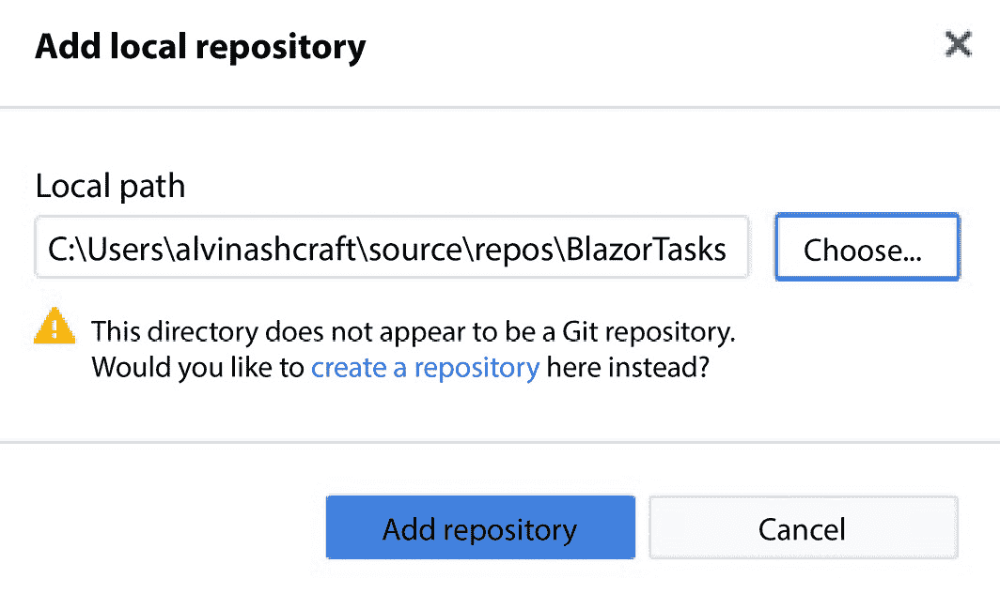

图 12.12 – 添加本地仓库

1.  在这一步，我们将把本地仓库发布到 GitHub。如果你还没有 GitHub 账户，你可以在[`github.com/`](https://github.com/)创建一个。准备好后，确保你的`BlazorTasksWasm`仓库被选为**当前仓库**，然后点击**发布** **仓库**按钮：

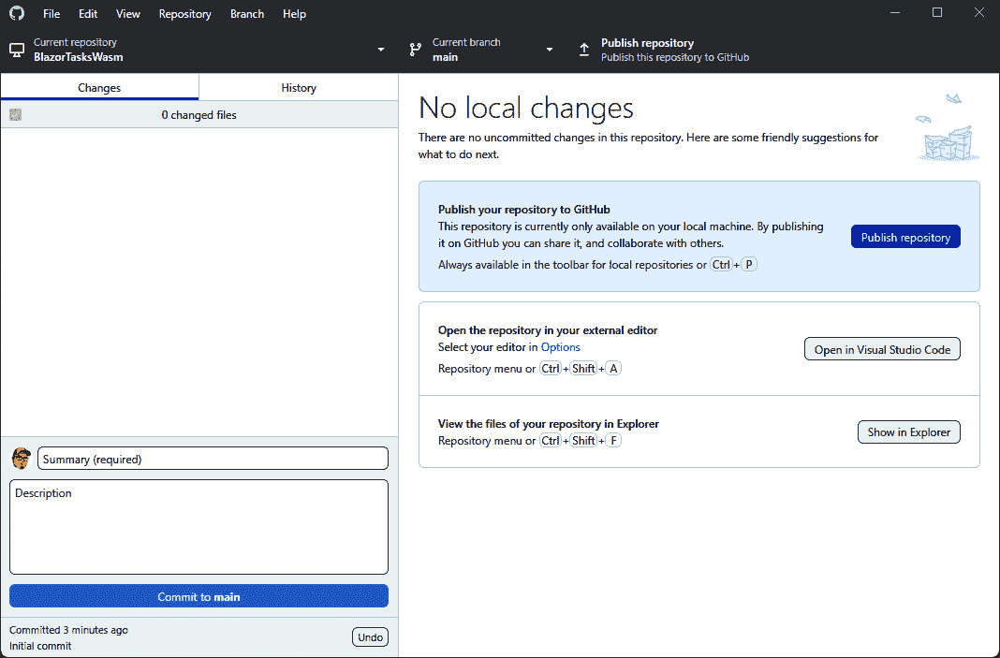

图 12.13 – 将本地仓库发布到 GitHub

如果你出现在对话框中的**保留此代码为私有**选项，你可以取消选中它。

1.  在 GitHub 上查看仓库，以确保它已正确发布：

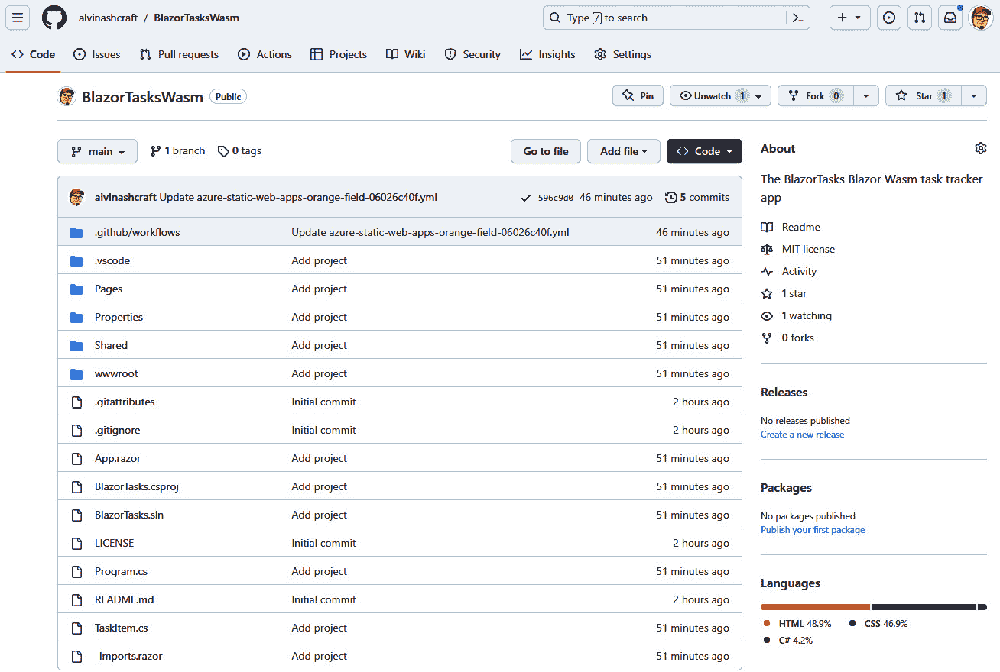

图 12.14 – GitHub 上的 BlazorTasks 代码

现在，代码已经准备好发布到 Azure 了。让我们接下来进行这一步。

## 创建 Azure 静态 Web 应用资源

让我们一步步创建一个新的 Azure 静态 Web 应用应用程序：

1.  要开始，如果你还没有 Azure 账户，你可以在[`azure.microsoft.com/`](https://azure.microsoft.com/)创建一个免费试用账户。网站将引导你完成创建新账户的步骤。

1.  登录到与您的 Azure 账户关联的 Microsoft 账户，网址为 [`portal.azure.com/`](https://portal.azure.com/)。

1.  从门户主页，点击 **Azure 服务** 顶部下的**创建资源**。

1.  在 `static` 下选择**静态** **Web 应用**：

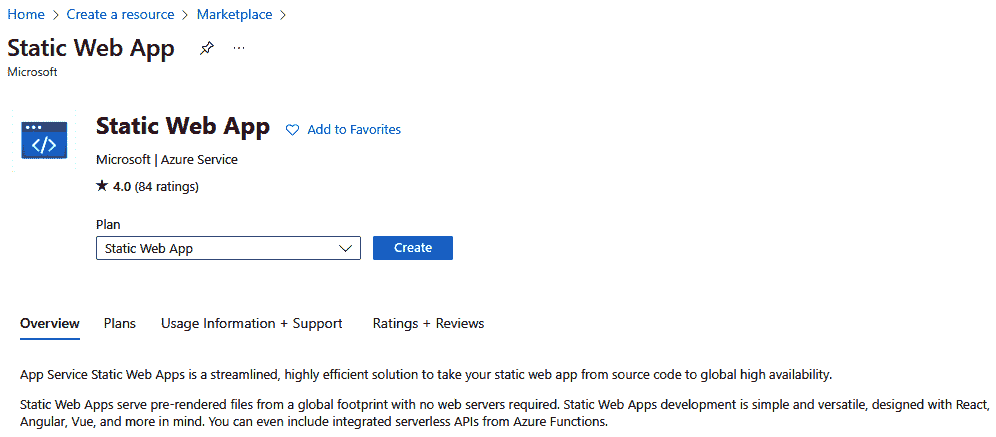

图 12.15 – 创建新的静态 Web 应用

1.  点击 `BlazorTasksWasm`。为资源命名，选择对您或您的用户有意义的**区域**选项，并选择**免费**选项作为**SKU**。选择**GitHub**作为**部署详情**。我们将在下一步链接到 GitHub：

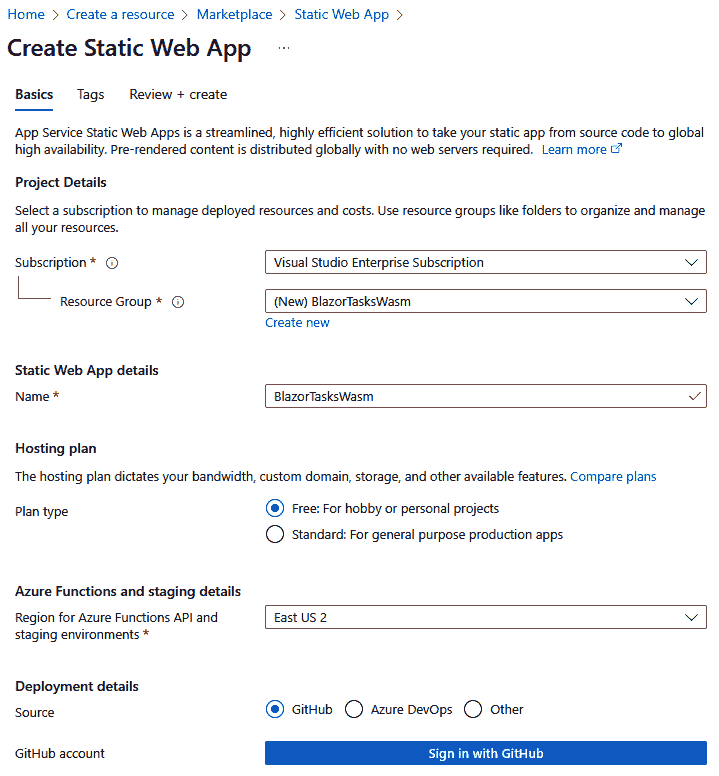

图 12.16 – 配置新的静态 Web 应用资源

1.  接下来，点击 `BlazorTasksWasm` 仓库：

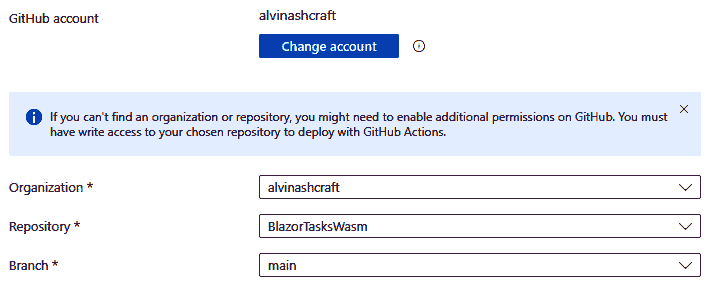

图 12.17 – 为静态 Web 应用资源输入 GitHub 详细信息

1.  在 `wwwroot`。

1.  点击**审阅 + 创建**。审阅**摘要**页面，确保一切看起来正确，然后点击**创建**。Azure 将花费几分钟创建新的资源。完成后，您可以点击**转到资源**。

静态 Web 应用资源已准备就绪。Azure 已经为我们创建了 GitHub Actions 部署。让我们回顾一下它做了什么，然后审阅网站。

## 使用 GitHub Actions 发布应用程序

通常，我们会在这里配置 GitHub Actions 以在 GitHub 仓库中构建我们的项目并将其发布到 Azure 资源。然而，Azure 静态 Web 应用配置已经为我们处理了这一步骤。让我们回顾一下它做了什么：

1.  导航到您的 GitHub 项目并点击**操作**标签。您将看到 Azure 创建了一个名为 **Azure Static Web Apps CI/CD** 的工作流程：

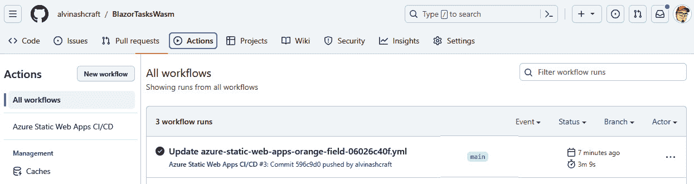

图 12.18 – 查看 BlazorTasks 的工作流程

1.  选择出现在 `.yml` 文件下方编辑器中的 `.yml` 文件超链接。

1.  审阅文件内容。您将看到一个 `build_and_deploy_job` 部分。此步骤将获取最新提交的代码，构建它并将其部署到我们在 Azure 中配置的应用服务。

1.  您可以通过在 Azure 门户中导航到 `BlazorTasksWasm` 资源并点击网站的 URL 来验证网站是否已发布到 Azure：

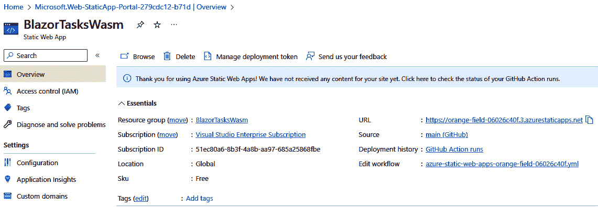

图 12.19 – BlazorTasks 资源在 Azure 门户中的主页

1.  Blazor 网站将在您的浏览器中打开新标签页。点击导航菜单中的**任务**项，并验证应用程序是否按预期工作：

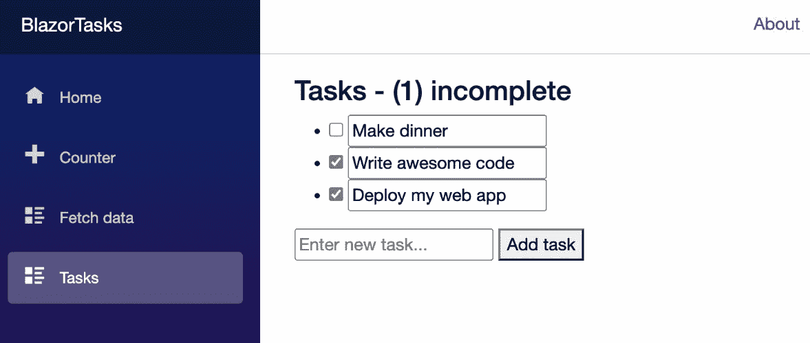

图 12.20 – 在静态云中运行 BlazorTasks

现在，我们有一个面向公众的静态网站正在运行 Blazor Wasm 应用程序。现在，我们准备在 WinUI 项目中运行 Web 应用程序。

# 在 WinUI WebView2 中托管 Blazor 应用程序

我们已经完成了最后的冲刺。我们创建了一个 Blazor Wasm 应用程序，将源代码推送到 GitHub，并配置 Azure GitHub Actions 以在每次提交时将应用程序发布到 Azure 静态 Web 应用。最后一步是创建一个简单的 WinUI 3 项目，并将`WebView2`控件添加到**MainWindow**：

1.  你可以通过在 Visual Studio 中创建一个新的`BlazorTasksHost`或者从 GitHub 打开入门项目来开始：[`github.com/PacktPublishing/-Learn-WinUI-3/tree/master/Chapter12/Start/BlazorTasksHost`](https://github.com/PacktPublishing/-Learn-WinUI-3/tree/master/Chapter12/Start/BlazorTasksHost)。

1.  打开`MainWindow.xaml`并更新窗口以托管包含`WebView2`控制的`Grid`。将`Source`属性设置为你的`BlazorTasksWasm`站点的 URL：

    ```cs
    <Grid>
        <WebView2 Source="https://you-custom-url-
          0af06780d.azurestaticapps.net/"/>
    </Grid>
    ```

1.  在`MainWindow.xaml.cs`中移除未使用的按钮点击事件处理程序，以防止编译错误。

1.  运行应用程序，你会看到`BlazorTasksWasm`应用程序像 Windows 应用程序一样加载：

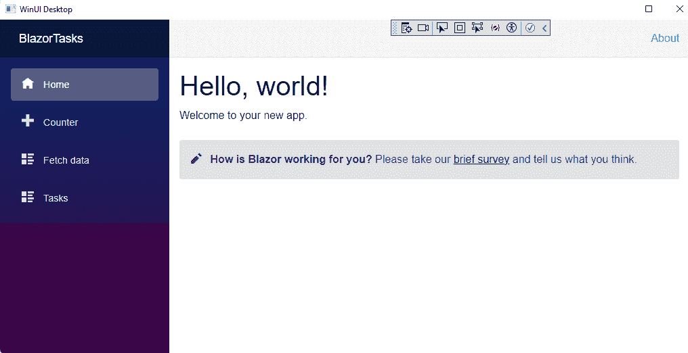

图 12.21 – 在 WinUI 应用程序中运行 BlazorTasksWasm

你可以在网页视图中测试应用程序。因为它是全部客户端代码，即使断开网络连接，你也可以继续使用应用程序。**任务**页面将继续离线工作。

现在，当你向 GitHub 提交更改时，你对 Blazor 应用程序所做的任何更新都将立即推送到所有用户。这对于想要接触更多 Windows 用户的 Web 开发者来说是一个很有吸引力的方式。

注意

如果你想要进一步探索 Blazor 和 WinUI 的集成，你可以查看托马斯·克劳迪乌斯·休伯的这篇博客文章。在文章中，他通过执行脚本通过`WebView2`控件从 WinUI 宿主应用程序调用 Blazor 应用程序中的方法进行了实验：[`www.thomasclaudiushuber.com/2020/02/18/hosting-blazor-app-in-winui-3-with-webview-2-and-call-blazor-component-method-from-winui/`](https://www.thomasclaudiushuber.com/2020/02/18/hosting-blazor-app-in-winui-3-with-webview-2-and-call-blazor-component-method-from-winui/)。

让我们总结一下本章我们所学到的内容。

# 摘要

在本章中，我们学习了 ASP.NET Core Blazor。你使用 Blazor Wasm 创建了一个简单的任务跟踪应用程序，并通过 GitHub Actions 将其发布到 Azure Static Web Apps。从这里，你可以使用 ASP.NET Core Identity 来集成应用程序登录，并将任务数据保存到**Azure SQL**、**Azure Cosmos DB**或另一个基于云的数据存储。这将允许为每个用户个性化任务列表并保存其状态。我们创建了一个 WinUI 3 应用程序来在 Windows 上运行 Blazor 客户端，但你也可以直接将用户发送到你的网站或为桌面和移动客户端创建基于 JavaScript 的 PWA。有关使用 Blazor WASM 创建 PWA 的更多信息，请参阅这篇 Microsoft 博客文章：[`devblogs.microsoft.com/visualstudio/building-a-progressive-web-app-with-blazor/`](https://devblogs.microsoft.com/visualstudio/building-a-progressive-web-app-with-blazor/)。

备注

要了解更多关于使用 Blazor 构建 Web 应用程序的信息，你可以阅读 Jimmy Engstrom 的《Web Development with Blazor》。这里是亚马逊链接：[`www.amazon.com/dp/1803241497/`](https://www.amazon.com/dp/1803241497/)

在下一章，*第十三章*，*使用 Uno Platform 跨平台开发你的应用*，我们将探讨**Uno Platform**可以为 WinUI 开发者做什么。

# 问题

1.  .NET 7 及更早版本中，名为什么的 Blazor 托管模型在浏览器中运行所有应用程序逻辑？

1.  哪个 Blazor 托管模型的可扩展性较差？

1.  Blazor UI 文件中使用的语法叫什么名字？

1.  哪个.NET CLI 命令可以编译并运行当前文件夹中的项目？

1.  GitHub 提供托管静态网站的产品叫什么名字？

1.  哪个 Azure 产品托管静态网站？

1.  哪个 WinUI 3 控件可以在基于 Chromium 的浏览器控件中加载网页内容？

1.  GitHub 的**持续集成/持续交付**（**CI/CD**）解决方案叫什么名字？
