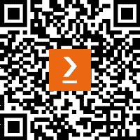

# 前言

如果你曾参与过分布式应用、基础设施或客户端库的开发，你很可能遇到过许多分布式系统可能崩溃的方式。

例如，你服务中的默认重试策略可能会使其及其所有依赖项崩溃。在特定负载下，竞争条件可能导致死锁，或者在用户账户之间导致数据泄露。通常只需毫秒的用户操作可能会显著减慢，而服务仪表板却没有任何其他问题的迹象。功能性问题可能会在用户端产生模糊和难以解释的影响。

当与分布式应用一起工作时，我们依赖遥测来评估其性能和功能。我们需要更多的遥测来识别和缓解问题。

在过去，我们依赖于使用供应商特定 SDK 收集的自定义日志和指标。我们构建了自定义解析器、处理管道和报告工具，以便使遥测数据可用。

然而，随着应用的日益复杂，我们需要更好的、更用户友好的方法来理解我们系统中正在发生的事情。我个人认为，阅读数兆字节的日志或视觉检测指标中的异常是不切实际的。

分布式跟踪是一种允许我们在整个系统中跟踪操作的技术。它为我们提供的遥测数据提供了关联性和因果关系，使我们能够检索描述特定操作的 所有相关数据，或者根据上下文（如请求的资源或用户标识符）找到所有操作。

仅分布式跟踪是不够的；我们需要其他遥测信号，如指标、事件、日志和配置文件，以及收集和将它们导出到可观察性后端库。幸运的是，我们有 OpenTelemetry 来完成这项任务。OpenTelemetry 是一个多云原生、供应商中立的遥测平台，支持多种编程语言。它提供了收集自定义数据所需的核心组件，以及针对常见技术的仪器库。OpenTelemetry 为不同的信号标准化遥测格式，确保收集数据的关联性、一致性和结构。

通过利用一致和结构化的遥测数据，不同的可观察性供应商可以提供诸如服务图、跟踪可视化、错误分类以及检测导致故障的常见属性等工具。这本质上使我们能够自动化性能分析中人类难以处理的易出错和繁琐的部分。监控和调试技术现在可以成为整个行业的标准化实践，不再依赖于部落知识、运行手册或过时的文档。

*.NET 中的现代分布式跟踪*探讨了.NET 应用程序中遥测收集的所有方面，重点关注分布式跟踪和性能分析。它从可观测性挑战和解决方案的概述开始，然后深入探讨现代.NET 应用程序提供的内置监控功能。当与 OpenTelemetry 一起使用时，这些功能变得更加引人注目。虽然共享的 OpenTelemetry 配置库可以带我们走很长的路，但有时我们仍然需要编写自定义配置。本书展示了如何在考虑性能影响和冗余的情况下收集自定义跟踪、指标和日志。它还涵盖了常见云模式（如网络调用、消息传递和数据库交互）的配置。最后，它讨论了在现有系统中实施和演进可观测性的组织和技术方面。

可观测性领域仍然相对较新且发展迅速，这意味着几乎任何问题都有多种解决方案。本书旨在解释基本可观测性概念，并提供几种可能的解决方案来解决常见问题，同时突出相关的权衡。它还帮助您获得实际技能，以实现和利用跟踪和可观测性。

我希望您觉得提供的示例有用，并将它们用作实验的游乐场。我鼓励您探索新的和创造性的方法来使分布式系统更具可观测性，并将您的发现与社区分享！

# 本书面向对象

本书面向使用现代可观测性工具和标准的.NET 服务的软件开发人员、架构师和系统操作员。它提供了一种全面的方法来分析性能和端到端调试。软件测试人员和支持工程师也会发现这本书很有用。假设读者对 C#编程语言和.NET 平台有基本了解，以便理解手动配置的示例，但这不是必需的。

# 本书涵盖内容

*第一章*，*现代应用程序的可观测性需求*，概述了常见的监控技术并介绍了分布式跟踪。它涵盖了 OpenTelemetry——一个供应商无关的遥测平台，并展示了它是如何通过关联的遥测信号解决分布式应用程序的可观测性挑战的。

*第二章*，*.NET 中的本地监控*，概述了.NET 提供的开箱即用的诊断功能。这些功能包括结构化和关联的日志和计数器，以及使用 dotnet-monitor 工具的临时监控。我们还将使用 OpenTelemetry 对第一个应用程序进行配置，并亲身体验分布式跟踪。

*第三章*, *.NET 可观察性生态系统*，探讨了更广泛的跟踪仪器化和环境。我们将学习如何查找和评估仪器库，从 Dapr 等基础设施获取跟踪，并最终以 AWS Lambda 和 Azure Functions 为例，展示如何对无服务器应用程序进行仪器化。

*第四章*, *使用诊断工具进行低级性能分析*，介绍了更低级别的.NET 诊断和性能分析。我们将了解如何收集和分析运行时计数器和性能跟踪，以便在分布式跟踪提供不足的情况下，在进程内获得更多的可观察性。

*第五章*, *配置和控制平面*，概述了 OpenTelemetry 的配置和定制。我们将探索不同的采样策略，并学习如何丰富和过滤跨度或自定义指标收集。最后，我们将介绍 OpenTelemetry Collector——一个可以处理许多遥测后处理任务的代理。

*第六章*, *跟踪您的代码*，深入探讨了使用.NET 跟踪 API 或 OpenTelemetry shim 的跟踪仪器化。在这里，我们将了解用于收集跨度、展示如何在进程内利用环境上下文传播以及记录事件和异常的`Activity`和`ActivitySource`类。我们还将涵盖对仪器化代码的集成测试。

*第七章*, *添加自定义指标*，深入探讨了现代.NET 指标 API。您将了解可用的仪器——计数器、仪表和直方图，它们用于以不同的方式聚合测量值，并获得实际操作经验，以实现和使用指标来监控系统健康或调查性能问题。

*第八章*, *编写结构和关联日志*，概述了.NET 中的日志记录，重点关注`Microsoft.Extension.Logging`。我们将学习如何高效地编写结构和可查询的日志，并使用 OpenTelemetry 收集它们。我们还将探讨如何使用 OpenTelemetry Collector 来管理日志成本。

*第九章*, *最佳实践*，提供了根据应用需求和场景选择最合适的遥测信号的建议，并展示了如何以最小的可观察性影响来控制遥测成本。它还介绍了 OpenTelemetry 语义约定——针对常见模式和技术的遥测收集配方。

*第十章*, *跟踪网络调用*，以 gRPC 为例探讨了网络调用仪器。我们将学习如何根据 RPC 语义约定对简单的请求-响应调用进行仪器化，并传播上下文。我们还将涵盖在仪器化流式调用时的挑战和可能的解决方案。

*第十一章*，*仪表化消息场景*，探讨了异步处理场景的仪表化。我们将学习如何端到端跟踪消息，仪表化批处理场景，并引入特定于消息的指标，以便检测扩展和性能问题。

*第十二章*，*仪表化数据库调用*，探讨了使用跟踪和指标进行数据库和缓存仪表化。我们还将介绍将外部指标从 Redis 实例转发到我们的可观测性后端，并使用收集到的遥测数据进行性能分析和缓存策略优化。

*第十三章*，*推动变革*，涵盖了与可观测性改进相关的组织和规划方面。我们将讨论低可观测性的成本，并提出几种衡量方法。我们将制定一个入职计划，讨论常见陷阱，并了解如何从更好的可观测性中受益于日常开发任务。

*第十四章*，*创建您的约定*，提供了从统一的 OpenTelemetry 配置开始，在整个系统中一致收集遥测数据的建议。我们还将学习如何定义自定义语义约定并在共享代码中实现它们，使其易于遵循。

*第十五章*，*对遗留应用程序进行仪表化*，讨论了在存在遗留服务的情况下对系统新部分进行仪表化的挑战。我们将提出可以最小化对遗留组件更改的解决方案，并学习利用遗留相关性传播格式，实现最小化传递上下文传播，并将遥测数据从遗留服务转发到新的后端。

# 为了充分利用这本书

本书中的示例是用.NET 7.0 开发的。大多数示例都是跨平台的，可以在 Docker Linux 容器中或使用`dotnet` CLI 工具运行。示例在 Windows 操作系统上使用 OpenTelemetry 版本 1.4.0 进行了测试。它们应该与.NET 和 OpenTelemetry 库的未来版本兼容。我们在`docker-compose`文件中使用 OpenTelemetry Collector、Prometheus、Jaeger 和其他外部图像的固定版本。

在*第三章*，*《.NET 可观测性生态系统》*中，我们将尝试使用 AWS 和 Azure 客户端库和无服务器环境。建议拥有 AWS 和/或 Azure 订阅，但并非必需。我们将在 AWS 的免费层内和 Azure 的促销信用额度内进行操作。

| **本书中涵盖的软件/硬件** | **操作系统要求** |
| --- | --- |
| .NET SDK 7.0 | Windows、macOS 或 Linux |
| OpenTelemetry for .NET 版本 1.4.0 | Windows、macOS 或 Linux |
| Docker 和`docker-compose`工具 | Windows、macOS 或 Linux |
| .NET Framework 4.6.2（在*第十五章*中用于一个遗留系统的示例） | Windows |
| PerfView 工具（在*第四章*中） | Windows，有可用的跨平台替代方案 |

虽然 OpenTelemetry 保证未来版本中的 API 兼容性，但本书中提到的语义约定并不稳定。因此，跨度、指标、事件和属性可能会被重命名或以不同的方式更改。请参考 OpenTelemetry 规范仓库（[`github.com/open-telemetry/opentelemetry-specification`](https://github.com/open-telemetry/opentelemetry-specification)）以了解语义约定领域的最新动态。

**如果您正在使用本书的数字版，我们建议您亲自输入代码或从本书的 GitHub 仓库（下一节中提供链接）获取代码。这样做将帮助您避免与代码的复制和粘贴相关的任何潜在错误。** ****

# 下载示例代码文件

您可以从 GitHub 下载本书的示例代码文件[`github.com/PacktPublishing/Modern-Distributed-Tracing-in-.NET`](https://github.com/PacktPublishing/Modern-Distributed-Tracing-in-.NET)。如果代码有更新，它将在 GitHub 仓库中更新。

我们还提供了来自我们丰富的书籍和视频目录中的其他代码包，可在[`github.com/PacktPublishing/`](https://github.com/PacktPublishing/)找到。查看它们吧！

# 代码在行动

本书“代码在行动”视频可在[`packt.link/O10rj`](https://packt.link/O10rj)查看。

# 下载彩色图像

我们还提供了一份包含本书中使用的截图和图表彩色图像的 PDF 文件。您可以从这里下载：[`packt.link/BBBNm`](https://packt.link/BBBNm)。

# 使用的约定

本书中使用了多种文本约定。

`Code in text`：表示文本中的代码单词、数据库表名、文件夹名、文件名、文件扩展名、路径名、虚拟 URL、用户输入和 Twitter 用户名。以下是一个示例：“另一种选择是将 W3C Trace Context 格式的`traceparent`值作为字符串传递给`StartActivity`方法。”

代码块设置如下：

```cs
using var activity = Source.StartActivity("DoWork");
try
{
  await DoWorkImpl(workItemId);
}
catch
{
  activity?.SetStatus(ActivityStatusCode.Error);
}
```

当我们希望您注意代码块中的特定部分时，相关的行或项目将以粗体显示：

```cs
using var provider = Sdk.CreateTracerProviderBuilder()
  .ConfigureResource(b => b.AddService("sample"))
  .AddSource("Worker")
  .AddJaegerExporter()
```

任何命令行输入或输出都按以下方式编写：

```cs
$ docker-compose up --build
$ dotnet run
```

**粗体**：表示新术语、重要单词或您在屏幕上看到的单词。例如，菜单或对话框中的单词以粗体显示。以下是一个示例：“让我们用 PerfView 打开跟踪文件，然后单击**线程** **时间**选项。”

小贴士或重要提示

看起来像这样。

# 联系我们

我们始终欢迎读者的反馈。

**一般反馈**：如果您对本书的任何方面有疑问，请通过电子邮件发送至 customercare@packtpub.com，并在邮件主题中提及书名。

**勘误**：尽管我们已经尽最大努力确保内容的准确性，但错误仍然可能发生。如果您在这本书中发现了错误，我们将不胜感激，如果您能向我们报告。请访问[www.packtpub.com/support/errata](http://www.packtpub.com/support/errata)并填写表格。

**盗版**：如果您在互联网上以任何形式发现我们作品的非法副本，如果您能提供位置地址或网站名称，我们将不胜感激。请通过版权@packt.com 与我们联系，并提供材料的链接。

**如果您有兴趣成为作者**：如果您在某个领域有专业知识，并且您有兴趣撰写或为书籍做出贡献，请访问[authors.packtpub.com](http://authors.packtpub.com)。

分享您的想法

读完*Modern Distributed Tracing in .NET*后，我们非常乐意听到您的想法！扫描下面的二维码直接进入这本书的亚马逊评论页面并分享您的反馈。


https://packt.link/r/1-837-63613-3

您的评论对我们和科技社区非常重要，并将帮助我们确保我们提供高质量的内容。

# 下载本书的免费 PDF 副本

感谢您购买此书！

您喜欢随时随地阅读，但无法携带您的印刷书籍吗？

您的电子书购买是否与您选择的设备不兼容？

别担心，现在每购买一本 Packt 书籍，您都可以免费获得该书的 DRM 免费 PDF 版本。

在任何地方、任何设备上阅读。直接从您最喜欢的技术书籍中搜索、复制和粘贴代码到您的应用程序中。

优惠不止于此，您还可以获得独家折扣、时事通讯和每日免费内容的邮箱访问权限。

按照以下简单步骤获取福利：

1.  扫描下面的二维码或访问以下链接。



[`packt.link/free-ebook/9781837636136`](https://packt.link/free-ebook/9781837636136)

1.  提交您的购买证明

1.  就这些！我们将直接将免费 PDF 和其他福利发送到您的邮箱。

# 第一部分：介绍分布式追踪

在这部分，我们将介绍分布式追踪的核心概念，并展示它是如何使运行云应用变得更容易的。我们将自动为我们的第一个服务进行配置，并探索围绕 OpenTelemetry 构建的.NET 可观察性方法。

本部分包含以下章节：

+   *第一章*，*现代应用的可观察性需求*

+   *第二章*，*.NET 中的原生监控*

+   *第三章*，*.NET 可观察性生态系统*

+   *第四章*，*使用诊断工具进行低级性能分析*
