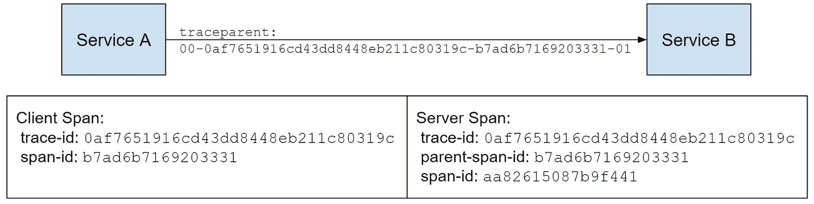

# 第一章：现代应用程序的可观察性需求

随着分布式系统复杂性的增加，我们需要更好的工具来构建和运行我们的应用程序。**分布式跟踪**就是这样一种技术，它允许您以最小的努力收集结构化和关联的遥测数据，并使可观察性供应商能够构建强大的分析和自动化工具。

在本章中，我们将探讨常见的可观察性挑战，并了解分布式跟踪如何将可观察性带到我们的系统中，而日志和计数器无法做到这一点。我们将看到关联和因果关系，以及结构化和一致的遥测数据如何帮助回答关于系统的任意问题，并更快地缓解问题。

这是你将学到的内容：

+   使用计数器、日志和事件概述监控技术

+   分布式跟踪的核心概念——跨度及其结构

+   上下文传播标准

+   如何生成有意义且一致的遥测数据

+   如何使用分布式跟踪、指标和日志进行性能分析和调试

到本章结束时，你将熟悉分布式跟踪的核心概念和构建块，你将能够将其与其他遥测信号一起使用，以调试功能问题和调查分布式应用程序中的性能问题。

# 理解为什么日志和计数器不足以满足需求

监控和可观察性文化在行业中各不相同；一些团队使用`printf`进行临时调试，而其他团队则采用复杂的可观察性解决方案和自动化。然而，几乎每个系统都使用常见的遥测信号组合：日志、事件、指标或计数器，以及配置文件。仅遥测收集是不够的。如果我们能够检测和调查问题，则系统是**可观察的**，为了实现这一点，我们需要工具来存储、索引、可视化和查询遥测数据，跨不同信号导航，并自动化重复分析。

在我们开始探索跟踪并了解它如何帮助之前，让我们谈谈其他遥测信号及其局限性。

## 日志

**日志**是某些事件的记录。日志通常包含时间戳、级别、类名和格式化消息，并且可能还包含带有额外上下文的属性包。

日志是一种低仪式的工具，任何生态系统都有大量的日志库和工具。

日志中常见的问题包括以下内容：

+   **冗余**: 初始阶段，我们不会有足够的日志，但最终，随着我们填补空白，我们将拥有过多的日志。它们变得难以阅读且存储成本高昂。

+   **性能**: 即使使用得当，日志记录也是一个常见性能问题。在日志级别被禁用时，序列化对象或为日志分配字符串也是非常常见的。

*一条新的日志语句可能会让你的生产环境崩溃；我有过一次这样的经历。我添加的日志每毫秒都会写一次。乘以服务实例的数量，它创建了一个足够大的 I/O 瓶颈，足以显著增加延迟和用户的错误率*。

+   **不可查询**：来自应用程序的日志是供人类使用的。我们可以在应用程序内部添加上下文并统一格式，但仍只能通过上下文属性来过滤日志。日志会随着每次重构而改变，消失或过时。新加入团队的人需要学习特定于系统的日志语义，学习曲线可能很陡峭。

+   **无关联**：不同操作的日志是交织在一起的。寻找描述某些操作的日志的过程称为关联。一般来说，日志关联，尤其是在服务之间，必须手动实现（剧透：不是在 ASP.NET Core 中）。

注意

日志易于生成，但很冗长，可能会显著影响性能。它们也难以过滤、查询或可视化。

为了便于访问和有用，日志被发送到某个中心位置，即**日志管理系统**，它存储、解析和索引它们，以便可以查询。这意味着你的日志至少需要有一些结构。

`.NET 中的`ILogger`支持结构化日志记录，正如我们将在*第八章*，“编写结构化和关联日志”中看到的，因此你得到的是可读性强的消息，以及上下文。结构化日志记录，结合结构化存储和索引，将你的日志转换为丰富的事件，你可以用于几乎任何事情。

## 事件

**事件**是某事的记录。它有一个时间戳和属性包。它可能有一个名称，或者这可能是属性之一。

日志和事件之间的区别是语义上的——事件是有结构的，通常遵循特定的模式。

例如，描述向购物袋添加商品的日志应该有一个众所周知的名字，例如`shopping_bag_add_item`，并具有`user-id`和`item-id`属性。然后，你可以通过名称、项目和用户来查询它们。例如，你可以找到所有用户中最受欢迎的前 10 个商品。

如果你将其作为日志消息编写，你可能会写一些像这样的事情：

```cs
logger.LogInformation("Added '{item-id}' to shopping bag
  for '{user-id}'", itemId, userId)
```

如果你的日志提供程序捕获单个属性，你将获得与事件相同的环境。因此，现在我们可以找到关于这个用户和商品的每一条日志，这很可能包括与添加商品无关的其他日志。

注意

具有一致模式的日志可以有效地查询，但与日志一样存在冗长和性能问题。

## 指标和计数器

日志和事件存在相同的问题——冗长和性能开销。解决这些问题的方法之一是聚合。

**指标**是某物通过维度和时间聚合的值。例如，请求延迟指标可以包含 HTTP 路由、状态码、方法、服务名称和实例维度。

指标常见的难题包括以下：

+   **基数**：每个维度的组合都是一个时间序列，聚合发生在单个时间序列内。添加一个新维度会导致组合爆炸，因此指标必须具有低基数——也就是说，它们不能有太多的维度，并且每个维度必须具有少量不同的值。因此，你不能使用指标来衡量像每个用户的体验这样的细粒度事物。

+   **无因果关系**：指标仅显示相关性，没有因果关系，因此它们不是调查问题的优秀工具。

作为你系统的专家，你可能使用你的直觉来找出某些类型行为可能的原因，然后使用指标来证实你的假设。

+   `queue_is_full` 或 `queue_is_empty`。像 `queue_utilization` 这样的东西会更通用。随着时间的推移，指标的数量会随着警报、仪表板和依赖它们的团队流程数量的增加而增长。

注意

指标对性能的影响很小，体积不大，不会随着规模的增长而大幅增长，存储成本低，查询时间短。它们非常适合仪表板和警报，但不适合问题调查或细粒度分析。

**计数器**是一个单一的时间序列——它是一个没有维度的指标，通常用于收集资源利用率，如 CPU 负载或内存使用。计数器不适合应用程序性能或使用，因为你需要为每个属性组合（如 HTTP 路由、状态码和方法）设置一个专门的计数器。收集它们很困难，使用起来更难。幸运的是，.NET 支持具有维度的指标，我们将在*第七章*，“添加自定义指标”中讨论它们。

## 缺少什么？

现在你已经知道你需要监控单体或小型分布式系统所需的一切——使用指标进行系统健康分析和警报，事件用于使用情况，日志用于调试。这种方法已经将科技行业推进很远，而且其中并没有本质上的错误。

通过最新的文档、几个关键的性能和用量指标、简洁、结构化、相关和一致的事件、跨所有服务的通用约定和工具，任何操作你的系统的人都可以进行性能分析和调试问题。

注意

*因此，最终目标是高效地运营系统，问题不在于特定的遥测信号或其局限性，而在于缺乏标准解决方案、实践、相关性以及现有信号的结构。*

在我们深入分布式跟踪并了解其生态系统如何解决这些差距之前，让我们总结一下我们对于完美可观察性解决方案的新要求，我们打算通过跟踪来解决这些问题，以及它带来的新功能。同时，我们也应该记住旧的功能——低性能开销和可管理的成本。

### 系统性调试

我们需要能够以通用方式调查问题。从错误报告到指标上的警报，我们应该能够深入问题，从头到尾跟踪特定的请求，或者从堆栈深处的错误向上冒泡，以了解其对用户的影响。

所有这些都应该在你被叫醒并在凌晨 2 点被叫去解决生产中的事件时相对容易完成。

### 回答即兴问题

我可能想知道来自华盛顿州雷德蒙德的用户是否在购买我的网站上的产品时经历了比平时更长的配送时间，以及原因——是因为运输公司、雨水、该地区的云服务提供商问题，或其他任何原因。

不需要添加更多遥测来回答大多数使用或性能问题。偶尔，你可能需要添加一个新的上下文属性或事件，但在稳定的代码路径上这应该是罕见的。

### 自文档化系统

现代系统是动态的——随着持续部署、运行时功能标志的变化以及数十个具有自己不稳定性的外部依赖项，没有人能知道一切。

遥测成为你唯一的真相来源。假设它有足够的上下文和通用语义，一个可观测性供应商应该能够合理地可视化它。

### 自动仪器化

在你的系统中为所有事物进行仪器化是困难的——它是重复的、易出错的，并且难以保持最新、测试和强制执行通用的模式和语义。我们需要为常见的库共享仪器化，而我们会仅添加特定于应用程序的遥测和上下文。

理解了这些要求后，我们将继续讨论分布式跟踪。

# 介绍分布式跟踪

**分布式跟踪**是一种将结构、关联和因果关系引入收集遥测的技术。它定义了一个特殊的事件称为*跨度*，并指定了跨度之间的因果关系。跨度遵循用于可视化和分析跟踪的通用约定。

## 跨度

**跨度**描述了一个操作，如入站或出站 HTTP 请求、数据库调用、昂贵的 I/O 调用或任何其他有趣的调用。它具有足够的结构来表示任何事物，同时仍然有用。以下是跨度最重要的属性：

+   跨度的名称应以人类可读的格式描述操作类型，具有低基数，并且易于人类阅读。

+   跨度的开始时间和持续时间。

+   状态表示成功、失败或无状态。

+   跨度类型区分客户端、服务器和内部调用，或在异步场景中的生产者和消费者。

+   属性（也称为标签或注释）描述特定的操作。

+   跨度上下文标识跨度并在各处传播，以实现关联。父跨度标识符也包含在子跨度中，以表示因果关系。

+   事件提供了关于跨度内操作的其他信息。

+   当父子关系不起作用时，链接将连接跟踪和跨度——例如，在批处理场景中。

注意

在 .NET 中，追踪跨度由 `System.Diagnostics.Activity` 表示。`System.Span` 类与分布式追踪无关。

### 跨度之间的关系

跨度是一个追踪的单位，为了追踪更复杂的操作，我们需要多个跨度。

例如，用户可能尝试获取一个图像并向服务发送请求。图像未缓存，服务从冷存储中请求它（如图 *图 1*.1 所示）：


图 1.1 – GET 图像请求流程

为了使此操作可调试，我们应该报告多个跨度：

1.  传入的请求

1.  从缓存中获取图像的尝试

1.  从冷存储中检索图像

1.  缓存图像

这些跨度形成一个 `trace-id`。在追踪中，每个跨度由 `span-id` 标识。跨度包括指向父级跨度的指针——它只是父级的 `span-id`。

`trace-id`、`span-id` 和 `parent-span-id` 允许我们不仅关联跨度，而且记录它们之间的关系。例如，在 *图 1*.2 中，我们可以看到 Redis `GET`、`SETEX` 和 `HTTP GET` 跨度是兄弟，而传入的请求是它们的父级：


图 1.2 – 展示跨度之间关系的追踪可视化

跨度可以具有更复杂的关系，我们将在后面的 *第六章* *追踪您的代码* 中讨论。

`trace-id` 和 `span-id`) 使得跨信号场景更加有趣。例如，您可以在日志上标记父级跨度上下文（剧透：只需配置 `ILogger` 即可）并将日志与追踪相关联。例如，如果您使用 `ConsoleProvider`，您将看到如下内容：


图 1.3 – 日志包括跨度上下文，可以与其他信号相关联

您还可以使用示例将度量与追踪相关联——包含对记录测量有贡献的操作的追踪上下文的度量元数据。例如，您可以检查与您延迟分布长尾对应的跨度示例。

### 属性

**跨度属性**是一个包含关于操作详细信息的属性包。

跨度属性应该足够详细地描述这个特定的操作，以便理解发生了什么。OpenTelemetry 语义约定指定了用于帮助此目的的属性，我们将在本章后面的 *确保一致性和结构* 部分讨论。

例如，一个传入的 HTTP 请求至少由以下属性标识：HTTP 方法、路径、查询、API 路由和状态码：


图 1.4 – HTTP 服务器跨度属性

### 仪器化点

因此，我们已经定义了跨度及其属性，但我们应该在何时创建跨度？我们应该在它们上放置哪些属性？虽然没有严格的遵循标准，但以下是一些经验法则：

*为每个传入和传出的网络调用创建一个新的跨度，并在可用时使用协议或技术的标准属性。*

这就是我们之前在 memes 示例中做过的事情，它使我们能够看到在服务边界上发生了什么，并检测到常见问题：依赖性问题、状态、延迟以及每个服务的错误。这也使我们能够关联日志、事件以及我们收集的任何其他内容。此外，可观察性后端了解 HTTP 语义，并将知道如何解释和可视化您的跨度。

这条规则有一些例外，例如套接字调用，其中请求可能太小而无法进行仪器化。在其他情况下，您可能仍然会合理地关注冗长性和生成数据的量——我们将在 *第五章* *配置和控制平面* 中看到如何通过采样来控制它。

## 跟踪 - 构建块

现在您已经熟悉了跟踪的核心概念及其方法论，让我们来谈谈实现。我们需要一组方便的 API 来创建和丰富跨度，并在周围传递上下文。历史上，每个 **应用性能监控**（**APM**）工具都有自己的 SDK，用于使用它们自己的 API 收集遥测数据。更换 APM 供应商意味着重写所有的仪器代码。

OpenTelemetry 解决了这个问题——它是一个跨语言的遥测平台，用于跟踪、指标、事件和日志，统一了遥测收集。大多数 APM 工具、日志管理和可观察性后端都支持 OpenTelemetry，因此您可以在不重写任何仪器代码的情况下更换供应商。

.NET 跟踪实现符合 OpenTelemetry API 规范，在这本书中，.NET 跟踪 API 和 OpenTelemetry API 是可以互换使用的。我们将在 *第六章* *跟踪您的代码* 中讨论它们之间的区别。

尽管 OpenTelemetry 基本原语已嵌入 .NET 中，且仪器代码不依赖于它们，但为了从应用程序中收集遥测数据，我们仍然需要添加 **OpenTelemetry SDK**，它包含我们配置收集和导出器所需的一切。您也可以编写自己的与 .NET 跟踪 API 兼容的解决方案。

OpenTelemetry 成为了跟踪及其他领域的行业标准；它支持多种语言，除了提供统一的 API 集合外，它还提供了可配置的 SDK 和遥测的标准线格式——**OpenTelemetry 协议**（**OTLP**）。您可以通过添加特定的导出器或将后端配置为支持 OTLP，将遥测数据发送到任何兼容的供应商。

如 *图 1**.5* 所示，应用程序配置 OpenTelemetry SDK 以将遥测数据导出到可观察性后端。应用程序代码、.NET 库和各种仪器化使用 .NET 跟踪 API 创建跨度，OpenTelemetry SDK 会监听、处理并将它们转发到导出器。


图 1.5 – 跟踪构建块

因此，OpenTelemetry 将仪器化代码与可观察性供应商解耦，但它做的远不止这些。现在，不同的应用程序可以共享仪器化库，可观察性供应商可以在其之上构建丰富的体验。

### 仪器化

从历史上看，所有 APM 供应商都必须对流行的库进行仪器化：HTTP 客户端、Web 框架、Entity Framework、SQL 客户端、Redis 客户端库、RabbitMQ、云提供商的 SDK 等。这并不容易扩展。但有了 .NET 跟踪 API 和 OpenTelemetry 语义，仪器化对所有供应商都变得普遍。你可以在 OpenTelemetry Contrib 仓库中找到一个不断增长的共享社区仪器化列表：[`github.com/open-telemetry/opentelemetry-dotnet-contrib`](https://github.com/open-telemetry/opentelemetry-dotnet-contrib)。

此外，由于 OpenTelemetry 是一个供应商中立的标准化方案，并且已经集成到 .NET 中，现在库可以实现原生仪器化——HTTP 和 gRPC 客户端、ASP.NET Core 以及其他几个库都支持它。

即使有原生跟踪支持，默认情况下也是关闭的——你需要安装和注册特定的仪器（我们将在 *第二章* 中介绍，*Native Monitoring in .NET*）。否则，跟踪代码将不起作用，因此不会增加任何性能开销。

### 后端

**可观察性后端**（也称为监控、APM 工具和日志管理系统）是一组负责摄取、存储、索引、可视化、查询以及可能帮助您监控系统、调查问题和分析性能的其他工具。

**可观察性供应商**构建这些工具，并提供丰富的用户体验，帮助你使用跟踪以及其他信号。

使用 OpenTelemetry 生态系统收集常见库的跟踪变得容易。正如你在 *第二章* 中将看到的，*Native Monitoring in .NET*，大部分工作都可以在启动时通过几行代码自动完成。但我们是怎样使用它们的呢？

当你可以将跨度发送到 `stdout` 并将它们存储在文件系统中时，这并不会充分利用所有跟踪的优势。跟踪数据可能非常大，即使它们很小，使用 `grep` 来搜索它们也不方便。

跟踪可视化（如甘特图、跟踪查看器或跟踪时间线）是跟踪提供者常见的功能之一。*图 1**.6* 展示了 Jaeger 中的跟踪时间线——一个开源的分布式跟踪平台：


图 1.6 – 在 Jaeger 中标记感叹号显示错误的跟踪可视化

虽然找到错误日志可能需要一段时间，但可视化显示了重要的信息——失败的位置、延迟和步骤序列。正如我们在*图 1.6*中可以看到的那样，前端调用失败是因为存储端的问题，我们可以进一步深入调查。

然而，我们也可以看到前端对存储进行了四次连续调用，这可能会并行执行以加快速度。

另一个常见功能是通过 span 的任何属性进行过滤或查询，例如名称、`trace-id`、`span-id`、`parent-id`、名称、属性名称、状态、时间戳、持续时间或任何其他内容。*图 1.7*中显示了此类查询的一个示例：


图 1.7 – 计算 Redis 命中率的自定义 Azure Monitor 查询

例如，我们不报告缓存命中率的指标，但我们可以从跟踪中估计它。虽然由于采样它们可能不够精确，并且可能比指标查询更昂贵，但我们仍然可以临时这样做，尤其是在我们调查特定故障时。

由于跟踪、指标和日志是相关的，如果你的供应商支持多个信号或与其他工具良好集成，你将充分利用可观察性功能。

# 检查上下文传播

相关性和因果关系是分布式跟踪的基础。我们刚刚介绍了相关 span 如何共享相同的`trace-id`，并在`parent-span-id`中记录指向父 span 的指针，形成一个操作因果链。现在，让我们探索它在实际中的工作方式。

## 进程内传播

即使在单个服务中，我们通常也有嵌套的 span。例如，如果我们跟踪一个请求到只从数据库读取项目的 REST 服务，我们至少想要看到两个 span——一个用于传入的 HTTP 请求，另一个用于数据库查询。为了正确关联它们，我们需要从 ASP.NET Core 传递 span 上下文到数据库驱动程序。

一种选择是显式地将上下文作为函数参数传递。在 Go 中，这是一个可行的解决方案，因为显式上下文传播是一个标准，但在.NET 中，它会使分布式跟踪的入门变得困难，并破坏自动化的魔法。

.NET Activity（也称为 span）是隐式传播的。当前活动可以通过`Activity.Current`属性访问，该属性由`System.Threading.AsyncLocal<T>`支持。

使用我们之前的例子，一个从数据库读取的服务，ASP.NET Core 为入站请求创建一个 Activity，并且它成为此请求范围内发生的任何事情的当前 Activity。数据库驱动程序的仪器创建另一个使用 `Activity.Current` 作为其父级的 Activity，而不了解 ASP.NET Core，并且用户应用程序没有传递 Activity。如果配置为这样做，日志框架会在 `Activity.Current` 上盖章 `trace-id` 和 `span-id`。

它适用于同步或异步代码，但如果你在后台使用内存队列处理项目或显式地使用线程进行操作，你将不得不帮助运行时并显式传播活动。我们将在 *第六章*，*跟踪你的代码* 中更多地讨论这个问题。

## 进程外传播

进程内关联很棒，对于单体应用程序来说，几乎足够。但在微服务世界中，我们需要端到端跟踪请求，因此需要在网络上传播上下文，这就是标准发挥作用的地方。

在这个领域你可以找到多种实践——每个用于支持自定义内容的复杂系统，例如 `x-correlation-id` 或 `x-request-id`。在旧版 Google 系统中可以找到 `x-cloud-trace-context` 或 `grpc-trace-bin`，在 AWS 上可以找到 `X-Amzn-Trace-Id`，在 Microsoft 生态系统中可以找到 `Request-Id` 变体和 `ms-cv`。假设你的系统是异构的，并使用各种云提供商和跟踪工具，关联变得困难。

跟踪上下文（你可以在 [`www.w3.org/TR/trace-context`](https://www.w3.org/TR/trace-context) 上更详细地了解）是一个相对较新的标准，它将 HTTP 上的上下文传播转换为标准，但它被广泛采用，并在 OpenTelemetry 和 .NET 中默认使用。

### W3C 跟踪上下文

跟踪上下文标准定义了 `traceparent` 和 `tracestate` HTTP 头以及填充它们的格式。

#### 跟踪上下文头

`traceparent` 是一个 HTTP 请求头，它以以下格式携带协议版本、`trace-id`、`parent-id` 和 `trace-flags`：

```cs
traceparent: {version}-{trace-id}-{parent-id}-{trace-flags}
```

+   `version`：协议版本——目前只定义了 `00`。

+   `trace-id`：逻辑端到端操作 ID。

+   `parent-id`：标识客户端 span 并作为相应服务器 span 的父级。

+   `trace-flags`：表示采样决策（我们将在 *第五章*，*配置和控制平面* 中讨论）。现在我们可以确定 `00` 表示父 span 被采样出来，而 `01` 表示它被采样进来。

所有标识符都必须存在——也就是说，`traceparent` 有一个固定的长度，易于解析。*图 1**.8* 展示了使用 `traceparent` 头的上下文传播示例：



图 1.8 – `traceparent` 从出站跨度上下文中填充并成为入站跨度的父级

注意

该协议不要求创建跨度，也不指定仪器点。常见的做法是针对每个出站和入站请求创建跨度，并将客户端跨度上下文放入请求头部。

#### 跟踪状态头部

`tracestate` 是另一个请求头，它为跟踪工具提供了额外的上下文。它是**为 OpenTelemetry 或 APM 工具携带额外的控制信息而设计的，而不是为特定应用程序的上下文**（在后面的 *Baggage* 部分中详细说明）。

`tracestate` 由一系列键值对组成，序列化为以下格式的字符串：`"vendor1=value1,vendor2=value2"`。

`tracestate` 可以用来传播不兼容的旧版关联 ID，或者供应商需要的某些附加标识符。

例如，OpenTelemetry 使用它来携带采样概率和分数。例如，`tracestate: "ot=r:3;p:2"` 表示一个键值对，其中键是 `ot`（OpenTelemetry 标签），值是 `r:3;p:2`。

`tracestate` 头部有一个软限制在大小（512 个字符）上，并且可以被截断。

#### traceresponse（草案）头部

与 `traceparent` 和 `tracestate` 不同，**traceresponse** 是一个响应头。在撰写本文时，它由 W3C Trace-Context Level 2 定义（[`www.w3.org/TR/trace-context-2/`](https://www.w3.org/TR/trace-context-2/）），并达到了 W3C 编辑草案状态。在 .NET 或 OpenTelemetry 中没有对其的支持。

`traceresponse` 非常类似于 `traceparent`。它具有相同的格式，但不是客户端标识符，而是返回服务器跨度的 `trace-id` 和 `span-id` 值：

```cs
traceresponse: 00-{trace-id}-{child-id}-{trace-flags}
```

`traceresponse` 是可选的，从某种意义上说，服务器不需要返回它，即使它支持 W3C Trace-Context Level 2。当客户端没有传递有效的 `traceparent` 时，返回 `traceresponse` 是有用的，但可以记录 `traceresponse`。

面向外部服务的可能决定开始一个新的跟踪，因为他们不相信调用者的 `trace-id` 生成算法。均匀随机分布是一个担忧；另一个原因可能是特殊的 `trace-id` 格式。如果服务重新启动跟踪，返回 `traceresponse` 头部给调用者是一个好主意。

### B3

B3 规范（[https://github.com/openzipkin/b3-propagation](https://github.com/openzipkin/b3-propagation)）被 Zipkin – 分布式跟踪系统之一所采用。

B3 标识符可以以以下格式的单个 `b3` 头部进行传播：

```cs
b3: {trace-id}-{span-id}-{sampling-state}-{parent-span-id}
```

另一种方法是使用 `X-B3-TraceId`、`X-B3-SpanId`、`X-B3-ParentSpanId` 和 `X-B3-Sampled` 传递单个组件。

样本状态表示服务是否应该跟踪相应的请求。除了 `0`（不记录）和 `1`（记录）之外，它还允许我们通过将标志设置为 `d` 来强制跟踪。这通常用于调试目的。样本状态可以在没有其他标识符的情况下传递，以指定服务所需的采样决策。

注意

与 W3C Trace-Context 的关键区别，除了头部名称之外，还在于同时存在 `span-id` 和 `parent-span-id`。B3 系统可以在客户端和服务器端使用相同的 `span-id`，为两者创建单个跨度。

Zipkin 重用来自传入请求的 `span-id`，并在其上指定 `parent-span-id`。Zipkin 的跨度同时表示客户端和服务器，如图 *图 1**.9* 所示，记录它们的不同持续时间和状态：


图 1.9 – Zipkin 创建一个跨度来表示客户端和服务器

OpenTelemetry 和 .NET 支持 `b3` 头部，但忽略 `parent-span-id` – 它为每个跨度生成一个新的 `span-id`，因为不可能重用 `span-id`（见 *图 1**.10*）。


图 1.10 – OpenTelemetry 不使用 B3 头部中的父跨度 ID，并为客户端和服务器创建不同的跨度

### 行李

到目前为止，我们讨论了跨度上下文和关联。但在许多情况下，分布式系统具有特定于应用程序的上下文。例如，你在前端服务上授权用户，之后，`user-id` 对于应用程序逻辑不再需要，但你仍然希望将其作为属性添加到所有服务的跨度中，以便按用户查询和汇总。

你可以在前端一次性标记 `user-id`。然后，后端记录的跨度将不会有 `user-id`，但它们将与前端共享相同的 `trace-id`。因此，通过在查询中进行一些连接，你仍然可以进行按用户分析。这在某种程度上是可行的，但可能成本高昂或速度较慢，因此你可能决定传播 `user-id` 并将其标记在后台跨度上。

**行李** ([`www.w3.org/TR/baggage/`](https://www.w3.org/TR/baggage/)) 定义了分布式上下文的通用传播格式，你可以通过添加、读取、删除和修改行李成员来使用它进行业务逻辑或其他任何事情。例如，你可以将请求路由到测试环境，并传递功能标志或额外的遥测上下文。

行李由一系列分号分隔的成员组成。每个成员都有一个键、值以及以下格式的可选属性 – `key=value;property1;key2=property2` 或 `key=value;property1;key2=property2,anotherKey=anotherValue`。

OpenTelemetry 和.NET 只传播行李，但不会在遥测上盖章。您可以将`ILogger`配置为盖章行李，并需要显式丰富跟踪。我们将在*第五章*“配置和控制平面”中看到它是如何工作的。

小贴士

您不应在行李中放置任何敏感信息，因为它几乎不可能保证它会流向何处——您的应用程序或边车基础设施可以将其转发到您的云提供商或任何其他地方。

在您的系统中维护一个已知的行李键列表，并且只使用已知的键，否则您可能会收到来自另一个系统的行李。

行李规范处于*工作草案*状态，可能还会发生变化。

备注

虽然 W3C 跟踪上下文标准是针对 HTTP 的，而 B3 适用于任何 RPC 调用，但它们通常用于任何上下文传播需求——例如，在消息场景中，它们作为事件有效负载传递。一旦引入了特定协议的标准，这可能会改变。

# 确保一致性和结构

正如我们已经定义的，跨度是描述有趣操作的有序事件。

跨度的开始时间、持续时间、状态、类型和上下文是强类型的——它们使关联和因果关系成为可能，使我们能够可视化跟踪并检测失败或延迟问题。

跨度的名称和属性描述了一个操作，但不是强类型或严格定义的。如果我们不以有意义的方式填充它们，我们可以检测到问题，但无法了解实际发生了什么。

例如，对于客户端 HTTP 调用，除了通用属性之外，我们还想捕获至少 URL、方法和响应代码（或异常）——如果我们不知道这些中的任何一项，我们就处于盲目的状态。一旦我们填充了它们，我们就可以开始使用查询此类跨度进行一些强大的分析，以回答以下常见问题：

+   在这个请求的作用域内，哪些依赖项被调用？哪些失败了？它们的延迟是多少？

+   我的应用程序是并行还是顺序地独立调用依赖项？当可以延迟执行时，它是否发出任何不必要的请求？

+   依赖项端点是否配置正确？

+   每个依赖项 API 的成功或错误率和延迟是多少？

备注

这种分析依赖于一个应用程序使用相同的属性来处理所有 HTTP 依赖项。否则，执行查询的操作员将很难编写和维护它们。

将统一和社区驱动的遥测收集从可观察性供应商的盘子上拿掉后，他们现在可以完全专注于（半）自动化分析和提供强大的性能和故障分析工具。

OpenTelemetry 定义了一套关于跨度、跟踪和资源的语义约定，我们将在*第九章*“最佳实践”中详细讨论。

## 构建应用程序拓扑

分布式跟踪，结合语义约定，使我们能够构建如图*图 1.11*所示的应用程序图（也称为服务图），你可以看到整个系统以及关键的健康指标。它是任何调查的入口点。


图 1.11 – Azure Monitor 为 meme 服务创建的应用程序图是一个包含所有基本健康指标的最新系统图

可观测性供应商依赖于跟踪和指标语义来构建服务图。例如，客户端跨度上存在 HTTP 属性表示一个出站的 HTTP 调用，我们需要显示指向新依赖节点的出站箭头。我们应该根据跨度的主机属性来命名此节点。

如果我们看到相应的服务器跨度，我们现在可以根据跨度上下文和因果关系将服务器节点与依赖节点合并。还有其他可视化或自动化工具你可能觉得有用——例如，关键路径分析，或找到与更高延迟或错误率相对应的常见属性。这些每一个都依赖于跨度属性和遵循常见语义或至少在服务之间保持一致。

## 资源属性

**资源属性**描述了进程、主机、服务和环境，并且对于服务实例报告的所有跨度都是相同的——例如，服务名称、版本、唯一服务实例 ID、云提供商账户 ID、区域、可用区以及 K8s 元数据。

这些属性使我们能够检测特定环境或实例的特定异常——例如，只有具有新版本代码的实例的错误率增加，进入重启循环的实例，或在区域和可用区遇到问题的云服务。

基于标准属性，可观测性供应商可以编写通用查询来执行此分析或构建通用仪表板。它还使社区能够为流行技术创建供应商无关的工具和解决方案。

这些属性描述了一个服务实例，并不需要在每个跨度上出现——例如，OTLP 在每次跨度批次中只传递一次资源属性。

# 性能分析概述

现在你已经了解了分布式跟踪的核心概念，让我们看看我们如何使用可观测性堆栈来调查常见的分布式系统问题。

## 基线

在我们讨论问题之前，让我们建立一个代表健康系统行为的基线。我们还需要它来做出数据驱动的决策，以帮助以下常见设计和开发任务，例如：

+   **风险估计**：任何对热点路径上的功能工作都是发布前进行额外性能测试的良好候选者，并且使用功能标志保护新代码。

+   **容量规划**：了解当前负载对于理解系统是否可以处理计划的增长和新功能是必要的。

+   **理解改进潜力**：优化经常执行的代码更有意义，因为即使是小的优化也能带来显著的性能提升或成本降低。同样，提高可靠性为错误率较高且被其他服务使用的组件带来最大的好处。

+   **学习使用模式**：根据用户如何与您的系统交互，您可能需要更改您的扩展或缓存策略，将特定功能提取到新的服务中，或者合并服务。

描述每个服务性能的通用指标包括以下内容：

+   **延迟**：服务响应的速度

+   **吞吐量**：每秒服务处理多少请求、事件或字节数

+   **错误率**：服务返回的错误数量

您的系统可能需要其他指标来衡量持久性或数据正确性。

当这些信号包括 API 路由、状态码和其他上下文属性时，每个信号都很有用。例如，错误率可能总体上很低，但对于特定用户或 API 路由却很高。

在可能的情况下，在服务器和客户端上测量信号，可以给您一个更清晰的画面。例如，您可以检测网络故障并避免“*在我的机器上它工作正常*”的情况，当客户端看到问题时，服务器却没有。

## 调查性能问题

让我们将性能问题分为两个重叠的类别：

+   影响整个实例、服务器甚至整个系统，并移动分布中位数的广泛问题。

+   完成时间过长的单个请求或作业。如果我们可视化延迟分布，如图 *图 1**.12* 所示，我们将在分布的长尾中看到这些问题——它们很少见，但属于正常行为。


图 1.12 – Azure Monitor 延迟分布可视化，中位数请求（第 50 个百分位数）大约为 80 毫秒，第 95 个百分位数大约为 250 毫秒

### 长尾

单个问题可能是由一系列不幸的事件引起的——瞬态网络问题、乐观并发算法中的高竞争、硬件故障等。

分布式跟踪是调查此类问题的优秀工具。如果您有错误报告，您可能有一个有问题的操作的跟踪上下文。为了实现这一点，请确保您在网页上显示 `traceparent` 值，并返回用户需要记录的 `traceresponse` 或文档，或者当向您的服务发送请求时记录 `traceresponse`。

因此，如果您知道跟踪上下文，您可以从检查跟踪视图开始。例如，在 *图 1**.13* 中，您可以看到由瞬态网络问题引起的长时间请求的示例。


图 1.13 – 由短暂网络问题和重试引起的高延迟请求

前端请求大约花费了 2.6 秒，时间花在存储服务下载表情包内容上。我们看到 `Azure.Core.Http.Request` 的三次尝试，每次都很快，它们之间的时间对应于退避间隔。最后一次尝试是成功的。

如果你没有 `trace-id`，或者可能是跟踪被采样，你可能可以根据上下文和高延迟过滤类似操作。

例如，在 Jaeger 中，你可以根据服务、跨度名称、属性和持续时间来过滤跨度，这有助于你在“大海捞针”中找到所需信息。

在某些情况下，你可能会遇到神秘的间隙——服务运行正常，但花费了大量时间什么也没做，如图 *图 1.14* 所示：


图 1.14 – 带有高延迟和跨度间隙的请求

如果你从跟踪中获取不到足够的数据，请检查此跨度范围内是否有任何日志可用。

你还可以检查资源利用率指标——此时是否有 CPU 峰值，或者可能发生了垃圾回收暂停？你可能会通过时间戳和上下文找到一些相关性，但无法判断这是根本原因还是巧合。

如果你有一个将配置文件与跟踪关联的持续分析器（是的，它们可以使用 `Activity.Current` 来做到这一点），你可以检查是否有此或类似操作的配置文件可用。

我们将在 *第四章* “使用诊断工具进行低级性能分析”中看到如何使用 .NET 诊断工具进一步调查，但如果你对 *图 1.14* 中发生的事情感到好奇，服务读取了一个未进行度量的网络流。

尽管我们谈论的是个别性能问题，但在许多情况下，我们不知道这些问题有多普遍，尤其是在事件开始时。跨跟踪的指标和丰富查询可以用来找出问题有多普遍。如果你在值班，检查问题是否普遍或变得更加频繁通常比找到根本原因更紧急。

注意

在分布式系统中，长尾延迟请求是不可避免的，但总有优化机会，例如缓存、协同定位、调整超时和重试策略等。监控 P95 延迟和分析跟踪以解决长尾问题有助于你找到这些改进区域。

### 性能问题

性能问题表现为延迟或吞吐量下降，超出正常变化范围。假设你快速失败或限制传入调用，你也可能会看到 `408`、`429` 或 `503` HTTP 状态码的错误率增加。

这种问题可能始于依赖项可用性的轻微下降，导致服务重试。由于出站请求比平时消耗更多资源，其他操作会变慢，处理客户端请求的时间会增长，同时活跃请求和连接的数量也会增加。

理解发生了什么可能具有挑战性；您可能会看到高 CPU 使用率和相对较高的 GC 率——这些都是您通常在过载系统上看到的症状，但没有突出显示的。假设您测量了依赖项吞吐量和错误率，您可能会在那里看到异常，但可能很难判断它是原因还是结果。

在这种情况下，单个分布式跟踪很少有用——每个操作都会花费更长的时间，并且会有更多的短暂错误，但跟踪可能看起来正常。

这里有一份首先需要检查的简单事项列表，它们是更高级分析的基础：

+   是否有正在进行的部署或最近的功能发布？您可以使用`service.version`资源属性来找出问题是否仅限于运行新版本代码的实例。如果您在跟踪或事件中包含功能标志，您可以查询它们以检查降级是否仅限于（或始于）启用新功能的请求。

+   问题是否特定于某个 API、代码路径或属性组合？一些后端，如 Honeycomb，会自动化这种分析，找到对应于更高延迟或错误率的属性。

+   是否所有实例都受到影响？有多少实例处于活动状态？基于属性的分析在这里也很有帮助。

+   您的依赖项是否健康？如果可以，检查它们的服务器端遥测数据，看看它们是否与其他服务（而不仅仅是您的服务）存在问题。

属性分析在这里同样有帮助——假设您的云存储账户或数据库分区中只有一个表现异常，您会看到这一点。

+   事件发生前负载是否急剧增加？或者，如果您的服务是自动扩展的，自动扩展器是否正常工作，您是否能够跟上负载？

关于基础设施、云提供商和其他方面还有更多问题要问。这个练习的目的是尽可能缩小问题范围并理解问题。如果问题不在您的代码中，调查有助于找到更好的方法来处理这类问题，并给您一个机会填补您遥测中的空白，这样下次类似的事情发生时，您可以更快地识别它。

如果您怀疑代码中存在问题，.NET 提供了一套信号和工具来帮助调查高 CPU、内存泄漏、死锁、线程池饥饿和代码分析，正如我们将在*第四章*中看到的，*使用诊断工具进行低级性能分析*。

# 摘要

分布式系统需要一种新的可观察性方法，该方法简化了事故的调查并最小化了解决问题的时间。这种方法应专注于人类体验，如数据可视化、遥测信号的关联以及分析自动化。它需要结构化、关联的遥测信号，以及利用它们构建丰富体验的新工具。

分布式跟踪就是这样一种信号——它跟随请求穿过任何系统，并使用跨度描述服务操作，跨度代表系统中的操作事件。.NET 支持分布式跟踪，并原生集成与 OpenTelemetry，这是一个跨语言平台，以供应商无关的方式收集、处理和导出跟踪、指标和日志。大多数现代供应商都与 OpenTelemetry 兼容，并利用分布式跟踪功能。OpenTelemetry 生态系统包括一系列共享的仪器库，这些库自动化了常见的遥测收集需求。

分布式跟踪通过在进程内和进程间传播上下文来实现关联和因果关系。OpenTelemetry 为常见技术定义了标准语义，以便供应商可以构建依赖于一致和标准属性的跟踪可视化、应用程序映射、共享仪表板、警报或查询。跟踪上下文和一致属性使跨度、日志、指标以及来自你系统的任何其他信号之间的关联成为可能。

可以使用分布式跟踪有效地分析个别问题，对广泛性能问题的调查则依赖于指标和跟踪上的属性以及时间戳关联。可观察性供应商可能会自动化这种分析。

指标、跟踪和事件的组合提供了正确数量的细节。指标使我们能够以成本效益的方式接收无偏见的数据。通过查询具有高基数属性的跟踪和事件，我们可以回答关于系统的即兴问题。

在下一章中，我们将亲身体验分布式跟踪。我们将构建一个演示应用程序并探索.NET 中的原生跟踪功能。

# 问题

1.  你会如何定义跨度（span）和跟踪（trace）？跨度包含哪些信息？

1.  跨度关联是如何工作的？

1.  假设你正在值班并收到用户关于你的服务响应时间慢的报告，你会如何处理调查？

# 进一步阅读

+   *《使用 OpenTelemetry 的云原生可观察性》* by Alex Boten
