# .NET 的原生监控

在本章中，我们将探索现代 .NET 应用程序的即用型诊断功能，从日志和临时诊断开始，然后继续探讨 OpenTelemetry 在此之上提供的内容。我们将创建一个示例应用程序并对其进行工具化，展示跨进程日志关联，并学习如何使用 `dotnet-monitor` 捕获详细日志。然后，我们将调查 .NET 运行时计数器并将它们导出到 Prometheus。最后，我们将配置 OpenTelemetry 以从 .NET、ASP.NET Core 和 Entity Framework 收集跟踪和指标，并查看基本的自动工具化如何满足可观察性需求。

以下是我们将要涵盖的主题：

+   ASP.NET Core 应用程序中的原生日志关联

+   使用 .NET 运行时计数器的简约监控

+   安装 OpenTelemetry 并启用常用工具化

+   使用 HTTP 和数据库工具进行跟踪和性能分析

到本章结束时，你将准备好在 .NET 库和框架中使用分布式跟踪工具，启用日志关联和指标，并利用多个信号一起调试和监控你的应用程序。

# 技术要求

我们将开始构建一个示例应用程序，并为此使用以下工具：

+   .NET SDK 7.0 或更高版本

+   推荐使用带有 C# 开发设置的 Visual Studio 或 Visual Studio Code，但任何文本编辑器都可以工作

+   Docker 和 `docker-compose`

应用程序代码可以在 GitHub 上的书籍仓库中找到，地址为 [`github.com/PacktPublishing/Modern-Distributed-Tracing-in-.NET/tree/main/chapter2`](https://github.com/PacktPublishing/Modern-Distributed-Tracing-in-.NET/tree/main/chapter2)。

# 构建示例应用程序

如 *图 2.1* 所示，我们的应用程序由两个 REST 服务和一个 MySQL 数据库组成：

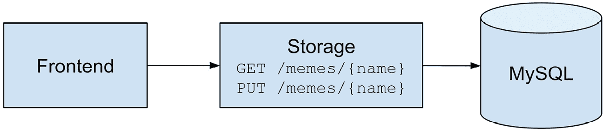

图 2.1 – Meme 服务图

+   **前端**：为上传和下载图像服务用户请求的 ASP.NET Core Razor Pages 应用程序

+   **存储**：使用 Entity Framework Core 存储图像的 ASP.NET Core WebAPI 应用程序，或用于本地开发的内存中

我们将在本章后面部分看到如何使用 Docker 运行完整的应用程序。现在，请在本地运行它并探索现代 .NET 所带来的基本日志和监控功能。

我们将在整本书中使用 `Microsoft.Extensions.Logging.ILogger` API。`ILogger` 提供了方便的 API 来编写结构化日志，包括详细程度控制以及将日志发送到任何地方的能力。

ASP.NET Core 和 Entity Framework 使用 `ILogger`；我们只需要为特定的类别或事件配置日志级别以记录传入的请求或数据库调用，并使用日志作用域提供额外的上下文。我们将在 *第八章* 中详细介绍，即 *编写结构化和关联日志*。现在，让我们看看日志关联的实际应用。

## 日志关联

ASP.NET Core 默认启用跨多个服务的日志关联。它创建一个日志记录器可以通过 `Activity.Current` 访问的活动，并配置 `Microsoft.Extensions.Logging` 以在日志作用域中填充跟踪上下文。ASP.NET Core 和 `HttpClient` 也默认支持 W3C 跟踪上下文，因此上下文会自动通过 HTTP 传播。

一些日志提供程序，例如 OpenTelemetry，不需要任何配置即可关联日志，但我们的梗图应用程序使用的是控制台提供程序，默认情况下它不会打印任何日志作用域。

因此，让我们配置我们的控制台提供程序以打印作用域，我们将在每个日志记录上看到跟踪上下文。我们还将所有类别的默认级别设置为 `Information`，以便我们可以看到输出：

appsettings.json

```cs
"Logging": {
  "LogLevel" : {"Default": "Information"},
  "Console" : {"IncludeScopes" : true}
}
```

[`github.com/PacktPublishing/Modern-Distributed-Tracing-in-.NET/blob/main/chapter2/storage/appsettings.json`](https://github.com/PacktPublishing/Modern-Distributed-Tracing-in-.NET/blob/main/chapter2/storage/appsettings.json)

注意

通常，你只会为应用程序代码使用 `Information`，并将 `Warning` 或 `Error` 设置为框架和第三方库。

让我们来看看 – 首先启动存储，然后在不同的终端中启动前端：

```cs
storage$ dotnet run
frontend$ dotnet run
```

确保同时保持两个终端开启，以便我们稍后可以检查日志。现在，让我们从浏览器的前端获取预加载的梗图 – 访问 http://localhost:5051/Meme?name=dotnet 并然后检查日志。

在前端，你可能看到如下内容（为了简洁起见，省略了其他日志和作用域）：

```cs
info: System.Net.Http.HttpClient.storage.LogicalHandler[101]
      => SpanId:4a8f253515db7fec, TraceId:e61779
516785b4549905032283d93e09, ParentId:00000000000000
      00 => HTTP GET http://localhost:5050/memes/dotnet
      End processing HTTP request after 182.2564ms - 200
info: Microsoft.AspNetCore.Hosting.Diagnostics[2]
      => SpanId:4a8f253515db7fec, TraceId:e6177951678
      5b4549905032283d93e09, ParentId:0000000000000000 =>
      Request finished HTTP/1.1 GET http://localhost:
        5051/Meme?name=dotnet - 200 256.6804ms
```

第一条记录描述了对存储服务的发出调用。你可以看到状态、持续时间、HTTP 方法以及 URL，以及跟踪上下文。第二条记录描述了一个进入的 HTTP 调用，并具有类似的信息。

注意

此跟踪上下文在两个日志记录中是相同的，属于进入的 HTTP 请求。

让我们看看存储上发生了什么：

```cs
info: Microsoft.AspNetCore.Hosting.Diagnostics[2]
      => SpanId:5a496fb9adf85727, TraceId:e61779516785b
      4549905032283d93e09, ParentId:67b3966e163641c4
      Request finished HTTP/1.1 GET http://localhost:
        5050/memes/dotnet - 200 1516 102.8234ms
```

注意

`TraceId` 值在前端和存储上是相同的，因此我们默认具有跨进程日志关联。

如果我们配置了 OpenTelemetry，我们会看到类似于 *图 2.2* 中所示的跟踪。2*：

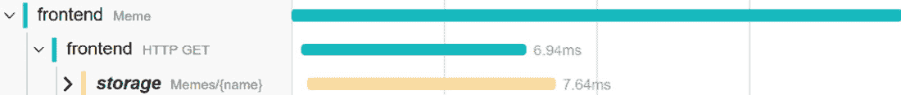

图 2.2 – 前端和存储之间的通信

我们已经知道 ASP.NET Core 为每个请求创建一个活动 – 它默认读取跟踪上下文头信息，但我们可以配置不同的传播者。因此，当我们从前端向存储发出请求时，`HttpClient` 创建另一个活动 – ASP.NET Core 的子活动。`HttpClient` 将其活动的跟踪上下文注入到发出的请求头中，以便它们流向存储服务，在那里 ASP.NET Core 解析它们并创建一个新的活动，该活动成为发出请求的子活动。

尽管我们没有导出活动，但它们被创建并用于通过跟踪上下文丰富日志，从而实现跨不同服务之间的关联。

在没有导出活动的情况下，我们实现了关联，但没有因果关系。正如你在日志中看到的，存储上的 `ParentId` 与出站 HTTP 请求上的 `SpanId` 不相同。

关于因果关系的提示

这里发生的情况是，出站请求活动是在 `HttpClient` 内部创建的，它不会使用 `ILogger` 写入日志。我们刚才看到的出站请求的日志记录是由 `Microsoft.Extensions.Http` 包中的处理器编写的。这个处理器由 ASP.NET Core 配置。当处理器记录请求开始时，`HttpClient` 活动尚未创建，而当处理器记录请求结束时，`HttpClient` 活动已经停止。

因此，使用 ASP.NET Core 和 ILogger，我们可以轻松地启用日志关联。然而，日志不能替代分布式跟踪——它们只是提供了额外的细节。日志也不需要重复跟踪。

*避免重复非常重要：作者曾经通过删除由* *丰富事件* *重复的日志，为公司节省了每月 80k 美元。*

在本书接下来的内容中，我们将使用日志进行调试和捕获覆盖跟踪空白点的额外信息。

### 在生产中使用日志

在生产中记录日志，我们通常需要一个日志管理系统——一组工具，它们收集并发送日志到中央位置，可能在这个过程中丰富、过滤或解析它们。OpenTelemetry 可以帮助我们收集日志，但我们还需要一个后端来存储、索引和查询日志，使用任何上下文，包括 `TraceId`。这样，我们就可以在需要时轻松地从跟踪导航到日志。

## 使用 dotnet-monitor 进行按需日志记录

在重现问题或当日志导出管道损坏时，动态增加日志详细程度以获取更多详细信息可能是有用的，或者直接从服务中获取日志。

使用 `dotnet-monitor` 是可能的——这是一个能够连接到特定 .NET 进程并捕获日志、计数器、配置文件和核心转储的诊断工具。我们将在 *第三章*，*.NET* *可观察性生态系统* 中讨论它。

让我们安装并启动 `dotnet-monitor` 来看看它能做什么：

```cs
$ dotnet tool install -g dotnet-monitor
$ dotnet monitor collect
```

注意

如果你使用的是 macOS 或 Linux，你需要对 `dotnet-monitor` REST API 的请求进行身份验证。请参阅 `https://github.com/dotnet/dotnet-monitor/blob/main/documentation/authentication.md` 中的文档，或者仅用于演示目的，使用 `dotnet monitor collect –no-auth` 命令禁用身份验证。

如果你仍然运行着前端和存储服务，当你通过浏览器打开 `https://localhost:52323/processes` 时，你应该能在你的机器上的其他 .NET 进程中看到它们：

```cs
{"pid": 27020, …, "name": "storage"},
{"pid": 29144, … "name": "frontend"}
```

现在，让我们通过请求以下内容来通过 `dotnet-monitor` 从存储中捕获一些调试日志：

`https://localhost:52323/logs?pid=27020&level=debug&duration=60`

它首先连接到进程，启用请求的日志级别，然后开始将日志流式传输到浏览器 60 秒。它不会更改主日志管道中的日志级别，但会直接将请求的日志返回给您，如图 *图 2.3* 所示。

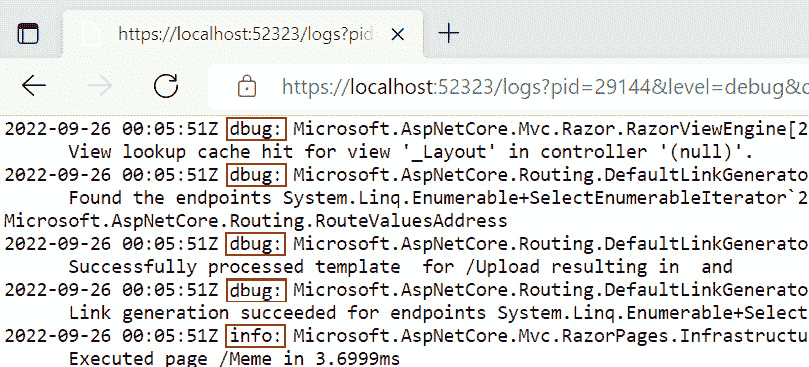

图 2.3 – 使用 dotnet-monitor 进行动态级别临时日志记录

您可以使用 POST 日志 API 应用更高级的配置 – 查看 https://github.com/dotnet/dotnet-monitor 了解更多相关信息以及其他 `dotnet-monitor` 功能。

在具有受限 SSH 访问的多实例服务上在生产环境中使用 `dotnet-monitor` 可能具有挑战性。让我们通过在 Docker 中以边车形式运行 `dotnet-monitor` 来看看我们如何做到这一点。它也可以在 Kubernetes 中作为边车运行。

# 使用运行时计数器进行监控

因此，我们有来自平台和服务的相关日志，我们可以用它们来调试问题。但关于系统健康和性能呢？.NET 和 ASP.NET Core 提供了事件计数器，可以提供一些关于整体系统状态的见解。

我们可以在不运行和管理 `dotnet-monitor` 的情况下使用 OpenTelemetry 收集计数器。但如果您的指标管道损坏（或者您还没有一个），您可以将 `dotnet-monitor`附加到您的进程上进行临时分析。

`dotnet-monitor` 监听 .NET 运行时报告的 `EventCounters`，并将它们以 **Prometheus** **暴露格式** 返回到 HTTP 端点。

注意

**Prometheus** 是一个抓取和存储指标的指标平台。它支持多维数据，并允许我们使用 **PromQL** 对数据进行切片、切块、过滤和计算派生指标。

我们将运行我们的服务作为一组 Docker 容器，其中 `dotnet-monitor` 作为前端和存储的边车运行，并将 Prometheus 配置为抓取来自 `dotnet-monitor` 边车的指标，如图 *图 2.4* 所示。

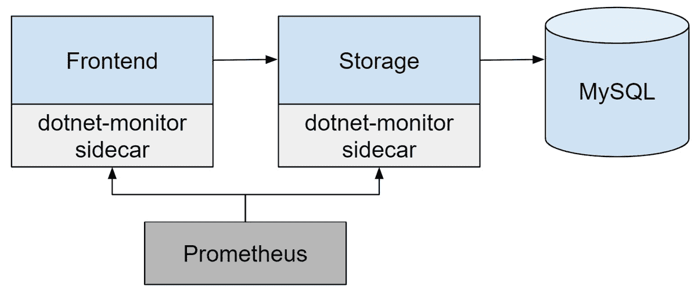

图 2.4 – 在 Prometheus 中具有运行时计数器的 Meme 服务

这使得我们的设置更接近现实生活，在那里我们没有在服务实例上运行 `dotnet-monitor` 的便利。

因此，让我们继续运行我们的应用程序。打开终端，导航到 `chapter2` 文件夹，并运行以下命令：

```cs
$ docker-compose -f ./docker-compose-dotnet-monitor.yml
  up --build
```

当 MySQL 启动时，您可能会看到一些错误。现在我们先忽略它们。几秒钟后，您应该能够通过之前的相同 URL 访问前端。

让我们探索由 .NET 运行时发布的 CPU 和内存计数器：

+   `cpu-usage` 事件计数器（报告为 `systemruntime_cpu_usage_ratio` 指标到 Prometheus）：表示 CPU 使用率作为百分比。

+   `gc-heap-size`（或 `systemruntime_gc_heap_size_bytes`）：表示以兆字节为单位的近似已分配托管内存大小。

+   `time-in-gc`（或 `systemruntime_time_in_gc_ratio`）：表示自上次垃圾回收以来在垃圾回收上花费的时间。

+   `gen-0-gc-count`、`gen-1-gc-count` 和 `gen-2-gc-count`（或 `systemruntime_gen_<gen>_gc_count`）：表示每个间隔对应生成中垃圾回收的计数。默认更新间隔为 5 秒，但您可以调整它。生成大小也作为计数器公开。

+   `alloc-rate`（或 `systemruntime_alloc_rate_bytes`）：表示每个间隔的字节分配率。

您还可以找到来自 Kestrel、Sockets、TLS 和 DNS 的计数器，这些计数器可以用于调查特定问题，例如 DNS 故障、长请求队列或 HTTP 服务器上的套接字耗尽。请查看 .NET 文档以获取完整列表（https://learn.microsoft.com/dotnet/core/diagnostics/available-counters）。

ASP.NET Core 和 `HttpClient` 请求计数器没有维度，但如果您没有 OpenTelemetry 跟踪或度量，它们将非常有用，可以大致了解所有 API 的吞吐量和失败率。

Prometheus 从 `dotnet-monitor` 度量端点抓取度量。我们可以自己访问它来查看原始数据，如图 *图 2.5* 所示。5：

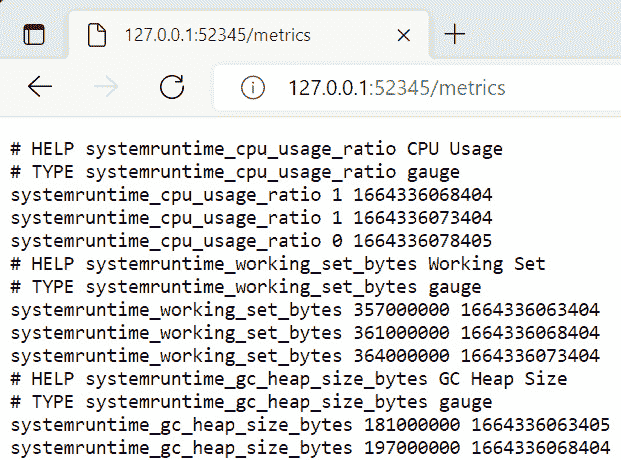

图 2.5 – Prometheus 中暴露的前端度量格式

您还可以使用 Prometheus 查询和绘制基本可视化，如图 *图 2.6* 所示。只需点击 `http://localhost:9090/graph`。对于任何高级可视化或仪表板，我们需要与 Prometheus 集成的工具，例如 **Grafana**。

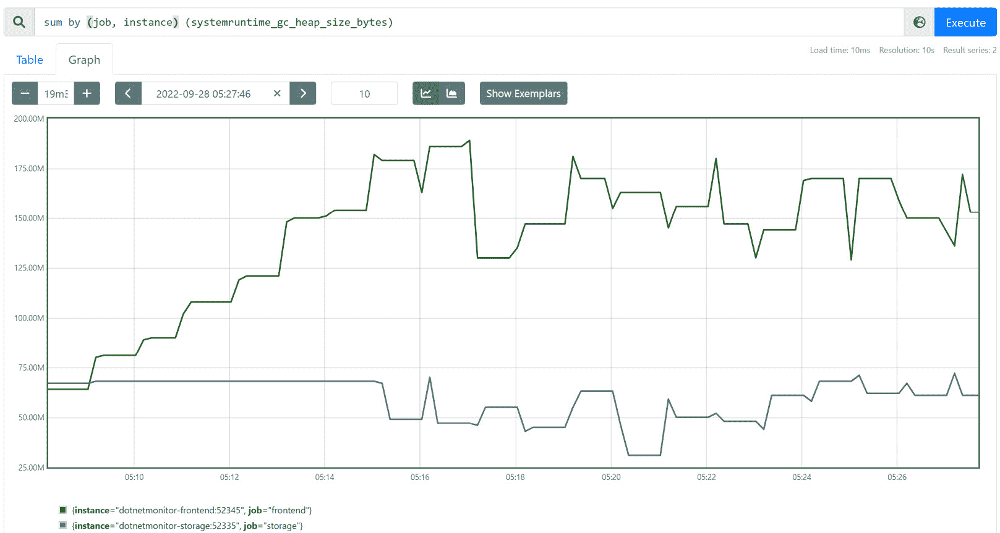

图 2.6 – Prometheus 中前端和存储服务器的 GC 内存堆大小

如您所见，即使是基本的 ASP.NET Core 应用也自带了最小的监控能力——整体系统健康的计数器和用于调试的相关日志。使用 `dotnet-monitor`，我们甚至可以在不更改代码或重启应用程序的情况下（当然，前提是我们有权访问应用程序实例）在运行时检索遥测数据。

通过对运行 `dotnet-monitor` 作为边车和日志管理解决方案的一些额外基础设施更改，我们将能够构建一个非常基本的实时监控解决方案。

我们仍然缺少具有丰富上下文的分布式跟踪和度量。现在让我们看看如何通过 OpenTelemetry 仪表板启用它们，并进一步改善这一体验。

# 使用 OpenTelemetry 启用自动收集

在本节中，我们将向我们的演示应用程序添加 OpenTelemetry，并启用 ASP.NET Core、`HttpClient`、Entity Framework 和运行时度量的自动收集。我们将看到它为裸骨监控体验添加了什么。

我们将跟踪导出到 Jaeger，并将指标导出到 Prometheus，如图*2.7*所示：

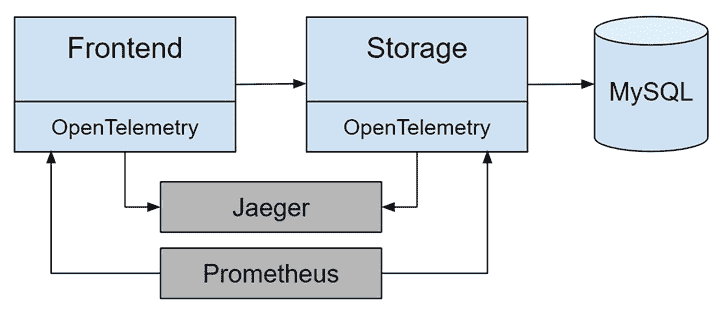

图 2.7 – Meme 服务向 Jaeger 和 Prometheus 发送遥测数据

如果您的可观察性后端有 OTLP 端点，您可以直接向其发送数据，或者您可以在应用程序中配置特定后端的导出器。那么，让我们开始使用 OpenTelemetry 检测我们的应用程序。

## 安装和配置 OpenTelemetry

OpenTelemetry 作为一系列 NuGet 包提供。以下是我们演示应用程序中使用的几个包：

+   `OpenTelemetry`：包含我们生成跟踪和指标以及配置通用处理和导出管道所需的一切的 SDK。它本身不收集任何遥测数据。

+   `OpenTelemetry.Exporter.Jaeger`：此包包含一个跟踪导出器，将跨度发布到 Jaeger。

+   `OpenTelemetry.Exporter.Prometheus.AspNetCore`：此包包含 Prometheus 导出器。它为 Prometheus 创建一个新的`/metrics`端点以抓取指标。

+   `OpenTelemetry.Extensions.Hosting`：此包简化了 ASP.NET Core 应用程序中的 OpenTelemetry 配置。

+   `OpenTelemetry.Instrumentation.AspNetCore`：此包为 ASP.NET Core 启用跟踪和指标自动检测。

+   `OpenTelemetry.Instrumentation.Http`：此包为`System.Net.HttpClient`启用跟踪和指标自动检测。

+   `OpenTelemetry.Instrumentation.EntityFrameworkCore`：Entity Framework Core 的跟踪检测。我们只需要它用于存储服务。

+   `OpenTelemetry.Instrumentation.Process`和`OpenTelemetry.Instrumentation.Runtime`：这两个包为 CPU 和内存利用率启用进程级指标，并包括我们在`dotnet-monitor`中之前看到的运行时计数器。

您也可以逐个启用其他计数器源，使用`OpenTelemetry.Instrumentation.EventCounters`包。

### 分布式跟踪

要配置跟踪，首先在`IServiceCollection`上调用`AddOpenTelemetry`扩展方法，然后调用`WithTracing`方法，如下例所示：

Program.cs

```cs
builder.Services.AddOpenTelemetry().WithTracing(
  tracerProviderBuilder => tracerProviderBuilder
    .AddJaegerExporter()
    .AddHttpClientInstrumentation()
    .AddAspNetCoreInstrumentation()
    .AddEntityFrameworkCoreInstrumentation());
```

[`github.com/PacktPublishing/Modern-Distributed-Tracing-in-.NET/blob/main/chapter2/storage/Program.cs`](https://github.com/PacktPublishing/Modern-Distributed-Tracing-in-.NET/blob/main/chapter2/storage/Program.cs)

在这里，我们添加了 Jaeger 导出器，并启用了`HttpClient`、ASP.NET Core 和 Entity Framework 检测（在存储上）。

我们还通过`launchSetting.json`和`docker-compose-otel.yml`中的`OTEL_SERVICE_NAME`环境变量配置服务名称，以便在 Docker 运行时。OpenTelemetry SDK 读取它并相应地设置`service.name`资源属性。

Jaeger 主机通过`docker-compose-otel.yml`中的`OTEL_EXPORTER_JAEGER_AGENT_HOST`环境变量进行配置。

我们将在*第五章*“配置和控制平面”中更多地讨论配置，并学习如何配置采样、丰富遥测数据以及添加自定义源。

### 指标

指标配置类似——我们首先在`IServiceCollection`上调用`AddOpenTelemetry`扩展方法，然后在`WithMetrics`回调中设置 Prometheus 导出器和`HttpClient`、ASP.NET Core、进程和运行时的自动检测。Entity Framework 的检测不报告指标。

Program.cs

```cs
builder.Services.AddOpenTelemetry()
        ...
        .WithMetrics(meterProviderBuilder => meterProviderBuilder
            .AddPrometheusExporter()
            .AddHttpClientInstrumentation()
            .AddAspNetCoreInstrumentation()
            .AddProcessInstrumentation()
            .AddRuntimeInstrumentation());
```

[`github.com/PacktPublishing/Modern-Distributed-Tracing-in-.NET/blob/main/chapter2/storage/Program.cs`](https://github.com/PacktPublishing/Modern-Distributed-Tracing-in-.NET/blob/main/chapter2/storage/Program.cs)

在构建应用程序实例之后，我们还需要暴露 Prometheus 端点：

Program.cs

```cs
var app = builder.Build();
app.UseOpenTelemetryPrometheusScrapingEndpoint();
```

[`github.com/PacktPublishing/Modern-Distributed-Tracing-in-.NET/blob/main/chapter2/storage/Program.cs`](https://github.com/PacktPublishing/Modern-Distributed-Tracing-in-.NET/blob/main/chapter2/storage/Program.cs)

我们已经准备好运行应用程序了！

```cs
$ docker-compose -f docker-compose-otel.yml up –-build
```

你应该看到所有服务的日志，包括 MySQL 启动时的一些错误。检查前端以确保它正常工作：`https://localhost:5051/Meme?name=dotnet`。

# 探索自动生成的遥测数据

现在表情包服务已经启动并运行。请随意上传您最喜欢的表情包，如果您看到任何问题，请使用遥测数据进行调试！

## 调试

如果你尝试在服务启动后立即上传某些内容，你可能会得到如图**图 2.8**所示的错误。让我们找出原因！

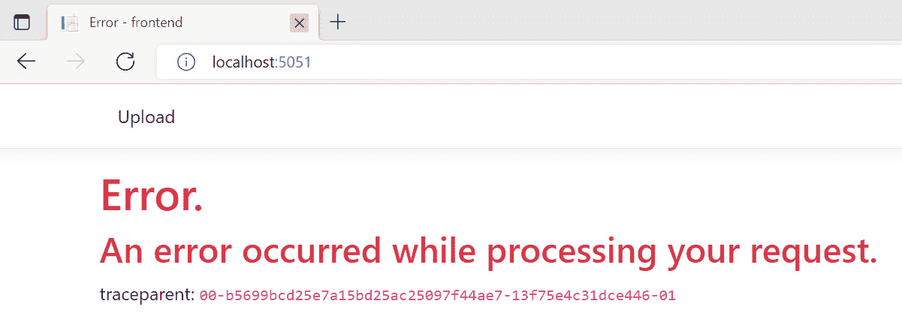

**图 2.8** – 带有 traceparent 的应用程序错误

我们可以从两个角度来接近这个调查。第一个是使用页面上的`traceparent`；第二个是根据错误状态从前端过滤跟踪。无论如何，让我们去 Jaeger——我们的跟踪后端运行在`http://localhost:16686/`。我们可以通过`Trace ID`搜索或根据服务错误过滤，如图**图 2.9**所示：

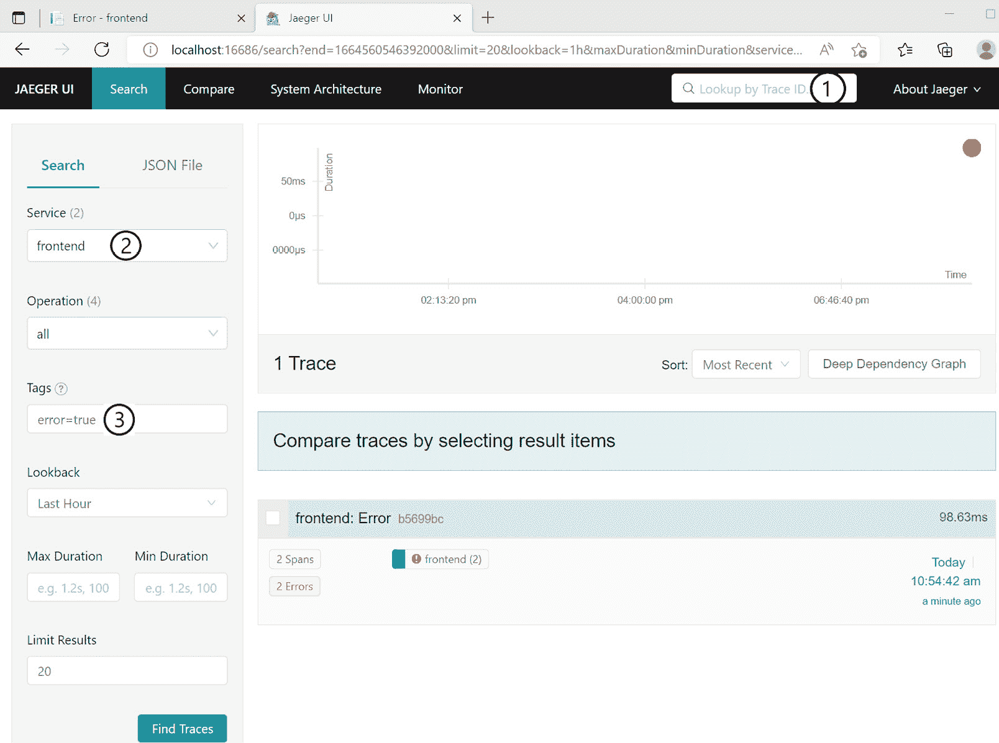

**图 2.9** – 通过 Trace ID（1）或服务（2）和错误（3）的组合在 Jaeger 中找到跟踪

如果我们打开跟踪，我们会看到存储服务拒绝了连接——查看**图 2.10**。这里发生了什么？

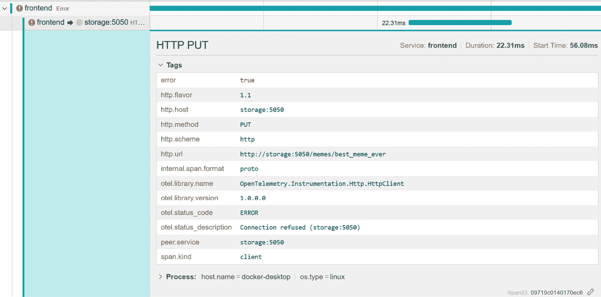

**图 2.10** – 深入跟踪：前端服务无法访问存储

由于没有来自存储的跟踪，让我们用 `docker logs chapter2-storage-1` 检查存储日志。我们将在 *第八章*，*编写结构化和关联日志* 中以更方便的方式查询日志。现在，让我们只是 grep 存储日志在问题发生的时间附近，并找到相关的记录，如图 *图 2**.11* 所示：

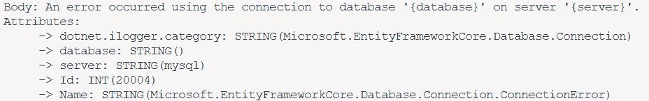

图 2.11 – 存储标准输出中的连接错误

显然，存储无法连接到 MySQL 服务器，并且它只能在建立连接后才能启动。如果我们进一步挖掘 MySQL 日志，我们会发现它启动花费了一段时间，但之后一切工作正常。

从这次调查中得出的某些行动项是：在前端启用重试并调查 MySQL 的缓慢启动。如果它在生产环境中发生，并且有多个存储实例，我们还应该深入了解负载均衡器和服务发现行为。

追踪带来的便利性在于 – 我们本可以用日志单独完成同样的调查，但这会花费更长的时间，并且会更困难。假设我们处理的是一个更复杂的案例，涉及多个服务中的数十个请求，解析日志将根本不是一个合理的选项。

正如我们在这个例子中所看到的，追踪可以帮助我们缩小问题范围，但有时我们仍然需要日志来了解正在发生的事情，尤其是在启动期间的问题。

## 性能

让我们查看一些由 HTTP 和运行时仪器收集的指标。

OpenTelemetry 定义了具有低基数属性的 `http.server.duration` 和 `http.client.duration` **直方图**指标，包括方法、API 路由（仅限服务器）和状态码。这些指标允许我们计算延迟百分位数、吞吐量和错误率。

使用 OpenTelemetry 指标，ASP.NET Core 仪器可以填充 API 路由，这样我们就可以最终分析每个路由的延迟、吞吐量和错误率。并且直方图提供了更多的灵活性 – 我们现在可以检查延迟的分布，而不仅仅是中位数、平均值或预定义的百分位数集合。

### 延迟

HTTP 客户端延迟可以定义为发起请求与收到响应之间的时间。对于服务器来说，是收到请求与服务器响应结束之间的时间。

小贴士

在分析延迟时，过滤掉错误并检查延迟的分布，而不仅仅是平均值或中位数。通常检查第 95 个百分位数（也称为 P95）。

*图 2**.12* 显示了客户端和服务器端 `PUT /meme` API 的 P95 延迟：

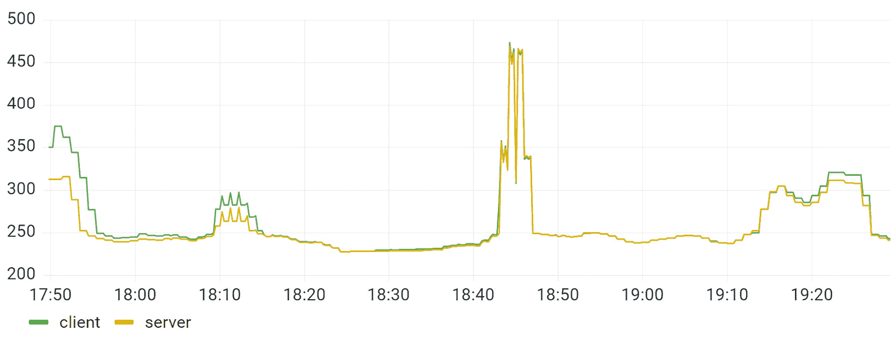

图 2.12 – 服务器与客户端 PUT /meme 延迟 P95（以毫秒为单位）

#### 首字节时间与最后字节时间

在 .NET 中，`HttpClient` 在返回响应之前会缓冲响应，但可以通过 `HttpCompletionOptions` 配置在接收到头部后立即返回响应。在这种情况下，`HttpClient` 仪表无法测量时间到最后一字节。

在前端使用不可靠连接或传输大量数据的客户端中，*时间到第一个字节*与*时间到最后一个字节*之间的区别可能很重要。在这种情况下，对流操作进行仪表化并测量时间到第一个字节和最后一个字节是有用的。您可以通过这些指标之间的差异来了解连接质量并优化最终用户体验。

### 错误率

错误率只是给定时间段内每项请求的不成功请求的比率。这里的关键问题是什么构成了错误：

+   `1xx`、`2xx` 和 `3xx` 状态码表示成功。

+   `5xx` 代码涵盖了诸如无响应、断开客户端、网络或 DNS 问题等错误。

+   `4xx` 范围内的状态码难以分类。例如，`404` 可能代表一个问题 – 可能是客户端期望检索数据但数据不存在 – 但也可能是积极的场景，其中客户端在创建或更新资源之前检查资源是否存在。其他状态也存在类似的问题。

注意

OpenTelemetry 只将 `4xx` 作为错误标记为客户端跨度。我们将在 *第五章*，*配置和控制平面* 中看到如何根据您的需求定制它。

通常也会将超过给定阈值的延迟视为错误来衡量可用性，但为了可观察性目的，我们并不严格需要它。

*图 2.13* 展示了按错误代码分组的单个 API 服务器错误率图表的示例：

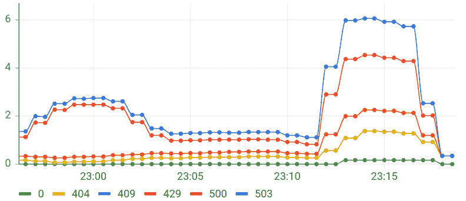

图 2.13 – 按错误代码分组的 GET/meme API 每秒错误率

计算服务器上每个 API 路由和方法的错误率也很重要。由于不同的请求速率，很容易错过调用频率较低的 API 的峰值或变化。

小贴士

对于“已知”错误返回精确的状态码，而只让服务在未处理的异常时返回 `500`，这使得使用您的服务变得更容易，同时也简化了监控和警报。通过查看错误代码，我们可以辨别可能的原因，并避免在已知情况下浪费时间。任何 `500` 响应都变得重要，需要调查和修复或妥善处理。

检查资源消耗，我们可以使用运行时和进程指标。例如，*图 2.14* 展示了 CPU 使用率：

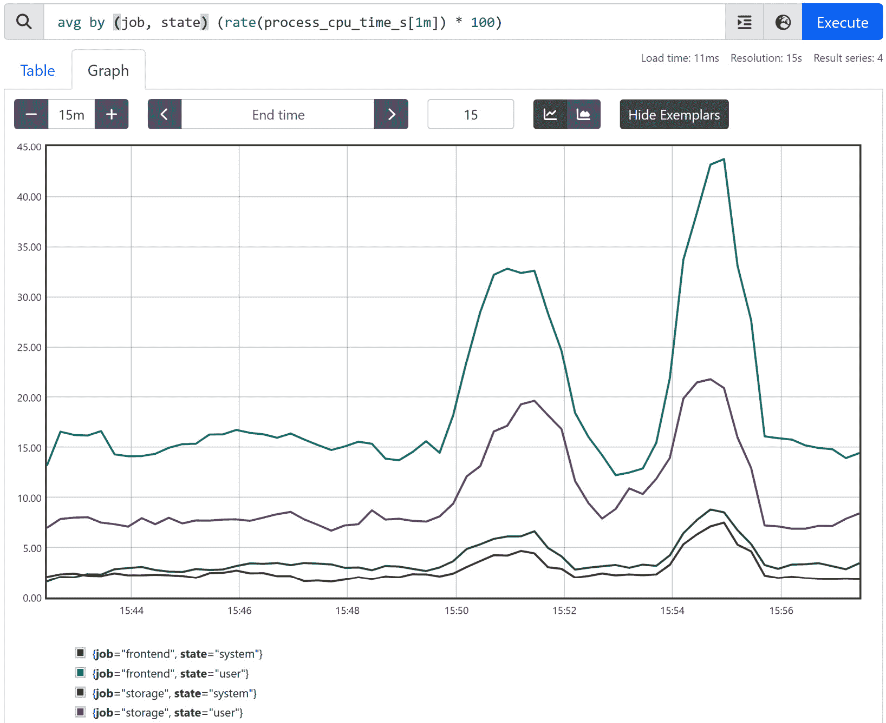

图 2.14 – CPU 使用率查询

查询返回了所有实例中每个由作业维度表示的服务平均 CPU 利用率百分比 – 我们在 `configs/prometheus-otel.yml` 中配置了作业。

状态维度将处理器时间分为用户时间和特权（系统）时间。为了计算每个服务每个实例的总平均 CPU 使用率，我们可以编写另一个 Prometheus 查询：

```cs
sum by (job, instance) (rate(process_cpu_time_s[1m]) * 100)
```

该查询计算每个实例的总 CPU 使用率，然后计算每个服务的平均值。

如您所见，Prometheus 查询语言是一个强大的工具，它允许我们计算派生指标，并对它们进行切片、切块和过滤。

我们将在 *第四章*，*使用诊断工具进行低级性能分析* 中看到更多关于运行时指标和性能分析的示例。

# 摘要

在本章中，我们探讨了平台和框架支持的 .NET 诊断和监控功能。ASP.NET Core 上下文传播默认启用，日志提供程序可以使用它来关联日志。我们需要一个日志管理系统来存储来自服务多个实例的日志，并有效地查询它们。

`dotnet-monitor` 允许按需从您服务的特定实例流式传输日志，并使用 Prometheus 抓取事件计数器，以获得关于服务健康的基本概念。它还可以用于低级性能分析，并可以在生产环境中运行。

然后，我们为 HTTP 栈和 Entity Framework 启用了 OpenTelemetry 自动仪器化。HTTP 和 DB 跟踪启用了基本的调试功能，为每个远程调用提供了通用信息。您可以根据属性搜索跟踪，并使用您的跟踪后端进行查询。有了跟踪，我们可以轻松地找到有问题的服务或组件，如果这还不够，我们可以检索日志以获取更多关于问题的详细信息。通过将日志与跟踪关联起来，我们可以轻松地在它们之间导航。

HTTP 指标启用了常见的性能分析。根据您的后端，您可以查询、过滤和派生指标，并基于它们构建仪表板和警报。

现在我们已经对基本的分布式跟踪和指标有了实践经验，让我们更深入地探索 .NET 生态系统，看看您如何利用仪器化来处理常见的库和基础设施。

# 问题

1.  您如何在 Razor 页面上显示跟踪上下文？

1.  假设可观察性后端停止接收来自服务某些实例的遥测数据。我们该如何了解这些实例的情况？

1.  在 Prometheus 文档（https://prometheus.io/docs/prometheus/latest/querying/basics/）的帮助下，使用 PromQL 编写一个查询来计算每个服务和 API 的吞吐量（每秒请求数）。

1.  在我们的 meme 服务中，如果您只知道 meme 的名称，您会如何找出 meme 上传的时间和下载次数？
