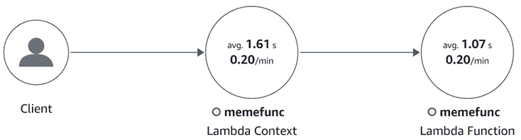

# .NET 可观察性生态系统

在上一章中，我们探讨了平台和框架中包含的.NET 可观察性功能，但还有更多针对其他库和环境的工具。

在本章中，我们将学习如何查找和评估工具，然后更深入地研究几个特定库的工具：StackExchange.Redis、Azure 和 AWS SDKs。我们还将探索使用**Dapr**（**分布式应用程序运行时**）作为示例的基础设施跟踪和指标。最后，我们将看到如何在控制较少的无服务器环境中配置跟踪，但可观察性更为重要。

通过本章，你将学习：

+   如何查找、评估和启用 OpenTelemetry 工具

+   当涉及到可观察性时，Dapr 和服务网格能够做到什么程度

+   如何在无服务器环境中启用跟踪

到本章结束时，你将获得不同类型工具的实际操作经验，并能够配置和使用分布式跟踪来支持广泛的后端应用程序。让我们开始吧！

# 技术要求

在本章中，我们将演进我们的 meme 应用程序，并使用云对象存储，Amazon S3 或 Azure Blob 存储，以及本地 Redis 缓存。本章的代码可在本书的 GitHub 存储库中找到，网址为[`github.com/PacktPublishing/Modern-Distributed-Tracing-in-.NET/tree/main/chapter3`](https://github.com/PacktPublishing/Modern-Distributed-Tracing-in-.NET/tree/main/chapter3)，其文件夹结构如下：

+   `libraries`：包含本章第一部分的库工具示例应用程序

+   `dapr`：包含第二部分的 Dapr 工具示例

+   `serverless`：包含`aws`和`azure`文件夹，其中包含 AWS Lambda 和 Azure Functions 工具的示例

要运行这些应用程序，你需要以下工具：

+   .NET SDK 7.0 或更高版本

+   Visual Studio 或 VS Code，但任何文本编辑器都可以工作

+   Docker 和`docker-compose`

+   Dapr CLI

+   一个 Azure 订阅（可选）：

    +   我们将使用 Blob 存储和应用洞察。

    +   使用 Blob 存储，我们将确保保持在免费层级的限制之内。Application Insights 没有免费层，但你仍然可以使用 Azure 促销积分来试用。

    +   我们将使用 Azure Function Tools v4 和（可选）Azure CLI。

+   一个 AWS 订阅（可选）：

    +   我们将使用 S3、Lambda 和 X-Ray。我们将确保每个服务的使用都保持在免费层级的限制之内。

    +   我们将需要 AWS 工具包用于 VS 或 Lambda .NET CLI 以及（可选）AWS CLI。

## 配置云存储

如果你不想创建 Azure 或 AWS 订阅，你仍然可以通过将`storage/appsettings.json`中的`CloudStorage.Type`设置为`Local`来本地运行`libraries`和`dapr`示例。无服务器演示没有本地设置。

否则，将`CloudStorage.Type`设置为你的选择存储，`AwsS3`或`AzureBlob`，然后让我们看看如何配置它们。

### AWS S3

使用 AWS 控制台或 CLI 创建一个新的桶：

```cs
$ aws s3api create-bucket –bucket <name> --region <region>
```

然后，将桶信息添加到`libraries/storage/appsettings.json`。

我们还需要凭证来访问 blob 存储，我们将使用我们能够使用的凭证文件。您可以使用`aws configure`命令生成一个。应用程序将在`${HOME}/.aws/credentials`中搜索 AWS 凭证文件。

替换`libraries/`和`serverless/aws`文件夹中的`docker-compose.yml`中的`HOME`环境变量。

### Azure Blob 存储

创建一个新的存储账户。您可以使用 Azure 门户或 Azure CLI，然后获取连接字符串：

```cs
$ az storage account create –-resource-group <group> --name
<account>
$ az storage account show-connection-string -–resource-
group <group> --name <account>
```

将连接字符串添加到`libraries/docker-compose.yml`旁边的`.env`文件中，格式如下：

```cs
AZURE_BLOB_CONNECTION_STRING="DefaultEndpointsProtocol=
  https;...."
```

# 使用流行库的仪表化

在上一章中，我们看到了如何为.NET 平台、ASP.NET Core 和 Entity Framework 启用跟踪以涵盖基础知识，但任何人都可以为流行的库创建仪表化并与社区分享。此外，跟踪和度量原语作为.NET 和 OpenTelemetry 的一部分，可以以供应商无关的方式收集数据，库可以添加原生仪表化。

有多个术语描述不同类型的仪表化：

+   **自动仪表化**有时意味着可以在不修改任何应用程序代码的情况下启用仪表化，但有时也用来描述任何易于启用的共享仪表化。

+   **仪表化库**意味着您可以通过安装相应的 NuGet 包并在启动时用几行代码进行配置来启用仪表化。

+   **原生仪表化**意味着仪表化代码是库的一部分，因此不需要额外的 NuGet 包，但您可能仍然需要启用仪表化。

+   **手动仪表化**是您作为应用程序代码的一部分自己编写的。

自动、原生和仪表化库之间的界限模糊。例如，从.NET 7.0 开始，HTTP 客户端包含原生仪表化，但您可能仍然可以通过相应的仪表化以更方便的方式启用它。或者，通过一些配置 OpenTelemetry 的字节码重写，我们可以在不更改任何应用程序代码的情况下启用库仪表化。在这本书中，我们使用自动仪表化的宽松版本（由于缺乏更好的术语）来描述所有非手动仪表化，但在相关的情况下我们会提到具体的类型。

我们可以从几个来源找到可用的仪表化：

+   **OpenTelemetry 注册表**([`opentelemetry.io/registry):`](https://opentelemetry.io/registry):) 您可以根据语言和组件过滤仪表化。尽管如此，许多仪表化并未添加到注册表中。它列出了所有类型的仪表化，而不考虑它们的类型。

+   **OpenTelemetry .NET 仓库** ([`github.com/open-telemetry/opentelemetry-dotnet):`](https://github.com/open-telemetry/opentelemetry-dotnet):) 包含 .NET 框架和库的库仪表化。我们之前章节中使用的 ASP.NET Core 和 HTTP 客户端仪表化工具，以及 SQL、gRPC 和 OSS 后端导出器都存放在这里。这些都是仪表化库。

+   **OpenTelemetry Contrib 仓库** ([`github.com/open-telemetry/opentelemetry-dotnet-contrib):`](https://github.com/open-telemetry/opentelemetry-dotnet-contrib):) 包含不同的 OpenTelemetry 组件：仪表化库、导出器和其它实用工具。你可以在那里找到 AWS SDK、ElasticSearch、WCF、StackExchange.Redis 等的仪表化工具。我们之前章节中使用的 Entity Framework 仪表化工具也存放在这个仓库中。

+   **OpenTelemetry 仪表化仓库** ([`github.com/open-telemetry/opentelemetry-dotnet-instrumentation):`](https://github.com/open-telemetry/opentelemetry-dotnet-instrumentation):) 包含通过不同机制（.NET 分析 API）工作的完全无代码自动仪表化。你可以在那里找到 GraphGL 和 MongoDB 仪表化工具。除了为特定库提供的自动仪表化机制外，它还提供了一种无代码配置 OpenTelemetry 的机制，包括一组常见的仪表化库。

+   **其他来源**：如果你在注册表或 OpenTelemetry 仓库中没有找到你想要的内容，请在 OpenTelemetry 仓库中搜索问题，并且不要忘记检查你的库仓库。例如，你可以在 [`github.com/jbogard/MongoDB.Driver.Core.Extensions.DiagnosticSources`](https://github.com/jbogard/MongoDB.Driver.Core.Extensions.DiagnosticSources) 找到 MongoDB 仪表化工具，它被用于 *instrumentation* 仓库，但也可以作为一个独立的仪表化库使用。

在添加仪表化工具时，请注意它们的稳定性和成熟度。`opentelemetry-dotnet` 仓库中的仪表化工具被广泛使用，但尚未稳定（在你阅读此内容时可能已经发生变化）。

*contrib* 仓库中的仪表化工具有不同的状态；例如，AWS 是稳定的，而 MySQL 则处于 alpha 阶段，并在编写本文时适用于相对较旧的 `MySQL.Data` 包版本。

小贴士

如果你决定依赖一个不太常见的预览包，请确保对其进行充分的测试。与客户端库版本的兼容性、稳定性和性能应该是主要关注点。所有这些都应该通过集成和压力测试来覆盖——只需确保启用仪表化功能！

了解监控的工作原理并检查其背后的机制是否满足您的性能要求是很好的。例如，原生监控依赖于`ActivitySource`或`DiagnosticSource`，MongoDB 和 AWS 监控依赖于相应库中的钩子。所有这些方法都应该工作得相当好，但`MySQL.Data`监控依赖于`System.Diagnostics.TraceListener`，默认情况下不是线程安全的，并且当配置为线程安全时，性能也不佳。

即使是最高效的监控也会带来一些性能损失。您应该预计吞吐量与非监控代码相比会下降几个百分点。具体的数字很大程度上取决于您的场景和 OpenTelemetry 配置，例如采样。

注意

许多开发者认为自动监控是神奇的，因此为了避免这种情况而避免使用它们。通过了解监控背后的机制，您可以识别出需要额外测试的区域，了解限制，并增强使用它（或不用）的信心。

因此，让我们监控 meme 服务的新版本，并深入了解我们将要使用的每个监控项。

## 应用程序监控

我们的新演示应用程序将 meme 存储在 Azure Blob Storage 或 AWS S3 中，并在 Redis 中缓存，如图*图 3.1*所示：


图 3.1 – 可配置云存储的 meme 服务

如果您不想配置云订阅，也可以将其设置为在 Redis 中存储 meme。

与上一章相比，**前端**没有变化——我们已经在那里启用了 OpenTelemetry 和 HTTP 监控。在**存储**方面，尽管我们仍然需要为 AWS、Redis 和 Azure SDK 添加更多监控。

首先，我们需要安装`OpenTelemetry.Contrib.Instrumentation.AWS`和`OpenTelemetry.Instrumentation.StackExchangeRedis`，然后进行配置：

libraries\storage\Program.cs

```cs
builder.Services.AddOpenTelemetry()
  .WithTracing(tracerProviderBuilder =>
        tracerProviderBuilder.
      .AddRedisInstrumentation(redisConnection, o =>
            o.SetVerboseDatabaseStatements = true)
      .AddAWSInstrumentation(o =>
            o.SuppressDownstreamInstrumentation = false)
     ...);
```

[`github.com/PacktPublishing/Modern-Distributed-Tracing-in-.NET/blob/main/chapter3/libraries/storage/Program.cs`](https://github.com/PacktPublishing/Modern-Distributed-Tracing-in-.NET/blob/main/chapter3/libraries/storage/Program.cs)

让我们逐一展开并探索监控项。

### Redis

Redis 监控通过`OpenTelemetry.Instrumentation.StackExchangeRedis`包提供，并来自*contrib*仓库——那里有文档和示例。

让我们看看我们如何评估这种监控。虽然关于它的具体细节可能会改变，但这种方法可以应用于任何其他监控库。

在编写本文时，Redis 仪表化尚不稳定，但在 NuGet 上有相当多的下载量，并且没有报告任何错误。如果我们调查它是如何工作的，我们会看到它利用了 `StackExchange.Redis` 分析 API——允许开始分析会话并记录执行期间发生的事件的钩子。尽管名称如此，它不需要附加分析器。

这是一个相对复杂的仪表化——分析 API 并非为分布式跟踪而设计，因此仪表化必须通过维护会话的内部缓存并清理它们来填补空白。

要启用仪表化，我们在 `TracerProviderBuilder` 上调用 `AddRedisInstrumentation` 扩展方法并传递连接实例。如果你有多个连接，你必须为每个连接启用仪表化。

我们还传递了仪表化选项并启用了详细数据库语句，通过将 `SetVerboseDatabaseStatements` 标志设置为 `true` 来收集包括 Redis 键和脚本在内的附加数据：

```cs
AddRedisInstrumentation(redisConnection, o =>
  o.SetVerboseDatabaseStatements = true)
```

在将配置部署到生产环境之前，检查该配置可能对应用程序性能和输出冗余性的影响是个好主意。如果我们查看 Redis 仪表化代码，这个标志保护了基于反射（但高效）的调用，以获取命令键和脚本。

根据我们在 Redis 中存储的内容，我们还应确保它不会记录任何秘密或敏感数据。

你可能已经注意到仪表化遵循一个常见的模式，但与 Redis 仪表化不同，大多数仪表化是全局的，并且不需要每个客户端实例的设置。

还有其他选项可以控制 Redis 上的跟踪：你可以指定用于丰富活动的回调，禁用具有附加计时的事件，并配置间隔以清理完成的会话。

如果我们现在启动应用程序并在 http://localhost:5051/ 上上传和下载几个 Meme，我们会看到类似于 *图 3.2* 中所示的跟踪，用于 Meme 下载流程：


图 3.2 – 使用 Redis 跨度下载 Meme

你可以看到描述通用网络端点的标准 `net.peer.*` 属性和描述与 `db.statement` 匹配 Redis 命令和键的数据库调用的 `db.*` 属性。我们只看到了键（`this_is_fine`），因为我们已将 `SetVerboseDatabaseStatements` 设置为 `true`，否则 `db.statement` 将匹配命令 `HMGET`。

你还可以看到三个日志（Jaeger 中的跨度事件）描述了 Redis 命令的附加计时信息。由于 Redis 非常快，你可能会发现这些事件不太有用，可以通过将 `EnrichActivityWithTimingEvents` 设置为 `false` 来禁用它们，这应该会减少你的可观察性账单并略微提高性能。

### AWS SDK

AWS SDK 仪表化可在 `OpenTelemetry.Contrib.Instrumentation.AWS` NuGet 包中找到，代码位于 *contrib* 仓库中。让我们尝试使用相同的方法来评估它。

它是稳定的，并依赖于适用于所有 AWS 客户端和实例的全局跟踪处理器，而不仅仅是 S3。此处理器反过来利用 .NET 跟踪原语：`Activity` 和 `ActivitySource`。

要启用 AWS 仪表化，只需在 `TracerProviderBuilder` 上调用 `AddAWSInstrumentation` 扩展方法。此时，只有一个可配置的选项控制是否跟踪嵌套 HTTP 调用：

```cs
AddAWSInstrumentation(o => o
  .SuppressDownstreamInstrumentation = false)
```

*图 3.3* 展示了 Meme 上传跟踪：`PutObject`，它反过来向 S3 发起 `HTTP PUT` 请求。Meme 上传后，它被缓存在 Redis 上：


图 3.3 – 将 Meme 上传到 S3

嵌套的 HTTP 跨度来自 HTTP 客户端仪表化，我们之所以能看到它，是因为 `SuppressDownstreamInstrumentation` 设置为 `false`。

如果我们展开 `S3.PutObject`，我们将看到描述此操作的属性，如图 *3.4* 所示：


图 3.4 – AWS S3 跨度属性

### Azure SDK

Azure SDK 仪表化是原生的——它已嵌入到现代库中——您不需要安装任何额外的包。所有客户端库的跟踪代码都可在 [`github.com/Azure/azure-sdk-for-net/`](https://github.com/Azure/azure-sdk-for-net/) 仓库中找到。然而，由于跟踪语义约定是实验性的，它仍然不稳定。例如，属性名称、类型和活动之间的关系可能会在未来发生变化。

您可以通过 `AppContext` 切换在 `csproj` 中启用它，或者通过在 Azure 客户端初始化之前添加以下代码：

```cs
AppContext.SetSwitch(
  "Azure.Experimental.EnableActivitySource",
  true)
```

仪表化直接使用 `ActivitySource` 和 `Activity`，因此我们只需要在 `TracerProviderBuilder` 上调用 `AddSource("Azure.*")` 方法来启用它。它启用了所有以 `Azure` 开头的源，但您也可以启用单个源。

*图 3.5* 展示了 Azure SDK 块上传跟踪——逻辑上传操作和嵌套 HTTP 请求。我们在这里看到一个，但对于分块下载、复杂调用或重试的情况，我们会看到多个嵌套 HTTP 调用：


图 3.5 – Azure Blob 上传

我们探讨了几个库的跟踪，并学习了如何发现和评估仪表化。现在，让我们发现我们可以从基础设施中获得什么。

# 利用基础设施

在本节中，我们将探讨 Dapr 在微服务中的应用。Dapr 提供服务发现、组件绑定、密钥管理、锁定、状态管理、可观察性以及更多构建块，帮助开发者专注于应用逻辑。我们将重点关注分布式跟踪。

在我们的演示应用程序中，我们将使用 Dapr 处理所有网络调用，并在此上启用跟踪和度量。我们还将保持微服务上的遥测开启。*图 3.6* 展示了新的应用程序布局：


图 3.6 – 使用 Dapr 运行的 Meme 应用

Dapr 作为边车运行——一个围绕每个应用程序实例的独立进程。在我们的设置中，**前端**通过 Dapr 调用**存储**，Dapr 处理服务发现、错误处理、加密、负载均衡等。**存储**反过来使用 Dapr 输出**绑定**与 Azure、AWS 或本地存储表情包进行通信。

Dapr 与 Kubernetes 集成良好，但我们将使用自托管模式并使用`docker-compose`来保持简单。

Dapr 支持通过 Dapr 进行的应用程序入站和出站调用的分布式跟踪和度量。让我们看看它在实践中意味着什么。

## 配置密钥

Dapr 密钥配置需要不同于我们在库演示中使用的不同方法。我们需要按以下方式更新`darp/configs/dapr/storage-components/secrets.json`：

+   对于 AWS，将您的访问密钥放在`{"awsKey": <key>, "awsSecret": <secret>}`中。

+   对于 Azure，设置`{"azStorageAccount": <account>, "azStorageKey": <key>}.` 如果你没有 Azure 凭证，请从`dapr/configs/dapr/storage-components`文件夹中删除`binding-azure.yaml`文件，否则示例将无法工作。

+   对于本地运行，请在`storage/appsettings.json`中将`CloudStorage.Type`设置为`Local`。

## 在 Dapr 上配置可观察性

要启用跟踪和度量，让我们在`配置规范`中添加相应的部分：

./dapr/configs/dapr/config.yml

```cs
spec:
  metric:
    enabled: true
  tracing:
    samplingRate: "1"
    zipkin:
      endpointAddress: "http://otelcollector:9412/
        api/v2/spans"
```

[`github.com/PacktPublishing/Modern-Distributed-Tracing-in-.NET/blob/main/chapter3/dapr/configs/dapr/config.yml`](https://github.com/PacktPublishing/Modern-Distributed-Tracing-in-.NET/blob/main/chapter3/dapr/configs/dapr/config.yml)

我们还在`docker-compose.yml`中添加了 Dapr 边车，在 OpenTelemetry 收集器上启用了 Zipkin 跟踪接收器，并将 Dapr 度量端点添加到 Prometheus 目标以进行抓取。因此，我们同时从应用程序和 Dapr 接收跟踪和度量。让我们来看看。

## 跟踪

现在让我们使用`docker-compose up --build`运行应用程序，点击`http://localhost:16686`并找到一些上传请求，你应该会看到类似于*图 3.7*中所示的跟踪：


图 3.7 – 应用程序和 Dapr 的跟踪

来自`frontend /memes/d8…`和`CallLocal/storage/memes/d8…`的前两个跨度——它们是新的，并且来自 Dapr。

如果我们像*图 3.8*中所示那样展开它们，我们还会看到它设置的属性：


图 3.8 – Dapr 跨度属性

你可能想知道我们是否还需要在服务上进行分布式跟踪——让我们检查一下。

停止容器并在`docker-compose.yml`中的**前端**和**存储**上注释掉`OTEL_EXPORTER_OTLP_ENDPOINT`环境变量；如果没有提供端点，我们不启用 OpenTelemetry。

然后，重新启动应用程序并再次上传一些表情包，结果如*图 3.9*所示：


图 3.9 – 应用程序未启用 OpenTelemetry 的 Dapr 跟踪

因此，我们看到来自 Dapr 的跨度，但跟踪看起来并不正确——上传到 Azure Blob 不是用 `CallLocal/storage` 跨度表示的入站请求的子项。那里发生了什么？

在 *第二章* *.NET 的原生监控* 中，我们展示了 ASP.NET Core 和 .NET 中的 `HttpClient` 创建活动，无论是否存在 OpenTelemetry。这就是这里发生的事情——`CallLocal` 是 `/v1.0/bindings/azureblob` 的曾祖父母，但它们之间的跨度没有被记录，因果关系丢失。

类似地，如果你在一个默认不启用分布式跟踪的应用程序上使用 Dapr，上下文将不会在 `CallLocal` 和 `/v1.0/bindings/azureblob` 中传播。

注意

Dapr 或服务网格，如 Istio，可以跟踪网络调用，但它们无法在应用程序进程内传播跟踪上下文，并依赖于应用程序来完成。如果你的应用程序没有这样做，它们也不能在日志上标记上下文。

如果你无法对你的应用程序进行仪表化，来自 Dapr 或服务网格的跟踪仍然很有用，尽管它们是半相关的。

如果你使用 Dapr 的原因超出了可观察性，并且你的应用程序已经进行了仪表化，那么 Dapr 跟踪可以让你对 Dapr 本身有可观察性，以查看它是如何处理请求的，这样你可以比较延迟、调试配置问题等等。

## 指标

Dapr 报告了关于应用程序通信和绑定（如 HTTP 和 gRPC 请求计数、持续时间以及请求和响应大小直方图）的详细指标。你也可以找到 Dapr 自身的 Go 运行时统计信息。

这些指标看起来很有前景，但默认情况下，它们使用 HTTP 请求路径作为指标上的属性，这具有高基数。虽然它们允许使用正则表达式来减少基数并将路径转换为 API 路由，但在高规模的生产应用程序中可能会出现问题。一旦它们准备好投入生产，它们可以成为许多进程内指标的绝佳替代品，这些指标涵盖了网络通信。

# 服务器端无服务器环境

服务器端无服务器环境比其他系统更需要可观察性——它们经常用于以少量或没有用户代码的方式集成不同的服务，这使得调试和本地测试变得困难。尽管负载均衡、扩展和其他常见的基础设施组件由我们处理，但我们仍然需要了解当事情没有按预期进行时发生了什么。

此外，作为用户，我们在遥测收集选项上非常有限——我们无法安装代理、配置运行时或在特权模式下运行某些内容——我们只能使用云提供商提供的。同时，云提供商有为我们仪表化代码的巨大机会。让我们看看 AWS Lambda 和 Azure Functions 提供了什么，以及我们可以在其上做什么。

## AWS Lambda

AWS Lambda 支持与 X-Ray 集成的调用跟踪；您只需通过控制台或 CLI 启用活动跟踪即可跟踪对函数的传入调用并查看基本的调用指标：



图 3.10 – AWS X-Ray 服务映射显示默认 Lambda 仪表化

要进一步跟踪代码中的操作，您需要使用 X-Ray SDK 作为稳定的解决方案或 OpenTelemetry，目前它处于测试阶段。在这个演示中，我们将使用 OpenTelemetry。

OpenTelemetry 的配置可能会发生变化。因此，我们将礼貌地请您查看最新的 **ADOT 收集器**（**AWS Distro for OpenTelemetry Collector**）说明，可在 [`aws-otel.github.io/docs/getting-started/lambda/lambda-dotnet`](https://aws-otel.github.io/docs/getting-started/lambda/lambda-dotnet) 找到。

ADOT 收集器基于 OpenTelemetry 收集器；它也兼容 AWS 环境，并附带一组预选的社区组件。我们将向 X-Ray 发送跟踪信息，这是 ADOT 收集器的默认配置，但您可以配置它以将数据发送到您的可观察性后端。

现在，我们已经准备好探索 Lambda 中的跟踪体验。

### 启用额外的跟踪

Lambda 中的跟踪配置与其他服务类似。首先，我们需要安装 `OpenTelemetry.Instrumentation.AWSLambda` NuGet 包，然后与导出器和其他仪表化配置一起进行配置：

Function.cs

```cs
static Function()
{
  Sdk.SetDefaultTextMapPropagator(new
      AWSXRayPropagator());
    TracerProvider = Sdk.CreateTracerProviderBuilder()
      .AddAWSLambdaConfigurations()...;
}
```

[`github.com/PacktPublishing/Modern-Distributed-Tracing-in-.NET/blob/main/chapter3/serverless/aws/memefunc/Function.cs`](https://github.com/PacktPublishing/Modern-Distributed-Tracing-in-.NET/blob/main/chapter3/serverless/aws/memefunc/Function.cs)

让我们分析一下这里发生的事情。首先，我们将 `AWSXRayPropagator` 设置为默认上下文传播器——它通过 `X-Amzn-Trace-Id` 标头启用上下文传播。

然后，我们使用 `AddAWSLambdaConfigurations` 启用了 Lambda 仪表化。如果我们深入了解，这个方法做了几件事情：

+   检测和配置资源属性，如云提供商、区域、函数名称和版本

+   启用 `ActivitySource`，它报告 Lambda 调用并缝合上下文

注意，我们在静态构造函数中这样做以优化性能并降低成本。尽管 Lambda 是无服务器的，但它使用一个进程来处理多个调用。

作为最后一步，我们需要实现包装我们的 Lambda 逻辑的跟踪处理程序：

Function.cs

```cs
async Task<APIGatewayProxyResponse> TracingHandler(
  APIGatewayHttpApiV2ProxyRequest req, ILambdaContext ctx)
    =>
    await AWSLambdaWrapper.TraceAsync(TracerProvider,
      MemeHandler, req, ctx);
```

[`github.com/PacktPublishing/Modern-Distributed-Tracing-in-.NET/blob/main/chapter3/serverless/aws/memefunc/Function.cs`](https://github.com/PacktPublishing/Modern-Distributed-Tracing-in-.NET/blob/main/chapter3/serverless/aws/memefunc/Function.cs)

注意，我们配置 Lambda 调用 `TracingHandler` 而不是内部的 `MemeHandler`。

如果我们回到配置，其余部分启用 AWS SDK 和 HTTP 客户端工具。我们还配置了不带参数的 OTLP 导出器 – 它使用默认端点 (`localhost:4317`) 和默认协议 (`gRPC`)。

我们还配置了 **前端** 使用 X-Ray 导出器将数据发送到 ADOT，因此我们可以在同一位置获取所有跟踪。

如果您尚未部署 Lambda 函数，现在就部署它，例如，使用 Visual Studio 的 AWS Toolkit 或 .NET CLI 的 Lambda 工具。

确保在 `Storage__Endpoint` 环境变量上配置函数 URL – 您可以在 `./frontend/docker-compose.yml` 中设置它。在演示中我们不使用授权，但请确保保护您现实生活中的应用程序。

现在，让我们开始 `docker-compose up --build`，然后在 `http://localhost:5051` 上上传和下载一些表情包。

让我们切换到 AWS X-Ray 并检查跟踪。您应该会看到类似于 *图 3.11* 的内容：


图 3.11 – 使用 OpenTelemetry 的 Lambda 跟踪

如果您检查服务图，它现在除了 Lambda 节点外还显示了 S3。

现在您已经知道了如何为 AWS Lambda 启用跟踪，让我们看看 Azure Functions 有哪些能力。

## Azure Functions

Azure Functions 支持与 Azure Monitor (Application Insights) 集成的分布式跟踪。它包括触发器和大多数绑定。如果您使用进程内函数，跟踪也会覆盖用户代码，对于隔离的工作进程，您需要自行在工作进程中启用和配置跟踪。

Azure Functions 依赖于用于触发器和绑定的客户端 SDK 中的工具。例如，它们在 HTTP 触发器中重用 ASP.NET Core 活动，并在 Azure Blob Storage 输入和输出中使用 Azure SDK 工具。

Azure Functions 运行时目前尚不支持 OpenTelemetry 用于进程内函数，但您的可观察性供应商可能提供一种扩展来填补这一空白。

在我们的示例中，Azure Functions 主机自动向 Application Insights 报告触发器和绑定调用 – 这种自动收集在存在 `APPLICATIONINSIGHTS_CONNECTION_STRING` 环境变量时启动，我们可以在 `local.settings.json` 文件中设置它，如本例所示：

./serverless/azure/memefunc/local.settings.json

```cs
"Values": {
  ...
  "APPLICATIONINSIGHTS_CONNECTION_STRING":
       "InstrumentationKey=<key>;IngestionEndpoint=
           <endpoint>"
}
```

[`github.com/PacktPublishing/Modern-Distributed-Tracing-in-.NET/blob/main/chapter3/serverless/azure/memefunc/local.settings.json`](https://github.com/PacktPublishing/Modern-Distributed-Tracing-in-.NET/blob/main/chapter3/serverless/azure/memefunc/local.settings.json)

我们还需要使用以下代码为工作进程启用 OpenTelemetry：

./serverless/azure/memefunc/Program.cs

```cs
var host = new HostBuilder()
  .ConfigureFunctionsWorkerDefaults
  .ConfigureServices(services => services
    .AddOpenTelemetry()
    .WithTracing(builder => builder
      .AddSource("Microsoft.Azure.Functions.Worker")
      ...)
    )
  .Build();
```

[`github.com/PacktPublishing/Modern-Distributed-Tracing-in-.NET/blob/main/chapter3/serverless/azure/memefunc/Program.cs`](https://github.com/PacktPublishing/Modern-Distributed-Tracing-in-.NET/blob/main/chapter3/serverless/azure/memefunc/Program.cs)

这里我们使用了一种熟悉的方式来启用 OpenTelemetry，但 `the Microsoft.Azure.Functions.Worker` 活动源是新的。该源是 Azure Functions Worker 的一部分，它从主机传播跟踪上下文到隔离的工作进程。它创建了一个代表工作者调用的活动。

在 `Azure.Monitor.OpenTelemetry.Exporter` 上发送数据到 Application Insights 端点。

运行示例需要创建一个 Application Insights 资源。你可以使用以下命令创建：

```cs
$ az monitor app-insights component create --app <resource-
  name> --location <region> -g <resource-group>
```

它将返回包含 `connectionString` 的 JSON 输出，这是我们配置 Functions 所需要的。现在让我们在 `memefunc/local.setting.json` 中设置 Azure Blob Storage 和 Application Insights 连接字符串，然后我们就可以运行应用程序了：

```cs
serverless/azure/frontend$ dotnet run
serverless/azure/memefunc$ func start --port 5050
```

打开 `http://localhost:5051` 来上传和下载一些表情包，然后转到你的 Application Insights 资源并搜索最近请求。*图 3.12* 展示了捕获的跟踪示例：


图 3.12 – Azure Functions 跟踪

我们追踪了这个从 `storage-download` 函数发出的调用，该函数随后下载了一个 blob。我们使用了 Azure Blob Storage 绑定，因此与 blob 存储的所有通信都由 Azure Functions 主机处理，且在工作进程之外。因此，Azure Functions 调用跨度（`storage-download`）以及所有与 blob 相关的跨度都是由 Functions 主机报告的。

`Invoke` 调用跨度由 `Microsoft.Azure.Functions.Worker` 活动源记录；它代表在工作进程上的函数调用。如果我们有任何在工作者内部完成的嵌套操作，我们会看到它们作为 `Invoke` 调用跨度的子项被报告。

尽管大部分应用程序逻辑发生在应用程序代码之外，但由于跟踪，我们仍然可以看到底层的操作。

# 摘要

在本章中，我们探讨了 .NET 生态系统中的仪器化。你学习了如何评估和配置不同类型的仪器库，如何启用和使用 Dapr 上的跟踪，以及不同配置级别下无服务器环境可以提供什么。

客户端库自动跟踪可以在 OpenTelemetry 仓库或注册表中找到，而一些库不需要跟踪工具，提供原生的跟踪功能。跟踪工具的成熟度和稳定性水平各不相同，因此作为你正常集成和压力测试的一部分，审查和测试它们很重要。跟踪工具通常提供配置选项来控制它们捕获的细节量，这允许你为你的系统找到合适的成本效益比。客户端库和框架并不是跟踪的唯一来源——你的基础设施，如服务网格、Web 服务器、负载均衡器和代理也可以产生跟踪。我们检查了 Dapr 中的跟踪故事，确认它提供了对 Dapr 本身的洞察，但不能传播上下文并在应用程序的日志和其他信号上打上标记。因此，基础设施跟踪是补充但无法替代进程内跟踪。

无服务器环境提供了与跟踪和监控工具的集成；这对于它们来说至关重要，因为用户在无服务器运行时的配置上有限。

我们探索了支持 OpenTelemetry 的 AWS Lambda，使用 ADOT 收集器和代码内配置，以及支持供应商特定代码无跟踪模式的 Azure Functions，而开箱即用的 OpenTelemetry 支持尚未到来。

现在你已经知道了如何在不同的环境中发现和使用第三方跟踪工具，你应该能够对广泛范围的分布式应用程序获得可观察性。然而，要调试进程内问题，如死锁、内存泄漏或低效的代码，我们需要更底层的遥测——这就是我们将在下一章中探讨的内容。

# 问题

1.  你会如何找到一个你使用的流行库的跟踪工具？当你找到一个时，你会检查什么？

1.  OpenTelemetry 跟踪工具背后的典型机制是什么？

1.  服务网格在跟踪方面能做什么，不能做什么？
