# 使用诊断工具进行低级性能分析

虽然分布式跟踪对于微服务来说效果很好，但在进程内部进行深度性能分析时则不太有用。在本章中，我们将探讨 .NET 诊断工具，这些工具允许我们检测和调试性能问题，并分析低效代码。我们还将学习如何在生产中执行即席性能分析并自动捕获必要的信息。

在本章中，您将学习以下内容：

+   使用 .NET 运行时计数器来识别常见的性能问题

+   使用性能跟踪优化低效代码

+   在生产中收集诊断信息

到本章结束时，您将能够使用 .NET 诊断工具调试内存泄漏、识别线程池饥饿，并收集和分析详细性能跟踪。

# 技术要求

本章的代码可在本书的 GitHub 仓库中找到，网址为 [`github.com/PacktPublishing/Modern-Distributed-Tracing-in-.NET/tree/main/chapter4`](https://github.com/PacktPublishing/Modern-Distributed-Tracing-in-.NET/tree/main/chapter4)。它包括以下组件：

+   `issues` 应用程序，其中包含性能问题的示例

+   `loadgenerator`，这是一个生成负载以重现问题的工具

要运行示例并执行分析，我们需要以下工具：

+   .NET SDK 7.0 或更高版本。

+   .NET 的 `dotnet-trace`、`dotnet-stack` 和 `dotnet-dump` 诊断工具。请使用 `dotnet tool install –global dotnet-<tool>` 安装每个工具。

+   Docker 和 `docker-compose`.

要运行本章中的示例，启动可观察性堆栈，该堆栈由 Jaeger、Prometheus 和 OpenTelemetry 收集器组成，使用 `docker-compose up`。

确保您从 `issues` 文件夹中启动 `dotnet run -c Release`。我们不使用 Docker 运行它，这样更容易使用诊断工具。

在 `OpenTelemetry.Instrumentation.Process` 和 `OpenTelemetry.Instrumentation.Runtime` NuGet 包中配置了 HTTP 客户端和 ASP.NET Core 的指标。以下是我们的指标配置：

Program.cs

```cs
builder.Services.AddOpenTelemetry()
  ...
  .WithMetrics(meterProviderBuilder =>
      meterProviderBuilder
      .AddOtlpExporter()
          .AddProcessInstrumentation()
          .AddRuntimeInstrumentation()
          .AddHttpClientInstrumentation()
          .AddAspNetCoreInstrumentation());
```

[`github.com/PacktPublishing/Modern-Distributed-Tracing-in-.NET/tree/main/chapter4/issues/Program.cs`](https://github.com/PacktPublishing/Modern-Distributed-Tracing-in-.NET/tree/main/chapter4/issues/Program.cs)

# 调查常见的性能问题

性能下降是某些其他问题（如竞争条件、依赖项减速、高负载或任何导致您的 **服务级别指标**（**SLIs**）超出健康限制并错过 **服务级别目标**（**SLOs**）的问题）的症状。这些问题可能影响多个，如果不是所有代码路径和 API，即使它们最初仅限于特定场景。

例如，当下游服务出现问题时，它会导致所有 API 的吞吐量显著下降，包括那些不依赖于该下游服务的 API。重试、额外的连接或处理下游调用的线程消耗比平常更多的资源，并将它们从其他请求中夺走。

注意

仅凭资源消耗，无论是高是低，都不能表明存在性能问题（或缺乏性能）。如果用户不受影响，高 CPU 或内存利用率可能是有效的。当它们异常高时，调查它们仍然很重要，因为这可能是未来问题的早期信号。

我们可以通过监控 SLIs 并对违规情况进行警报来检测性能问题。如果你看到问题普遍存在，而不是特定于某些场景，那么检查整个进程的资源消耗，例如 CPU 使用率、内存和线程计数，以找到瓶颈是有意义的。然后，根据受限的资源，我们可能需要捕获更多信息，例如转储、线程堆栈、详细的运行时或库事件。让我们通过几个常见问题的例子，并讨论它们的症状。

## 内存泄漏

随着时间的推移，应用程序消耗越来越多的内存时会发生内存泄漏。例如，如果我们缓存对象而不进行适当的过期和溢出逻辑，应用程序随着时间的推移将消耗越来越多的内存。增长的内存消耗会触发垃圾回收，但缓存会保留对所有对象的引用，GC 无法释放它们。

让我们重现一个内存泄漏，并探讨帮助我们识别它并找到根本原因的信号。首先，我们需要运行 `loadgenerator` 工具：

```cs
loadgenerator$ dotnet run -c Release memory-leak –-parallel 100 –-count 20000000
```

它发出了 2000 万次请求然后停止，但如果让它长时间运行，我们会看到吞吐量下降，如图 *图 4*.*1* 所示：

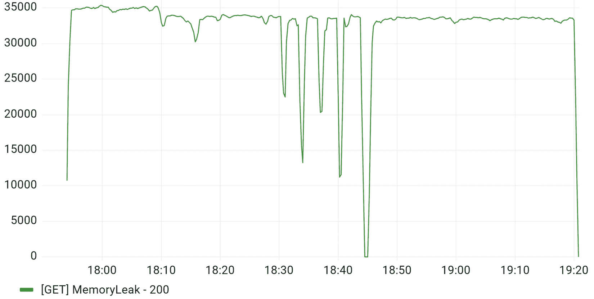

图 4.1 – 服务吞吐量（每秒成功请求次数）

我们可以看到吞吐量下降的时期，服务停止处理请求——让我们调查一下原因。

.NET 报告事件计数器，帮助我们监控每个 GC 生成的大小。新分配的对象出现在 **0 代**；如果它们在垃圾回收中存活，它们会被提升到 **1 代**，然后到 **2 代**，在那里它们会停留直到被收集或进程终止。大对象（85 KB 或更大）出现在 **大对象** **堆**（**LOH**）中。

OpenTelemetry 运行时仪器在 `process_runtime_dotnet_gc_heap_size_bytes` 指标下报告生成大小。监控 `process_memory_usage_bytes` 也很有用。我们可以在 *图 4*.*2* 中看到 2 代和物理内存消耗：

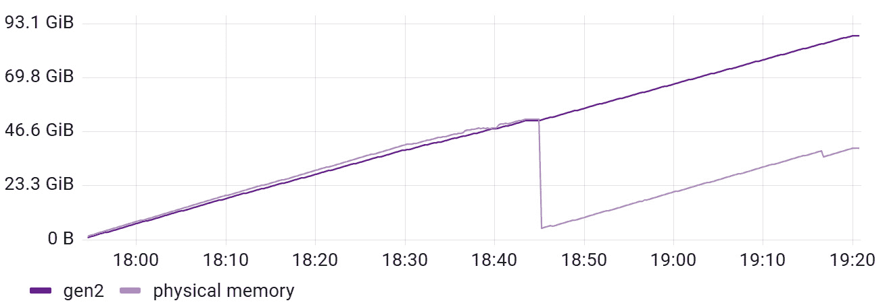

图 4.2 – 应用程序内存消耗显示内存泄漏

我们可以看到，随着时间推移，2 代增长，虚拟内存也随之增长。进程使用的物理内存上下波动，这意味着操作系统开始使用磁盘，除了 RAM。这个过程被称为**分页**或**交换**，这在操作系统级别是启用（或禁用）的。当启用时，它可能会显著影响性能，因为 RAM 通常比磁盘快得多。

最终，系统将耗尽物理内存，页面文件将达到其大小限制；然后，进程将因`OutOfMemoryException`错误而崩溃。这可能会根据环境和堆大小配置而提前发生。对于 32 位进程，当虚拟内存大小达到 4 GB 且地址空间耗尽时，OOM 发生。内存限制可以由应用程序服务器（IIS）、托管提供商或容器运行时配置或强制实施。

Kubernetes 或 Docker 允许您限制容器的虚拟内存。不同环境的行为各不相同，但通常情况下，当达到限制后，应用程序会以`OutOfMemory`退出代码终止。内存泄漏可能需要几天、几周甚至几个月才能导致进程因`OutOfMemoryException`而崩溃，因此一些内存泄漏可能处于休眠状态，可能引起罕见的重启，并仅影响长尾延迟分布。

热路径上的内存泄漏可能导致整个服务快速崩溃。当内存消耗迅速增长时，垃圾回收会密集地尝试释放一些内存，这会使用 CPU 并可能导致托管线程暂停。

我们可以使用.NET 事件计数器和 OpenTelemetry 仪表板来监控单个代的垃圾回收，如图*图 4**.3*所示：

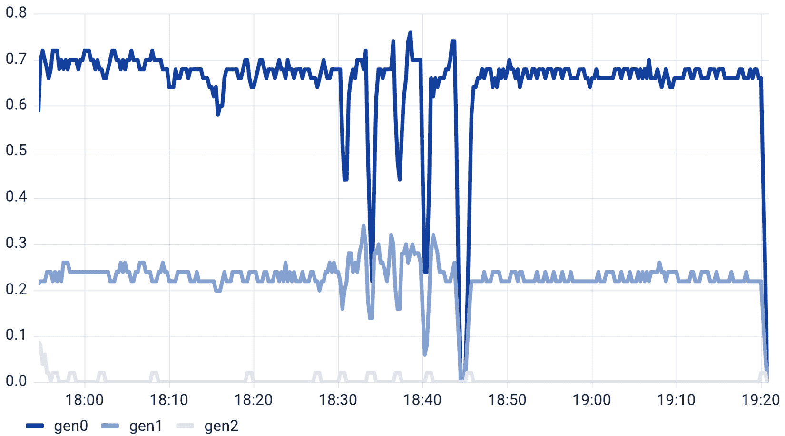

图 4.3 – 单一代的垃圾回收速率每秒

如您所见，0 代和 1 代的收集发生频率较高。观察一致的内存增长和垃圾回收的频率，我们现在可以相当肯定我们正在处理内存泄漏。我们还可以从`Microsoft-Windows-DotNETRuntime`事件提供程序收集 GC 事件（我们将在下一节中学习如何做），得出相同的结论。

让我们也检查 OpenTelemetry 进程仪表板报告的 CPU 利用率（如图*图 4**.4*所示），作为`process_cpu_time_seconds_total`度量，从中我们可以推导出利用率：

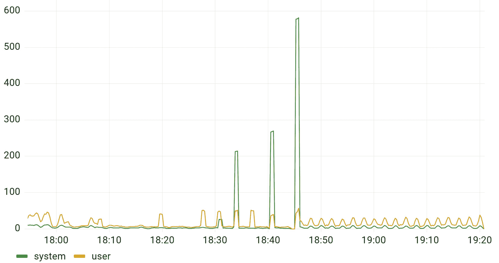

图 4.4 – 内存泄漏期间的 CPU 利用率

我们可以看到，当用户 CPU 利用率和特权（系统）CPU 利用率同时上升时，这些时期与*图 4.1*中吞吐量下降的时期相同。用户 CPU 利用率来源于`System.Diagnostics.Process.UserProcessorTime`属性，而系统利用率（基于 OpenTelemetry 术语）来源于`System.Diagnostics.Process.PriviledgedProcessorTime`属性。这些时期与*图 4.1*中吞吐量下降的时期相同。

我们的调查可能从高延迟、高错误率、高进程重启次数、高 CPU 或高内存利用率开始，所有这些都是同一问题的症状——内存泄漏。因此，现在我们需要进一步调查它——让我们收集内存转储以查看其中有什么。假设你可以在本地机器上重现该问题，Visual Studio 或 JetBrains dotMemory 可以捕获和分析内存转储。我们将使用`dotnet-dump`，我们可以在遇到问题的实例上运行它。查看[`learn.microsoft.com/dotnet/core/diagnostics/dotnet-dump`](https://learn.microsoft.com/dotnet/core/diagnostics/dotnet-dump)以了解更多关于该工具的信息。

因此，让我们使用以下命令来捕获转储：

```cs
$ dotnet-dump collect -–name issues
```

一旦收集了转储，我们就可以使用 Visual Studio、JetBrains dotMemory 或其他自动化并简化分析的工具来分析它。我们将使用`dotnet-dump` CLI 工具以困难的方式完成这项工作：

```cs
$ dotnet-dump analyze <dump file name>
```

这将打开一个提示符，我们可以在其中运行**SOS**命令。SOS 是一个调试器扩展，它允许我们检查正在运行的过程和转储。它可以帮助我们找出堆上的内容。

我们可以使用`dumpheap -stat`命令来完成这项工作，该命令按类型打印对象的计数、总计数和大小，如*图 4.5*所示：

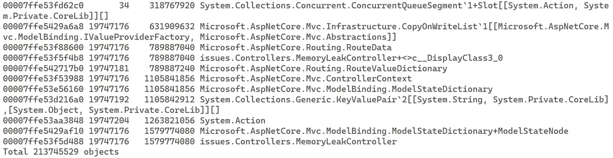

图 4.5 – 显示约 2000 万个 MemoryLeakController 实例的托管堆统计信息

统计数据按升序打印，因此总大小最大的对象出现在末尾。在这里，我们可以看到我们几乎有 2000 万个`MemoryLeakController`实例，它们消耗了大约 1.5GB 的内存。控制器实例的范围是请求，看起来在请求结束后并没有被回收。让我们找到**GC 根**——保持控制器实例存活的对象。

我们需要找到任何控制器实例的地址。我们可以使用它的方法表——每个表格行中的第一个十六进制数字。方法表存储每个对象类型信息，是内部 CLR 实现细节。

我们可以使用另一个 SOS 命令来找到它的对象地址：

```cs
$ dumpheap -mt 00007ffe53f5d488
```

这将打印一个包含所有`MemoryLeakController`实例地址的表格。让我们复制其中一个，以便我们可以用它与 GC 根一起找到：

```cs
$ gcroot -all <controller-instance-address>
```

*图 4.6*显示了`gcroot`命令打印的从 GC 根到控制器实例的路径：

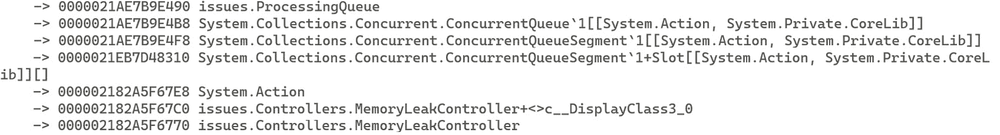

图 4.6 – ProcessingQueue 正在保持控制器实例存活

我们可以看到`issues.ProcessingQueue`正在持有这个和其他控制器实例。它内部使用`ConcurrentQueue<Action>`。如果我们检查控制器代码，我们会看到我们添加了一个使用`_logger`的动作——这是一个控制器实例变量，它隐式地保持控制器实例存活：

MemoryLeakController.cs

```cs
_queue.Enqueue(() => _logger.LogInformation(
    "notification for {user}",
    new User("Foo", "leak@memory.net")));
```

[`github.com/PacktPublishing/Modern-Distributed-Tracing-in-.NET/tree/main/chapter4/issues/Controllers/MemoryLeakController.cs`](https://github.com/PacktPublishing/Modern-Distributed-Tracing-in-.NET/tree/main/chapter4/issues/Controllers/MemoryLeakController.cs)

要修复这个问题，我们需要停止在动作中捕获控制器的记录器，并给队列添加大小限制和背压。

## 线程池饥饿

当 CLR 没有足够的线程在池中处理工作负载时，就会发生线程池饥饿，这可能在启动时发生，或者在负载显著增加时发生。让我们重现它并看看它是如何表现的。

当**issues**应用程序运行时，使用以下命令添加一些负载，向应用程序发送 300 个并发请求：

```cs
$ dotnet run -c Release starve ––parallel 300
```

现在，让我们检查吞吐量和延迟的情况。你可能看不到来自应用程序的任何指标或跟踪，或者看到在负载开始之前报告的过时指标。如果你尝试访问问题应用程序上的任何 API，例如 http://localhost:5051/ok，它将超时。

如果你检查**issues**进程的 CPU 或内存，你会看到非常低的利用率——进程卡在什么也不做。这会持续几分钟，然后解决——服务开始正常响应并报告指标和跟踪。

要理解当进程不报告指标和跟踪时发生了什么，可以使用`dotnet-counters`工具。查看.NET 文档[`learn.microsoft.com/dotnet/core/diagnostics/dotnet-counters`](https://learn.microsoft.com/dotnet/core/diagnostics/dotnet-counters)以了解更多关于这个工具的信息。现在，让我们运行它来查看运行时计数器：

```cs
$ dotnet-counters monitor --name issues
```

它应该打印一个表格，其中包含随时间变化的运行时计数器，如图*4.7*所示：

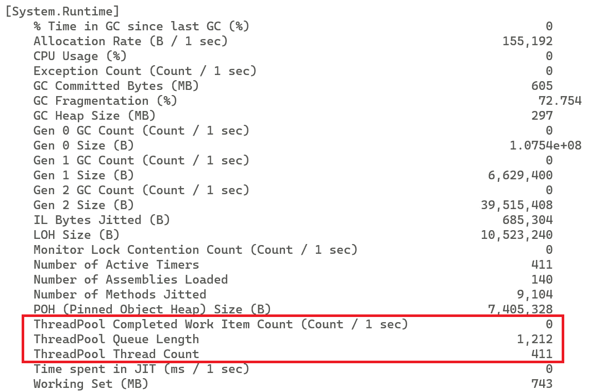

图 4.7 – dotnet-counters 输出动态显示运行时计数器

在这里，我们关注线程池计数器。我们可以看到有 1,212 个工作项在线程池队列长度中等待，并且随着线程数量的增加而持续增长。每秒只有少数（如果有的话）工作项被完成。

这种行为的根本原因是控制器中的以下代码，它阻止了线程池线程：

```cs
_httpClient.GetAsync("/dummy/?delay=100", token).Wait();
```

因此，线程不会切换到另一个工作项，而是坐着等待空调用完成。这影响所有任务，包括那些将遥测数据导出到收集器的任务 – 它们在同一个队列中等待。

运行时逐渐增加线程池大小，最终足够大以清理工作项队列。查看*图 4.8*以了解线程池计数器的动态变化：

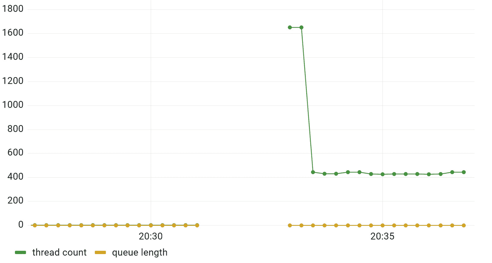

图 4.8 – 饥饿前后线程池线程数和队列的变化

如您所见，我们没有关于饥饿发生时的数据。但是，在线程池队列清理后，我们开始获取数据，并看到运行时将线程数调整到更低的值。

我们刚刚看到某个代码路径上的问题如何影响整个过程的性能，以及我们如何使用运行时指标和诊断工具来缩小范围。现在，让我们学习如何调查特定于某些 API 或单个请求的性能问题。

# 性能分析

如果我们分析对应于线程池饥饿或内存泄漏的个别跟踪，我们不会看到任何特别之处。在轻负载下它们运行得很快，但在负载增加时速度会变慢或失败。

然而，一些性能问题仅影响某些场景，至少在典型负载下是这样。锁和效率低下的代码是这类操作的例子。

我们很少在分布式跟踪下对本地操作进行仪器化，假设本地调用很快，异常有足够的信息供我们调查失败。

但是，当我们有计算密集型或效率低下的代码在服务中时会发生什么？如果我们查看分布式跟踪，我们会看到高延迟和跨度之间的间隙，但我们不知道为什么会发生。

我们提前知道某些操作，例如复杂算法或 I/O，可能需要很长时间才能完成或失败，因此我们可以故意用跟踪或只是写一个日志记录来跟踪它们。但我们很少故意将低效代码引入热点路径；因此，我们使用分布式跟踪、指标或日志进行调试的能力有限。

在这种情况下，我们需要更精确的信号，例如性能分析。**性能分析**涉及收集调用栈、内存分配、计时和调用频率。这可以通过使用.NET 性能分析 API 在进程内完成，这些 API 需要应用程序以某种方式配置。低级性能分析通常在开发者的本地机器上完成，但曾经是**应用程序性能监控**（**APM**）工具中收集性能数据和跟踪的一种流行机制。

在本章中，我们将使用一种不同类型的分析，也称为性能追踪，它依赖于 `System.Diagnostics.Tracing.EventSource`，并且可以随时进行。`EventSource` 实质上是一个平台日志记录器 – CLR、库和框架将它们的诊断信息写入事件源，这些事件源默认是禁用的，但可以动态地启用和控制。

.NET 运行时和库事件涵盖了 GC、任务、线程池、DNS、套接字和 HTTP 等其他内容。ASP.NET Core、Kestrel、依赖注入、日志记录和其他库也有它们自己的事件提供者。

您可以使用 `EventListener` 监听进程内的任何提供者，并访问事件及其负载，但 `EventSource` 的真正威力在于您可以通过 `dotnet-monitor` 工具从进程外部控制提供者，如 *第二章* 中所述，*在 .NET* 中的 *原生监控*。

让我们看看使用 `EventSource` 进行性能追踪和剖析如何帮助我们调查特定问题。

## 低效的代码

让我们运行我们的演示应用程序，看看低效的代码如何表现出来。确保可观察性堆栈正在运行，然后启动 **问题** 应用程序，然后应用一些负载：

```cs
$ dotnet run -c Release spin –-parallel 100
```

负载生成器向 http://localhost:5051/spin?fib=<n> 端点发送 100 个并发请求。spin 端点计算第 *n* 个斐波那契数；正如您将看到的，我们的斐波那契实现相当低效。

假设我们不知道这个斐波那契实现有多糟糕，让我们尝试调查为什么这个请求花费了这么长时间。让我们通过访问 http://localhost:16686，点击 **查找追踪**，并查看延迟分布来打开 Jaeger，如图 *图 4.9* 所示：

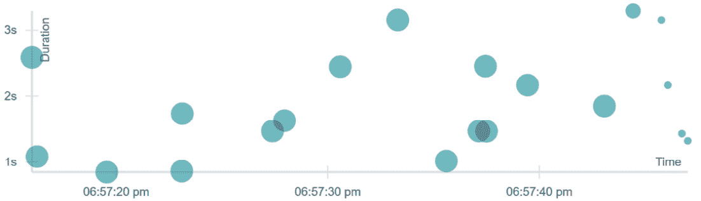

图 4.9 – Jaeger 中的延迟分布

我们可以看到几乎所有请求都需要超过 2 秒才能完成。如果您点击任何一个点，Jaeger 将显示相应的追踪。它应该看起来与 *图 4.10* 中显示的类似：

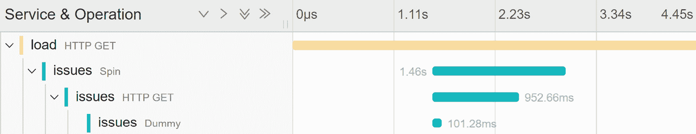

图 4.10 – Jaeger 中的长追踪

负载应用程序被配置为我们可以测量客户端延迟。我们可以看到客户端请求花费了 4.5 秒，而服务器端请求大约花费了 1.5 秒。在 spin 请求中，我们调用相同应用程序的虚拟控制器，并可以看到相应的客户端和服务器跨度。这里唯一突出的是有很多空隙，我们不知道那里发生了什么。

如果我们检查指标，我们将看到高 CPU 和高服务器延迟，但没有可疑之处可以帮助我们找到根本原因。因此，是时候捕获一些性能追踪了。

多种工具可以捕获经历此问题的进程的性能追踪，例如 Windows 上的 PerfView 或 Linux 上的 PerfCollect。

我们将使用跨平台的`dotnet-trace` CLI 工具，您可以在任何地方安装和使用它。请运行以下命令 10-20 秒：

```cs
$ dotnet-trace collect --name issues
```

使用此命令，我们已启用`Microsoft-DotNETCore-SampleProfiler`事件源（以及其他默认提供者）来通过读取.NET 文档[`learn.microsoft.com/dotnet/core/diagnostics/dotnet-trace`](https://learn.microsoft.com/dotnet/core/diagnostics/dotnet-trace)捕获`dotnet-trace`工具的托管线程调用堆栈。我们还可以将其配置为收集来自任何其他事件源的事件。

工具将跟踪保存到`issues.exe_*.nettrace`文件中，我们也可以用它来分析：

```cs
$ dotnet-trace report issues.exe_*.nettrace topN
```

它输出在堆栈上花费时间最多的前（默认为 5 个）方法。*图 4.11*显示了部分输出示例：

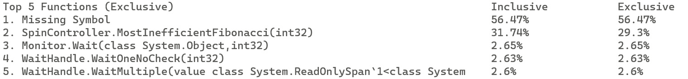

图 4.11 – 堆栈上的前五种方法

关于最上面的行没有详细信息——这是由于非托管或动态生成的代码造成的。但第二行是我们的——`MostInefficientFibonacci`方法看起来可疑，值得检查。它在调用堆栈上出现了 29.3%的时间（排他性百分比）。在嵌套调用中，它在调用堆栈上出现了 31.74%的时间（包含性百分比）。这很简单，但在更复杂的情况下，这种分析将不足以满足需求，我们可能需要进一步深入到流行的调用堆栈中。

您可以使用我之前提到的任何性能分析工具打开跟踪文件。我们将使用 SpeedScope([`www.speedscope.app/`](https://www.speedscope.app/))，这是一个基于 Web 的工具。

首先，让我们将跟踪文件转换为`speedscope`格式：

```cs
dotnet-trace convert --format speedscope
  issues.exe_*.nettrace
```

然后，我们必须通过浏览器将生成的 JSON 文件拖放到 SpeedScope 中。它将显示每个线程捕获的调用堆栈。

您可以点击不同的线程。您会看到其中许多都在等待工作，如图*图 4.12*所示：

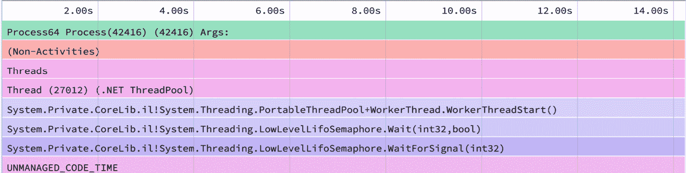

图 4.12 – 线程正在等待工作

这解释了报告中的最上面一行——大多数时候，线程都在非托管代码中等待。

如您所见，还有另一组线程正在努力计算斐波那契数，如图*图 4.13*所示：

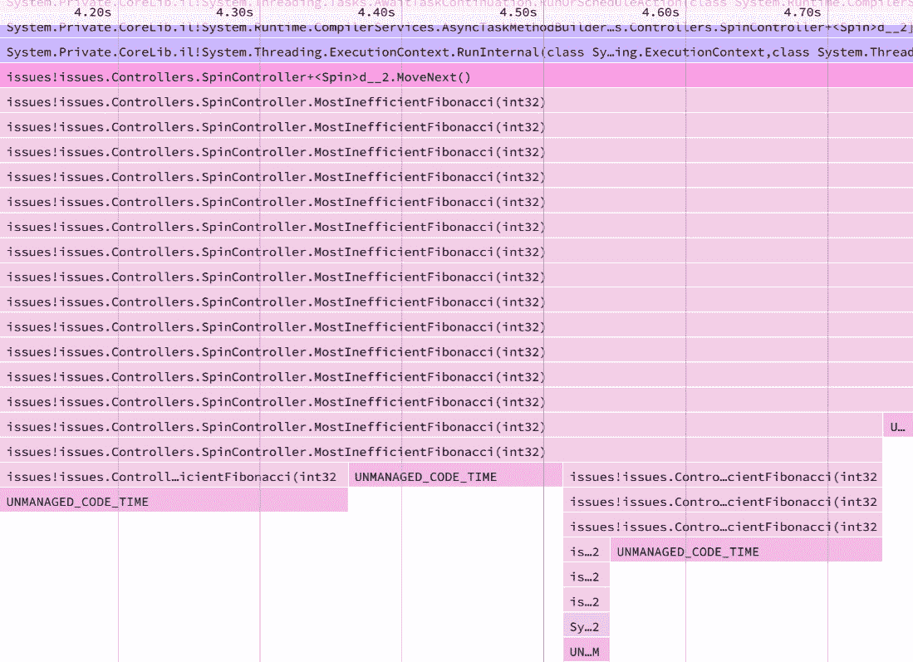

图 4.13 – 显示使用斐波那契数计算的控制器调用的调用堆栈

如您所见，我们使用了一个没有记忆的递归斐波那契算法，这解释了糟糕的性能。

我们还可以使用`dotnet-stack`工具，该工具可以打印托管线程堆栈跟踪快照。

## 调试锁

使用性能跟踪，我们可以检测到积极消耗 CPU 的代码，但如果没有发生任何事情——例如，如果我们代码中有一个锁？让我们来看看。

让我们启动**问题**应用并生成一些负载：

```cs
$dotnet run -c Release lock ––parallel 1000
```

如果我们检查 CPU 和内存消耗，我们可以看到它们很低，增长不多，线程计数变化不大，线程队列是空的，竞争率很低。同时，吞吐量很低（大约每秒 60 个请求）和延迟很大（P95 大约是 3 秒）。所以，应用程序什么都没做，但它不能更快。如果我们检查跟踪信息，我们会看到一个很大的空白，没有进一步的数据。

这个问题特定于锁 API；如果我们击中另一个 API，例如`http://localhost:5051/ok`，它会立即响应。这缩小了我们搜索锁 API 的范围。

假设我们不知道那里有一个锁，让我们再次使用`$ dotnet-trace collect --name issues`收集一些性能跟踪信息。如果我们得到`topN`堆栈，就像之前的例子一样，我们不会看到任何有趣的东西 – 只是有线程在等待工作 – 锁定很快；等待被锁定资源变得可用需要更长的时间。

我们可以更深入地挖掘生成的跟踪文件，以找到锁控制器中实际发生的事情的堆栈跟踪。我们将在 Windows 上使用 PerfView，但你也可以在 Linux 上使用 PerfCollect，或其他工具，如 JetBrains dotTrace，来打开跟踪文件并找到堆栈跟踪。

让我们使用 PerfView 打开跟踪文件，然后单击`LockController.Lock`，如图*图 4*.14 所示：

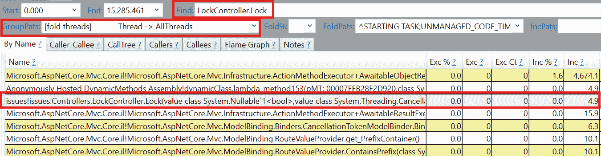

图 4.14 – 在所有线程中查找 LockController 堆栈

我们可以看到`LockController`很少出现在调用堆栈上，以及它的嵌套调用 – 我们可以从包含和排除的百分比都接近 0 来判断。从这个角度来看，我们可以得出结论，我们正在等待的东西是异步的；否则，我们会在调用堆栈上看到它。

现在，让我们右键单击`LockController`行，然后单击`LockController`堆栈。切换到**调用树**选项卡，如图*图 4*.15 所示：

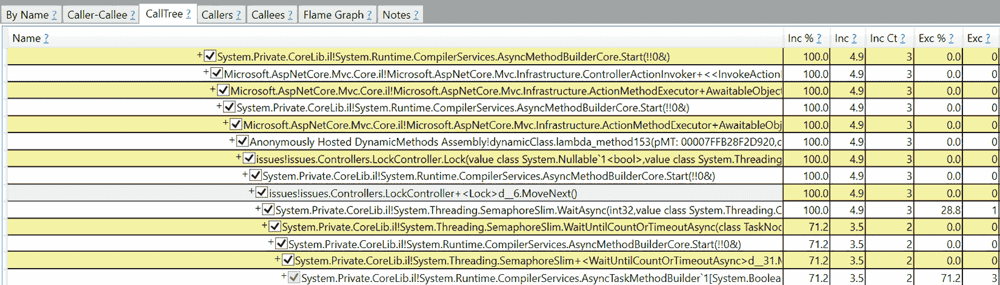

图 4.15 – 带有 LockController.Lock 的调用堆栈

我们可以看到控制器调用了`SemaphoreSlim.WaitAsync` – 这应该是我们的首要嫌疑人。它解释了低 CPU、低内存使用和线程计数没有异常。它仍然让客户端等待并保持客户端连接打开。

注意

在*图 4*.15 中，我们只能看到调用堆栈的同步部分 – 它不包括`WaitAsync`或之后发生的事情。

我们在这里所做的分析依赖于运气。在现实世界的场景中，这个问题会隐藏在其他调用中。我们会有多名嫌疑人，需要收集更多数据来进一步调查。由于我们正在寻找异步嫌疑人，使用`dotnet-trace`从`System.Threading.Tasks.TplEventSource`提供者收集与任务相关的事件将很有用。

如果我们查看代码，问题很明显，但在现实世界的代码中，它可能被很好地隐藏在功能标志或第三方库后面：

LockController.cs

```cs
await semaphoreSlim.WaitAsync(token);
try
{
    ThreadUnsafeOperation();
    await _httpClient.GetAsync("/dummy/?delay=10", token);
}
finally
{
    semaphoreSlim.Release();
}
```

[`github.com/PacktPublishing/Modern-Distributed-Tracing-in-.NET/tree/main/chapter4/issues/Controllers/LockController.cs`](https://github.com/PacktPublishing/Modern-Distributed-Tracing-in-.NET/tree/main/chapter4/issues/Controllers/LockController.cs)

这里的问题在于我们在对下游服务的 HTTP 调用周围设置了一个锁。如果我们只将`ThreadUnsafeOperation`包装在一个同步锁中，我们将看到大约每秒 20K 的请求吞吐量和大约 20 毫秒的 P95 低延迟。

性能跟踪是一个强大的工具，它允许我们捕获.NET 运行时、标准和第三方库报告的低级别数据。在本章中我们讨论的示例中，我们在与服务的同一主机上运行诊断工具。当你本地重现问题或优化开发环境中的服务时，这是合理的。让我们看看在具有多个服务实例运行和受限 SSH 访问的更真实情况下我们能做什么。

# 在生产中使用诊断工具

在生产中，我们需要能够以合理的性能和遥测预算主动收集一些数据，以便我们可以在之后分析数据。

在一个运行进程的特定实例上重现问题并从它那里收集性能跟踪或转储，在安全且分布式的应用程序中是困难的。如果像缓慢的内存泄漏或罕见的死锁这样的问题只影响少数实例，甚至可能很难检测到它，并且在检测到时，实例已经被回收，问题不再可见。

## 连续剖析

我们在寻找的是一个连续剖析器——一个收集样本性能跟踪的工具。它可以运行很短的时间，以最小化收集对每个实例的性能影响，并将配置文件发送到中央存储，在那里它们可以被存储、与分布式跟踪相关联、查询和查看。分布式跟踪支持采样，剖析器可以使用它来一致地捕获跟踪和配置文件。

许多可观察性供应商，如 Azure Monitor、New Relic、Dynatrace 等，为.NET 提供连续的剖析器。例如，Azure Monitor 允许我们从跟踪中导航到配置文件，正如你在*图 4.16*中看到的那样：

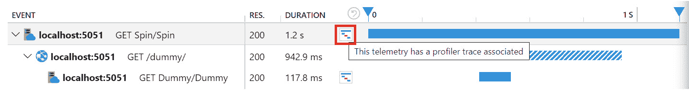

图 4.16 – 在 Azure Monitor 中从跟踪导航到配置文件

我们将看到本章前面讨论的不高效代码示例的长时间跟踪，但连续剖析器已启用并捕获了一些这些调用。如果我们点击剖析器图标，我们将看到调用堆栈，类似于我们使用`dotnet-collect`捕获的，如图*图 4.17*所示：

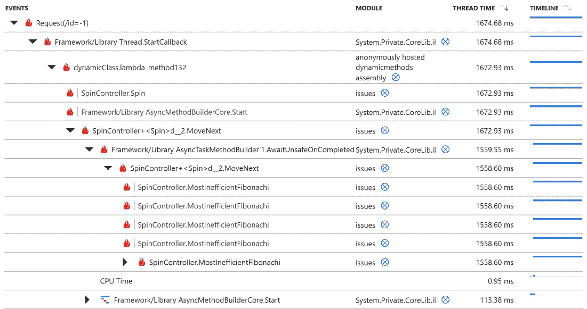

图 4.17 – 显示包含 MostInefficientFibonacci 方法的递归调用堆栈的配置文件

使用持续分析器，我们可以在几秒钟内调试低效的代码，前提是问题足够频繁地重现，以便我们可以捕获分布式跟踪和对其进行分析。

## dotnet-monitor 工具

除了分析单个调用之外，我们还需要能够主动和按需捕获转储。可以配置 .NET 在进程崩溃时捕获转储，但在容器中这并不总是有效，而且访问和传输转储并不简单。

使用 `dotnet-monitor`，我们可以以与 `dotnet` 诊断工具相同的方式捕获日志、内存和 GC 转储，并收集性能跟踪：

+   可以使用 `dotnet-monitor` `/trace` API 或 `dotnet-trace` CLI 工具收集来自事件源的性能跟踪。

+   可以使用 `/dump` API 或 `dotnet-dump` 工具收集转储

+   可以使用 `/metrics` API 或 `dotnet-counters` 工具收集事件计数器

查阅 `dotnet-monitor` 文档以了解这些以及其他它提供的 HTTP API：[`github.com/dotnet/dotnet-monitor/tree/main/documentation`](https://github.com/dotnet/dotnet-monitor/tree/main/documentation)。

我们还可以配置触发器和规则，根据 CPU 或内存利用率、GC 频率和其他运行时计数器值主动收集跟踪或转储。结果会被上传到可配置的外部存储。

我们在 *第二章*，*Native Monitoring in .NET* 中查看了一些 `dotnet-monitor` 的功能，其中我们在 Docker 中将其作为边车容器运行。同样，你可以在 Kubernetes 中将其作为边车运行。

# 摘要

性能问题通过降低服务可用性来影响用户体验。分布式跟踪和常用指标允许你将问题缩小到特定的服务、实例、API 或其他因素的组合。当这还不够时，你可以通过添加更多的跨度来提高分辨率，但最终，解决方案的性能影响和成本可能会变得不合理。

.NET 运行时指标提供了对 CLR、ASP.NET Core、Kestrel 以及其他组件的洞察。这些指标可以通过 OpenTelemetry、`dotnet-counters` 或 `dotnet-monitor` 收集。这些指标可能足以找到问题的根本原因，或者只是提供如何继续调查的输入。下一步可能是捕获进程转储和分析内存或线程的调用栈，这可以通过 `dotnet-dump` 实现。

对于特定场景的问题，性能跟踪提供了详细信息，使我们能够看到应用程序中发生的情况或在第三方库代码底层的操作。性能跟踪可以通过 `dotnet-trace` 或 `dotnet-monitor` 收集。通过捕获性能跟踪，我们可以看到详细的调用栈，获取关于消耗 CPU 的统计信息，并更精确地监控竞争和垃圾回收。这不仅是一个调查底层问题的优秀工具，也是优化代码的好工具。

在安全的多实例环境中收集低级数据具有挑战性。连续分析器可以按需、按某些计划或通过响应某些触发器收集性能跟踪和其他诊断信息。它们还可以负责将数据存储在中央位置，并将其与其他遥测信号可视化并关联起来。

`dotnet-monitor`工具可以作为边车运行，然后主动或按需提供诊断数据的基本功能，并将其发送到外部存储。

在本章中，您学习了如何使用.NET 诊断工具收集诊断数据，以及如何使用它来解决几类常见的性能问题。结合我们之前学到的关于指标、分布式跟踪和日志的知识，应该能够让您调试应用程序中的大多数分布式和本地问题。

因此，现在您已经知道如何利用自动仪表化和使用他人创建的遥测数据。在下一章中，我们将学习如何丰富自动生成的遥测数据，并使其符合我们的需求。

# 问题

1.  您首先会检查什么来了解应用程序是否健康？

1.  如果您看到影响多个不同场景的主要性能问题，您会如何调查它？

1.  性能跟踪是什么？您如何利用它？

# 第二部分：仪表化.NET 应用程序

本部分提供了对.NET 跟踪、指标、日志以及更多内容的深入概述和实践指南。我们将从了解 OpenTelemetry 配置开始，然后深入探讨手动仪表化，使用不同的信号。

本部分包含以下章节：

+   *第五章*，*配置和控制平面*

+   *第六章*，*跟踪您的代码*

+   *第七章*，*添加自定义指标*

+   *第八章*，*编写结构化和关联日志*
