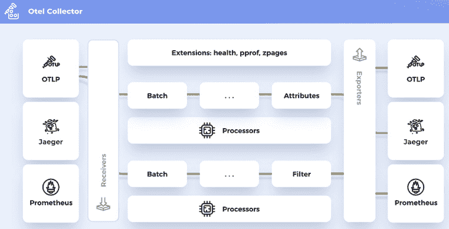

# 5

# 配置和控制平面

在前面的章节中，我们学习了如何通过几行代码启用自动检测，并利用收集到的遥测数据来调试问题和监控性能。自动收集的跟踪信息和指标是您可观察性解决方案的基础，但它们通常不足以在没有应用程序上下文的情况下使用。在本章中，我们将学习如何自定义遥测收集——丰富、调整或控制其数量。我们将深入研究以下主题：

+   通过采样控制成本

+   丰富和过滤遥测

+   自定义上下文传播

+   使用 OpenTelemetry Collector 构建处理管道

到本章结束时，你将能够选择采样策略并在你的系统中配置它，有效地使用自定义属性丰富自动生成的跟踪信息，并在服务之间传播你的上下文。我们还将了解如何抑制嘈杂的跨度（span）和指标。

# 技术要求

本章的代码可在 GitHub 上的书籍仓库中找到，网址为 [`github.com/PacktPublishing/Modern-Distributed-Tracing-in-.NET/tree/main/chapter5`](https://github.com/PacktPublishing/Modern-Distributed-Tracing-in-.NET/tree/main/chapter5)，其结构如下：

+   `sampling` 应用程序包含采样代码片段

+   `memes` 应用程序是来自 *第二章*，*在 .NET 中进行原生监控* 的 meme 服务的改进版本，其中包含丰富和上下文传播的示例

为了运行示例和执行分析，我们需要以下工具：

+   .NET SDK 7.0 或更高版本

+   Docker 和 `docker-compose`

# 通过采样控制成本

跟踪所有操作使我们能够调试系统中的单个问题，即使是很少见的问题，但从性能和遥测存储的角度来看，这可能是不切实际的。

优化和简洁的检测对性能的影响通常很低，但遥测摄入、处理、存储、查询和其他可观察性体验可能会非常昂贵。

可观察性供应商的定价模式各不相同——一些按摄入的跟踪信息量收费，另一些按事件、跟踪信息或报告数据的宿主机数量收费。摄入成本通常包括保留遥测数据 1 到 3 个月。一些供应商还按数据检索和扫描收费。本质上，与发送和检索遥测相关的成本会随着遥测数据量的增加而增长。

实际上，我们可能只对一小部分跟踪信息感兴趣——记录失败、长时间请求和其他罕见情况的信息。我们也可能为了分析目的查询跟踪信息的一个子集。

因此，收集所有跟踪信息带来的性能影响相对较小，可能是合理的，但将所有这些信息存储在可观察性后端通常是不合理的。

注意

你可能会考虑将跟踪用作审计日志，并需要记录每个操作。然而，我们需要跟踪来调试和解决生产中的事件，这意味着需要快速查询时间，可能短的保留时间，并且跟踪对每个值班人员都可用。审计日志通常需要不同的隐私和保留策略。它们也不一定需要快速和随机的访问。

**采样**是一种允许记录跟踪子集的技术，从而降低存储成本。主要有两种采样方法：**基于头的**和**基于尾的**。

注意

基于头的采样和基于尾的采样都依赖于跟踪上下文传播，无论采样决策如何都需要发生。

让我们更仔细地看看不同的采样方法，并了解何时以及如何应用它们。

## 基于头的采样

使用基于头的采样时，记录或不记录跟踪的决定是在应用程序进程启动跟踪时做出的，通常是随机的（或基于事先可用的信息）。这里的假设是，在需要关注的高规模问题发生频繁到足以记录至少一些发生的情况。换句话说，从未被记录的问题太罕见，可能不太重要。“太罕见”和“频繁到足以”在这里完全取决于应用程序需求。

基于头的采样算法试图保持一致性，以便我们可以在任何跟踪中捕获所有跨度或一个都不捕获。这是通过遵循上游采样决策或在每个服务上做出独立但一致的决策来实现的。让我们更深入地了解这些方法，并检查我们如何实现自定义采样解决方案。

### 父级采样

使用`traceparent`。例如，正如我们在*第一章*中看到的，“现代应用程序的可观察性需求”，`traceparent`中的`00-trace1-span1-01`表示上游服务记录了这个跨度，而`00-trace2-span2-00`表示这个跨度没有被记录。要在 OpenTelemetry 中启用此行为，你可以使用`ParentBasedSampler`。当所有服务遵循父决策时，在第一个组件上配置的采样概率（或百分比或记录的跟踪）适用于所有下游服务。

注意

使用基于父级的采样时，做出决策的组件需要完全信任——如果它开始记录所有跟踪，可能会超载你的遥测收集管道，并可能导致你的可观察性后端成本激增。你通常会在你的 API 网关或前端做出采样决策，并且永远不会信任来自外部客户端的采样决策。

根本组件仍然需要做出独立的采样决策。即使这个决策可以是随机的，其他服务会跟随，但坚持使用 OpenTelemetry（或你的可观察性供应商）的采样算法并在整个系统中保持一致性是个好主意。

### 概率采样

另一种方法是在每个服务上做出采样决策，但保持一致性，因此在一个服务上记录的 `trace` 如果它们配置了相同的采样率，也会在另一个服务上记录。

为了实现这一点，使用 `trace-id`。如果分数小于概率，则跨度将被记录，否则将被丢弃。

注意

概率采样通过仅记录部分跟踪来降低成本。意外的负载或流量激增会导致记录的跟踪量按比例增长。OpenTelemetry for .NET 默认不支持固定速率采样器，但你可以配置收集器来执行此操作，或者你的可观察性供应商可能提供一种方法。

概率采样在 OpenTelemetry 中通过 `TraceIdRatioBasedSampler` 实现，并且可以通过在 `TracerProviderBuilder` 上的 `SetSampler` 方法进行配置：

Program.cs

```cs
builder.Services.AddOpenTelemetry()
  .WithTracing(tp => tp
    .SetSampler(new TraceIdRatioBasedSampler(0.1))
    .AddOtlpExporter());
```

[`github.com/PacktPublishing/Modern-Distributed-Tracing-in-.NET/blob/main/chapter5/sampling/Program.cs`](https://github.com/PacktPublishing/Modern-Distributed-Tracing-in-.NET/blob/main/chapter5/sampling/Program.cs)

在这个例子中，我们将概率设置为 `0.1`，这意味着 10% 的所有跟踪将被记录。

如果我们想在下游组件上配置基于父级的采样，我们应该设置 `ParentBasedSampler` 的一个实例，如下面的示例所示：

Program.cs

```cs
tp.SetSampler(
   new ParentBasedSampler(new AlwaysOffSampler()))
```

[`github.com/PacktPublishing/Modern-Distributed-Tracing-in-.NET/blob/main/chapter5/sampling/Program.cs`](https://github.com/PacktPublishing/Modern-Distributed-Tracing-in-.NET/blob/main/chapter5/sampling/Program.cs)

我们需要提供一个采样器，用于在没有父级跟踪上下文的情况下使用 - 在这个例子中，我们正在采样所有不带 `traceparent` 的请求。我们可以进一步自定义基于父级的采样器 - 设置采样器来处理不同的情况：当父级是远程或本地时，以及父级是否被记录。

### 一致采样

假设所有服务都配置了相同的采样概率，一个跟踪中的所有跨度将一致地被记录或丢弃 - 将不会有部分跟踪。然而，对所有服务使用相同的比率并不总是实用的。你可能希望为新服务或负载较小的服务配置更高的采样概率。我们可以通过在服务上配置不同的比率来实现这一点。

因此，我们应该预期一些跟踪器将被部分记录。*图 5**.1* 展示了一个部分跟踪的示例：


图 5.1 – 具有不同采样概率的服务

服务 A 开始跟踪 - 它生成跟踪 ID 并通过计算分数并与服务上配置的采样概率进行比较来做出采样决策。

假设分数是 `0.1` – 它小于概率 (`0.2`)，因此请求被采样，我们应该记录相应的跨度及其本地子节点。然后是 `0.01`。**服务 B** 计算分数 – 它是相同的，所以决定不记录跨度或其本地子节点。但随后 **服务 B** 调用 **服务 C**，它记录相应的跨度。

因此，对于这个跟踪，我们将有来自 `trace-id` 的跨度，具有不同的分数，例如，`0.005`，所有服务都会记录相应的跨度，我们将有一个完整的跟踪。

概率采样依赖于 `trace-id` 是随机的，并且使用相同的哈希函数计算每个跨度的分数。如果你在所有服务上使用相同语言的纯 OpenTelemetry，并且没有自定义 ID 生成或配置供应商特定的采样器，则这种情况成立。如果你的 `trace-id` 不是随机的，或者你必须使用不同的采样算法，我们需要一种稍微不同的方法，称为 **一致性采样**。这是一个实验性的方法，目前在 .NET 中尚未实现。

该方法依赖于采样分数传播：启动跟踪的组件使用任何算法计算采样分数，并通过 `tracestate` 将其传播到下游服务。下游服务不需要再次计算分数 – 它们从 `tracestate` 中读取它，并通过将此分数与其配置的概率进行比较来做出采样决策。

### 自定义采样器

你可以实现自己的采样器。例如，`DebugSampler` 记录所有在 `tracestate` 标头中具有 `debug` 标志的活动，并为所有其他活动使用概率采样器。使用此采样器，你可以通过发送带有有效 `traceparent` 和 `tracestate: myapp=debug:1` 标头的请求来强制记录跟踪，这在测试或重现问题时可能很有用：

DebugSampler.cs

```cs
class DebugSampler : Sampler
{
    private readonly static Sampler On
      = new AlwaysOnSampler();
    private readonly static Regex DebugFlag
      = new Regex("(^|,)myapp=debug:1($|,)",
                  RegexOptions.Compiled);
    private readonly Sampler _default;
    public DebugSampler(double probability)
    {
        _default =
           new TraceIdRatioBasedSampler(probability);
    }
    public override SamplingResult ShouldSample(
      in SamplingParameters parameters)
    {
        var tracestate =
           parameters.ParentContext.TraceState;
        if (tracestate != null &&
             DebugFlag.IsMatch(tracestate))
           return On.ShouldSample(parameters);
        return _default.ShouldSample(parameters);
    }
}
```

[`github.com/PacktPublishing/Modern-Distributed-Tracing-in-.NET/blob/main/chapter5/sampling/DebugSampler.cs`](https://github.com/PacktPublishing/Modern-Distributed-Tracing-in-.NET/blob/main/chapter5/sampling/DebugSampler.cs)

采样器实现了一个 `ShouldSample` 方法，它接受 `SamplingParameters` 并返回 `SamplingResult`。

采样参数包括父跟踪上下文和创建时间属性、`Activity` 名称、类型、`tracestate` 和链接。

`SamplingResult` 是一个包含 `SamplingDecision` 枚举的结构，该枚举可以取三个可能值之一：

+   `Drop`：创建 `Activity`，但不记录它。

+   `RecordAndSample`：创建 `Activity`，记录它，并在跟踪上下文中设置采样标志。

+   `RecordOnly`：创建 `Activity` 并记录它，但不在跟踪上下文中设置采样标志。内置采样器永远不会返回 `RecordOnly` 决策，但你可以实现自定义采样器，并在本地返回此类决策给跟踪请求，而不强迫下游服务遵循它（如果它们尊重父决策）。

`SamplingResult`还包含更新的`tracestate`值和属性——采样器可以设置它们，它们将在即将创建的活动上使用。我们可以通过在`TracerProviderBuilder`实例上调用`SetSampler`方法以与之前相同的方式配置此采样器。

注意

使用 OpenTelemetry，每个采样决策都会创建一个活动。但在.NET 中，可以防止创建被采样的`Activity`。

我们将在*第六章*“跟踪您的代码”中了解更多关于采样在 vanilla .NET 中的信息，并将在本章后面看到一些关于如何抑制活动创建的示例。

## 基于尾部的采样

基于尾部的采样，决策是在跟踪结束后做出的，并可能考虑跟踪持续时间、错误的存在或任何其他在跨度上可用的信息。正如您所想象的，我们首先需要在跟踪中缓冲所有跨度，然后将它们全部发送到可观察性提供者或丢弃它们。基于尾部的采样必须在不同的服务之间发生，并且只能由外部组件，如 OpenTelemetry Collector 来完成。Collector 中的尾部采样处理器高度可配置，并支持多种采样策略，包括基于速率限制、延迟和状态码的策略。您可以组合多个策略。实际上，很难知道跟踪何时结束，因此 Collector 在收到该跟踪的第一个跨度后，会根据可配置的时间段开始缓冲跨度，然后根据可用数据做出决策。

Collector 中的基于尾部的采样处理器允许创建复合采样策略。例如，您可以在.NET 服务上配置概率采样以最小化性能影响，然后对 Collector 应用速率限制以控制遥测量级和可观察性后端成本。

您也可以配置更高的采样概率，以收集更多带有更大延迟、错误或特定属性的跟踪。目前缓冲仅限于 Collector 的单个实例，因此如果来自同一跟踪的跨度最终落在不同的 Collector 上，基于尾部的采样可能会产生部分跟踪，但仍然会捕获对应于失败或增加延迟的部分。由于基于尾部的采样需要缓冲跨度，它消耗内存并需要额外的计算资源，因此适用于短跟踪。通常，比较管理 Collector 设置的代价与其带来的节省是有意义的。

注意

在非概率采样中，基于跟踪的使用分析是有偏的，可能是误导性的。独立于跟踪收集的应用程序内的度量可能仍然是您的真实来源。

根据您的需求，您可以将不同的方法结合起来——例如，收集所有数据但将其保存在冷（较冷）存储中，仅使用更昂贵的后端存储一小部分跟踪。

现在你已经准备好选择一个采样策略并在你的系统中实施它了！让我们继续探索如何通过额外的上下文来丰富跨度。

# 丰富和过滤遥测数据

来自自动化的跟踪和指标描述了操作的技术方面。虽然我们总是可以添加更多带有自定义上下文的跨度（我们将在*第六章* *跟踪你的代码*中学习如何做），但将自定义上下文添加到自动收集的遥测数据中可能更加实用。

应用程序特定的上下文对于跟踪使用情况是必要的，它包含有助于检测和调查问题的关键信息。

例如，如果我们以我们的梗图服务为例，在跨度上拥有梗图名称和大小将非常有帮助。有了这个，我们就能找到最受欢迎的梗图，关联梗图的上传和下载请求，规划容量，进行缓存优化，或者进行分区推理。

添加梗图名称最简单的方法是通过`Activity.SetTag`方法。例如，我们可以在`Meme`页面上添加以下代码：

Meme.cshtml.cs

```cs
public async Task<IActionResult> OnGet([FromQuery] string
  name)
{
  Activity.Current?.SetTag("meme_name", name);
    ...
}
```

[`github.com/PacktPublishing/Modern-Distributed-Tracing-in-.NET/blob/main/chapter5/memes/frontend/Pages/Meme.cshtml.cs`](https://github.com/PacktPublishing/Modern-Distributed-Tracing-in-.NET/blob/main/chapter5/memes/frontend/Pages/Meme.cshtml.cs)

`Activity.Current`在这里是由 ASP.NET Core 创建的。它通过 OpenTelemetry ASP.NET Core 的仪器启用——如果跟踪被禁用，那么这里的`Activity.Current`将是`null`，因此我们应该始终使用`null`检查或使用空合并来保护`Activity.Current`。

我们还检查活动是否被记录——如果`IsAllDataRequested`标志为`true`。在采样出的活动上记录属性是没有意义的，所以这是一个优化。虽然在这种情况下它非常小，但使用它是避免任何不必要的字符串分配或防止执行更重的操作以检索属性值的好习惯。

最后，我们调用`SetTag`方法——这是一个接受字符串标签名称和可空对象值的函数。我们将在*第六章* *跟踪你的代码*中更多地讨论 Activity API 和标签。

注意

.NET Activity API 中的标签与 OpenTelemetry 的`span`属性相同。标签来自 OpenTracing，并且没有重命名以保持向后兼容性。本书中*标签*和*属性*可以互换使用。

使用这种方法，我们可以将梗图名称添加到所有 ASP.NET Core 活动中。但是，对于 HTTP 客户端和 MySQL 活动呢？在这些活动上拥有梗图名称将非常方便。

在一般情况下，可以使用跨度处理器来完成，但一些仪器提供了可扩展的挂钩，允许它们丰富它们的活动。

让我们逐一查看这些方法。

## Span 处理器

跨度处理器是 OpenTelemetry 导出管道的一个组件。当 OpenTelemetry 被通知有关活动开始或停止事件时，它会同步调用处理器上的相应方法。通过实现我们自己的处理器并将其添加到跟踪提供程序中，我们可以拦截所有活动并添加来自`AsyncLocal`、`ThreadLocal`或全局可用的另一个上下文中的属性。我们还可以覆盖或删除属性或过滤活动。

### Enriching

在我们对梗名称执行此操作之前，我们需要决定如何将其传递给处理器。由于我们希望梗名称出现在所有服务的所有跨度中，这将是行李的一个很好的用例。行李，正如我们在*第一章*，“现代应用程序的可观察性需求”中看到的，代表在服务之间传播的应用特定上下文。

因此，让我们继续在前端`Meme`和`Upload`页面上添加梗名称到行李中：

Meme.cshtml.cs

```cs
Activity.Current.SetTag("meme_name", name);
Baggage.SetBaggage("meme_name", name);
```

[`github.com/PacktPublishing/Modern-Distributed-Tracing-in-.NET/blob/main/chapter5/memes/frontend/Pages/Meme.cshtml.cs`](https://github.com/PacktPublishing/Modern-Distributed-Tracing-in-.NET/blob/main/chapter5/memes/frontend/Pages/Meme.cshtml.cs)

设置`Baggage`并不总是影响之前开始并当前正在进行的活动——它是`AsyncLocal`的副作用，我们将在*第六章*，“跟踪您的代码”中深入探讨这一点。因此，我们将在前端页面上继续在活动上设置梗名称标签。`Baggage`在底层使用`AsyncLocal`，因此我们现在可以在处理器中可靠地使用它：

MemeNameEnrichingProcessor.cs

```cs
class MemeNameEnrichingProcessor : BaseProcessor<Activity>
{
    public override void OnEnd(Activity activity)
    {
        var name = GetName(activity);
        if (name != null)
            activity.SetTag("meme_name", name);
    }
    private string? GetName(Activity activity)
    {
        if (Baggage.Current.GetBaggage()
             .TryGetValue("meme_name", out var name))
return name;
        return activity.GetBaggageItem("meme_name");
    }
}
```

[`github.com/PacktPublishing/Modern-Distributed-Tracing-in-.NET/blob/main/chapter5/memes/frontend/MemeNameEnrichingProcessor.cs`](https://github.com/PacktPublishing/Modern-Distributed-Tracing-in-.NET/blob/main/chapter5/memes/frontend/MemeNameEnrichingProcessor.cs)

我们在这里重写了`OnEnd`方法——我们首先从行李中获取梗名称并将其添加为活动的一个标签。我们不需要检查活动是否为`null`，因为在这种情况下处理器不会被调用，但我们可能仍然需要检查它是否被采样，因为，正如我们很快就会看到的，采样出的活动有时仍然可以到达您的处理器。

注意

我们从`Baggage.Current`获取一个名称，但如果它不在那里，我们也会检查`Activity.Baggage`。原因是`Baggage`类型位于`OpenTelemetry`命名空间中，并且可以在跟踪之外使用。但 ASP.NET Core 并不知道它，并在`Activity`上填充`Baggage`。作为一个经验法则，始终使用`Baggage.SetBaggage`设置`Baggage`，但从`Baggage`和`Activity`中读取它。

最后一步是在前端和存储服务上的`TracerProvider`上注册此处理器：

Program.cs

```cs
Builder.Services.AddOpenTelemetry()
  .WithTracing(builder => builder
    .AddProcessor<MemeNameEnrichingProcessor>()
    …);
```

[`github.com/PacktPublishing/Modern-Distributed-Tracing-in-.NET/blob/main/chapter5/memes/frontend/Program.cs`](https://github.com/PacktPublishing/Modern-Distributed-Tracing-in-.NET/blob/main/chapter5/memes/frontend/Program.cs)

就这样 - 前端将 meme 名称添加到`Baggage`中，然后`Baggage`会自动传播到**存储**。每当任何活动结束时， enriching 处理器都会在它上面打印 meme 名称。

顺便说一下，我们还可以通过使用`SetTag`方法并传入`null`值来调用处理器以删除不需要的标签。

### 过滤

有时候您想丢弃一些活动 - 例如，那些代表前端上检索静态文件或来自网络爬虫的请求的活动。

在跟踪中间开始的活动后丢弃活动会破坏因果关系。这应该只针对没有子活动的事件进行。

一些仪表化提供了抑制活动的钩子，这样它们甚至不会被创建 - 我们将在本节稍后看到一些示例。

但是，仪表化并不总是支持抑制，过滤掉已经启动的活动可能只是一种选择。让我们看看如何使用处理器来完成它：

StaticFilesFilteringProcessor.cs

```cs
public class StaticFilesFilteringProcessor :
    BaseProcessor<Activity>
{
    public override void OnEnd(Activity activity)
    {
        if (activity.Kind == ActivityKind.Server &&
            activity.GetTagItem("http.method") as string
                                              == "GET" &&
            activity.GetTagItem("http.route") == null)
            activity.ActivityTraceFlags &=
              ~ActivityTraceFlags.Recorded;
     }
}
```

[`github.com/PacktPublishing/Modern-Distributed-Tracing-in-.NET/blob/main/chapter5/memes/frontend/StaticFilesFilteringProcessor.cs`](https://github.com/PacktPublishing/Modern-Distributed-Tracing-in-.NET/blob/main/chapter5/memes/frontend/StaticFilesFilteringProcessor.cs)

在此处理器中，我们检查活动是否具有`Server`类型（描述一个传入请求），使用`GET`方法，并且没有路由。我们只能在`OnEnd`回调中检查路由的存在，因为路由是在活动开始后计算的。

因此，我们在`Activity`上取消设置记录标志，以便它将在导出管道中稍后丢弃。

您可能会想出一个更好的启发式方法来识别静态文件，如果它不需要路由，您可以使用 ASP.NET Core 仪表选项来抑制此类活动，正如我们稍后将看到的。

要注册此处理器，请使用`AddProcessor`方法将其添加到`TracerProviderBuilder`中。确保按照您希望它们运行的顺序添加处理器：

Program.cs

```cs
Builder.Services.AddOpenTelemetry()
  .WithTracing(builder => builder
    .AddProcessor<StaticFilesFilteringProcessor>()
    .AddProcessor<MemeNameEnrichingProcessor>()
    …
);
```

[`github.com/PacktPublishing/Modern-Distributed-Tracing-in-.NET/blob/main/chapter5/memes/frontend/StaticFilesFilteringProcessor.cs`](https://github.com/PacktPublishing/Modern-Distributed-Tracing-in-.NET/blob/main/chapter5/memes/frontend/StaticFilesFilteringProcessor.cs)

我们刚刚学习了如何使用处理器过滤和丰富活动；现在让我们看看我们可以使用仪表化选项做什么。

## 自定义仪表化

仪表化可能提供配置选项，允许自定义遥测收集。例如，您可以通过相应配置选项上的`RecordException`标志来配置记录 HTTP 客户端和 ASP.NET Core 仪表化的异常事件：

```cs
AddHttpClientInstrumentation(o => o.RecordException = true)
```

仪器也可以提供回调，允许从特定的仪器上下文中填充属性，例如`request`或`response`对象。

让我们用它来设置存储中传入 HTTP 请求的大小，这样我们就可以使用 ASP.NET Core 仪器丰富钩子来分析表情包的大小：

Program.cs

```cs
AddAspNetCoreInstrumentation(o =>
{
    o.EnrichWithHttpRequest = (activity, request) =>
        activity.SetTag("http.request_content_length",
                       request.ContentLength);
    o.EnrichWithHttpResponse = (activity, response) =>
        activity.SetTag("http.response_content_length",
                        response.ContentLength);
    o.RecordException = true;
})
```

[`github.com/PacktPublishing/Modern-Distributed-Tracing-in-.NET/blob/main/chapter5/memes/storage/Program.cs`](https://github.com/PacktPublishing/Modern-Distributed-Tracing-in-.NET/blob/main/chapter5/memes/storage/Program.cs)

除了 ASP.NET Core，你还可以在`opentelemetry-dotnet`仓库中找到类似的 HTTP、gRPC 和 SQL 客户端仪器钩子。

同样的仪器还提供了防止创建`Activity`的钩子。例如，如果我们想抑制为静态文件创建的活动而不是在处理器中丢弃它们，我们可以编写如下内容：

Program.cs

```cs
AddAspNetCoreInstrumentation(o => o.Filter =
    ctx => !IsStaticFile(ctx.Request.Path))
...
static bool IsStaticFile(PathString requestPath)
{
    return requestPath.HasValue &&
        (requestPath.Value.EndsWith(".js") ||
         requestPath.Value.EndsWith(".css"));
}
```

[`github.com/PacktPublishing/Modern-Distributed-Tracing-in-.NET/blob/main/chapter5/memes/frontend/Program.cs`](https://github.com/PacktPublishing/Modern-Distributed-Tracing-in-.NET/blob/main/chapter5/memes/frontend/Program.cs)

如果你考虑根据动态上下文抑制或丰富单个活动，当可用时，仪器钩子是最佳选择。如果你想用环境上下文丰富所有活动，处理器将是正确的选择。现在让我们看看如何使用资源在所有活动中填充静态上下文。

## 资源

OpenTelemetry 资源描述了一个服务实例——它是一组静态属性，描述了服务名称、版本、命名空间、实例或任何其他静态属性。OpenTelemetry 为 Kubernetes、通用容器、云、进程、操作系统、设备和其他常见资源类型定义了语义约定。

你可以显式配置资源或通过环境变量。例如，我们已经使用了`OTEL_SERVICE_NAME`环境变量来配置服务名称。我们可以将`OTEL_RESOURCE_ATTRIBUTES`设置为逗号分隔的键值对列表（例如，`region=westus,tag=foo`）来指定任何自定义资源。

可以使用`ResourceBuilder`进行显式配置，我们应该在`TraceProviderBuilder`上注册它：

Program.cs

```cs
var env = new KeyValuePair<string, object>("env",
  builder.Environment.EnvironmentName);
var resourceBuilder = ResourceBuilder.CreateDefault()
    .AddService("frontend", "memes", "1.0.0")
    .AddAttributes(new[] { env });
...
Builder.Services.AddOpenTelemetry()
  .WithTracing(builder => builder
    .SetResourceBuilder(resourceBuilder)
  ...
);
```

[`github.com/PacktPublishing/Modern-Distributed-Tracing-in-.NET/blob/main/chapter5/memes/frontend/Program.cs`](https://github.com/PacktPublishing/Modern-Distributed-Tracing-in-.NET/blob/main/chapter5/memes/frontend/Program.cs)

注意，环境变量检测是默认进行的，但你可以通过使用`ResourceBuilder.CreateEmpty`而不是`CreateDefault`工厂方法来关闭它。资源在每个信号上都会被填充，如果需要，我们可以为跟踪、指标和日志配置不同的资源。

我们已经准备好运行 meme 服务并查看结果。使用 `compose up --build` 运行它。应用程序启动后，访问 `http://locahost:5051` 的前端并上传和下载一些 meme。现在，您应该能够看到新的属性——所有跨度上的 meme 名称和在存储的传入请求上的内容大小。*图 5**.2* 展示了一个 `GET` 请求的示例：


图 5.2 – 带自定义属性的自动收集的 ASP.NET Core 活动截图

我们还在每个导出的跨度上获得了新的资源属性，以及在传入和传出的 HTTP 跨度上的异常事件，如图 *5**.3* 所示：


图 5.3 – 资源属性和异常事件

在这里，我们可以看到来自我们应用程序的 `service.version`、`service.namespace`、`service.instance.id`、`env`、`region` 和 `tag` 属性，而 `host.name` 和 `os.type` 是由 OpenTelemetry Collector 资源检测器稍后添加的。

通过资源属性、处理器和行李、仪器钩子和标志，您可以自定义遥测自动收集，使用自定义属性丰富活动，添加事件，并记录异常。您还可以更改或删除属性，以及抑制或过滤活动。但关于指标，我们能自定义它们吗？

## 指标

自动收集的指标不如跟踪可定制。使用 OpenTelemetry SDK，我们只能使用静态资源属性来丰富它们，但 OpenTelemetry Collector 提供了可以添加、删除或重命名属性名称和值、跨属性聚合、更改数据类型或以其他方式处理指标的处理器。

尽管如此，您可以使用 `MeterProviderBuilder.AddView` 方法过滤出特定的仪器或其属性。例如，您可以使用以下代码删除具有特定名称的仪器：

Program.cs

```cs
WithMetrics(builder => builder.AddView(
  "process.runtime.dotnet.jit.il_compiled.size",
  MetricStreamConfiguration.Drop));
```

[`github.com/PacktPublishing/Modern-Distributed-Tracing-in-.NET/blob/main/chapter5/memes/frontend/Program.cs`](https://github.com/PacktPublishing/Modern-Distributed-Tracing-in-.NET/blob/main/chapter5/memes/frontend/Program.cs)

Prometheus 将点替换为下划线，相应的仪器在那里显示为 `process_runtime_dotnet_jit_il_compiled_size`。检查相应的 OpenTelemetry 仪器文档以找到仪器的原始名称。例如，.NET 运行时仪器文档可以在以下位置找到：[github.com/open-telemetry/opentelemetry-dotnet-contrib/blob/main/src/OpenTelemetry.Instrumentation.Runtime/README.md](http://hub.com/open-telemetry/opentelemetry-dotnet-contrib/blob/main/src/OpenTelemetry.Instrumentation.Runtime/README.md)。

你还可以指定你希望在仪表化中使用的属性 – OpenTelemetry 将仅使用指定的属性，并将丢弃其他属性。这样做可以节省未使用属性的成本或删除错误添加的高基数属性。

例如，此代码从 ASP.NET Core 请求持续时间指标中删除了 `http.scheme` 和 `http.flavor`：

Program.cs

```cs
AddView("http.server.duration",
    new MetricStreamConfiguration(){
    TagKeys = new [" {"http.host", "http.method",
       "http.scheme", "http.target", "http.status_code" }
})
```

[`github.com/PacktPublishing/Modern-Distributed-Tracing-in-.NET/blob/main/chapter5/memes/frontend/Program.cs`](https://github.com/PacktPublishing/Modern-Distributed-Tracing-in-.NET/blob/main/chapter5/memes/frontend/Program.cs)

我们刚刚看到了如何使用应用程序特定的上下文丰富跟踪和指标，并使用 OpenTelemetry 中可用的不同机制更新或删除属性。让我们继续探索 OpenTelemetry 配置，并学习如何配置上下文传播。

# 自定义上下文传播

当对新的系统进行仪表化时，使用 W3C 跟踪上下文传播是默认且最简单的选项 – 由于 .NET 和 OpenTelemetry 默认使用它，因此不需要任何显式配置。然而，现有的系统可能采用遗留的上下文传播约定。

为了支持它们，我们可以在 OpenTelemetry 上配置自定义的全局传播器，使用 `Sdk.SetDefaultTextMapPropagator`。例如，如果你的某个旧客户端应用程序仍然使用一些自定义关联 ID 的变体，你仍然可以从请求头中读取它并将其转换为 `trace-id` 兼容的格式（或将其移动到行李中）。

你可以使用复合传播器同时支持多个标准，如下例所示：

XCorrelationIdPropagator.cs

```cs
Sdk.SetDefaultTextMapPropagator(
  new CompositeTextMapPropagator(new TextMapPropagator[] {
    new B3Propagator(true),
    new XCorrelationIdPropagator(),
    new BaggagePropagator()}));
DistributedContextPropagator.Current =
  DistributedContextPropagator.CreateNoOutputPropagator();
```

[`github.com/PacktPublishing/Modern-Distributed-Tracing-in-.NET/blob/main/chapter5/memes/frontend/XCorrelationIdPropagator.cs`](https://github.com/PacktPublishing/Modern-Distributed-Tracing-in-.NET/blob/main/chapter5/memes/frontend/XCorrelationIdPropagator.cs)

在这里，我们配置了来自 `OpenTelemetry.Extensions.Propagators` 包的 B3 传播器，一个用于 `x-correlation-id` 支持的自定义传播器，以及一个用于行李的传播器。请注意，我们还通过将 `DistributedContextPropagator.Current` 设置为无输出传播器来禁用了本机 ASP.NET Core 和 HTTP 客户端传播。如果我们不这样做，它们将继续提取和注入 `Trace-Context` 头部。

当使用复合上下文传播器时，确保解决冲突并在同一请求中获取多个冲突的跟踪上下文组合时定义优先级 – 我们将在 *第十六章*，*仪表化* *现有应用程序* 中更多地讨论这个问题。

# 使用 OpenTelemetry Collector 处理管道

正如我们之前看到的，OpenTelemetry Collector 是另一个能够控制、丰富、过滤、转换、路由、聚合、采样和以任何其他可能的方式处理遥测数据的组件。*图 5**.4* 展示了主要的收集器组件：



图 5.4 - OpenTelemetry 收集器管道

接收器从不同的来源获取遥测数据，处理器对数据进行处理并将其传递给导出器。

由于收集器是一个单独的过程，可能运行在不同的机器上，它没有动态上下文，例如您可能想要在跨度上盖章的特定 HTTP 请求头。这种上下文只能添加到您的应用程序内部。

但收集器可能对应用程序运行的环境有更多上下文信息——例如，它可以丰富遥测数据，包括 Kubernetes 或云提供商上下文。它还可以接收任何格式的遥测数据并将其转换为 OpenTelemetry 信号。

收集器支持多种接收器，包括用于指标的 Docker 统计信息、statsd 或 containerd，以及用于日志的 Kubernetes 事件、syslog 或 journald，还有许多其他接收器。收集器处理器可以在任何信号上丰富、过滤或更改属性名称和值。其中一个常见的用例是敏感数据编辑。

您可以在 OpenTelemetry 注册表中找到可用的收集器组件，[`opentelemetry.io/registry`](https://opentelemetry.io/registry)；只需确保检查您考虑使用的每个组件的稳定性级别。

在许多情况下，问题不在于是否在过程中或使用收集器配置和自定义遥测管道——两者都是。收集器可以帮助您从一个可观察性堆栈迁移到另一个堆栈，提供遥测收集的安全带，并从您的应用程序中卸载一些工作。

# 摘要

在前面的章节中，我们探讨了遥测自动收集，现在我们已经学会了如何自定义这种遥测。我们了解到了不同的采样方法——基于头部和基于尾部。基于头部的采样会在以一定概率开始时决定记录跟踪（或跨度）。子跟踪可以跟随父跟踪的决定，并且跟踪总是完整的，但无法控制单个服务上的跟踪量。为了克服这一点，下游服务可以配置不同的速率并使用一致的采样来最大化完整跟踪的数量。一些跟踪可能是不完整的，但仍然可用于监控单个服务或服务组。

概率采样捕获所有跟踪的一部分，并且对于减轻性能开销非常有用。如果您需要可预测的成本，您应该考虑基于速率的采样。它在 OpenTelemetry 收集器或可观察性供应商中实现。OpenTelemetry 收集器还可以执行基于尾部的采样，并以更高的概率记录失败和长跟踪。

自动检测收集通用信息，因此我们需要添加应用程序特定的上下文以获得更深入的可见性。增强可以在进程内部使用资源完成 - 描述你的服务实例的静态属性，或者使用跨度处理器、检测钩子或配置选项来捕获动态上下文。我们可以添加、删除或更改属性，并且我们可以使用行李来在我们的系统中传播应用程序特定的上下文。

我们有时可以使用检测钩子、标志或使用处理器过滤掉活动。对于已经启动的活动进行过滤应该谨慎，因为这会破坏已丢弃活动的前辈和后继之间的关联。这仅适用于没有子活动的情况。

指标也允许一些自定义 - 我们可以用资源属性丰富它们，删除特定的检测，或限制由检测填充的属性。

我们还研究了上下文传播的自定义，这可以提供与你可能拥有的自定义和旧版相关解决方案的互操作性。

最后，我们讨论了除了进程内配置之外可以使用的收集器功能 - 环境资源检测或过滤和按摩遥测。它还可以提供速率限制采样，并保护你的遥测管道免受过载。

在本章中，你学习了如何选择采样策略并实现它，用应用程序上下文丰富跟踪，并自定义上下文传播。这标志着我们的自动检测之旅结束；从现在开始，我们将探索检测内部机制，并学习如何编写我们自己的。在下一章中，我们将专注于创建活动。

# 问题

1.  你会如何构建一个通用的采样解决方案，它还能捕获分布式应用程序中的失败和长时间运行的跟踪？

1.  你会如何记录 HTTP 客户端跨度中的重试？

1.  在 OpenTelemetry 收集器上配置速率限制采样。
