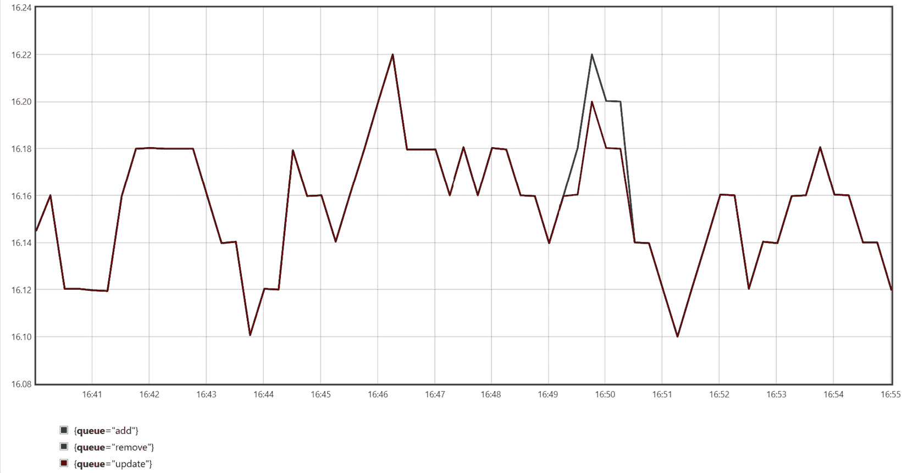
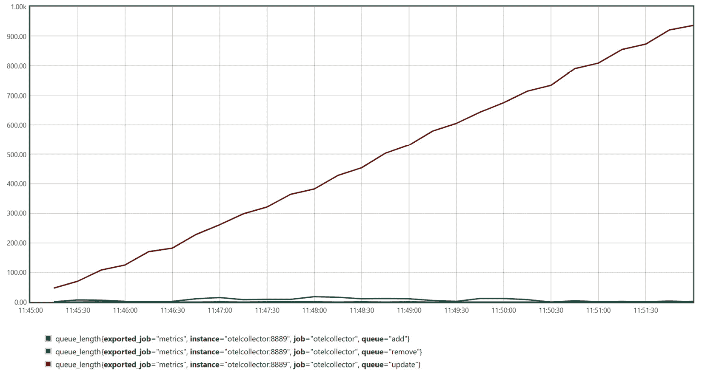
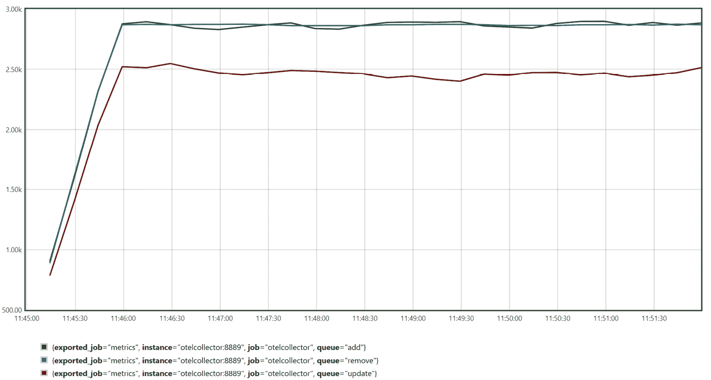
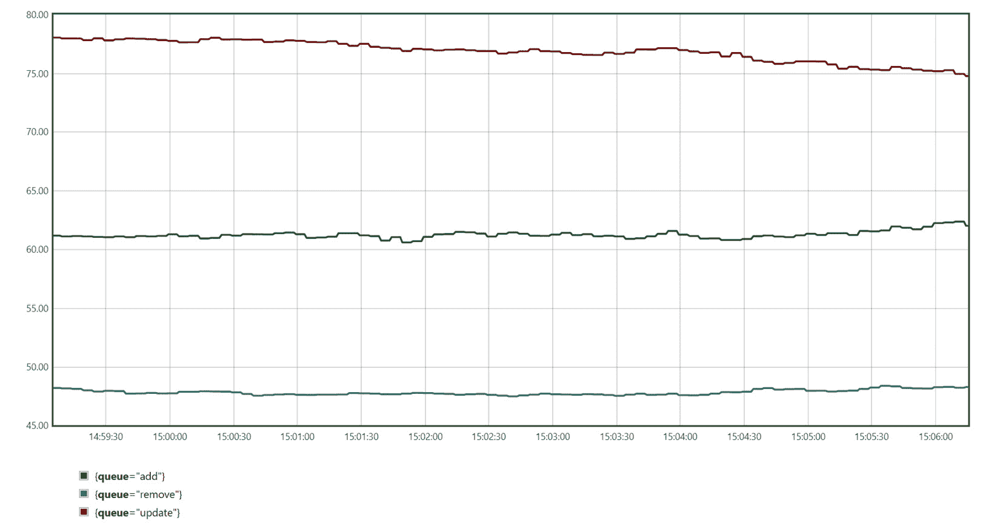

# 第七章：添加自定义度量值

在上一章中，我们探讨了手动分布式跟踪仪表化，这应该有助于我们通过临时查询调试单个操作或分析服务使用情况。在这里，我们将讨论度量值。首先，我们将学习何时使用它们，了解基数要求，然后了解跟踪和度量值如何相互补充。我们将探讨.NET 中度量值 API 的演变，然后在本章的大部分内容中讨论 OpenTelemetry 度量值。我们将涵盖**仪表**，如计数器、仪表和直方图，并深入了解每个仪表。

本章将涵盖以下主题：

+   .NET 中度量值的优点、局限性和演变

+   如何以及何时使用不同的计数器

+   如何记录和使用仪表

+   如何使用直方图记录值分布

到本章结束时，你应该能够为每个场景选择合适的仪表，并在你的应用程序中实现和使用它来分析性能、健康和用法。

# 技术要求

本章的代码可在 GitHub 上本书的存储库中找到：[`github.com/PacktPublishing/Modern-Distributed-Tracing-in-.NET/tree/main/chapter7`](https://github.com/PacktPublishing/Modern-Distributed-Tracing-in-.NET/tree/main/chapter7)。

运行示例和执行分析，我们需要以下工具：

+   .NET SDK 7.0 或更高版本

+   Docker 和`docker-compose`

# .NET 中的度量值——过去和现在

尽管我们在这本书中专注于分布式跟踪，但了解度量值对于理解何时以及如何使用它们来提高可观察性非常重要。

度量值使我们能够报告在一定时间段和一组属性（即维度或标签）上聚合的数据。度量值可以表示为一系列时间序列，其中每个序列测量一个指标随时间变化的唯一属性值组合。例如，包括特定服务实例的 CPU 利用率或特定路由、HTTP 方法、响应代码和实例的 HTTP 请求延迟。

跟踪和度量值之间的主要区别在于聚合——跟踪捕获具有详细属性的单独操作。跟踪回答诸如“*这个特定请求发生了什么？*”和“*为什么会发生？*”等问题。另一方面，度量值告诉我们系统或其特定部分发生了什么，失败的常见程度如何，性能问题有多普遍，等等。

在深入研究度量值的使用案例、优点和 API 之前，我们首先需要了解度量值的主要限制——低**基数**。

## 基数

基数表示唯一属性组合的数量或时间序列的数量。添加一个新属性会导致时间序列数量的组合爆炸，这会导致度量值体积的组合增长。

注意

指标应该具有低基数，但“低”和“高”是相对的——它们的定义取决于预算、后端限制和本地内存消耗。

例如，一个相对较大的 Prometheus 实例可以支持数百万个活跃的时间序列。如果我们有 1,000 个服务实例正在运行，并且该服务公开了四个 HTTP 路由，每个路由有三个方法，并返回五个不同的状态码，我们将报告 1,000（实例）* 4（路由）* 3（方法）* 5（状态码）= 60K 个 HTTP 服务器请求持续时间指标的时序（在最坏的情况下）。如果我们尝试包含诸如 `customer_id` 属性之类的信息，并且有 1,000 个活跃客户，我们仅对 HTTP 服务器请求持续时间指标就开始报告 60M 个时序。

我们仍然可以通过水平扩展 Prometheus 来做到这一点，因此当有正当理由时，报告一些高基数属性仍然是可行的。

注意

指标在导出之前在内存中聚合，因此具有高基数的指标可能会影响应用程序性能。

在 .NET 中，属性基数没有限制，但 OpenTelemetry SDK 对每个指标的最大指标数和每个指标的属性组合数有可配置的限制。

## 何时使用指标

资源消耗、低级通信细节或打开连接的数量最好用指标表示。在其他情况下，我们有选择，可以将遥测报告为指标、跨度或事件。例如，如果我们想按路由测量传入 HTTP 请求的数量，我们可以查询按服务、路由和时间戳过滤的跨度。我们也应该报告关于它的指标吗？让我们看看。

指标是在假设低基数的情况下实现和优化的，这带来了几个重要的好处：

+   **可预测的成本和有限的资源消耗**：随着负载的增加，指标的量增长不多——只有当服务扩展并添加新实例时，我们才会得到一组新的时序。

+   **低性能影响**：报告单个测量值无需分配内存。

+   **无偏的使用和性能数据**：指标不受采样决策的影响而记录。指标并不总是报告精确数据，但我们可以通过配置收集间隔和直方图边界来控制它们的精度。

+   **快速且便宜（更便宜）的查询**：虽然可观察性后端以不同的方式存储指标，并且它们的定价选项各不相同，但指标通常更紧凑，这通常会导致更快的摄取和更便宜的查询。

当我们定期使用指标来监控服务健康和利用率时，指标效果最佳。

当你想对某些操作进行仪表化并且对使用哪个信号有疑问时，以下策略可以有所帮助：如果你需要无偏数据或想在仪表板上创建警报或图表，请使用指标。否则，从跟踪和临时查询开始。如果你发现自己正在大量运行类似的跟踪查询，那么添加一个指标以优化此类查询。

假设你的跟踪后端不支持丰富的查询，你可能希望更加主动地添加指标。如果你的后端针对高基数数据和即兴分析进行了优化，你可能不需要很多指标。

既然我们已经对何时需要指标有了大致的了解，让我们深入了解仪表化。

## 报告指标

.NET 中有几个不同的指标（和计数器）API - 让我们来看看它们，并了解何时使用它们。

### 性能计数器

`System.Diagnostics.PerformanceCounter`类及其相关类实现了 Windows 性能计数器。它们不支持维度。这些限制使得性能计数器不太可能成为现代分布式系统监控故事的理想选择。

### 事件计数器

`System.Diagnostics.Tracing.EventCounter`是一个跨平台的计数器实现，它代表一个单一的时间序列 - 我们在*第二章*，*Native Monitoring in .NET*，和*第四章*，*Low-Level Performance Analysis with Diagnostic Tools*中看到了它的实际应用，在那里我们使用`dotnet-counters`和`dotnet-monitor`收集了来自.NET 的计数器。OpenTelemetry 也可以监听它们，将它们转换为 OpenTelemetry 指标，并用资源属性丰富它们。

如果你想要报告一个不需要任何维度（除了静态上下文）的指标，并且希望能够使用诊断工具动态地打开和关闭此指标，事件计数器将是一个不错的选择。

我们不会深入探讨`EventCounter` API，所以请参考.NET 文档([`learn.microsoft.com/dotnet/core/diagnostics/event-counters`](https://learn.microsoft.com/dotnet/core/diagnostics/event-counters))以获取更多信息。

### OpenTelemetry 指标

我们将要关注的 API 在`System.Diagnostics.Metrics`命名空间中，位于`System.Diagnostics.DiagnosticSource` NuGet 包中。这些 API 遵循 OpenTelemetry 的指标规范和术语，除了使用“tags”代替“attributes”这个术语。没有为指标提供适配器。

指标 API 支持使用以下仪表记录多维数据：

+   **Counter**: 表示随时间增加的值 - 例如，打开的连接数

+   **UpDownCounter**: 表示随时间增加或减少的加法值 - 例如，活动连接数

+   **Gauge**: 表示当前值 - 例如，从消息队列接收到的最后一条消息的序列号

+   **Histogram**: 表示值的分布 - 例如，HTTP 请求延迟

可以使用`Meter`类创建仪表。因此，首先我们需要一个`Meter`实例，我们可以使用一个名称和可选的仪表版本来创建它：`Meter meter = new("sample")`。

`Meter` 的名称可以与应用程序名称、命名空间、类或其他在您的情况下有意义的任何内容匹配。它用于启用指标，如下面的示例所示：

Program.cs

```cs
using var meterProvider = Sdk.CreateMeterProviderBuilder()
  .AddMeter("queue.*")
  .AddOtlpExporter()
  .Build()!;
```

[`github.com/PacktPublishing/Modern-Distributed-Tracing-in-.NET/blob/main/chapter7/metrics/Program.cs`](https://github.com/PacktPublishing/Modern-Distributed-Tracing-in-.NET/blob/main/chapter7/metrics/Program.cs)

在这里，我们启用了所有来自以 `queue.` 开头的 `Meter` 的指标（我们可以使用精确匹配或通配符）。

`Meter` 是可丢弃的。在某些情况下，当您在整个应用程序的生命周期中使用相同的 `Meter` 实例时，可以将 `Meter` 实例设置为静态；否则，请确保将其丢弃以禁用所有嵌套仪器。

注意

我们可以直接监听指标，无需 OpenTelemetry，使用 `System.Diagnostics.Metrics.MeterListener` 类。它可以订阅特定的仪器并记录它们的测量值。`MeterListener` 被 OpenTelemetry 使用，因此您可能会发现它在调试仪器时很有用。

现在我们有了 `Meter` 实例并配置了 OpenTelemetry 以导出指标，我们可以使用 `Meter` 类的工厂方法创建仪器；例如，`meter.CreateCounter<long>("connections.open")`。

我们将在本章后面看到如何创建仪器，但到目前为止，这里有一个常见仪器属性的列表：

+   (`byte`, `short`, `int`, `long`, `float`, `double`, 或 `decimal`)。

+   **仪器名称**代表一个唯一的导出指标名称；这是一个必需的属性。OpenTelemetry 将仪器名称限制为 63 个字符，并具有其他限制。我们将在*第九章*的*最佳实践*中进一步讨论。

+   **单位**代表统一单位与度量代码（[`unitsofmeasure.org/`](https://unitsofmeasure.org/)）之后的可选值单位。

+   **描述**是一个可选的自由格式文本，简要描述仪器。

我们可以在进程中创建具有相同名称的多个仪器实例 – OpenTelemetry SDK 将来自它们的聚合数据合并为一个值。仪器实际上是通过其名称、单位和资源属性组合来识别的。因此，来自具有相同身份的多个仪器实例的测量值将一起聚合。让我们逐一探索仪器，并学习如何使用它们，从计数器开始。

# 使用计数器

**Counter** 和 **UpDownCounter** 代表可加值 – 有意义求和的值。例如，具有不同 HTTP 方法的传入请求数的求和是有意义的，但不同核心的 CPU 利用率求和则没有意义。

在仪器方面，**Counter** 和 **UpDownCounter** 之间的唯一区别是前者单调增加（或保持不变），而后者可以减少。例如，打开和关闭的连接数量应该用 **Counter** 表示，而活动连接的数量应该用 **UpDownCounter** 表示。

这两种计数器都可以是同步的或异步的：

+   **同步**计数器在值发生变化时报告值的变化量。例如，一旦我们成功启动了一个新的连接，我们可以增加打开和活动连接的计数器。一旦我们完成了连接的终止，我们只减少活动连接的数量。

+   `UpDownCounter` 仪器在项目入队时增加，在出队或创建 `ObservableUpDownCounter` 并在回调中返回队列长度时减少。

让我们在内存队列处理中进行仪器化，并在过程中了解每个仪器。

## Counter 类

同步计数器在 `System.Diagnostics.Metrics.Counter` 类中实现。我们将使用它来跟踪入队项的数量：

Producer.cs

```cs
private static Meter Meter = new("queue.producer");
private static Counter<long> EnqueuedCounter =
  Meter.CreateCounter<long>("queue.enqueued.count",
    "{count}",
    "Number of enqueued work items");
```

[`github.com/PacktPublishing/Modern-Distributed-Tracing-in-.NET/blob/main/chapter7/metrics/Producer.cs`](https://github.com/PacktPublishing/Modern-Distributed-Tracing-in-.NET/blob/main/chapter7/metrics/Producer.cs)

在这里，我们创建了一个名为 `queue.producer` 的 `Meter` 类实例。在这里它是静态的，因为我们永远不会需要禁用相应的仪器。然后，我们创建了一个名为 `queue.enqueue.count` 的静态计数器，其参数类型为 `long`，单位设置为 `{count}`。

我们还需要在每次入队时增加它。`Counter` 提供了 `Add` 方法来记录正的变化量；它有几个重载可以传递零个或多个属性。在我们的示例中，我们有多个队列，并传递队列名称：

Producer.cs

```cs
EnqueuedCounter.Add(1,
  new KeyValuePair<string, object?>("queue", _queueName))
```

[`github.com/PacktPublishing/Modern-Distributed-Tracing-in-.NET/blob/main/chapter7/metrics/Producer.cs`](https://github.com/PacktPublishing/Modern-Distributed-Tracing-in-.NET/blob/main/chapter7/metrics/Producer.cs)

让我们使用 `metrics$ docker-compose up --build` 运行示例应用程序，并在 OpenTelemetry Collector 的 `http://localhost:8889/metrics` 上打开指标端点。我们应该在 Prometheus 展示格式中看到 `queue_enqueued_count_total` 等其他指标：

```cs
# HELP queue_enqueued_count_total Number of enqueued work items
# TYPE queue_enqueued_count_total counter
queue_enqueued_count_total{job="metrics ",queue="add"} 323
queue_enqueued_count_total{job="metrics ",queue="remove"} 323
```

在这里，我们可以看到描述，以及仪器的类型，随后是所有属性组合的列表和最新的计数器值。

我们还可以在 Prometheus（在 `http://localhost:9090`）中可视化这个计数器。通常，我们对速率或趋势感兴趣，而不是计数器的绝对值。例如，项目入队的速率可以很好地表明生产者的负载和性能。

我们可以通过使用 `sum by (queue) (rate(queue_enqueued_count_total[1m]))` 查询来获取这个值 – Prometheus 计算每秒的速率（并在 1 分钟内平均），然后通过按队列名称对应用程序实例进行分组来汇总值。相应的图表显示在 *图 7**.1* 中：



图 7.1 – 按队列名称分组的每秒入队速率

在这里，我们可以看到我们以大约每秒 16 个项目的速度向每个队列中入队。除了 `sum`，我们还可以使用 `min` 或 `max` 运算符来查看是否有突出显示的应用程序实例。

计数器以及其他仪器公开了一个 `Enabled` 标志，该标志指示是否有任何监听器为此仪器。仪表默认情况下是禁用的，并且特定的仪器可以被禁用，因此应该使用 `Enabled` 标志来保护任何必要的指标报告的额外工作。这对于本地仪器非常重要，因为此类库的最终用户可能已启用或未启用指标，目标是当指标被禁用时没有性能影响。

在仪器上公开的其他属性包括 `Name`、`Unit`、`Description` 和 `Meter`，我们使用这些属性来创建此仪器。

## UpDownCounter 类

`System.Diagnostics.Metrics.UpDownCounter` 类在 API 方面与 `Counter` 类非常相似。您可以通过在 `Meter` 实例上使用 `CreateUpDownCounter` 方法来创建一个，提供仪器名称，以及可选的单位描述。`UpDownCounter` 类公开了一个 `Add` 方法，该方法接受测量值的增量以及零个或多个标签。它还公开了 `Enabled` 标志以及仪器创建时使用的属性，例如其名称、单位和描述。

然而，在消费端，`UpDownCounter` 是不同的。它不是单调的，映射到 Prometheus 中的 `gauge` 类型。我们将在 *The ObservableUpDownCounter* *类* 部分了解更多关于它的信息。

## ObservableCounter 类

`System.Diagnostics.Metrics.ObservableCounter` 实现了 `Counter` 的异步版本。在消费端，同步和异步计数器之间没有区别。`ObservableCounter` 只提供了在定期执行的回调中记录计数器的更方便的方式。

例如，在 `OpenTelemetryInstrumentation.Runtime` NuGet 包中，可用的完成（由线程池完成）任务的数量（`process.runtime.dotnet.thread_pool.completed_items.count`）被实现为 `ObservableCounter`。在每次调用时，它返回 `ThreadPool.CompletedWorkItems` 属性。

我们可以使用 `CreateObservableCounter` 方法创建一个可观察的计数器：`Meter.CreateObservableCounter<long>("my.counter", GetValue)`。在这里，除了名称之外，我们还传递了一个 lambda 函数 – `GetValue` – 该函数返回计数器的当前值。

它在指标即将导出时执行。在我们的应用程序中，这每 5 秒发生一次，而 OTLP 导出器的默认周期是 60 秒。我们使用`OTEL_METRIC_EXPORT_INTERVAL`环境变量进行了配置，但也可以通过`PeriodicExportingMetricReaderOptions.ExportIntervalMilliseconds`属性显式设置：

ExplicitConfiguration.cs

```cs
AddOtlpExporter((exporterOptions, readerOptions) =>
  readerOptions.PeriodicExportingMetricReaderOptions
    .ExportIntervalMilliseconds = 5000)
```

[`github.com/PacktPublishing/Modern-Distributed-Tracing-in-.NET/blob/main/chapter7/metrics/ExplicitConfiguration.cs`](https://github.com/PacktPublishing/Modern-Distributed-Tracing-in-.NET/blob/main/chapter7/metrics/ExplicitConfiguration.cs)

`ExportIntervalMilliseconds`属性控制计数器值收集的频率，因此它控制了单个时间序列的精度和体积。

此配置不会影响基于拉取的导出器，如 Prometheus，其中它由外部控制（例如，通过 Prometheus 实例上的`scrape_interval`参数）。在我们的示例应用程序中，我们有 OTLP 导出器，它是基于推送的，并将指标发送到 OpenTelemetry Collector。然后收集器在`http://localhost:8889/metrics`端点公开指标，Prometheus 从那里抓取它们。

使用`ObservableCounter`，我们只能使用启动时提供的回调记录数据，并且`CreateObservableCounter`方法有几个重载，允许我们报告指标值，以及其属性（通过`Measurement`结构体）或作为`Measurement`实例的列表。

有几件重要的事情需要了解回调：

+   与`Counter.Add`方法不同，它报告计数器的绝对值。

+   它应该在合理的时间内完成。我们可以使用`OTEL_METRIC_EXPORT_TIMEOUT`环境变量或`PeriodicExportingMetricReaderOptions.ExportTimeoutMilliseconds`属性以类似的方式配置超时。

+   回调不应为同一组属性返回多个测量值。OpenTelemetry SDK 对此情况的行为未定义。

注意

这些要求来自 OpenTelemetry 规范。`MeterListener`不会强制执行任何这些要求。

要取消订阅可观察计数器，我们必须销毁相应的`Meter`实例。因此，如果计数器依赖于任何实例数据，并且属于具有有限生命周期的对象，我们必须将`Meter`作为实例变量创建，并与其所属的对象一起销毁。让我们通过`ObservableUpDownCounter`的例子来看一下这一点。

## ObservableUpDownCounter 类

`System.Diagnostics.Metrics.ObservableUpDownCounter`表示`UpDownCounter`的异步版本。它的创建方式类似于`ObservableCounter`，但其消费端与`UpDownCounter`相匹配。

我们将使用它来报告队列长度——它应该能给我们一个很好的指示，关于处理器的吞吐量和它是否足够快地处理项目。

队列长度不是单调的——它可以上升和下降，因此常规计数器将不起作用。我们可以将其跟踪为 `UpDownCounter`：在入队时增加它，在出队时减少它。但如果我们使用 `ObservableUpDownCounter`，我们只需每几秒返回一次队列长度，就能更节省地达到相同的效果。

在更复杂的分布式队列案例中，我们可能无法对生产者和消费者都进行仪表化，并需要定期通过向代理的网络调用获取当前分布式队列长度（如果你决定在计数器回调中这样做，请小心）。

让我们实现队列长度计数器。首先，`Processor` 类是可丢弃的，因此我们应该假设它在应用程序结束之前可能会死亡。在这种情况下，禁用所有仪器很重要——我们需要创建一个 `Meter` 作为实例变量并创建计数器：

Processor.cs

```cs
_queueNameTag = new KeyValuePair<string, object?>("queue",
   queueName);
_meter = new Meter("queue.processor");
_queueLengthCounter = _meter
  .CreateObservableUpDownCounter(
    "queue.length",
    () => new Measurement<int>(queue.Count, _queueNameTag),
    "{items}",
    "Queue length");
```

[`github.com/PacktPublishing/Modern-Distributed-Tracing-in-.NET/blob/main/chapter7/metrics/Processor.cs`](https://github.com/PacktPublishing/Modern-Distributed-Tracing-in-.NET/blob/main/chapter7/metrics/Processor.cs)

在这里，我们创建了一个名为 `queue.length` 的 `ObservableUpDownCounter` 实例，并将其配置为在回调中报告长度，同时包含队列名称属性。我们最后需要做的是使用 `_meter.Dispose()` 方法来销毁 `Meter` 实例以及处理器。就这样了！

使用 `metrics$ docker-compose up --build` 启动示例应用程序（除非它仍在运行），并检查 `queue_length` 度量（在 `http://localhost:8889/metrics`）。你应该会看到它，以及其他度量：

```cs
# HELP queue_length Queue length
# TYPE queue_length gauge
queue_length{job="metrics",queue="add"} 2
queue_length{job="metrics",queue="remove"} 0
queue_length{job="metrics",queue="update"} 157
```

如您所见，`UpDownCounter` 和 `ObservableUpDownCounter` 都映射到仪表 Prometheus - 我们将在下一节中了解更多关于仪表的信息。

我们可以使用 Prometheus UI（在 `http://localhost:9090`）中的 `avg by (queue) (queue_length)` 查询来可视化此度量，如图 *图 7.2* 所示：



图 7.2 – 每个队列的平均队列长度

通过查看此图表，我们可以得出结论，**更新**队列线性增长，而其他队列几乎为空。我们在这里不需要复杂的查询，因为我们对绝对值感兴趣，因为我们预计队列长度始终很小。

让我们了解其他仪器——仪表和直方图——并调查更新队列中会发生什么。

# 使用异步仪表

`System.Diagnostics.Metrics.ObservableGauge` 表示非累加度量的当前值。它只有异步版本。

与 `ObservableUpdownCounter` 的关键区别在于计数器是可累加的。例如，对于计数器，如果我们有多个具有相同计数器名称、相同时间戳和相同属性的度量点，我们只需将它们相加即可。对于仪表，聚合没有意义，OpenTelemetry 使用最后报告的值。

当导出到 Prometheus 时，`ObservableGauge`和`ObservableUpdownCounter`是相同的，但它们的 OTLP 定义（网络格式）是不同的。

小贴士

您可以通过启用`ConsoleExporter`输出或查看 OpenTelemetry 文档在[`opentelemetry.io/docs/reference/specification/overview/#metrics-data-model-and-sdk`](https://opentelemetry.io/docs/reference/specification/overview/#metrics-data-model-and-sdk)来了解 OpenTelemetry 侧指标点的内部表示。

我们使用`ObservableGauge`来报告最后处理项的序列号。这对于分布式队列很有用，其中序列号（或偏移量）表示项在队列中的唯一和有序位置。

通过查看序列号趋势，我们可以估计处理了多少项以及它们的处理速度有多快。例如，如果处理器卡在尝试处理无效的工作项，我们会看到序列号没有增加。

将来自不同队列的序列号相加没有意义，因此它应该是一个`ObservableGauge`，我们可以使用熟悉的 API 来创建它：

Processor.cs

```cs
_sequenceNumberGauge = _meter
  .CreateObservableGauge(
    "processor.last_sequence_number",
    () => new Measurement<long>(_seqNo, _queueNameTag),
    null,
    "Sequence number of the last dequeued item");
```

[`github.com/PacktPublishing/Modern-Distributed-Tracing-in-.NET/blob/main/chapter7/metrics/Processor.cs`](https://github.com/PacktPublishing/Modern-Distributed-Tracing-in-.NET/blob/main/chapter7/metrics/Processor.cs)

在回调中，我们返回`_seqNo`实例变量，我们在出队工作项后更新它。我们在这里唯一需要的是线程安全；我们不需要精度，因为数据是定期收集的。

只要它们具有不同的属性，我们可以报告带有零个或多个属性或一次多个测量的值。

如果我们使用`metrics$ docker-compose up --build`运行示例应用程序，我们可以使用如`delta(processor_last_sequence_number[1m])`之类的查询在 Prometheus 中检查序列号。它返回每分钟的增量，并在*图 7**.3 中显示：



图 7.3 – 每分钟的序列号增量

如我们所见，在应用程序启动后，`queue_length`计数器的增量稳定在每分钟约 3,000 项——**更新**队列处理不够快。通过查看指标，我们无法说为什么，但有一个可以提供一些线索——处理持续时间。让我们看看它。

# 使用直方图

`System.Diagnostics.Metrics.Histogram` 表示值的分布——例如，操作持续时间或有效载荷大小。直方图只能同步报告，因为每个测量都很重要。正如我们在*第二章*中看到的，*在.NET 中的原生监控*，它们允许我们在查询时计算百分位数。

在我们的示例中，我们将使用直方图来记录处理持续时间：

Processor.cs

```cs
_processingDurationHistogram = _meter
  .CreateHistogram<double>(
    "processor.processing.duration",
    "ms",
    "Item processing duration");
```

[`github.com/PacktPublishing/Modern-Distributed-Tracing-in-.NET/blob/main/chapter7/metrics/Processor.cs`](https://github.com/PacktPublishing/Modern-Distributed-Tracing-in-.NET/blob/main/chapter7/metrics/Processor.cs)

每次我们从队列中处理一个项目时，我们都应该测量并记录它所花费的时间：

Processor.cs

```cs
Stopwatch? duration = _processingDurationHistogram
  .Enabled ? Stopwatch.StartNew() : null;
var status = await Process(item);
if (duration != null)
  _processingDurationHistogram.Record(
    duration.Elapsed.TotalMilliseconds,
    _queueNameTag,
    new KeyValuePair<string, object?>("status",
      StatusToString(status)));
```

[`github.com/PacktPublishing/Modern-Distributed-Tracing-in-.NET/blob/main/chapter7/metrics/Processor.cs`](https://github.com/PacktPublishing/Modern-Distributed-Tracing-in-.NET/blob/main/chapter7/metrics/Processor.cs)

在这里，我们使用`Enabled`标志 – 当指标未启用时，它阻止我们在堆上分配`Stopwatch`对象。

记录方法有多个重载，可以报告与该值关联的零个或多个属性。在这里，我们报告队列名称和处理状态。状态具有低基数 – 它是一个只有几个值的`enum`。

我们还希望尽可能高效，因此我们实现了最优且非分配的`StatusToString`方法。

让我们使用`metrics$ docker-compose up --build`运行应用程序，并检查 Prometheus 展示格式（在`http://localhost:8889/metrics`）中的直方图看起来如何。你应该会看到每个队列、状态和桶的`processor_processing_duration_milliseconds_bucket`点集。

例如，这是我看到的`Ok`（为了简洁起见，省略了一些属性和桶）：

```cs
processor_processing_duration_milliseconds_bucket{le="0"} 0
...
processor_processing_duration_milliseconds_bucket{le="50"} 27
processor_processing_duration_milliseconds_bucket{le="75"} 52
processor_processing_duration_milliseconds_bucket{le="100"} 67
processor_processing_duration_milliseconds_bucket{le="250"} 72
...
processor_processing_duration_milliseconds_bucket{le="+Inf"} 72
processor_processing_duration_milliseconds_sum
  4145.833300000001
processor_processing_duration_milliseconds_count 72
```

每个桶由一个`le`属性标识 – 包含的上限边界。有 27 个测量值小于或等于 50 毫秒，52 个测量值小于 75 毫秒，等等。总的来说，有 72 个测量值，所有持续时间的总和约为 4,146 毫秒。

OTLP 格式定义了一些我们在这里看不到的更多有趣属性：

+   每个桶的`min`和`max`值 – Prometheus 不支持它们，但在 OTLP 数据中显示出来。

+   **示例**，代表桶中跟踪的示例。我们可以使用它们轻松地从指标导航到跟踪，并调查高直方图桶中的长时间处理操作。它们在.NET 的 OpenTelemetry 中尚未实现。

我们在这里可以看到的桶边界是默认的。它们是静态的，如果测量的值在[0, 10000]范围内，则效果最佳。如果我们开始测量[10,000, 20,000]范围内的值，每个测量值都会在最后两个桶中，这将使百分位计算无效。在这种情况下，我们应该使用`MeterProviderBuilder.AddView`方法为相应的直方图设置显式边界。

未来，OpenTelemetry 将允许我们使用具有动态边界调整的数据的指数直方图。

注意，我们还有`processor_processing_duration_milliseconds_sum`和`processor_processing_duration_milliseconds_count`指标，因此通过仅报告直方图，我们就可以得到百分位数、平均值和测量计数器。

我们可以使用以下查询获取中值处理时间：

```cs
histogram_quantile(0.5, sum(rate(processor_processing_duration_milliseconds_bucket{status="Ok"}[1m])) by (le, queue))
```

这应该生成*图 7.4*中所示的图表：



图 7.4 – 每个队列的中值处理时间

在这里，我们可以看到**添加**队列的中值处理时间约为 61 毫秒，**移除**队列约为 48 毫秒，**更新**队列约为 75 毫秒。

让我们也检查处理速率，使用`sum by (queue) (rate(processor_processing_duration_milliseconds_count[1m]))`查询，如*图 7.5*所示：


图 7.5 – 每个队列的处理速率

**更新**队列中的项目以每秒约 14 个项目的速率进行处理；入队速率约为每秒 16 个项目，正如我们在*图 7.1*中看到的。这应该解释了为什么**更新**队列在增长：

+   处理时间过长 – 我们应该尝试优化它，使其目标至少为 60 毫秒，以便能够以每秒 16 个项目的速率进行处理。

+   如果优化不可行（或不足），我们知道我们需要每秒处理额外的 2-3 个项目，因此我们需要大约 20%更多的处理器实例。

+   我们还可以在生产者端实现背压，并限制**更新**请求，以减少处理器的入队速率。

仅使用一小套指标，我们就能够将问题缩小到特定区域。如果这是一个生产事故，我们能够通过增加处理器数量来快速缓解，然后调查其他选项。

# 摘要

在本章中，我们探讨了.NET 和 OpenTelemetry 中的指标。

指标使我们能够收集聚合的多维数据。它们在任何规模下都能产生无偏见的遥测数据，并具有可预测的量级，使我们能够监控系统健康、性能和利用率。

指标不能有高基数属性，因此我们无法使用它们来检测在特定和狭窄情况下发生的问题 – 对于此，我们需要分布式跟踪或事件。.NET 提供了一个 OpenTelemetry 指标实现，它由`Meter`类组成，可以创建特定的工具：计数器、仪表和直方图。

计数器用于报告累加值，可以是同步的或异步的。仪表报告当前的、非累加值，而直方图报告值分布。

通过这些，你应该能够识别出指标有益的场景，选择合适的工具，并高效地在你的应用程序中报告指标。你还应该能够配置 OpenTelemetry，最重要的是，开始检测和监控性能问题。

在下一章中，我们将探讨结构化日志和事件，并学习如何使用.NET 和 OpenTelemetry 高效地编写和消费它们。

# 问题

1.  假设你想跟踪 meme 下载的数量（从我们的 meme 示例应用程序中）。你会选择哪些遥测信号？为什么？

1.  报告 HTTP 请求持续时间时，您会将其报告为时间段、指标，还是两者都要？

1.  您会如何监控活跃的应用实例数量和正常运行时间？
