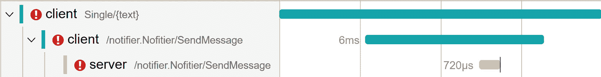
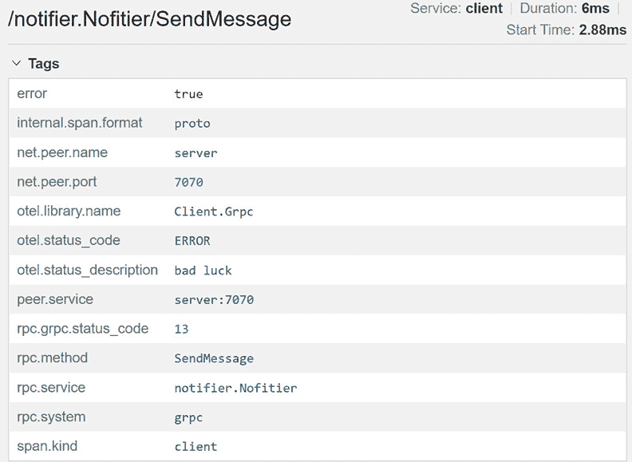
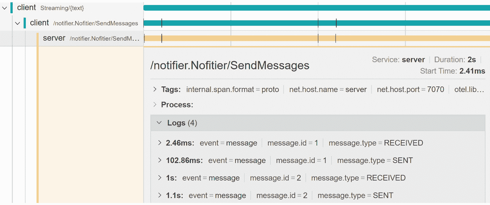
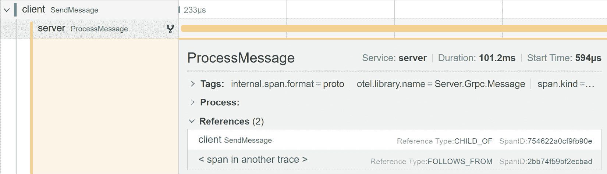
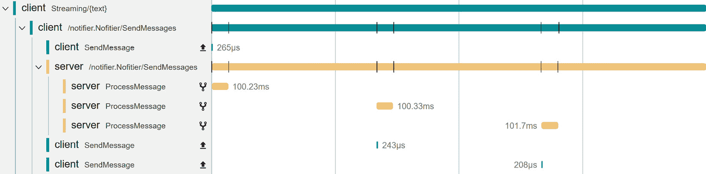
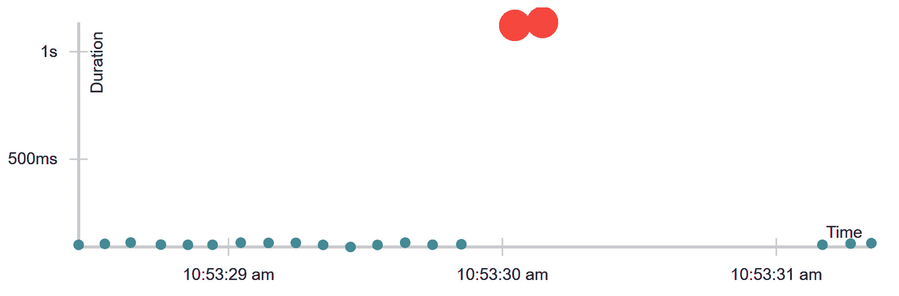
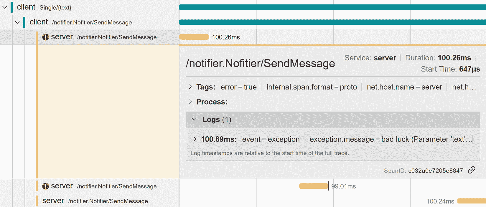
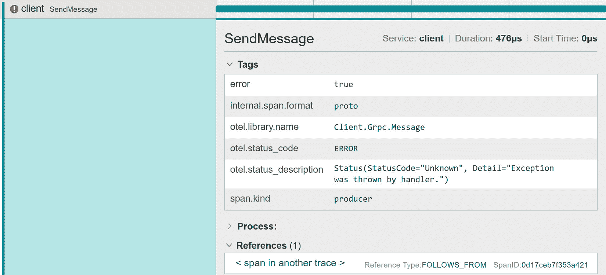
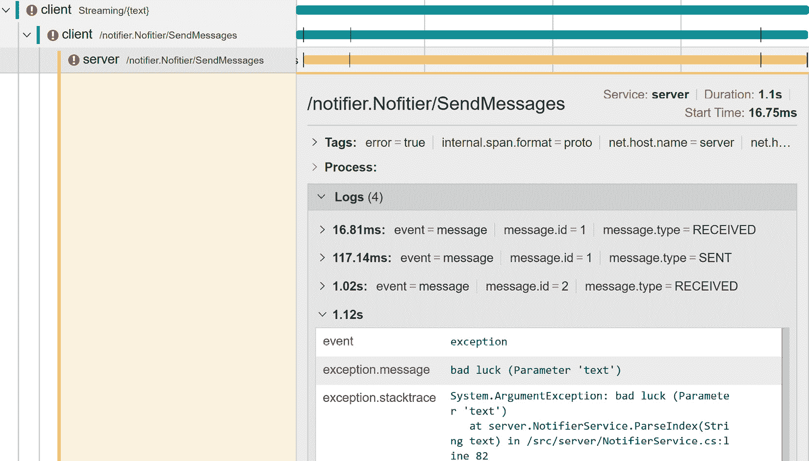

# 第十章：跟踪网络调用

在本章中，我们将应用我们在*第六章*“跟踪您的代码”中学到的跟踪知识，通过 gRPC 对客户端和服务器通信进行仪表化。

我们将首先根据 OpenTelemetry 语义约定在客户端和服务器上仪表化单一 gRPC 调用。然后，我们将切换到流式调用，并探讨为单个消息获取可观察性的不同方法。我们将看到如何用事件或单个跨度来描述它们，并学习如何在单个消息内传播上下文。最后，我们将看到如何使用我们的仪表化来调查问题。

在本章中，您将学习以下内容：

+   根据 OpenTelemetry 语义约定在客户端和服务器上仪表化网络调用，并通过网络传播上下文

+   根据您的应用需求对 gRPC 流式调用进行仪表化

+   应用遥测以深入了解网络调用延迟和失败率，并调查问题

以 gRPC 为例，本章将向您展示如何跟踪网络调用并通过它们传播上下文。通过本章，您还应该能够仪表化高级流式场景，并为您的跟踪选择适当的可观察性信号和粒度。

# 技术要求

本章的代码可在 GitHub 上本书的仓库中找到：[`github.com/PacktPublishing/Modern-Distributed-Tracing-in-.NET/tree/main/chapter10`](https://github.com/PacktPublishing/Modern-Distributed-Tracing-in-.NET/tree/main/chapter10)。

为了运行示例并执行分析，我们需要以下工具：

+   .NET SDK 7.0 或更高版本

+   Docker 和`docker-compose`

# 仪表化客户端调用

在任何分布式应用程序中，网络调用可能是最重要的仪表化对象，因为网络和下游服务是不可靠且复杂的资源。为了了解我们的应用程序是如何工作以及如何出错的，我们需要知道我们依赖的服务是如何表现的。

网络级指标可以帮助我们测量诸如延迟、错误率、吞吐量和活动请求数和连接数等基本指标。跟踪可以实现上下文传播，并帮助我们了解请求是如何通过系统的。因此，如果您要仪表化应用程序，您应该从入站和出站请求开始。

在仪表化调用客户端时，我们需要选择网络堆栈的正确级别。我们想要跟踪 TCP 数据包吗？我们可以吗？答案取决于具体情况，但分布式跟踪通常应用于网络堆栈的应用层，其中存在 HTTP 或 AMQP 等协议。

在.NET 的 HTTP 情况下，我们在`HttpClient`级别应用了仪表化——更准确地说，是在`HttpMessageHandler`级别，它执行单个 HTTP 请求，因此我们可以追踪单个重试和重定向。

如果我们仪表化 `HttpClient` 方法，在许多情况下，我们会收集请求的持续时间，这包括所有尝试在它们之间使用退避间隔获取响应的尝试。错误率将显示没有瞬态故障的速率。这些信息非常有用，但它非常间接地描述了网络级别的调用，并且很大程度上依赖于上游服务的配置和性能。

通常，gRPC 在 HTTP/2 上运行，并在一定程度上可以被 HTTP 仪表库覆盖。对于单一调用来说，当客户端发送请求并等待响应时，情况就是这样。与 HTTP 仪表库的关键区别是我们希望收集一组特定的 gRPC 属性，包括服务和方法名称以及 gRPC 状态码。

然而，当客户端与服务器建立连接后，gRPC 也支持流式传输，它们可以在一个 HTTP/2 调用范围内互相发送多个异步消息。我们将在本章的 *流式调用的监控* 部分中稍后讨论流式调用。现在，让我们专注于单一调用。

## 仪表化单一调用

我们将使用 `Grpc.Net.Client` NuGet 包中的 gRPC 实现，该包提供了一个 OpenTelemetry 仪表库。

注意

OpenTelemetry 提供了两种 gRPC 仪表化版本：一个是为 `Grpc.Net.Client` 包提供的 `OpenTelemetry.Instrumentation.GrpcNetClient`，另一个是为底层 `Grpc.Core.Api` 包提供的 `OpenTelemetry.Instrumentation.GrpcCore`。根据您如何使用 gRPC，确保使用其中一个。

这些仪表化应该覆盖大多数 gRPC 跟踪需求，并且您可以使用在第 *第五章* 中描述的技术进一步自定义它们，*配置和控制平面*。例如，`OpenTelemetry.Instrumentation.GrpcNetClient` 仪表化允许抑制底层 HTTP 仪表化或丰富相应的活动。

在这里，我们将编写自己的仪表化代码作为一个学习练习，您可以将它应用到其他协议或用于满足您可能有的额外要求。

我们可以将每个 gRPC 调用包裹在仪表化代码中，但这将很难维护，并且会污染应用程序代码。更好的方法是实现 gRPC `Interceptor` 中的仪表化。

因此，我们知道应该在何处进行仪表化，但我们应该仪表化什么？让我们从 gRPC OpenTelemetry 语义约定开始——跟踪约定可在 [`github.com/open-telemetry/opentelemetry-specification/blob/main/specification/trace/semantic_conventions/rpc.md`](https://github.com/open-telemetry/opentelemetry-specification/blob/main/specification/trace/semantic_conventions/rpc.md) 找到。

当前，这些约定是实验性的，并且应该预期会有一些变化（例如属性重命名）。

对于单一客户端调用，跟踪规范建议使用`{package.service}/{method}`模式作为跨度名称，以及以下一组基本属性：

+   `rpc.system`属性必须匹配`grpc`——它帮助后端理解这是一个 gRPC 调用。

+   `rpc.service`和`rpc.method`属性应该描述 gRPC 服务和方法的名称。尽管这些信息在跨度名称中可用，但单独的服务和方法属性有助于更可靠和高效地查询和过滤跨度。

+   `net.peer.name`和`net.peer.port`属性描述远程端点。

+   `rpc.grpc.status_code`描述了 gRPC 状态代码的数值表示。

因此，在拦截器中，我们需要做一些事情：使用推荐名称和一组属性启动一个新的`Activity`，将上下文注入到出站请求中，等待响应，设置状态，并结束活动。以下代码片段展示了这一过程：

client/GrpcTracingInterceptor.cs

```cs
public override AsyncUnaryCall<Res>
  AsyncUnaryCall<Req, Res>(Req request,
    ClientInterceptorContext<Req, Res> ctx,
    AsyncUnaryCallContinuation<Req, Res> continuation)
{
  var activity = Source.StartActivity(ctx.Method.FullName,
ActivityKind.Client);
  ctx = InjectTraceContext(activity, ctx);
  if (activity?.IsAllDataRequested != true)
    return continuation(request, ctx);
  SetRpcAttributes(activity, ctx.Method);
  var call = continuation(request, context);
  return new AsyncUnaryCall<Res>(
    HandleResponse(call.ResponseAsync, activity, call),
    call.ResponseHeadersAsync,
    call.GetStatus,
    call.GetTrailers,
    call.Dispose);
}
```

[`github.com/PacktPublishing/Modern-Distributed-Tracing-in-.NET/blob/main/chapter10/client/GrpcTracingInterceptor.cs`](https://github.com/PacktPublishing/Modern-Distributed-Tracing-in-.NET/blob/main/chapter10/client/GrpcTracingInterceptor.cs)

这里，我们重写了拦截器的`AsyncUnaryCall`方法：我们使用客户端类型启动一个新的`Activity`，并注入一个跟踪上下文，无论采样决策如何。如果活动被采样排除，我们只返回一个延续调用，避免任何额外的性能开销。

如果活动被采样包含，我们设置 gRPC 属性，并返回带有修改后的响应任务的延续调用：

client/GrpcTracingInterceptor.cs

```cs
private async Task<Res> HandleResponse<Req, Res>(Task<Res>
  original, Activity act, AsyncUnaryCall<Req> call)
{
  try
  {
    var response = await original;
    SetStatus(act, call.GetStatus());
    return response;
  }
  ...
  finally
  {
    act.Dispose();
  }
}
```

[`github.com/PacktPublishing/Modern-Distributed-Tracing-in-.NET/blob/main/chapter10/client/GrpcTracingInterceptor.cs`](https://github.com/PacktPublishing/Modern-Distributed-Tracing-in-.NET/blob/main/chapter10/client/GrpcTracingInterceptor.cs)

我们在这里显式地释放`Activity`，因为`AsyncUnaryCall`方法是同步的，将在请求完成之前结束，但我们需要活动持续到我们从服务器获取响应。

让我们逐一仔细查看每个操作，从上下文注入开始：

client/GrpcTracingInterceptor.cs

```cs
private ClientInterceptorContext<Req, Res>
  InjectTraceContext<Req, Res>(Activity? act,
    ClientInterceptorContext<Req, Res> ctx)
  where Req: class where Res: class
{
  ...
  _propagator.Inject(new PropagationContext(
      act.Context, Baggage.Current),
    ctx.Options.Headers,
    static (headers, k, v) => headers.Add(k, v));
  return ctx;
}
```

[`github.com/PacktPublishing/Modern-Distributed-Tracing-in-.NET/blob/main/chapter10/client/GrpcTracingInterceptor.cs`](https://github.com/PacktPublishing/Modern-Distributed-Tracing-in-.NET/blob/main/chapter10/client/GrpcTracingInterceptor.cs)

在这里，我们使用`OpenTelemetry.Context.Propagation.TextMapPropagator`类和`Inject`方法注入上下文。我们稍后会看到传播器的配置方式。

我们创建了一个`PropagationContext`结构的实例——它包含需要传播的一切，即`ActivityContext`和当前的`Baggage`。

上下文被注入到`ctx.Options.Headers`属性中，该属性代表 gRPC 元数据。稍后，`GrpcNetClient`将元数据转换成 HTTP 请求头。

`Inject`方法的最后一个参数是一个函数，它告诉传播者如何将带有跟踪上下文的关键值对注入到提供的元数据中。传播者根据其实现可能遵循不同的格式并注入不同的头信息。在这里，我们不需要担心这个问题。

好的，我们已经注入了上下文以实现与后端的关联，现在我们需要填充属性：

client/GrpcTracingInterceptor.cs

```cs
private void SetRpcAttributes<Req, Res>(Activity act,
  Method<Req, Res> method)
{
  act.SetTag("rpc.system", "grpc");
  act.SetTag("rpc.service", method.ServiceName);
  act.SetTag("rpc.method", method.Name);
  act.SetTag("net.peer.name", _host);
  if (_port != 80 && _port != 443)
    act.SetTag("net.peer.port", _port);
}
```

[`github.com/PacktPublishing/Modern-Distributed-Tracing-in-.NET/blob/main/chapter10/client/GrpcTracingInterceptor.cs`](https://github.com/PacktPublishing/Modern-Distributed-Tracing-in-.NET/blob/main/chapter10/client/GrpcTracingInterceptor.cs)

在这里，我们从调用上下文中提供的信息中填充服务和方法名称。但主机和端口来自我们传递给拦截器构造函数的实例变量——这些信息在客户端拦截器中不可用。

最后，一旦收到响应，我们应该填充 gRPC 状态码和`Activity`状态：

client/GrpcTracingInterceptor.cs

```cs
private static void SetStatus(Activity act, Status status)
{
  act.SetTag("rpc.grpc.status_code",
    (int)status.StatusCode);
  var activityStatus = status.StatusCode != StatusCode.OK ?
    ActivityStatusCode.Error : ActivityStatusCode.Unset;
  act.SetStatus(activityStatus, status.Detail);
}
```

[`github.com/PacktPublishing/Modern-Distributed-Tracing-in-.NET/blob/main/chapter10/client/GrpcTracingInterceptor.cs`](https://github.com/PacktPublishing/Modern-Distributed-Tracing-in-.NET/blob/main/chapter10/client/GrpcTracingInterceptor.cs)

如果请求成功遵循 gRPC 语义约定，我们保留了`Activity.Status`未设置。对于通用仪表库来说是有意义的，因为它们不知道什么代表成功。在自定义仪表中，我们可能更了解情况，可以更加具体。

就这样；我们刚刚完成了客户端的单例调用仪表。现在，让我们配置一个 gRPC 客户端来使用。

## 配置仪表

让我们在`GrpcClient`实例上设置一个跟踪拦截器。在演示应用程序中，我们使用与 ASP.NET Core 集成的`GrpcClient`，并按以下方式设置：

client/Program.cs

```cs
builder.Services
  .AddGrpcClient<Nofitier.NofitierClient>(o => {
    o => o.Address = serverEndpoint; ... })
  .AddInterceptor(() => new GrpcTracingInterceptor(
    serverEndpoint, contextPropagator))
  ...
```

[`github.com/PacktPublishing/Modern-Distributed-Tracing-in-.NET/blob/main/chapter10/client/Program.cs`](https://github.com/PacktPublishing/Modern-Distributed-Tracing-in-.NET/blob/main/chapter10/client/Program.cs)

在这里，我们添加了`GrpcClient`，配置了端点，并添加了跟踪拦截器。我们明确传递了选项——服务端点和上下文传播者。

传播者是`TextMapPropagator`类的实现——我们使用一个支持 W3C Trace Context 和 Baggage 格式的复合传播者：

client/Program.cs

```cs
CompositeTextMapPropagator contextPropagator = new (
  new TextMapPropagator[] {
    new TraceContextPropagator(),
    new BaggagePropagator() });
Sdk.SetDefaultTextMapPropagator(contextPropagator);
```

[`github.com/PacktPublishing/Modern-Distributed-Tracing-in-.NET/blob/main/chapter10/client/Program.cs`](https://github.com/PacktPublishing/Modern-Distributed-Tracing-in-.NET/blob/main/chapter10/client/Program.cs)

最后一步是配置 OpenTelemetry 并启用我们在拦截器中使用的 `ActivitySource`：

client/Program.cs

```cs
builder.Services.AddOpenTelemetry()
  .WithTracing(b => b.AddSource("Client.Grpc")...);
```

[`github.com/PacktPublishing/Modern-Distributed-Tracing-in-.NET/blob/main/chapter10/client/Program.cs`](https://github.com/PacktPublishing/Modern-Distributed-Tracing-in-.NET/blob/main/chapter10/client/Program.cs)

单例客户端调用就此结束。现在让我们仪器化服务器。

# 仪器化服务器调用

服务端仪器化类似。我们可以再次使用 gRPC 拦截器，这次覆盖 `UnaryServerHandler` 方法。一旦收到请求，我们应该提取上下文并启动一个新的活动。它应该具有 `server` 类型，一个遵循与客户端跨度相同的模式的名字 – `{package.service}/{method}` – 以及与我们在客户端看到的非常相似的属性。以下是拦截器代码：

server/GrpcTracingInterceptor.cs

```cs
var traceContext = _propagator.Extract(default,
  ctx.RequestHeaders,
  static (headers, k) => new[] { headers.GetValue(k) });
Baggage.Current = traceContext.Baggage;
using var activity = Source.StartActivity(ctx.Method,
  ActivityKind.Server, traceContext.ActivityContext);
if (activity?.IsAllDataRequested != true)
  return await continuation(request, ctx);
SetRpcAttributes(activity, ctx.Host, ctx.Method);
try
{
  var response = await continuation(request, ctx);
  SetStatus(activity, ctx.Status);
  return response;
}
catch (Exception ex) {...}
```

[`github.com/PacktPublishing/Modern-Distributed-Tracing-in-.NET/blob/main/chapter10/server/GrpcTracingInterceptor.cs`](https://github.com/PacktPublishing/Modern-Distributed-Tracing-in-.NET/blob/main/chapter10/server/GrpcTracingInterceptor.cs)

我们使用传播者提取跟踪上下文和行李，然后将提取的父跟踪上下文传递给新的活动并添加属性。服务器拦截器回调是异步的，因此我们可以等待来自服务器的响应并填充状态。

就这样；现在我们只需要配置拦截器并启用 `ActivitySource`：

server/Program.cs

```cs
builder.Services
  .AddSingleton<TextMapPropagator>(contextPropagator)
  .AddGrpc(o => {
    o.Interceptors.Add<GrpcTracingInterceptor>(); ...});
builder.Services.AddOpenTelemetry()
    .WithTracing(b => b.AddSource("Server.Grpc")...);
```

[`github.com/PacktPublishing/Modern-Distributed-Tracing-in-.NET/blob/main/chapter10/server/Program.cs`](https://github.com/PacktPublishing/Modern-Distributed-Tracing-in-.NET/blob/main/chapter10/server/Program.cs)

我们添加了 gRPC 服务，配置了跟踪拦截器，并启用了新的活动源。现在是检查生成的跟踪的时候了。

使用 `$docker-compose up --build` 运行应用程序，然后访问前端 `http://localhost:5051/single/hello`。它将向服务器发送消息并返回响应或显示一个短暂错误。*图 10.1* 展示了一个带有错误的跟踪示例：



图 10.1 – 服务器上显示错误的 gRPC 跟踪

在这里，我们看到来自客户端应用程序的两个跨度和一个来自服务器。它们描述了由 ASP.NET Core 仪器化收集的传入请求以及 gRPC 调用的客户端和服务器端。*图 10.2* 展示了客户端跨度属性，我们可以看到目的地和状态：



图 10.2 – gRPC 客户端属性

这种仪器化使我们能够跟踪任何 gRPC 服务的单例调用，这与我们在 *第二章* 中看到的 HTTP 仪器化类似，即 .NET 的原生监控。现在让我们探索流调用的仪器化。

# 仪器化流调用

到目前为止，本书已经涵盖了同步调用的工具配置，其中应用程序发起请求并等待其完成。然而，当客户端和服务器建立连接并发送消息时，通常使用 gRPC 或其他协议，如 SignalR 或 WebSocket，以异步方式进行通信。

这种通信的常见用例包括聊天应用程序、协作工具以及其他数据应实时且频繁双向流动的情况。

调用开始于客户端发起连接，可能持续到客户端决定断开连接、连接变为空闲或发生某些网络问题。在实践中，这意味着此类调用可能持续数天。

在连接活跃期间，客户端和服务器可以向对方相应的网络流写入消息。当客户端和服务器在相对较短的时间内频繁通信时，这种方法要快得多，效率也更高。与请求-响应通信相比，这种方法可以最大限度地减少由 DNS 查找、协议协商、负载均衡、授权和路由等操作产生的开销，因为这些操作至少会在每个请求中发生一次。

从另一方面来看，应用程序可能会变得更加复杂，因为在许多情况下，我们仍然需要将客户端消息与相应的服务回复关联起来，并为元数据和状态代码制定我们自己的语义。

对于可观察性而言，这意味着现成的工具通常不足以满足需求，至少需要一些定制的工具。让我们看看原因是什么。

## 基本工具配置

一些应用程序在一个流调用中传递完全独立的消息，并希望不同的跟踪描述单个消息。其他应用程序使用流来发送范围批次的消息，并希望有一个跟踪描述流调用中发生的所有事情。当涉及到流时，没有单一的解决方案。

gRPC 自动工具配置遵循 OpenTelemetry 语义约定，并提供了默认体验，其中流调用用客户端和服务器跨度表示，即使调用生命周期是未定义的。单个消息用跨度事件描述，具有涵盖方向、消息标识符和大小的属性。

你可以在本书的存储库中的 `client/GrpcTracingInterceptor.cs` 和 `server/GrpcTracingInterceptor.cs` 文件中找到一个遵循这些约定的完整工具配置实现。让我们看看它产生的跟踪。

使用 `$ docker-compose up --build` 启动应用程序，然后访问客户端应用程序 `http://localhost:5051/streaming/hello?count=2`。它将向服务器发送两条消息并读取所有响应。

查看 Jaeger，请访问 `http://localhost:16686/`。你应该会看到一个类似于 *图 10.3* 中所示的跟踪：



图 10.3 – 带事件的流调用

与单一调用类似，跟踪由三个跨度组成。唯一的区别是客户端和服务器 gRPC 跨度有事件——每个消息两个事件，指示消息何时被发送和接收。这里的`message.id`属性代表请求或响应流中消息的序列号，可能用于关联请求和响应消息。

*图 10**.3* 中显示的跟踪是我们能够通过自动监控（不 aware of our specific streaming usage）实现的最好效果。让我们看看我们如何可以改进它。

## 跟踪单个消息

让我们假设客户端启动了一个非常长的流——在这种情况下，之前的跟踪不会很有帮助。假设消息不是太频繁且冗长，我们可能想要监控每个特定的消息，并查看服务器响应消息如何与客户端消息相关联。

要监控单个消息，我们必须在消息内部传播上下文，但在我们使用通用消息类型操作的拦截器中这是不可能的。

我们的消息 protobuf 定义包含文本和一个属性映射，我们可以使用它来传递跟踪上下文：

client\Protos\notifier.proto

```cs
message Message {
  string text = 1;
  map<string, string> attributes = 2;
}
```

[`github.com/PacktPublishing/Modern-Distributed-Tracing-in-.NET/blob/main/chapter10/client/notifier.proto`](https://github.com/PacktPublishing/Modern-Distributed-Tracing-in-.NET/blob/main/chapter10/client/notifier.proto)

我们将为每个消息创建一个客户端跨度来描述和识别它，以及一个表示处理消息的服务器跨度。

如果在一次流式调用中我们有一百多条消息，将它们全部放在一个跟踪中会很难阅读。此外，典型的采样技术也不适用——根据整个流式调用中做出的采样决策，我们将对每个消息的跨度进行采样或丢弃。

理想情况下，我们希望每个消息流都有一个跟踪，并且有一个链接到承载消息的长运行 HTTP 请求。这样，我们仍然知道传输中发生了什么，以及通过相同的 HTTP 请求发送了什么其他内容，但我们将做出独立的采样决策，并将拥有更小、更易读的跟踪。

注意

当消息相对较大且处理它们需要合理的时间时，跟踪单个消息是合理的。其他方法可能包括仅对采样消息进行自定义关联或上下文传播。

让我们继续对单个消息进行监控：我们需要为每个消息启动一个新的活动，使用`producer`类型表示异步调用。我们需要启动一个新的跟踪，并使用`Activity.Current`作为链接而不是父链接：

client/controllers/StreamingController.cs

```cs
IEnumerable<ActivityLink>? links = null;
if (Activity.Current != null)
{
  links = new[] {
    new ActivityLink(Activity.Current.Context) };
  Activity.Current = null;
}
using var act = Source.StartActivity("SendMessage",
  ActivityKind.Producer,
  default(ActivityContext),
  links: links);
```

[`github.com/PacktPublishing/Modern-Distributed-Tracing-in-.NET/blob/main/chapter10/client/Controllers/StreamingController.cs`](https://github.com/PacktPublishing/Modern-Distributed-Tracing-in-.NET/blob/main/chapter10/client/Controllers/StreamingController.cs)

我们从当前活动创建了一个链接，然后将`Activity.Current`设置为`null`，这强制`StartActivity`方法创建一个孤儿活动。

注意

设置`Activity.Current`应谨慎进行。在这个例子中，我们启动了一个新任务，专门确保它不会改变这个任务范围之外的`Activity.Current`值。

我们有一个活动；现在是我们注入上下文并发送消息到服务器的时候了：

client/controllers/StreamingController.cs

```cs
_propagator.Inject(
  new PropagationContext(act.Context, Baggage.Current),
  message,
  static (m, k, v) => m.Attributes.Add(k, v));
try
{
  await requestStream.WriteAsync(message);
}
catch (Exception ex)
{
  act?.SetStatus(ActivityStatusCode.Error, ex.Message);
}
```

[`github.com/PacktPublishing/Modern-Distributed-Tracing-in-.NET/blob/main/chapter10/client/Controllers/StreamingController.cs`](https://github.com/PacktPublishing/Modern-Distributed-Tracing-in-.NET/blob/main/chapter10/client/Controllers/StreamingController.cs)

上下文注入看起来与本章前面在客户端拦截器中做的类似，但在这里我们将其注入到消息属性中，而不是 gRPC 调用元数据中。

在服务器端，我们需要从消息中提取上下文，然后将其用作父级。我们还应该将`Activity.Current`设置为链接，这样我们就不丢失消息处理和流调用之间的相关性。新的活动有一个`consumer`类型，这表示异步调用的处理端，如这个代码片段所示：

server/NotifierService.cs

```cs
var context = _propagator.Extract(default,
  message,
  static (m, k) => m.Attributes.TryGetValue(k, out var v)
      ? new [] { v } : Enumerable.Empty<string>());
var link = Activity.Current == null ?
   default : new ActivityLink(Activity.Current.Context);
using var act = Source.StartActivity(
  "ProcessMessage",
  ActivityKind.Consumer,
  context.ActivityContext,
  links: new[] { link });
...
```

[`github.com/PacktPublishing/Modern-Distributed-Tracing-in-.NET/blob/main/chapter10/server/NotifierService.cs`](https://github.com/PacktPublishing/Modern-Distributed-Tracing-in-.NET/blob/main/chapter10/server/NotifierService.cs)

我们现在可以启用相应的客户端和服务器活动源 – 我们为每条消息跟踪和拦截器使用了不同的名称，因此我们现在可以单独控制仪器。相应地启用客户端的`Client.Grpc.Message`和服务器上的`Server.Grpc.Message`源，然后启动应用程序。

如果我们在`http://localhost:5051/streaming/hello?count=5`上击中流端点，然后转到 Jaeger，我们会看到六个跟踪 – 每个消息发送一个，以及一个 gRPC 调用。

每条消息的跟踪由两个跨度组成，就像*图 10.4*中显示的那样：



图 10.4 – 在单独的跟踪中跟踪消息

在这里，我们看到发送这条消息大约花费了 1 毫秒，处理它大约花费了 100 毫秒。两个跨度都有链接（Jaeger 术语中的引用）到描述底层 gRPC 调用客户端和服务器端的跨度。

如果我们没有强制为单个消息创建新的跟踪，我们会看到只有一个包含所有跨度的跟踪，如图*10.5*所示：



图 10.5 – 在一个跟踪中跟踪流调用中的所有消息

根据您的场景，您可能更喜欢分离跟踪，有一个大跟踪，或者想出其他方法。

注意，我们现在可以移除我们的自定义追踪拦截器并启用共享的 gRPC 和 HTTP 客户端仪表化库。如果你这样做，按消息的仪表化将保持完全相同，并且将与自动仪表化一起工作。

通过这种方式，你应该能够仪表化一元或流式 gRPC 调用，并了解如何将其扩展到其他情况，包括 SignalR 或套接字通信。

现在我们来看看如何使用 gRPC 仪表化来调查问题。

# 可观察性实践

在我们的服务器应用程序中存在几个问题。第一个问题在你多次点击 `http://localhost:5051/single/hello` 前端时偶尔重现。你可能会注意到一些请求比其他请求耗时更长。如果我们查看持续时间指标或 Jaeger 的持续时间视图，我们会看到类似于 *图 10.6* 的内容：



图 10.6 – Jaeger 中的持续时间视图

我们看到大多数调用都很快（大约 100 毫秒），但有一个调用时间超过一秒。如果我们点击它，Jaeger 将打开相应的跟踪，就像 *图 10.7* 所示的：



图 10.7 – 带有错误的长时间跟踪

显然，发送消息尝试了三次 – 前两次没有成功，但第三次成功了。因此，重试是导致长时间延迟的原因。我们可以通过展开异常事件来调查错误 – 我们将在那里看到一个完整的堆栈跟踪。

值得注意的是，在这里我们只看到服务端有重试。客户端只有一个 gRPC 跨度。这里发生的情况是我们为 gRPC 客户端通道启用了一个重试策略，这会在内部为 `HttpClient` 层添加一个重试处理器。因此，我们的追踪拦截器在尝试和追踪 gRPC 调用的逻辑部分时不会被调用。

官方的 `OpenTelemetry.Instrumentation.GrpcNetClient` 仪表化工作正常，并且能够追踪客户端的个别尝试。

让我们看看另一个问题。发送以下请求：`http://localhost:5051/streaming/hello?count=10`。它将返回几条消息然后停止。如果我们查看 Jaeger 跟踪，我们会看到针对个别消息的大量错误。其中一些将只有一个客户端跨度，就像 *图 10.8* 所示的：



图 10.8 – 没有服务器跨度的客户端错误

跨度中信息不多，但幸运的是，我们有一个指向 gRPC 调用的链接。让我们跟随它看看是否可以解释一些情况。相应的跟踪显示在 *图 10.9* 中：



图 10.9 – gRPC 流中间的错误

在这里，我们看到一个熟悉的跟踪，但在解析消息文本时处理失败了。服务器跨度有六个事件，表明收到了两条消息，并且响应已成功发送到服务器。第三条消息收到了，但随后我们没有看到响应，而是看到一个异常，其中包含堆栈跟踪以帮助我们进一步调查。

如果我们展开客户端 gRPC 跨度，我们将看到在服务器错误发生后尝试发送的每条消息的更多异常。

但没有重试——为什么？在我们的情况下，gRPC 重试，如我们之前在示例中看到的，是在 HTTP 层上应用的。在流的情况下，这意味着在从服务器收到第一个响应之后，包括状态码和头部的 HTTP 响应被接收，其余的通信在请求和响应流中进行。你可以在 Microsoft gRPC 文档中了解更多信息：[`learn.microsoft.com/en-us/aspnet/core/grpc/retries`](https://learn.microsoft.com/en-us/aspnet/core/grpc/retries)。

因此，一旦在服务器上对特定消息抛出未处理的异常，它就会结束客户端和服务器上的 gRPC 调用以及相应的请求和响应流。它影响了客户端上剩余的所有消息，并解释了我们注意到的部分响应。

分布式跟踪帮助我们了解发生了什么，并更多地了解我们使用的科技。除了跟踪之外，OpenTelemetry 定义了一套在客户端和服务器端监控的指标，包括持续时间、从中可以推导出的失败率、请求数和响应数以及有效载荷大小。

# 摘要

在本章中，我们通过以 gRPC 为例来实际操作网络调用进行了仪表化。在开始仪表化之前，我们了解了可用的仪表化库以及 OpenTelemetry 语义约定建议为 gRPC 记录的内容。

首先，我们使用客户端和服务器跨度对单例调用进行了仪表化，并通过 gRPC 元数据传播上下文。然后，我们实验了 gRPC 流，这需要不同的跟踪方法。流调用的通用仪表化建议为流中的每个单独的请求和响应消息创建一个事件，并提供基本级别的可观察性。根据我们的场景和可观察性需求，我们可以添加另一层仪表化来跟踪单个消息。这些自定义跨度建立在通用 gRPC 仪表化之上。

最后，我们使用了跟踪来深入了解高延迟和短暂错误场景，这也有助于我们理解 gRPC 内部机制。

现在，你已经准备好使用跟踪来仪表化你的网络堆栈，或者通过添加针对你应用程序特定的自定义仪表化层来丰富现有的仪表化库。在下一章中，我们将探讨消息场景，并更深入地研究异步处理的可观察性。

# 问题

1.  当使用 gRPC 时，你会编写自己的仪表化工具还是重用现有的一个？

1.  让我们假设我们想在客户端在启动时发起连接并永远保持打开（直到服务器或客户端停止）的情况下，对客户端和服务器之间的 gRPC 通信进行仪表化，并且然后重用这个连接进行所有通信。你会选择哪种跟踪方法？为什么？
