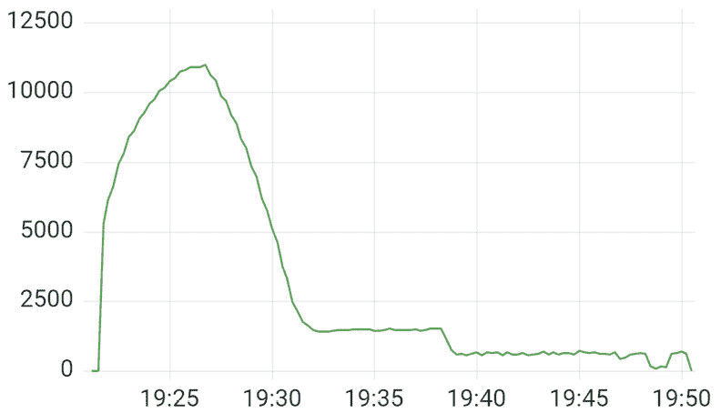

# 11

# 配置消息传递场景

通过减少服务之间的耦合，消息和异步处理提高了分布式系统的可扩展性和可靠性。然而，它们也增加了复杂性，并引入了一种新的故障模式，这使得可观察性变得更加重要。

在本章中，我们将使用跟踪和指标来配置消息生产者和消费者，并涵盖单个和批量消息处理。

在本章中，你将学习以下内容：

+   跟踪消息在创建和发布时的单个消息

+   仪器接收和处理操作

+   配置批次

+   使用配置来诊断常见的消息传递问题

到本章结束时，你应该能够从头开始配置你的消息传递应用程序，或者根据需要调整现有的消息传递配置。 

# 技术要求

本章的代码可在 GitHub 上找到，位于书籍仓库的[`github.com/PacktPublishing/Modern-Distributed-Tracing-in-.NET/tree/main/chapter11`](https://github.com/PacktPublishing/Modern-Distributed-Tracing-in-.NET/tree/main/chapter11)。

为了运行示例并执行分析，我们需要以下工具：

+   .NET SDK 7.0 或更高版本。

+   Docker 和`docker-compose`。

+   任何 HTTP 基准测试工具，例如，`bombardier`。如果你有 Go 工具，可以使用`$ go get -u github.com/codesenberg/bombardier`安装它，或者直接从其 GitHub 仓库[`github.com/codesenberg/bombardier/releases`](https://github.com/codesenberg/bombardier/releases)下载。

我们还将使用 Docker 中的 Azure 存储模拟器。不需要设置或 Azure 订阅。

# 消息传递场景中的可观察性

在*第十章* *跟踪网络调用*中，我们刚刚开始探索异步处理的支持。在那里，我们看到了客户端和服务器如何相互发送一系列可能独立的消息。

在消息传递的情况下，事情变得更加复杂：除了异步通信之外，生产者和消费者通过一个中介——消息**代理**进行交互。

一旦消息发布到代理，生产者的操作就完成了，而不需要等待消费者处理这条消息。根据场景和应用的健康状况，消费者可能立即处理它，几秒钟后处理，或者几天后处理。

在某些情况下，生产者会收到消息已处理的通知，但这通常是通过另一个消息队列或不同的通信渠道完成的。

实际上，生产者不知道消费者是否存在——处理管道中的故障或延迟在生产者端是不可见的。这改变了我们应该从可观察性角度看待延迟、吞吐量或错误率的方式——现在我们需要考虑由多个独立操作组成的端到端流程。

例如，当仅使用 HTTP 调用时，原始请求的延迟几乎涵盖了请求过程中发生的所有事情。一旦我们引入消息传递，我们需要手段来测量端到端延迟并识别不同组件之间的故障。一个使用消息传递的应用示例在*图 11.1*中显示：


图 11.1 – 使用消息传递在后台运行任务的应用

在这样的应用中，当用户向前端发送请求时，一旦后端完成处理并向主题发布消息，他们就会收到响应。索引器、复制器、归档器和任何其他后处理数据的其他服务以它们自己的速度运行。索引器通常处理最新的消息，而归档器只会查看几天前发布的消息。

其中一些组件可能会失败而不会直接影响用户场景，而其他组件则影响用户发布的数据在其他系统部分显示的速度，因此可能是关键的。

让我们探索如何对这样的应用进行工具化。

在从头开始编写自己的工具之前，我们应始终检查是否已有可从中开始的现有工具库，如果没有，则应咨询 OpenTelemetry 语义约定。

我们将以 Azure Queue Storage 为例进行工具化。由于我们将在下一两个部分中看到的原因，现有的工具化没有涵盖队列的消息传递方面，因此我们不得不自己编写；我们将根据 OpenTelemetry 约定进行编写。

## 消息传递语义约定

跟踪的消息传递约定可在[`github.com/open-telemetry/opentelemetry-specification/blob/main/specification/trace/semantic_conventions/messaging.md`](https://github.com/open-telemetry/opentelemetry-specification/blob/main/specification/trace/semantic_conventions/messaging.md)找到。

它们目前处于实验状态，并且很可能发生变化。目前还没有通用的度量约定，但你可以找到针对 Kafka 的特定度量。

约定提供了一些关于上下文传播的考虑（我们将在*跟踪上下文传播*部分讨论），并定义了通用属性来描述消息传递操作。以下是我们将要使用的一些基本属性：

+   `messaging.system`：表示跨度遵循消息传递语义，并描述了使用的特定消息传递系统，例如`kafka`或`rabbitmq`。在我们的示例中，我们将使用`azqueues`。

+   `messaging.operation`：标识标准操作之一：`publish`、`receive`或`process`。

+   `messaging.destination.name`和`messaging.source.name`：描述代理内部的一个队列或主题名称。术语`destination`用于生产者，而`source`用于消费者。

+   `net.peer.name`：标识代理域名。

让我们看看如何使用约定来添加可观察性信号，这些信号可以帮助我们记录应用程序行为或检测和解决在消息场景中发生的新类别问题。

# 仪表化生成器

生成器是负责向代理发布消息的组件。发布过程本身通常是同步的：我们向代理发送请求，并从它那里获得响应，指示消息是否成功发布。

根据消息系统和生成器需求，一个发布请求可能携带一条或多条消息。我们将在“*仪表批处理场景*”部分讨论批处理。现在，让我们专注于单条消息的情况。

为了跟踪它，我们需要确保在发布消息时创建一个活动，这样我们就可以跟踪调用持续时间、状态，并调试单个请求。我们也会对持续时间、吞吐量和失败率等指标感兴趣——这对于云消息解决方案的预算或自托管代理的扩展非常重要。

生成器仪表的一部分是上下文传播。让我们在这里稍作停顿，讨论一下。

## 跟踪上下文传播

当我们仪表化 HTTP 调用时，上下文通过 HTTP 请求头传播，这是请求的一部分。在消息中，上下文通过一个传输调用到代理，并且不会传播到消费者。传输调用跟踪上下文标识请求，但不标识它携带的消息。

因此，我们需要在消息内部传播上下文，以确保它能够到达消费者。但我们应该注入哪种上下文？我们有几个选项：

+   **使用当前活动的上下文**：例如，当我们在一个传入 HTTP 请求的范围内发布消息时，我们可以使用代表这个 HTTP 服务器调用的活动的上下文。这只有在每个传入请求只发送一条消息的情况下才有效。如果我们发送多条（每条都在单独的发布调用中），我们就无法确定消费者调用处理了哪条消息，或者确定我们是否向正确的队列发送了消息。

+   **为每条消息创建一个活动并注入其上下文**：独特的上下文允许我们单独跟踪消息，在发送多条消息在一个发布调用中的批处理场景中也有效。这也增加了为每条消息创建额外活动的开销。

+   **重用发布活动**：当我们向代理发送一条消息时，我们可以通过一个活动唯一地识别一条消息和一个发布调用。

第一个选项违反了 OpenTelemetry 消息语义约定，这允许我们从最后两个选项中选择一个合适的选项。在我们的例子中，我们使用 Azure Queue Storage，它不支持发布消息时的批处理。因此，我们将使用最后一个选项，创建一个活动来跟踪发布调用，并将它的上下文注入到消息中。

注意

当从一个队列将消息分叉或路由到另一个队列时，消息可能在上游服务中已经注入了预存在的跟踪上下文。在这种情况下，默认行为应该是保持消息上下文完整。为了关联与消息发生的所有操作，我们可以在发布或接收消息时始终添加一个链接到现有的跟踪上下文。

Azure Queue Storage 的另一个有趣方面是它不支持消息元数据——消息是一个不透明的有效载荷，没有任何规定的结构或格式，服务会携带它。因此，类似于我们在*第十章*中讨论的 gRPC 流，*跟踪网络调用*，我们需要定义自己的消息结构或使用可用的知名事件格式之一，例如**CloudEvents**。

注意

CloudEvents ([`cloudevents.io`](https://cloudevents.io)) 是一个开放标准，以供应商和技术无关的方式定义事件结构。它通常被云提供商用于通知应用程序有关基础设施更改或实现数据更改馈送时使用。CloudEvents 具有分布式跟踪扩展，可以携带 W3C 跟踪上下文以及可用于其他格式的通用元数据。OpenTelemetry 还提供了 CloudEvents 的语义约定。

为了演示目的，我们将保持简单，并以下述方式定义我们自己的小型消息模型：

producer/Message.cs

```cs
public class Message
{
  ...
  public Dictionary<string, string> Headers { get; set; } =
    new ();
  public string? Text { get; set; }
}
```

[`github.com/PacktPublishing/Modern-Distributed-Tracing-in-.NET/blob/main/chapter11/producer/Message.cs`](https://github.com/PacktPublishing/Modern-Distributed-Tracing-in-.NET/blob/main/chapter11/producer/Message.cs)

我们将使用`Headers`属性来传播跟踪上下文，并将有效载荷保留在`Text`属性中。

与我们在*第十章*中看到的 gRPC 流示例类似，*跟踪网络调用*，我们可以使用以下代码片段通过 OpenTelemetry 传播器将上下文注入此消息：

producer/Controllers/SendController.cs

```cs
private void InjectContext(Message message, Activity? act)
{
  if (act != null)
  {
    _propagator.Inject(new (act.Context, Baggage.Current),
      message,
    static (m, k, v) => m.Headers[k] = v);
  }
}
```

[`github.com/PacktPublishing/Modern-Distributed-Tracing-in-.NET/blob/main/chapter11/producer/Controllers/SendController.cs`](https://github.com/PacktPublishing/Modern-Distributed-Tracing-in-.NET/blob/main/chapter11/producer/Controllers/SendController.cs)

现在我们已经有了所有需要的工具来对发布调用进行仪器化——让我们来做吧。

## 跟踪发布调用

我们需要创建一个新的活动，并在其上放置常见的消息属性以标识代理、队列操作，并添加其他信息。在 Azure Queue Storage 的情况下，我们可以使用账户名称作为代理标识符（因为它们在公共云中是唯一的）。

然后，我们将向消息中注入上下文并继续发布。消息成功发布后，我们还可以记录代理返回的信息，例如消息 ID 和其他可能认为有用的细节。

这是相应的代码：

producer/Controllers/SendController.cs

```cs
Stopwatch? duration = PublishDuration.Enabled ?
  Stopwatch.StartNew() : null;
using var act = StartPublishActivity();
InjectContext(message, Activity.Current);
try
{
  var receipt = await _queue.SendMessageAsync(
    BinaryData.FromObjectAsJson(message));
  act?.SetTag("messaging.message.id",
    receipt.Value.MessageId);
  RecordPublishMetrics(duration, "ok");
  ...
}
catch (Exception ex)
{
  act?.SetStatus(ActivityStatusCode.Error, ex.Message);
  RecordPublishMetrics(duration, "fail")
  ...
}
```

[`github.com/PacktPublishing/Modern-Distributed-Tracing-in-.NET/blob/main/chapter11/producer/Controllers/SendController.cs`](https://github.com/PacktPublishing/Modern-Distributed-Tracing-in-.NET/blob/main/chapter11/producer/Controllers/SendController.cs)

在这里，我们使用之前实现的 `Inject` 方法注入了 `Activity.Current` 的上下文。如果你想要关闭按消息的活动，这可能很有用。在这种情况下，按消息的跟踪将被限制，但消费者和生产者的调用仍然会关联。我们在这里也记录了指标——请保持关注细节；我们将在下一节中介绍它们。

这里是 `StartPublishActivity` 方法的实现：

producer/Controllers/SendController.cs

```cs
var act = Source.StartActivity($"{_queue.Name} publish",
  ActivityKind.Producer);
if (act?.IsAllDataRequested == true)
  act.SetTag("messaging.system", "azqueues")
    .SetTag("messaging.operation", "publish")
    .SetTag("messaging.destination.name", _queue.Name)
    .SetTag("net.peer.name", _queue.AccountName)
}
```

[`github.com/PacktPublishing/Modern-Distributed-Tracing-in-.NET/blob/main/chapter11/producer/Controllers/SendController.cs`](https://github.com/PacktPublishing/Modern-Distributed-Tracing-in-.NET/blob/main/chapter11/producer/Controllers/SendController.cs)

这里的活动有一个 `producer` 类型，这表示异步流程的开始。名称遵循 OpenTelemetry 语义约定，建议使用 `{queue_name} {operation}` 模式。我们也可以将其缓存以避免不必要的字符串格式化。

就这样；我们已经涵盖了生产者跟踪——现在让我们看看指标。

## 生产者指标

特定于消息的指标作为资源利用率、.NET 运行时、HTTP 等其他你可能想要公开的指标的补充。

在一定程度上，我们可以使用 HTTP 指标来监控对 Azure Queue Storage 的调用，因为它们基于 HTTP。这将允许我们监控对存储的个别 HTTP 调用的持续时间、成功率以及吞吐量，但无法区分同一存储账户内的队列。

因此，如果我们依赖于指标，我们应该记录一些特定于消息的指标，这些指标涵盖了常见的指标，例如每个队列的发布调用持续时间、吞吐量和延迟。

我们可以使用持续时间直方图来报告所有这些指标，就像我们在 *第七章* 中看到的，*添加自定义指标*。首先，让我们初始化持续时间直方图，如下面的代码片段所示：

producer/Controllers/SendController.cs

```cs
private static readonly Meter Meter = new("Queue.Publish");
private static readonly Histogram<double> PublishDuration =
  Meter.CreateHistogram<double>(
    "messaging.azqueues.publish.duration", ...);
```

[`github.com/PacktPublishing/Modern-Distributed-Tracing-in-.NET/blob/main/chapter11/producer/Controllers/SendController.cs`](https://github.com/PacktPublishing/Modern-Distributed-Tracing-in-.NET/blob/main/chapter11/producer/Controllers/SendController.cs)

`Meter` 和 `Histogram` 是静态的，因为我们是在控制器中定义它们的。控制器的生命周期是针对请求的，所以我们保持它们为静态以保持效率。

正如我们在跟踪示例中看到的，每次我们发布消息时，我们也会记录发布持续时间。以下是它的实现方式：

producer/Controllers/SendController.cs

```cs
public void RecordPublishMetrics(Stopwatch? dur,
  string status)
{
  ...
  TagList tags = new() {
    { "net.peer.name", _queue.AccountName },
    { "messaging.destination.name", _queue.Name },
    { "messaging.azqueue.status", status }};
  PublishDuration.Record(dur.Elapsed. TotalMilliseconds,
    tags);
}
```

[`github.com/PacktPublishing/Modern-Distributed-Tracing-in-.NET/blob/main/chapter11/producer/Controllers/SendController.cs`](https://github.com/PacktPublishing/Modern-Distributed-Tracing-in-.NET/blob/main/chapter11/producer/Controllers/SendController.cs)

在这里，我们使用了相同的属性来描述队列，并添加了一个自定义状态属性。请注意，我们需要它具有低基数，所以我们只在使用此方法时使用`ok`和`fail`状态。

我们已经完成了生产者的监控。拥有基本的跟踪和指标应该为我们提供一个良好的起点，以诊断和调试大多数问题，并监控整体生产者健康，正如我们将在后面的*消息场景中的性能分析*部分中看到的。现在，让我们探索消费者上的监控。

# 监控消费者

虽然你可能可以在生产者上不使用自定义监控的情况下逃脱，但消费者监控是不可避免的。

一些代理使用同步 HTTP 或 RPC 调用将消息推送到消费者，现有的框架监控可以提供最基本的可观察性数据。在所有其他情况下，消息跟踪和指标是我们检测消费者健康和调试问题的全部。

首先，让我们追踪单个消息——记录它们在消费者中的到达时间和处理方式。这使我们能够通过回答诸如“这条消息现在在哪里？”或“为什么处理数据花了这么长时间？”等问题来调试问题。

## 跟踪消费者操作

当使用 Azure Queue Storage 时，应用程序从队列请求一条或多条消息。接收到的消息仍然留在队列中，但对其他消费者来说是不可见的，这是可配置的可见性超时。应用程序处理消息，完成后，从队列中删除它们。如果处理因暂时性问题失败，应用程序不会删除消息。当与 AWS SQS 一起工作时，通常使用相同的流程。

基于 RabbitMQ 和 AMQP 的消息流看起来很相似，除了消息可以被推送到消费者，这样应用程序就可以对客户端库回调做出反应，而不是轮询队列。

基于回调的交付允许我们在客户端库中实现监控，或者提供一个共享的监控库，而在基于轮询的模型中，我们实际上被迫至少编写一些自定义监控来处理。让我们这样做。

首先，让我们在接收之外单独对消息处理进行监控。我们需要创建一个活动来跟踪处理，这将捕获那里发生的所有事情，包括消息删除：

consumer/SingleReceiver.cs

```cs
using var act = StartProcessActivity(msg);
...
try
{
  await ProcessMessage(msg, token);
  await _queue.DeleteMessageAsync(msg.MessageId,
    msg.PopReceipt, token);
}
catch (Exception ex)
{
  await _queue.UpdateMessageAsync(msg.MessageId,
    msg.PopReceipt, visibilityTimeout: BackoffTimeout,
    cancellationToken: token);
  ...
  act?.SetStatus(ActivityStatusCode.Error, ex.Message);
}
```

[`github.com/PacktPublishing/Modern-Distributed-Tracing-in-.NET/blob/main/chapter11/consumer/SingleReceiver.cs`](https://github.com/PacktPublishing/Modern-Distributed-Tracing-in-.NET/blob/main/chapter11/consumer/SingleReceiver.cs)

在这里，所有处理逻辑都在 `ProcessMessage` 方法中完成。当它成功完成时，我们从队列中删除消息。否则，我们更新其可见性，以便在回退超时后再次出现在队列中。

这里是 `StartProcessActivity` 的实现：

consumer/SingleReceiver.cs

```cs
PropagationContext ctx = ExtractContext(msg);
var current = new ActivityLink(Activity.Current?.Context ??
  default);
var act = _messageSource.StartActivity(
  $"{_queue.Name} process",
  ActivityKind.Consumer,
  ctx.ActivityContext,
  links: new[] { current });
if (act?.IsAllDataRequested == true)
  act.SetTag("net.peer.name",_queue.AccountName)
     .SetTag("messaging.system", "azqueues")
     .SetTag("messaging.operation", "process")
     .SetTag("messaging.source.name", _queue.Name)
     .SetTag("messaging.message.id", msg.MessageId);
  ...
```

[`github.com/PacktPublishing/Modern-Distributed-Tracing-in-.NET/blob/main/chapter11/consumer/SingleReceiver.cs`](https://github.com/PacktPublishing/Modern-Distributed-Tracing-in-.NET/blob/main/chapter11/consumer/SingleReceiver.cs)

在这里，我们从消息中提取了上下文，并将其用作处理活动的父级。它具有 `consumer` 类型，这表示异步流的延续。我们还保留了 `Activity.Current` 作为关联的链接。我们还添加了消息属性。

消息删除和更新是通过 HTTP 或 Azure 队列 SDK 仪器跟踪的。它们没有消息语义，但应该提供合理的可观察性。相应活动成为处理活动的子活动，如图 *11.2* 所示：


图 11.2 – 从生产者到消费者的消息跟踪

消息被发布后，我们看到消费者尝试处理它两次：第一次尝试失败。第二次尝试成功，消息被删除。

上一张截图缺少了什么？我们没有看到消息是如何和何时被接收的。这可能在这个跟踪中并不重要，但看看 *11.3* 中的另一个跟踪：


图 11.3 – 生产者和消费者之间有九分钟间隔的消息跟踪

在这里，几乎九分钟内没有发生任何事情。在这段时间内，消费者是否收到了消息？消费者是否存活？他们在做什么？Azure 队列服务中是否有任何问题阻止了消息的接收？

我们将在稍后回答这些问题。现在，让我们专注于跟踪接收操作。

接收操作中的挑战在于，在收到消息并即将结束相应操作之后，消息跟踪上下文才可用。那时我们可以添加链接到消息跟踪上下文，但目前只能在活动开始时添加它们。

这可能会改变，但到目前为止，我们将通过跟踪接收和处理迭代，并添加一个带有接收消息 ID 的属性来解决这个问题，这样我们就可以找到所有接触过这条消息的跨度：

consumer/SingleReceiver.cs

```cs
using var act = _receiverSource
  .StartActivity("ReceiveAndProcess");
try
{
  var response = await _queue.ReceiveMessagesAsync(1,
    ProcessingTimeout, token);
  QueueMessage[] messages = response.Value;
  if (messages.Length == 0)
  {
    ...; continue;
  }
  act?.SetTag("messaging.message.id",
    messages[0].MessageId);
  await ProcessAndSettle(messages[0], token);
  ...
}
catch (Exception ex)
{
  act?.SetStatus(ActivityStatusCode.Error, ex.Message);
  ...
}
```

[`github.com/PacktPublishing/Modern-Distributed-Tracing-in-.NET/blob/main/chapter11/consumer/SingleReceiver.cs`](https://github.com/PacktPublishing/Modern-Distributed-Tracing-in-.NET/blob/main/chapter11/consumer/SingleReceiver.cs)

在这里，我们从队列中接收最多一条消息。如果收到了消息，我们就处理它。

一个迭代通过 `ReceiveAndProcess` 活动进行跟踪，该活动成为接收操作的父级。消息处理活动在 `ProcessAndSettle` 方法中创建，并链接到 `ReceiveAndProcess` 活动如图 11.4 所示：


图 11.4 – 从处理到外部循环活动的链接

如果我们跟随链接，我们将看到类似于 *图 11.5* 中所示的循环跟踪：


图 11.5 – 表示接收和处理迭代的跟踪图

由于越来越多的可观察性后端提供了更好的链接支持，因此在后端使用它们可能更加方便。

通过迭代进行仪表化，我们现在可以关联接收和处理，或者看到完整循环周期需要多长时间。这有助于我们了解消费者是否活跃并尝试接收和处理某些内容。

我们在所有跨度上标记了 `messaging.message.id` 属性，以简化查找与任何给定消息相关的所有操作。

现在，回到我们在 *图 11.3* 中看到的九分钟间隔。那里发生的事情是队列中的消息太多——它们的生产速度超过了我们的消费速度。通过查看单个跟踪中的间隔，我们可以怀疑消息在队列中花费了时间，但无法确定。我们需要看到消息发布的速率、处理的速率和删除的速率。我们还应该了解消息在队列中花费的时间和队列的大小。让我们看看我们如何记录和使用这些指标。

## 消费者指标

与生产者类似，我们应该启用常见的运行时和进程指标，以便我们知道消费者进程的资源利用率。我们还应该记录处理循环的持续时间，这将给我们提供错误率和吞吐量。

从消息传递的角度来看，我们还想涵盖以下内容：

+   消息在队列中花费的时间是消费者健康状况和规模的良好指标。当消费者不足时，队列中花费的时间会增长，可以用来扩展消费者。当它持续下降时，这可以作为一个信号来缩小消费者规模。

+   队列中的消息数量提供了类似的数据，但实时。它包括尚未处理的消息。队列大小指标也可以在生产者端记录，而无需依赖消费者。

这些指标，或者你可以想到的类似指标及其随时间的变化趋势，为消费者健康状况提供了很好的指示。

如果消费者性能下降或错误率增加，这些指标会增加。如果消费者未能处理消息但立即将其从队列中删除，则它们将没有帮助，但这将表现为高错误率。所以，让我们继续用这些指标来仪表化我们的应用程序。

### 持续时间、吞吐量和故障率

我们将要测量处理循环的持续时间，这包括尝试接收消息及其处理。独立测量接收和处理持续时间将更加精确，这也是你在生产应用中需要考虑的事情。

在循环开始时，我们将启动一个计时器来测量操作持续时间，一旦处理完成，我们将将其作为直方图与队列信息和状态一起报告。让我们首先创建直方图仪表：

consumer/SingleReceiver.cs

```cs
private readonly Meter _meter = new ("Queue.Receive");
private readonly Histogram<double> _loopDuration;
...
_loopDuration = _meter.CreateHistogram<double>(
  "messaging.azqueues.process.loop.duration", "ms",
  "Receive and processing duration.");
```

[`github.com/PacktPublishing/Modern-Distributed-Tracing-in-.NET/blob/main/chapter11/consumer/SingleReceiver.cs`](https://github.com/PacktPublishing/Modern-Distributed-Tracing-in-.NET/blob/main/chapter11/consumer/SingleReceiver.cs)

在这里，我们将创建计米和持续时间仪表作为实例变量，我们将与`SingleReceiver`实例一起丢弃它们。接收器扩展了`BackgroundService`接口，并在依赖注入容器中注册为单例，因此一旦应用程序关闭，它们都会被丢弃。

处理循环的仪表化可以按以下方式进行：

consumer/SingleReceiver.cs

```cs
Stopwatch? duration = Stopwatch.StartNew();
try
{
  var response = await _queue.ReceiveMessagesAsync(1,
    ProcessingTimeout, token);
  QueueMessage[] messages = response.Value;
  RecordLag(messages);
  if (messages.Length == 0)
  {
    ...
    RecordLoopDuration(duration, "empty");
    continue;
  }
  ...
  await ProcessAndSettle(messages[0], token);
  RecordLoopDuration(duration, "ok");
}
catch (Exception ex)
{
  RecordLoopDuration(duration, "fail"); ...
}
```

[`github.com/PacktPublishing/Modern-Distributed-Tracing-in-.NET/blob/main/chapter11/consumer/SingleReceiver.cs`](https://github.com/PacktPublishing/Modern-Distributed-Tracing-in-.NET/blob/main/chapter11/consumer/SingleReceiver.cs)

在这里，我们记录了每次迭代的持续时间以及队列信息和状态。状态可以有以下值：`ok`、`fail`或`empty`（如果没有收到消息）。在实际应用中，你可能希望更加精确，并添加更多状态以指示失败原因。例如，记录接收操作失败的原因很重要，无论是序列化或验证错误、处理超时，还是以终端或暂时性错误失败。

`RecordLoopDuration`方法实现如下所示：

consumer/SingleReceiver.cs

```cs
TagList tags = new () {
  { "net.peer.name", _queue.AccountName },
  { "messaging.source.name", _queue.Name },
  { "messaging.azqueue.status", status }};
_loopDuration.Record(duration.ElapsedMilliseconds, tags);
```

[`github.com/PacktPublishing/Modern-Distributed-Tracing-in-.NET/blob/main/chapter11/consumer/SingleReceiver.cs`](https://github.com/PacktPublishing/Modern-Distributed-Tracing-in-.NET/blob/main/chapter11/consumer/SingleReceiver.cs)

我们将在本章后面看到如何使用这个指标。首先，让我们实现消费者延迟和队列大小。

### 消费者延迟

在显示处理循环中指标的代码示例中，我们一收到消息就调用了`RecordLag`方法。消费者延迟记录了消息在队列中花费的大致时间——接收和入队时间之间的差值。

入队时间由 Azure 队列服务记录，并作为`QueueMessage`实例上的属性公开。我们可以使用以下代码记录指标：

consumer/SingleReceiver.cs

```cs
_consumerLag = _meter.CreateHistogram<double>(
  "messaging.azqueues.consumer.lag", "s", ...);
...
long receivedAt = DateTimeOffset.UtcNow
  .ToUnixTimeMilliseconds();
TagList tags = new () {
  { "net.peer.name", _queue.AccountName },
  { "messaging.source.name", _queue.Name }};
foreach (var msg in messages
    .Where(m => m.InsertedOn.HasValue))
{
  long insertedOn = msg.InsertedOn!
    .Value.ToUnixTimeMilliseconds());
  long lag = Math.Max(1, receivedAt - insertedOn);
  _consumerLag.Record(lag/1000d, tags);
}
```

[`github.com/PacktPublishing/Modern-Distributed-Tracing-in-.NET/blob/main/chapter11/consumer/SingleReceiver.cs`](https://github.com/PacktPublishing/Modern-Distributed-Tracing-in-.NET/blob/main/chapter11/consumer/SingleReceiver.cs)

在这里，我们创建一个表示延迟（以秒为单位）的直方图，并将它记录在每条接收到的消息上，作为当前时间和消息被代理接收的时间之间的差异。

注意，这些时间戳通常来自两台不同的计算机——差异可能是负数，并且由于时钟偏差而不精确。误差范围可能达到秒，但在某种程度上，可以在您的系统中进行纠正。

时钟偏差是可以预期的，但有时事情可能会真的出错。我曾经参与调查一起事件，导致我们的服务在数据中心中断。这是由于错误的时间服务器配置，将其中一个服务的时间表向后移动了几小时。它破坏了认证——认证令牌的时间戳来自几小时前，被认为是过期的。

尽管不够精确，消费者延迟应该能让我们了解消息在队列中花费的时间。我们每次收到消息时都会记录它，因此它也反映了重新投递。此外，我们在知道处理是否成功之前就记录它，因此它没有任何状态。

在我们记录消费者延迟之前，我们首先需要接收一条消息。当我们看到巨大的延迟时，这是一个很好的信号，表明某些事情可能不正常，但它并没有告诉我们还有多少消息尚未接收。

例如，当负载低且队列空时，可能会有一些无效的消息卡在那里。这是一个错误，但可以在工作时间内修复。为了检测问题的严重性，我们还需要知道队列中有多少消息。让我们看看如何实现它。

### 队列大小

Azure 队列存储以及 Amazon SQS 允许我们检索消息的大致数量。我们可以注册另一个 `BackgroundService` 实现来定期检索计数。这可以在消费者或生产者上完成。

我们将使用一个量度仪表来报告它，如下面的代码片段所示：

consumer/QueueSizeReporter.cs

```cs
TagList tags = new () {
  { "net.peer.name", queue.AccountName},
  { "messaging.source.name", queue.Name}};
_queueSize = _meter.CreateObservableGauge(
  "messaging.azqueues.queue.size",
  () => new Measurement<long>(_currentQueueSize, tags), ...);
```

https://github.com/PacktPublishing/Modern-Distributed-Tracing-in-.NET/blob/main/chapter11/consumer/QueueSizeReporter.cs

我们传递了一个返回 `_currentQueueSize` 实例变量的回调。我们将每隔几秒钟从队列中检索大小来更新它：

consumer/QueueSizeReporter.cs

```cs
var res = await _queue.GetPropertiesAsync(token);
_currentQueueSize = res.Value.ApproximateMessagesCount;
```

https://github.com/PacktPublishing/Modern-Distributed-Tracing-in-.NET/blob/main/chapter11/consumer/QueueSizeReporter.cs

就这样——现在我们测量队列大小。这个数字本身并不能告诉我们整个故事，但如果它与基线有显著差异或增长迅速，这将是问题的一个很好的迹象。

一旦负载增加，队列大小也会增加，我们可能会尝试添加更多消费者或优化它们。一种典型的优化是批处理——它有助于减少网络调用的数量，并更好地利用消费者实例。让我们看看我们如何对其进行仪器化。

# 批处理场景的仪器化

根据用例的不同，批处理场景的仪器化可能不同——与批处理相比，传输级别的批处理需要稍微不同的方法。

## 传输级别的批处理

消息可以一起批处理以最小化网络调用的数量。它可以由生产者或消费者使用，例如 Kafka、Amazon SQS 或 Azure Service Bus 等系统都支持两端的批处理。

在消费者端，当一起接收多条消息但独立处理时，对于单条消息处理的所有内容仍然适用。

从跟踪的角度来看，我们唯一想要改变的是在外部迭代活动上添加记录所有接收到的消息标识符和批次大小的属性。

从指标方面来看，我们还想测量单个消息处理持续时间、错误率和吞吐量。我们可以通过添加消息处理持续时间直方图来跟踪它们。

当我们在一批中发送多条消息时，我们仍然需要独立跟踪这些消息。为了做到这一点，我们必须为每条消息创建一个活动并将唯一的跟踪上下文注入到每条消息中。然后，发布活动应该链接到所有正在发布的消息。

这里的主要问题是何时创建每条消息的活动并向消息中注入上下文。本质上，消息跟踪上下文应该继续创建消息的操作。因此，如果我们从不同的无关操作中缓冲消息，然后在后台线程中发送它们，我们应该在消息创建时创建消息活动。然后，批量发布操作将链接到独立的、无关的跟踪上下文。

发布操作的持续时间指标与之前我们实现的单条消息案例相同，但我们应该考虑添加另一个指标来描述批次大小和发送的确切消息数量——我们无法从发布持续时间中得出这些信息。

## 处理批次

在某些情况下，我们以批处理的方式处理消息，例如，为了分析目的聚合数据、复制或存档接收到的数据。在这种情况下，根本无法分离单个消息。在路由或分片等场景中，接收到的批次被分成几个新的批次并发送到下一个目的地时，事情变得更加复杂。

我们可以使用链接来记录关系——这将使我们能够了解消息何时以及多少次被接收，以及它对哪个处理操作做出了贡献。

实际上，我们创建了一个批量处理活动，其中包含所有正在处理的消息的链接。链接有属性，我们可以在那里放置重要的消息元数据，例如投递次数、消息 ID 或插入时间。

从指标的角度来看，消费者延迟（按消息衡量）、队列大小和处理持续时间（吞吐量和失败率）仍然适用。我们可能还想将批处理大小作为直方图报告。

注意

消息和批量处理通常在消息客户端库控制之外进行，由应用程序代码或集成框架完成。自动仪表化很难跟踪或测量处理调用。这些场景因应用程序而异，需要针对特定用例和消息系统进行定制仪表化。

现在我们已经了解了如何对消息场景进行仪表化，让我们看看我们如何在实践中使用它。

# 消息场景的性能分析

我们将使用我们的演示应用程序来模拟一些常见问题，并使用我们拥有的信号来检测和调试问题。让我们使用以下命令启动应用程序：

```cs
$ docker-compose up --build --scale consumer=3
```

它将运行一个生产者和三个消费者，以及可观察性堆栈。

您现在可以向生产者发送请求到`http://localhost:5051/send`，该请求向队列发送一条消息，并作为响应返回收据信息。

现在您需要使用您选择的工具添加一些负载。如果您使用`bombardier`，可以使用以下命令：

```cs
$ bombardier -c 1 -d 30m http://localhost:5051/send
```

它在一个连接中向生产者发送请求。您可以在`docker-compose`命令中尝试不同的连接数和消费者数，以查看指标如何变化。

您可能还希望安装 Grafana，并从本书的存储库（https://github.com/PacktPublishing/Modern-Distributed-Tracing-in-.NET/blob/main/chapter11/grafana-dashboard.json）导入仪表板，以一次性查看所有指标。

我们如何检查消费者是否正常工作？我们可以从消费者延迟和队列大小指标开始。*图 11.6*显示了以下查询获得的消费者延迟的第 95 百分位数：

```cs
histogram_quantile(0.95,
  sum(rate(messaging_azqueues_consumer_lag_seconds_bucket[1m]))
  by (le, messaging_source_name, net_peer_name)
)
```


图 11.6 – 消费者延迟随时间增长

消费者延迟几乎增长到 600 秒，如果我们查看队列大小，如图*图 11.7*所示，我们将看到队列中最多有大约 11,000 条消息：



图 11.7 – 队列大小先增长然后缓慢下降

这是队列大小的查询：

```cs
max by (net_peer_name, messaging_source_name)
(messaging_azqueues_queue_size_messages)
```

消费者延迟在长时间内保持较高水平，直到大约 19:32 所有消息都处理完毕，但我们可以通过队列大小判断，事情开始改善是在 19:27。

由于我停止了应用程序并重新启动了它，使用 15 个消费者，趋势发生了变化，队列迅速缩小。

但现在我们有太多的消费者，正在浪费资源。我们可以检查我们检索的平均批次大小——如果它持续并且明显低于配置的批次大小，我们可能可以逐渐开始减少消费者的数量，为负载高峰留出一些缓冲。

现在，让我们停止负载并添加一些错误。发送带有 `http://localhost:5051/send?malformed=true` 的格式不正确的消息。我们应该看到队列大小保持较小，但随着时间的推移，消费者延迟增长。

我们还可以看到，尽管没有发送消息，我们却在接收消息，处理它们，并且反复失败。

例如，我们可以使用以下查询来可视化它：

```cs
sum(
 rate(messaging_azqueues_process_loop_duration_milliseconds_
    count[1m]))
by (messaging_source_name, messaging_azqueue_status)
```

它显示了按队列名称和状态分组的处理和接收迭代速率。这显示在 *图 11**.8* 中：


图 11.8 – 按状态分组的处理速率

我们可以看到，大约在 20:57 左右，我们每秒尝试接收四次消息。其中三次调用没有返回任何消息，在另一种情况下，处理失败。没有成功的迭代。

我们发送了几条格式不正确的消息，它们似乎被永久处理了——这是一个错误。如果有更多这样的消息，它们会占用消费者，使他们无法处理任何有效消息。

为了确认这个建议，让我们看看痕迹。让我们打开 Jaeger 在 `http://localhost:16686` 并过滤来自消费者的错误痕迹。其中一个这样的痕迹显示在 *图 11**.9* 中：


图 11.9 – 失败的接收和处理迭代

在这里，我们看到收到了四条消息，迭代失败并出现错误。如果我们能为此操作添加链接，我们就能导航到每个单独消息的痕迹。相反，我们只有消息 ID。让我们使用相应的属性找到这些消息中的一个的痕迹。结果显示在 *图 11**.10* 中：


图 11.10 – 失败消息的痕迹

这看起来不太好——我们只有一个消息就有 3,000 个跨度。如果我们打开痕迹并检查最新处理跨度中的 `messaging.azqueues.message.dequeue_count` 属性，我们会看到消息被接收了超过 1,000 次。

为了解决这个问题，我们应该删除验证失败的消息。我们还确保对任何其他终端错误也这样做，并引入对消息出队次数的限制，超过这个次数后，消息将被删除。

我们刚刚看到了在消息场景中经常出现的一些问题（但通常以不那么明显的方式），并使用配置来检测和调试它们。随着可观察性供应商改进链接的用户体验，这样的调查将变得更加容易。但我们已经拥有了记录遥测数据并在消息流中关联它们的全部手段。

# 摘要

在本章中，我们探讨了消息配置。我们从消息的具体内容和它们给可观察性带来的新挑战开始。我们简要地了解了 OpenTelemetry 消息语义约定，然后深入到生产者配置。生产者负责将跟踪上下文注入消息并配置发布操作，以便能够跟踪消费者上的每个独立流程。

然后，我们使用指标和跟踪对消费者进行了配置。我们学习了如何使用队列大小和延迟来衡量消费者健康，并探讨了批处理场景的配置选项。最后，我们看到了如何使用配置来检测和调查常见的消息问题。

通过这种方式，你已经准备好配置常见的消息模式，并可以开始设计和调整高级流场景的配置。

在下一章中，我们将为数据库和缓存设计一个全面的可观察性存储。

# 问题

1.  你会如何衡量异步操作的全端延迟？例如，在一个用户上传表情包并需要一些时间处理和索引它，然后才出现在搜索结果中的场景。

1.  你会如何报告批大小作为一个指标？它如何被使用？

1.  你会如何处理消息场景中的行李传播
