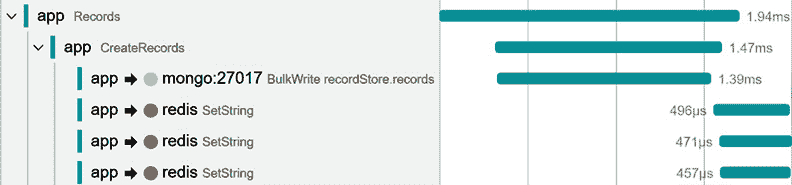
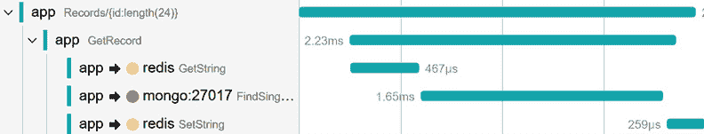
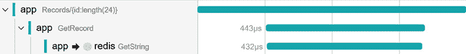
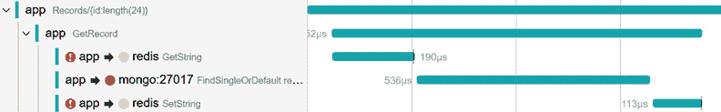
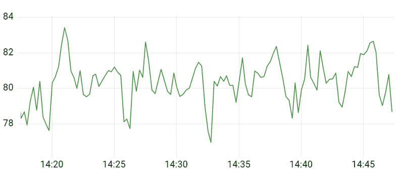
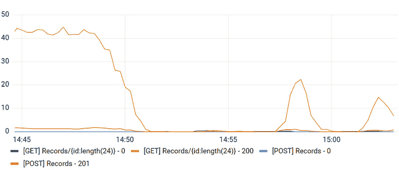
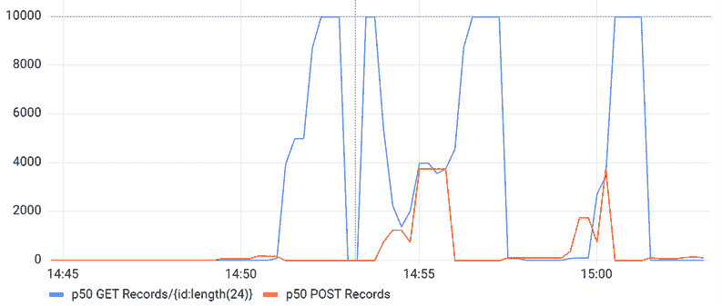
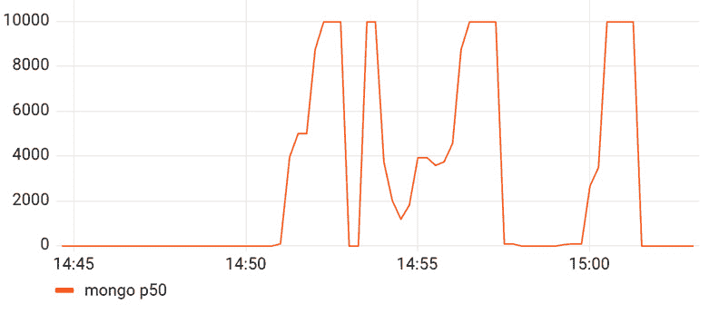
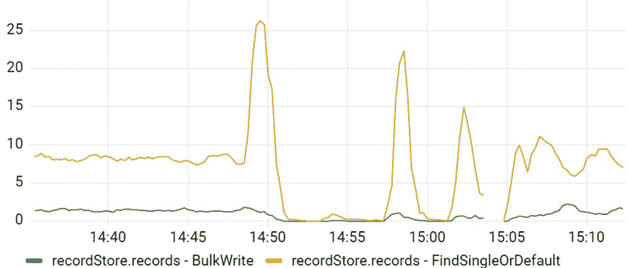
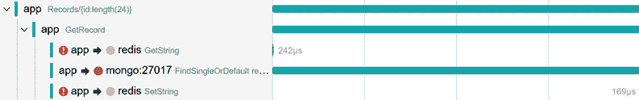

# 仪器化数据库调用

在本章中，我们将继续探索流行分布式模式的仪器化方法，并将探讨数据库仪器化。我们将以 MongoDB 为例，并结合 Redis 缓存。我们将为数据库和缓存调用添加跟踪和指标仪器化，并讨论如何在这些复合场景中添加应用程序上下文和提供可观察性。除了客户端仪器化之外，我们还将看到如何使用 OpenTelemetry Collector 抓取 Redis 服务器指标。最后，我们将探索生成的遥测数据，并了解它是如何帮助分析应用程序性能的。

下面是你将了解的内容：

+   跟踪 MongoDB 操作

+   跟踪 Redis 缓存和逻辑调用

+   添加客户端和服务器端指标

+   使用遥测分析故障和性能

到本章结束时，你将熟悉通用的数据库仪器化，并能够使用数据库或缓存仪器化自己的应用程序并分析其性能。

# 技术要求

本章的代码可在 GitHub 上本书的仓库中找到，网址为[`github.com/PacktPublishing/Modern-Distributed-Tracing-in-.NET/tree/main/chapter12`](https://github.com/PacktPublishing/Modern-Distributed-Tracing-in-.NET/tree/main/chapter12)。

运行示例和执行分析，我们需要以下工具：

+   .NET SDK 7.0 或更高版本

+   Docker 和`docker-compose`

# 仪器化数据库调用

数据库几乎被用于每个分布式应用程序中。许多数据库在服务器端提供高级监控能力，包括数据库特定的指标、日志或昂贵的查询检测和分析工具。客户端仪器化通过提供通信的客户端可观察性、关联数据库操作以及添加应用程序特定的上下文来补充它。

客户端仪器化描述了应用程序与数据库 ORM 系统、驱动程序或客户端库之间的通信，这可能在后台执行负载均衡或批处理操作时相当复杂。

在某些情况下，可能可以跟踪客户端库和数据库集群之间的网络级通信。例如，如果数据库使用 gRPC 或 HTTP 协议，相应的自动仪器化将捕获传输级别的跨度。在这种情况下，我们将看到传输级别的跨度作为由应用程序启动的逻辑数据库操作的子跨度。

在这里，我们将仪器化 MongoDB C#驱动程序的逻辑级别，以展示适用于其他数据库仪器化的原则。

注意

`MongoDB.Driver`的通用仪器化可在`MongoDB.Driver.Core.Extensions.OpenTelemetry` NuGet 包中找到。

在我们开始仪器化之前，让我们了解一下 OpenTelemetry 数据库语义约定。

## OpenTelemetry 数据库语义约定

这些约定可在[`github.com/open-telemetry/opentelemetry-specification/blob/main/specification/trace/semantic_conventions/database.md`](https://github.com/open-telemetry/opentelemetry-specification/blob/main/specification/trace/semantic_conventions/database.md)找到。它们处于实验状态，您访问链接时可能已经发生变化。

约定定义了逻辑和物理调用都适用的属性。在我们的案例中，我们不会对传输层通信进行配置，因此我们只会使用适用于逻辑操作的属性：

+   `db.system`: 这是一个必需的属性，跟踪后端使用它来区分数据库跨度与其他所有跨度。它应与`mongodb`字符串匹配，该字符串是可观察后端可能用于提供数据库或甚至 MongoDB 特定分析和可视化的字符串。

+   `db.connection_string`: 这是一个推荐属性。也建议在提供之前删除凭据。我们不会将其添加到我们的自定义配置中。可能存在一些情况，其中捕获连接字符串（不包含凭据）是有用的，因为它可以帮助检测配置问题，或者我们也可以在启动时记录一次。

+   `db.user`: 这又是另一个推荐属性，用于捕获用户信息，并有助于检测配置和访问问题。由于我们只有一个用户，我们不会捕获它。

+   `db.name`: 这是一个必需的属性，用于定义数据库名称。

+   `db.operation`: 这是一个必需的属性，用于捕获正在执行的操作的名称，该名称应与 MongoDB 命令名称匹配。

+   `db.mongodb.collection`: 这是一个必需的属性，代表 MongoDB 集合名称。

除了数据库特定的属性之外，我们还将使用`net.peer.name`和`net.peer.port`填充 MongoDB 主机信息——通用网络属性。

在逻辑调用上填充网络级属性并不总是可能或有用。例如，当 MongoDB 驱动程序配置了多个主机时，我们不一定知道哪个用于特定的命令。在实践中，我们应该使用在命令级别操作的自动配置，通过`IEventSubscriber`订阅命令事件（如 MongoDB 文档中所述[`mongodb.github.io/mongo-csharp-driver/2.11/reference/driver_core/events`](http://mongodb.github.io/mongo-csharp-driver/2.11/reference/driver_core/events)）。

除了属性之外，语义约定还要求在跨度上使用客户端类型，并提供一个低基数跨度名称，该名称包括操作和数据库名称。我们将使用`{db.operation} {db.name}.{db.mongodb.collection}`模式。

既然我们已经知道在跨度中包含哪些信息，那么我们就继续对 MongoDB 操作进行配置。

## 跟踪实现

在我们的应用程序中，我们在 MongoDB 集合中存储记录，并在自定义的`DatabaseService`类中处理与集合的所有通信。

首先，我们来对读取集合中单个记录的操作进行追踪：

DatabaseService.cs

```cs
using var act = StartMongoActivity(GetOperation);
try {
  var rec = await _records.Find(r => r.Id == id)
    .SingleOrDefaultAsync();
  ...
  return rec;
} catch (Exception ex) {
  act?.SetStatus(ActivityStatusCode.Error,
    ex.GetType().Name);
  ...
}
```

[`github.com/PacktPublishing/Modern-Distributed-Tracing-in-.NET/blob/main/chapter12/database/DatabaseService.cs`](https://github.com/PacktPublishing/Modern-Distributed-Tracing-in-.NET/blob/main/chapter12/database/DatabaseService.cs)

在这里，我们追踪`Find`方法调用。我们使用`GetOperation`常量作为操作名称，它被设置为`FindSingleOrDefault`——一个合成名称，描述了我们在这里所做的事情。如果 MongoDB 命令抛出异常，我们将活动状态设置为`error`。

让我们来看看`StartMongoActivity`方法的具体实现：

DatabaseService.cs

```cs
var act = MongoSource.StartActivity(
    $"{operation} {_dbName}.{_collectionName}",
    ActivityKind.Client);
  if (act?.IsAllDataRequested != true) return act;
  return act.SetTag("db.system", "mongodb")
    .SetTag("db.name", _dbName)
    .SetTag("db.mongodb.collection", _collectionName)
    .SetTag("db.operation", operation)
    .SetTag("net.peer.name", _host)
    .SetTag("net.peer.port", _port);
```

[`github.com/PacktPublishing/Modern-Distributed-Tracing-in-.NET/blob/main/chapter12/database/DatabaseService.cs`](https://github.com/PacktPublishing/Modern-Distributed-Tracing-in-.NET/blob/main/chapter12/database/DatabaseService.cs)

在这里，我们从之前提到的语义约定中填充活动名称、类型和属性。主机、端口、数据库名和集合名称是从配置中提供的 MongoDB 设置以及在构建时捕获的。

对于任何其他操作，可以使用类似的方法。对于批量操作，我们可能需要考虑在数组属性中添加更多上下文来描述单个请求，如下代码片段所示：

DatabaseService.cs

```cs
private static void AddBulkAttributes<T>(
  IEnumerable<WriteModel<T>> requests, Activity? act)
{
  if (act?.IsAllDataRequested == true)
  {
    act.SetTag("db.mongodb.bulk_operations",
      requests.Select(r => r.ModelType).ToArray());
  }
}
```

[`github.com/PacktPublishing/Modern-Distributed-Tracing-in-.NET/blob/main/chapter12/database/DatabaseService.cs`](https://github.com/PacktPublishing/Modern-Distributed-Tracing-in-.NET/blob/main/chapter12/database/DatabaseService.cs)

这种追踪非常通用——即使它知道记录的类型，它也不会记录任何特定于应用程序的内容。例如，我们可以添加一个记录标识符作为属性，或者在找不到记录时将状态设置为`error`。如果你坚持使用专门的手动追踪，这些都是有效的事情，但更常见的是在可能的情况下使用共享的追踪。

那么，我们如何记录与通用数据库追踪一起的应用程序特定上下文呢？一个解决方案是在*第五章*中，*配置*和*控制平面*中我们所做的那样，丰富自动收集的活动。

另一种解决方案是在数据库和缓存调用周围添加另一层逻辑活动。在我们这样做之前，让我们学习如何追踪缓存调用。

# 追踪缓存调用

如 Redis 和 Memcached 之类的缓存是数据库的特殊类别，也受到数据库语义约定的覆盖。根据约定对缓存调用进行追踪是有益的，因为它有助于你在所有服务中保持一致性，并从可视化和分析方面充分利用你的追踪后端。

因此，让我们根据数据库约定来仪表化 Redis 并添加缓存特定上下文。OpenTelemetry 对于缓存没有特别定义，所以让我们设计一些自己的东西。

注意

`StackExchange.Redis` 客户端的自动仪表化功能可在 `OpenTelemetry.Instrumentation.StackExchangeRedis` NuGet 包中找到。

当涉及到跟踪时，我们想知道典型的事情：调用花费了多长时间，是否发生了错误，以及尝试了什么操作。缓存特定的事情包括指示是否从缓存中检索了项目或集合操作的过期策略（如果它是条件性的）。

让我们继续仪表化一个 `Get` 调用 – 它看起来与我们在上一节中看到的数据库仪表化非常相似：

CacheService.cs

```cs
using var act = StartCacheActivity(GetOperationName);
try
{
  var record = await _cache.GetStringAsync(id);
  act?.SetTag("cache.hit", record != null);
  ...
}
catch (Exception ex)
{
  act?.SetStatus(ActivityStatusCode.Error,
    ex.GetType().Name);
  ...
}
```

[`github.com/PacktPublishing/Modern-Distributed-Tracing-in-.NET/blob/main/chapter12/database/CacheService.cs`](https://github.com/PacktPublishing/Modern-Distributed-Tracing-in-.NET/blob/main/chapter12/database/CacheService.cs)

在这里，我们创建了一个活动来跟踪对 Redis 的 `GetString` 调用。如果找到记录，我们将 `cache.hit` 属性设置为 `true`，如果发生异常，我们将活动状态设置为 `error` 并包含异常信息。

让我们看看在 `StartCacheActivity` 方法中设置的属性：

CacheService.cs

```cs
var act = RedisSource.StartActivity(operation,
  ActivityKind.Client);
if (act?.IsAllDataRequested != true) return act;
return act.SetTag("db.operation", operation)
    .SetTag("db.system", "redis")
    .SetTagIfNotNull("db.redis.database_index", _dbIndex)
    .SetTagIfNotNull("net.peer.name", _host)
    .SetTagIfNotNull("net.peer.port", _port)
    .SetTagIfNotNull("net.sock.peer.addr", _address)
    .SetTagIfNotNull("net.sock.family", _networkFamily);
```

[`github.com/PacktPublishing/Modern-Distributed-Tracing-in-.NET/blob/main/chapter12/database/CacheService.cs`](https://github.com/PacktPublishing/Modern-Distributed-Tracing-in-.NET/blob/main/chapter12/database/CacheService.cs)

在这个片段中，我们使用与操作名称匹配的名称启动客户端活动。我们还设置了所有适用的数据库和网络属性，并添加了一个由 OpenTelemetry 定义的 Redis 特定属性 – `db.redis.database_index`。描述主机、端口、IP 地址和网络家族的网络属性是从 Redis 配置选项中填充的。`SetTagIfNotNull` 方法是我们项目中定义的一个扩展方法。

这里，我们与 MongoDB 遇到相同的问题 – Redis 配置选项可能包括多个服务器，而我们不知道哪个服务器将被用于特定的调用。`OpenTelemetry.Instrumentation.StackExchangeRedis` 包中的仪表化（我们在 *第三章*，*.NET 可观察性生态系统）中提供了更精确的信息。

由于与 MongoDB 相同的原因，这种仪表化非常通用 – 在大多数情况下，我们更愿意丰富自动仪表化或添加另一层特定于应用程序的跨度，而不是编写自定义仪表化。所以，让我们看看我们如何通过添加另一层仪表化来添加上下文。

## 仪表化复合调用

由于 MongoDB 和 Redis 调用独立且以通用方式进行了仪器化，因此，考虑到涉及对缓存的调用、对数据库的调用以及随后对缓存的另一个调用，要回答诸如“检索具有特定 ID 的记录需要多长时间？”或“检索需要多长时间？”等问题可能会很困难。

我们没有添加一个记录标识符属性来查询，我们只知道单个调用的持续时间，而这些调用并不能真正描述整体操作。

在以下示例中，我们正在添加一个额外的仪器层，该层使用记录标识符跟踪逻辑操作：

RecordsController.cs

```cs
using var act = Source.StartActivity("GetRecord");
act?.SetTag("app.record.id", id);
try
{
  var recordStr = await _cache.GetRecord(id);
  if (recordStr != null) return recordStr;
  act?.SetTag("cache.hit", false);
  var record = await _database.Get(id);
  if (record != null) return await Cache(record);
}
catch (Exception ex)
{
  act?.SetStatus(ActivityStatusCode.Error,
    ex.GetType().Name);
  throw;
}
act?.SetStatus(ActivityStatusCode.Error, "not found");
```

[`github.com/PacktPublishing/Modern-Distributed-Tracing-in-.NET/blob/main/chapter12/database/Controllers/RecordsController.cs`](https://github.com/PacktPublishing/Modern-Distributed-Tracing-in-.NET/blob/main/chapter12/database/Controllers/RecordsController.cs)

在这里，我们将调用序列包装在`GetRecord`活动内 – 它具有`internal`类型，并且只有两个属性：`app.record.id`（它捕获记录标识符）和`cache.hit`（描述记录是否从数据库中检索）。

当没有找到任何内容时，我们还提供`not found`状态描述，并以相同的方式报告其他已知问题。

在我们的演示应用程序中，包含数据库和缓存的跨度几乎与 ASP.NET Core 中的状态和持续时间相匹配，但在实际应用中，控制器方法会做很多其他事情。包含的操作帮助我们分离所有与记录检索相关的跨度和对数。

既然我们已经了解了如何处理跟踪，让我们来探索指标。

# 添加指标

对于数据库，除了技术特定的东西之外，通常还会监控连接、查询执行次数和持续时间、竞争和资源利用率。MongoDB 集群报告了一系列此类指标，您可以使用 OpenTelemetry Collector（在 https://github.com/open-telemetry/opentelemetry-collector-contrib/tree/main/receiver/mongodbreceiver 查看）接收这些指标。这些指标提供了服务器端的故事。我们还应该添加客户端持续时间指标。这将帮助我们处理连接问题和网络延迟。

OpenTelemetry 语义约定目前仅记录连接指标。我们可以通过实现`IEventSubscriber`接口并监听连接事件来记录它们。

相反，我们将记录基本操作持续时间，这还允许我们推导出吞吐量和故障率，并按操作、数据库或集合名称进行切片和切块。

让我们回到`Get`操作代码，看看如何添加指标。首先，我们将创建一个持续时间直方图：

DatabaseService.cs

```cs
private static readonly Meter MongoMeter = new("MongoDb");
private readonly Histogram<double> _operationDuration;
…
public DatabaseService(IOptions<MongoDbSettings> settings) {
  ...
  _operationDuration = MongoMeter.CreateHistogram<double>(
    "db.operation.duration", "ms",
    "Database call duration");
}
```

[`github.com/PacktPublishing/Modern-Distributed-Tracing-in-.NET/blob/main/chapter12/database/DatabaseService.cs`](https://github.com/PacktPublishing/Modern-Distributed-Tracing-in-.NET/blob/main/chapter12/database/DatabaseService.cs)

现在我们有了直方图，我们可以记录每个操作的持续时间：

DatabaseService.cs

```cs
var start = _operationDuration.Enabled ?
    Stopwatch.StartNew() : null;
using var act = StartMongoActivity(GetOperation);
try
{
  var rec = await _records.Find(r => r.Id == id)
    .SingleOrDefaultAsync();
  TrackDuration(start, GetOperation);
  return rec;
}
catch (Exception ex)
{
  ...
  TrackDuration(start, GetOperation, ex);
  throw;
}
```

[`github.com/PacktPublishing/Modern-Distributed-Tracing-in-.NET/blob/main/chapter12/database/DatabaseService.cs`](https://github.com/PacktPublishing/Modern-Distributed-Tracing-in-.NET/blob/main/chapter12/database/DatabaseService.cs)

在这里，我们调用`TrackDuration`方法并传递一个跟踪持续时间的计时器，低基数操作名称以及一个异常（如果有）。以下是`TrackDuration`方法：

DatabaseStatus.cs

```cs
private void TrackDuration(Stopwatch? start,
  string operation, Exception? ex = null)
{
  if (start == null) return;
  string status = ex?.GetType()?.Name ?? "ok";
  _operationDuration.Record(start.ElapsedMilliseconds,
    new TagList() {
      { "db.name", _dbName },
      { "db.mongodb.collection", _collectionName },
      { "db.system", "mongodb"},
      { "db.operation", operation },
      { "db.mongodb.status", status },
      { "net.peer.name", _host },
      { "net.peer.port", _port }});
}
```

[`github.com/PacktPublishing/Modern-Distributed-Tracing-in-.NET/blob/main/chapter12/database/DatabaseService.cs`](https://github.com/PacktPublishing/Modern-Distributed-Tracing-in-.NET/blob/main/chapter12/database/DatabaseService.cs)

在这里，我们添加了我们用于跟踪的所有属性以及一个新的属性 – `db.mongodb.status`。我们使用异常类型作为状态以确保度量值的基数保持较低。

虽然使用异常类型的想法看起来很有吸引力且简单，但它仅在我们在整个系统中使用相同语言的相同 MongoDB 驱动程序时才有效。即使如此，状态也可能随着驱动程序的更新而随时间变化。在实际的生产场景中，我建议将已知的异常映射到语言无关的状态代码。测试相应的案例并检查是否捕获了适当的错误代码也是有意义的。如果你的警报基于特定的代码，那么这一点很重要。

持续时间直方图以及我们可以在查询时从中导出的度量值涵盖了常见的监控需求（吞吐量、延迟和错误率）。我们还可以用它来进行容量分析和做出更好的设计决策。例如，在数据库前添加缓存之前，我们可以检查读写比例以查看缓存是否有帮助。

通过对跟踪的定制查询，我们还可以估计相同的记录被访问的频率。这将帮助我们选择合适的过期策略。

## 记录 Redis 度量值

除了常见的数据库问题之外，我们还想测量与缓存相关的特定指标：命中率、键过期和驱逐率。这有助于优化和扩展缓存。

这些指标由 Redis 报告，并且可以使用 OpenTelemetry Collector 的 Redis 接收器捕获，该接收器位于 https://github.com/open-telemetry/opentelemetry-collector-contrib/tree/main/receiver/redisreceiver。

我们可以通过以下配置来启用它们：

configs/otel-collector-config.yml

```cs
receivers:
...
  redis:
    endpoint: "redis:6379"
    collection_interval: 5s
...
service:
  pipelines:
    ...
    metrics:
      receivers: [otlp, redis]
...
```

[`github.com/PacktPublishing/Modern-Distributed-Tracing-in-.NET/blob/main/chapter12/configs/otel-collector-config.yml`](https://github.com/PacktPublishing/Modern-Distributed-Tracing-in-.NET/blob/main/chapter12/configs/otel-collector-config.yml)

OpenTelemetry Collector 连接到 Redis 实例并从中抓取可用的指标。Redis 提供多个指标，包括运行时间和资源利用率指标，最重要的是，计数器测量命令速率、命中、未命中、过期、淘汰和平均生存时间。有了这些，我们可以监控 Redis 的健康状态，并查看它是否被有效使用以及瓶颈在哪里。

例如，低命中率到未命中率的比率可能表明我们没有很好地利用缓存，并且可能需要调整缓存参数以提高其效率。首先，我们应该确保缓存是有意义的——通常，当至少有一些项目被读取的频率高于它们被修改的频率时，它是合理的。我们还需要读取之间的间隔相对较低。

如果根据收集的数据，我们决定添加缓存，我们可以通过查看其他缓存指标进一步优化其配置：

+   高键值淘汰率可以告诉我们是否内存不足，键值在读取项目之前被淘汰。我们可能需要垂直或水平扩展 Redis，或者更改淘汰策略以更好地匹配使用模式。例如，如果我们有相对较少的定期访问项目，**最少使用**（**LFU**）策略可能比**最近最少使用**（**LRU**）策略更有效。

+   如果我们看到低淘汰率但高过期率，这可能意味着过期时间太低——项目的读取频率低于预期。我们可以尝试逐渐增加过期时间或禁用它并依赖淘汰策略。

除了服务器端指标外，我们还将添加客户端持续时间直方图。这允许我们使用命令和其他数据库特定维度记录调用持续时间分布。实现几乎与 MongoDB 持续时间指标相同。唯一的区别是我们将向 `GetString` 操作的指标中添加 `cache.hit` 属性。当服务器端指标不可用或存在多个不同的操作，我们希望独立测量其命中率时，这可能很有帮助。

现在我们已经设置了所有数据库跟踪和指标，让我们将所有部件组合起来，看看我们如何在实践中使用这种遥测。

# 分析性能

让我们先使用 `$ docker-compose up --build` 命令运行演示应用程序。它将启动本地 MongoDB 和 Redis 实例以及应用程序和可观察性堆栈。

您可以使用 `curl` 等工具创建一些记录：

```cs
$ curl -X POST http://localhost:5051/records \
  -H "Content-Type: application/json" \
  -d '[{"name":"foo"},{"name":"bar"},{"name":"baz"}]'
```

它应该返回服务创建的记录标识符列表。

现在，让我们查看 `http://localhost:16686` 上的 Jaeger 跟踪，就像 *图 12.1* 中所示的那样：



图 12.1 – 显示批量记录创建的跟踪图

我们看到一个控制器跨度（`Records`）和`CreateRecords`，它描述了一个包括数据库和缓存的操作。它是`BulkWrite`跨度的父级，描述了一个 MongoDB 调用和三个单独的 Redis 跨度——每个记录一个。

注意，由于我们不等待它，控制器和`CreateRecords`跨度在缓存完成之前就结束了。因此，在`SetString`操作中发生的任何事情，尽管父请求已完成，仍然会被正确关联。

如果我们等待大约 10 秒钟并尝试获取其中一条记录（通过调用`http://localhost:5051/records/{id}`），我们会看到如图*图 12.2*所示的跟踪：



图 12.2 – 显示从数据库检索记录的跟踪

如果我们在 10 秒内获取相同的记录，我们会看到它是从缓存中返回的，如图*图 12.3*所示：



图 12.3 – 显示从缓存检索记录的跟踪

通过查看单个跟踪，我们现在可以快速看到记录是从缓存还是从数据库检索的。我们还可以使用`app.record.id`属性找到特定记录的所有跨跟踪操作，或者使用`cache.hit`标志编写即席查询。

现在，让我们通过停止 Redis 容器来模拟一个故障：`$ docker` `stop chapter12-redis-1`。

如果我们再次尝试获取一条记录，应用程序将返回`500 – Internal Server Error`响应。跟踪可预测地显示 Redis 调用失败，并抛出`RedisConnectionException`异常。我们可能想要改变这种行为，如果 Redis 调用失败，则从数据库检索记录。

如果我们这样做，我们会看到类似于*图 12.4*所示的跟踪：



图 12.4 – 显示 Redis 调用失败并回退到数据库的跟踪

在这里，对 Redis 的调用失败了，但整体操作成功了。如果你在`CacheService.cs`的第 63 行取消注释`throw`语句，然后使用`$ docker-compose` `up --build`重新运行应用程序，你可以重现它。

让我们检查在这种情况下度量指标会发生什么。我们可以通过运行以下命令来应用一些负载：`loadgenerator$ dotnet run -c Release --rate 50`。给它几分钟时间稳定下来，然后检查我们应用程序的性能。

让我们首先使用以下查询在 Prometheus 中检查服务吞吐量（在`http://localhost:9090`）：

```cs
sum by (http_route, http_status_code)
  (rate(http_server_duration_milliseconds_count[1m])
)
```

正如我们在*图 12.6*中将要看到的，吞吐量稳定在大约每秒 40-50 个请求——这正是我们在`rate`参数中配置的。

然后，我们可以使用以下查询检查延迟的第 50 百分位数：

```cs
histogram_quantile(0.50,
  sum (rate(http_server_duration_milliseconds_bucket[1m]))
  by (le, http_route, http_method))
```

之后，在*图 12.7*中，我们将看到响应速度非常快——延迟的第 50 百分位数仅为几毫秒。

揭示

如果我们检查延迟的 95 百分位数，我们会发现它要大得多，达到 200-300 毫秒。MongoDB 显示这些延迟峰值是因为容器资源在演示目的下受到限制。

现在我们来检查缓存命中率。我们可以从 Redis 服务器指标或客户端操作持续时间直方图中推导它。以下查询使用后者方法：

```cs
100 *
sum by (net_peer_name) (
  rate(db_operation_duration_milliseconds_count{cache_hit="true",
          db_operation="GetString",
          db_system="redis"}[1m]))
/
sum by (net_peer_name) (
  rate(
      db_operation_duration_milliseconds_count{db_
        operation="GetString",
      db_redis_status="ok",
      db_system="redis"}[1m]))
```

该查询获取 Redis 上`GetString`操作的速率，其中`cache.hit`属性设置为`true`，并将其除以整体`GetString`操作成功率。它还通过乘以比率来计算命中率，该比率约为 80%，正如我们在*图 12.5*中可以看到的：



图 12.5 – GetString 方法的 Redis 命中率

因此，缓存被使用，并且它处理了 80%的读请求。让我们看看如果我们使用`$ docker stop chapter12-redis-1`命令停止它会发生什么。

提示

通过这个练习，你可能会对探索从 Redis 记录异常的效果感兴趣。一旦 Redis 容器停止，每次调用 Redis 都会导致记录一个异常。在我们的小型应用程序中，仅此一项就将遥测量增加了十倍。你可以使用以下 Prometheus 查询自己检查：

```cs
sum by (container_image_name)
  (rate(container_network_io_usage_rx_bytes_total[1m]))
```

在 Redis 容器停止后立即（大约 14:48），应用程序吞吐量开始下降到每秒不到一条记录，如图*图 12.6*所示：



图 12.6 – Redis 容器停止前后应用吞吐量

HTTP 延迟（第 50 百分位数）从几毫秒增加到几秒，正如你在*图 12.7*中可以看到的：



图 12.7 – Redis 容器停止前后应用延迟 50 百分位数

HTTP 延迟的峰值与*图 12.8*中显示的 MongoDB 延迟增加一致：



图 12.8 – 毫秒级的 MongoDB 延迟（p50）

最后，我们应该检查 MongoDB 吞吐量发生了什么：由于 Redis 不再处理 80%的读请求，数据库的负载增加，并且最初它试图赶上，正如你在*图 12.9*中可以看到的：



图 12.9 – 容器停止前后 MongoDB 吞吐量

MongoDB 容器上的资源受到显著限制，无法处理这种负载。

如果我们检查跟踪，我们会看到 MongoDB 调用明显变长，并且是缓慢的应用程序响应和低吞吐量的根本原因。一个这样的跟踪示例显示在*图 12.10*中：



图 12.10 – 当 Redis 停止时显示长时间 MongoDB 请求的跟踪图

如果你现在使用`$ docker start chapter12-redis-1`命令启动 Redis，吞吐量和延迟将在几分钟内恢复到原始值。

我们在知道根本原因的情况下进行了此分析，但它也作为一个通用方法 – 当服务级别指标如延迟和吞吐量发生剧烈变化时，我们应该检查服务依赖项的状态和健康。这里的发现是我们需要更好地保护数据库，例如，通过添加一些更多（可能更小）的 Redis 实例，以便在其中一个实例出现故障时处理负载。我们还可以考虑在服务端对数据库调用进行速率限制，以便即使在较低的吞吐量下也能保持响应。

# 摘要

在本章中，我们探讨了数据库监控。我们首先研究了 OpenTelemetry 数据库语义约定，并为 MongoDB 实现了跟踪。然后，我们添加了类似的监控对 Redis 和包含调用。我们看到了如何在包含跨度上提供特定于应用程序的上下文，并记录数据是从缓存还是数据库检索的，以改善跨跟踪的性能分析。

然后，我们添加了指标，包括 MongoDB 和 Redis 的客户端持续时间直方图以及 Redis 的服务端指标，这些指标有助于分析和优化缓存使用，从命中率开始，我们能够对其进行测量。

最后，我们模拟了 Redis 故障，并看到了如何通过收集遥测数据使检测和分析故障原因以及故障进展变得容易。我们还发现了我们应用程序中的几个问题，使其变得不可靠。

现在你可以开始在你的应用程序中监控数据库调用，或者通过添加额外的跟踪和指标来丰富自动收集的遥测数据。

这标志着我们通过监控配方之旅的结束。在下一章中，我们将讨论采用和演进跟踪和可观察性的组织方面。

# 问题

1.  你会如何监控数据库更改流（数据库暴露的事件流，用于通知数据库记录的变化）？例如，一个应用程序可以订阅云提供商发送的通知，当云存储中的 blob 被创建、更新或删除时（我们可以将其视为数据库）。

1.  记录 Redis 调用为事件/日志而不是跨度是否有意义？

1.  尝试移除 MongoDB 容器的资源限制，并检查如果我们现在杀死 Redis 会发生什么。

# 第四部分：在您的组织中实现分布式跟踪

本部分概述了可观察性采用的社技术方面 – 进行初步推动并进一步改进，在公司内部开发遥测标准，以及在存在遗留服务的情况下监控系统的新的部分。

本部分包含以下章节：

+   *第十三章*, *推动变革*

+   *第十四章*, *创建您自己的约定*

+   *第十五章*, *对现有应用进行配置*
