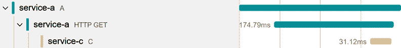

# 第十五章：仪器化棕色地带应用程序

当构建全新的服务和系统时，使用 OpenTelemetry 仪器库很容易实现基本级别的可观察性，包括分布式跟踪、指标和日志。

然而，我们通常不会从头开始创建应用程序——相反，我们演进现有的系统，这些系统包括处于不同生命周期的服务，从实验性的到过于风险而无法更改的遗留服务。

这样的系统通常已经实施了一些监控解决方案，包括自定义的相关格式、遥测模式、日志和指标管理系统、仪表板、警报，以及围绕这些工具的文档和流程。

在本章中，我们将探讨此类异构系统的仪器化选项，这些系统通常被称为**棕色地带**。首先，我们将讨论系统遗留部分的仪器化选项，然后深入探讨上下文传播和与遗留相关格式的互操作性。最后，我们将讨论现有的监控解决方案并研究迁移策略。

你将学习以下内容：

+   为遗留服务选择合理的仪器化级别

+   利用遗留的相关格式或透明地传播上下文，以实现端到端跟踪

+   将遗留服务的前向遥测转发到新的可观察性后端

到本章结束时，你将能够在你自己的棕色地带应用程序中实现分布式跟踪，将系统遗留部分的更改保持在最低限度。

# 技术要求

本章的代码可在 GitHub 上本书的仓库中找到，地址为[`github.com/PacktPublishing/Modern-Distributed-Tracing-in-.NET/tree/main/chapter15`](https://github.com/PacktPublishing/Modern-Distributed-Tracing-in-.NET/tree/main/chapter15)。

要运行本章的示例，我们需要一台装有以下工具的 Windows 机器：

+   .NET SDK 7.0 或更高版本

+   .NET SDK 4.6.2

+   Docker 和`docker-compose`

# 仪器化遗留服务

在软件开发中，单词**遗留**具有负面含义，意味着过时且不吸引人去工作。在本节中，我们将关注不同的方面，并将遗留服务定义为主要成功完成其工作但不再发展的东西。这些服务可能仍然会收到安全更新或针对关键问题的修复，但它们不会获得新功能、重构或优化。

维护此类服务需要不同的技能集和较少的人员，因此特定系统的上下文很容易丢失，尤其是在开发该系统的团队转向其他工作之后。

因此，更改此类组件的风险非常高，即使是在更新运行时或依赖版本时也是如此。任何修改都可能唤醒沉睡的问题，略微改变性能，导致新的竞争条件或死锁。这里的主要问题是，由于资源有限且缺乏上下文，没有人可能知道一个服务是如何工作的，或者如何调查和修复此类问题。也可能不再有适当的测试基础设施来验证更改。

从可观察性的角度来看，此类组件通常已经实施了一定程度的监控，这可能是维护目的的足够。

实际上，当我们在系统可观察性方面工作时，我们只有在系统的新部分至关重要时才会触及旧服务。

让我们看看几个例子，以更好地理解何时更改旧服务很重要，以及我们如何最小化风险。

## 旧服务作为叶节点

假设我们正在使用几个旧服务作为依赖来构建系统的新的部分，如图*图 15.1*所示。1*：


图 15.1 – 新服务依赖于旧服务

为了我们新的可观察性解决方案，我们可能能够将旧系统视为一个黑盒。我们可以跟踪客户端对旧组件的调用并测量客户端延迟和其他统计数据。有时，我们需要了解旧组件内部发生的事情——例如，为了理解客户端问题或绕过旧系统限制。为此，我们可以利用在旧服务中可用的现有日志和监控工具。这可能不太方便，但如果这种情况很少见，它可能是一个合理的选项。

如果旧组件支持任何用于传入请求的相关头，我们可以在客户端填充它们以跨系统的不同部分进行关联。我们将在本章的*传播上下文*部分探讨这一点。

另一件事，我们可能在不更改旧系统的情况下做到的是分叉并将其遥测数据转发到相同的可观察性后端——我们将在*从旧监控工具中整合遥测数据*工具部分更详细地探讨这一点。

能够将新组件和旧组件的遥测数据关联起来并存储在同一位置，可能就足以调试偶尔出现的集成问题。

如果旧系统位于我们的应用程序中间，事情会更有趣——让我们看看原因。

## 中间的旧服务

当我们重构一个分布式系统时，我们可以更新围绕旧组件的下游和上游服务，如图*图 15.2*所示：


图 15.2 – 旧服务-b 位于较新的服务-a 和 service-c 之间

从跟踪方面来看，这里的挑战是历史组件不传播 W3C 跟踪上下文。通过**legacy-service-b**进行的操作被记录为两个跟踪 - 一个由**service-a**启动，另一个由**service-c**启动。

我们需要在系统的较新部分支持历史上下文传播格式，或者更新历史组件本身以启用上下文传播。

在我们深入讨论上下文传播的细节之前，让我们讨论我们应该考虑应用于服务的适当更改水平，这取决于其成熟度。

## 选择合理的仪器水平

为系统的成熟部分找到合适的仪器水平取决于需要多大的更改以及风险有多大。以下是一些需要考虑的事项：

+   历史服务将遥测数据发送到何处？它是我们想要用于较新部分的相同可观察性后端吗？

+   获取历史组件的遥测数据对整个系统的可观察性有多重要？

+   历史服务支持某种上下文传播格式吗？我们能否从新服务中与之交互？

+   我们能否更改一些我们的历史服务？.NET 运行时有多老？我们是否有足够的测试基础设施？这个服务的负载有多大？该组件有多关键？

让我们根据您的回答，探讨一些可能适用的解决方案。

### 不更改历史服务

当系统的历史部分使用特定供应商的 SDK 或代理进行仪器化并向我们想要用于较新部分的相同可观察性后端发送遥测数据时，我们可能不需要做任何事情 - 关联可能默认或在新系统的较新部分中通过一点上下文传播适配器工作。

您的供应商可能有一个迁移计划和相关文档，解释如何使用他们的旧 SDK 和基于 OpenTelemetry 的解决方案，使服务产生一致的遥测数据。

另一个不需要采取任何行动的情况是，当我们的历史组件大部分是隔离的，要么与较新部分并行工作，要么是叶子节点，如图*图 15**.1*所示。在这种情况下，我们通常可以在没有来自历史服务的数据的情况下开发和调试新组件。

我们也可能能够容忍存在损坏的跟踪，特别是如果它们不影响关键流程，并且我们打算很快退役历史服务。

不采取任何行动可能是最好的选择，但如果这对整体可观察性造成问题，下一个可行的选项是通过历史系统传递上下文。

### 仅传播上下文

如果较新部分与历史服务双向通信，而我们无法使跟踪上下文传播工作，这可能会阻止我们通过系统跟踪关键操作。那时我们可以做的最小侵入性更改是透明地通过历史服务传播跟踪上下文。

当此类服务收到请求时，我们会读取 W3C（B3 或另一种格式）中的跟踪上下文，然后将其无修改地传递给所有下游服务。

这样，旧服务将不会出现在跟踪中，但我们将拥有一致的全端到端跟踪。

我们可能可以更进一步，在旧遥测数据上打上跟踪上下文，以简化调试。

如果透明的上下文传播仍然不够，并且我们需要将所有服务的遥测数据集中在一个地方，下一个要考虑的选项是分叉旧遥测数据并将其发送到新的可观察性后端。

### 将旧遥测数据转发到新的可观察性后端

在不同的可观察性后端和日志管理工具之间调试问题可能具有挑战性，即使数据是相关的。

为了改进它，我们可能能够在旧系统前往其后端的过程中拦截遥测数据，或者启用从该后端到系统其他部分使用的新后端的不间断导出。

转发可能需要在旧系统中进行配置更改，即使这些更改很小，仍然存在减缓遥测管道并导致旧服务发生事故的风险。

系统越年轻、越灵活，我们可以考虑的更改就越多，最具侵入性的是将旧系统加入 OpenTelemetry 并启用网络仪器。

### 添加网络级仪器

很可能旧遥测数据与来自新服务的分布式跟踪不一致。我们可能能够转换它，或者有时可以容忍这种差异，但我们也应考虑在旧服务中启用最小化分布式跟踪。这将处理上下文传播，并产生与系统其他部分一致的遥测数据。

采用这种方法，我们将从旧服务向新后端泵送新的遥测数据，并保持所有现有仪器和管道运行，以避免破坏现有的报告、仪表板和警报。

这里需要注意的一点是，OpenTelemetry 在.NET 4.6.2 或更新的.NET 版本上运行。虽然 IIS、经典 ASP.NET 和 OWIN 的仪器在**contrib**存储库（在[`github.com/open-telemetry/opentelemetry-dotnet-contrib`](https://github.com/open-telemetry/opentelemetry-dotnet-contrib)）中可用，但这些仪器并不像新仪器那样受到关注。

当使用 IIS 时，您可能会遇到一些与`Activity.Current`相关的边缘情况——它可能在在托管线程和本地线程之间跳转时丢失。

在保持旧工具运行的同时将现有服务加入 OpenTelemetry，可以是迁移项目的一个第一步，最终将淘汰旧监控解决方案。

这是对任何成熟服务都可行的解决方案，除非该服务已经在退休路径上，否则应该考虑。然而，如果这不是一个选项，我们仍然可以结合并演变这里提到的其他方法。现在让我们看看实际的一面，看看我们如何能实现它。

# 传播上下文

上下文传播的第一个目标是实现新服务的端到端分布式跟踪，即使它们通过遗留系统进行通信，如图*15.2*所示。作为一个挑战目标，我们还可以尝试关联新和遗留部分的数据。

在大多数情况下，该解决方案涉及在遗留服务中启用上下文传播。根据遗留服务的实现方式，这种更改可能是重大且风险较高的。因此，在我们这样做之前，让我们检查是否可以避免它。

## 利用现有的关联格式

我们遗留的服务可能已经传播了上下文，只是格式不同。一种流行的方法是传递一个关联 ID，它具有与 W3C Trace Context 标准中的跟踪 ID 相同的作用，标识一个逻辑的端到端操作。

虽然关联 ID 与跟踪上下文不兼容，但可能可以将一个转换为另一个。

在简单的情况下，关联 ID 只是一个字符串，然后我们只需将其传递到遗留服务的一个头中。然后，我们可以期望它按原样传播到下游调用，如图*15.3*所示：


图 15.3 – 通过遗留关联头传递 W3C 跟踪 ID

在这里，`correlation-id`头与`traceparent`、`correlation-id`一起，忽略未知的`traceparent`，并将其传递给`traceparent`和`correlation-id`值。它只有`correlation-id`，所以它使用它来继续由**service-a**启动的跟踪。

让我们用一个自定义的 OpenTelemetry 上下文传播器来实现它，从注入方面开始，如下面的代码片段所示：

CorrelationIdPropagator.cs

```cs
public override void Inject<T>(PropagationContext context,
  T carrier, Action<T, string, string> setter)
{
  if (context.ActivityContext.IsValid())
setter.Invoke(carrier,
      CorrelationIdHeaderName,
      context.ActivityContext.TraceId.ToString());
}
```

[`github.com/PacktPublishing/Modern-Distributed-Tracing-in-.NET/blob/main/chapter15/Brownfield.OpenTelemetry.Common/CorrelationIdPropagator.cs`](https://github.com/PacktPublishing/Modern-Distributed-Tracing-in-.NET/blob/main/chapter15/Brownfield.OpenTelemetry.Common/CorrelationIdPropagator.cs)

在这里，我们检查活动上下文是否有效，并在`correlation-id`头中将`TraceId`设置为字符串。我们设置这个传播器在 OpenTelemetry 中可用的`TraceContextPropagator`实现之后运行，因此在这里不需要处理跟踪上下文头。

这里是提取代码：

CorrelationIdPropagator.cs

```cs
public override PropagationContext Extract<T>(
  PropagationContext context, T carrier,
  Func<T, string, IEnumerable<string>> getter)
{
  if (context.ActivityContext.IsValid()) return context;
  var correlationIds = getter.Invoke(carrier,
   CorrelationIdHeaderName);
  if (TryGetTraceId(correlationIds, out var traceId))
  {
    var traceContext = new ActivityContext(
      ActivityTraceId.CreateFromString(traceId),
      ActivitySpanId.CreateRandom(),
      ActivityTraceFlags.Recorded,
      isRemote: true);
    return new PropagationContext(traceContext,
     context.Baggage);
  }
  ...
}
```

[`github.com/PacktPublishing/Modern-Distributed-Tracing-in-.NET/blob/main/chapter15/Brownfield.OpenTelemetry.Common/CorrelationIdPropagator.cs`](https://github.com/PacktPublishing/Modern-Distributed-Tracing-in-.NET/blob/main/chapter15/Brownfield.OpenTelemetry.Common/CorrelationIdPropagator.cs)

我们在这里实现的自定义提取在追踪上下文提取之后运行，因此如果传入请求中有一个有效的`traceparent`头，那么在调用`Extract`方法时`context.ActivityContext`就会被填充。在这里，我们优先考虑 W3C 追踪上下文并忽略`correlation-id`值。

如果`context.ActivityContext`没有被填充，我们检索`correlation-id`值并尝试将其转换为追踪 ID。如果我们能这样做，那么我们创建一个新的`ActivityContext`实例，使用`correlation-id`作为追踪 ID 和一个假的父跨度 ID。

这是`TryGetTraceId`方法的实现：

CorrelationIdPropagator.cs

```cs
traceId = correlationId.Replace("-", "");
if (correlationId.Length < 32)
  traceId = correlationId.PadRight(32, '0');
else if (traceId.Length > 32)
  traceId = correlationId.Substring(0, 32);
```

[`github.com/PacktPublishing/Modern-Distributed-Tracing-in-.NET/blob/main/chapter15/Brownfield.OpenTelemetry.Common/CorrelationIdPropagator.cs`](https://github.com/PacktPublishing/Modern-Distributed-Tracing-in-.NET/blob/main/chapter15/Brownfield.OpenTelemetry.Common/CorrelationIdPropagator.cs)

在这个片段中，我们支持多种可能的`correlation-id`格式——如果是 GUID，则删除连字符；如果长度不正确，则填充或修剪它。

注意

在更复杂的情况下，我们可能需要在上下文提取和注入期间进行其他转换。例如，当遗留系统需要一个 GUID 时，我们可以添加连字符。或者，如果它需要一个`base64`编码的字符串，我们可以解码并重新编码追踪 ID。

让我们现在检查我们使用这种方法得到的追踪记录。

首先，使用`$ docker-compose up --build`命令运行系统的新的部分。它从**service-a**、**service-c**和可观察性堆栈开始。

我们还需要启动**legacy-service-b**，这是一个运行在 Windows 上的.NET Framework 4.6.2 应用程序。您可以使用您的 IDE 或以下命令启动它：

```cs
legacy-service-b$ dotnet run --correlation-mode correlation-id
```

然后，在您的浏览器中点击以下 URL：http://localhost:5051/a?to=c。这将向**service-a**发送一个请求，该请求将通过**legacy-service-b**调用**service-c**。

现在，让我们打开 Jaeger，在 http://localhost:16686 上，找到来自**service-a**的追踪，它应该看起来像*图 15.4*中所示的那样：


图 15.4 – 覆盖服务-a 和 service-c 的端到端追踪

如您所见，没有`5050`)属于**legacy-service-b**。

只有一条追踪记录，但它看起来仍然损坏了——跨度是相关的，但是客户端跨度在**service-a**和服务器跨度在**service-c**之间的父子关系丢失了。

尽管如此，这仍然是一个改进。现在，让我们在 `docker-compose.yml` 中的 `Compatibility__SupportLegacyCorrelation` 环境变量上禁用 `correlation-id` 支持，将其在两个服务中都设置为 `false`，然后重启 docker compose 应用程序。然后，我们将看到针对 **service-a** 和 **service-c** 的两个独立跟踪，因此关联也将丢失。

注意

通过依赖现有的上下文传播格式并实现自定义传播适配器，我们通常可以在不修改旧服务的情况下为新服务记录端到端跟踪。

我们是否也可以关联旧服务和新服务的遥测数据？通常，旧服务会在所有日志上盖章其版本的 `correlation-id`。如果是这样，我们可以使用跟踪 ID 在所有遥测数据中搜索，但可能需要将跟踪 ID 映射到关联 ID，然后再映射回来，就像我们处理传播者一样。

然而，如果我们没有在旧服务中实现自定义关联，或者无法实现适配器，该怎么办呢？我们需要修改旧服务以启用上下文传播——让我们看看如何实现。

## 通过旧服务传递上下文

实质上，如果没有现有的上下文传播机制，我们可以实现一个。为了最小化对旧系统的修改，我们可以透明地传播上下文，而不需要显式修改它。

我们需要拦截入站和出站请求以提取和注入跟踪上下文，我们还需要一种在进程内传递上下文的方法。

这种方法的实现，特别是拦截，取决于特定旧服务中使用的科技、库和模式。

入站请求拦截可以通过某些中间件或请求过滤器实现。如果使用 IIS，也可以在自定义 HTTP 遥测模块中完成，但那时由于托管到本地线程的跳跃，我们无法完全依赖环境上下文传播。

在进程内传递上下文通常可以通过 .NET 4.6+ 上的 `AsyncLocal` 或 .NET 4.5 上的 `LogicalCallContext` 实现——这样，它将包含在新代码中，并且不需要显式地处理上下文。

在我们的演示系统中，**legacy-service-b** 是一个自托管的 OWIN 应用程序，我们可以在 OWIN 中间件中实现上下文提取：

PassThroughMiddleware.cs

```cs
private static readonly
  AsyncLocal<IDictionary<string, object>> _currentContext =
    new AsyncLocal<IDictionary<string, object>>();
public static IDictionary<string, object> CurrentContext =>
  _currentContext.Value;
public override async Task Invoke(IOwinContext context)
{
  var tc = EmptyContext;
  if (context.Request.Headers.TryGetValue("traceparent",
    out var traceparent))
  {
    tc = new Dictionary<string, object>
      {{ "traceparent", traceparent[0] }};
    ...
  }
  _currentContext.Value = tc;
  ...
  using (var scope = _logger.BeginScope(tc))
  {
    await Next.Invoke(context);
  }
}
```

[`github.com/PacktPublishing/Modern-Distributed-Tracing-in-.NET/blob/main/chapter15/legacy-service-b/PassThrough/PassThroughMiddleware.cs`](https://github.com/PacktPublishing/Modern-Distributed-Tracing-in-.NET/blob/main/chapter15/legacy-service-b/PassThrough/PassThroughMiddleware.cs)

首先，我们声明一个静态的 `AsyncLocal` 值，它包含跟踪上下文，用简单的字典表示。

在中间件的`Invoke`方法中，我们读取`traceparent`、`tracestate`和`baggage`头（为了简洁起见省略了）。我们在跟踪上下文字典中填充它们。根据您的需求，您始终可以限制支持的上下文字段仅为`traceparent`，并进一步优化代码。

然后，我们在`_currentContext`字段上填充上下文字典，然后我们可以通过公共的`CurrentContext`静态属性访问它。

我们在这里做的最后一件事是调用下一个中间件，我们将它包装在一个包含上下文字典的日志作用域中。这允许我们在来自**legacy-service-b**的所有日志中填充跟踪上下文，从而将它们与来自新服务的遥测数据相关联。

在实践中，遗留应用程序很少使用`ILogger`，但日志库通常有一些其他机制来在日志记录中填充环境上下文。根据库的不同，您可能能够通过稍微修改日志配置代码来访问和填充`CurrentContext`。

回到上下文传播，我们现在需要将`CurrentContext`值注入到发出的请求中。

在 HTTP 的情况下，当使用.NET `HttpClient`时，我们可以通过自定义`DelegatingHandler`实现来完成。如果没有创建它们的辅助方法，且在应用程序代码中广泛使用`WebRequest`时，这将会更加繁琐。

处理器实现如下代码片段所示：

PassThroughHandler.cs

```cs
protected override Task<HttpResponseMessage> SendAsync(
  HttpRequestMessage request, CancellationToken token)
{
  foreach (var kvp in PassThroughMiddleware.CurrentContext)
    request.Headers.Add(kvp.Key, pair.Value?.ToString());
  return base.SendAsync(request, token);
}
```

[`github.com/PacktPublishing/Modern-Distributed-Tracing-in-.NET/blob/main/chapter15/legacy-service-b/PassThrough/PassThroughMiddleware.cs`](https://github.com/PacktPublishing/Modern-Distributed-Tracing-in-.NET/blob/main/chapter15/legacy-service-b/PassThrough/PassThroughMiddleware.cs)

在这里，我们只是将`CurrentContext`中的所有字段注入到发出的请求头中，然后调用下一个处理器。就是这样。

注意

从`System.Diagnostics.DiagnosticSource`包版本 6.0.0 开始，.NET 提供了一个`DistributedContextPropagator`基类以及几个实现，包括 W3C 跟踪上下文和透传传播器。如果您可以添加对新`DiagnosticSource`包的依赖，或者在配置 ASP.NET Core 和`HttpClient`中的原生分布式跟踪工具的传播时，这可能很有用。在我们的遗留服务中，提取和注入本身是微不足道的，因此添加新的依赖并不真正合理。

现在，我们可以再次运行应用程序并检查跟踪：

1.  使用以下命令启动新服务并构建：`$ docker-compose up --build`，然后启动**legacy-service-b**：

    ```cs
    legacy-service-b$ dotnet run --correlation-mode pass-through
    ```

1.  然后再次使用 http://localhost:5051/a?to=c 调用**service-a**并打开 Jaeger。我们应该看到像*Figure 15*.5*中的那样的跟踪：



Figure 15.5 – An end-to-end trace with transparent service-b

在这里，我们有关联和因果关系——**service-a**上的客户端跨度是**service-c**上服务器跨度的直接父级。然而，**service-b**却无处可寻，因为它没有积极参与跟踪。

现在，我们有几种方法可以通过遗留系统传递上下文，但我们可以发挥创意，为我们的应用程序提出更多特定的选项——例如，我们可以在新的遥测中添加遗留相关性或请求 ID，或者记录它们，然后后处理遥测以关联损坏的跟踪。

使用这些选项，我们应该能够实现至少某种程度的关联。现在让我们检查如何将遗留服务中的遥测转发到新的可观察性后端。

# 整合遗留监控工具的遥测数据

一个好的可观察性解决方案可以提供的最大好处之一是在调试应用程序和阅读遥测数据时的低认知负荷。即使关联完美且遥测数据质量高，如果它们分散在多个工具中且无法一起可视化和分析，也非常难以使用。

当使用 OpenTelemetry 重新对遗留服务进行仪器化不是一个选项时，我们应该检查是否有可能将遗留服务中的现有数据转发到新的可观察性后端。

与上下文传播一样，我们可以发挥创意，并应首先利用现有解决方案。例如，旧的.NET 系统通常报告和消费 Windows 性能计数器，并将日志发送到 EventLog，或者将它们存储在硬盘上。

OpenTelemetry Collector 通过接收器提供对这种案例的支持，这些接收器位于 contrib 存储库中（在 https://github.com/open-telemetry/opentelemetry-collector-contrib）。

例如，我们可以使用以下片段配置一个文件接收器：

otel-collector-config.yml

```cs
filelog:
  include: [ /var/log/chapter15*.log ]
  operators:
    - type: json_parser
      timestamp:
        parse_from: attributes.Timestamp
        layout: '%Y-%m-%dT%H:%M:%S.%f'
      severity:
        parse_from: attributes.LogLevel
```

[`github.com/PacktPublishing/Modern-Distributed-Tracing-in-.NET/blob/main/chapter15/configs/otel-collector-config.yml`](https://github.com/PacktPublishing/Modern-Distributed-Tracing-in-.NET/blob/main/chapter15/configs/otel-collector-config.yml)

在这里，我们配置收集器接收器并指定日志文件的位置和名称模式。我们还为日志记录中的单个属性配置映射和转换规则。在这个例子中，我们只映射时间戳和日志级别，但如果日志记录是结构化的，则可以使用类似的运算符解析其他属性。

如果我们很少需要数据，我们也可以依赖我们的后端来解析非结构化日志记录或在查询时解析记录。

这是一个带有解析日志记录的收集器输出的示例，根据您的收集器配置，可以将日志发送到新的可观察性后端：

```cs
Timestamp: 2023-05-27 01:00:41.074 +0000 UTC
SeverityText: Information
…
Attributes:
     -> Scopes: Slice([{"Message":"System.Collections.Generic.Dictionary`2[System.String,System.Object]","traceparent":"00-78987df9861c2d7e46c10bd084570122-53106042475b3e32-01"}])
     -> Category: Str(LegacyServiceB.LoggingHandler)
...
     -> State: Map({"Message":"Request complete. GET http://localhost:5049/c, OK","method":"GET","status":"OK","url":"http://localhost:5049/c","{OriginalFormat}":"Request complete. {method} {url}, {status}"})
Trace ID:
Span ID:
```

如您所见，我们还可以配置接收器解析在日志作用域中填充的`traceparent`值，以记录`Trace ID`和`Span ID`以进行适当的关联。

你可以通过以下命令运行**legacy-service-b**并直接向其发送一些请求，或者通过**service-a**来重现它：

```cs
legacy-service-b $ dotnet run --correlation-mode pass-through > ../
tmp/logs/chapter15.log
```

收集器在边车模式下可以很有帮助，将运行遗产服务实例的机器上的可用数据转发，并收集性能计数器或日志。它还可以假装是我们的旧后端，接收 Zipkin 或 Jaeger 跨度、Prometheus 指标和供应商特定的信号，例如 Splunk 指标和日志。

我们可以编写自定义接收器并利用收集器转换处理器，尽可能产生一致的遥测数据。

除了 OpenTelemetry 收集器可以提供的无限可能性，我们还应该检查我们用于遗产服务的可观察性供应商是否允许对收集的遥测数据进行连续导出，这将使我们能够在不更改遗产系统的情况下获取数据。

# 摘要

在本章中，我们探讨了棕色字段应用程序中的跟踪，其中一些服务可能难以更改，并加入 OpenTelemetry 的完整可观察性解决方案。

我们讨论了此类服务的可能仪器化级别，并发现了一些我们可以完全避免更改旧组件的情况。然后，我们讨论了我们可以应用的变化，从最小化的透明上下文传播开始，一直到最后加入 OpenTelemetry。

最后，我们在实践中应用了一些这些选项，通过遗产服务实现了端到端关联，并将文件日志转发到 OpenTelemetry 收集器。

现在，你应该准备好为你的遗产组件制定策略，并拥有实施它的构建块。

本章结束了我们对.NET 上分布式跟踪和可观察性的探索之旅——希望您喜欢！可观察性领域发展迅速，但现在您已经有了设计和管理具有可观察性意识系统的基本知识，通过依赖相关遥测数据来演进它们，并更有信心地操作它们，了解遥测数据代表什么以及它是如何收集的。现在，是时候应用你的知识或基于它创建新事物了。

# 问题

1.  你将如何处理对现有服务的仪器化，该服务是您系统中大多数用户场景的关键部分？这个服务已经成熟，很少改变，但近期内没有计划将其退役。

1.  当我们将 OpenTelemetry 添加到遗产服务时，可能会出什么问题？

1.  在实现透明上下文传播时，我们能否利用`Activity`类而不是添加我们自己的上下文原语和`AsyncLocal`字段？

# 评估

# 第一章 - 现代应用程序的可观察性需求

1.  您可以将 Span 视为具有严格但可扩展模式的结构化事件，允许您跟踪任何有趣的操作。Span 具有描述它们之间关系的跟踪上下文。它们还有一个名称、开始时间、结束时间、状态和一个属性包，其中包含表示操作详细信息的属性。

复杂和分布式操作需要多个 Span 来描述至少每个传入和传出的请求。一组具有相同`trace-id`的关联 Span 称为跟踪。

1.  Span（在.NET 中也称为活动）由许多库和应用创建。为了启用关联，我们需要在进程内和进程间传播上下文。

在.NET 中，我们使用`Activity.Current`在进程内传播上下文。这是一个与执行上下文同步或异步调用一起流动的当前 Span。每当启动一个新的活动时，它使用`Activity.Current`作为其父项，然后成为当前项。

要在进程间传播跟踪上下文，我们将它通过线路传递给下一个服务。W3C 跟踪上下文是 HTTP 协议的标准传播格式，但某些服务使用 B3 格式。

1.  对于这个问题没有唯一的答案，但以下是一些关于如何利用来自您服务的信号组合的一般考虑：

    +   检查问题是否普遍且影响超过此用户和请求。您的服务整体是否健康？是否特定于用户触发的 API 路径、区域、分区、功能标志或新服务版本？您的可观察性后端可能能够帮助解决这个问题。

    +   如果问题不是普遍的，如果已知，使用跟踪上下文查找有问题的请求，或者通过已知属性进行过滤。如果您在跟踪中看到差距，检索此操作的日志。如果这还不够，使用分析进一步调查。考虑添加更多遥测数据。

    +   对于普遍问题，您可能可以通过识别与报告问题相关的特定属性来找到问题的根本原因。

    +   否则，逐层缩小问题范围。依赖项是否运行正常？上游是否有新情况？负载是否有变化？

    +   如果问题不是特定于任何属性组合，请检查依赖项健康状态和资源利用率。检查崩溃和重启次数、CPU 负载、内存利用率、大量垃圾回收、I/O 和网络瓶颈。

# 第二章 – .NET 的本地监控

1.  在页面上使用`Activity.Current?.Id`。例如，如下所示：`<p>traceparent: <code>@System.Diagnostics.Activity.Current?.Id</code></p>`。

1.  如果我们以 sidecar 的形式运行`dotnet-monitor`，我们可以连接到对应于有问题的服务实例的实例，检查指标和日志，并创建转储。我们甚至可以配置`dotnet-monitor`，使其基于某些事件或资源消耗阈值触发转储收集。

如果我们没有 `dotnet-monitor`，但可以访问服务实例，我们可以在那里安装 `dotnet-monitor` 并从运行进程获取诊断信息。

如果实例运行正常，但问题出在遥测管道内部，则故障排除步骤将取决于我们使用的工具。例如，使用 Jaeger 我们可以检查日志；Prometheus UI 显示与目标的连接性；OpenTelemetry 收集器提供日志和指标以进行自我诊断。

1.  查询：

    ```cs
    sum by (service_name, http_route)
    ```

    ```cs
      (rate(http_server_duration_ms_count[1m]))
    ```

查询汇总了所有运行服务实例的请求速率，按服务名称和 `http_route`（表示 API 路由）进行分组。

速率函数 `(rate(http_server_duration_ms_count)` 首先计算每秒的速率，然后平均一分钟的速率。

1.  使用 Jaeger 的 URL 和方法过滤器搜索跟踪。对于上传，将是 `http.url=http://storage:5050/memes/<name> http.method=PUT`。要查找下载，我们将使用 `http.url=http://storage:5050/memes/<name> http.method=GET`。然而，这并不方便，我们应该考虑将 meme 名称作为所有跨度的一个属性。

# 第三章 – .NET 可观测性生态系统

1.  检查注册表 ([`opentelemetry.io/registry/`](https://opentelemetry.io/registry/)) 和 OpenTelemetry .NET 仓库。如果您在它们中看不到您的库，请在问题和 PR 中搜索。在库的 GitHub 仓库或文档中搜索是否有任何可用的内容也是一个好主意。

当您找到仪器时，有几个方面需要检查：

+   **版本和稳定性**：Beta 测试的仪器可能仍然具有高质量且经过实战检验，但不能保证 API 或遥测的稳定性

+   **性能和线程安全**：理解仪器背后的机制对于提前识别可能的限制和问题很重要

1.  仪器化库和框架最常见的方式是 `ActivitySource`——它是 OpenTelemetry Tracer 的 .NET 等价物，可以启动活动。您可以通过名称配置 OpenTelemetry 以监听源。您也可能看到使用 `DiagnosticSource` 的仪器化——它是在 .NET 中可用的一种较旧且结构较松散的机制。

利用库提供的钩子也很常见，这些钩子可以是全局的，也可以应用于客户端的特定实例。

1.  服务网格可以跟踪服务网格边车之间的请求，并提供关于重试、服务发现或负载均衡的见解。如果它们处理与云服务、远程数据库或队列的通信，它们可以检测相应的通信。服务网格可以从一个应用程序传播上下文到另一个应用程序，但不能在服务内部从传入调用传播到传出调用。

# 第四章 – 使用诊断工具进行低级性能分析

1.  如果您的服务定义了服务级别指标（SLIs），请首先检查它们，看看它们是否在您的服务级别目标（SLOs）定义的边界内。换句话说，检查衡量您用户体验的关键指标，看看它们是否在健康范围内。对于基于 REST API 的服务，通常是通过 API 和其他对您的应用程序重要的事情来分组成功的请求吞吐量和延迟。

资源消耗指标可能与用户体验相关联，但并不决定它。它们（以及描述您服务内部结构的其他指标）可以帮助您了解用户体验为何下降，并可以在一定程度上预测未来的问题。

1.  首先，我们应该尝试找出哪个服务负责：检查上游和下游服务，看看您的服务的负载是否正常并且合理地分布在实例之间。当可能时，使用它们的服务器端指标检查依赖项是否健康。

如果我们可以将问题缩小到特定的服务，我们可以检查问题是否特定于某个实例或一组实例，或者实例是否频繁重启。对于受影响的实例，我们可以检查它们的资源利用率模式，包括内存、CPU、GC 频率、线程、竞争，或任何看起来异常高或低的内容。然后，我们可以从有问题的实例中捕获转储以分析内存和线程栈。

1.  性能追踪（也称为性能分析或简称为追踪）是一种技术，它允许我们捕获关于应用程序行为和代码的详细诊断信息——调用栈、垃圾回收、竞争、网络事件，或.NET 或第三方库想要暴露的任何其他内容。这些事件默认是关闭的，但可以在进程内和进程外启用和控制。例如，`dotnet-trace`、`dotnet-monitor`、PerfView、PerfCollect、JetBrains dotTrace、Visual Studio 和连续性能分析工具可以收集和可视化这些信息。性能追踪可用于调查功能和性能问题或优化您的代码。

# 第五章 - 配置和控制平面

1.  我们需要基于尾部的采样，在跨度或追踪结束后应用，并且我们知道持续时间或是否有任何失败。由于我们拥有分布式多实例应用程序，基于尾部的采样无法在进程内进行，但我们可以使用 OpenTelemetry Collector 中的基于尾部的采样处理器，该处理器缓冲追踪并基于延迟或状态码进行采样。

如果我们只捕获可疑的追踪，我们将不再有基线——我们将无法使用追踪来观察正常系统行为、构建分析等。因此，我们应该额外捕获一定比例或速率的随机追踪——如果我们以某种方式标记它们，我们可以将它们与有问题的追踪分开来创建无偏的分析。

限制所有追踪的速率总是一个好主意，这样我们就不至于因为流量突增而超载遥测管道。

除了在 OpenTelemetry Collector 上进行采样配置之外，我们还应该考虑在单个 .NET 服务上配置概率采样——根据这一点，我们将为 Collector 分配适当数量的资源，并平衡仪表化的性能影响。

1.  让我们使用 OpenTelemetry 的 `http.resend_count` 属性来记录尝试次数，该属性应设置在每个表示重试或重定向的 HTTP span 上。我们可以使用 HTTP 客户端仪表化的 `EnrichWithHttpRequestMessage` 钩子来拦截出站请求及其活动，但我们从哪里获取重试次数呢？

好吧，我们可以在我们的重试处理器中维护它（如果你使用 Polly，你可以使用 `Context` 代替）并通过 `HttpRequestMessage.Options` 将其传递给钩子。所以，最终的解决方案可能看起来像这样：

Program.cs

```cs
AddHttpClientInstrumentation(options =>
{
options.EnrichWithHttpRequestMessage = (act, req) =>
{
if (req.Options.TryGetValue(
new HttpRequestOptionsKey<int>("try"),
out var tryCount) && tryCount > 0)
act.SetTag("http.resend_count", tryCount);
...
}
}
```

[`github.com/PacktPublishing/Modern-Distributed-Tracing-in-.NET/blob/main/chapter5/memes/frontend/Program.cs`](https://github.com/PacktPublishing/Modern-Distributed-Tracing-in-.NET/blob/main/chapter5/memes/frontend/Program.cs)

RetryHandler.cs

```cs
for (int i = 0; i < MaxTryCount; i++)
{
request.Options.Set(new
HttpRequestOptionsKey<int>("try"), i);
try
{
var response = await base.SendAsync(request,
token);
...
}
catch (Exception e) { ... }
await Task.Delay(delays[i]);
}
```

[`github.com/PacktPublishing/Modern-Distributed-Tracing-in-.NET/blob/main/chapter5/memes/frontend/RetryHandler.cs`](https://github.com/PacktPublishing/Modern-Distributed-Tracing-in-.NET/blob/main/chapter5/memes/frontend/RetryHandler.cs)

1.  让我们查看 OpenTelemetry Collector 的基于尾部采样的文档，网址为 https://github.com/open-telemetry/opentelemetry-collector-contrib/blob/main/processor/tailsamplingprocessor/README.md。我们需要声明和配置 `tail_sampling` 处理器并将其添加到管道中。以下是一个示例配置：

otel-collector-config.yml

```cs
processors:
...
tail_sampling:
decision_wait: 2s
expected_new_traces_per_sec: 500
policies:
[{ name: limit-rate,
type: rate_limiting,
rate_limiting: {spans_per_second: 50}}]
service:
pipelines:
traces:
receivers: [otlp]
processors: [tail_sampling, batch]
exporters: [jaeger]
```

[`github.com/PacktPublishing/Modern-Distributed-Tracing-in-.NET/blob/main/chapter5/memes/configs/otel-collector-config.yml`](https://github.com/PacktPublishing/Modern-Distributed-Tracing-in-.NET/blob/main/chapter5/memes/configs/otel-collector-config.yml)

您可以使用 Prometheus 中的 `rate(otelcol_receiver_ accepted_spans[1m])` 查询检查当前记录的 span 的速率，并使用 `rate(otelcol_exporter_sent_spans[1m])` 查询监控导出的速率。

# 第六章 – 跟踪您的代码

1.  在设置 OpenTelemetry 时，您可以通过调用 `TracerProviderBuilder.AddSource` 方法并传递源名称来启用 `ActivitySource`。然后，OpenTelemetry 将创建一个 `ActivityListener` —— 这是一个低级别的 .NET API，它监听 `ActivitySource` 实例。监听器使用 OpenTelemetry 提供的回调来采样活动，并在活动开始或结束时通知 OpenTelemetry。

1.  活动或 span 事件可以用来表示在某个时间点发生的事情，或者太短以至于不能成为 span，并且不需要单独的上下文。同时，事件必须在某些活动的范围内发生，并与其一起记录。活动事件将保留在内存中，直到活动被垃圾回收，并且它们在导出器侧的数量有限。

日志通常比`Activity`事件更好，因为它们不一定与特定的活动、采样或导出器限制相关。OpenTelemetry 将事件和日志视为类似。表示为日志记录的事件是结构化的，并可以遵循特定的语义约定。

1.  当跨度有多个父级或与多个其他跨度同时相关时，链接提供了另一种关联跨度与覆盖场景的方法。没有链接，跨度只能有一个父级和多个子级，并且不能与其他跟踪中的跨度相关。

在消息场景中，链接被用来表示同时接收或处理多个独立消息。当我们处理多个消息时，我们需要从每个消息中提取跟踪上下文并创建一个`ActivityLink`。然后，我们可以将这些链接的集合传递给`ActivitySource.StartActivity`方法。一旦相应的`Activity`开始，我们就不能更改这些链接。可观察性后端以不同的方式支持（或不支持）链接，我们可能需要根据后端能力调整仪器。

# 第七章 – 添加自定义度量

1.  我们首先应该决定我们需要度量做什么。例如，如果我们需要它来对搜索结果中的 meme 进行排名或计算广告点击，我们应该将其与遥测分开。假设我们为了业务逻辑目的将 meme 下载计数器存储在数据库中，我们也可以在计数器更新时将其作为属性标记在跟踪或事件上。

从仅遥测的角度来看，每个 meme 的度量会有很高的基数，因为我们可能系统中有成千上万的 meme，每分钟有数千个活跃的。通过一些额外的逻辑（例如，如果我们能忽略很少访问的 meme），我们甚至可能能够引入一个以 meme 名称作为属性的度量。

我会从跟踪开始，通过丰富的查询按 meme 名称聚合跨度。即使跟踪被采样，我仍然可以计算估计的下载次数，比较不同 meme 之间的差异，并查看趋势。

1.  通常，两者都需要，但这取决于：我们需要传入的 HTTP 请求跟踪来调查个别故障和延迟，并了解在不同条件下正常请求流的样子。我们还需要度量吗？可能需要。在高度缩放的情况下，我们积极采样跟踪，但可能需要比估计计数更精确的数据。另一个问题是，即使我们不采样或不在乎粗略估计，在时间窗口内查询所有跨度可能既昂贵又耗时——可能需要处理数百万条记录。如果我们在这个数据上构建仪表板和警报，我们希望查询既快又便宜。即使它们用于事件期间的临时分析，我们仍然希望查询速度快。

因此，答案取决于可观察性后端，它优化了什么，以及其定价模型，但收集两者为我们提供了一个良好的起点。

1.  对于活动实例的数量，我们可以通过包含实例信息的资源属性来报告 `ObservableUpDownCounter`。计数器将始终报告 `1`，因此在任何给定时间所有实例的值之和将代表活动进程的数量。这就是 Kubernetes 使用 `kube_node_info` 或 `kube_pod_info` 指标（有关更多信息，请参阅[`github.com/kubernetes/kube-state-metrics`](https://github.com/kubernetes/kube-state-metrics)）的方式。

运行时间可以通过多种方式报告——例如，作为一个包含静态启动时间的仪表（参见 `kube_node_created` 或 `kube_pod_start_time`）或作为资源属性。

确保检查您的环境是否已经发出类似的内容，或者 OpenTelemetry 语义约定是否定义了一种报告您感兴趣指标的通用方式。

# 第八章 - 编写结构化和关联日志

1.  代码使用字符串插值而不是语义日志。日志消息立即格式化，因此 `ILogger.Log` 方法在下面被调用，使用 `"hello world: 43, bar"` 字符串，没有任何指示存在两个具有特定名称和值的参数。

如果禁用了 `Information` 级别，字符串插值仍然会发生，序列化所有参数，仅计算要丢弃的消息。

此代码应更改为 `logger.LogInformation("hello world: {foo}, {bar}", 42, "bar")`。

1.  我们需要确保使用不改变的日志记录属性构建使用报告：

    +   当添加新参数或重构代码时，日志消息会有很大变化。

    +   记录分类通常基于命名空间，这可能在重构期间发生变化。我们可以考虑明确以字符串形式传递分类，而不是通用类型参数，但更好的选择是确保报告不依赖于记录分类。我们可以使用事件名称或 ID——它们必须明确指定；我们只需要确保它们是唯一的且不会改变。一种方法是在单独的文件中声明它们，并记录使用报告依赖于它们。

1.  描述 HTTP 请求的跟踪和日志包含类似的信息。日志更详细，因为我们通常会有可读性强的文本，并且需要为单个请求（在请求之前和之后）记录两条记录，带有重复的跟踪上下文和其他范围。

如果你的应用程序记录了所有 HTTP 跟踪，就没有必要启用 HTTP 日志记录。如果跟踪被采样，捕获所有遥测数据的成本与调查罕见问题的能力之间存在权衡。许多应用程序实际上不需要捕获所有遥测数据来有效地调查问题。对于他们来说，收集带有 HTTP 日志的采样跟踪将是最佳选择。如果你必须调查罕见的问题，一个选项是增加跟踪的采样率。记录 HTTP 日志是另一种选择，但这会带来额外的成本来收集、存储、检索和分析日志。

# 第九章 – 最佳实践

1.  HTTP 跟踪，可能结合一些特定于应用程序的属性，可以帮助回答关于小型 RESTful 服务行为的大部分问题。我们可以使用 OpenTelemetry Collector 或后端查询时间从跟踪中聚合指标。尽管如此，我们仍然需要资源利用的指标。这里要问的正确问题是这个解决方案给我们带来了多少成本，以及是否有通过采样降低成本的可能性以及我们必须花费多少来保持基于跟踪查询的警报运行。如果是很多，那么我们应该考虑添加指标。所以，答案是——是的，但添加其他信号可能更经济高效。

1.  在高负载的应用程序中，每个错误都会反复发生。无论我们选择多小的采样率，我们都会记录至少一些此类问题的发生。高采样率可能会对性能产生一些影响，但更重要的是，存储所有这些跟踪数据将非常昂贵。因此，小采样率应该是首选。

1.  套接字通信可能非常频繁，因此为每个请求都添加一个跨度可能会产生巨大的开销。一个好的起点是确定典型会话的持续时间，如果它在秒或分钟内，就可以使用跨度来记录会话。小请求可以通过服务端的指标记录，或者有时通过日志/事件记录。

OpenTelemetry 的一般和 RPC 语义约定应该涵盖表示客户端和服务器以及描述请求所需的必要网络属性。我们还可以应用合适的 RPC 指标来跟踪持续时间和吞吐量。

# 第十章 – 跟踪网络调用

1.  重复使用现有的跟踪工具应该是首选，尤其是如果你在跟踪和 gRPC 堆栈方面没有太多经验。正如你在本章中看到的，与重试、执行顺序和其他难以考虑的微小细节相关的多个细节。

如果现有的跟踪工具不能满足你的需求，自定义 gRPC 跟踪是有意义的。例如，在我们的流实验中，我们可以通过将它们合并为一个来优化两层跟踪（单个消息和 gRPC 调用）。如果我们知道拦截器中的消息类型，我们还可以更好地关联请求、响应和跨度事件。

注意，即使是自定义的监控工具也受益于遵循语义约定并依赖于常见的工具和文档。

1.  在这样的应用程序中，我们应该预期看到一个非常长的跨度，描述客户端和服务器之间的连接。如果我们采样跨度，我们应该定制采样器以确保我们捕获这个跨度。或者，我们也可以简单地丢弃它，转而捕获描述包含连接中发生的任何重要事件的事件。

然后，我们应该考虑如何/是否跟踪单个消息。如果它们非常小且速度快，由于几个担忧，单独跟踪它们可能太昂贵：

+   第一个关注点是消息大小。跟踪上下文可以用二进制格式节俭地传播，但仍然至少需要 26 个字节。你可以发挥创意，提出更节俭的格式，通过在网络上传播消息索引而不是跨度 ID。最简单的解决方案是只为采样进入的消息传播上下文，并依赖于指标和事件来了解整体情况。

+   第二个关注点是性能开销。如果你的处理非常快，跟踪它可能太昂贵了。采样可以帮助抵消一些这些成本，但你可能不需要跟踪单个消息。日志和事件可能提供适当的可观察性，并且你可以将它们与消息标识符相关联。

如果你的消息处理复杂且涉及其他网络调用，你将受益于减轻这些担忧并跟踪单个消息。

# 第十一章 – 监控消息场景

1.  最困难的部分是找到重要的操作来进行测量。在我们的例子中，是模因上传和可供其他用户访问之间的时间。

我们可以发出几个事件来捕获这两个时间戳以及模因标识符和任何其他上下文。然后，我们可以通过在模因标识符上连接事件来找到 delta。

另一个选项是记录模因发布的时间戳以及模因元数据，并在我们的系统中传递。然后，我们可以将 delta 作为指标或事件进行报告。

1.  当使用批处理时，通常想知道批次中的消息数量和有效载荷大小。通过调整这些数字，我们可以减少网络开销，因此，在遥测中随时可用这些信息非常有用。

关键问题是使用哪种监控工具：计数器或直方图（仪表在这里不适用）。

我们可以用两个指标来计数消息和批次。它们之间的比率将给出平均批次大小。

我们还可以记录批次中的消息数量和有效载荷大小作为直方图。这将给我们一个分布，除了平均数之外。

我曾想将批处理大小记录为现有指标的一个属性，但最终决定不这么做。在一般情况下，它是一个高基数属性，在 Prometheus 中可视化也比较困难；作为单独的指标可能更有意义。

1.  行李代表应用程序特定的上下文传播服务。如果你需要跨消息系统传播它，可以使用 OpenTelemetry 传播器将其注入到每个消息中，类似于跟踪上下文。

行李通常不需要流向消息系统，但可能难以防止。附加到每个消息上，它可能在有效载荷大小方面造成显著的开销，所以请确保考虑到这一点，并准备好做出权衡。

在消费端，事情变得更有趣。如果消息是独立处理的，确保在处理消息时从消息中恢复行李信息。

对于批处理，没有单一的答案。从多个消息中合并行李在你的应用程序中可能或可能没有意义。

如果你想在你的遥测信息上标记行李信息，一个选项可能是记录已知行李值在链接属性中，以及与消息特定的信息一起。

# 第十二章 – 仪器化数据库调用

1.  数据库变更流的概念与消息类似，我们可以应用之前章节中使用的相同方法。关键问题是如何传播上下文以及关联更改记录的操作和处理通知。

一个解决方案可能是添加一个记录标识符属性，并使用它来查找与特定记录相关的所有操作。当多个操作同时修改同一记录时，它将生成多个通知，我们无法使用记录 ID 将生产者操作映射到通知处理。可能还有其他通知标识符可以使用，例如记录 ETags。但在一般情况下，关联修改数据的操作和处理相应通知的操作意味着我们必须将跟踪上下文添加到记录中，并在每次操作中对其进行修改。

1.  答案取决于你的追踪后端如何处理事件，以及缓存配置和基础设施的成熟度、健壮性和可靠性。

使用事件的论点如下：

+   与事件相比，跨度/活动有稍微大的性能开销。在遥测量方面，事件也可能更小。

+   我们不需要每个操作的精确 Redis 持续时间，因为我们有逻辑层活动跟踪复合调用和 Redis 指标。

+   单个 Redis 调用的状态并不非常重要：一个设置操作甚至是以火速忘掉的方式完成的。只有当失败率显著增加时，这才有关系，但我们会从指标中看到它。

1.  使用跨度（spans）的论点是，它更常见且方便，因为追踪后端在可视化跨度以及对其执行任何自动化分析方面做得更好。

要移除限制，请从`docker-compose.yml`中的`mongo`容器下删除`deploy`部分。如果你运行应用程序并杀死 Redis，你会看到 MongoDB 可以轻松处理负载和吞吐量变化，这可能意味着在如此小的负载的应用程序中 Redis 不是必需的。

# 第十三章 – 推动变革

1.  使用单个后端处理所有信号有一定的优势。在信号之间导航应该更容易：例如，获取所有与跟踪相关的日志，查询事件和跟踪以及额外的上下文，以及使用示例从指标跳转到跟踪。因此，使用单个后端将减少认知负荷并最小化与后端相关的配置和工具的重复。

使用多个后端可以帮助降低成本。例如，假设你已经为日志和指标设置了所有必要的基础设施，通常可以将日志存储在更便宜的日志管理系统。但是，这些后端并不总是很好地支持跟踪。仅添加用于跟踪和事件的新的后端才真正有意义。

工具如 Grafana 可能能够在不同后端之上提供统一的 UX，以减轻一些不利因素。

1.  我们需要做几件事情：

    +   **锁定上下文传播格式**：使用 W3C Baggage 规范是一个好的默认选择，除非你已经有现成的方案。它应该被文档化，理想情况下，在内部共享库中实现和配置，该库由你的应用程序中的所有服务共享。

    +   **记录关键命名模式**：确保使用命名空间并定义系统的根命名空间。这将有助于过滤其他所有内容。记录几个你想要放入那里的常见属性——我们希望确保人们使用它们，而不是想出一些自定义的东西。添加填充这些属性的辅助方法也会很棒。

    +   **使用通用工件**：如果你想对遥测进行标记、定制传播或只是统一工件键，确保提供具有这些功能的通用内部库。

1.  当添加缓存时，我们可能试图减少数据库的负载并优化服务响应时间。我们应该已经对服务和数据库调用有可观察性，并可以看到缓存是否有所帮助。

如果我们逐步且条件性地推出这个功能，我们需要能够根据功能标志过滤和比较遥测数据，因此我们需要确保它们被记录。

最后，我们应该确保我们围绕缓存有遥测数据，这将帮助我们理解其工作原理，以及为什么它失败时没有工作。在开发、测试和初始迭代期间，添加这些遥测数据以及功能代码将产生最大的积极影响。

# 第十四章 – 创建你自己的约定

1.  一种可能的解决方案是定义和记录属性的稳定性级别。

例如，新约定总是在 alpha 稳定性级别添加。一旦完全实施并部署，并且你对结果大多满意，该约定就可以升级到 beta 版。

约定应该在 beta 版中保持，直到有人尝试使用它们进行警报、报告或仪表板。如果运行良好，或者反馈得到解决后，约定变为稳定。之后，它不能以破坏性的方式更改。

1.  应该能够在某种程度上验证实际的遥测数据。

例如，应该能够编写一个测试处理器（一个进程内处理器或自定义收集器组件），该处理器可以识别应该遵循约定的特定跨度、事件或指标，并检查这些约定是否得到一致的应用。这个测试处理器可以警告发现的问题，标记未知属性，在未收到预期信号时通知，等等。应该能够将其作为 CI 管道中集成测试的一部分运行。

另一种方法是对生产遥测的随机子集进行常规审计，这也可以自动化。

# 第十五章 – 仪器化棕色地带应用程序

1.  这样的服务是迁移到 OpenTelemetry 的良好候选者——因为我们仍在更新它，所以可能有一个合理的测试基础设施和团队内部的环境来防止和减轻故障。作为一个首选方案，我们应该考虑添加带有网络仪器的 OpenTelemetry，然后逐步将现有工具和流程迁移到新的可观察性解决方案，同时发展基于 OpenTelemetry 的方法。

我们可以通过采样来控制这种方法的成本，只将必要的部分移动到 OpenTelemetry。在某个时候，当我们能够依赖新的可观察性解决方案时，我们可以移除相应的旧版报告。

1.  很可能，旧版服务运行的 .NET 运行时版本早于 .NET 4.6.2，那么使用 OpenTelemetry 就是不可能的。即使使用较新的 .NET Framework 版本，添加新的依赖项，如 `System.Diagnostics.DiagnosticSource` 和 OpenTelemetry 带来的不同 `Microsoft.Extensions` 包，也可能由于版本冲突而导致运行时问题。

其他风险来自于应用程序的工作方式和性能中的微小变化和转变，唤醒或放大沉睡的问题，如竞态条件、死锁或线程池饥饿。

1.  如果你可以将 `System.Diagnostics.DiagnosticSource` 的新版本作为依赖项添加，那么使用 `Activity` 就是一个选择。

注意，`Activity` 类从 .NET 的 `DiagnosticSource` 包版本 4.4.0 和 .NET Core 3.0 开始可用；然而，它经历了很多变化。本书中涵盖的大多数功能，包括 W3C 跟踪上下文，在初始版本中都是不可用的。

使用较新的`DiagnosticSource`版本，通过使用`Activity`，我们会修改跟踪上下文——而不是原样传递`traceparent`，我们会创建服务器和客户端跨度，然后将原始`traceparent`的祖先传递给下游服务。如果遗留服务没有向公共可观察性后端报告跨度，我们将看到相关的跟踪信息，但会缺少父子关系，正如我们在*图 15.4*中看到的。

因此，我们需要实现完整的分布式跟踪，或者如果没有跟踪信息被报告，就原样传递上下文，而不使用`Activity`。
