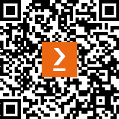

# 前言

本书是一本全面指南，深入探讨了使用最小 API 构建 ASP.NET 的精简和高效 Web 服务的世界。

随着网络开发领域的持续演变，对简洁性、速度和可维护性的需求不断增长。我写这本书是为了向开发者介绍——无论是有经验的还是新接触 ASP.NET 生态系统的——最小 API 的力量，这种方法允许创建轻量级且面向性能的应用程序。

为什么选择最小 API？

随着 2021 年 .NET 6 的发布，微软引入了最小 API 作为一种以更少的仪式和样板代码定义 HTTP API 的新方法。最小 API 专注于减少与较大框架（如 ASP.NET MVC）传统上相关的开销，同时仍然保持 .NET 平台的稳健性。通过去除不必要的复杂性，最小 API 使开发者能够快速原型设计、迭代和部署与需求相匹配的应用程序。

在本书中，我将向您介绍最小 API 的基本要素，从基本的路由和端点结构到高级功能，如依赖注入、身份验证和中间件集成。

我还将向您介绍一些核心设计原则，概述一些旨在保持您的最小 API 随时间保持可维护性、安全性和可扩展性的最佳实践。

每一章都旨在提供动手示例，确保到结束时，您不仅能够理解如何使用最小 API，而且还能理解它们在现代软件开发中的重要性。

在撰写本文时，.NET 9 已经达到了其第一个候选版本阶段（RC1），并且 .NET 9 非常接近全面可用。我在整本书中包含了有关 .NET 9 中新最小 API 功能的信息。

# 本书面向的对象

本书旨在作为最小 API 的入门指南，使对 C# 和 **面向对象编程**（**OOP**）有基本了解的开发者能够探索主要概念，并开始他们的最小 API 开发之旅。

无论您是有经验的 ASP.NET 开发者希望利用新工具，还是寻求了解网络开发的新手，本书都将逐步引导您。它非常适合寻求构建微服务、初创公司原型设计新想法，或者甚至寻求以更有效的方式处理特定 API 需求的成熟企业。

# 本书涵盖的内容

*第一章* ，*使用最小 API 开发入门*，介绍了最小 API 的世界，帮助您了解它们在现代软件开发中的相关性以及它们与传统 API 方法有何不同。它还指导您如何设置其开发环境。

*第二章* ，*创建您的第一个最小 API*，介绍了最小 API 的核心元素，如端点、模型和路由，然后指导您使用不同的 HTTP 方法构建端点。

*第三章* ，*最小 API 的解剖结构*，更详细地探讨了最小 API 的构建块，概述了其中包含的各种组件，以及请求生命周期的概述。

*第四章* ，*处理 HTTP 方法和路由*，重点介绍了如何处理传入的请求以及这如何根据不同的 HTTP 方法而有所不同。它涵盖了路由参数的管理，并介绍了最小 API 端点中的请求验证和错误处理。

*第五章* ，*中间件管道*，解释了 ASP.NET 中中间件的概念，然后指导您如何在最小 API 的上下文中配置和实现它。

*第六章* ，*参数绑定*，讨论了如何将参数发送到最小 API 端点。探讨了各种参数绑定来源，并提供了如何创建自定义绑定的示例。

*第七章* ，*最小 API 中的依赖注入*，在探讨其在最小 API 中的应用之前，介绍了依赖注入作为软件开发概念。还概述了依赖注入的最佳实践。

*第八章* ，*将最小 API 与数据源集成*，帮助您了解如何将数据集成到最小 API 中，示例侧重于 SQL Server 和 MongoDB。

*第九章* ，*使用 Entity Framework Core 和 Dapper 进行对象关系映射*，进一步阐述了第八章的学习要点，介绍了**对象关系映射**（**ORM**）框架，如 Entity Framework Core 和 Dapper。本章提供了相应框架的配置示例以及如何使用它们来创建 CRUD 操作。

*第十章* ，*分析和识别瓶颈*，重点介绍了管理和优化最小 API 的性能。探讨了各种分析工具，并探索了几个常见的性能瓶颈。

*第十一章* ，*利用异步编程实现可扩展性*，展示了在最小 API 中使用异步编程的优势，提供了各种异步模式的示例。本章还提供了与最小 API 中异步执行相关的常见陷阱和挑战的示例。

*第十二章* ，*增强性能的缓存策略*，通过介绍缓存及其在最小 API 中的位置进一步探讨了性能主题。展示了各种缓存技术，例如使用 ASP.NET 的内存缓存和 Redis。

*第十三章* ，*最小 API 弹性的最佳实践*，将我们的注意力从性能转向弹性，提出了在最小 API 中如何结构化代码以鼓励长期功能的方法。还探讨了诸如错误处理和安全考虑等主题。

*第十四章* ，*最小 API 的单元测试、兼容性和部署*，通过涉及最小 API 开发的后期阶段的话题结束本书。展示了使用 xUnit 进行单元测试和集成测试，概述了特定的兼容性要求，并提供了如何将最小 API 部署到各种托管平台的实际示例。

# 要充分利用这本书

您需要具备对面向对象编程语言和 C#的基本理解，才能理解本书中的示例。您还需要了解什么是 API，以及关系型数据库（如 SQL）是如何工作的。

| **本书涵盖的主题** | **所需技能水平** |
| --- | --- |
| C# | .NET 9 SDK（软件开发工具包） |
| SQL | Microsoft SQL Server |
| MongoDB Server | Microsoft SQL Server Management Studio |
| MongoDB Compass | 无 - 书中涵盖了最小 API 的设置和配置 |
| Visual Studio 2022 | 基础 |
| Visual Studio Code | 基础（如果使用 - 可使用 Visual Studio 作为替代） |
| 面向对象编程 | 基础 |

由于.NET 是跨平台的，我们假设您的操作系统是 Windows、MacOS 或 Linux 之一，它们都是兼容的。

**使用 MacOS 或 Linux 的读者**

对于使用这些操作系统的读者，建议使用 Visual Studio Code 作为 Visual Studio 2022 的替代方案。

**如果您正在使用本书的电子版，我们建议您亲自输入代码或从本书的 GitHub 仓库（下一节中提供链接）获取代码。这样做将帮助您避免与代码复制和粘贴相关的任何潜在错误。**

# 下载示例代码文件

您可以从 GitHub（[`github.com/PacktPublishing/Minimal-APIs-in-ASP.NET-9`](https://github.com/PacktPublishing/Minimal-APIs-in-ASP.NET-9)）下载本书的示例代码文件。如果代码有更新，它将在 GitHub 仓库中更新。

我们还有其他丰富的书籍和视频的代码包，可在[`github.com/PacktPublishing/`](https://github.com/PacktPublishing/)找到。查看它们吧！

# 使用的约定

本书使用了多种文本约定。

**文本中的代码**：表示文本中的代码单词、数据库表名、文件夹名、文件名、文件扩展名、路径名、虚拟 URL、用户输入和 Twitter 昵称。以下是一个示例：“在**Employees**表中，我们将**Id**列设置为标识列，这意味着 SQL Server 将在插入任何记录时填充它，每次插入时**Id**值增加**1**。”

代码块设置如下：

```cs
app.MapPut("/employees", (Employee employee) =>
{
    EmployeeManager.Update(employee);
    return Results.Ok();
});
```

任何命令行输入或输出都按照以下方式编写：

```cs
mongodb://localhost:27017/MyCompany
```

**粗体**：表示新术语、重要单词或您在屏幕上看到的单词。例如，菜单或对话框中的单词以**粗体**显示。以下是一个示例：“您可以通过前往**工具** | **管理 NuGet 包** | **包** **管理控制台** 来完成此操作。”

小贴士或重要笔记

看起来像这样。

# 联系我们

我们读者的反馈总是受欢迎的。

**一般反馈**：如果您对本书的任何方面有疑问，请通过电子邮件发送至 customercare@packtpub.com，并在邮件主题中提及书名。

**勘误表**：尽管我们已经尽一切努力确保内容的准确性，但错误仍然可能发生。如果您在这本书中发现了错误，我们将不胜感激，如果您能向我们报告，我们将非常感谢。请访问[www.packtpub.com/support/errata](http://www.packtpub.com/support/errata)并填写表格。

**盗版**：如果您在互联网上以任何形式发现我们作品的非法副本，如果您能提供位置地址或网站名称，我们将不胜感激。请通过电子邮件发送至 copyright@packt.com 并提供材料的链接。

**如果您有兴趣成为作者**：如果您在某个领域有专业知识，并且您有兴趣撰写或为本书做出贡献，请访问[authors.packtpub.com](http://authors.packtpub.com)。

# 分享您的想法

一旦您阅读了*Minimal APIs in ASP.NET 9*，我们很乐意听听您的想法！请[点击此处直接进入本书的亚马逊评论页面](https://packt.link/r/1-805-12912-0)并分享您的反馈。

您的评论对我们和科技社区都非常重要，它将帮助我们确保我们提供高质量的内容。

# 下载本书的免费 PDF 副本

感谢您购买本书！

您喜欢在路上阅读，但无法携带您的印刷书籍到处走？

您的电子书购买是否与您选择的设备不兼容？

请放心，现在每购买一本 Packt 书籍，您都可以免费获得该书的 DRM 免费 PDF 版本。

在任何地方、任何设备上阅读。直接从您最喜欢的技术书籍中搜索、复制和粘贴代码到您的应用程序中。

优惠远不止这些，您还可以获得独家折扣、时事通讯和每日免费内容的每日邮箱访问权限。

按照以下简单步骤获取优惠：

1.  扫描下面的二维码或访问以下链接



[`packt.link/free-ebook/978-1-80512-912-7`](https://packt.link/free-ebook/978-1-80512-912-7)

1.  提交您的购买证明

1.  就这样！我们将直接将您的免费 PDF 和其他福利发送到您的邮箱

# 第一部分 - 最小 API 简介

在这部分，我们为理解最小化 API 打下基础。我们将探讨如何快速开始开发，并检查构成最小 API 的基本构建块。无论您是 API 的新手还是有经验，这部分都将确保您对核心概念有牢固的掌握。

本部分包含以下章节：

+   *第一章* ，*使用最小 API 开发入门*

+   *第二章* ，*创建您的第一个最小 API*

+   *第三章* ，*最小 API 的解剖结构*
