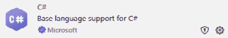

# 使用最小 API 开发快速入门

作为用户，我们将与应用程序的交互与 **用户界面**（**UI**）联系起来。这个界面由允许代码与用户之间交互的交互元素组成。您可以将它想象成 *店面*，一个您可以浏览可用商品或请求适当操作的地方，例如预订假期或添加商品到购物车。

如果 UI 是客户与我们的 *商店* 交互的地方，那么 **应用程序编程接口**（**API**）就是商店的后方。这是我们接收货物、移动商品、处理订单和管理库存的地方。

大多数开发者都有一些与 API 交互或编写 API 的经验，但是什么让 **最小** **API** 与其他 API 不同呢？

微软于 2021 年随着 .NET 6 的发布引入了最小 API。其目的是让开发者能够以最少的样板代码创建 API，从而让他们能够专注于请求和响应之间使用的业务逻辑的精髓。

它们为 API 开发提供了一个轻量级解决方案，这对于项目来说通常是一个好的起点，因为它们设置起来所需的努力要少得多。当您希望快速启动系统或依赖项数量较少时，这是一个关键优势。这也意味着由于与更传统的 API 格式相比减少了开销，最小 API 的性能可能更好。在本章中，我们将学习如何利用最小 API 的这些优势。

在本章中，我们将涵盖以下主要主题：

+   理解最小 API

+   将最小 API 与传统 API 方法进行对比

+   最小 API 在现代开发中的重要性

+   安装所需的工具和依赖项

+   配置开发环境

# 技术要求

要遵循本章中的说明，您需要在您的 Windows、macOS 或 Linux 机器上安装以下内容：

+   .NET 9.0 **软件开发** **工具包**（**SDK**）

+   Visual Studio 或 Visual Studio Code

+   C# 扩展程序用于 Visual Studio Code（如果您正在使用 Visual Studio Code）

如果您在 Windows 上工作，建议您使用 Visual Studio，尽管 Visual Studio Code 仍然可以使用。如果您是 Mac 或 Linux 用户，您应该使用 Visual Studio Code。（在撰写本文时，Visual Studio for Mac 预计将于 2024 年 8 月 31 日退役。）

本章的代码可在 GitHub 仓库中找到：[`github.com/PacktPublishing/Minimal-APIs-in-ASP.NET-9`](https://github.com/PacktPublishing/Minimal-APIs-in-ASP.NET-9)。

# 理解最小 API

当涉及到设计和构建 API 时，我们有各种各样的风格、方法和模板可供选择。多年来，.NET 已经证明了自己是通用 API 开发的绝佳选择。现代.NET 为我们提供了两种主要的 API 框架，一种比另一种更传统。其中一种选择当然是最小 API，与它的前辈基于控制器的 API 相比，在.NET 中这仍然是一个相对较新的功能。

最小 API 的目标是简洁。更少的代码、更少的仪式和更少的复杂性。因此，最小 API 非常适合微服务架构，在这种架构中，你有大量的小型组件，所有这些组件都需要一种在彼此之间传输数据的方式。

它们的简洁性也使得它们更容易阅读，因为一小块代码就可以处理 API 的所有经典功能，例如接收 HTTP 请求、路由、利用依赖项、访问服务和向客户端发送响应。

最小 API 的一个值得称赞的方面是它们降低了 API 开发的门槛。它们提供了一种更易于访问、更易于阅读的代码结构方式，在大多数情况下，由于减少了开销，性能也更好。

使用最小 API，只需四行代码就可以创建一个简单的 API。以下是一个经典的*hello* *world*示例：

```cs
var builder = WebApplication.CreateBuilder(args);
var app = builder.Build();
app.MapGet("/", () => "Hello World!");
app.Run();
```

恭喜！你刚刚创建了一个 API！让我们更深入地了解示例中发生了什么：

+   在第一行，我们通过调用**CreateBuilder**并传递可能需要的任何命令行参数来创建一个**WebApplicationBuilder**的实例。把这看作是我们创建的 API 的蓝图。最小 API 就像任何其他 ASP.NET 核心应用程序一样，因此它需要一个管道来运行。**WebApplicationBuilder**为我们提供了这个管道。

+   然后，我们调用我们创建的这个实例上的**Build()**，这会产生一个我们称为**app**的**WebApplication**实例。这是我们 API。

+   第三行将应用程序根路径上的任何传入 HTTP GET 请求映射：**("/")**。随后，我们使用 lambda 表达式来指示在接收到请求时应执行的逻辑。在这种情况下，我们返回字符串**Hello World!**。

+   最后，第四行启动了应用程序，使其能够监听传入的请求。

现在你已经对最小 API 有了高层次的理解，让我们比较一下它们与更传统的 API 格式。

# 对比最小 API 与传统 API 方法

与最小 API 相比，.NET 中更传统的 API 格式是**基于控制器的 API**。这些在 ASP.NET **模型-视图-控制器**（**MVC**）项目中或 ASP.NET Web API 项目中更为常见。然而，无论你是否在构建 MVC 项目，这两种 API 类型都使用控制器。

控制器只是简单的类，在 API 中有许多职责，如下所示：

+   通过使用各种 HTTP 方法（如 **GET**、**POST**、**PUT**、**DELETE** 和 **PATCH**）的 **actions** 处理传入的请求。

+   处理请求中发送的数据，这些数据通过查询字符串参数或请求体内部发送。

+   通过服务与数据模型交互并处理业务逻辑。

+   生成对调用客户的响应。这些响应可以是 JSON、XML 或许多其他格式。

    将请求路由到应用程序的其他区域，即指向特定 URL 的页面。

当使用基于控制器的 API 时，每个控制器往往专注于一个特定的应用程序域。例如，您可能有一个专门处理所有 *employees* 的控制器，另一个专门处理 *inventory*。这对于将业务逻辑分离到相关区域是很好的，但需要很多仪式，例如需要从基 *controller* 类继承，需要添加属性来定义 HTTP 方法，或者为每个控制器管理文件夹结构。

这里是一个 **Employee** 控制器的示例。注意控制器类型（**[ApiController]**）和路由的属性使用。同时观察类是如何需要从 **ControllerBase** 继承的，以及通过类构造函数进行依赖注入以获取 **IEmployeeRepository**，而这仅适用于 *employees*！我们还需要在为 *inventory* 控制器创建的单独类中再次执行所有这些操作，仪式就这样继续：

```cs
using Microsoft.AspNetCore.Mvc;
using System.Collections.Generic;
namespace EmployeeAPI.Controllers
{
    [ApiController]
    [Route("api/[controller]")]
    public class EmployeesController : ControllerBase
    {
        private readonly IEmployeeRepository
            _employeeRepository;
        public EmployeesController(
            IEmployeeRepository employeeRepository)
        {
            _employeeRepository = employeeRepository;
        }
        [HttpGet]
        public ActionResult<IEnumerable<Employee>>
            GetEmployees()
        {
            var employees =
                _employeeRepository.GetEmployees();
            return Ok(employees);
        }
        [HttpPost]
        public ActionResult<Employee>
            CreateEmployee(Employee employee)
        {
            _employeeRepository.AddEmployee(employee);
            return CreatedAtAction(nameof(GetEmployees),
                new{id = employee.Id }, employee);
        }
    }
}
```

相比之下，你可以在应用程序的入口点直接创建一个最小的 API 端点，其中路由、依赖注入和处理器都定义在内联，就像以下示例中那样：

```cs
public class Program
{
    public static void Main(string[] args)
    {
        var builder = WebApplication.CreateBuilder(args);
        builder.Services.AddSingleton<IEmployeeRepository,
            EmployeeRepository>();
        var app = builder.Build();
        app.MapGet("/api/employees",
            (IEmployeeRepository employeeRepository) =>
        {
            var employees =
                employeeRepository.GetEmployees();
            return Results.Ok(employees);
        });
        app.Run();
    }
}
```

如您所见，在一个更简单、更小的代码块中（并且不需要单独的控制器类），我们已经注册了一个用于依赖注入的服务，添加了一个 HTTP **GET** 端点，注入了我们的服务，运行了所需的逻辑，并返回了结果。

最小 API 与控制器中的依赖注入

我们将在本书的后面部分介绍依赖注入，但重要的是要知道，如示例中所示，依赖注入在基于控制器的 API 中需要更多的配置，因为您通常在 **Startup.cs** 中在应用程序启动时注册您的依赖项。最小 API 允许您以更轻量、更直接的方式在任何需要的地方注入依赖项，而不需要 **Startup.cs**。还重要的是要注意，对于所展示的示例，您需要创建自己的 **IEmployeeRepository** 才能使代码工作。

对最小 API 以及它们与其他开发方法的不同之处有一个整体的理解对于它们的最佳使用至关重要。为了了解更多背景信息，让我们看看最小 API 如何适应现代软件开发的环境。

# 最小 API 在现代开发中的重要性

创建更轻量级和简单的 API 的概念已经存在了一段时间，但最小化 API 的采用率在过去几年中有所增加。Flask 和 Express.js 分别促进了 Python 和 Node.js 中 API 开发的某些最小化元素，但与竞争对手相比，.NET 最近进入市场是专门设计来利用轻量级、简单 API 的优势。

现在，随着最小化 API 的到来并在主流开发项目中得到应用，开发者们正在享受无需进行大量设置和配置的好处。他们可以在两分钟内拥有一个可工作的 API 并运行它，然后在另外两分钟内将其部署到云端。这对于快速将软件推向市场对成功至关重要的行业来说提供了巨大的优势。

此外，您编写的 API 可以利用.NET 成熟的跨平台生态系统，其中包括强大的库和现成的安全解决方案，用于请求验证、**跨站请求伪造**（**CSRF**）保护和授权。

到目前为止，我们已经对最小化 API 及其在现代软件开发中的位置进行了通用的探讨。接下来，我们将开始配置我们的环境以构建最小化 API 项目。与大多数项目设置一样，首先要配置的是工具和依赖项。按照下一节中的步骤开始准备您的开发环境。

# 安装所需工具和依赖项

为了开始使用最小化 API，我们需要安装一些工具。

让我们从安装.NET 9.0 SDK 开始。导航到微软.NET SDK 下载页面[`dotnet.microsoft.com/en-us/download/dotnet`](https://dotnet.microsoft.com/en-us/download/dotnet)。（如果您已经安装了 SDK，可以跳过此步骤。）

在撰写本文时，SDK 可以通过以下步骤获得：

1.  选择适合您操作系统和系统架构的适当构建版本。例如，如果您正在运行 64 位 Windows，您将下载**x64**。同样，如果您正在运行带有 ARM CPU 的 Mac，您将在**macOS**旁边选择**Arm64**。Linux 通常有些不同，因为使用包管理器来获取 SDK。

    如果您是 Linux 用户，请遵循针对您特定 Linux 分发的相关微软文档：


图 1.1：选择正确的安装程序

在我们继续之前，让我们快速区分安装程序和二进制文件。当软件被添加到系统中时，它通常包含多个文件，这些文件包含在程序运行时执行的代码。这些文件是二进制文件：构成整体应用程序的库或代码模块。安装程序会自动将这些组件放置在宿主系统上的相关位置。由于二进制文件由安装程序管理，如果您仅下载二进制文件，它们不会自动放置在特定位置。通常由安装程序执行的配置将不会发生。如果您想以不同于安装程序通常的方式配置应用程序，这有时是必要的。

当您从 Microsoft 的网站下载.NET SDK 时，您通常可以选择下载安装程序或二进制文件。最简单的选项是使用安装程序，因为它会自动为您配置.NET 开发环境。这是本书中示例所使用的版本，我也推荐您使用它。

1.  一旦安装程序下载完成，打开它并按照提示操作。您需要管理员权限来安装 SDK。


图 1.2：.NET SDK 安装程序

现在我们已经安装了 SDK，是时候安装 Visual Studio（在 Windows 上）或 Visual Studio Code（在 macOS 或 Linux 上）了。您可以从 Visual Studio 网站[`visualstudio.microsoft.com/downloads`](https://visualstudio.microsoft.com/downloads)获取这两个应用程序中的任何一个。

.NET 版本

安装后显示的.NET 版本和本例中显示的.NET 版本可能不同。

## 安装 Windows 上的 Visual Studio

按照以下步骤在您的设备上安装 Visual Studio：

1.  在下载页面，选择您想要的 Visual Studio 版本。如果您没有 Visual Studio 许可证，您可以选择**社区版**。

1.  就像使用 SDK 的安装程序一样，只需按照 Visual Studio 向导中的提示操作，将其安装到您的机器上的目标位置。

1.  在设置过程中，您将被提示选择相关的工作负载。至少，您需要选择**ASP.NET 和 Web 开发**以开发最小 API。之后，您将被告知有关可选添加的内容。这些内容对于最小 API 开发并非至关重要，因此一旦您通过了*图 1.3*所示的屏幕，您只需简单地点击**下一步**即可。


图 1.3：安装 Visual Studio 时的工作负载选择

接下来，让我们安装 Visual Studio Code。

## 安装 Mac 和 Linux 上的 Visual Studio Code

Visual Studio Code 是一个免费应用程序。只需下载针对您的目标操作系统的相关安装程序。然后，执行以下操作：

1.  下载完成后，运行安装程序。

1.  打开 Visual Studio Code 并点击左侧工具栏中的 **扩展** 按钮（或使用键盘快捷键，*Ctrl* + *Shift* + *X*）。

1.  在扩展面板顶部的搜索栏中搜索 **C#**。你会看到一个具有相同名称的扩展出现。这是 **Visual Studio Code 的 C# 扩展**，你将需要在 Visual Studio Code 中用 C# 进行编程。点击 **安装**。



图 1.4：Microsoft 为 Visual Studio Code 提供的官方 C# 扩展

现在，你已经安装了编写 .NET 最小 API 所需的所有先决工具。接下来，我们将设置我们的开发环境。

# 配置开发环境

我们将在下一章开始开发我们的第一个最小 API，但在那之前，让我们创建编写代码所需的项目结构。

为了构建最小 API，我们需要在一个 ASP.NET Core 项目中工作。根据你使用的是 Visual Studio 还是 Visual Studio Code，有几种方法可以创建此类项目。

## 在 Visual Studio 中创建一个项目

让我们从在 Visual Studio 中创建一个项目开始：

1.  打开 Visual Studio。

1.  下一个图所示的屏幕为你提供了搜索你希望创建的项目类型的选项。搜索 **ASP.NET Core Empty** 并从列表中选择它，然后点击 **下一步**。（确保你选择模板的 C# 版本。不要使用 F# 版本，因为这不在本书的范围之内。）


图 1.5：Visual Studio 的新项目创建界面

1.  给你的新项目命名并选择一个文件夹位置来保存它。然后，点击 **下一步**。


图 1.6：Visual Studio 中的项目配置（ASP.NET Core Empty）

1.  选择你喜欢的 .NET 版本。本书使用 .NET 9，我们刚刚安装了 .NET 9 SDK，因此从列表中选择此版本。**配置 HTTPS** 应该默认选中。这可以保持选中状态。最后，点击 **创建**。然后你的项目将被创建。

毫无疑问，Visual Studio 是此类项目最常用的 IDE。然而，在较新的 IDE 中创建最小 API 项目也是可能的，例如 Visual Studio Code。让我们探索如何在 Visual Studio Code 中设置相同的项目。

## 在 Visual Studio Code 中创建一个项目

在本节中，我们将创建一个 Visual Studio Code 中的项目：

1.  打开 Visual Studio Code，通过点击 **终端** 然后点击 **新建终端窗口**（或使用键盘快捷键，*Ctrl* + *Shift*）来打开一个终端窗口。

1.  将以下命令输入到终端窗口中，将 **MyProjectName** 替换为你的项目名称：

    ```cs
    dotnet new web -o MyProjectName
    cd MyProjectName
    code -r ../MyProjectName
    ```

1.  当出现对话框询问你是否信任作者并向项目添加所需资产时，选择 **是**。

这两种项目配置都将创建我们在本章早期探索的最小化 API 示例，在 HTTP **GET** 端点上返回 **Hello World!**：

```cs
// A builder is initialized and then built.
var builder = WebApplication.CreateBuilder(args);
var app = builder.Build();
// GET endpoint mapped onto the base URL route, with a
// function body that returns a string.
app.MapGet("/", () => "Hello World!");
//The initialized app is started
app.Run();
```

你现在有了最小化 API 项目的坚实基础。

我们可以通过点击 Visual Studio Code 和 Visual Studio 中的 **播放** 按钮来获取此示例的输出。这将以调试模式运行项目，打开一个浏览器窗口，在这个例子中，它简单地显示 **Hello World!** 。这个按钮的位置根据你使用的 IDE 而略有不同。

在 Visual Studio Code 中，它看起来如下所示：


图 1.7：在 Visual Studio Code 中调试项目

当前的 Visual Studio 中的按钮看起来像 *图 1* *.8* :


图 1.8：在 Visual Studio 中调试项目

让我们回顾一下本章所学的内容！

# 摘要

在本章中，你了解了最小化 API 在现代应用开发中的作用，你现在应该对它们的优点有一个很好的总体理解。

你学习了如何将最小化 API 与基于控制器的 .NET API 区分开来，并了解了这两种格式的优缺点。

你已经安装了基本所需的库和工具，以便开始你的旅程，并学习了如何在 Visual Studio 或 Visual Studio Code 中创建新项目。

本章的关键要点是，最小化 API 促进简单性、高性能和可维护性。

在下一章中，我们将开始编写我们的第一个最小化 API 端点，它将能够处理不同路由上的各种 HTTP 方法。我们将构建最小化响应并发送回客户端，以及调用我们的 API。
