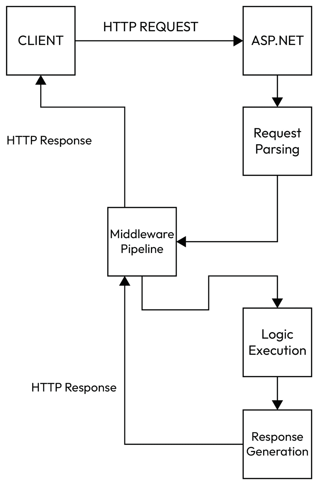

# 3

# 最小化 API 的解剖结构

要了解最小化 API 是如何工作的，了解它们在 ASP.NET 应用程序的上下文中是如何组合起来的是有意义的。在 ASP.NET 项目类型，如**模型-视图-控制器**（**MVC**）和**Web API**中，各种组件被绑定在一起以创建整体应用程序，最小化 API 也不例外。

到本章结束时，你将了解最小化 API 如何在 ASP.NET 生态系统中定位，以及各种组件如何组合起来使其成为可能。

此处的目的是确保你对最小 API 的更广泛背景有更深入的了解，这将指导你在未来的项目中设计和实现它们的方式。

在本章中，我们将涵盖以下主要主题：

+   最小化 API 的解剖结构

+   最小化 API 应用程序的组件

+   API 请求生命周期

让我们进入本章内容！

# 最小化 API 的解剖结构

当提到最小化 API 的*解剖结构*时，我们真正谈论的是拼图中的各个部分，它们组合在一起以启动应用程序。在 ASP.NET Core 之前，启动涉及两个类：**Program.cs**和**Startup.cs**。前者保持在项目的高层次，在调用启动类以向管道添加组件和功能之前设置 HTTP 管道。

ASP.NET Core 主要通过允许在单个文件中配置应用程序来实现这一变化。这简化了过程，为原生支持最小化 API 铺平了道路。因此，在.NET 的最新迭代中，我们现在只需要**Program.cs**来启动 ASP.NET 应用程序。

**Program.cs**创建最小 API 所需的最小操作是构建和运行**WebApplication**实例。此**WebApplication**实例使用另一个名为**WebApplicationBuilder**的类构建。正如你将在下一章的代码示例中看到的那样，**WebApplication**使用**CreateBuilder**方法的形式作为*工厂*来创建一个名为**app**的**WebApplication**实例。你将在前一章的代码示例中看到此代码：

```cs
WebApplicationBuilder builder =
    WebApplication.CreateBuilder(args);
var app = builder.Build();
```

此代码的结果是一个**WebApplication**实例，可以使用**MapGet**和**MapPost**等函数映射端点。

**WebApplication**体现了整体 API，并通过**WebApplicationBuilder**对象使用构建器模式实现来创建。此对象允许在构建**WebApplication**实例时指定配置。例如，可以在通过**WebApplicationBuilder**对象构建**WebApplication**实例时注册服务以进行依赖注入（我们将在*第七章*中学习依赖注入）。 

以下代码展示了这种依赖项的初始设置示例，其中我们使用**AddScoped**在最终使用**builder.Build()**构建应用程序的代码行之前注册**PayrollRunner**类型以进行依赖注入：

```cs
WebApplicationBuilder builder =
    WebApplication.CreateBuilder(args);
builder.Services.AddScoped<PayrollRunner>();
var app = builder.Build();
```

最小 API 在 Visual Studio 中没有自己的专用项目模板。将最小 API 视为 ASP.NET 项目中的一个选项，而不是其自己的项目类型。这样做的原因是，最小 API 通常是另一种项目的一部分，尽管确实常见到只有最小 API 端点的小型 ASP.NET 项目。

默认情况下，ASP.NET 项目创建了一组最小 API 端点。您可以使用 Visual Studio 中的**ASP.NET Core (Empty)**项目模板查看这一点。尽管名称如此，该模板生成的项目会生成一个示例最小 API 端点，正如我们在*第一章*中的*Hello World!*示例中看到的那样。

# 最小 API 应用程序的组件

创建最小 API 项目需要几个组件，其中大部分适用于任何 ASP.NET Web 应用程序。

在顶级上，应用程序由**WebApplication**的一个实例表示。这个类将构成 API 系统的所有部分组合在一起。将其视为应用程序的主体。

位于**WebApplication**内部的组件包括以下内容：

+   **应用程序生命周期**：随着应用程序的运行，将发生各种事件，例如应用程序启动和关闭，以及抛出的异常。**WebApplication**包含几个可以用来处理这些事件的**钩子**。例如，您可以在应用程序启动时执行特定函数或方法，或者在捕获特定异常类型时更改处理这些异常的方式。

+   **服务**：您的 API 无疑会有可重用的方面，这些方面可以用于多个用例和应用程序的不同区域。创建*服务*允许您将这些可重用方面打包成组件，可以通过依赖注入将这些组件传递到 API 的各个部分。例如，您的多个端点可能依赖于从 SQL 数据库检索数据，因此多次编写访问数据库的代码不是好的做法。相反，可以编写一次服务，然后将其注入到任何需要与 SQL 通信的类中。

+   **路由**：我们在上一章中讨论了路由。在最小 API 结构中，路由是一个关键组件；它负责确保根据端点 URL 和使用的 HTTP 方法将流量发送到适当的目的地。

+   **中间件**：在 ASP.NET 中，中间件是一个管道，允许开发者在请求期间通过执行代码来中断 API 流程。中间件管道是由执行任何所需逻辑的组件链组成。常见的中间件用例包括处理或修改请求、验证客户端、缓存和日志记录。中间件可以是一个可重用的组件，可以添加到管道中或自定义代码。

    一旦中间件组件运行完成，管道中的下一个组件就会执行，直到所有组件都完成。这一点特别有用，因为它可以全局应用，运行在所有传入请求上。需要注意的是，管道在请求到来时和响应发送回客户端时都可以运行，区别在于当响应返回客户端时，管道中中间件组件的顺序会被反转。

+   **配置**：大多数应用程序，包括最小的 API，都需要指定配置，通过数据库连接字符串、身份验证令牌、一个标志来指示 API 是否处于开发者模式等等。将这些想象成环境变量。这些变量存储在可访问的位置，以便在整个应用程序的生命周期中使用。例如，如果你有一个 SQL 数据库，你的 API 端点需要与数据交互，它们将需要相关的连接字符串来初始化 SQL 连接。这可以作为任何这些端点的配置设置存储，以便它们在需要时获取。

到目前为止，我们已经从基本层面介绍了 ASP.NET 网络应用程序中的各种组件，包括用于托管最小 API 端点的组件。为了更好地理解最小 API 的结构，了解请求如何通过 ASP.NET API 也很重要。

# API 请求生命周期

API 有一个共同点，无论底层技术如何——客户端和服务器之间的对话。这个对话的生命周期在 *图 3* *.1* 中被可视化。



图 3.1：HTTP 请求的旅程

让我们更详细地探讨这个生命周期。特别是对于 ASP.NET 和因此最小的 API，我们下面概述的步骤是从客户端发起请求到收到响应的点：

1.  **请求被解析** – 在收到请求后，ASP.NET 接收传入的数据并提取关键信息，例如正在使用的 HTTP 方法（GET、POST、PUT 等）。提取 URL，以及请求的头部和正文。

1.  **中间件管道执行** – 链中的中间件被处理，每个中间件组件按照配置对请求进行操作。例如，身份验证中间件可以检查请求发送者是否已认证，自定义中间件可以改变请求的结构，而日志记录中间件可以在它写入到各种数据源的日志中引用请求。

1.  **路由** – 现在应用程序已经解析了请求并通过任何相关的中间件进行处理，它可以匹配提取的 URL 和 HTTP 方法与 API 中配置的路由。这允许将请求的内容路由到适当的端点进行处理。路由只是中间件组件的另一个例子。因此，可以在管道中更改其执行顺序。

1.  **依赖注入** – 一旦请求被路由到正确的请求，依赖注入容器将解析处理请求所需的任何依赖项，并将它们注入到包含端点的组件中，使它们在处理过程中可用。

1.  **请求处理** – 请求现在实际上已经位于**端点内部**，也就是说，它正在由开发者编写在最小 API 端点主体中的逻辑进行处理。传递的参数可以在端点主体中使用以处理所需的逻辑。

1.  **响应生成** – 一旦端点主体中定义的逻辑执行完成（或抛出异常），将生成一个响应。响应包含端点上 HTTP 方法预期的任何数据，例如 JSON 或简单的字符串。它还有一个与处理结果适当的状态码，例如，**200 OK**、**400 Bad Request**或**500 Internal Server Error**。一旦生成，响应将发送回客户端，HTTP 会话结束。

现在我们已经探讨了请求的旅程，让我们回顾一下本章所涵盖的内容。

# 摘要

本章详细介绍了 ASP.NET 用于构建能够托管最小 API 端点的应用程序的不同组件。它解释了如何使用**WebApplicationBuilder**配置**WebApplication**实例。本章还描述了将路由、服务、依赖注入和中间件等元素集成到应用程序中。此外，它强调了应用程序生命周期的重要性以及如何通过钩子管理生命周期事件。本章还讨论了 HTTP 请求从客户端到最小 API 端点以及返回的整个过程。最后，本章概述了将传入请求与适当的逻辑匹配的步骤，以及处理请求以准备客户端响应的过程。

在下一章中，我们将从概念转向实践，提供更高级的 HTTP 请求和路由处理指南。

# 第二部分 - 数据和执行流程

这一部分深入探讨了数据如何在最小 API 中流动的关键方面。您将学习如何处理各种 HTTP 方法、设置路由、自定义中间件管道以及与不同的数据源集成。这些章节涵盖了从依赖注入到使用**对象关系映射**（**ORM**）工具处理数据库的各个方面。

这一部分包含以下章节：

+   *第四章* ，*处理 HTTP 方法和路由*

+   *第五章* ，*中间件管道*

+   *第六章* ，*参数绑定*

+   *第七章* ，*在最小 API 中进行依赖注入*

+   *第八章* ，*将最小 API 与数据源集成*

+   *第九章* ，*使用 Entity Framework Core 和 Dapper 进行对象关系映射*
