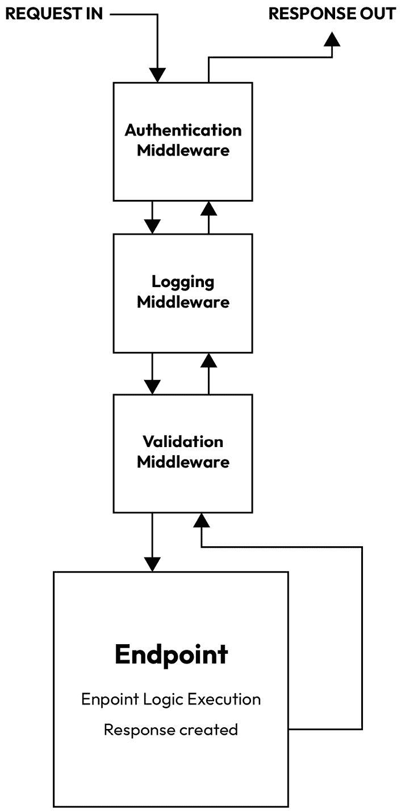
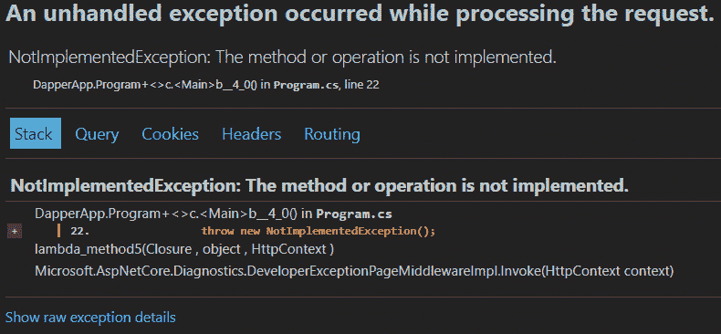

# 中间件管道

API 是一组可以在请求上触发的命令。当收到请求时，我们可以执行针对该请求用例定制的逻辑。然而，请求并不是在收到后立即击中我们的端点。在执行逻辑并将请求最终返回给客户端之前，必须首先遍历一个管道。这个管道被称为中间件管道，它是 ASP.NET 中的一个功能集，允许我们以分离关注点、优化性能和促进重用性的方式扩展我们的 API。

在本章中，我们将探讨以下内容：

+   中间件简介

+   配置中间件管道

+   实现自定义中间件

# 技术要求

鼓励您编写和扩展本章中展示的代码示例，以提高您的实际理解。然而，如果您希望获取源代码，可以从以下 GitHub 链接获取：[`github.com/PacktPublishing/Minimal-APIs-in-ASP.NET-9`](https://github.com/PacktPublishing/Minimal-APIs-in-ASP.NET-9)。

# 中间件简介

**中间件**这一概念是在 ASP.NET Core 中引入到 ASP.NET 的。它取代了使用 HTTP 模块和 HTTP 处理程序的较老 HTTP 管道模型，提供了一种更简单、更灵活的方式来管理 API 处理 HTTP 请求的方式。

如果您将 API 应用程序想象为一个请求在其中传递的管道，那么这个概念就变得更加直接。

中间件是一个组件，它位于请求由端点处理之前的数据管道上。它会在每个请求上执行，并作为序列的一部分，组件按照它们注册的顺序执行。

每个中间件组件都有其作用，能够影响请求，而不管它请求的是哪个端点。例如，中间件可以是内置的，如路由，或者为特定目的编写的自定义中间件，例如日志记录或身份验证，仅举几例。

一旦中间件组件完成了其工作，它将请求传递给管道中的下一个中间件组件，直到所有中间件组件都被遍历。然后请求可以击中包含特定端点代码的端点，该端点具有针对该端点的特定逻辑。

中间件进展

值得注意的是，虽然中间件组件确实以链的形式将请求传递给彼此，但只有在有理由终止请求并返回异常的情况下才会这样做。根据上下文，中间件管道可能会设计成提前结束。

正如您在前几章中看到的，端点必须向其客户端发送某种形式的响应。一旦请求处理完成，端点随后通过中间件管道将响应发送回客户端，在这个过程中，它再次以相反的顺序通过每个中间件组件。

下面是一个示例请求管道的可视化：



图 5.1：一个示例中间件管道流程

中间件不仅是最小 API，而且是 ASP.NET 的一般重要方面，在 Web API 和 MVC 项目中得到广泛应用。它为开发者提供了一种在应用级别注册自定义行为的方式，作为一种将此行为与端点特定逻辑解耦的设计模式。

例如，可能需要捕获每次收到请求时的一些日志。这可能是一条日志，说明资源（如 SQL 数据库）作为请求的一部分被访问，或者是一条错误日志，如果请求本不应该被发起。

将日志代码包含在每个端点中，在它们被编写时，这将是低效的，并且开发者必须记住包含捕获日志消息的逻辑。正如你可以想象的那样，这是不可持续的，并且违反了**不要重复自己**（**DRY**）原则。使用日志中间件组件意味着所需的日志消息将在每次收到请求时被捕获，并且只需要配置一次。

这并不是说中间件组件在执行时*必须*是通用的。它们和其他类或方法一样，可以以**HttpContext**对象的形式访问传入的请求。因此，它们可以像端点一样审查请求，并在到达端点之前执行适用于该请求的任何自定义逻辑。

让我们看看一个作为类创建的中间件组件的基本示例。该组件在调用序列中的下一个组件之前简单地写入控制台：

```cs
public class MySuperSimpleMiddlewareClass
{
    private readonly RequestDelegate _next;
    public MySuperSimpleMiddlewareClass(
        RequestDelegate next)
    {
        _next = next;
    }
    public async Task InvokeAsync(HttpContext context)
    {
        Console.WriteLine(
            "Request handled by middleware component");
        await _next(context);
        Console.WriteLine(
            "Response handled by middleware component");
    }
}
```

当类被实例化时，这个中间件类有一个构造函数，它接收一个**RequestDelegate**类型的对象。这个委托代表了管道中的下一个中间件组件。可以使用**_next()**委托来调用下一个中间件组件并继续序列。

理解管道如何在每个组件之间传递控制流是至关重要的，但如果我们不知道如何构建自己的组件，那么这就没有意义。现在，我们将继续探讨如何在您的管道中创建和配置中间件。

# 配置中间件管道

根据其目的，您可以用不同的方式来构建中间件组件。前面的例子展示了使用类创建一个简单的中间件组件。在查看其他构建和注册中间件的方法之前，让我们更详细地探讨这种类型的组件。

## 中间件类

中间件类需要有一个**Invoke**或**InvokeAsync**方法，以便在轮到它们时被触发。注意，在前一节中我们看到的示例中，有一个名为**_next()**的方法，传递了与同一方法接收到的相同的**HttpContext**对象。这就是中间件组件调用管道中下一个组件的地方。

一旦创建了中间件组件，就需要将其添加到管道中。在最小化 API 中，API 的设置发生在**Program.cs**文件中，创建**WebApplication**对象。

记得在之前的章节中，当我们创建了一个名为**app**的**WebApplication**实例吗？这个**app**对象有一个名为**UseMiddleware<T>()**的方法。这允许我们告诉**WebApplication**对象它应该使用特定类型的中间件组件。如果我们想将我们的**MySuperSimpleMiddleware**类注册为中间件，我们会在使用**app.Run()**启动**WebApplication**对象之前完成它：

```cs
WebApplicationBuilder builder =
    WebApplication.CreateBuilder(args);
var app = builder.Build();
app.UseMiddleware<MySuperSimpleMiddlewareClass>();
app.Run();
```

现在中间件已经被添加到我们的**WebApplication**对象中，它将在管道中被调用。

在类中编写中间件有其优点和缺点。一方面，使用类来保持中间件的整洁并使其与**WebApplication**对象解耦可能是有意义的。你也可能想使用工厂设计模式来生成和注册适当的中间件类。另一方面，使用类可能过于复杂。毕竟，我们正在构建*最小化 API*，在这种情况下，大多数时候保持逻辑简单是有利的。

在简约主义的精神下，存在一种替代中间件类的形式，即内联中间件。

## 内联中间件

这比使用类简单得多。当内联创建中间件时，我们将在一个代码块中创建并注册组件到我们的**WebApplication**对象。再次考虑到我们的**WebApplication**实例称为**app**，我们仍然会传递一个**HTTPContext**对象和一个**RequestDelegate**对象，但与构造函数、私有字段和**InvokeAsync()**方法不同，所有操作都将发生在端点的主体内部。

让我们看看如何将**MySuperSimpleMiddlewareClass**重写为内联中间件组件：

```cs
app.Use(async (context, next) =>
{
    Console.WriteLine(
        "Request handled by inline middleware component");
    await next(context);
    Console.WriteLine(
        "Response handled by inline middleware component");
});
```

在这个例子中，我们添加了**app.UseMiddleware<MySuperSimpleMiddlewareClass>()**，并用更通用的**app.Use()**代替。现在，我们不再指定类型，而是传递一个异步匿名函数，该函数将被注册到管道中。示例中展示的 lambda 表达式的主体相当于在**MySuperSimpleMiddlewareClass**中找到的**InvokeAsync()**方法。

就像之前一样，我们在传入的请求上写入控制台消息，然后调用**RequestDelegate**对象，该对象将传递给下一个组件。然后我们又有另一个控制台消息，它将在请求响应作为它通过管道返回客户端的过程中执行。

注册中间件的内联之美在于它与创建的端点的连贯性。如果你以这种方式注册小的中间件组件，在将它们映射到**WebApplication**对象之前构建端点，你的项目确实会是最小化 API 设计所期望的那样。

我们在上一节中介绍了配置管道的基本知识，但有一些陷阱你应该注意，以确保你能从中获得中间件的好处。

### 维护顺序

正如我们在本章的第一部分所讨论的，中间件作为请求在客户端和服务器之间传递的管道中的组件序列而存在。

这些组件的序列是线性的，这意味着各个组件执行顺序至关重要，这取决于它们各自的目标。

执行顺序由组件注册的顺序决定，以及它们是如何注册的——即基于类或内联中间件。

这些组件中的每一个都可以在管道中对请求和响应进行修改。正如你可以想象的那样，如果不小心谨慎，这会很容易产生意外的结果。例如，作为你的管道的一部分，你可能需要向有效载荷中添加一个字段。这是可以的，但如果管道中还有其他引用该新字段的中间件组件，你就已经在组件之间创建了一个依赖关系。

如果引用新字段的组件在创建它的组件之前注册，管道将遇到异常，因为尚未存在的属性已被引用。

因此，在编写中间件时，验证请求是否按正确的顺序击中每个组件是至关重要的。

前往运行包含这些中间件示例的项目。你将在从窗口左下角可访问的**输出**选项卡中看到的日志中看到中间件执行的顺序。

### 默认中间件

根据配置方式，ASP.NET 会自动为最小 API 项目注册内置的中间件组件。

如果托管环境设置为**开发**，将注册**UseDeveloperExceptionPage**中间件。该组件在发生错误响应时显示一个页面，这对于调试非常有用。

我们在上一章中依赖并使用的路由本身就是一个中间件。如果存在端点，ASP.NET 会自动添加它。如果你手动添加了 **UseRouting()**，ASP.NET 不会自动添加它。

在 **UseRouting** 之后，如果服务提供程序中检测到 **IAuthenticationSchemeProvider**，ASP.NET 也会添加 **UseAuthentication**。与 **UseRouting** 类似，如果你手动添加组件，ASP.NET 将跳过添加 **UseAuthentication**。对于与 **IAuthorizationSchemeProvider** 一起使用的 **UseAuthorization()** 也是如此。大多数默认中间件除非需要覆盖它，否则通常不会被开发者注意到。

现在我们已经探讨了中间件作为一个概念，我们应该继续讨论如何通过编写我们自己的自定义中间件来扩展最小 API。 

# 实现自定义中间件

自定义中间件是指你自己编写的或不是由 ASP.NET 注册的默认中间件组件之一。

自定义中间件为我们提供了很多灵活性，使我们能够在请求端点之外扩展 API 的功能。

自定义中间件的几个示例可能如下：

+   **日志中间件**：在接收到请求时捕获事件并存储日志

+   **错误处理中间件**：在管道中有特定的错误处理方式

+   **验证中间件**：检查数据在接收或响应时是否处于特定状态。

+   **请求计时中间件**：记录请求的耗时，用于监控和遥测

+   **IP 阻止中间件**：检查请求的远程主机的 IP 地址，并检查它是否在禁止列表中

让我们以日志为例编写一些自定义中间件。在这个例子中，我们将通过将中间件编写为内联中间件组件来保持简单和最小化。

打开 **Program.cs** 文件，首先创建一个新的空白中间件组件；也就是说，创建一个接收一个 **HttpContext** 对象和一个 **RequestDelegate** 对象的 **Use()** 方法，并在伴随的 lambda 表达式的主体中不添加任何内容：

```cs
app.Use(async (context, next) =>
{
});
```

现在我们有一个简单的中间件组件的空白画布，我们可以添加一些逻辑来记录一些内容。在这个例子中，我们将记录内容到控制台。

问题是，我们想要记录**什么**？

将请求作为 **HttpContext** 实例传递到组件中的好处是，我们可以通过此对象访问请求的各个属性。这意味着我们可以访问目标 HTTP 方法、目标路由等。

让我们先记录一些从请求接收到的内容，然后再将控制流传递到管道中的下一个组件。为此，更新 lambda 表达式的主体，使其反映这里更新的示例：

```cs
app.Use(async (context, next) =>
{
    Console.WriteLine(
        $"Request: {context.Request.Method}
        {context.Request.Path}");
    await next(context);
});
```

现在中间件正在访问请求中的数据，并使用字符串插值，将数据排列成一个可以记录到控制台的字符串。这使得我们的 API 具有可审计性（易于跟踪和审查历史事件）并且更容易维护。除此之外，因为我们使用了自定义中间件，所以我们不需要为每个创建的端点重复编写相同的日志。

记住，管道上的中间件组件不仅为传入的请求执行。出站响应也会在返回客户端的过程中反向遍历中间件管道。

如果我们想在响应通过管道返回时将其内容记录到控制台，我们可以在调用 **next()** 下方简单地添加另一个 **Console.WriteLine()** 语句。**HttpContex** t 对象的 **Response** 成员应为我们提供最新的出站响应数据，我们可以将其记录，如下例所示：

```cs
app.Use(async (context, next) =>
{
    Console.WriteLine(
        $"Request: {context.Request.Method}
        {context.Request.Path}");
    await next(context);
    Console.WriteLine(
        $"Response: {context.Response.StatusCode}");
});
```

作为提醒，这是一个内联中间件组件，意味着它是使用 **Program.cs** 中的 lambda 表达式创建的。为了保持一致性，以下是如何以类的方式编写相同的中间件组件的示例：

```cs
public class LoggingMiddleware
{
    private readonly RequestDelegate _next;
    public LoggingMiddleware(RequestDelegate next)
    {
        _next = next;
    }
    public async Task InvokeAsync(HttpContext context)
    {
        Console.WriteLine(
            $"Request: {context.Request.Method}
            {context.Request.Path}");
        await _next(context);
        Console.WriteLine(
            $"Response: {context.Response.StatusCode}");
    }
}
```

在注册基于类的中间件后，**Program** 类将呈现如下：

```cs
var builder = WebApplication.CreateBuilder(args);
var app = builder.Build();
app.UseMiddleware<LoggingMiddleware>();
app.MapGet("/", () => "Hello World!");
app.Run();
```

记录是中间件在路由之前采取行动的简单示例。对于更复杂的使用案例，可能需要**短路**管道。这将阻止管道中的其他组件执行，可以通过省略对 **RequestDelegate** 对象的调用轻松实现。

短路操作足够简单，但如果我们的中间件具有复杂的程度，意味着它可能需要阻止路由发生，那会怎样？这意味着中间件会阻止请求到达目标端点，或者任何端点。

要进一步理解这个概念，我们需要查看一种名为**终端中间件**的中间件组件样式。

## 终端中间件

本章中我们使用过的经典中间件组件都有一个共同点——在管道中通过它们的请求最终会到达一个端点，然后端点将处理将请求发送回管道到客户端。

然而，有些情况下我们不想让请求到达端点。例如，如果我们实现了一个禁止 IP 列表，其中列出了恶意或可疑主机的 IP 地址，我们希望通过中间件实现以下目标：

1.  识别发送请求的远程主机的 IP 地址

1.  确定 IP 地址是否在禁止 IP 列表中

1.  如果是禁止的 IP 地址，从中间件向客户端发送响应，表明主机被禁止进一步操作

让我们编写自己的中间件组件，该组件检查传入的 IP 地址，并在需要时阻止请求进一步进行。

首先，创建一个中间件类的**scaffold**：

```cs
public class IPBlockingMiddleware
{
    private readonly RequestDelegate _next;
    public IPBlockingMiddleware(RequestDelegate next,
        IEnumerable<string> blockedIPs)
    {
        _next = next;
    }
    public async Task InvokeAsync(HttpContext context)
    {
        await _next(context);
    }
}
```

目前，我们的中间件除了简单地传递控制权给管道中的下一个组件外，不做任何事情。

回顾我们 IP 阻止中间件的三个目标，第一个目标是识别请求主机的 IP 地址。此信息可以从**HttpContext**对象中检索，如下所示：

```cs
var requestIP =
    context.Connection.RemoteIpAddress?.ToString();
```

接下来，我们需要确定请求的 IP 地址是否为被禁止的 IP。为此，我们需要添加一个集合来存储禁止列表，然后对传入的 IP 地址进行检查。

在**RequestDelegate**字段下添加一个私有的**HashSet<string>**字段。我们将使用这个作为我们的禁止列表：

```cs
private readonly HashSet<string> _blockedIPs;
```

此列表可以在通过其构造函数注册时传递给中间件。

更新构造函数以反映这一点：

```cs
public IPBlockingMiddleware(RequestDelegate next,
    IEnumerable<string> blockedIPs)
    {
        _next = next;
        _blockedIPs = new HashSet<string>(blockedIPs);
    }
```

现在剩下的只是对违规请求采取行动。我们可以通过**HttpContext**对象将消息写入客户端的响应。在这里，我们可以包括一条消息通知客户端他们的 IP 地址已被阻止。在此之后，我们可以使用**return**语句来阻止请求继续进行：

```cs
public async Task InvokeAsync(HttpContext context)
    {
        var requestIP =
            context.Connection.RemoteIpAddress?.ToString();
        if (_blockedIPs.Contains(requestIP))
        {
            context.Response.StatusCode = 403;
            Console.WriteLine(
                $"IP {requestIP} is blocked.");
            await context.Response.WriteAsync(
                "Your IP is blocked.");
            return;
        }
        Console.WriteLine($"IP {requestIP} is allowed.");
        await _next(context);
    }
```

一旦添加了所有这些更改，我们将拥有一个完全功能的自定义中间件类，能够检测到被禁止的 IP 地址，并阻止它们到达我们配置的端点。

您的**IPBlockingMiddleware**类现在应该看起来像这样：

```cs
public class IPBlockingMiddleware
{
    private readonly RequestDelegate _next;
    private readonly HashSet<string> _blockedIPs;
    public IPBlockingMiddleware(RequestDelegate next,
        IEnumerable<string> blockedIPs)
    {
        _next = next;
        _blockedIPs = new HashSet<string>(blockedIPs);
    }
    public async Task InvokeAsync(HttpContext context)
    {
        var requestIP =
            context.Connection.RemoteIpAddress?.ToString();
        if (_blockedIPs.Contains(requestIP))
        {
            context.Response.StatusCode = 403;
            await context.Response.WriteAsync(
                "Your IP is blocked.");
            return;
        }
        await _next(context);
    }
}
```

在前面的中间件示例中，我们有一个以阻塞 IP 列表形式存在的构造函数参数。这意味着在**Program.cs**中注册中间件时，必须事先创建该列表，然后在注册时传递：

```cs
//Create the list of blocked Ips
private readonly List<string> _blockedIPs =
    new List<string> { "192.168.1.1", "203.0.113.0" };
app.UseMiddleware<IPBlockingMiddleware>(_blockedIPs);
```

您可以通过将回环地址添加到黑名单中来测试**IPBlocking**功能。这应该返回一个带有**403**状态码的响应：

```cs
app.UseMiddleware<IPBlockingMiddleware>(
    new List<string> { "::1" }
);
```

逐渐地，我们开始在最小 API 中引入更多复杂的逻辑，使用自定义和默认中间件组件。随着复杂性的增加，错误发生的概率也在增加。正如我们所知，所有潜在的错误都必须得到处理，以保持系统连续性。

中间件也可以用来实现这一点。让我们探索如何编写一个组件，它可以捕获和处理在管道中可能发生的意外行为和错误。

## 在中间件管道中处理错误

在这个例子中，我们将坚持使用基于类的中间件组件结构，因为它提供了一个干净的架构，其中的类型可以根据需要替换。（这更多的是个人偏好，而不是良好的实践。）

一个专门用于错误处理的组件可能很有用，因为它确保您始终能够审查和解决发生的错误，而不是面对问题重重且常常令人尴尬的情况，即未处理的异常导致应用程序完全崩溃。

下面是一个基本的异常处理中间件组件的示例：

```cs
public class ExceptionHandlingMiddleware
{
    private readonly RequestDelegate _next;
    public ExceptionHandlingMiddleware(
        RequestDelegate next)
    {
        _next = next;
    }
    public async Task InvokeAsync(HttpContext context)
    {
        try
        {
            await _next(context);
        }
        catch (Exception ex)
        {
            Console.WriteLine(
                $"Exception caught: {ex.Message}");
            context.Response.StatusCode = 500;
            await context.Response.WriteAsync(
                "An unexpected error occurred.");
        }
    }
}
```

注意，在这段代码中，**InvokeAsync()**中的**try catch**块在**try**主体中实际上并没有做很多事情。它只是将执行权传递给下一个组件。这是因为这个中间件将是管道中第一个注册的组件。它之所以是第一个，是因为我们对于管道中第一个组件不感兴趣处理错误，但我们对于所有其他组件都感兴趣。通过将我们的逻辑放在**catch**主体中，任何在管道中后来发生的错误都将*冒泡*到这个组件并被捕获，这样我们就可以处理它们，并相应地更新客户端的响应。

它还涵盖了在返回旅程（响应）中执行中间件组件时出现的任何异常的处理。因为组件是第一个注册的，所以在返回旅程中将是最后一个执行的。

在**catch**语句中，我们可以执行任何必要的异常处理操作。在这个例子中，我们只是将捕获的异常的**Message**字段的值写入控制台。然后我们将请求的状态码设置为**500 内部服务器错误**，并将消息写入响应。所有这些操作都是通过传递通过管道的**HttpContext**对象来完成的。

如果你想要强制其中一个异常以查看输出示例，你可以创建一个专门的示例端点，该端点简单地抛出一个异常：

```cs
app.MapGet("/employees/exceptionexample", () =>
{
    throw new NotImplementedException();
});
```

在**调试**模式下调用此端点将在浏览器中显示异常详细信息。



图 5.2：浏览器中显示的异常详细信息，用于调试目的

在这一章中，我们深入探讨了中间件和管道定制在最小 API 中的复杂性。通过理解中间件的概念和实际实现，我们为创建更健壮、可维护和灵活的 API 应用程序奠定了基础。让我们总结一下我们覆盖的关键点和技能。

# 摘要

在这一章中，我们探讨了中间件在 ASP.NET Core 最小 API 中的基本作用。中间件组件在请求-响应生命周期中起着关键作用，使开发者能够处理系统的关键领域，如日志记录、身份验证、错误处理等。

我们首先介绍了中间件的概念，并解释了它如何适应最小 API 的整体架构。中间件组件作为中介，可以检查、修改或终止 HTTP 请求和响应。这种模块化方法促进了关注点的清晰分离，并提高了应用程序的可维护性。

接下来，我们深入探讨了配置中间件管道，说明了中间件注册的顺序如何影响请求的处理。中间件组件按照它们被添加到管道中的顺序执行，响应则按照相反的顺序通过管道返回。这种顺序处理模型对于确保每个中间件组件正确且高效地运行至关重要。

然后，我们转向了自定义中间件的实现，提供了例如日志记录和 IP 封禁的示例。这些示例展示了如何定制自定义中间件以满足特定的应用需求。

我们强调了错误处理中间件的重要性，展示了如何使用它来集中捕获和管理异常，从而简化错误管理并提高应用的健壮性。

中间件是扩展最小 API 功能的一种绝佳方式，但如果它们的请求没有可以审查、操作和转换的数据，它们就毫无用处。在下一章中，我们将探讨如何将经过 API 传输的数据映射，以便最优和准确地处理。
