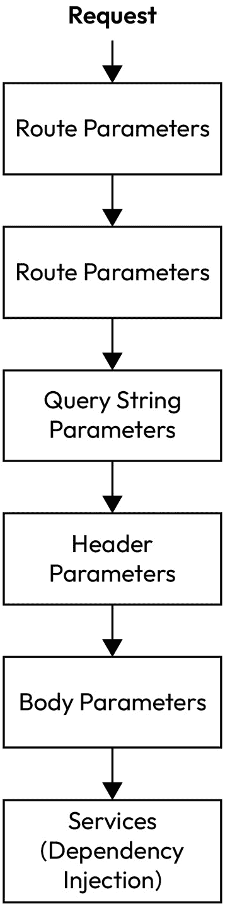

# 第六章：参数绑定

上下文是任何 API 的关键方面。客户端对其数据结构有自己的理解，服务器也是如此。例如，作为客户端，你会查看 API 文档，告诉你以 JSON 格式格式化请求有效负载。因此，你将 JSON 有效负载创建为符合 API 要求。

当 API 接收到你的有效负载时，并不能保证你传输的对象会保持为 JSON 格式（尤其是在 ASP.NET API 中），通常会存在一种机制将 JSON 对象绑定到 API 可以在其自身上下文中更容易操作的强类型 .NET 对象。

让我们再举一个例子。你（仍然是客户端）对具有特定 ID 的 *作业* 所对应的所有日志发起一个 **GET** 请求。然而，你希望将返回的日志数量限制为 100，API 允许你这样做。根据 API 文档，你可以通过在路径中包含作业 ID，并在查询字符串中指定你希望返回多少日志来实现这一点。

当 API 从你作为客户端接收这个请求时，它需要知道在哪里查找以检索这些参数，以便它们可以在请求处理程序的上下文中使用。这种在客户端和服务器之间在请求期间进行的数据转换称为 **参数绑定**，我们将在本章中详细探讨它。

在本章中，我们将探讨以下内容：

+   参数绑定来源

+   绑定优先级

+   创建自定义参数绑定

# 参数绑定来源

默认情况下，ASP.NET 支持多种不同的参数绑定类型。每种绑定类型都有一个可以从中绑定的来源。此外，每个绑定来源在请求中的位置不同，它们可以以不同的方式绑定到 API 中的数据结构。

让我们从最常用的绑定来源之一，即路径值，开始。

## 路径值

**路径值**仅仅是 API 路径的一部分。看看一个典型的路由，想象一下它被分割成由 **/** 字符分隔的部分。这些结果部分都是路径中的值。

以这个例子为例：**/todoitems/2**。它将被分成两个路径值部分：**todoitems** 和 **2**。

在此上下文中，**2** 是我们感兴趣的路径值，因为它是 **TodoItem** 实体的 ID。那么，我们如何在端点中访问它呢？

```cs
app.MapGet("/todoitems/{id}", (int id) =>
{
    TodoItem item = GetById(id);
    if(item != null)
    {
        return Results.Ok(item);
    }
    return Results.NotFound();
});
```

在此代码中，我们可以看到传入的路由已被修改，添加了一个由大括号包围的值。这个 **id** 值是一个占位符，用于替换客户端传递的整数值。

在跟随路由的 lambda 表达式参数中，我们声明我们正在传递一个整数参数，称为**id**。我们可以这样做，多亏了 ASP.NET 的路由模块，它可以检测路由值占位符并解析出实际值，将其转换为 lambda 表达式所需的数据类型，在这种情况下是整数。

在客户端，请求的路由可能看起来像这样：**https://myTodoAPI/todoitems/2**

重要的是要记住，在这个例子中，如果不存在**id**值为**2**的项目，绑定将不会匹配，端点根本不会触发，而是返回**404** **NOT FOUND**。

通过在端点中声明路由参数，此路由末尾找到的**id**值为**2**将被自动检测并绑定到 lambda 表达式中声明的整数参数，从而允许它在请求中使用。

路由值不必自动绑定到 lambda 表达式参数。它们可以通过传递**HttpRequest**对象作为参数在请求中手动访问。在**HttpRequest**上，有一个**RouteValues**集合，它将包含您用于绑定的值。

如果你有多种类型的参数绑定，并且想要使请求更易读，这很有用。以下是一个传递**HttpRequest**参数的示例。这不需要客户端进行任何更改，因为它已经存在。通过将其作为参数添加，我们允许端点访问它：

```cs
app.MapGet(
    "/todoitems/{id}",
    (HttpRequest request) =>
{
    if(int.TryParse(
        request.RouteValues["id"].ToString(),
        out var id) == false)
    {
        return Results.BadRequest(
            "Could not convert id to integer");
    }
    TodoItem item = GetById(id);
    return Results.Ok(item);
});
```

当向 API 发出请求时，有时您需要更细致地了解您正在进行的查询的状态或条件。在这些情况下，可以将查询字符串添加到端点 URL 中。这允许您向 API 传递更具体的参数。

## 查询字符串

在路由值的情况下，它们通常是直接访问数据的一种方式。仅使用路由值通过 ID 请求某物会产生可预测的结果。然而，数据以许多不同的形式存在，这意味着我们经常需要指定特定的条件，这些条件将转换我们正在检索的数据，使其符合所需的形状。**查询字符串**允许我们实现这一点。它们位于路由的末尾，并且有自己的表示法，以一个**?**字符开始。

检查查询字符串参数的存在

在使用查询字符串之前检查它们是否存在的优点是，我们可以使查询字符串参数成为可选的（更多内容将在下一节中介绍）。否则，我们的代码将假设客户端总是会发送查询字符串值，因此将它们作为端点的强制参数。当这是预期的时候，这是可以的，但在本章中展示的示例中，目标是确保客户端可以选择是否使用查询字符串值来过滤数据。

正如我们可以在这个路由中看到的那样，**https://myTodoAPI/todoitems?pastDue=true&priority=1**，查询字符串从路由值的末尾开始，以一个 **?** 字符为标志。之后，指定了一系列键值对。

路由中查询字符串的目的是传递一系列变量到 API，这些变量可以用来过滤将要返回的数据。在这种情况下，客户端请求任何已过截止日期且优先级值为 **1** 的 **TodoItem**。

## 可选查询字符串参数

您可以使传入的参数成为可选的。这非常简单；您只需通过在端点中添加的查询字符串参数后附加一个 **?** 字符来使其可空。然后，在端点的主体中，您可以检查可选值的是否存在。如果可选值不为空，您可以使用它。

以下是一个示例，展示了在通过 ID 获取待办事项的端点上使用可选参数。它允许客户端指定分配者必须具有特定值。如果分配者值不为空且与项目上的分配者值不匹配，您可以发送不同的响应，例如 **404** **NOT FOUND**：

```cs
  app.MapGet(
      "/todoitems/{id}",
      (int id, string? assignee) =>
  {
      var index = TodoItems.FindIndex(x => x.Id == id);
      if (index == -1)
      {
          return Results.NotFound();
      }
      var todoItem = TodoItems[index];
      if (assignee != null)
      {
          if(todoItem.Assignee != assignee)
          {
              return Results.NotFound();
          }
      }
      return Results.Ok(ToDoItems[index]);
  });
```

在服务器端，查询字符串参数绑定如下示例所示。在这个例子中，我们还在检查某些查询字符串键值对的存在，并根据指定的查询字符串值构建相关查询，使用 **IQueryable**：

```cs
app.MapGet("/todoItems", (HttpRequest request) =>
{
    bool pastDue = false;
    int priority = 0;
    var todoItemsQuery = ToDoItems.AsQueryable();
    if (request.Query.ContainsKey("pastDue"))
    {
        var parsedDueDate = bool.TryParse(
            request.Query["pastDue"],
            out pastDue
        );
        if (parsedDueDate) {
            todoItemsQuery = todoItemsQuery.Where(
                x => x.DueDate <= DateTime.Now
            );
        }
    }
    if (request.Query.ContainsKey("priority"))
    {
        var parsedPriority = int.TryParse(
            request.Query["priority"],
            out priority
        );
        if (parsedPriority) {
            todoItemsQuery = todoItemsQuery.Where(
                x => x.Priority == priority
            );
        }
    }
    var result = todoItemsQuery.ToList();
    return Results.Ok(result);
});
```

我们到目前为止的大部分时间都花在通过我们请求的 URL 传递参数上。让我们探索存在于这个范围之外的参数，从头部开始。

## 头部

**头部** 是通用 API 架构的经典组件，提供了关于请求的重要元数据。在它们像查询字符串一样以键值结构定义的意义上，它们是相似的，但应用它们的语法有所不同。

与查询字符串和路由值一样，它们也可以从 **HttpRequest** 对象中访问：

```cs
app.MapGet("/todoItems", (HttpRequest request) =>
{
    var customHeader = request.Headers["SomeCustomHeader"];
    var result = todoItemsQuery.ToList();
    return Results.Ok(result);
});
```

另一个存在于 URL 之外的关键参数类型是请求体，有时被称为 *payload*。ASP.NET 具有一个巧妙的功能，可以将有效负载的内容自动转换为项目中定义的强类型对象。这个功能被称为 **对象绑定**。

## 强类型对象绑定

当在请求有效负载中表示对象时，该对象在客户端创建请求时通常以 JSON 结构化。ASP.NET 提供了一种方便的方法，可以自动将传入的 JSON 参数绑定到项目中定义的强类型对象，以便在处理请求时易于使用。

我们已经在之前的章节中看到了这个例子，其中我们发送了一个表示 **TodoItem** 对象的 JSON 有效负载。

如果 JSON 对象可以被解析，ASP.NET 允许您隐式声明请求参数是类型为 *x* 的对象 – 在我们的例子中是 **TodoItem** 对象。

要以这种方式使用隐式绑定，只需在你的端点中声明一个参数，其类型是你希望接收的参数类型，如下例所示，我们通过**POST**方法接收一个要创建的新**TodoItem**：

```cs
app.MapPost("/todoitems", (TodoItem item) =>
{
    var validationContext = new ValidationContext(item);
    var validationResults = new List<ValidationResult>();
    var isValid = Validator.TryValidateObject(
        item, validationContext, validationResults, true);
    if (isValid)
    {
        TodoItems.Add(item);
        return Results.Created();
    }
    return Results.BadRequest(validationResults);
});
```

对象绑定是通过客户端在请求体中发送一个由字符串表示的数据结构来启动的。这通常是开发者在收集数据后格式化有效负载的结果，在将其发送到 API 之前。然而，如果数据是由用户收集的，用户可以通过**图形用户界面**（**GUI**）中的表单输入数据，这个过程可以通过表单值进一步简化。

## 表单值

API 端点接收数据并对它进行处理。还有什么比表单更好的数据提交用例吗？最小化 API 支持接收**表单值**，使它们成为处理 GUI 中表单提交的合适选项。

与先前的参数示例一样，表单值可以从**HttpRequest**对象中它们自己的专用成员中检索，它们也存在于**IFormCollection**集合中的键值结构中。以下代码显示了在**PATCH**请求中检索表单值：

```cs
app.MapPatch(
    "/updateTodoItemDueDate",
    async (HttpRequest request) =>
{
    var formData = await request.ReadFormAsync();
    var id = int.Parse(formData["Id"]);
    var newDueDate =
        DateTime.Parse(formData["newDueDate"]);
    var index = TodoItems.FindIndex(x => x.Id == id);
    if (index == -1)
    {
        return Results.NotFound();
    }
    TodoItems[index].DueDate = newDueDate;
    return Results.NoContent();
});
```

到目前为止，我们已经取得了一些进展，探索了可以绑定到 API 端点的各种参数类型。在先前的每个示例中，我们对这些参数应该如何绑定有很多假设。参数的位置，无论是作为 URL 中的查询字符串还是请求体中的内容，是**隐式的**；它不需要定义，而是自动发生。相反，有时我们需要明确地说明参数的绑定方式。这种显式绑定可以通过**属性**来实现。

## 使用属性的显式绑定

所有的前例都有一个共同点——它们都可以通过**HttpRequest**对象中存在的集合的键来访问。

有另一种绑定这些参数类型的方法，无需注入**HttpRequest**或其父级**HttpContext**——属性。

这种方法的优点是我们可以使代码更易于阅读，并且可以说改善了请求的结构，因为参数可以从端点 lambda 表达式的括号内绑定，从而将表达式主体专门用于处理请求。如前所述的示例所示，我们使用括号来接收参数，然后在主体中进行显式绑定，以及执行处理逻辑，这可能会有些混乱。

使用属性进行参数绑定更简单，因为你明确表示你有一个参数应该从请求的特定位置绑定。

以查询字符串为例。在 *查询字符串* 部分的代码块中，我们通过在 **HttpRequest** 对象内的 **IQueryCollection** 上按索引访问查询字符串。

以下代码块演示了如何通过使用属性来重构此端点，以获取查询字符串值，从而减少代码量并使其更容易阅读：

```cs
app.MapGet(
    "/todoItems",
    ([FromQuery(Name = "pastDue")] bool pastDue,
     [FromQuery(Name = "priority")] int priority  ) =>
{
    var todoItemsQuery = ToDoItems.AsQueryable();
    if (pastDue)
    {
        todoItemsQuery = todoItemsQuery.Where(
            x => x.DueDate <= DateTime.Now
        );
    }
    if (priority > 0)
    {
        todoItemsQuery = todoItemsQuery.Where(
            x => x.Priority == priority
        );
    }
    var result = todoItemsQuery.ToList();
    return Results.Ok(result);
});
```

如果你在这段代码中稍微改变一下 **[FromQuery]** 属性，例如，通过移除参数，将其改为 **Name = "priority"**，那么在假设查询字符串中指定了名称的情况下，API 仍然会匹配查询值。

本章前面演示的所有参数绑定方法都可以以这种方式提取——通过在属性中指定参数应从何处绑定，然后提供一个具有适当数据类型的对象，以便可以将其绑定。

让我们通过这种方式更新我们之前的 **POST** 示例，检查头部信息。为了演示目的，让我们假设当客户端发布一个新的 **TodoItem** 时，他们可以通过使用自定义头部来指示是否应在后台触发另一个进程。

可以使用属性显式绑定标题，如下所示：

```cs
app.MapPost(
    "/todoitems",
    (TodoItem item,
      [FromHeader(Name ="TriggerBackgroundTask")]
      bool triggerBackgroundTaskHeader ) =>
{
    if ( triggerBackgroundTaskHeader)
    {
        // do something else in the background
    }
    ToDoItems.Add(item);
    return Results.Created();
});
```

现在，我们已经准备好进入更高级的领域，我们可以探索从先前注册的 **services** 目录中注入的参数。

## 通过依赖注入绑定参数

参数可以绑定到客户端不一定发送的端点。一个例子是依赖项。如果一个 API 为注入注册了依赖项，它们可以明确地作为参数绑定。让我们通过重写 *使用属性显式绑定* 部分的第一个代码块中的 **GET** 请求示例来探索这个例子。

首先，正如你在 GitHub 上的代码中所看到的，我们创建了一个名为 **TodoItemService** 的服务：

```cs
public class TodoItemService
{
    List<TodoItem> todoItems = new List<TodoItem>();
    public TodoItem GetById(int id)
    {
        return todoItems.FirstOrDefault(x => x.Id == id);
    }
    public List<TodoItem> GetTodoItems(
        bool pastDue, int priority)
    {
        var todoItemsQuery = todoItems.AsQueryable();
        if (pastDue)
        {
            todoItemsQuery = todoItemsQuery.Where(
                x => x.DueDate <= DateTime.Now
            );
        }
        if (priority > 0)
        {
            todoItemsQuery = todoItemsQuery.Where(
                x => x.Priority == priority);
        }
        return todoItemsQuery.ToList();
    }
}
```

此服务已在 **Program.cs** 中注册为单例服务用于依赖注入：

```cs
builder.Services.AddSingleton<TodoItemService>();
```

这意味着我们现在可以使用 **[** **FromServices]** 属性在端点内部访问此服务：

```cs
app.MapGet(
    "/todoItems",
    ([FromQuery(Name = "pastDue")] bool pastDue,
     [FromQuery(Name = "priority")] int priority,
     [FromServices] TodoService todoItemService) =>
{
    var todoItemsQuery =
        todoItemService.TodoItems.AsQueryable();
    if (pastDue)
    {
        todoItemsQuery = todoItemsQuery.Where(
            x => x.DueDate <= DateTime.Now
        );
    }
    if (priority > 0)
    {
        todoItemsQuery = todoItemsQuery.Where(
            x => x.Priority == priority
        );
    }
    var result =
        todoItemService.GetTodoItems(todoItemsQuery);
    return Results.Ok(result);
});
```

在此代码中，使用 **[FromService]** 属性演示了为依赖注入注册的服务绑定。这使得 API 端点能够轻松利用可重用组件。

到目前为止，我们已经查看了一些不同参数类型的示例以及它们如何绑定到 API 端点。希望这表明 ASP.NET 在绑定这些参数之前正在处理繁重的工作。了解参数解析的顺序也很重要。这被称为 **绑定优先级**。

# 绑定优先级

ASP.NET 有自己的参数绑定顺序，称为其 **优先级顺序**。使用此顺序保持解析的一致性，并确保 ASP.NET 以可预测的方式解析，从最具体的参数开始，到最不具体的参数结束。

*图 5.1* 概述了 ASP.NET 使用的官方顺序，这对于开发者来说很有用，因为它可以帮助你根据使用的参数预测任何潜在的绑定问题。



图 6.1：ASP.NET 参数绑定优先级顺序

让我们看看一个工作示例，说明我们如何创建自定义绑定逻辑，从而让我们对绑定执行的方式有更多的控制。

# 创建自定义绑定逻辑

在此示例中，我们将改变绑定传入 **TodoItem** 的方式，添加在绑定点发生的验证逻辑。

要实现这种自定义绑定，我们需要在 **TodoItem** 中实现一个函数。这个函数是静态的，称为 **BindAsync()** 。

**BindAsync()** 允许我们中断对象的绑定过程并应用自己的逻辑。让我们首先将 **BindAsync()** 添加到 **TodoItem** 类中。

在 **TodoItem** 中，在属性定义下方添加以下静态函数：

```cs
public static async ValueTask<TodoItem> BindAsync(
    HttpContext context, ParameterInfo parameter)
{
}
```

接下来，我们需要添加一个 **try/catch** 块，以便我们可以执行 JSON 验证逻辑，捕获过程中的任何错误。我们预计如果验证失败，将看到类型为 **JsonException** 的异常，因此我们将在我们的 **try/catch** 块中显式捕获此异常类型：

```cs
public static async ValueTask<TodoItem> BindAsync(
    HttpContext context, ParameterInfo parameter)
{
    try
    {
    }
    catch (JsonException)
    {
}
}
```

现在，我们可以先访问请求体，并将原始 JSON 反序列化为 **TodoItem** 实例。我们将添加选项以确保不将大小写因素纳入验证，然后检查反序列化是否成功。如果没有成功，则传入的参数无法绑定，请求无效，因此我们将返回 **400 Bad Request** 响应。更新 **try** 块中的此代码，如下所示：

```cs
var requestBody = await new StreamReader(
    context.Request.Body
).ReadToEndAsync();
var todoItem = JsonSerializer.Deserialize<TodoItem>(
    requestBody,
    new JsonSerializerOptions
    {
        PropertyNameCaseInsensitive = true
    }
);
if (todoItem == null)
{
    context.Response.StatusCode = 400;
    await context.Response.WriteAsync("Invalid JSON");
    return new TodoItem();
}
```

到目前为止，我们已检查要绑定的 JSON 的有效性。在 *第五章* 中，我们探讨了验证中间件的示例，用于验证对象是否根据特定规则创建。我们使用了 **ValidationContext** 以及静态类型 **Validator** 来返回一个 **ValidationResult** 列表，这将确定模型的合法性。

我们可以在 **BindAsync()** 中使用相同的逻辑来实现对象验证，作为参数绑定过程的一部分。

将此逻辑添加到 **try** 块中，以完成自定义绑定逻辑：

```cs
var validationResults = new List<ValidationResult>();
var validationContext = new ValidationContext(
    todoItem,
    serviceProvider: null,
    items: null
);
if (!Validator.TryValidateObject(
    todoItem,
    validationContext,
    validationResults,
    validateAllProperties: true
))
{
    context.Response.StatusCode = 400;
    var errorMessages = string.Join(
        "; ",
        validationResults.Select(x => x.ErrorMessage)
    );
    await context.Response.WriteAsync(errorMessages);
    return new TodoItem();
}
return todoItem;
```

最后，我们需要在 **catch** 块中添加以下基本逻辑来处理捕获的任何类型为 **JsonException** 的异常：

```cs
  context.Response.StatusCode = 400;
  await context.Response.WriteAsync("Invalid JSON");
  return new TodoItem();
```

请参考随附 GitHub 仓库中的本章代码以查看完成的类：[`github.com/PacktPublishing/Minimal-APIs-in-ASP.NET-9`](https://github.com/PacktPublishing/Minimal-APIs-in-ASP.NET-9)

自定义参数绑定是 ASP.NET 灵活功能集的一个好例子。最小 API 可能被标记为这样的标签，但这并不意味着它们会限制自定义配置。让我们回顾一下本章我们所学到的内容。

# 摘要

参数绑定是一个相当广泛的主题，我们确实在本章中涵盖了大部分内容。

我们首先研究了不同参数类型的绑定方式，从路由值和查询字符串到头信息和为强类型对象提供的自动绑定。

在查看如何在请求中利用依赖注入添加可能未从客户端接收到的参数之前，我们首先探讨了这些参数类型的一些替代绑定方法，包括显式属性绑定和绑定优先级顺序。

最后，我们通过一个自定义参数绑定的示例，为 **TodoItem** 模型的绑定逻辑添加了自定义验证。

本章并非我们最后一次看到最小 API 中的依赖注入。在下一章中，我们将更详细地探讨这个主题。
