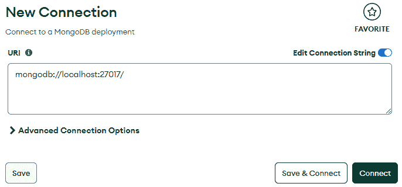

# 第八章：将最小化 API 与数据源集成

尽管我们使用的是最小化 API，但为了不与外部状态交互，API 可能需要更加最小化，这并不意味着这种情况不会发生。例如，一个 API 可能仅仅用于执行计算或验证数据，这些操作本身可能并不一定需要某种类型的管理数据。

然而，可以说，广泛的实际生产 API 都包含一些 **创建、读取、更新、删除** ( **CRUD** ) 功能。在前面章节中展示的示例中，例如 **Employee** API 和 **Todo Item** API，我们提到了实体或对象，所有这些都有可能被创建、更新、删除或检索。我们探索的示例将这些域对象存储在内存中，这意味着当应用程序停止时，它们会消失。现在是时候将数据移动到外部数据源，在那里它可以被持久化并独立于我们编写的最小化 API 进行管理。

在本书中，我们将探讨在数据源之间移动数据的两种基本方法。首先，在本章中，我们将探索使用 **SqlConnection** 类型直接与 SQL 和 NoSQL 数据库类型进行数据库连接，以及 MongoDB 驱动。下一章将涵盖第二种方法，即 **对象关系映射** ( **ORM** )。每种方法都有自己的配置要求。

在本章中，我们将涵盖以下主要主题：

+   理解最小化 API 中的数据集成

+   使用 **SqlConnection** 连接到 SQL Server

+   使用 MongoDB 驱动连接到 NoSQL 数据库

# 技术要求

本章非常注重实践，使用了多种不同的技术。因此，你需要在你的机器上安装以下内容：

+   Visual Studio 2022

+   Microsoft SQL Server 2022 开发者版

+   Microsoft SQL Server Management Studio

+   MongoDB Community Server

+   MongoDB Compass

你需要下载并安装所有列出的软件。所有产品的安装都是基于向导的，所以按照每个向导的指示操作，直到它们被安装。

如果你一直跟随前几章中的代码示例，你可能已经安装了 Visual Studio 2022。

如果你一直在使用 Visual Studio Code，建议你现在切换到 Visual Studio 2022。

或者，你也可以在云平台上托管你的 SQL 和 MongoDB 服务器，例如 Microsoft Azure 或 **Amazon Web Services** ( **AWS** )。请注意，这些数据源在云中的配置和部署超出了本书的范围。

本章的代码可在 GitHub 仓库中找到：[`github.com/PacktPublishing/Minimal-APIs-in-ASP.NET-9`](https://github.com/PacktPublishing/Minimal-APIs-in-ASP.NET-9)

# 理解最小化 API 中的数据集成

在第一章中，我们定义了 API 及其目的。在数据源方面重申这个定义是值得的。API 作为系统的网关，提供对该系统的编程访问。

在许多情况下，客户端通过 API 连接到系统的目的是处理数据。这些数据必须存储在某处——最好是 API 本身之外的源，以便可以外部管理和持久化。

最小 API 为数据源提供各种连接方法。为了本章的目的，我们将重点关注最常见的持久数据存储类型，即 **SQL** 和 **NoSQL**。

SQL 与 NoSQL

作为本书的读者，你很可能至少对 SQL 和 NoSQL 有一定的了解，但为了简短介绍，SQL 数据库是关系型数据库，这意味着数据存储在一系列表中，每个表中的记录由行和列表示。NoSQL 比 SQL 结构更松散，因为数据可以存储在各种格式中，包括文档、键值对、列族或图。数据以这些各种格式存储在实体集合中。

有许多 SQL 和 NoSQL 产品可供选择，其中主流产品在 *表 8.1* 中概述：

| **关系型数据库** | **NoSQL 数据库** |
| --- | --- |
| MySQL | MongoDB (文档存储) |
| PostgreSQL | Cassandra (列族存储) |
| 微软 SQL Server | Redis (键值存储) |
| Oracle 数据库 | DynamoDB (键值存储) |
| SQLite | CouchDB (文档存储) |
| MariaDB | Cosmos DB (多模型数据库) |

表 8.1：主流数据库平台的示例

不论数据存储是基于 SQL 还是 NoSQL，都有许多方式可以让最小化 API 访问它们，可以采用不同的设计模式来确保在数据库和 API 之间管理的数据的一致性和完整性。

我们将开始通过最小 API 探索数据源，这些 API 直接连接到 SQL 数据库。

根据你的用例，你选择的数据连接方法对于最佳性能和安全性至关重要，同样重要的是你管理连接生命周期的办法、编写查询的方式以及将参数传递到命令和查询中的方式。

直接 SQL 命令提供了很多灵活性，因为它们的作用方式就像你打开了数据库 IDE 并在其中编写查询一样。与数据库建立连接，执行查询或命令，然后断开连接。

让我们首先探索直接连接方法。我们将继续使用 **Employee** API 的例子，首先连接到 Microsoft SQL 数据库，然后连接到 MongoDB 实例（NoSQL）。

# 连接到并集成 SQL 数据库

我们将以一个使用 Microsoft SQL 的示例开始。首先，打开 SQL Server Management Studio，创建一个名为 **MyCompany** 的数据库，其中包含一个名为 **Employees** 的表。

你可以使用以下代码块中的 SQL 脚本来创建具有相关列和数据类型的表：

```cs
CREATE TABLE dbo.Employees
    (
    Id int NOT NULL IDENTITY (1, 1),
    Name varchar(MAX) NOT NULL,
    Salary decimal(10, 2) NOT NULL,
    Address varchar(MAX) NOT NULL,
    City varchar(50) NOT NULL,
    Region varchar(50) NOT NULL,
    Country varchar(50) NOT NULL,
    Phone varchar(200) NOT NULL,
    PostalCode varchar(10) NOT NULL
    )
```

在 **Employees** 表中，我们将 **Id** 列设置为标识列，这意味着 SQL Server 将在插入任何记录时填充它，每次插入时 **Id** 值增加 **1**。

现在我们已经拥有了从我们的最小 API 项目设置数据库连接所需的一切。

让我们回到 **Employee** API，并设置数据库连接。

## 配置数据库连接和检索记录

SQL 数据库使用 **连接字符串** 来允许从代码库访问。在这种情况下，我正在使用 Windows 身份验证和我的本地 SQL 服务器，因此我可以使用一个简单的连接字符串，假设当前登录的 Windows 用户能够访问我的 SQL 服务器。如果你使用的是 SQL 服务器，你需要生成一个稍微不同的连接字符串。形成连接字符串的最简单方法是使用 Microsoft SQL 服务器在 [`connectionstrings.com`](https://connectionstrings.com) 找到的指南，根据你的身份验证类型，你可以生成适当的字符串。以下代码显示了每种身份验证类型的简单连接字符串示例：

```cs
//Windows Auth (Trusted Connection)
Server=myServerAddress;
Database=myDataBase;
Trusted_Connection=True;
// SQL Server Authentication
Server=myServerAddress;
Database=myDataBase;
User Id=myUsername;
Password=myPassword;
```

既然我们已经有了连接字符串，我们就可以将其存储在 API 的某个地方，以便可以轻松检索。一个不错的选择是将它放在配置文件中，默认情况下，它以 **appsettings.json** 的形式提供给我们。

打开 **appsettings.json** 并添加你的连接字符串，如下所示（我在我的 JSON 示例中使用 SQL 身份验证，但如果你需要，你需要添加你的 Windows 身份验证连接字符串）： 

```cs
{
  "ConnectionStrings": {
      "DefaultConnection":
          "Server=localhost;Database=MyCompany;
          User Id=your_user;Password=your_password;"
  }
}
```

当你创建项目时，你的 **appsettings.json** 文件可能包含额外的模板值。为了简化，在遵循此示例时，最好是将现有 **appsettings.json** 文件的内容覆盖为前面代码中显示的示例内容。

接下来，我们将创建一个服务来管理与数据库的交互。这个服务将通过依赖注入（见 *第七章* 了解依赖注入的更多细节）注入到我们的 API 端点。

我们将注册该服务为 **单例**。这样做可以让我们清楚地指定应该只有一个服务实例，这意味着进入 API 的任何请求都将共享该服务。让我们首先通过创建一个名为 **IDatabaseService** 的新接口来开始创建这个数据库服务的创建。这个接口将为任何创建用于与数据库通信的服务定义 **契约**：

```cs
public interface IDatabaseService
{
    Task<IEnumerable<Employee>> GetEmployeesAsync();
    Task AddEmployeeAsync(Employee employee);
}
```

如果你在此时看到错误信息，指出 **Employee** 不是一个已知的类型，请不要担心。当它稍后被创建时，这个错误将会消失。

现在，我们可以创建一个实现 **IDatabaseService** 的具体类来形成我们的服务。创建这个类，命名为 **SQLService**。

一旦创建了 **SQLService** 类，添加一个构造函数，它接收 **IConfiguration** 作为参数，并将它的值保存到一个局部的 **readonly** 字段中。

更多关于 IConfiguration 的信息

**IConfiguration** 已经在 ASP.NET 应用程序中注册用于依赖注入。它代表了 **appsettings.json** 的内容。

这个字段将包含连接字符串，并允许它在服务执行的所有查询和命令中引用，如下所示：

```cs
public class SqlService : IDatabaseService
{
    private readonly string _connectionString;
    public SqlService(IConfiguration configuration)
    {
        _connectionString =
             configuration.GetConnectionString(
                 "DefaultConnection"
             );
    }
}
```

接下来，我们将通过添加添加和检索员工记录的功能来完善这个服务。

我们将使用之前章节示例中添加的相同的 **Employee** 类。作为一个方便的提醒，这个代码块显示了将作为数据库记录模型的 **Employee** 类：

```cs
    public class Employee
    {
        public int Id { get; set; }
        public string Name { get; set; }
        public decimal Salary { get; set; }
        public string Address { get; set; }
        public string City { get; set; }
        public string Region { get; set; }
        public string PostalCode { get; set; }
        public string Country { get; set; }
        public string Phone { get; set; }
    }
```

到现在为止，你可能会看到一些错误（在 Visual Studio 错误列表中，以及代码下方的红色线条形式）指出类没有完全实现 **IDatabaseService** 接口。我们应该将接口中指定的两个函数添加到 **SqlService** 类中，以纠正这个问题。

让我们从 **GetEmployeesAsync()** 开始。这个函数的目的是返回包含数据库中所有员工的列表。首先创建函数定义，并在主体中实例化一个新的 **Employee** 列表：

```cs
public async Task<IEnumerable<Employee>>
    GetEmployeesAsync()
{
    var employees = new List<Employee>();
}
```

在继续之前，请确保你已经添加了 **Microsoft.Data.SqlClient** NuGet 包，因为这将是有必要的。你可以通过前往 **工具** | **管理 NuGet 包** | **包管理器控制台**，然后输入以下命令来完成此操作：

```cs
dotnet add package Microsoft.Data.SqlClient
```

接下来，我们将使用 **SqlConnection** 打开一个新的 SQL Server 连接。通过将实例包裹在一个 **using** 语句中，我们确保一旦控制流离开了 **using** 语句的主体，连接就会自动释放，这得益于 **SqlConnection** 实现了 **IDisposable** 接口：

```cs
using (var connection = new
    SqlConnection(_connectionString))
{
    await connection.OpenAsync();
}
```

在这个阶段，你已经打开了一个将会自动释放的连接。这是好事，因为我们正在负责任地管理外部资源的使用。

接下来，在 **using** 语句内部，添加另一个 **using** 语句，但这次是为了创建一个 **SqlCommand** 对象。这个 **SqlCommand** 对象代表了我们要执行的查询，针对我们现在打开的连接：

```cs
using (var command = new
    SqlCommand("SELECT * FROM Employees", connection))
{
}
```

接下来，我们在这个语句内部嵌套另一个 **using** 语句。这创建了 **SqlDataReader**，读取 **SqlCommand** 中返回的任何行，为每条记录创建一个新的 **Employee** 实例，并将其添加到列表中：

```cs
using (var reader = await command.ExecuteReaderAsync())
{
    while (await reader.ReadAsync())
    {
        var employee = new Employee
        {
            Id = reader.GetInt32(0),
            Name = reader.GetString(1),
            Salary = reader.GetDecimal(2),
            Address = reader.GetString(3),
            City = reader.GetString(4),
            Region = reader.GetString(5),
            PostalCode = reader.GetString(6),
            Country = reader.GetString(7),
            Phone = reader.GetString(8)
        };
        employees.Add(employee);
    }
}
```

最后，我们可以通过返回类型为 **Employee** 的列表来结束这个函数，这意味着最终的函数看起来如下所示：

```cs
public async Task<IEnumerable<Employee>>
    GetEmployeesAsync()
{
    var employees = new List<Employee>();
    using (var connection = new
        SqlConnection(_connectionString))
    {
        await connection.OpenAsync();
        using (var command = new SqlCommand(
            "SELECT * FROM Employees", connection))
        {
            using (var reader = await
                command.ExecuteReaderAsync())
            {
                while (await reader.ReadAsync())
                {
                    var employee = new Employee
                    {
                        Id = reader.GetInt32(0),
                        Name = reader.GetString(1),
                        Salary = reader.GetDecimal(2),
                        Address = reader.GetString(3),
                        City = reader.GetString(4),
                        Region = reader.GetString(5),
                        PostalCode = reader.GetString(6),
                        Country = reader.GetString(7),
                        Phone = reader.GetString(8)
                    };
                    employees.Add(employee);
                }
            }
        }
    }
    return employees;
}
```

看一下前一段代码中**SqlCommand**的使用。注意我们不是通过连接来构建 SQL 命令字符串，而是将**Employee**的值作为字符串的一部分传递。相反，最佳实践是使用 SQL 参数。参数化查询使我们能够防止一种称为 SQL 注入的安全漏洞。

在 SQL 注入攻击中，一个恶意值作为值传递，可能会改变命令的原始预期行为。通过传递参数，我们可以避免这种情况，参数在命令字符串中以**@**字符表示，并在字符串形成后添加到**SqlCommand**中（我们将在下一节中看到这一点）。

## 插入员工记录

我们现在已经完成了与 SQL 的第一个连接，并使用事务。有了这些知识，我们也可以创建**AddEmployeeAsync()**函数。连接方法相同，但命令不同，使用**INSERT**而不是**SELECT**：

```cs
public async Task AddEmployeeAsync(Employee employee)
{
    using (var connection = new
        SqlConnection(_connectionString))
    {
        await connection.OpenAsync();
        using (var command = new SqlCommand(
            "INSERT INTO Employees (Name, Salary, " +
            Address, City, Region, Country, Phone, " +
            PostalCode) VALUES (@Name, @Salary, " +
            @Address, @City, @Region, @Country, " +
            @Phone, @PostalCode)", " +
            connection))
        {
            command.Parameters.AddWithValue(
                "@Name", employee.Name);
            command.Parameters.AddWithValue(
                "@Salary", employee.Salary);
            command.Parameters.AddWithValue(
                "@Address", employee.Address);
            command.Parameters.AddWithValue(
                "@City", employee.City);
            command.Parameters.AddWithValue(
                "@Region", employee.Region);
            command.Parameters.AddWithValue(
                "@Country", employee.Country);
            command.Parameters.AddWithValue(
                "@Phone", employee.Phone);
            command.Parameters.AddWithValue(
                "@PostalCode", employee.PostalCode);
            await command.ExecuteNonQueryAsync();
        }
    }
}
```

让我们现在将注意力转向最小的 API 端点。

## 从 API 端点执行数据库事务

这些端点需要注入 SQL 服务，以便在端点体中使用。

返回到**Program.cs**，将服务注册为单例：

```cs
var builder = WebApplication.CreateBuilder(args);
builder.Services.AddSingleton<IDatabaseService,
SqlLService>(); var app = builder.Build();
```

因为我们已经创建了一个用于管理与 SQL 服务器交互的服务，并且我们已经通过依赖注入使其易于使用，所以从最小的 API 端点获取和创建员工非常容易。只需为检索添加一个**GET**端点，为创建添加一个**POST**端点，并添加对我们在**SqlService**中创建的适当函数的调用：

```cs
app.MapGet(
    "/employees",
    async (IDatabaseService dbService) =>
{
    var employees = await dbService.GetEmployeesAsync();
    return Results.Ok(employees);
});
app.MapPost(
    "/employees",
    async (IDatabaseService dbService,
           Employee employee) =>
{
    await dbService.AddEmployeeAsync(employee);
    return Results.Created(
        $"/employees/{employee.Id}", employee);
});
```

尝试新的端点。如果成功，你应该能够以列表形式检索数据源中的员工或通过 API 添加新员工。

如本章前面所述，因为我们创建了一个接口，所以我们应该能够替换为使用不同数据源的服务，而无需更改端点。这很自然地引出了到 NoSQL 数据库的数据库连接示例。

# 连接到 MongoDB

为了演示目的，我们将连接到广泛使用的 NoSQL 数据库平台**MongoDB**。

在我们创建服务之前，我们应该首先向 MongoDB 数据库中添加一些数据。根据技术要求，你应该已经安装了 MongoDB 服务器，以及**MongoDB Compass**，它是 MongoDB 的**图形用户界面**（**GUI**）。

首先打开 MongoDB Compass，并创建与已安装的 MongoDB 服务器实例的连接。如果你没有修改安装就本地安装了 MongoDB，你应该可以直接点击**连接**：



图 8.1：创建新的 MongoDB 连接

连接成功后，你将能够看到服务器上现有的数据库：


图 8.2：查看现有的 MongoDB 连接

在左侧导航栏中，点击加号图标以添加一个新的数据库。再次，我们将数据库命名为**MyCompany**。Compass 还会要求你创建一个集合。正如我们在 SQL 数据库中创建了一个**Employees**表一样，我们将在 MongoDB 中创建一个**Employees**集合：


图 8.3：在 Compass 中创建 MongoDB 数据库

注意我们并没有为**Employees**集合指定一个模式。这是因为该集合是文档型的。我们可以导入 JSON 格式的数据，这与我们的 API 中的**Employee**类相对应。

创建几个模拟的员工并将它们保存到本地 JSON 文件中。以下是一些示例 JSON 以供你开始：

```cs
[
    {
        "Id": 1,
        "Name": "John Doe",
        "Salary": 55000.75,
        "Address": "123 Elm Street",
        "City": "Springfield",
        "Region": "IL",
        "PostalCode": "62701",
        "Country": "USA",
        "Phone": "555-1234"
    },
    {
        "Id": 2,
        "Name": "Jane Smith",
        "Salary": 62000.50,
        "Address": "456 Oak Avenue",
        "City": "Metropolis",
        "Region": "NY",
        "PostalCode": "10001",
        "Country": "USA",
        "Phone": "555-5678"
    }
]
```

保存 JSON 文件后，你可以将其导入 MongoDB Compass 中的**Employees**集合：


图 8.4：在 Compass 中导入 MongoDB 数据库的数据

现在我们已经用示例数据设置了 MongoDB 集合。让我们将注意力转回到最小 API，我们将编写一个新的服务来与这个 NoSQL 数据库交互。

首先，我们需要安装 MongoDB 驱动程序以支持与 MongoDB 数据库的交互。你可以在 Visual Studio 的**包管理器控制台**中这样做：

```cs
dotnet add package MongoDB.Driver
```

创建一个名为**MongoDbService**的新类，实现**IDatabaseService**接口。确保你引用了**MongoDB.Bson**和**MongoDB.Driver**：

```cs
using MongoDB.Bson;
using MongoDB.Driver;
using System.Collections.Generic;
using System.Threading.Tasks;
public class MongoDbService : IDatabaseService
{
}
```

接下来，我们将创建一个构造函数，它像之前一样接收一个包含数据库连接字符串的注入的**IConfiguration**对象，然后使用**MongoClient**实例初始化连接。

随后，可以检索并存储类型为**Employee**的集合引用到一个**private**字段中：

```cs
private readonly IMongoCollection<Employee>
    _employeesCollection;
    public MongoDbService(IConfiguration configuration)
    {
        var connectionString =
            configuration.GetConnectionString(
                "MongoDbConnection");
        var mongoClient = new
            MongoClient(connectionString);
        var mongoDatabase =
            mongoClient.GetDatabase("MyCompany");
        _employeesCollection =
            mongoDatabase.GetCollection<Employee>(
                "Employees");
    }
```

接下来，通过添加所需的函数来完成**IDatabaseService**接口的实现。这些函数可以简单地利用**Employee**集合进行查询和插入记录：

```cs
public async Task<IEnumerable<Employee>>
    GetEmployeesAsync()
    {
        return await _employeesCollection
            .Find(new BsonDocument())
            .ToListAsync();
    }
    public async Task AddEmployeeAsync(Employee employee)
    {
        await _employeesCollection
            .InsertOneAsync(employee);
    }
```

需要将连接字符串更改为指向 MongoDB 服务器和数据库。MongoDB 的连接字符串格式相对简单。默认情况下，服务器应该在**27017**端口上运行。以下是此配置的默认连接字符串示例：

```cs
mongodb://localhost:27017/MyCompany
```

然后，可以将此连接字符串添加到**appsettings.json**中的**ConnectionStrings**对象。我们还应该在 JSON 中添加一个布尔标志，以便我们可以指定是否使用 MongoDB，或者是否采用默认的 SQL 连接。

完成后，**appsettings.json**中的**ConnectionStrings**部分应该看起来像这里所示的示例：

```cs
"UseMongoDB": true,
"ConnectionStrings": {
    "DefaultConnection":
        "Server=.\\SQLEXPRESS;Database=MyCompany;
        Trusted_Connection=True;
        TrustServerCertificate=True;",
    "MongoDbConnection":
        "mongodb://localhost:27017/MyCompany"
  }
```

添加了新的数据源连接字符串和从默认源切换到 MongoDB 的选项后，我们必须为依赖注入注册新的**MongoDbService**类。然而，我们还需要根据是否启用了**UseMongoDB**标志来指定新的依赖项解析规则。

在**Program.cs**中，注册新的**MongoDbService**类

```cs
builder.Services.AddSingleton<MongoDbService>();
```

接下来，添加以下**IDatabaseService**的单例注册，以及逻辑，在解析要使用的正确数据库服务之前检查**appsettings.json**中的 MongoDB 标志：

```cs
builder.Services.AddSingleton<IDatabaseService>(sp =>
{
    var config = sp.GetRequiredService<IConfiguration>();
    var useMongoDB = config.GetValue<bool>("UseMongoDB");
    if (useMongoDB)
    {
        return sp.GetRequiredService<MongoDbService>();
    }
    else
    {
        return sp.GetRequiredService<SqlService>();
    }
});
```

如果你还没有运行代码，你可能还没有意识到，但我们遇到了一个问题。

使用**IDatabaseService**接口的目的是确保我们可以通过修改**appsettings.json**中的布尔标志轻松地在数据源之间切换。

如果两个数据源中的数据结构具有相同模式，这将很好。不幸的是，它们并不相同，因为在 SQL Server 中，**Id**是**int**类型，而在 MongoDB 中，等效的标识符称为**_id**，其数据类型是字符串。

这意味着，按照目前的状况，**Employee**可以在两个源之间互换。这意味着如果我们切换到 MongoDB 并尝试将数据反序列化为**Employee**，由于数据类型不同，它将因**FormatException**而失败。

为了解决这个问题，我们应该为不同的数据源创建单独的模型。这听起来似乎与灵活系统的理念相悖，但我们可以通过使用另一个接口来确保我们不必为不同的数据源修改现有的端点。

创建一个新的接口称为**IEmployee**。目前它不需要任何字段：

```cs
public interface IEmployee
{
}
```

我们可以使用这个接口来泛型地表示员工模型，无论它是 SQL Server 模型还是 MongoDB 模型。

创建一个新的模型称为**EmployeeMongoDb**，并按以下方式设置它：

```cs
using MongoDB.Bson;
using MongoDB.Bson.Serialization.Attributes;
{
    public class EmployeeMongoDb : IEmployee
    {
        [BsonId]
        [BsonRepresentation(
            MongoDB.Bson.BsonType.ObjectId)]
        public string Id { get; set; }
        public string Name { get; set; }
        public decimal Salary { get; set; }
        public string Address { get; set; }
        public string City { get; set; }
        public string Region { get; set; }
        public string PostalCode { get; set; }
        public string Country { get; set; }
        public string Phone { get; set; }
    }
}
```

通过将之前代码中显示的属性添加到**Id**字段，我们将**Id**映射到 MongoDB 集合中基于字符串的**_id**字段。我们同样实现了**IEmployee**接口。

由于 SQL Server 是**appsettings.json**中的默认连接字符串，我们将**Employee**视为默认模型。确保它也实现了**IEmployee**接口。

现在，我们必须更改 MongoDB 服务或 SQL 服务中返回具体类的任何区域，使其返回**IEmployee**。你还需要更改任何接收**Employee**作为参数的代码。这要求服务将**IEmployee**转换为兼容的具体实现，例如**MongoDb**服务的**EmployeeMongoDb**。

**SqlServerService**和**MongoDbService**的更改可以在以下代码中看到：

```cs
private readonly IMongoCollection<EmployeeMongoDb>
    _employeesCollection;
public MongoDbService(IConfiguration configuration)
{
    var connectionString =
        configuration.GetConnectionString(
            "MongoDbConnection");
    var mongoClient = new MongoClient(connectionString);
    var mongoDatabase =
        mongoClient.GetDatabase("MyCompany");
    _employeesCollection =
        mongoDatabase.GetCollection<EmployeeMongoDb>(
            "Employees");
}
```

继续之前的代码，我们添加了**GetEmployeesAsync()**和**AddEmployeeAsync()**方法，使用 MongoDB。注意，在**AddEmployeeAsync()**方法中，我们仍然可以接受**IEmployee**，但只需将其转换为**EmployeeMongoDb**对象，这样 MongoDB 就可以负责生成一个**string** ID，而不是 SQL Server 中使用的**int** ID：

```cs
public async Task<IEnumerable<IEmployee>>
    GetEmployeesAsync()
{
    var result = await _employeesCollection
        .Find(new BsonDocument())
        .ToListAsync();
    return result;
}
public async Task AddEmployeeAsync(IEmployee employee)
{
    var employeeToAdd = new EmployeeMongoDb
{
    Name = employee.Name,
    Salary = employee.Salary,
    Address = employee.Address,
    City = employee.City,
    Region = employee.Region,
    PostalCode = employee.PostalCode,
    Country = employee.Country,
    Phone = employee.Phone
};
    await _employeesCollection
        .InsertOneAsync(employeeToAdd);
}
```

以下方法展示了使用 SQL Server 的相同代码：

```cs
// GetEmployeesAsync only needs the return type to be
// changed
public async Task<IEnumerable<IEmployee>>
    GetEmployeesAsync()
public async Task AddEmployeeAsync(IEmployee employee)
{
    var employeeToAdd = (Employee)employee;
    using (var connection = new
        SqlConnection(_connectionString))
    {
        await connection.OpenAsync();
        using (var command = new SqlCommand(
            "INSERT INTO Employees (Name, Salary, " +
            Address, City, Region, Country, Phone, " +
            PostalCode) VALUES (@Name, @Salary, " +
            @Address, @City, @Region, @Country, " +
            @Phone, @PostalCode)", " +
            connection))
        {
            command.Parameters.AddWithValue(
                "@Name", employeeToAdd.Name);
            command.Parameters.AddWithValue(
                "@Salary", employeeToAdd.Salary);
            command.Parameters.AddWithValue(
                "@Address", employeeToAdd.Address);
            command.Parameters.AddWithValue(
                "@City", employeeToAdd.City);
            command.Parameters.AddWithValue(
                "@Region", employeeToAdd.Region);
            command.Parameters.AddWithValue(
                "@Country", employeeToAdd.Country);
            command.Parameters.AddWithValue(
                "@Phone", employeeToAdd.Phone);
            command.Parameters.AddWithValue(
                "@PostalCode", employeeToAdd.PostalCode);
            await command.ExecuteNonQueryAsync();
        }
    }
}
```

由于**Employee**和**EmployeeMongoDb**都实现了**IEmployee**，端点逻辑不再需要更改。我们在最高抽象级别上保留了通用性，同时在服务中处理抽象层较低的更具体类。

开放封闭原则

我们使用接口所做的更改帮助我们遵循开放封闭原则，我们的目标是允许将来在不侵入性地修改原始代码库的情况下添加新的数据源。我们将在*第十三章*中更详细地讨论这一原则。

这一章节内容相当密集，所以在继续之前，让我们回顾一下我们已经覆盖的内容。

# 摘要

在本章中，我们介绍了一些从最小 API 端点直接与数据库通信的基本示例。

我们首先定义了不同类型的数据库，并提供了各种基于 SQL 和 NoSQL 数据库平台的示例。

在此之后，我们讨论了使用具有依赖注入的服务如何允许最小 API 项目无缝提供具有与所选数据源互操作性的最小 API 端点。

我们创建了一个与 SQL Server 数据库交互的服务，使用**appsettings.json**来定义数据源的具体属性，以便在服务中使用。我们利用**SqlConnection**和**SqlCommand**的功能来执行针对包含关系型员工数据的 SQL Server 数据库的命令和查询。

接下来，我们创建了一个与之对应的服务，该服务与 MongoDB 交互，展示了**SqlCommand**与 MongoDB 驱动程序之间的差异。

最后，我们通过使用接口修改了项目，使得不同的数据源模型可以互换，同时保留了 API 端点代码的通用风格。

在下一章中，我们将通过在**Employee** API 中实现两个 ORM（对象关系映射）来进一步探索数据源，这两个 ORM 是 Dapper 和 Entity Framework Core。
