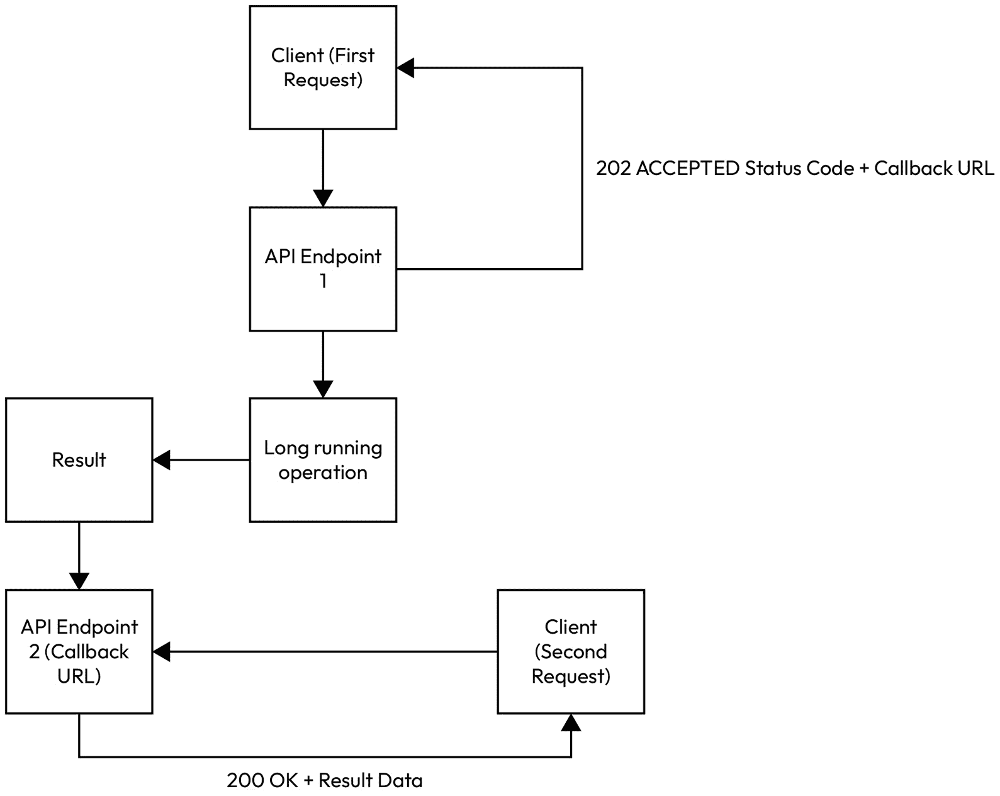

# 利用异步编程实现可伸缩性

每当我们执行一个函数时，我们都期望得到一个结果，但请求和输出结果之间发生了什么？

想象你正在镇上，有一堆任务要完成，但你也很饿，需要吃午餐。你走进一个位于购物中心内的披萨店。这家店会根据订单现做披萨。披萨的准备和烹饪大约需要十五分钟。你可以等在店里直到披萨做好，但你还需要去银行，银行在马路对面。披萨店的老板是你的朋友，并同意在你披萨准备好取时给你发短信。在你披萨烹饪的时候，你可以有机会完成其他事情；这是对时间更好的利用。

这是一个对**异步**函数的简单类比。走进披萨店是函数的开始，你在它烹饪的时候跑向银行是函数的运行。当你的手机响起，收到披萨准备好的短信时，这是函数返回其输出的时刻。

这个例子展示了异步函数的好处，它允许在等待特定操作完成的同时执行其他任务。烹饪你的披萨不会阻塞你整体的目标，即完成你的任务。

如果披萨店的老板不那么友好，要求你等到披萨做好才能离开，那么这就是一个**同步**操作的例子，与异步操作相反。同步操作会阻塞你整体目标的进展（完成你的任务）直到当前操作完成。

在可能的情况下，我们希望从异步编程中获取操作执行作为最小 API 一部分的好处。

在本章中，我们将涵盖以下主要主题：

+   在最小 API 中理解和实现异步模式

+   常见陷阱和挑战

# 技术要求

本章的代码可在 GitHub 仓库中找到：[`github.com/PacktPublishing/Minimal-APIs-in-ASP.NET-9`](https://github.com/PacktPublishing/Minimal-APIs-in-ASP.NET-9) 。运行代码需要 Visual Studio 和.NET 9 SDK。

# 在最小 API 中理解和实现异步模式

开篇的披萨类比可能是一个很好的、高级的说明，展示了异步编程和同步编程之间的区别。异步编程在最小 API 中非常重要，因为它为管理客户端和服务器之间的对话提供了很多灵活性。对于长时间运行的操作尤其有益，因为如果操作以线性方式运行，每个操作都会阻塞其他操作，这会损害请求的整体性能。

异步编程还提供了可扩展性优势，使 API 能够应对高需求。这是通过确保线程不被阻塞来实现的。异步端点的操作可以注册回调，以确保执行线程可以在回调解决之前继续运行其他任务。这带来了其他资源优势，如更好的线程池管理、降低 CPU 消耗和减少内存占用。所有这些对于最小化 API 至关重要，因为它们旨在尽可能简单和高效。

## 基于任务的异步模式

.NET 在其从.NET Framework 到.NET core 的演变过程中，看到了多种不同的异步编程模式的使用。在.NET Framework 时代，**基于任务的异步模式**（**TAP**）是管理异步执行的首选方法。它是在.NET 4 的 Task Parallel Library 中引入的，使用**Task**和**Task<T>**来表示异步操作，并提供了一种处理它们的结果或异常的方法。现在在.NET 9 中，TAP 的显式实现已经过时，但这个例子有效地演示了异步操作。如果我们在一个最小化 API 中使用它，它将位于端点体中，建立一个**Task<T>**，这将执行一个长时间运行的任务。然后我们会启动**Task**，同时告诉它一旦完成应该调用什么逻辑。我们可以在以下示例中看到这一点，该示例运行一个任务从另一个 API 获取数据，然后继续检查结果，在向客户端返回响应之前继续：

```cs
app.MapGet("/fetch-data", (HttpContext httpContext) =>
{
    HttpClient client = new HttpClient();
    string url =
        "https://jsonplaceholder.typicode.com/posts/1";
    // Initiate the asynchronous operation and return a
    // continuation task
    return client.GetStringAsync(url).ContinueWith(task =>
    {
        if (task.IsCompletedSuccessfully)
        {
            // Task completed successfully, return the data
            return httpContext.Response.WriteAsJsonAsync(
                new { data = task.Result }
            );
        }
        else if (task.IsFaulted)
        {
            // Task faulted, handle the exception
            var errorMessage =
                task.Exception.Flatten().InnerException
                    ?.Message ?? "An error occurred";
            httpContext.Response.StatusCode =
                StatusCodes.Status500InternalServerError;
            return httpContext.Response.WriteAsJsonAsync(
                new { error = errorMessage }
            );
        }
        else
        {
            // If task was cancelled or some other state,
            // handle accordingly
            httpContext.Response.StatusCode =
                StatusCodes.Status500InternalServerError;
            return httpContext.Response.WriteAsJsonAsync(
                new { error = "Unknown error occurred." }
            );
        }
    });
});
```

虽然这段代码可以在 API 端点中演示异步执行，但它可以读起来更加清晰。幸运的是，在.NET Framework 4.5 和.NET 5 中，引入了**async/await**关键字。

## 基于 async/await 的 TAP

**async/await** 关键字通过允许我们编写类似于同步代码的异步代码，使得异步编程更加易于访问。这大大提高了异步代码的可读性，因此也更容易理解。在一个最小化 API 中，我们旨在在 IDE 中节省空间，这一点非常有价值。

这是使用**async/await**而不是使用原始基于 Task 的语法时，上一个示例中的端点看起来像什么：

```cs
app.MapGet(
    "/fetch-data-async-await",
    async (HttpContext httpContext) =>
{
    HttpClient client = new HttpClient();
    string url =
        "https://jsonplaceholder.typicode.com/posts/1";
    try
    {
        // Asynchronously fetch data from the external
        // service
        string data = await client.GetStringAsync(url);
        await httpContext.Response.WriteAsJsonAsync(
            new { data}
        );
    }
    catch (HttpRequestException ex)
    {
        // Handle error (e.g., network issues, server
        // problems)
        httpContext.Response.StatusCode =
            StatusCodes.Status500InternalServerError;
        await httpContext.Response.WriteAsJsonAsync(
            new
            {
                error =
                    "Error fetching data: " + ex.Message
            });
    }
    catch (Exception ex)
    {
        // Handle any other exceptions
        httpContext.Response.StatusCode =
            StatusCodes.Status500InternalServerError;
        await httpContext.Response.WriteAsJsonAsync(
            new
            {
                error =
                    "An unexpected error occurred: " +
                        ex.Message
            });
    }
});
```

希望很明显，第二个示例中启动对其他 API 的异步调用的代码部分，比第一个示例中的对应部分更加简洁和简短。

在最小 API 中，我们不需要做太多就能使 API 端点与**async/await**兼容。注意，在第二个使用**async/await**的示例中，端点在路由之后定义的 lambda 表达式之前有**async**关键字。这，就像在常规.NET 函数和方法中一样，允许在函数体中使用**await**关键字。如果没有**async**关键字，**await**是不支持的。

第一个示例没有使用**async**关键字，但最终仍然能够创建一个异步操作。这看起来可能像是一种矛盾，直到我们考虑到，除了**async**之外，**await**在第一个示例中也明显缺失。因此，重要的是要记住，在最小 API 中，**async**关键字不是任何异步代码的先决条件，但它允许使用**await**，因此可以更简单地实现类似于同步的异步操作。

通过使用**async/await**，我们可以以简化的方式实现 TAP。

## 异步处理模式

另有一个定义良好的模式，称为**异步处理模式**，实现了异步执行。

有时被称为**延迟处理**，与 TAP 相比，这种模式可能相对复杂，但原理是相同的。控制流返回到函数的消费者，同时其他长时间运行的操作完成。然而，在这个模式中，函数的消费者不是 API 应用程序的主线程，而是向 API 端点发出请求的客户端。

*图 1* *.1* 通过延迟处理展示了执行过程：



图 11.1：跨越两个客户端请求的延迟处理

我们可以相对容易地将当前示例转换为使用延迟处理的版本。首先，我们需要创建一个端点，该端点开始执行长时间运行的任务，然后立即通过返回状态码来确认调用者。然而，仅状态码本身是不够的。我们必须返回一个客户端的回调 URL。此 URL 将路由到另一个端点，该端点将检查我们的长时间运行操作是否已完成。如果已完成，它将检索相关数据，然后将其作为响应返回给客户端。如果操作尚未完成，它仍然会响应客户端，表明操作仍在运行。

让我们从创建第一个端点开始，该端点将确认客户端请求开始长时间运行操作。我们还将创建一个字典来存储等待客户端通过回调收集的响应：

```cs
var results = new ConcurrentDictionary<Guid, string>();
// Endpoint to start the long-running background task
app.MapPost("/start-process", async () =>
{
});
```

由于字典是线程安全的，意味着.NET 将自动管理多个并发线程访问的场景，因此已将其添加为**ConcurrentDictionary**。例如，如果有多个请求到 API。

接下来，在**POST**端点的主体内部，我们生成一个**GUID**来表示挂起的请求，以及一个可以在回调响应中引用的**GUID**字符串版本：

```cs
var requestId = Guid.NewGuid();
var requestIdStr = requestId.ToString();
```

现在只剩下启动长运行任务，在将**GUID**返回给客户端之前，以便他们可以在回调请求中使用它来查看他们的结果是否已准备好检索：

```cs
// Start the long-running task
_ = Task.Run(async () =>
{
    await Task.Delay(10000); // Simulate a long-running
                             // task (10 seconds)
    results[requestId] = $"Result for {requestIdStr}";
    // Store result in dictionary
});
// Respond with the request ID
return Results.Ok(new { RequestId = requestIdStr });
```

现在客户端已经通过返回的**GUID**获得了唯一标识符，它可以在第二次请求中使用以获取结果。

让我们为此目的创建一个**GET**端点。该端点将比第一个端点简单得多。它将简单地尝试在字典中找到一个与传入的**GUID**参数匹配的键。如果字典包含请求的键值对，则原始的长运行操作完成。否则，它可能仍在运行或从未启动。**GET**端点必须处理这两种情况：

```cs
// Endpoint to get the result based on the request ID
app.MapGet("/get-result/{requestId}", (string requestId) =>
{
    if (Guid.TryParse(requestId, out var guid) &&
        results.TryGetValue(guid, out var result))
    {
        return Results.Ok(new { Result = result });
    }
    return Results.NotFound(new { Error =
        "Result not found or not yet completed."
    });
});
```

接下来，尝试依次调用这两个端点。如果你在第一个端点之后不到十秒内请求第二个端点，你应该得到一个带有**Result not found or not yet completed**消息的**404 NOTFOUND**结果，然后在十秒后得到预期的**GUID**结果。这将以简单的方式演示了延迟处理。

为了扩展你对这种执行模式的实践，你应该尝试更复杂的使用案例，例如在后台运行复杂的数学计算或进行数据库或网络请求。

# 常见陷阱和挑战

异步编程带来了一系列的陷阱和挑战。让我们看看在最小 API 中编写异步代码时应警惕的一些示例：

+   **死锁**：当并发操作由于阻塞而无法完成时，会发生死锁。在最小 API 中，这可以在主线程被阻塞时看到。在以下示例中，使用**Task.Run**可能导致死锁，因为它阻塞了主线程：

    ```cs
    // Deadlock-prone code
    public async Task<IActionResult> GetData()
    {
        var data = Task.Run(() =>
            GetDataFromDatabase()).Result; // Blocking
                                           // call
        return Ok(data);
    }
    ```

    避免死锁的简单方法是在运行任务时使用**await**，以确保调用不会阻塞主线程：

    ```cs
    public async Task<IActionResult> GetData()
    {
        var data = await Task.Run(() =>
            GetDataFromDatabase());
        return Ok(data);
    }
    ```

+   **资源管理**：在可能的情况下，管理数据库连接或文件句柄等资源的最小 API 代码应在异步上下文中适当地释放。

    任何实现**IDisposable**的资源都可以使用**using**语句在不再使用时自动释放资源。然而，当为资源编写异步代码时，尽量使用可用的**IDisposableAsync**。这意味着你将与**using**语句结合使用**await**：

    ```cs
    public async Task<IActionResult> GetData()
    {
        await using (var dbContext = new DbContext())
        {
            var data = await dbContext.GetDataAsync();
            return Ok(data);
        }
    }
    ```

+   **竞态条件**：竞态条件是多个线程同时访问和修改共享数据的结果。例如，如果你在你的最小 API 中有一个静态字段，并且有一个访问它进行修改的端点，你必须记住请求可以并发执行，多个客户端可能同时运行端点逻辑。这会导致你的 API 中的静态字段变得不一致，因此不准确。你必须确保对共享数据的每个操作都是*原子性*的——一个操作必须完成，然后另一个操作才能发生：

    ```cs
    private static int _counter = 0;
    public async Task<IResult> IncrementCounter()
    {
        var newCounterValue = _counter + 1;
        await Task.Delay(100); // Simulate async work
        _counter = newCounterValue;
        return Results.Ok(_counter);
    }
    ```

    在这个例子中，对**IncrementCounter**的多个请求可能导致**_counter**的不一致状态。

    解决这个问题的方法是使用同步机制来管理共享值的状态。最常用的同步机制是**锁**，它使用一个**对象**来阻止线程在访问特定值时执行。这意味着*锁定*它，防止其他线程访问，迫使它们等待轮到它们：

    ```cs
    private static int _counter = 0;
    private static readonly object _counterLock =
        new object();
    public async Task<IActionResult> IncrementCounter()
    {
        lock (_counterLock)
        {
            var newCounterValue = _counter + 1;
            _counter = newCounterValue;
        }
        await Task.Delay(100); // Simulate async work
        return Ok(_counter);
    }
    ```

    这个例子展示了如何建立和执行一个**锁**，以确保**_counter**一次只由一个线程更新，从而消除在 API 内部发生竞态条件的可能性。

异步编程可以为任何最小 API 项目增加一个新的复杂层，但我们已经在本章中证明，通过仔细的关注，它可以是一个优化 API 效率的强大工具。让我们回顾一下本章涵盖的内容。

# 概述

我们以披萨店类比作为本章的开端。我们通过将其比作一个外卖食品订单来介绍异步编程，你不必简单地等待，而是继续你的正在进行中的任务，直到披萨准备好让你取走。

我们随后为理解异步代码如何使最小 API 受益奠定了基础，它通过最佳使用硬件资源和应用可扩展性的范围。

我们探讨了常见的异步编程模式，即 TAP 和延迟执行模式，以及如何使用**async/await**使异步代码更易于阅读，使其看起来更像同步代码的示例。我们探讨了延迟执行如何使 API 在客户端级别异步，允许客户端收到确认，表明他们的请求已被接收，并附带一个唯一的标识符供他们参考，从而将整体端到端执行扩展到多个 API 请求。

最后，我们通过三个常见的例子解决了异步编程带来的常见挑战，尤其是在最小化 API 中。第一个是死锁，由于多个线程或操作之间的竞争，全局执行无法继续。接下来是资源管理不善，代码在释放对外部资源连接时没有考虑到异步上下文。最后，我们探讨了竞争条件，这是多个操作竞争更新共享值或资源状态的经典例子，导致行为不一致和数据的准确性不准确。

没有软件开发者能够轻易逃避管理异步执行的需求，尤其是在.NET 最小化 API 中。因此，保持警惕，结合书中早期学到的良好测试和性能分析技术，可以在尽可能减少痛苦的情况下使体验达到最佳。

接下来，我们将探讨优化任何最小化 API 性能的关键方法——缓存。
