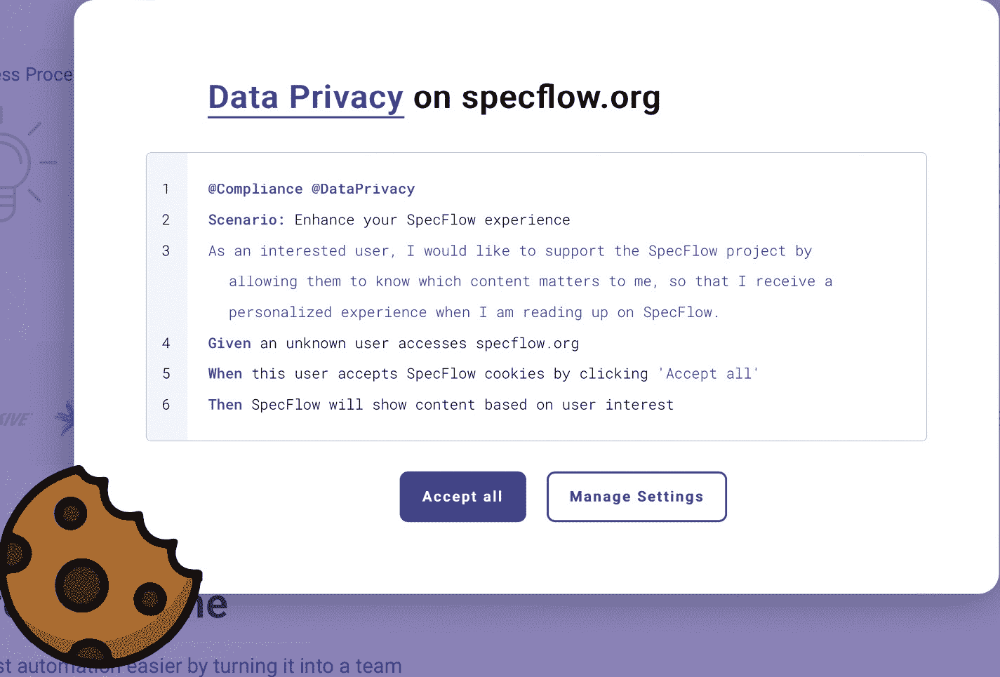

# 第二章：元编程概念

现在我们对元编程如何为您带来好处有了一些想法，我们需要介绍基本概念。

在使用元编程时，您可以从运行环境免费获得元数据，并且有机会显式地添加更多。通过显式性，您可以在代码库中实现清晰度，并为编写和阅读代码的开发者提供透明度。

您的源代码中的一些部分将受益于更多的显式元数据，而不是隐式地、神奇地执行一些可能难以让开发者推理其原因的操作。

显式性也带来了在代码中表示业务领域语言的可能性和更高的表达性。

在本章中，我们将涵盖以下主题：

+   隐式 - 使用已有的内容

+   显式 - 代码的额外修饰

+   领域特定语言

到本章结束时，您应该对可以使用的不同元编程概念有良好的感觉，知道何时使用哪个概念，以及每个概念的好处。

# 技术要求

您可以在 GitHub 仓库中找到本章使用的所有源代码：[`github.com/PacktPublishing/Metaprogramming-in-C-Sharp/tree/main/Chapter2`](https://github.com/PacktPublishing/Metaprogramming-in-C-Sharp/tree/main/Chapter2)。

# 隐式 - 使用已有的内容

编译**C#**的编译器解析我们所有的代码，最终创建被称为**IL-code**（中间语言代码）的内容。这是标准化的，并且是通用语言基础设施（Common Language Infrastructure）的**ECMA-335**标准的一部分。您可以在以下链接中了解更多关于标准的信息：[`www.ecma-international.org/publications-and-standards/standards/ecma-335/`](https://www.ecma-international.org/publications-and-standards/standards/ecma-335/)。这种代码不是系统 CPU 所能理解的，它需要额外的步骤才能让 CPU 理解。程序的运行过程中，翻译的最后一个步骤是由**.NET 运行时**执行的，它解释 IL 代码，并为程序运行的计算机的 CPU 类型生成必要的指令。

通过查看二进制输出，您可能无法确定差异。但通过使用如**ildasm**之类的反编译工具或更直观的工具，如**JetBrains dotPeek**（[`www.jetbrains.com/decompiler/`](https://www.jetbrains.com/decompiler/))，我们可以一窥我们的程序看起来是什么样子。

以以下程序为例：

```cs
using System;
public class Program
{
    public static void Main()
    {
        Console.WriteLine("Hello world!");
    }
}
```

编译此代码将生成一个**动态链接库**（**DLL**）文件，当使用反编译器打开文件时，我们会看到如下内容：

```cs
.class private auto ansi '<Module>'
{
}
.class public auto ansi beforefieldinit Program
    extends [System.Runtime]System.Object
{
    .method public hidebysig static
        void Main () cil managed
    {        .maxstack 8
        IL_0000: ldstr "Hello world!"
        IL_0005: call void [System.Console]System.
            Console::WriteLine(string)
        IL_000a: ret
    }
    .method public hidebysig specialname rtspecialname
        instance void .ctor () cil managed
    {
        .maxstack 8
        IL_0000: ldarg.0
        IL_0001: call instance void [System.Runtime]System.
            Object::.ctor()
        IL_0006: ret
    }
}
```

在基于 x86/AMD64 的 CPU 上，这随后会被转换成如下反汇编代码：

```cs
L0000: mov rcx, 0x2217fb34a50
```

```cs
L000a: mov rcx, [rcx]
```

```cs
L000d: jmp 0x00007ffef72f2fc8
```

实际的 **Hello world!** 字符串随后被放置在由第一个 **mov** 指令使用的内存位置。如果你对尝试代码并自己查看其翻译感兴趣，我建议你前往 [`sharplab.io`](https://sharplab.io)。

在最终编译的结果中，实际上没有任何元数据，这使得我们无法以任何有意义的方式对代码进行推理。

虽然 IL 包含了我们编写的一切，但所有类型信息都是完整的（类型名称、方法名称等）。

有了这些，我们就为成功进行一些适当的元编程做好了准备。

## 利用反射的强大功能

所有这些信息都对我们开放，并且这一切都始于强大且我个人最喜欢的命名空间 **System.Reflection**。它包含了所有代表我们编写的不同代码元素的 C# 类型。由于 C# 是在托管运行时之上运行的托管语言，我们可以获得关于我们编写的所有代码的详细信息。

由于我们创建的每个类型以及我们将创建的类型都是 **Object** 类型的派生类型，因此每个派生类型都固有地获得了其方法和属性。其中一个方法被称为 **GetType()**。此方法返回一个对象类型的实例，形式为 **Type**。它包含了有关特定类型的所有详细信息——从它所在的命名空间，到字段、属性、方法，以及更多。对于类型，我们甚至可以查看它继承的内容以及它可能实现的接口。我们甚至可以看到它定义在哪个程序集（DLL）中。

如果你查看对象关系映射器，如 **Microsoft 的 Entity Framework**、**Dapper**、**NHibernate** 或甚至是 **MongoDB C# 驱动程序**，它们都使用反射来推理你必须翻译成底层数据存储期望的类型。对于关系型存储，它通常翻译成正确的 **SQL** 语句，而对于 MongoDB，它将是正确的 MongoDB **Binary JSON** （**BSON**）对象。

同样，从 .NET 类型序列化为其他格式（如 JSON）的东西也会这样做。例如，**Newtonsoft.JSON** 或内置的 **System.Text.Json** 命名空间利用反射来了解需要翻译的内容。

假设你有一个 **Person** 类型：

```cs
public class Person
{
    public string FirstName { get; set; }
    public string LastName { get; set; }
    public string SocialSecurityNumber { get; set; }
}
```

一个极其简单的 JSON 转换可以轻松完成：

```cs
public string SerializeToJson(object instance)
{
    var stringBuilder = new StringBuilder();
    var type = instance.GetType();
    var properties = type.GetProperties();
    Var first = true;
    stringBuilder.Append("{\n");
    foreach( var property in properties )
    {
        if (!first)
        {
            StringBuilder.Append(",\n");
        }
        stringBuilder.Append($"   \"{property.Name}\":
          \"{property.GetValue(instance)}\"");
    }
    stringBuilder.Append("\n}");
}
```

这可以按以下方式使用：

```cs
var person = new Person
{
   FirstName = "Jane",
   LastName = "Doe",
   SocialSecurityNumber = "12345abcd"
};
Console.WriteLine(Serializer.SerializeToJson(person));
```

运行此代码的输出将产生一些漂亮的 JSON：

```cs
{
   "FirstName": "Jane",
   "LastName": "Doe",
   "SocialSecurityNumber": "12345abcd"
}
```

代码基本上从实例中获取类型信息，并获取其上的属性。它输出一个包含属性名称的字符串，并利用 **PropertyInfo** 从实例中获取值，并仅输出其 **.ToString()** 表示形式。

显然，这个示例非常简单，并且对于复杂类型不支持递归，也不识别已知的 JSON 原始类型。但这证明了你可以多么容易地获取这些信息。

隐式元数据和 .NET 的类型系统可以非常强大。您在反射的洞穴中走得越深，可能就越想继续深入并做更多的事情。另一方面，对于您自动执行的所有事情，您都会失去对正在发生的事情的透明度。这需要平衡，并尽可能接近最小惊讶元素。

对于某些事情，最好是做得非常明确。还有一些元数据无法通过编译器生成的信息来发现，唯一的方法就是非常明确地指定。

# 显式 - 代码的额外修饰

几乎所有的代码元素都可以添加额外的信息。这些被称为 **属性**。属性是将元数据与元素关联的强大方法。在 .NET 框架本身中，您会看到许多可以使用的属性类型。

在 **System.ComponentModel.DataAnnotations** 命名空间中，您可以找到一些添加由运行时使用的元数据的属性示例。在这里，您将找到用于添加验证元数据的属性。ASP.NET 会检测这些属性的用法，并检查发送到控制器操作的实体是否符合应用规则。正如我们在 *第一章* 简要提到的，“元编程如何为您带来好处？”，使用我们的 **RegisterPerson** 类型，我们可以指定哪些属性是必需的。它包含更多内容，例如 **[StringLength]** 和 **[Range]**。这些都是框架和它们所支持的组件识别的元数据的优秀示例。

框架中的一些属性被编译器识别，并将指导编译器执行某些操作。例如，**[Flags]** 属性可以添加到枚举中，指示它要求每个值都表示一个位字段：

```cs
[Flags]
public enum MyEnum
{
    Flag1 = 1,
    Flag2 = 1 << 1,
    Flag3 = 1 << 2,
    Flag4 = 1 << 3
}
```

使用这种类型的枚举，我们定义标志，每个标志都是一个左移位，用于将数字移动到正确的位的位置。您也可以通过给出实际的十进制或十六进制数来做到这一点（**1**、**2**、**4** 或 **8**，或 **0x1**、**0x2**、**0x4**、**0x8**、**0x10**，等等）。

**System.Text.Json** 序列化器也使用了元数据。它使用元数据来确定如何序列化或反序列化所提供的内容。例如，它可以忽略对象中的属性：

```cs
public class Person
{
    public string FirstName { get; set; }
    public string LastName { get; set; }
    [JsonIgnore]
    public string FullName => $"{FirstName} {LastName}";
    public string SocialSecurityNumber { get; set; }
}
```

序列化此实例将省略 **FullName**。

## 创建自定义属性

您可以通过添加您想要为代码添加的元数据来轻松创建自己的自定义属性。所有属性都可以接受带有额外元数据的参数，这些元数据将与它们关联。这为您提供了机会，可以非常具体地指定您想要与被修饰的代码元素关联的数据作为元数据。

添加到属性中的所有元数据都需要在编译时由编译器解析。这限制了我们只能使用典型的基本类型和本质上是常量的东西。你不能动态创建实例并将其传递给属性。

一个属性的例子可能是用于描述包含**个人可识别信息**（**PII**）的类型或属性。这非常有用，可以让你在以后推理你的代码时知道正在收集哪些 PII 信息，并将其展示给用户。根据欧盟的隐私法律**GDPR**，如果你的公司在接受审计或发生与 GDPR 相关的事件时需要向当局报告，这也可以作为一个报告机制。

一旦你用这种元数据标记了类型和属性，你就有机会用于未来的用例——例如，加密 PII 数据或其他任何东西。

创建自定义属性的基本形式如下：

```cs
public class PersonalIdentifiableInformationAttribute :
Attribute
{
}
```

**PersonalIdentifiableInformationAttribute**类型需要继承基础**Attribute**类型。编译器还期望你创建的类型名称中包含**Attribute**作为后缀。然而，当使用你自定义的属性时，你可以在名称中省略**Attribute**，编译器会将它映射到带有后缀的完整名称。

下一步你需要指定的是实际上是一点编译器的元数据。这是通过使用**[AttributeUsage]**属性来完成的。使用它，我们需要指定支持哪些目标代码元素，并且我们可以通过*或操作*（**OR**操作）来支持多个。

对于**PersonalIdentifiableInformationAttribute**，我们通常希望它在类、属性和字段中使用：

```cs
[AttributeUsage(AttributeTargets.Class | AttributeTargets.
Property | AttributeTargets.Parameter, AllowMultiple = false)]
public sealed class PersonalIdentifiableInformationAttribute :
Attribute
{
}
```

此外，我们指定我们不希望允许同一属性的多个副本。一个好的做法是让你的属性非常具体，不要创建任何属性的继承链。这将使你的属性成为一个**密封**类型，从 C#的角度来看不允许继承。

GDPR 提到的一件事是记录收集目的。因此，为了补充这一点，我们可以包括作为可选元数据的用途。你可以通过添加一个接受元数据作为参数的构造函数来实现这一点，如果你想让它成为可选的，你可以提供一个默认值：

```cs
[AttributeUsage(AttributeTargets.Class | AttributeTargets.
Property | AttributeTargets.Parameter, AllowMultiple = false)]
public sealed class PersonalIdentifiableInformationAttribute :
Attribute
{
    public PersonalIdentifiableInformationAttribute(string
      purpose = "")
    {
        Purpose = purpose;
    }
    public string Purpose { get; }
}
```

如你所见，除了添加带有元数据参数的构造函数外，你还需要添加**Purpose**属性来公开元数据。

因此，我们可以开始将**PersonalIdentifiableInformation**属性应用于某些对象上的属性，例如**Person**对象：

```cs
public class Person
{
    [PersonalIdentifiableInformation("First name of person")]
    public string FirstName { get; set; }
    [PersonalIdentifiableInformation("Last name of person")]
    public string LastName { get; set; }
    [PersonalIdentifiableInformation("Unique identifier for
      person")]
    public string SocialSecurityNumber { get; set; }
}
```

我们将在*第五章*中更深入地探讨如何进一步利用它，*利用属性*。

我们已经讨论了如何通过隐式结构来推理我们的代码，以及我们如何添加显式的额外元数据和甚至我们自己的自定义数据。那么反过来呢？我们的意思是从某个东西开始，基本上生成代码。

正如我们之前讨论的，编程语言本身基本上是一种高级元数据语言，旨在能够更有效地表达代码。

以这种心态，实际上没有什么能阻止我们发明自己的语言，并利用基础设施生成运行代码。

# 领域特定语言

创建自己的**领域特定语言**（**DSL**）的概念并不是什么新鲜事，公司们已经做了很多年了。这可以是一个非常有效的方法，将你的领域专家纳入其中，并为他们提供一种用他们更熟悉的语言贡献代码的方式。他们编写的代码通常处于一个更高的层次，并且拥有由底层代码结构支持的词汇表，而这些底层代码结构实际上在做着繁重的工作。

将其视为一种编程语言和你的业务的编译器，用来表达你的业务问题。

它也可以用于技术方面，而不仅仅是业务方面——例如，如果你有复杂的状态机或工作流程，它们有自己的词汇表，你希望将其转化为更容易推理的语言。你也可以想象这种语言以 JSON、YAML 或甚至 Excel 等众所周知的文件格式表示。

生成这种高级表示形式的代码的目的在于，你可以有机会使最终结果更加优化，你可以在它到达运行时之前做出优化流程的决定。你还可以让你的应用程序启动更快，因为它不需要在启动时解析东西并将其传递给运行它的引擎。最终，它将只是运行代码，就像你的解决方案中的任何其他代码一样。

## Gherkin – 技术样本

如果你熟悉编写单元测试，典型的结构是**准备**、**执行**，然后是**断言**。一个测试可能看起来像这样：

```cs
public class CalculatorTests
{
    [Fact]
    public void Add()
    {
        // Arrange
        var left = 5;
        var right = 3;
        var expectedResult = 8;
        // Act
        var actualResult = Calculator.Add(left, right);
        Assert.Equal(expectedResult, actualResult, 0);
    }
}
```

这段代码测试了一个计算器，以验证其加法功能是否按预期工作。它是通过设置输入和预期结果，然后调用计算器，最后通过断言来验证结果，断言结果应该与预期结果相同来完成的。

虽然这是更传统的**测试驱动开发**（**TDD**）风格，但还有一种叫做**行为驱动设计**（**BDD**）的方法。这种方法更多地关注系统的行为以及系统各部分之间的交互，而不是其状态。为了表达这种交互，创建了一个名为**Gherkin**的领域特定语言（DSL）。在基本形式上，它与 TDD 的“arrange”（准备）、“act”（执行）和“assert”（断言）相对应，即“给定”、“当...时”和“然后”。此外，它还包括了功能、场景和步骤的概念。目标是编写系统的具体功能需求。

对于高级功能，领域专家很难对 C#代码进行推理，以验证我们是否测试了正确的东西或是否交付了预期的内容。

使用正确的工具，我们可以用普通的英语来描述一个系统的功能，并将其连接到执行实际代码的代码片段，以便测试或指定。

一个很好的实现例子是.NET BDD 框架**SpecFlow**（[`specflow.org/`](https://specflow.org/)）。当你访问他们的网站时，你会看到他们的数据隐私对话框，并且他们包括了场景的规范：



图 2.1 - SpecFlow 数据隐私对话框

SpecFlow 采用 Gherkin，并提供了一个编译器，该编译器将 DSL 编译为可运行的代码，并混合了必要的代码来调用测试的功能。

我们将在第六章“动态代码生成：在运行的应用程序中发射 IL 代码”中探讨如何在运行时实现这一点，以及如何利用.NET 表达式创建代码，并在第八章“构建和执行表达式”中探讨这些代码如何即时编译。在第十六章“生成代码”中，我们将探讨如何在编译器级别真正实现这一点。

# 摘要

现在，你应该对元编程的不同概念有了更清晰的认识，并对何时使用什么有了更好的理解。本书中会多次提醒你，要小心不要做太多开发者可能不理解的内隐或神奇的事情。这种平衡非常难以掌握，而且对于个人开发者以及整个团队来说，也涉及一定程度的成熟度。

.NET 编译器和它产生的代码给了你作为开发者很大的权力。明智地使用它。

为了消除神秘感并展示元编程在日常生活中的更多应用，我们将在下一章探讨微软的 ASP.NET 如何利用元编程技术。这应该能让你感到它并不那么神秘，同时也能让你感受到它如何提高你的工作效率并提供帮助。
