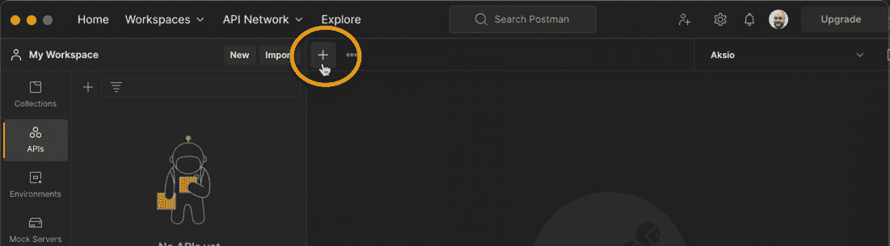
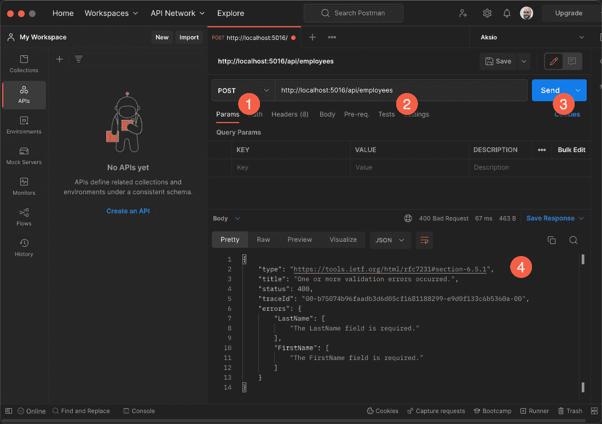

# 通过现有的实际案例来揭秘

本章中，我们将探讨 Microsoft 的**ASP.NET**如何利用元编程来自动化繁琐的配置。

自从 2009 年**ASP.NET MVC**的第一个版本发布以来，为了提高开发者的生产力，已经进行了大量的自动化工作。本章的主要目标是通过对元编程的揭秘，展示您可能已经利用了利用元编程的优势。

本章将涵盖以下主题：

+   ASP.NET 控制器

+   ASP.NET 验证

到本章结束时，您将了解 ASP.NET 如何通过非侵入式方法利用元编程，并看到自动化的好处。

# 技术要求

要遵循本章的说明，您需要以下内容：

+   安装了 Windows、macOS 或 Linux 的计算机

+   **.NET 6 SDK**

+   建议使用代码编辑器或 IDE（例如 Visual Studio Code、Visual Studio 或 JetBrains Rider）

本章的完整代码可以在以下位置找到：[`github.com/PacktPublishing/Metaprogramming-in-C-Sharp/tree/main/Chapter3`](https://github.com/PacktPublishing/Metaprogramming-in-C-Sharp/tree/main/Chapter3)

# 系统的先决条件

本章将具体深入到代码中，因此您需要准备好您的系统。

我们首先需要的是 Microsoft .NET SDK。请访问[`dot.net`](https://dot.net)，点击**下载**按钮下载 SDK。

重要提示

本书基于.NET SDK 的*第 7 版*。

要创建和编辑文件，这完全取决于您的个人喜好以及您所运行的系统。Visual Studio Code 和 JetBrains Rider 都可在 Windows、macOS 和 Linux 上使用。Visual Studio 仅适用于 Windows 和 macOS。您可以从以下链接下载任何这些编辑器；如果您没有偏好，VSCode 轻量级且能快速让您开始使用：

+   **VSCode** ([`code.visualstudio.com/`](https://code.visualstudio.com/))

+   **JetBrains Rider** ([`www.jetbrains.com/rider/`](https://www.jetbrains.com/rider/))

+   **Visual Studio** ([`visualstudio.com/`](https://visualstudio.com/))

一旦您选择了您的编辑器，请继续按照您选择的产品相关的安装过程进行操作。

要调用 API，您可以使用网络浏览器、**Wget**或**cURL**，但我推荐使用**Postman**([`www.postman.com/`](https://www.postman.com/))进行此操作。本书中的示例将使用 Postman。

# ASP.NET 控制器

在不同的框架中，明确注册应用程序的组件是很常见的。发现这些组件并自动进行自我注册变得越来越流行。但非常常见的情况是，您需要亲自手动添加所有内容。

虽然这些注册的进行过程非常清晰，但手动注册的缺点是您基本上添加了不直接贡献于您试图实现的业务价值的代码。这也是一种高度可重复的代码，往往最终会出现在包含所有初始化的大文件中。

例如，使用 **ASP.NET Core 6** 我们得到了一个全新的最小化 API，它旨在具有更小的占用空间和更少的启动仪式。您可以使用三行设置代码开始创建 Web API，然后随意添加您的 API 作为 HTTP 方法并指定路由。

这一切看起来都很不错，但随着项目的增长，很容易变得难以维护。

让我们更具体地探讨一下它是如何工作的。

在您的系统上为这次操作创建一个名为 *第三章* 的新文件夹。在这个文件夹中，我们想要创建一个简单的 ASP.NET 网络应用程序。这可以通过多种方式完成，具体取决于您选择的编辑器/IDE 以及个人偏好。然而，在本书中，我们将坚持使用命令行来完成，因为这样可以在所有环境中工作。

打开命令行界面（Windows CMD、macOS 终端、Linux bash 或类似）。导航到您为本次操作创建的文件夹（*第三章*）。然后运行以下命令：

```cs
dotnet new web
```

这将产生一个最小的设置以开始。在您的编辑器/IDE 中打开文件夹/项目。您的 **Program.cs** 文件应该看起来像这样：

```cs
var builder = WebApplication.CreateBuilder(args);
var app = builder.Build();
app.MapGet("/", () => "Hello World!");
app.Run();
```

它基本上设置了一个网络应用程序，并在根级别添加了一个路由，当使用您的网络浏览器导航到它时，将返回 **"Hello World!"**。

**app.MapGet()** 调用是一种非常简单的方式来暴露端点，实际上可以用来构建简单的 REST API。让我们创建一个简单的 API 来返回系统的员工信息。

## 自定义 HTTP Get 处理器

首先，创建一个名为 **Employee.cs** 的新文件，并将以下内容添加到文件中：

```cs
namespace Chapter3;
public record Employee(string FirstName, string LastName);
```

这只是一个简单的员工表示，包括他们的名字和姓氏。显然，在一个合适的系统中，您会添加更多属性到这个中。但为了这个示例，这已经足够了。

在设置了 **Employee** 类型后，我们现在可以将我们的 **Get** 动作更改为不同的路由，并仅返回 **Employee** 类型的集合。将 **.MapGet()** 方法调用替换为以下内容：

```cs
app.MapGet("/api/employees", () => new Employee[]
        {
            new("Jane", "Doe"),
            new("John", "Doe")
        });
```

在文件顶部，您还需要为 **Chapter3** 命名空间添加一个 **using** 语句。新的 **Program.cs** 文件应该看起来如下：

```cs
using Chapter3;
var builder = WebApplication.CreateBuilder(args);
var app = builder.Build();
app.MapGet("/api/employees", () => new Employee[]
        {
            new("Jane", "Doe"),
            new("John", "Doe")
        });
app.Run();
```

您可以使用 **dotnet run** 从您的终端/控制台运行此程序，或者如果您更喜欢使用您的 IDE 运行它，您应该得到一个运行中的程序，显示如下内容：

```cs
info: Microsoft.Hosting.Lifetime[14]
```

```cs
      Now listening on: https://localhost:7027
```

```cs
info: Microsoft.Hosting.Lifetime[14]
```

```cs
      Now listening on: http://localhost:5016
```

```cs
info: Microsoft.Hosting.Lifetime[0]
```

```cs
      Application started. Press Ctrl+C to shut down.
```

```cs
info: Microsoft.Hosting.Lifetime[0]
```

```cs
      Hosting environment: Development
```

```cs
info: Microsoft.Hosting.Lifetime[0]
```

```cs
      Content root path: /Users/einari/Projects/Metaprogramming-in-C/Chapter3/
```

两条显示**Now listening on:**的行将在您的计算机上具有不同的端口，因为它们是在创建项目时随机分配的。将 URL 与**.MapGet()**方法中的**/api/employees**结合。它可能类似于**https://localhost:7027/api/employees**或非 HTTPS 的**http://localhost:5016/api/employees**，只需记得将您的端口放入其中。将这个组合 URL 在浏览器中导航到它。您应该看到以下内容：

```cs
[{"firstName":"Jane","lastName":"Doe"},{"firstName":"John","lastName":"Doe"}]
```

显然，如果您直接在程序文件中添加这些 API 端点，并在处理程序方法中添加额外的逻辑，那么这个文件将会变得很大，难以阅读和维护。

这是我们能够大幅改进并让 ASP.NET 变得聪明的地方。让我们先为这个创建一个控制器。

## 控制器

向项目中添加一个名为**EmployeesController.cs**的新文件。使文件看起来像这样：

```cs
using Microsoft.AspNetCore.Mvc;
namespace Chapter3;
[Route("/api/employees")]
public class EmployeesController : Controller
{
    [HttpGet]
    public IEnumerable<Employee> AllEmployees()
    {
        return new Employee[]
        {
            new("Jane", "Doe"),
            new("John", "Doe")
        };
    }
}
```

现在，这将创建一个利用 ASP.NET 中可用的 C#属性显式元数据的 Web API 控制器。在**EmployeesController**类之前，您有**[Route]**属性，它告诉控制器将位于哪个基本路由。然后我们有一个我们想要表示特定 HTTP 动词的方法；这是**[HttpGet]**属性。

我们已经将代码配置为能够被 ASP.NET 引擎本身自动发现和配置。我们所需做的只是更改此应用程序的启动方式，并指示 ASP.NET 向我们的系统中添加控制器。打开**Program.cs**文件，将其内容替换为以下内容：

```cs
var builder = WebApplication.CreateBuilder(args);
builder.Services.AddControllers();
var app = builder.Build();
app.MapControllers();
app.Run();
```

**builder.Services.AddControllers()**调用将指示 ASP.NET 发现当前程序集中的所有控制器。您会注意到的第二个调用是**app.MapControllers()**。此调用将所有控制器映射到元数据中指定的路由。

通过运行此应用程序并导航到之前相同的 URL，我们应该看到完全相同的结果。

现在这种模型的美妙之处在于，我们可以非常容易地添加第二个控制器，而无需进入应用程序的配置来获取配置。它将只是被发现并自动存在。

这意味着我们现在可以专注于构建业务价值，并且默认情况下更易于管理和维护，尤其是在您将其他开发者引入其中共同工作或有人继承您的代码库时。

# ASP.NET 验证

当对 ASP.NET 进行 HTTP 请求时，它将通过一个由不同中间件组成的管道，这些中间件具有特定的职责。这个管道完全可由您作为开发者进行配置和扩展。默认情况下，它预配置了处理发送到请求的对象验证的特定中间件。此验证引擎识别可以应用于对象的元数据形式的规则。此元数据再次基于 C#属性。

让我们从稍微改变一下我们的**Employee**对象开始。打开**Employee.cs**文件，使其看起来如下所示：

```cs
public record Employee(
    [Required]
    string FirstName,
    [Required]
    string LastName);
```

这通过将**[Required]**属性添加到它们中，使**FirstName**和**LastName**属性成为必填项。ASP.NET 管道将检测到这一点，并检查任何发送的输入是否包含这些属性值。

然而，ASP.NET 不会为你决定如何处理无效对象；它只是为你填充一个名为**ModelState**的对象，让你决定如何处理这个问题。

为了处理像注册新员工这样的操作，我们需要在我们的控制器中有一个处理该操作的动作。打开**EmployeesController**并添加以下**Register**方法：

```cs
using Microsoft.AspNetCore.Mvc;
namespace Chapter3;
[Route("/api/employees")]
public class EmployeesController : Controller
{
    [HttpPost]
    public IActionResult Register(Employee employee)
    {
        if (!ModelState.IsValid)
        {
            return ValidationProblem(ModelState);
        }
        // ...
        // Do some business logic
        // ...
        return Ok();
    }
}
```

注意到**ModelState.IsValid**语句。如果有无效的验证规则，它将返回包含在**ModelState**中找到的错误的结果**ValidationProblem**。

运行应用程序并打开之前讨论过的 Postman。在 Postman 中，你可以通过点击带有**+**符号的按钮来创建一个新的请求：



图 3.1 - 在 Postman 中创建新的请求

这将创建一个新的标签页，就像一个常规的网页浏览器，其中包含请求的所有内容。在请求的左侧下拉菜单中选择**POST**作为 HTTP 动词，然后输入我们 API 的 URL。现在你可以简单地点击**发送**按钮，在下面的部分查看结果：



图 3.2 – 创建包含请求详情的新标签页

由于我们实际上没有传递一个对象，所以没有任何属性被设置。因此，列出的错误将表明这些属性是必需的。

## 自动连接模型状态处理

在 ASP.NET 中，一切围绕着被称为中间件的东西展开——这些是执行单个任务的小型、专用代码块，然后将其传递给下一个中间件。每个由 ASP.NET 处理的 HTTP 请求都有这些中间件，甚至处理控制器的代码也是其中之一。每个中间件都可以决定是否继续到下一个中间件，或者是否带有或没有错误退出。

控制器处理器只是我们可以利用的许多形式化中间件之一。

你可以在这里找到有关中间件的更多详细信息：

[`learn.microsoft.com/en-us/aspnet/core/fundamentals/middleware/?view=aspnetcore-7.0`](https://learn.microsoft.com/en-us/aspnet/core/fundamentals/middleware/?view=aspnetcore-7.0)

如果你永远不希望无效状态进入你的控制器，并想消除开发者手动执行此操作的可能性，那么我们可以将特定的中间件放入管道中，这样我们就可以在甚至触及控制器之前阻止它。

ASP.NET 有一个**操作过滤器**的概念。它在控制器执行任何操作之前被调用，并允许我们决定是否继续管道。您可以在以下位置了解更多关于操作过滤器的内容：[`learn.microsoft.com/en-us/aspnet/core/mvc/controllers/filters?view=aspnetcore-7.0`](https://learn.microsoft.com/en-us/aspnet/core/mvc/controllers/filters?view=aspnetcore-7.0)。

让我们创建一个名为**ValidationFilter.cs**的新文件，并使其看起来如下所示：

```cs
using Microsoft.AspNetCore.Mvc;
using Microsoft.AspNetCore.Mvc.Filters;
namespace Chapter3;
public class ValidationFilter : IAsyncActionFilter
{
    public async Task OnActionExecutionAsync(ActionExecutingContext context, ActionExecutionDelegate next)
    {
        if (context.ModelState.IsValid)
        {
            await next();
        }
        else
        {
            context.Result = new BadRequestObjectResult(new ValidationProblemDetails(context.ModelState));
        }
    }
}
```

这将接管检查**ModelState**是否有效的任务。带有**await next()**的行是管道的延续。因此，只有在状态有效时才调用此操作，我们就可以避免在无效状态下到达控制器。相反，我们随后创建与 ASP.NET 管道在从控制器调用**ValidationProblem**方法时创建的相同对象，并返回此对象。

我们可以简化控制器，使其看起来如下所示：

```cs
using Microsoft.AspNetCore.Mvc;
namespace Chapter3;
[Route("/api/employees")]
public class EmployeesController : Controller
{
    [HttpPost]
    public IActionResult Register(Employee employee)
    {
        // ...
        // Do some business logic
        // ...
        return Ok();
    }
}
```

此代码根本不需要考虑**ModelState**，只是假设它已经被处理，从而简化了每个控制器的实现，使其专注于其单一目的——注册员工。对于大多数控制器来说，这将是可行的，实际上，你现在正在消除开发者忘记在执行业务逻辑之前检查有效性的可能性。

最后一个拼图是要将其连接到 ASP.NET 管道中。打开**Program.cs**文件，并将其内容更改为以下内容：

```cs
using Chapter3;
var builder = WebApplication.CreateBuilder(args);
builder.Services.AddControllers(mvcOptions => mvcOptions.Filters.Add<ValidationFilter>());
var app = builder.Build();
app.MapControllers();
app.Run();
```

**.AddControllers()**调用接受一个委托，允许我们配置**MvcOptions**。在此之内，我们可以添加我们新的操作过滤器。

运行应用程序，并通过点击 postman 内的**发送**按钮验证您是否得到了完全相同的结果。

# 摘要

在本章中，我们学习了如何利用.NET 运行时的力量来简化现有技术的使用，使得使用该技术的开发者能够更容易地实现这一点。通过在正确上下文中使用元数据，我们可以专注于交付业务价值，而无需担心如何进行配置。它还自动为我们提供了一种遵循的结构，从长远来看，这将产生更易于维护、扩展和可预测的代码库。通过添加我们刚才所做的操作过滤器，我们添加了一个所谓的跨切面关注点，我们将在*第十三章*中更详细地回顾，即*应用* *跨切面关注点*。

在下一章中，我们将深入了解框架（如 ASP.NET）如何实现发现和自动化，以及我们如何利用.NET 运行时类型系统来发现类型和元数据，以实现类似的功能。

# 第二部分：利用运行时

在本部分中，您将看到.NET 运行时的强大之处，并深入了解其元编程能力的细节。您将看到运行时提供的不同元编程模型，并通过实际示例了解它们如何被利用。

本部分包含以下章节：

+   *第四章*, *使用反射进行类型推理*

+   *第五章*, *利用属性*

+   *第六章*, *动态代理生成*

+   *第七章*, *表达式的推理*

+   *第八章*, *构建和执行表达式*

+   *第九章*, *利用动态语言运行时*
