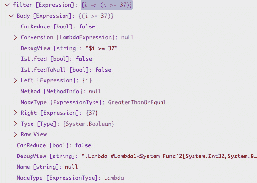
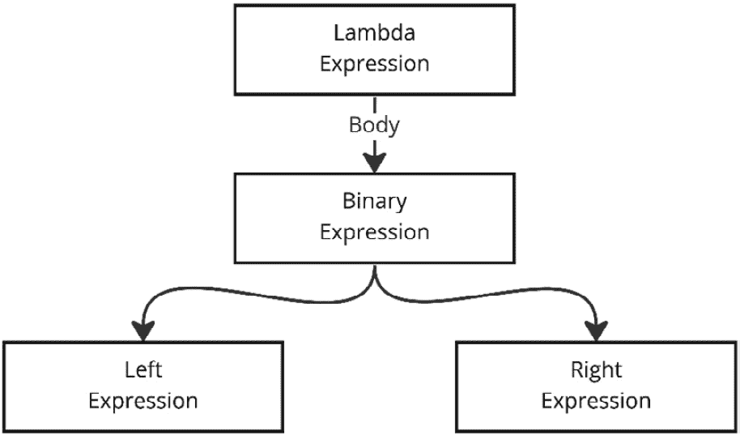
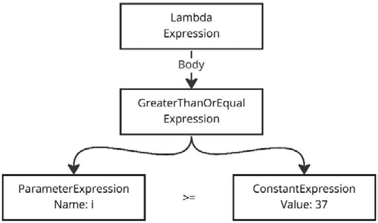
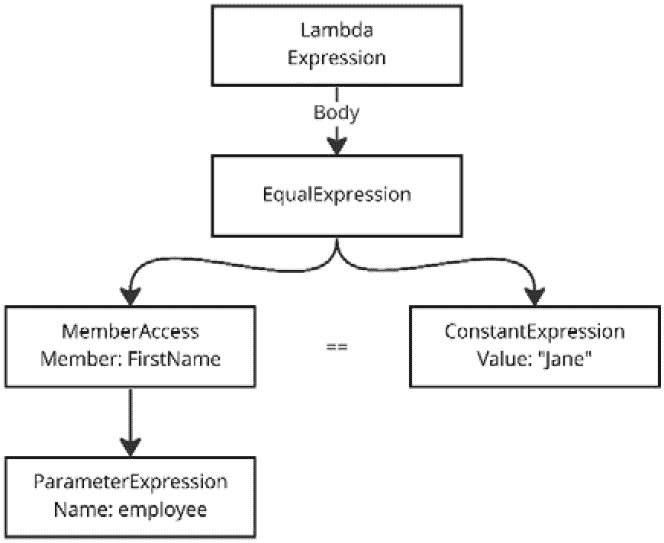
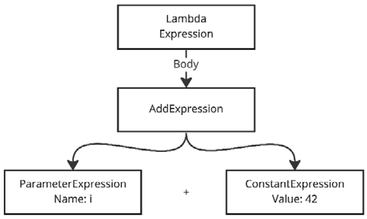

# 7

# 关于表达式的推理

到目前为止，我们已经探讨了捕获的强大元数据以及我们如何使用反射来访问它。我们还探讨了如何利用相同的元数据并在运行时动态生成代码。

使用反射和生成代码作为元编程的技术在元编程中非常强大，但它们并不适用于所有场景。这也可能非常复杂，并可能产生难以阅读甚至难以维护的代码，尤其是在深入反射和代理生成时。

在许多场景中，C#表达式可以代表更好的方法或特定场景的附加方法，用于运行时发现和提取元数据。

本章将涵盖以下主题：

+   表达式是什么？

+   遍历表达式树

+   使用表达式作为类型成员的描述符

从本章中，你应该理解表达式是什么以及你如何利用它们作为在运行时推理运行代码的技术。

# 技术要求

本章的特定源代码可以在 GitHub 上找到（[`github.com/PacktPublishing/Metaprogramming-in-C-Sharp/tree/main/Chapter7`](https://github.com/PacktPublishing/Metaprogramming-in-C-Sharp/tree/main/Chapter7)），并且它建立在[`github.com/PacktPublishing/Metaprogramming-in-C-Sharp/tree/main/Fundamentals`](https://github.com/PacktPublishing/Metaprogramming-in-C-Sharp/tree/main/Fundamentals)中找到的**基础知识**代码之上。

重要提示

**GetMemberExpression()**和**GetPropertyInfo()**方法都可以在 GitHub 仓库中的**基础知识**文件夹下的**ExpressionExtensions.cs**文件中找到。

# 表达式是什么？

**C# 3.0**于 2007 年底推出，其杀手级特性是所谓的**语言集成查询**（**LINQ**）。结合底层的 API 模型和 C#中新的功能，它引入了一种编程范式，将编程空间与更函数式编程空间相连接。如果你习惯了更面向对象的方法，流畅的接口和其使用的 lambda 表达式可能会感觉陌生。

它带来的好处是提供了一种以更自然、更本地的 C#方式表达数据查询的方法。这不仅适用于内存中的集合，也适用于任何其他数据源，如数据库。它基本上为开发者提供了一种表达查询、过滤和投影的统一方式。

它通过识别查询操作由以下三个不同的部分组成来实现这一点：

+   数据源

+   查询表达式

+   执行查询

让我们来看一个没有使用 LINQ 的例子，并将其与使用 LINQ 以更表达性的方式完成相同任务的方法进行比较：

```cs
int[] items = { 1, 2, 3, 42, 84, 37, 23 };
var filtered = new List<int>();
foreach (var item in items)
{
    if( item >= 37 )
    {
        filtered.Add(item);
    }
}
Console.WriteLine(string.Join(',', filtered));
```

运行此代码会打印出**42, 84, 37**，正如预期的那样。这种类型的问题的挑战在于它非常冗长，与数据源耦合，并且没有优化空间。

使用 LINQ 以及对前面提到的构成查询的三个不同部分的识别，存在一个概念叫做 **延迟执行**。查询的实际执行直到你开始枚举它才会发生。这意味着你可以在查询最终执行之前构建查询。执行是由查询提供者执行的，它可能是默认的内存中提供者，或者代表数据源（如数据库）的某种东西。

使用 LINQ 表示前面的示例要表达得多：

```cs
int[] items = { 1, 2, 3, 42, 84, 37, 23 };
var selectedItems =
    from i in items
    where i >= 37
    select i;
Console.WriteLine(string.Join(',', selectedItems));
```

代码的可读性大大提高，但幕后发生的事情是，它也变得更加灵活，可以根据查询运行的数据源进行优化。

LINQ 是 C# 的语言特性，没有 .NET 类库和 .NET 运行时的支持是无法工作的。这就是表达式发挥作用的地方。

作为同时发布的基类库的一部分，有一个新的命名空间叫做 **System.Linq**，以及其中另一个叫做 **System.Linq.Expressions** 的命名空间。这里的 *魔法* *精华* 就在这里。

C# 编译器使用 C# 3.0 中引入的另一个特性——扩展方法来翻译本机 LINQ 代码。扩展方法只是看起来像是它们扩展的实际类型的成员的静态方法，它们可以用来形成一个流畅的接口，可以链式调用方法。

从之前的 LINQ 代码出发，我们可以使用 **System.Linq** 命名空间中找到的表达式和扩展方法来表示它：

```cs
int[] items = { 1, 2, 3, 42, 84, 37, 23 };
var selectedItemsExpressions = items
    .Where(i => i >= 37)
    .Select(i => i);
Console.WriteLine(string.Join(',',
  selectedItemsExpressions));
```

到目前为止讨论的所有三种方法都做同样的事情，并输出相同的结果。最大的区别在于可读性。

由于我们的数据源只是一个内存中的数组，扩展方法会反映这一点，你将注意到它使用的 **.Where()** 方法的签名：

```cs
public static IEnumerable<TSource> Where<TSource>(this
  IEnumerable<TSource> source, Func<TSource, bool>
    predicate);
```

第一个参数是它扩展的源，**IEnumerable<TSource>**，第二个参数是 **Func<int, bool>**。这意味着你给它一个回调，该回调将被调用以决定在迭代过程中是否应该包含特定的值。

这并没有真正引出本章的主题。让我们稍微改变一下，以展示真正的魔法。

## 表达式

为了使 LINQ 能够针对不同的数据源和延迟执行按预期工作，有一个名为 **IQueryable** 的接口。**IQueryable** 接口是数据源可以实现的，它不再只是迭代数据源的一种命令式方法，现在它可以获取表示为表达式的查询。

**IQueryable** 接口为我们提供了不同的扩展方法，这些方法公开了 **Expression** 作为一种类型。让我们稍微改变一下数组过滤，并引入查询的概念：

```cs
int[] items = { 1, 2, 3, 42, 84, 37, 23 };
var selectedItemsExpressions = items
    .AsQueryable()  // Making the array a queryable
    .Where(i => i >= 37)
    .Select(i => i);
Console.WriteLine(string.Join(',', selectedItems
  Expressions));
```

**.AsQueryable()**数组从数组，或者更确切地说，从**IEnumerable<int>**变为**IQueryable<int>**。这意味着我们可以访问一系列扩展**IQueryable<>**的 LINQ 扩展方法。

如果你仔细观察**.Where()**方法，你会注意到现在有一个扩展方法具有以下签名：

```cs
public static IQueryable<TSource> Where<TSource>(this
  IQueryable<TSource> source, Expression<Func<TSource,
    bool>> predicate);
```

第一个参数是它扩展的源，第二个参数是**Expression<Func<TSource, bool>>**。这是最重要的部分。C#编译器识别任何表达式类型，而不是仅仅创建一个被调用的回调，而是将其展开为一个表达式。

为了调查编译器做了什么，我们可以将**where**子句单独成行，这样我们就可以在调试器中设置断点并查看发生了什么：

```cs
int[] items = { 1, 2, 3, 42, 84, 37, 23 };
// Extracted expression
Expression<Func<int, bool>> filter = (i) => i >= 37;
var selectedItemsExpressions = items
    .AsQueryable()
    .Where(filter)
    .Select(i => i);
Console.WriteLine(string.Join(',', selectedItems
  Expressions));
```

将表达式提取到自己的代码行中，我们可以轻松地看到编译器为我们生成了什么。通过在**filter**变量构造后设置断点，并在调试器的监视视图中查看**filter**变量，你可以看到以下内容：



图 7.1 – 过滤表达式

如你所见，它不再只是一个回调。它已经捕获了你所表达的所有细节。注意**Body**属性。这是内部表达式。在我们的例子中，类型被转换为**LogicalBinaryExpression**，它包含三个重要内容：

+   **左**

+   **NodeType**

+   **右**

**左**属性表示表达式左侧的内容，而**右**属性表示表达式右侧的内容。在这两者之间，操作符**NodeType**告诉我们它将要执行的操作。

对于**左**和**右**属性，你也会看到它们的类型是**Expression**。在这种情况下，**左**表达式是**PrimitiveParameterExpression**，表示参数，即我们在迭代或调用表达式时将传递的值。而**右**表达式变为**ConstantExpression**，持有具体值，**NodeType**属性设置为**GreaterThanOrEqual**，这正是**>=**所表达的含义。

## Lambda 表达式

当你使用**=>**符号时，你形成了一个被称为**lambda 表达式**的结构。Lambda 表达式是无名函数。Lambda 表达式分为以下两种类型：

+   Expression lambdas

+   Statement lambdas

表达式 lambda 的特点是右侧表达一个表达式。表达式 lambda 返回表达式的结果，其形式如下：

```cs
(input parameters) => expression
```

这是你在之前看到的表达式中使用的表达式类型：

```cs
Expression<Func<int, bool>> filter = (i) => i >= 37;
```

它的签名由**Func<int, bool>**定义，其中第一个泛型参数是使用的参数类型，最后一个泛型参数是返回类型。你可以有多个参数。

语句 lambda 的特点是它被括号 **{}** 包围，并且通常包含多个语句：

```cs
(input parameters) => { <sequence of statements> }
```

这可能类似于以下代码片段：

```cs
(string name) =>
{
    var message = $"Hello {name}";
    Console.WriteLIne(message);
}
```

在一个语句中，lambda 通常是一种无法进行推理的东西，因为它不会形成一个表达式树，而是在其中包含多个语句。

Lambdas 代表一个非常强大的结构，可以用来深入了解正在发生的事情。这同样也是一个很好的方法来帮助理解表达式是如何工作和构建的。

# 遍历表达式树

**Expression** 是一个简单的结构，表示树中的一个节点。表达式有一个节点类型，实现决定节点类型表达什么以及意味着什么。这形成了一个可以递归遍历和推理的树。

对于 lambda 表达式，这意味着它有一个由特定类型的表达式组成的主体；这个类型可以是包含左右操作数和表示操作符（等于、不等于等）的 **Binary Expression**：



图 7.2 – 二元表达式

以过滤器为例：

```cs
Expression<Func<int, bool>> filter = (i) => i >= 37;
```

从视觉上看，它看起来如下：



图 7.3 - 一个大于常量表达式的参数

操作数是 **大于或等于**，左侧访问传递给它的参数，右侧持有常量值 **37**。

表达式也可以表示访问作为参数传递的类型上的成员。

假设我们有一个名为 **Employee** 的对象，其外观如下：

```cs
public record Employee(string FirstName, string LastName);
```

一个过滤器访问名字并寻找名为 **Jane** 的人将看起来如下：

```cs
Expression<Func<Employee, bool>> employeeFilter =
  (employee) => employee.FirstName == "Jane";
```

解构表达式树，我们会看到它现在变成了以下形式：



图 7.4 – 成员访问等于常量表达式

由于我们现在正在访问一个成员，左侧的表达式现在是 **MemberAccessExpression**。**MemberAccessExpression** 上有一个表达式，表示持有成员的源，在我们的例子中，是一个传递进来的参数。为了获取实际的成员，**MemberAccessExpression** 拥有一个名为 **Member** 的属性。由于我们访问的成员是一个属性，它将是实际的 **PropertyInfo**。

表达式不仅用于过滤器；它们还可以表示其他操作。我们可能有一个表示添加值的表达式，如下所示：

```cs
Expression<Func<int, int>> addExpression = (i) => i + 42;
```

该表达式现在返回 **int** 而不是 **bool**，接受传递给它的参数，并加上 **42**。

表达式树如下图中所示：



图 7.5 – 参数添加常量表达式

正如你所见，节点类型是 **Add**。这只是你可以使用的许多表达式类型之一。你可以创建非常复杂的结构，并以抽象的方式表示 .NET 运行时本身能够运行的核心功能。我们将在 *第八章*，*构建和执行表达式* 中看到更多不同类型。

# 将表达式用作类型成员的描述符

表达式代表了一种以声明式方式描述意图的方法。而不是通过命令式方法，我们告诉计算机确切要做什么，我们可以声明式地描述它，并让代码决定最佳的处理方式。

正如我们之前在数字过滤中看到的那样，使用 **foreach** 的命令式方法不为我们打开任何其他执行方式，而使用 LINQ 和表达式方法，我们描述了我们想要的内容，执行是延迟的，我们不知道如何处理和执行，但我们得到的结果是相同的。

这种声明式思维可以是一种非常强大的方式来描述你希望你的系统有什么，也可以使你的代码更易于阅读，更容易被他人理解。命令式代码要求你彻底阅读和理解代码做了什么，而声明式方法描述了期望的结果，更容易推理。

显然，声明式模型在功能上有限，而命令式方法则完全灵活，你可以利用 C# 语言的全部功能。如果你可以使用流畅接口之类的工具声明式地描述事物，并充分利用 C# 扩展方法来持有表示命令式动作的方法，那么结合这两种方法是最好的。

让我们看看一个名为 **FluentValidation** 的库（[`docs.fluentvalidation.net/en/latest/`](https://docs.fluentvalidation.net/en/latest/)）。这是一个允许你流畅地编写输入验证的库。它充分利用了表达式，并为你提供了一个可使用扩展方法进行扩展的声明式模型，以描述你的意图。

以下是从他们的文档中的示例：

```cs
public class CustomerValidator : AbstractValidator<Customer>
{
  public CustomerValidator()
  {
    RuleFor(x => x.Surname).NotEmpty();
    RuleFor(x => x.Forename).NotEmpty().WithMessage("Please
      specify a first name");
    RuleFor(x => x.Discount).NotEqual(0).When(x =>
      x.HasDiscount);
    RuleFor(x => x.Address).Length(20, 250);
    RuleFor(x => x.Postcode).Must(
      BeAValidPostcode).WithMessage("Please specify a
      valid postcode");
  }
  private bool BeAValidPostcode(string postcode)
  {
    // custom postcode validating logic goes here
  }
}
```

验证器从名为 **AbstractValidator<>** 的基类型继承，在这个类型上有一个名为 **RuleFor()** 的方法。这个方法是描述传递给 **AbstractValidator<>** 的泛型参数上的属性规则的起点。**RuleFor()** 的签名如下所示：

```cs
public IRuleBuilderInitial<T, TProperty>
  RuleFor<TProperty>(Expression<Func<T, TProperty>>
    expression);
```

正如你所见，**RuleFor()** 的参数是一个表达式。预期的表达式是接受传递给 **AbstractValidator<>** 的类型作为参数并返回任何类型的表达式。**TProperty** 将由 C# 编译器从表达式中自动推断出来。

**FluentValidation** 使用这个表达式通过检查表达式来了解你正在验证哪个属性。

在本书的**基础知识**部分代码中，您将找到一个名为**ExpressionExtensions**的类，它具有用于执行与**FluentValidation**相同类型检查的辅助扩展方法。

由于表达式可以描述各种成员，并且表示该成员的代码是相同的，因此存在一种获取表示成员的表达式的方法：

```cs
public static MemberExpression GetMemberExpression(this
  Expression expression)
{
    var lambda = expression as LambdaExpression;
    if (lambda?.Body is UnaryExpression)
    {
        var unaryExpression = lambda.Body as
          UnaryExpression;
        return (MemberExpression)unaryExpression!.Operand!;
    }
    return (MemberExpression)lambda?.Body!;
}
```

代码假设传入的表达式是**LambdaExpression**，然后检查这是否是一个包含成员的**UnaryExpression**。如果不是**UnaryExpression**，我们假设它是**MemberExpression**。

如果它不是**MemberExpression**，这将导致无效的强制类型转换异常。您可能想要考虑检查类型并抛出一个更具体的异常。

检查**UnaryExpression**的原因是，对于值类型为**object**且实际值为需要转换、强制类型转换或拆箱以成为**object**类型的表达式，编译器可以决定插入一个执行此操作的**一元表达式**。

一旦您有了成员表达式，我们就可以获取实际的成员，作为表示属性的**System.Reflection**类型，即**PropertyInfo**：

```cs
public static PropertyInfo GetPropertyInfo(this Expression
  expression)
{
    var memberExpression = GetMemberExpression(expression);
    return (PropertyInfo)memberExpression.Member!;
}
```

代码调用**GetMemberExpression()**并将**Member**强制转换为**PropertyInfo**。如果成员不是**PropertyInfo**，这将抛出异常。您可能想要检查正确性并抛出一个更具体的异常。

通过返回**PropertyInfo**，您现在拥有了关于描述的属性、其名称和类型以及更多信息的所有所需信息。

# 摘要

本章我们学习了.NET 类库中的一个宝贵成员，称为表达式。得益于 C#编译器和运行时的共生关系，您得到了另一种推理运行代码的方法。

表达式代表了一种表示表达式的结构化方法。它与抽象语法树有某种相似之处，所有代码编译器在解析代码时都会生成抽象语法树。我们将在*第十五章*，*Roslyn* *编译器扩展*中了解更多。

如本章所见，表达式的类型不仅可以用于仅仅捕获信息，还可以更强大，捕获可以执行的操作。

在下一章中，我们将更深入地探讨表达式，看看您如何在运行时构建可以动态执行的表达式。
