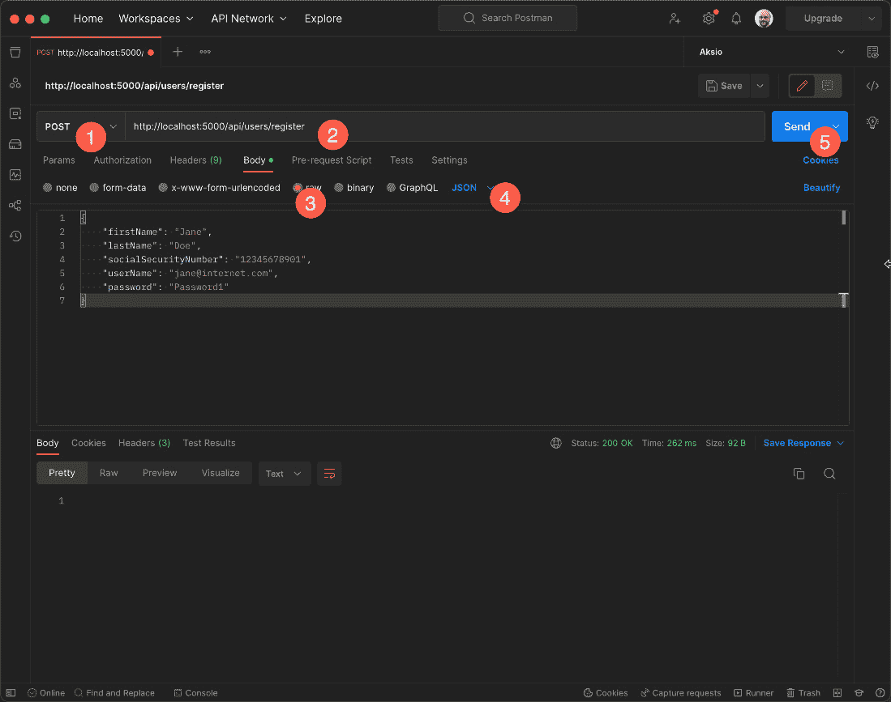
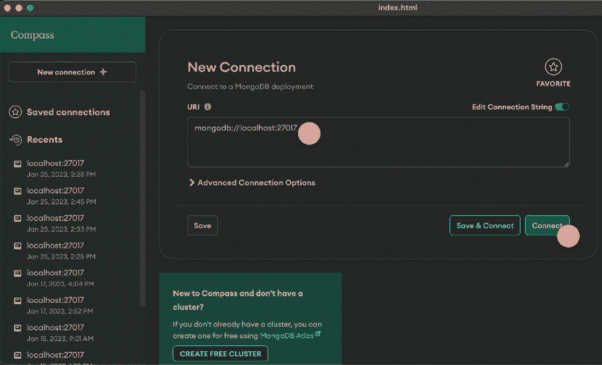
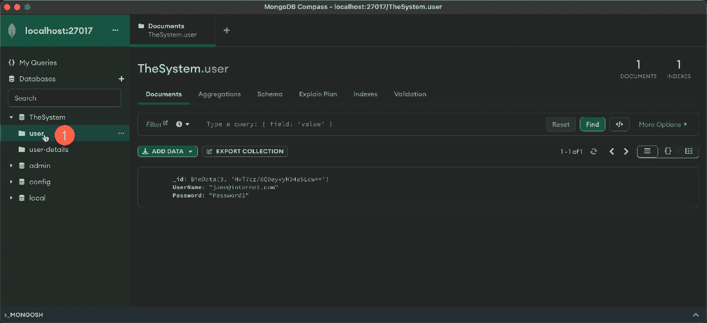

# 约定优于配置

我们的程序需要配置。这些配置中的一些是数据库连接字符串或我们正在调用的 REST API 的 URL 等。这些可能取决于我们的代码运行的不同环境（例如，开发、测试或生产）。除此之外，我们通常还需要配置我们的代码，以便能够按预期运行。我们进行的配置类型通常由我们使用的第三方库或框架决定。在增长型解决方案中，这种类型的配置也倾向于增长，并且由于配置通常在程序启动的特定点进行，因此最终成为这种类型事物的垃圾场的情况并不少见。

在本章中，我们将探讨如何利用我们在运行代码中已有的元数据的力量，使代码自动配置并因此变得更加一致。

我们将涵盖以下主题：

+   控制反转及其作用

+   通过约定自动进行 ServiceCollection 注册

到本章结束时，你将了解约定能为你做什么，以及它们如何使你更高效，并允许你创建更一致的代码库。

# 技术要求

本章的特定源代码可以在 GitHub 上找到 ([`github.com/PacktPublishing/Metaprogramming-in-C-Sharp/tree/main/Chapter10`](https://github.com/PacktPublishing/Metaprogramming-in-C-Sharp/tree/main/Chapter10))，它基于可在[`github.com/PacktPublishing/Metaprogramming-in-C-Sharp/tree/main/Fundamentals`](https://github.com/PacktPublishing/Metaprogramming-in-C-Sharp/tree/main/Fundamentals)找到的**基础知识**代码。

你需要安装 Docker Desktop ([`www.docker.com/products/docker-desktop/`](https://www.docker.com/products/docker-desktop/))、Postman ([`www.postman.com`](https://www.postman.com))以及 MongoDB 编辑器，如 Compass ([`www.mongodb.com/try/download/compass`](https://www.mongodb.com/try/download/compass))。

# 控制反转及其作用

当软件的源代码超过一页时，软件需要快速建立结构。通常，你会根据系统中的特定目的将事物逻辑地分组到类型中。随着你的软件被拆分以更好地维护，不同的部分通常相互依赖，以便能够执行你需要它完成的整体任务。

### 构建用户注册模块

让我们构建一个简单的系统，该系统处理作为 REST API 公开的用户注册功能。首先创建一个名为 **Chapter10** 的文件夹。在命令行中切换到该文件夹，并创建一个新的基于 Web 的项目：

```cs
dotnet new web
```

你想要捕获的信息类型包括个人信息以及我们希望作为我们 API 主体的用户凭证。添加一个名为 **RegisterUser.cs** 的文件，并将其添加以下内容：

```cs
namespace Chapter10;
public record RegisterUser(string FirstName, string
  LastName, string SocialSecurityNumber, string UserName,
    string Password);
```

**RegisterUser** 类型包含您想要为 API 用户捕获的所有不同属性。这不是您想要直接存储在数据库中的内容。当您存储这些信息时，您希望将其存储为两个独立的部分——用户凭据和用户详细信息。创建一个名为 **User.cs** 的文件，并将其添加以下内容：

```cs
namespace Chapter10;
public record User(Guid Id, string UserName, string
  Password);
```

**User** 类型仅捕获实际用户名和密码，并为用户有一个唯一的标识符。然后添加一个名为 **UserDetails** 的文件，并添加以下内容：

```cs
namespace Chapter10;
public record UserDetails(Guid Id, Guid UserId, string
  FirstName, string LastName, string SocialSecurityNumber);
```

**UserDetails** 包含我们从 **RegisterUser** 类型中获取的其余信息。

下一步我们需要的是一个 API 控制器来接收这些信息并将信息存储到数据库中。我们将使用 MongoDB 作为后端存储。

我们将依赖第三方库来访问 MongoDB。通过在终端中运行以下命令将包添加到项目中：

```cs
dotnet add package mongodb.driver
```

创建一个名为 **UsersController** 的文件，并将其添加以下内容：

```cs
using Microsoft.AspNetCore.Mvc;
using MongoDB.Driver;
namespace Chapter10;
[Route("/api/users")]
public class UsersController : Controller
{
    IMongoCollection<User> _userCollection;
    IMongoCollection<UserDetails> _userDetailsCollection;
    public UsersController()
    {
        var client = new MongoClient
          ("mongodb://localhost:27017");
        var database = client.GetDatabase("TheSystem");
        _userCollection = database.GetCollection<User>
          ("Users");
        _userDetailsCollection = database.GetCollection
          <UserDetails>("UserDetails");
    }
    [HttpPost("register")]
    public async Task Register([FromBody] RegisterUser
      userRegistration)
    {
        var user = new User(Guid.NewGuid(),
           userRegistration.UserName,
             userRegistration.Password);
        var userDetails = new UserDetails(Guid.NewGuid(),
           user.Id, userRegistration.FirstName,
             userRegistration.LastName, userRegistration
               .SocialSecurityNumber);
        await _userCollection.InsertOneAsync(user);
        await _userDetailsCollection.InsertOneAsync
          (userDetails);
    }
}
```

代码在其构造函数中设置数据库并获取我们将存储用户信息的两个不同集合。注册 API 方法然后将 **RegisterUser** 分解成两个相应的类型并将它们插入到各自的 MongoDB 集合中。

重要提示

在实际系统中，您显然会使用强大的（最好是单向的）加密策略来加密密码，而不仅仅是将其作为明文存储。

打开您的 **Program.cs** 文件，并使其看起来如下所示：

```cs
var builder = WebApplication.CreateBuilder(args);
builder.Services.AddControllers();
var app = builder.Build();
app.UseRouting();
app.UseEndpoints(_ => _.MapControllers());
app.Run();
```

在运行到目前为止的解决方案之前，您需要启动 MongoDB 服务器。您可以通过 Docker 来完成此操作。在您的终端中运行以下命令：

```cs
docker run -d -p 27017:27017 mongo
```

命令应启动 MongoDB 作为后台守护进程并公开端口 **27017**，以便您可以连接到它。您应该看到以下类似行：

```cs
9fb4b3c16d7647bfbb69eabd7863a169f6f2e4218191cc69c7454978627
f75d5
```

这是运行 Docker 图像的唯一标识符。

您现在可以从终端运行您到目前为止创建的代码：

```cs
dotnet run
```

您现在应该看到以下类似的内容：

```cs
info: Microsoft.Hosting.Lifetime[14]
      Now listening on: http://localhost:5000
info: Microsoft.Hosting.Lifetime[0]
      Application started. Press Ctrl+C to shut down.
info: Microsoft.Hosting.Lifetime[0]
      Hosting environment: Development
info: Microsoft.Hosting.Lifetime[0]
      Content root path: /Users/einari/Projects/
        Metaprogramming-in-C/Chapter10/
```

### 测试 API

到目前为止的代码，现在您有一个具有 **/api/users/register** 路由的 API，该路由接受 HTTP POST 请求。

您可以通过以下步骤使用 Postman 测试您的 API：

1.  选择 **POST**。

1.  输入 API 的 URL – **http://localhost:5000/api/user/register**。

1.  在 **Body** 选项卡中，选择 **Raw** 作为输入，然后选择 **JSON** 作为类型。

重要提示

URL 的端口号必须与输出中提到的端口号匹配，即 **Now listening on:** **http://localhost:{your port}**。



图 10.1 – 使用 Postman 测试 API

点击 **Send** 后，您应该在底部获得 **200 OK**。然后您可以打开 MongoDB 编辑器——例如，Compass，如预置要求中建议的那样。

创建一个新的 MongoDB 服务器连接并执行以下步骤：

1.  确保连接字符串指向您的 MongoDB 服务器。默认情况下，它应该显示 **mongodb://localhost:27017**，这与代码匹配。

1.  点击**连接**按钮。



图 10.2 – 创建新的连接

连接成功后，你应该在左侧看到数据库**TheSystem**以及其中的集合。点击**user**集合或**user-details**，你应该在右侧看到你注册的数据。



图 10.3 – 注册的数据

这一切都很正常，代码确实按照预期完成了它的任务。但代码可以改进。

## 代码重构

这种类型的代码有几个挑战：

+   首先，控制器正在承担基础设施的责任

+   其次，它还承担了实际领域逻辑的责任，并确切知道如何在数据库中存储数据

API 界面应该只依赖于其他子系统来完成它们特定的任务，然后委托给它们，而不是成为组合。

例如，我们可以将用户凭证注册和用户详细信息注册隔离成两个不同的服务，我们可以使用它们。

### 创建服务

让我们稍微拆分一下，并开始添加一些结构。创建一个名为**UsersService.cs**的文件，并使其看起来如下：

```cs
using MongoDB.Driver;
namespace Chapter10;
public class UsersService
{
    readonly IMongoCollection<User> _usersCollection;
    public UserService()
    {
        var client = new MongoClient
          ("mongodb://localhost:27017");
        var database = client.GetDatabase("TheSystem");
        _usersCollection = database.GetCollection<User>
          ("Users");
    }
    public async Task<Guid> Register(string userName,
      string password)
    {
        var user = new User(Guid.NewGuid(),
          userRegistration.UserName, userRegistration
            .Password);
        await _usersCollection.InsertOneAsync(user);
        return user.Id;
    }
}
```

代码在注册用户方面与**UsersController**中执行的操作完全相同，只是现在正式化为服务。让我们为用户详细信息做同样的事情。创建一个名为**UserDetailsService.cs**的文件，并使其看起来如下：

```cs
namespace Chapter10;
public class UserDetailsService
{
    readonly IMongoCollection<User> _userDetailsCollection;
    public UserDetailsService(IDatabase database)
    {
        var client = new MongoClient
          ("mongodb://localhost:27017");
        var database = client.GetDatabase("TheSystem");
        _userDetailsCollection = database.GetCollection
          <User>("UserDetails");
    }
    public Task Register(string firstName, string lastName,
      string socialSecurityNumber, Guid userId)
        => _userDetailsCollection_.InsertOneAsync
          (new(Guid.NewGuid(), userId, firstName, lastName,
            socialSecurityNumber));
}
```

与**UsersService**一样，代码与**UsersController**中的原始代码完全相同，但现在它是分离的，并且更加专注。

这是一个很好的步骤。现在，数据库的基础设施细节对外部世界是隐藏的，任何想要注册用户的人只需要关注完成注册所需的信息，而不需要关注它是如何完成的。

下一步是你需要将**UsersController**更改为利用新服务。

### 更改控制器

去更改控制器，使其看起来如下：

```cs
[Route("/api/users")]
public class UsersController : Controller
{
    readonly UsersService _usersService;
    readonly UserDetailsService _usersDetailsService;
    public UsersController()
    {
        _usersService = new UsersService();
        _userDetailsService = new UserDetailsService();
    }
    [HttpPost("register")]
    public async Task Register([FromBody] RegisterUser
       userRegistration)
    {
        await _usersService.Register(
            userRegistration.UserName,
            userRegistration.Password);
        await _userDetailsService.Register(
            userRegistration.FirstName,
            userRegistration.LastName,
            userRegistration.SocialSecurityNumber);
    }
}
```

代码在构造函数中创建**UsersService**类的实例，并在**Register** API 方法中直接使用**Register**方法。

如果你现在运行这个示例并再次执行**HTTP POST**，你将得到完全相同的结果。

**UsersService**和**UserDetailsService**现在是**UsersController**的依赖项，并且它作为实例创建这些依赖项。这有几个缺点。依赖项现在基本上遵循控制器的生活周期。由于控制器是每个 Web 请求创建一次，这意味着**UsersService**和**UserDetailsService**也将每次创建。这可能会成为性能问题，并且并不是控制器应该担心的问题。它的主要工作只是提供一个用于注册用户的 API 界面。

由于依赖项现在被硬编码，并且它带来了所有基础设施，这使得为**UsersController**编写测试变得非常困难，因为它使得单独测试**UsersController**的逻辑变得更加困难。

这就是依赖反转发挥作用的地方，通过反转关系，我们说系统，在我们的案例中是**UsersController**，不负责创建实例本身，而是将其作为构造函数的参数，并让任何实例化控制器的人负责提供**UsersController**所需的依赖项。

将**UsersController**修改为通过构造函数接受依赖项：

```cs
[Route("/api/users")]
public class UsersController : Controller
{
    readonly UsersService _usersService;
    readonly UserDetailsService _usersDetailsService;
    public UsersController(
        UsersService usersService,
        UserDetailsService userDetailsService)
    {
        _usersService = usersService;
        _userDetailsService = userDetailsService;
    }
    [HttpPost("register")]
    public async Task Register([FromBody] RegisterUser userRegistration)
    {
        await _usersService.Register(
            userRegistration.UserName,
            userRegistration.Password);
        await _userDetailsService.Register(
            userRegistration.FirstName,
            userRegistration.LastName,
            userRegistration.SocialSecurityNumber);
    }
}
```

代码现在接受**UsersService**和**UserDetailsService**作为参数，并直接使用它们，而不是自己创建它们的实例。

现在，依赖关系对外部世界来说非常清晰。因此，**UsersService**的生命周期可以在控制器之外进行管理。

然而，由于控制器正在处理具体的实例，它仍然与基础设施紧密相连。这可以通过解耦基础设施并使其更易于测试来改进。

### 基于契约

为了进一步改进，我们还可以将**UsersService**和**UserDetailsService**的内容提取到接口中，并使用这些接口。这样做的好处是，您将解耦具体实现及其基础设施需求，并通过允许不同的实现以及根据配置或系统处于特定状态来切换接口的实现来增加代码的灵活性。

将内容提取到接口中的另一个好处是，这使得编写仅关注被测试单元及其依赖项交互的测试变得更加容易，而无需引入整个基础设施来编写自动化测试。

创建一个名为**IUsersService.cs**的文件，并使其看起来如下：

```cs
namespace Chapter10;
public interface IUsersService
{
    Task<Guid> Register(string userName, string password);
}
```

代码保留了与原始**UsersService**类中相同的签名的**Register**方法。然后，**UsersService**的实现仅通过添加**IUsersService**继承来改变。打开**UsersService**文件，使其实现**IUsersService**接口：

```cs
public class UsersService : IUsersService
{
    /*
    Same code as before within the UsersService
    */
}
```

对于**UserDetailsService**，我们想要做同样的事情。添加一个名为**IUserDetailsService.cs**的文件，并使其看起来如下：

```cs
namespace Chapter10.Structured;
public interface IUserDetailsService
{
    Task Register(string firstName, string lastName, string
      socialSecurityNumber, Guid userId);
}
```

代码保留了与原始**UserDetailsService**类中相同的签名的**Register**方法。然后，**UserDetailsService**的实现仅通过添加**IUserDetailsService**继承来改变。打开**UserDetailsService**文件，使其实现**IUserDetailsService**接口：

```cs
public class UserDetailsService : IUserDetailsService
{
    /*
    Same code as before within the UserDetailsService
    */
}
```

通过这两项更改，我们现在可以改变表达依赖关系的方式。在**UsersController**中，您将使用**UsersService**改为**IUsersService**，并将**UserDetailsService**改为**IUserDetailsService**：

```cs
[Route("/api/users")]
public class UsersController : Controller
{
    readonly IUsersService _usersService;
    readonly IUserDetailsService _userDetailsService;
    public UsersController(
        IUsersService usersService,
        IUserDetailsService userDetailsService)
    {
        _usersService = usersService;
        _userDetailsService = userDetailsService;
    }
    // Same register API method as before would go here
}
```

现在的代码使用它们的接口来获取两个 **IUsersService** 和 **IUserDetailsService** 依赖项，其余代码保持不变。

到目前为止，我们已经讨论了依赖项和 **依赖反转原则** 的好处。然而，我们还需要能够提供这些依赖项。如果我们必须手动在系统各处提供这些依赖项，并以不同的方式维护它们的生命周期，这将非常不切实际。它可能导致非常混乱、难以维护的代码库，也可能导致未知副作用。

你真正需要的是一种为你管理这些的机制。这就是所谓的**控制反转容器**（**IoC 容器**）。它的任务是保存有关所有服务的信息，包括用于什么接口的实现，以及这些服务的生命周期。IoC 容器是一个集中式的组件，你需要在应用程序开始时进行配置，配置完成后，你可以要求它提供已注册的任何实例。这对于注册任何类型的依赖项非常有用，而不仅仅是那些作为实现接口的依赖项。你可以注册具体类型、代理类型，或者几乎任何东西。

IoC 容器递归地工作，并将处理依赖项的依赖项，并正确地解决所有问题。

在 ASP.NET Core 中，IoC 容器的概念已经默认设置好，并且使用名为 **ServiceCollection** 的机制非常容易使用，其中你可以设置所有服务注册。

# 通过约定自动注册 ServiceCollection

我们现在将代码留在了非功能状态。这是因为内置的 IoC 容器不知道如何解决 **IUsersService** 依赖项和 **IUserDetailsService**。

你需要明确告诉 ASP.NET 应该使用哪个实现。打开你的 **Program.cs** 文件，并按照以下方式添加绑定：

```cs
var builder = WebApplication.CreateBuilder(args);
builder.Services.AddControllers();
// Add these two lines to bind the services
builder.Services.AddSingleton<IUsersService,
  UsersService>();
builder.Services.AddSingleton<IUserDetailsService,
  UserDetailsService>();
var app = builder.Build();
app.UseRouting();
app.UseEndpoints(_ => _.MapControllers());
app.Run();
```

代码在 ASP.NET Core 的 **ServiceCollection** 中添加了一个注册项，将 **IUsersService** 解析为 **UsersService**，并且它还明确指出应该将其添加为 **单例**。这意味着在进程内将只有一个此类服务的实例。

现在，你应该又有一个正常工作的程序了，唯一的区别现在就是 ASP.NET 的 IoC 容器正在为你解析实例，并且对于每个请求，它都将使用相同的实例。

重要提示

单例可能会很危险。如果一个类型作为单例，它依赖于不应该作为单例但应该在每个请求中都是新的东西，那么这个单例类型将成为一个阻碍。要明智地使用它们。

到目前为止，代码非常简洁且简单。在实际系统中，你通常会希望通过将代码划分为更专注的单元来更加清晰地划分责任。

## 进一步重构

目前 **UsersService** 承担的责任过多。数据库部分不是它应该拥有的东西。知道如何创建数据库连接是应该提取出来，以便你在同一个地方做这件事。要意识到你系统中每个单元的责任。

让我们引入一个表示数据库的单位。首先，通过向项目中添加一个名为 **IDatabase.cs** 的文件来创建一个接口，并使其看起来如下：

```cs
using MongoDB.Driver;
namespace Chapter10;
public interface IDatabase
{
    IMongoCollection<T> GetCollectionFor<T>();
}
```

该接口使我们能够通过泛型指定类型来获取 MongoDB 集合。

重要提示

通过为数据库创建一个抽象，我们可以进一步争论，可以创建一个代表你通常执行的数据库操作的东西，这符合所谓的存储库模式。如果你这样做，你会很快发现你将无法与底层数据库及其功能一起工作。此外，对于本书的上下文，我们将保持在这个级别。

在有了 **IDatabase** 接口之后，你现在需要一个实现它的实现。创建一个名为 **Database.cs** 的文件，并将其添加如下：

```cs
using MongoDB.Driver;
namespace Chapter10;
public class Database : IDatabase
{
    static readonly Dictionary<Type, string>
      _typeToCollectionName = new()
    {
        { typeof(User), "Users" },
        { typeof(UserDetails), "UserDetails" }
    };
    readonly IMongoDatabase _mongoDatabase;
    public Database()
    {
        var client = new MongoClient
          ("mongodb://localhost:27017");
        _mongoDatabase = client.GetDatabase("TheSystem");
    }
    public IMongoCollection<T> GetCollectionFor<T>() =>
      _mongoDatabase.GetCollection<T>(_typeToCollectionName
        [typeof(T)]);
}
```

代码包含了你在 **UsersService** 中大部分的数据库访问，但增加了将类型映射到集合名称的维度。

作为一个小插曲，但仍然是在约定优于配置的主题上，让我们稍微改进一下 **Database** 类。在类的顶部，有一个将 **Type** 映射到集合名称的映射。这是随着时间的推移而增长的东西。如果你查看 **User** 类型，它被映射到 **Users** – 我更喜欢这种约定，因为集合名称是复数形式，表示有多个用户。

重要提示

约定优于配置的概念是由 David Heinemeier Hansson 提出的，用来描述 Ruby on Rails 网络框架的哲学。你可以在这里了解更多信息：[`rubyonrails.org/doctrine#convention-over-configuration`](https://rubyonrails.org/doctrine#convention-over-configuration)。

这是可以自动化的，真正是约定优于配置。让我们引入一个第三方库来为我们处理复数化。转到你的终端，并在 **Chapter10** 文件夹中运行以下命令：

```cs
dotnet add package Humanizer
```

**Humanizer** 库默认知道如何复数化英语单词，但它也支持其他语言。我建议你到 GitHub 上了解更多信息（[`github.com/Humanizr/Humanizer`](https://github.com/Humanizr/Humanizer)）。

安装了包后，你可以改进和简化你的 **Database** 代码。将 **Database** 类修改如下：

```cs
using Humanizer;
using MongoDB.Driver;
namespace Chapter10.Structured;
public class Database : IDatabase
{
    readonly IMongoDatabase _mongoDatabase;
    public Database()
    {
        var client = new MongoClient("mongodb://
          localhost:27017");
        _mongoDatabase = client.GetDatabase("TheSystem");
    }
    public IMongoCollection<T> GetCollectionFor<T>() =>
      _mongoDatabase.GetCollection<T>(typeof(T).Name
        .Pluralize());
}
```

代码几乎相同，只是你现在不再有**Dictionary**来映射**Type**和集合名称。对于**GetCollection()**方法，你不再需要进行查找，而是直接使用类型名称，并在其上使用**.Pluralize()**扩展方法。通过这种方式，你以非常简单的方式利用了类型元数据。

通过这次修复，你基本上使你的代码具备了未来性，并且不需要对代码进行开放心脏手术来添加对新集合的支持。这是一个可预测的约定。

由于你现在已经将系统的基础设施部分封装到了**Database**类中，你现在可以开始修复**UserService**和**UserDetailsService**，以便利用这个核心组件。

首先，将**UsersService**修改成以下样子：

```cs
namespace Chapter10;
public class UsersService : IUsersService
{
    readonly IDatabase _database;
    public UsersService(IDatabase database)
    {
        _database = database;
    }
    public async Task<Guid> Register(string userName,
      string password)
    {
        var user = new User(Guid.NewGuid(), userName,
          password);
        await _database.GetCollectionFor<User>()
          .InsertOneAsync(user);
        return user.Id;
    }
}
```

代码现在完全去除了对数据库连接的管理以及如何获取集合的管理，甚至不再需要集合的名称，而是引入**IDatabase**作为依赖项，并让该接口的实现承担全部的基础设施责任。现在这只是一个约定，你可以相信它将为提供的类型提供一个可预测的集合名称。

你需要对**UserDetailsService**做同样的操作。修改成以下样子：

```cs
namespace Chapter10.Structured;
public class UserDetailsService : IUserDetailsService
{
    readonly IDatabase _database;
    public UserDetailsService(IDatabase database)
    {
        _database = database;
    }
    public Task Register(string firstName, string lastName,
      string socialSecurityNumber, Guid userId)
        => _database.GetCollectionFor<UserDetails>()
          .InsertOneAsync(new(Guid.NewGuid(), userId,
            firstName, lastName, socialSecurityNumber));
}
```

与**UsersService**一样，代码更改几乎相同，引入了**IDatabase**基础设施依赖，并让**UserDetailsService**专注于其主要的任务，即注册用户详情。

代码重构的活动导致了一个更加解耦的系统和一个更易于维护的系统，其中每个组件都专注于做一件事，单一职责。现在需要将其整合起来。

## 组合

将系统拆分成专注的组件后，我们需要将其整合起来。由于 IoC 容器不知道如何解析**IDatabase**，我们需要添加这个绑定。将你的**Program.cs**修改成以下样子：

```cs
var builder = WebApplication.CreateBuilder(args);
builder.Services.AddControllers();
builder.Services.AddSingleton<IUsersService,
  UsersService>();
builder.Services.AddSingleton<IUserDetailsService,
  UserDetailsService>();
// Add these two lines to bind the services
builder.Services.AddSingleton<IDatabase, Database>();
var app = builder.Build();
app.UseRouting();
app.UseEndpoints(_ => _.MapControllers());
app.Run();
```

代码添加了**.AddSingleton<IDatabase, Database>()**调用，以注册**IDatabase**和**Database**之间的绑定，并说明我们只需要它是一个单例。此时，你应该又拥有了一个正常工作的系统。运行这个程序并使用 Postman 进行 API 调用，应该会得到与之前相同的结果。

然而，这里已经有点代码异味了。我们必须手动添加注册到 IoC 容器中的每一项，这又是一次必须进行的开放心脏手术。对于只有几个组件，这不仅变得繁琐，而且很快就会使**Program.cs**成为此类配置的垃圾场。

幸运的是，有一个模式我们可以将其转变为一种约定。所有的实现都有一个接口表示，其名称与实现相同，只是前面加了一个大写字母 *I*。这是一个非常常见的约定。我们可以通过发现接口和实现之间的联系来使代码更具未来性。

尽管我们可以发现实现和接口之间的关系，但我们不知道如何知道它们的生命周期。为了做到这一点，我们将知道生命周期的责任转移到实现上。我们通过引入以属性形式存在的元数据来实现这一点。默认行为应该是我们进行的每个绑定都是 **transient**，这意味着每次我们向 IoC 容器请求时都会得到一个新的实例。然后我们只需要为覆盖该行为提供属性。对于这个示例，我们将只保留一个生命周期：单例。

添加一个名为 **SingletonAttribute.cs** 的文件，并使其看起来如下：

```cs
namespace Chapter10;
[AttributeUsage(AttributeTargets.Class)]
public sealed class SingletonAttribute : Attribute
{
}
```

代码代表了一个属性，它适用于类，并允许你在发现过程中查找，并决定它是否是一个单例。

让我们利用在先决条件中提到的 GitHub 仓库中提到的 **Fundamentals** 项目。你应该通过在终端执行以下操作来为这一章添加对该项目的引用：

```cs
dotnet add reference ../Fundamentals/Fundamentals.csproj
```

重要提示

项目的路径可能因你的计算机而异，取决于你从 GitHub 仓库中获取的 **Fundamentals** 项目。

你现在想要做的是为 **IServiceCollection** 创建一个扩展方法，你一直用它来注册绑定。

首先，添加一个名为 **ServiceCollectionExtensions.cs** 的文件，并使其看起来如下：

```cs
using Fundamentals;
namespace Chapter10;
public static class ServiceCollectionExtensions
{
    public static IServiceCollection AddBindingsBy
      Convention(this IServiceCollection services, ITypes
        types)
    {
        return services;
    }
}
```

这段代码仅设置了一个名为 **AddBindingsByConvention()** 的新扩展方法，它还从 **Fundamentals** 中获取 **ITypes** 系统，并返回给它的 **services**，以便在使用方法时能够进行链式调用。

前往并添加以下代码到 **AddBindingsConvention()** 方法的顶部：

```cs
Func<Type, Type, bool> convention = (i, t) => i.Namespace
  == t.Namespace && i.Name == $"I{t.Name}";
var conventionBasedTypes = types!.All.Where(_ =>
{
    var interfaces = _.GetInterfaces();
    if (interfaces.Length > 0)
    {
        var conventionInterface = interfaces
          .SingleOrDefault(i => convention(i, _));
        if (conventionInterface != default)
        {
            return types!.All.Count(type => type
              .HasInterface(conventionInterface)) == 1;
        }
    }
    return false;
});
```

代码使用 **ITypes** 来获取系统中所有发现的数据类型。对于每一个类型，它都会检查该类型是否实现了任何接口。如果实现了接口，它将检查是否有任何接口符合约定。约定是接口类型和实现类型必须在同一个命名空间中，并且接口类型必须与实现类型的名称匹配，只是前面加了一个大写字母 *I*。

这样做将得到一个符合约定的类型集合。接下来，你需要添加代码来注册绑定。在 **AddBindingsByConvention()** 方法中添加以下代码之后：

```cs
foreach (var conventionBasedType in conventionBasedTypes)
{
    var interfaceToBind = types.All.Single(_ =>
      _.IsInterface && convention(_, conventionBasedType));
    if (services.Any(_ => _.ServiceType == interfaceTo
      Bind))
    {
        continue;
    }
    _ = conventionBasedType.HasAttribute
        <SingletonAttribute>() ?
        services.AddSingleton(interfaceToBind,
          conventionBasedType) :
        services.AddTransient(interfaceToBind,
          conventionBasedType);
}
```

代码遍历所有遵循约定的类型，获取实际的接口，然后根据实现是否具有 **SingletonAttribute** 将其绑定为单例或瞬态。

让我们使用属性将所有服务设置为单例。打开**Database.cs**文件，在类型声明前添加**SingletonAttribute**：

```cs
[Singleton]
public class Database : IDatabase
{
    // Keep your original code
}
```

对于**UserDetailsService**也做同样的操作：

```cs
[Singleton]
public class UserDetailsService : IUserDetailsService
{
    // Keep your original code
}
```

然后对**UsersService**也做同样的操作。

```cs
[Singleton]
public class UsersService : IUsersService
{
    // Keep your original code
}
```

您现在需要做的就是更改程序启动。打开**Program.cs**，将其更改为以下内容：

```cs
using Chapter10;
using Fundamentals;
var builder = WebApplication.CreateBuilder(args);
builder.Services.AddControllers();
// Create an instance of Types and register it with the IoC
var types = new Types();
builder.Services.AddSingleton<ITypes>(types);
// Add all the bindings based on convention
builder.Services.AddBindingsByConvention(types);
var app = builder.Build();
app.UseRouting();
app.UseEndpoints(_ => _.MapControllers());
app.Run();
```

代码从所有不同服务的显式绑定变为现在利用**Fundamentals**中的**Types**类，将其绑定为一个单例，然后添加所有由惯例发现的绑定。

运行您的应用程序应该仍然给您带来相同的行为，并且它应该以完全相同的方式工作。唯一的区别是现在一切都是通过惯例，您只需添加内容，无需进行任何配置。

# 摘要

在本章中，您已经尝到了惯例在具体日常 C#编码中的强大作用，了解了如何通过优化注册服务接口的常见场景来提高在 ASP.NET Core 中使用 IoC 容器的工作体验。我们还探讨了通过契约设计如何帮助您创建一个更加灵活且易于测试的系统。

“惯例优于配置”的概念可能是对我个人职业生涯影响最大的事情。它使您的代码更加一致，如果您未能保持一致，代码将无法工作，这本身就是一个好事，因为那时您将不得不修复代码以使其更加一致。

不必配置一切，只需能够添加代码，这确实能大大提高生产力，任何参与项目的人都会为此感谢您。然而，您需要向所有团队成员清楚地说明这些惯例，否则他们可能不会感谢您。没有什么比代码似乎任意地工作或不工作更糟糕的了。请记录下来，并清楚地说明事物是如何运作的。

值得一提的是，惯例并非适用于所有项目，也并非适用于所有团队。为了使惯例有意义，团队需要接受这种工作方式。如果团队更喜欢阅读代码并看到所有内容都明确设置，那么惯例只会造成混淆。如果项目非常小，可能不值得付出认知上的开销。

在下一章中，我们将更深入地探讨开放/封闭原则，这是我们本章中提到的内容，并看看它如何使您的代码库受益。
