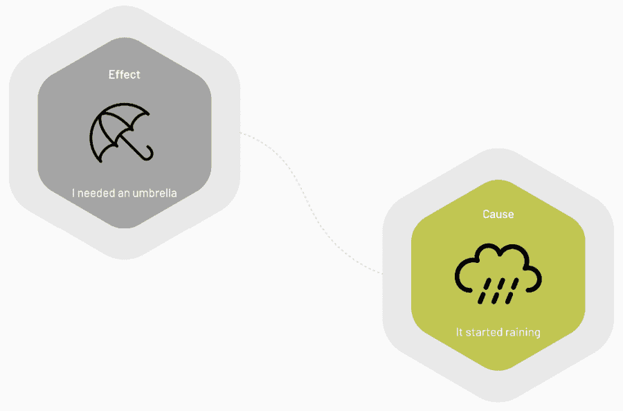
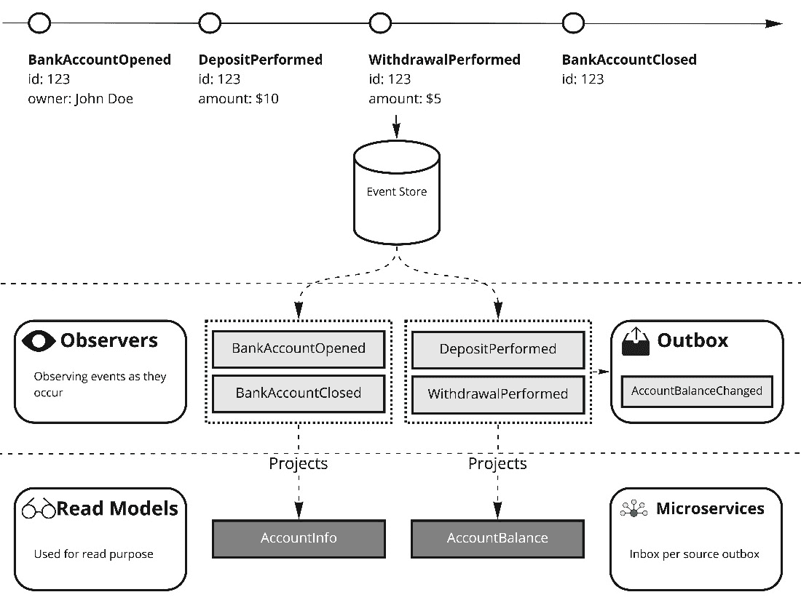
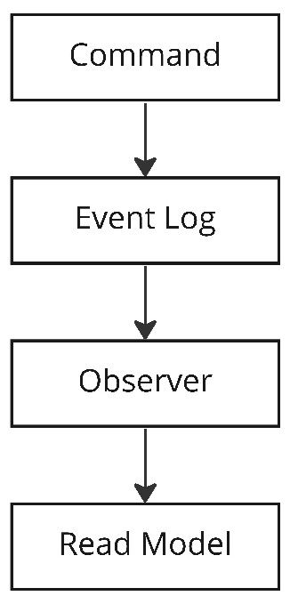

# 超越继承

在像 C#这样的面向对象语言中，我们可以从其他类型派生我们的类型，我们还可以实现契约（接口）并使它们满足该契约。实现接口并使实现满足这些契约是类型安全语言的一大优点。有了编译器，我们可以确保我们实现了契约，而在运行时，我们可以利用接口类型作为表示，而不是必须知道实际的实现者。

然而，有时实现接口的冗长性可能过多。它也可能仅限于你试图实现的目标。

在本章中，我们将涵盖以下主题：

+   方法签名约定

+   到本章结束时，你将了解约定如何让你超越必须从基类型或接口继承的需求，以及有时这如何有助于更干净的代码库。

# 技术要求

本章的特定源代码可以在 GitHub 上找到（[`github.com/PacktPublishing/Metaprogramming-in-C-Sharp/tree/main/Chapter12`](https://github.com/PacktPublishing/Metaprogramming-in-C-Sharp/tree/main/Chapter12)），并且它建立在[`github.com/PacktPublishing/Metaprogramming-in-C-Sharp/tree/main/Fundamentals`](https://github.com/PacktPublishing/Metaprogramming-in-C-Sharp/tree/main/Fundamentals)中找到的**基础**代码之上。

# 方法签名约定

提出一个好的例子来为一本书的主题做一次完美的展示可能非常困难。对于本章，我决定选择我日常工作的一部分内容。

我与一个以事件驱动架构为中心的平台合作，更具体地说，是与事件溯源。这个主题可能对你来说很陌生，所以让我们深入了解这个具体是什么，以便为你提供背景。

在传统的**CRUD**（代表**创建、读取、更新、删除**）系统中，主要关注的是通常存储在关系型或文档数据库中的具体数据。这些系统围绕着四个基本操作——创建新记录、检索现有记录、更新记录和删除记录。

这样的系统中的数据代表用户操作的结果，系统的流程通常遵循从用户输入表单到数据库的一对一映射。然而，这种软件开发方法有一个显著的缺点——它只捕捉效果，而不是原因。

在事件溯源中，效果并不那么重要，关键是捕捉导致效果的原因。原因捕捉了我们如何得出结论，如下面的图所示：



图 12.1 – 捕获原因

原因被称为事件——系统中发生的事情。我们通过给它们一个清晰的名字来捕捉这些事件，并将它们按发生的顺序存储。事件永远不会被删除。所有事件都存储在被称为**事件存储**的地方。有一些技术专门从事这项工作，例如我正在工作的平台，称为 Cratis ([`cratis.io`](https://cratis.io))，但您也可以使用任何数据库并自行完成这项工作。

通过优先捕获事件，我们获得了控制效果呈现方式的能力。这是通过在事件发生时从各种事件类型中提取相关信息，然后将其转换为易于访问的专用对象来实现的。这些对象通常存储在传统的数据存储中，如关系型或文档数据库，这允许高效地查询最终结果。

这种方法的一个主要优势是，事件存储成为系统中的真相来源，而不是仅仅依赖于传统的数据存储。这意味着修改数据表示方式变得显著更容易，因为您只需在实施更改时简单地重放相关事件。您还可以决定拥有多个表示形式，以满足系统内的特殊需求。这可能会带来巨大的性能优势，以及代码的清晰度，并避免在开发系统中常见的一种紧张关系，即共享相同的数据和对象。

以下图显示了一个假想的银行系统，其中产生了事件以及它们如何投影到被称为读取模型的实体对象中。它还显示了在微服务为中心的架构中，通过投影到可以超出系统边界进行通信的事件，与其他系统或微服务的关系。



图 12.2 – 产生事件的假想银行系统

观察者是这种架构的关键元素。他们是负责观察事件发生并产生效果的那些人。大部分情况下，效果以投影到存储的读取模型的形式出现，但它们也可能执行其他任务，例如发送电子邮件，或者实际上，作为观察者执行分析的结果，追加新事件。

我们希望在本章中将这些观察者作为例子提出来。让我们将其缩小到以下图所示的管道：



图 12.3 – 逻辑管道

命令代表用户希望执行的操作。该操作通常会决定应该生成什么事件，或者可能是多个事件。这些事件随后被附加到事件存储中的主事件日志中。事件日志是按发生顺序持有所有事件的序列，并带有递增的序列号。

一旦事件进入事件日志，我们希望通知所有感兴趣的观察者事件已被附加，并且他们应该做出反应。

下图更具体地展示了我们想要实现的内容，并将成为本章示例的基础。

![img/B19418_12_04.jpg]

图 12.4 – 具体管道

为了能够做到这一点，你需要一些基础设施来提供这些约定。

# 基础设施

让我们创建一个基础结构，以便拥有能够响应附加事件的观察者。

让我们在你的仓库根目录下创建一个名为**Chapter12**的文件夹。在命令行界面中切换到这个文件夹，并创建一个新的控制台项目：

```cs
dotnet new console
```

你将利用微软托管模型来获取.NET 默认服务提供者，而无需启动一个 Web 应用程序。为了实现这一点，你需要一个名为**Microsoft.Extensions.Hosting**的包。在终端中，你可以通过以下方式添加引用：

```cs
dotnet add package Microsoft.Extensions.Hosting
```

下一步你需要做的是引用**Fundamentals**项目。在终端中，执行以下操作：

```cs
dotnet add reference ../Fundamentals/Fundamentals.csproj
```

正如我在*第四章*中讨论的，*使用反射进行类型推理*，我在所有代码中做的一件事是正式化类型而不是使用原始类型。这使得 API 更加清晰，并有助于避免错误。

你将使用**ConceptAs<>**来正式化类型。

在**Chapter12**文件夹内，创建一个专门用于**EventSourcing**基础设施的文件夹，并将其命名为**EventSourcing**。

在**EventSourcing**文件夹内，创建一个名为**EventSourceId.cs**的文件，并使其看起来如下：

```cs
using Fundamentals;
namespace EventSourcing;
public record EventSourceId(string Value) :
  ConceptAs<string>(Value)
{
    public static EventSourceId New() =>
      new(Guid.NewGuid().ToString());
}
```

**EventSourceId**概念表示事件源的唯一标识符。在领域建模中，这通常是领域内一个对象、名词的标识符。这个例子可以是银行账户的唯一标识符或系统中个人的唯一标识符。**EventSourceId**代码为**ConceptAs<>**设置，并将内部值设为字符串，基本上允许任何唯一标识符的表示。它添加了一个方便的方法来创建新的**EventSourceId**，通过利用**Guid**，这可以即时生成一个唯一标识符。你将在后面使用**EventSourceId**，它将变得更为清晰为什么需要它。

当将事件附加到一系列事件中，正如我们之前讨论的，每个事件都会得到一个序列号。这是一个增量数字，每次添加事件时增加 1。让我们正式化一个表示这个数字的类型。

在**EventSourcing**文件夹内，创建一个名为**EventSequenceNumber.cs**的文件，并使其看起来如下：

```cs
using Fundamentals;
namespace EventSourcing;
public record EventSequenceNumber(ulong Value) :
  ConceptAs<ulong>(Value)
{
    public static implicit operator
      EventSequenceNumber(ulong value) => new(value);
}
```

代码引入了一个具体的**EventSequenceNumber**类型，它是**ConceptAs<>**，其内部值为**ulong**类型。使用**ulong**，您可以得到完整的 64 位值，这应该足以作为增量序列号。为了方便，还有一个隐式运算符可以将**ulong**转换为封装的**EventSequenceNumber**类型。

对于您稍后要添加的观察者，您将使用一个属性来标记它们是观察者。这种方法的替代方案是使用一个空接口。这样做的目的是仅仅能够标记一个类型，使其可以被发现。

在**EventSourcing**文件夹中，创建一个名为**ObserverAttribute.cs**的文件，并使其看起来如下：

```cs
namespace EventSourcing;
[AttributeUsage(AttributeTargets.Class, AllowMultiple =
  false)]
public sealed class ObserverAttribute : Attribute
{
}
```

代码引入了一个可以添加到类中的属性。

对于观察者方法，您通常除了实际事件本身外，还会找到与事件相关的信息。您想了解的信息类型是**EventSourceId**、**EventSequenceNumber**以及事件发生的时间。我们称之为**EventContext**。

在**EventSourcing**文件夹中，创建一个名为**EventContext.cs**的文件，并使其看起来如下：

```cs
namespace EventSourcing;
public record EventContext(
    EventSourceId EventSourceId,
    EventSequenceNumber SequenceNumber,
    DateTimeOffset Occurred);
```

代码以**DateTimeOffset**的形式持有**EventSourceId**、**SequenceNumber**和**Occurred**。在一个完整的事件源系统中，我们通常会保留更多细节，但这对这个例子就足够了。

为了使事件可发现并被分类为事件，您将需要在基础设施中有一个构建块。

在**EventSourcing**文件夹中，创建一个名为**IEvent.cs**的文件，并使其看起来如下：

```cs
namespace EventSourcing;
public interface IEvent { }
```

现在是精彩的部分：将发现符合某些标准的类型的代码。

我们正在寻找的约定是允许两种基本方法签名及其两种变体，支持同步和异步模型。

同步签名如下：

```cs
void <name-of-method>(YourEventType @event);
void <name-of-method>(YourEventType @event, EventContext
  context);
```

然后异步签名如下：

```cs
Task <name-of-method>(YourEventType @event);
Task <name-of-method>(YourEventType @event, EventContext
  context);
```

如您所见，该约定不关心方法名称，而只关心参数和返回类型。这为开发者提供了创建更精确命名的方法的灵活性，并增加了代码的可读性和可维护性，这是常规继承所不允许的。

让我们创建一个系统，使得可以通过约定调用方法。

在**EventSourcing**文件夹中，创建一个名为**ObserverHandler.cs**的文件，并使其看起来如下：

```cs
using System.Reflection;
namespace EventSourcing;
public class ObserverHandler
{
    readonly Dictionary<Type, IEnumerable<MethodInfo>>
      _methodsByEventType;
    readonly IServiceProvider _serviceProvider;
    readonly Type _targetType;
    public IEnumerable<Type> EventTypes =>
      _methodsByEventType.Keys;
    public ObserverHandler(IServiceProvider
      serviceProvider, Type targetType)
    {
        _serviceProvider = serviceProvider;
        _targetType = targetType;
        _methodsByEventType =
          targetType.GetMethods(BindingFlags.Instance |
          BindingFlags.NonPublic | BindingFlags.Public)
                                        .Where(_ =>
                                      IsObservingMethod(_))
                                        .GroupBy(_ =>
                                      _.GetParameters()[0].
                                      ParameterType)
                                        .ToDictionary(_ =>
                                      _.Key, _ =>
                                      _.ToArray()
                                      .AsEnumerable());
    }
}
```

代码为**ObserverHandler**类设置了基础。构造函数接受两个参数，**serviceProvider**和**targetType**。当需要处理事件时，**serviceProvider**参数将用于获取表示观察者的**targetType**的实例。在构造函数中，代码使用反射来查找实例方法，包括公共和非公共方法。

然后，通过一个名为**IsObservingMethod()**的方法过滤出与签名匹配的方法，你将在下一个步骤中添加它。然后，它根据方法的第一参数（即事件类型）进行分组，并创建一个字典以实现快速查找。

重要提示

注意添加的**EventTypes**属性；这暴露了处理程序支持的事件类型，这将在以后很有用。

在 LINQ 查询中，它使用**IsObservingMethod()**方法，这是一个应该位于**ObserverHandler**类内部的方法。在**ObserverHandler**类的底部添加以下私有方法：

```cs
bool IsObservingMethod(MethodInfo methodInfo)
{
    var isObservingMethod =
      methodInfo.ReturnType.IsAssignableTo(typeof(Task)) ||
                            methodInfo.ReturnType ==
                              typeof(void);
    if (!isObservingMethod) return false;
    var parameters = methodInfo.GetParameters();
    if (parameters.Length >= 1)
    {
        isObservingMethod = parameters[0]
          .ParameterType.IsAssignableTo(typeof(IEvent));
        if (parameters.Length == 2)
        {
            isObservingMethod &= parameters[1]
              .ParameterType == typeof(EventContext);
        }
        else if (parameters.Length > 2)
        {
            isObservingMethod = false;
        }
        return isObservingMethod;
    }
    return false;
}
```

为了识别允许的签名，代码会检查**MethodInfo**，并首先识别允许的返回类型，这些类型是**Task**或**void**。如果返回类型不是有效的观察方法，它将被视为无效。然后代码继续检查方法的参数。如果一个方法有一个参数，并且其类型实现了**IEvent**接口，它就符合观察方法的资格。或者，如果一个方法有两个参数，第一个参数类型实现了**IEvent**，第二个参数类型是**EventContext**，那么它也被归类为观察方法。

在发现部分就绪后，你所需要的只是一个理解约定并能调用观察者方法的方法。

在**ObserverHandler**类中，添加以下代码：

```cs
public async Task OnNext(IEvent @event, EventContext
  context)
{
    var eventType = @event.GetType();
    if (_methodsByEventType.ContainsKey(eventType))
    {
        var actualObserver =
          _serviceProvider.GetService(_targetType);
        Task returnValue;
        foreach (var method in
          _methodsByEventType[eventType])
        {
            var parameters = method.GetParameters();
            if (parameters.Length == 2)
            {
                returnValue =
                  (Task)method.Invoke(actualObserver, new
                  object[] { @event, context })!;
            }
            else
            {
                returnValue =
                  (Task)method.Invoke(actualObserver, new
                  object[] { @event })!;
            }
            if (returnValue is not null) await returnValue;
        }
    }
}
```

**OnNext()**方法负责对观察者进行调用；它通过接受任何类型实现**IEvent**接口的事件和事件对应的**EventContext**来实现。从这些信息中，它根据观察者支持的事件类型，在构造函数中填充的**_methodsByEventType**中找到相应的方法。如果支持，它将继续通过服务提供者获取观察者类型的实例。对于每个方法，它根据方法的正确签名进行调用，如果方法是异步的，它将等待返回的**Task**。

与处理调用的具体处理程序一起，你需要一个了解所有观察者并能调用正确观察者的服务。

在**EventSourcing**文件夹中，创建一个名为**IObservers.cs**的文件，并使其看起来如下：

```cs
namespace EventSourcing;
public interface IObservers
{
    Task OnNext(IEvent @event, EventContext context);
}
```

代码代表了**IObservers**的契约。**OnNext()**方法将是系统调用以知道事件何时发生的方法。

你将需要一个此接口的实现。

在**EventSourcing**文件夹中，创建一个名为**Observers.cs**的文件，并使其看起来如下：

```cs
using System.Reflection;
using Fundamentals;
namespace EventSourcing;
[Singleton]
public class Observers : IObservers
{
    readonly IEnumerable<ObserverHandler> _handlers;
    public Observers(ITypes types, IServiceProvider
      serviceProvider)
    {
        _handlers = types.All.Where(_ =>
          _.HasAttribute<ObserverAttribute>())
                            .Select(_ =>
                            {
                                var observer =
                                  _.GetCustomAttribute
                                  <ObserverAttribute>()!;
                                return new
                                  ObserverHandler(
                                  serviceProvider, _);
                            });
    }
}
```

代码利用**ITypes**从基础中进行发现。代码扫描所有类型，并过滤掉那些没有**ObserverAttribute**的类型，只留下具有**ObserverAttribute**的类型。对于每个具有**ObserverAttribute**的类型，它通过传递**serviceProvider**和目标类型（即观察者本身）来创建一个**ObserverHandler**实例。

为了调用处理器，您需要一个实现**OnNext()**方法的实例。在**Observers**类中，在底部添加以下方法：

```cs
public Task OnNext(IEvent @event, EventContext context)
{
    var tasks = _handlers.Where(_ =>
      _.EventTypes.Contains(@event.GetType()))
                        .Select(_ => _.OnNext(@event,
                          context));
    return Task.WhenAll(tasks);
}
```

代码通过查看处理器的**EventTypes**属性以及它是否包含**@event**参数的类型来筛选出能够处理的事件处理器，然后调用处理器的**OnNext()**方法，并收集它所做所有调用中的所有**Task**实例，以便它可以等待它们全部完成。

在建立了观察者基础设施之后，您需要某种触发器。我们不会实现一个完整的工作事件源系统，因为这会过于复杂。相反，我们将采取一些捷径，并且不会将事件保存到任何地方。

在事件源系统中，您需要一个地方将事件追加到序列中；您追加到的主要地方称为事件日志。让我们介绍这个概念。

在**EventSourcing**文件夹内，创建一个名为**IEventLog.cs**的文件，并使其看起来如下：

```cs
namespace EventSourcing;
public interface IEventLog
{
    Task Append(EventSourceId eventSourceId, IEvent
      @event);
}
```

代码代表了这个版本的事件日志合约，其中只有一个方法，这使您能够为特定的**EventSourceId**追加一个事件。

您需要一个实现**IEventLog**接口的实例。

在**EventSourcing**文件夹内，创建一个名为**EventLog.cs**的文件，并使其看起来如下：

```cs
namespace EventSourcing;
public class EventLog : IEventLog
{
    readonly IObservers _observers;
    EventSequenceNumber _sequenceNumber = 0;
    public EventLog(IObservers observers)
    {
        _observers = observers;
    }
    public async Task Append(EventSourceId eventSourceId,
      IEvent @event)
    {
        // TODO: persist the event
        await _observers.OnNext(
            @event,
            new EventContext(eventSourceId,
              _sequenceNumber, DateTimeOffset.UtcNow));
        _sequenceNumber++;
    }
}
```

代码代表了一个非常简单的实现，它直接依赖于**IObservers**来调用，当事件被追加时。它内部管理**_sequenceNumber**。正如您所看到的，这里没有持久化，整个实现至多算是天真。但它服务于本章的目的。

现在您已经为通过约定在观察者上调用方法建立了所有这些美好的基础设施，您可能渴望将其付诸实践。

# 使用基础设施

沿着本章的银行主题，让我们创建一些代表该领域的东西。在银行中，您可以开设账户，从账户中存钱和取钱，然后可能最终关闭账户。所有这些都是在账户生命周期中发生的重要事件。

在章节代码的根目录下，创建一个名为**Events.cs**的文件，并使其看起来如下：

```cs
using EventSourcing;
namespace Chapter12;
public record BankAccountOpened(string CustomerName) :
  IEvent;
public record BankAccountClosed() : IEvent;
public record DepositPerformed(decimal Amount) : IEvent;
public record WithdrawalPerformed(decimal Amount) : IEvent;
```

代码现在持有我们想要的全部事件，它们都是**record**类型，并且都实现了**IEvent**接口。

重要提示

在生产环境中，我建议每个类型保留一个文件，因为这使您更容易在系统中导航和发现事件。

在事件就绪后，你现在可以继续创建观察者，它们将对发生的事件做出反应。

在章节代码的根目录下创建一个名为**AccountLifecycle.cs**的文件，并使其看起来如下所示：

```cs
using EventSourcing;
namespace Chapter12;
[Observer]
public class AccountLifecycle
{
    public Task Opened(BankAccountOpened @event)
    {
        Console.WriteLine($"Account opened for
          {@event.CustomerName}");
        return Task.CompletedTask;
    }
    public Task Closed(BankAccountClosed @event,
      EventContext context)
    {
        Console.WriteLine($"Account with id
          {context.EventSourceId} closed");
        return Task.CompletedTask;
    }
}
```

代码添加了一个名为**AccountLifecycle**的类，并使用**[Observer]**属性对其进行装饰。它的目的是仅处理**BankAccountOpened**和**BankAccountClosed**的生命周期事件。请注意，它完全遵循约定，使用自定义方法名称和不同的签名。

对于影响账户余额的事件，你可以将这部分特定逻辑分离成它自己的观察者。

在章节代码的根目录下创建一个名为**AccountBalance.cs**的文件，并使其看起来如下所示：

```cs
using EventSourcing;
namespace Chapter12;
[Observer]
public class AccountBalance
{
    public Task DepositPerformed(DepositPerformed @event,
      EventContext context)
    {
        Console.WriteLine($"Deposit of {@event.Amount}
          performed on {context.EventSourceId}");
        return Task.CompletedTask;
    }
    public Task WithdrawalPerformed(WithdrawalPerformed
      @event, EventContext context)
    {
        Console.WriteLine($"Withdrawal of {@event.Amount}
          performed on {context.EventSourceId}");
        return Task.CompletedTask;
    }
}
```

代码添加了一个名为**AccountBalance**的类，并使用**[Observer]**属性对其进行装饰。它的目的是仅处理**DepositPerformed**和**WithdrawalPerformed**的余额事件。

这两个观察者只是将发生的事情记录到控制台。在实际实现这些时，你可能想要将数据存储在某个地方。这里的优点是你可以将数据存储在两个不同的位置。对于生命周期事件，你只对所有权和与账户相关的任何细节感兴趣，而对于余额事件，你只对影响余额的内容感兴趣，而不对其他任何事情感兴趣。将这些事情分开来使得选择合适的技术和独立地建模每个部分以及创建一个松耦合的系统变得更加容易。

现在你想要进行最后的连接，向其抛出一些事件并验证它是否完成了工作。

打开**Program.cs**文件，使其看起来如下所示：

```cs
using Chapter12;
using EventSourcing;
using Fundamentals;
using Microsoft.Extensions.DependencyInjection;
using Microsoft.Extensions.Hosting;
var host = Host.CreateDefaultBuilder()
    .ConfigureServices((context, services) =>
    {
        var types = new Types();
        services.AddSingleton<ITypes>(types);
        services.AddBindingsByConvention(types);
        services.AddSelfBinding(types);
    })
    .Build();
```

代码设置了必要的管道代码，以启动默认的.NET 控制反转容器；它利用你在*第十章*，*约定优于配置*中创建的**AddBindingsByConvention()**来通过约定连接服务，以及你在*第十一章*，*应用开闭原则*中创建的**AddSelfBinding()**。

在基本基础设施就绪后，你现在可以请求**IEventLog**的实例并将其开始附加事件。

在**Program.cs**文件的底部添加以下代码：

```cs
var eventLog = host.Services
  .GetRequiredService<IEventLog>();
var bankAccountId = EventSourceId.New();
eventLog.Append(bankAccountId, new BankAccountOpened("Jane
  Doe"));
eventLog.Append(bankAccountId, new DepositPerformed(100));
eventLog.Append(bankAccountId, new
  WithdrawalPerformed(32));
eventLog.Append(bankAccountId, new BankAccountClosed());
```

运行你的程序应该给出类似的输出：

```cs
Account opened for Jane Doe
Deposit of 100 performed on a3d7dbae-9e2a-4d2d-a070-
ead70e48f87a
Withdrawal of 32 performed on a3d7dbae-9e2a-4d2d-a070-
ead70e48f87a
Account with id a3d7dbae-9e2a-4d2d-a070-ead70e48f87a closed
```

你现在有了事件源组件的开始。但更重要的是，它应该给你一个动态执行而不必严格依赖于继承的想法。

作为使用继承而不是这种方式进行操作的后果的说明，我们需要一个定义事件方法的接口；它可能看起来如下所示：

```cs
public interface IObserveEvent<TEvent> where TEvent :
  IEvent
{
    Task Handle(TEvent @event, EventContext context);
}
```

使用此接口，我们可以对**AccountLifecycle**观察者执行以下操作：

```cs
public class AccountLifecycle :
    IObserveEvent<BankAccountOpened>,
    IObserveEvent<BankAccountClosed>
{
    public Task Handle(BankAccountOpened @event,
      EventContext context)
    {
        Console.WriteLine($"Account opened for
          {@event.CustomerName}");
        return Task.CompletedTask;
    }
    public Task Handle(BankAccountClosed @event,
      EventContext context)
    {
        Console.WriteLine($"Account with id
          {context.EventSourceId} closed");
        return Task.CompletedTask;
    }
}
```

虽然使用这种方法可以提供编译时安全性，但也有一些缺点需要考虑。首先，给每个方法命名**Handle**可能会导致歧义和混淆，无论是在工具使用上还是可读性方面。如果不仔细检查参数，可能很难确定要使用哪个方法。此外，这种方法限制你只能处理一个事件的一个方法，而基于约定的方法则允许有多个具有特定目的的独立方法来处理事件的不同方面。

如果你有一个处理多个事件的观察者，你将不得不为它处理的每个类型实现**IObserveEvent<>**。这可能会使你的代码的可读性和可维护性降低。

这两种方法都有利有弊，但希望你能从中获得这种潜力，并且希望它对你所工作的代码库是有用且适用的。

# 摘要

约定，就像本章中解释的通过发现已知的签名，可以非常强大，并有助于清理你的代码。强迫开发者为每个支持的类实现一个接口可能会很繁琐，并使代码看起来有些奇怪。

使用方法签名约定的缺点显然是，你现在完全依赖于运行时检查；没有编译器能帮助你。如果你不小心犯了一点错误，它直到运行时才会被发现，这在专注开发时可能会非常恼人。在*第十七章*，“静态代码分析”中，我们将探讨如何在编译时检测错误。

在下一章中，我们将探讨如何通过约定进一步实现自动化，将开发者置于成功的深渊，并避免基于食谱的开发。
